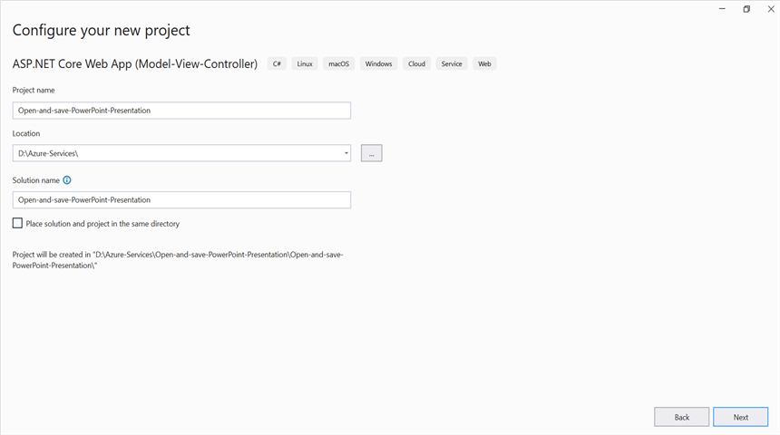
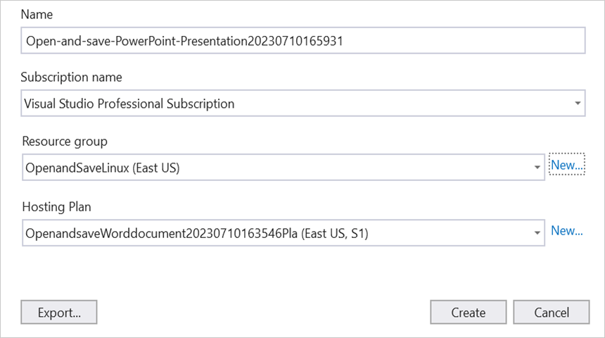
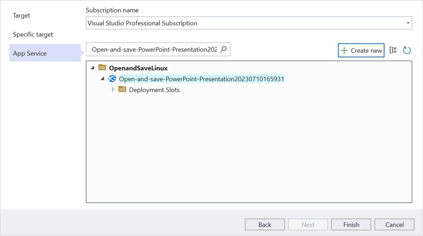
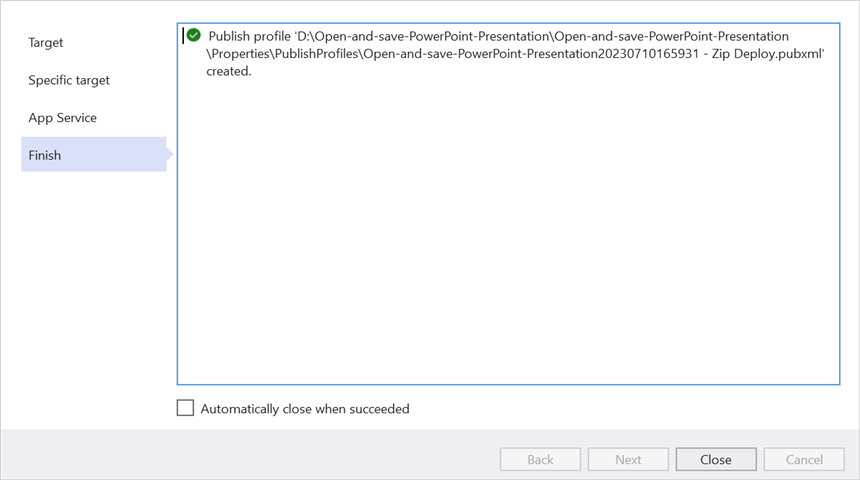
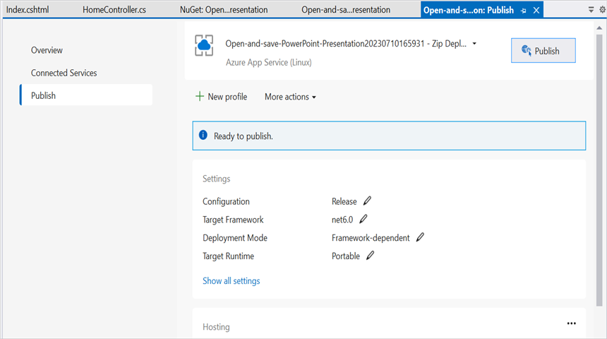
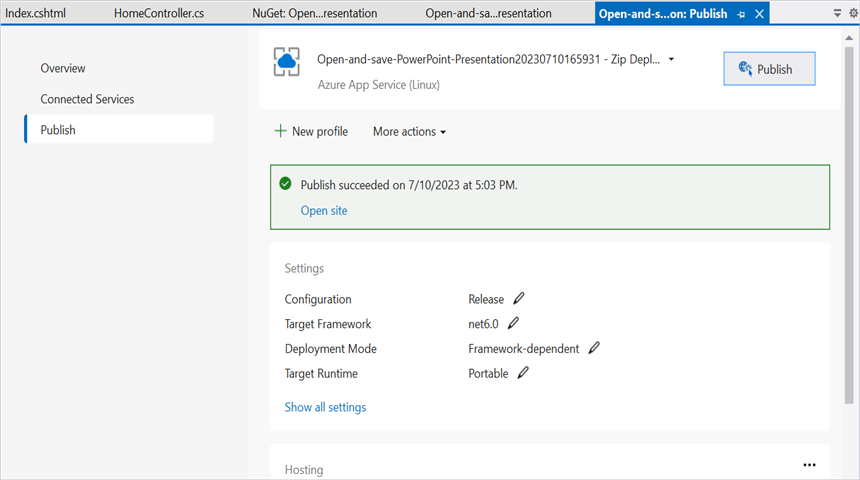
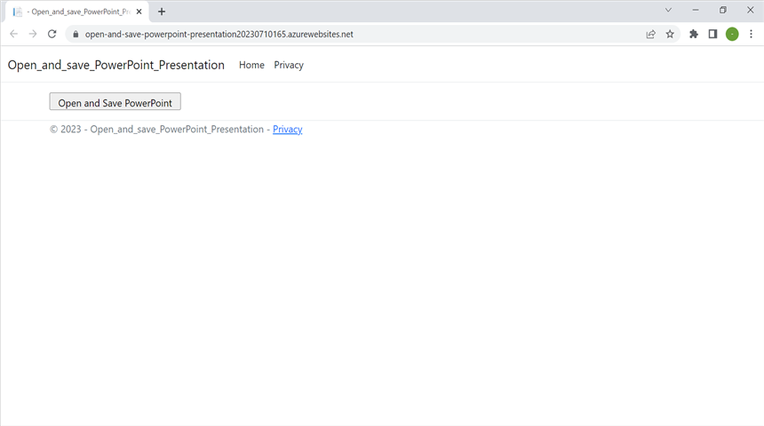

# Open and save PowerPoint in Azure App Service on Linux

Syncfusion PowerPoint is a [.NET Core PowerPoint library](https://www.syncfusion.com/document-processing/powerpoint-framework/net-core) used to create, read, edit and convert PowerPoint documents programmatically without **Microsoft PowerPoint** or interop dependencies. Using this library, you can **open and save a PowerPoint in Azure App Service on Linux**.

## Steps to Open and save PowerPoint in Azure App Service on Linux

Step 1: Create a new ASP.NET Core Web App (Model-View-Controller).

Step 2: Create a project name and select the location.

Step 3: Click **Create** button.

Step 4: Install the [Syncfusion.Presentation.Net.Core](https://www.nuget.org/packages/Syncfusion.Presentation.Net.Core) NuGet package as a reference to your project from [NuGet.org](https://www.nuget.org/).

N> Starting with v16.2.0.x, if you reference Syncfusion assemblies from trial setup or from the NuGet feed, you also have to add "Syncfusion.Licensing" assembly reference and include a license key in your projects. Please refer to this [link](https://help.syncfusion.com/common/essential-studio/licensing/overview) to know about registering Syncfusion license key in your application to use our components.

Step 5: Add a new button in the **Index.cshtml** as shown below.




@{
    Html.BeginForm("OpenAndSavePowerPoint", "Home", FormMethod.Get);
    {
        

            <input type="submit" value="Open and Save PowerPoint" style="width:220px;height:27px" />
        

    }
    Html.EndForm();
}




Step 6: Include the following namespaces in **HomeController.cs**.




using Syncfusion.Presentation;




Step 7: Add a new action method **OpenAndSavePresentation** in HomeController.cs and include the below code snippet to **open an existing Presentation in Azure App Service on Linux**.




string pptxPath = Path.Combine(_hostingEnvironment.WebRootPath, "Data/Template.pptx");
using FileStream fileStreamPath = new FileStream(pptxPath, FileMode.Open, FileAccess.Read);
//Open an existing PowerPoint presentation.
using IPresentation pptxDoc = Presentation.Open(fileStreamPath);




Step 8: Add below code snippet demonstrates accessing a shape from a slide and changing the text within it.




//Get the first slide from the PowerPoint presentation.
ISlide slide = pptxDoc.Slides[0];
//Get the first shape of the slide.
IShape shape = slide.Shapes[0] as IShape;
//Change the text of the shape.
if (shape.TextBody.Text == "Company History")
    shape.TextBody.Text = "Company Profile";




Step 9: Add below code example to **save the PowerPoint Presentation in Azure App Service on Linux**.




//Save the PowerPoint Presentation as stream.
MemoryStream pptxStream = new();
pptxDoc.Save(pptxStream);
pptxStream.Position = 0;
//Download Powerpoint document in the browser.
return File(pptxStream, "application/powerpoint", "Result.pptx");




## Steps to publish as Azure App Service on Linux

Step 1: Right-click the project and select **Publish** option.

Step 2: Click the **Add a Publish Profile** button.

Step 3: Select the publish target as **Azure**.

Step 4: Select the Specific target as **Azure App Service (Linux)**.

Step 5: To create a new app service, click **Create new** option.

Step 6: Click the **Create** button to proceed with **App Service** creation.

Step 7: Click the **Finish** button to finalize the **App Service** creation.

Step 8: Click **Close** button.

Step 9: Click the **Publish** button.

Step 10: Now, Publish has been succeeded.

Step 11: Now, the published webpage will open in the browser. 

Step 12: Click **Open and Save PowerPoint** button.You will get the output **PowerPoint document** as follows.

You can download a complete working sample from [GitHub](https://github.com/SyncfusionExamples/PowerPoint-Examples/tree/master/PPTX-to-PDF-conversion/Convert-PowerPoint-presentation-to-PDF/Azure/Azure_App_Service).

Click [here](https://www.syncfusion.com/document-processing/powerpoint-framework/net-core) to explore the rich set of Syncfusion PowerPoint Library (Presentation) features. 

