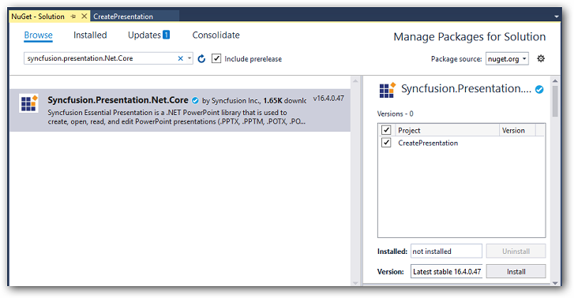

# Open and save Presentation in Blazor

Syncfusion PowerPoint is a [.NET Core PowerPoint library](https://www.syncfusion.com/document-processing/powerpoint-framework/net-core) used to create, read, edit and convert PowerPoint documents programmatically without **Microsoft PowerPoint** or interop dependencies. Using this library, you can **open and save a Presentation in Blazor**.

## Server app

Step 1: Create a new C# Blazor Server app project. Select Blazor App from the template and click the Next button.

Step 2: Now, the project configuration window will popup. Click Create button to create a new project with the required project name.

Step 3: Choose **Blazor Server App** and click Create button to create a new Blazor Server app for .NET Core 3.0.0-preview9.

Step 4: Install the [Syncfusion.Presentation.Net.Core](https://www.nuget.org/packages/Syncfusion.Presentation.Net.Core/) NuGet package as reference to your .NET Standard applications from [NuGet.org](https://www.nuget.org/).

N> Starting with v16.2.0.x, if you reference Syncfusion assemblies from trial setup or from the NuGet feed, you also have to add "Syncfusion.Licensing" assembly reference and include a license key in your projects. Please refer to this [link](https://help.syncfusion.com/common/essential-studio/licensing/overview) to know about registering Syncfusion license key in your application to use our components.

Step 5: Create a razor file with name as **Presentation** under **Pages** folder and include the following namespaces in the file.




@page "/presentation"
@using System.IO;
@using Open_and_save_PowerPoint;
@inject Open_and_save_PowerPoint.Data.PowerPointService service
@inject Microsoft.JSInterop.IJSRuntime JS




Step 6: Add the following code to create a new button.




<h2>Syncfusion PowerPoint library (Essential Presentation)</h2>

Syncfusion Blazor PowerPoint library (Essential Presentation) used to create, read, edit, and convert PowerPoint files in your applications without Microsoft Office dependencies.

<button class="btn btn-primary" @onclick="@OpenAndSavePresentation">Open and Save Presentation</button>




Step 7: Add the following code in **Presentation.razor** file to create and download the **Presentation document**.




@code {
    MemoryStream documentStream;
    /// 

    /// Generate and download the PowerPoint Presentaion
    /// 

    protected async void OpenAndSavePresentation()
    {
        documentStream = service.OpenAndSavePresentation();
        await JS.SaveAs("Result.pptx", documentStream.ToArray());
    }
}




Step 8: Create a new cs file with name as **PowerPointService** under Data folder and include the following namespaces in the file.




using Syncfusion.Presentation;




Step 9: Create a new MemoryStream method with name as **OpenAndSavePresentation** in **PowerPointService** class and include the following code snippet to **open an existing PowerPoint Presentation in Blazor Server app**.




using (FileStream sourceStreamPath = new FileStream(@"wwwroot/Template.pptx", FileMode.Open, FileAccess.Read, FileShare.ReadWrite));
//Open an existing PowerPoint Presentation.
using (IPresentation pptxDoc = Presentation.Open(sourceStreamPath));




Step 10: Add below code snippet demonstrates accessing a shape from a slide and changing the text within it.




//Get the first slide from the PowerPoint Presentation.
ISlide slide = pptxDoc.Slides[0];
//Get the first shape of the slide.
IShape shape = slide.Shapes[0] as IShape;
//Change the text of the shape.
if (shape.TextBody.Text == "Company History")
    shape.TextBody.Text = "Company Profile";




Step 11: Add below code example to **save the PowerPoint Presentation in Blazor Server app**.




//Save the PowerPoint Presentation as stream.
MemoryStream pptxStream = new();
pptxDoc.Save(pptxStream);
pptxStream.Position = 0;
//Download Powerpoint document in the browser.
return pptxStream;



            
Step 12: Create a new class file in the project, with name as FileUtils and add the following code to invoke the JavaScript action to download the file in the browser.




public static class FileUtils
{
    public static ValueTask<object> SaveAs(this IJSRuntime js, string filename, byte[] data)
    => js.InvokeAsync<object>(
        "saveAsFile",
        filename,
        Convert.ToBase64String(data));
}




Step 13: Add the following JavaScript function in the _Host.cshtml in the Pages folder.







You can download a complete working sample from [GitHub](https://github.com/SyncfusionExamples/PowerPoint-Examples/tree/master/Read-and-save-PowerPoint-presentation/Open-and-save-PowerPoint/Blazor/Server-side-application).

By executing the program, you will get the **PowerPoint document** as follows.

Click [here](https://www.syncfusion.com/document-processing/powerpoint-framework/blazor) to explore the rich set of Syncfusion PowerPoint Library (Presentation) features.

## WASM app

Step 1: Create a new C# Blazor WASM app project. Select Blazor App from the template and click the Next button.

Step 2: Now, the project configuration window will popup. Click Create button to create a new project with the required project name.

Step 3: Choose Blazor WebAssembly App and click Create button to create a new Blazor WASM app for .NET Core 3.0.0-preview9.

Step 4: To **create a PowerPoint document in WASM app**, install [Syncfusion.Presentation.Net.Core](https://www.nuget.org/packages/Syncfusion.Presentation.Net.Core) to the Blazor project.

N> Starting with v16.2.0.x, if you reference Syncfusion assemblies from trial setup or from the NuGet feed, you also have to add "Syncfusion.Licensing" assembly reference and include a license key in your projects. Please refer to this [link](https://help.syncfusion.com/common/essential-studio/licensing/overview) to know about registering Syncfusion license key in your application to use our components.

Step 5: Create a razor file with name as ``Presentation`` under ``Pages`` folder and add the following namespaces in the file.




@page "/presentation"
@inject Microsoft.JSInterop.IJSRuntime JS
@inject HttpClient client
@using Syncfusion.Presentation
@using System.IO




Step 6: Add the following code to create a new button.




<h2>Syncfusion PowerPoint library (Essential Presentation)</h2>

Syncfusion Blazor PowerPoint library (Essential Presentation) used to create, read, edit, and convert PowerPoint files in your applications without Microsoft Office dependencies.

<button class="btn btn-primary" @onclick="@OpenAndSavePresentation">Open and Save Presentation</button>




Step 7: Create a new async method with name as ``OpenAndSavePresentation`` and include the following code snippet to **open an existing PowerPoint Presentation in Blazor WASM app**.




using (Stream inputStream = await client.GetStreamAsync("Data/Template.pptx"));
//Open an existing PowerPoint Presentation.
using (IPresentation pptxDoc = Syncfusion.Presentation.Presentation.Open(inputStream));



      
Step 8: Add below code snippet demonstrates accessing a shape from a slide and changing the text within it.




//Get the first slide from the PowerPoint Presentation.
ISlide slide = pptxDoc.Slides[0];
//Get the first shape of the slide.
IShape shape = slide.Shapes[0] as IShape;
//Change the text of the shape.
if (shape.TextBody.Text == "Company History")
    shape.TextBody.Text = "Company Profile";




Step 9: Add below code example to **save the PowerPoint Presentation in Blazor WASM app**.




//Save the PowerPoint Presentation as stream.
MemoryStream pptxStream = new();
pptxDoc.Save(pptxStream);
pptxStream.Position = 0;
//Download Powerpoint document in the browser.
await JS.SaveAs("Sample.pptx", pptxStream.ToArray());




Step 10: To download the PowerPoint document in browser, create a class file with FileUtils name and add the following code to invoke the JavaScript action to download the file in the browser.




public static class FileUtils
{
    public static ValueTask<object> SaveAs(this IJSRuntime js, string filename, byte[] data)
        => js.InvokeAsync<object>(
            "saveAsFile",
            filename,
            Convert.ToBase64String(data));
}




Step 11: Add the following JavaScript function in the Index.html file present under ``wwwroot``.







You can download a complete working sample from [GitHub](https://github.com/SyncfusionExamples/PowerPoint-Examples/tree/master/Read-and-save-PowerPoint-presentation/Open-and-save-PowerPoint/Blazor/Client-side-application).

By executing the program, you will get the **PowerPoint document** as follows.

N> Even though PowerPoint library works in WASM app, it is recommended to use server deployment. Since the WASM app deployment increases the application payload size. You can also explore our [Blazor PowerPoint library demo](https://blazor.syncfusion.com/demos/powerpoint/getting-started) that shows how to create and modify PowerPoint files from C# with just five lines of code.

Click [here](https://www.syncfusion.com/document-processing/powerpoint-framework/blazor) to explore the rich set of Syncfusion PowerPoint Library (Presentation) features.