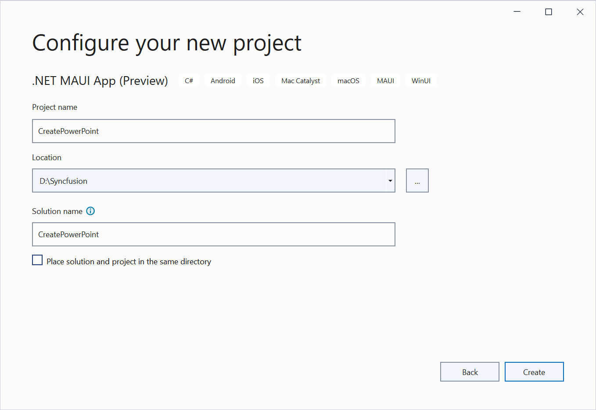

# Open and save Presentation in .NET MAUI

Syncfusion PowerPoint is a [.NET MAUI PowerPoint library](https://www.syncfusion.com/powerpoint-framework/maui/powerpoint-library) used to create, read, edit and convert PowerPoint documents programmatically without **Microsoft PowerPoint** or interop dependencies. Using this library, you can **open and save a Presentation in .NET MAUI**.

## Prerequisites
To create .NET Multi-platform App UI (.NET MAUI) apps, you need the latest versions of Visual Studio 2022 and .NET 6. For more details, refer [here](https://docs.microsoft.com/en-us/dotnet/maui/get-started/installation).

## Steps to open and save PowerPoint Presentation programmatically

Step 1: Create a new C# .NET MAUI app. Select **.NET MAUI App (Preview)** from the template and click the **Next** button.

Step 2: Enter the project name and click **Create**.

Step 3: Install the [Syncfusion.Presentation.NET](https://www.nuget.org/packages/Syncfusion.Presentation.NET) NuGet package as a reference to your project from [NuGet.org](https://www.nuget.org/).

N> Starting with v16.2.0.x, if you reference Syncfusion assemblies from trial setup or from the NuGet feed, you also have to add "Syncfusion.Licensing" assembly reference and include a license key in your projects. Please refer to this [link](https://help.syncfusion.com/common/essential-studio/licensing/license-key) to know about registering a Syncfusion license key in your application to use our components.

Step 4: Add a new button to the **MainPage.xaml** as shown below.




<ContentPage xmlns="http://schemas.microsoft.com/dotnet/2021/maui"
             xmlns:x="http://schemas.microsoft.com/winfx/2009/xaml"
             x:Class="ReadPowerPoint.MainPage"
             BackgroundColor="{DynamicResource SecondaryColor}">

    <ScrollView>
        <Grid RowSpacing="25" RowDefinitions="Auto,Auto,Auto,Auto,*"
              Padding="{OnPlatform iOS='30,60,30,30', Default='30'}">
            <Button 
                Text="Read and edit Presentation"
                FontAttributes="Bold"
                Grid.Row="0"
                SemanticProperties.Hint="Read and edit the Presentation"
                Clicked="ReadPowerPoint"
                HorizontalOptions="Center" />
        </Grid>
    </ScrollView>
</ContentPage>




Step 5: Include the following namespaces in the **MainPage.xaml.cs** file.




using Syncfusion.Presentation;




Step 6: Add a new action method **ReadPowerPoint** in MainPage.xaml.cs and include the below code snippet to **open an existing PowerPoint Presentation in .NET MAUI**.




Assembly assembly = typeof(MainPage).GetTypeInfo().Assembly;
//Opens an existing PowerPoint presentation.
using IPresentation pptxDoc = Presentation.Open(assembly.GetManifestResourceStream("ReadAndEditPowerPoint.Resources.Presentation.Sample.pptx"));




Step 7: Add below code snippet demonstrates accessing a shape from a slide and changing the text within it.




//Gets the first slide from the PowerPoint presentation.
ISlide slide = pptxDoc.Slides[0];
//Gets the first shape of the slide.
Syncfusion.Presentation.IShape shape = slide.Shapes[0] as Syncfusion.Presentation.IShape;
//Modifies the text of the shape.
if (shape.TextBody.Text == "Company History")
    shape.TextBody.Text = "Company Profile";




Step 8: Add below code example to **save the PowerPoint Presentation in .NET MAUI**.




//Saves the presentation to the memory stream.
using MemoryStream stream = new();
pptxDoc.Save(stream);
stream.Position = 0;
//Saves the memory stream as file.
SaveService saveService = new();
saveService.SaveAndView("Output.pptx", "application/vnd.openxmlformats-officedocument.presentationml.presentation", stream);




You can download a complete working sample from [GitHub](https://github.com/SyncfusionExamples/PowerPoint-Examples/tree/master/Getting-started/.NET-MAUI/Read-and-edit-presentation).

By executing the program, you will get the **PowerPoint slide** as follows.

## Helper files for .NET MAUI

Refer the below helper files and add them into the mentioned project. These helper files allow you to save the stream as a physical file and open the file for viewing.

<table>
  <tr>
  <td>
    <b>Folder Name</b>
  </td>
  <td>
    <b>File Name</b>
  </td>
  <td>
    <b>Summary</b>
  </td>
  </tr>
  <tr>
  <td>
    {{'[.NET MAUI Project](https://github.com/SyncfusionExamples/PowerPoint-Examples/tree/master/Getting-started/.NET-MAUI/Read-and-edit-presentation/Read-and-edit-presentation)'| markdownify }}
  </td>
  <td>
    {{'[SaveService.cs](https://github.com/SyncfusionExamples/PowerPoint-Examples/blob/master/Getting-started/.NET-MAUI/Read-and-edit-presentation/Read-and-edit-presentation/Services/SaveService.cs)'| markdownify }}
  </td>
  <td>Represent the base class for save operation.
  </td>
  </tr>
  <tr>
  <td>
    {{'[Windows](https://github.com/SyncfusionExamples/PowerPoint-Examples/tree/master/Getting-started/.NET-MAUI/Read-and-edit-presentation/Read-and-edit-presentation/Platforms/Windows)'| markdownify }}
  </td>
  <td>
    {{'[SaveWindows.cs](https://github.com/SyncfusionExamples/PowerPoint-Examples/blob/master/Getting-started/.NET-MAUI/Read-and-edit-presentation/Read-and-edit-presentation/Platforms/Windows/SaveWindows.cs)'| markdownify }}
  </td>
  <td>Save implementation for Windows.
  </td>
  </tr>
  <tr>
  <td>
    {{'[Android](https://github.com/SyncfusionExamples/PowerPoint-Examples/tree/master/Getting-started/.NET-MAUI/Read-and-edit-presentation/Read-and-edit-presentation/Platforms/Android)'| markdownify }}
  </td>
  <td>
    {{'[SaveAndroid.cs](https://github.com/SyncfusionExamples/PowerPoint-Examples/blob/master/Getting-started/.NET-MAUI/Read-and-edit-presentation/Read-and-edit-presentation/Platforms/Android/SaveAndroid.cs)'| markdownify }}
  </td>
  <td>Save implementation for Android device.
  </td>
  </tr>
  <tr>
  <td>
    {{'[Mac Catalyst](https://github.com/SyncfusionExamples/PowerPoint-Examples/tree/master/Getting-started/.NET-MAUI/Read-and-edit-presentation/Read-and-edit-presentation/Platforms/MacCatalyst)'| markdownify }}
  </td>
  <td>
    {{'[SaveMac.cs](https://github.com/SyncfusionExamples/PowerPoint-Examples/blob/master/Getting-started/.NET-MAUI/Read-and-edit-presentation/Read-and-edit-presentation/Platforms/MacCatalyst/SaveMac.cs)'| markdownify }}
  </td>
  <td>Save implementation for Mac Catalyst device.
  </td>
  </tr>
  <tr>
  <td rowspan="2">
    {{'[iOS](https://github.com/SyncfusionExamples/PowerPoint-Examples/tree/master/Getting-started/.NET-MAUI/Read-and-edit-presentation/Read-and-edit-presentation/Platforms/iOS)'| markdownify }}
  </td>
  <td>
    {{'[SaveIOS.cs](https://github.com/SyncfusionExamples/PowerPoint-Examples/blob/master/Getting-started/.NET-MAUI/Read-and-edit-presentation/Read-and-edit-presentation/Platforms/iOS/SaveIOS.cs)'| markdownify }}
  </td>
  <td>
    Save implementation for iOS device
  </td>
  </tr>
  <tr>
  <td>
    {{'[PreviewControllerDS.cs](https://github.com/SyncfusionExamples/PowerPoint-Examples/blob/master/Getting-started/.NET-MAUI/Read-and-edit-presentation/Read-and-edit-presentation/Platforms/iOS/PreviewControllerDS.cs)'| markdownify }} {{'[QLPreviewItemFileSystem.cs](https://github.com/SyncfusionExamples/PowerPoint-Examples/blob/master/Getting-started/.NET-MAUI/Read-and-edit-presentation/Read-and-edit-presentation/Platforms/iOS/QLPreviewItemFileSystem.cs)'| markdownify }}
  </td>
  <td>
    Helper classes for viewing the <b>PowerPoint Presenatation</b> in iOS device
  </td>
  </tr>
</table>

