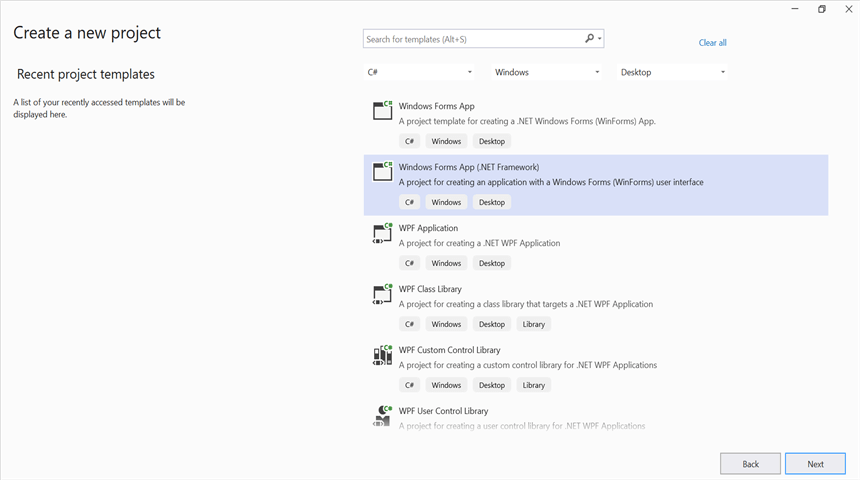
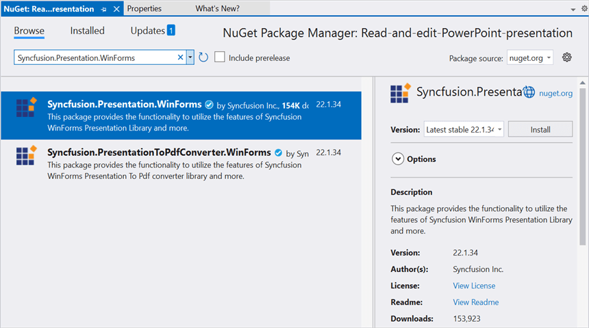

# Open and save Presentation in Windows Forms

Syncfusion PowerPoint is a [.NET PowerPoint library](https://www.syncfusion.com/document-processing/powerpoint-framework/net) used to create, read, edit and convert PowerPoint documents programmatically without **Microsoft PowerPoint** or interop dependencies. Using this library, you can **open and save a Presentation in Windows Forms**.

## Steps to open and save PowerPoint Presentation programmatically

Step 1: Create a new C# Windows Forms application project.

Step 2: Install the [Syncfusion.Presentation.WinForms](https://www.nuget.org/packages/Syncfusion.Presentation.WinForms/) NuGet package as reference to your .NET Standard applications from [NuGet.org](https://www.nuget.org/).

Step 3: Include the following namespaces in the **Form1.Designer.cs** file.




using Syncfusion.Presentation;




Step 4: Add a new button in **Form1.Designer.cs** file.




private Button btnCreate;
private Label label;
private void InitializeComponent()
{
    System.ComponentModel.ComponentResourceManager resources = new System.ComponentModel.ComponentResourceManager(typeof(Form1));
    this.label = new System.Windows.Forms.Label();
    this.btnCreate = new System.Windows.Forms.Button();
    this.SuspendLayout();
    // 
    // label
    // 
    this.label.Location = new System.Drawing.Point(12, 19);
    this.label.Name = "label";
    this.label.Size = new System.Drawing.Size(426, 88);
    this.label.TabIndex = 0;
    this.label.Text = resources.GetString("label.Text");
    this.label.TextAlign = System.Drawing.ContentAlignment.MiddleCenter;
    // 
    // btnCreate
    // 
    this.btnCreate.Location = new System.Drawing.Point(180, 110);
    this.btnCreate.Name = "btnCreate";
    this.btnCreate.Size = new System.Drawing.Size(85, 36);
    this.btnCreate.TabIndex = 1;
    this.btnCreate.Text = "Open and Save Presentation";
    this.btnCreate.Click += new System.EventHandler(this.btnOpenAndSave_Click);
    // 
    // Form1
    // 
    this.ClientSize = new System.Drawing.Size(450, 150);
    this.Controls.Add(this.label);
    this.Controls.Add(this.btnCreate);
    this.Name = "Form1";
    this.Text = "Open and Save Presentation";
    this.ResumeLayout(false);
}




Step 5: Add the following code in **btnOpenAndSave_Click** to **open an existing PowerPoint Presentation in Windows Forms**.




//Opens an existing PowerPoint presentation.
IPresentation pptxDoc = Presentation.Open("../../Data/Template.pptx");




Step 6: Add below code snippet demonstrates accessing a shape from a slide and changing the text within it.




//Gets the first slide from the PowerPoint presentation
ISlide slide = pptxDoc.Slides[0];
//Gets the first shape of the slide
IShape shape = slide.Shapes[0] as IShape;
//Change the text of the shape
if (shape.TextBody.Text == "Company History")
    shape.TextBody.Text = "Company Profile";




Step 7: Add below code example to **save the PowerPoint Presentation in Windows Forms**.




//Saves the Presentation to the file system.
pptxDoc.Save("Result.pptx");
//Close the PowerPoint presentation
pptxDoc.Close();




You can download a complete working sample from [GitHub](https://github.com/SyncfusionExamples/PowerPoint-Examples/tree/master/Read-and-save-PowerPoint-presentation/Open-and-save-PowerPoint/Windows-Forms).

By executing the program, you will get the **PowerPoint document** as follows.

Click [here](https://www.syncfusion.com/document-processing/powerpoint-framework/net) to explore the rich set of Syncfusion PowerPoint Library (Presentation) features.