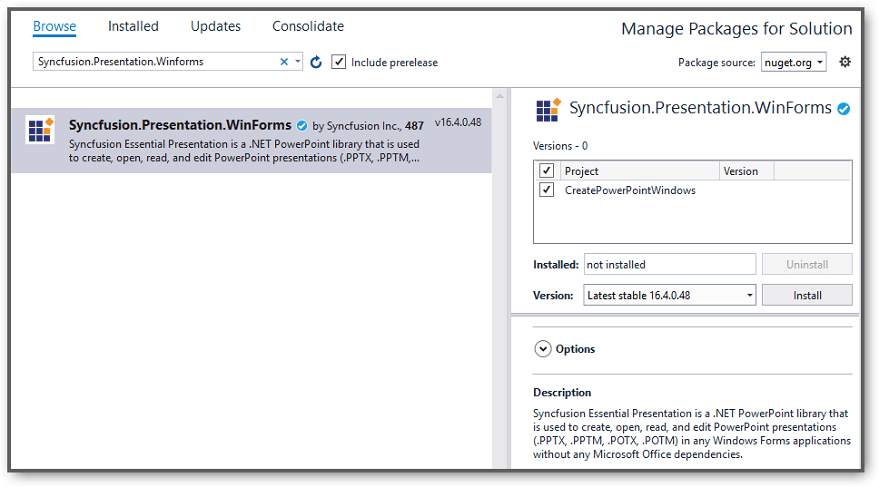

# Open and save Presentation in Console application

Syncfusion PowerPoint is a [.NET PowerPoint library](https://www.syncfusion.com/document-processing/powerpoint-framework/net) used to create, read, and edit **PowerPoint presentation** programmatically without **Microsoft PowerPoint** or interop dependencies. Using this library, you can **open and save Presentation in Console application**.

## Open and save Presentation using .NET Core and Latest

The below steps illustrates **create a PowerPoint** in console application using **.NET Core**.

Step 1: Create a new **.NET Core console application** project.

Step 2: Install the [Syncfusion.Presentation.Net.Core](https://www.nuget.org/packages/Syncfusion.Presentation.Net.Core/) NuGet package as a reference to your project from [NuGet.org](https://www.nuget.org/).

N> Starting with v16.2.0.x, if you reference Syncfusion assemblies from trial setup or from the NuGet feed, you also have to add "Syncfusion.Licensing" assembly reference and include a license key in your projects. Please refer to this [link](https://help.syncfusion.com/common/essential-studio/licensing/overview) to know about registering Syncfusion license key in your application to use our components.

Step 3: Include the following namespaces in **Program.cs** file.




using Syncfusion.Presentation;




Step 4: Add the following code snippet in **Program.cs** file to **open an existing Presentation in .NET Core console application**.




//Open an existing PowerPoint presentation.
using (IPresentation pptxDoc = Presentation.Open(new FileStream("Sample.pptx",FileMode.Open)));




Step 5: Add below code snippet demonstrates accessing a shape from a slide and changing the text within it.




//Gets the first slide from the PowerPoint presentation.
ISlide slide = pptxDoc.Slides[0];
//Gets the first shape of the slide.
IShape shape = slide.Shapes[0] as IShape;
//Change the text of the shape.
if(shape.TextBody.Text == "Company History")
    shape.TextBody.Text = "Company Profile";




Step 6: Add below code example to **save the PowerPoint Presentation in .NET Core console application**.




//Save the PowerPoint presentation as stream.
using (FileStream outputStream = new FileStream("Output.pptx", FileMode.Create))
{
    pptxDoc.Save(outputStream);
}




You can download a complete working sample from [GitHub](https://github.com/SyncfusionExamples/PowerPoint-Examples/tree/master/Read-and-save-PowerPoint-presentation/Open-and-save-PowerPoint/.NET).

By executing the program, you will get the **PowerPoint** as follows.

## Open and save PowerPoint in .NET Framework

The below steps illustrates **open and save a PowerPoint** in console application using **.NET Framework**.

Step 1: Create a new **.NET FrameWork console application** project.

Step 2: Install [Syncfusion.Presentation.WinForms](https://www.nuget.org/packages/Syncfusion.Presentation.WinForms/) NuGet package as a reference to your Windows Forms application from the [NuGet.org](https://www.nuget.org/).

N> 1. The [Syncfusion.Presentation.WinForms](https://www.nuget.org/packages/Syncfusion.Presentation.WinForms/) is a dependency for Syncfusion Windows Forms GUI controls and is named with the suffix "WinForms". It contains platform-independent .NET Framework assemblies (compatible with versions 4.0, 4.5, 4.5.1, and 4.6) for the PowerPoint library and does not include any Windows Forms-related references or code. Therefore, we recommend using this package for .NET Framework Console applications.
N> 2. Starting with v16.2.0.x, if you reference Syncfusion assemblies from trial setup or from the NuGet feed, you also have to add "Syncfusion.Licensing" assembly reference and include a license key in your projects. Please refer to this [link](https://help.syncfusion.com/common/essential-studio/licensing/overview) to know about registering Syncfusion license key in your application to use our components.

Step 3: Include the following namespaces in **Program.cs** file.




using Syncfusion.Presentation;




Step 4: Add the following code snippet in **Program.cs** file to **open an existing Presentation in .NET FrameWork console application**.




//Load or open an PowerPoint Presentation.
using (IPresentation pptxDoc = Presentation.Open("Template.pptx"));




Step 5: Add below code snippet demonstrates accessing a shape from a slide and changing the text within it.




//Get the first slide from the PowerPoint presentation.
ISlide slide = pptxDoc.Slides[0];
//Get the first shape of the slide.
IShape shape = slide.Shapes[0] as IShape;
//Change the text of the shape.
if (shape.TextBody.Text == "Company History")
	shape.TextBody.Text = "Company Profile";




Step 6: Add below code example to **save the PowerPoint Presentation in .NET FrameWork console application**.




pptxDoc.Save("Result.pptx");




You can download a complete working sample from [GitHub](https://github.com/SyncfusionExamples/PowerPoint-Examples/tree/master/Read-and-save-PowerPoint-presentation/Open-and-save-PowerPoint/.NET-Framework).

By executing the program, you will get the **PowerPoint** as follows.

