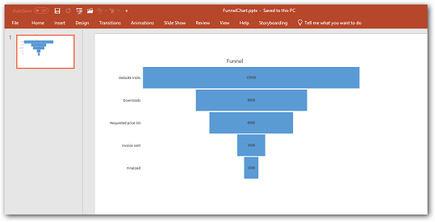
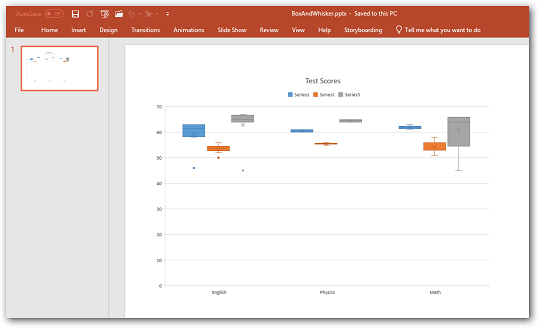
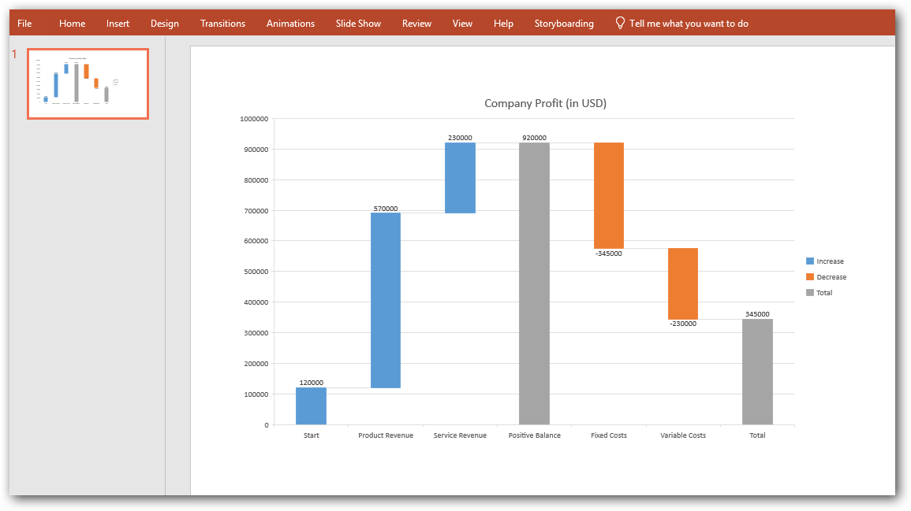
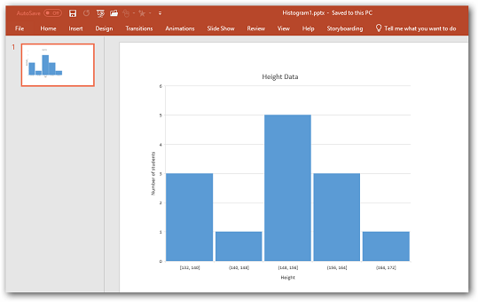
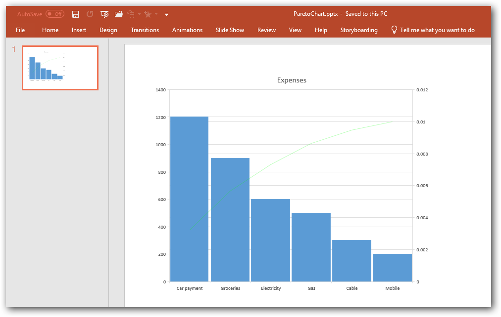

# Working with charts using various operations

## Creating a Chart from scratch

An instance of **IOfficeChart** can be used to create or modify the charts in PowerPoint Presentation. The following code example demonstrates how to create a simple chart by adding data from scratch.




//Creates a Presentation instance
IPresentation pptxDoc = Presentation.Create();
//Adds a blank slide to the Presentation
ISlide slide = pptxDoc.Slides.Add(SlideLayoutType.Blank);
//Adds chart to the slide with position and size
IPresentationChart chart = slide.Charts.AddChart(100, 10, 700, 500);
//Specifies the chart title
chart.ChartTitle = "Sales Analysis";

//Sets chart data - Row1
chart.ChartData.SetValue(1, 2, "Jan");
chart.ChartData.SetValue(1, 3, "Feb");
chart.ChartData.SetValue(1, 4, "March");

//Sets chart data - Row2
chart.ChartData.SetValue(2, 1, 2010);
chart.ChartData.SetValue(2, 2, 60);
chart.ChartData.SetValue(2, 3, 70);
chart.ChartData.SetValue(2, 4, 80);

//Sets chart data - Row3
chart.ChartData.SetValue(3, 1, 2011);
chart.ChartData.SetValue(3, 2, 80);
chart.ChartData.SetValue(3, 3, 70);
chart.ChartData.SetValue(3, 4, 60);

//Sets chart data - Row4
chart.ChartData.SetValue(4, 1, 2012);
chart.ChartData.SetValue(4, 2, 60);
chart.ChartData.SetValue(4, 3, 70);
chart.ChartData.SetValue(4, 4, 80);

//Creates a new chart series with the name
IOfficeChartSerie seriesJan = chart.Series.Add("Jan");
//Sets the data range of chart series – start row, start column, end row, end column
seriesJan.Values = chart.ChartData[2, 2, 4, 2];
//Creates a new chart series with the name
IOfficeChartSerie seriesFeb = chart.Series.Add("Feb");
//Sets the data range of chart series – start row, start column, end row, end column
seriesFeb.Values = chart.ChartData[2, 3, 4, 3];
//Creates a new chart series with the name
IOfficeChartSerie seriesMarch = chart.Series.Add("March");
//Sets the data range of chart series – start row, start column, end row, end column
seriesMarch.Values = chart.ChartData[2, 4, 4, 4];
//Sets the data range of the category axis
chart.PrimaryCategoryAxis.CategoryLabels = chart.ChartData[2, 1, 4, 1];
//Specifies the chart type
chart.ChartType = OfficeChartType.Column_Clustered;
//Adds the third slide into the Presentation
pptxDoc.Save("sample.pptx");
//Closes the Presentation
pptxDoc.Close();



'Creates a Presentation instance
Dim pptxDoc As IPresentation = Presentation.Create()
'Adds a blank slide to the Presentation
Dim slide As ISlide = pptxDoc.Slides.Add(SlideLayoutType.Blank)
'Adds chart to the slide with position and size
Dim chart As IPresentationChart = slide.Charts.AddChart(100, 10, 700, 500)
'Specifies the chart title
chart.ChartTitle = "Sales Analysis"

'Sets chart data - Row1
chart.ChartData.SetValue(1, 2, "Jan")
chart.ChartData.SetValue(1, 3, "Feb")
chart.ChartData.SetValue(1, 4, "March")

'Sets chart data - Row2
chart.ChartData.SetValue(2, 1, 2010)
chart.ChartData.SetValue(2, 2, 60)
chart.ChartData.SetValue(2, 3, 70)
chart.ChartData.SetValue(2, 4, 80)

'Sets chart data - Row3
chart.ChartData.SetValue(3, 1, 2011)
chart.ChartData.SetValue(3, 2, 80)
chart.ChartData.SetValue(3, 3, 70)
chart.ChartData.SetValue(3, 4, 60)

'Sets chart data - Row4
chart.ChartData.SetValue(4, 1, 2012)
chart.ChartData.SetValue(4, 2, 60)
chart.ChartData.SetValue(4, 3, 70)
chart.ChartData.SetValue(4, 4, 80)

'Creates a new chart series with the name
Dim seriesJan As IOfficeChartSerie = chart.Series.Add("Jan")
'Sets the data range of chart series – start row, start column, end row, end column
seriesJan.Values = chart.ChartData(2, 2, 4, 2)
'Creates a new chart series with the name
Dim seriesFeb As IOfficeChartSerie = chart.Series.Add("Feb")
'Sets the data range of chart series – start row, start column, end row, end column
seriesFeb.Values = chart.ChartData(2, 3, 4, 3)
'Creates a new chart series with the name
Dim seriesMarch As IOfficeChartSerie = chart.Series.Add("March")
'Sets the data range of chart series – start row, start column, end row, end column
seriesMarch.Values = chart.ChartData(2, 4, 4, 4)
'Sets the data range of the category axis
chart.PrimaryCategoryAxis.CategoryLabels = chart.ChartData(2, 1, 4, 1)
'Specifies the chart type
chart.ChartType = OfficeChartType.Column_Clustered
'Adds the third slide into the Presentation
pptxDoc.Save("sample.pptx")
'Closes the Presentation
pptxDoc.Close()



//Creates a Presentation instance
IPresentation pptxDoc = Presentation.Create();
//Adds a blank slide to the Presentation
ISlide slide = pptxDoc.Slides.Add(SlideLayoutType.Blank);
//Adds chart to the slide with position and size
IPresentationChart chart = slide.Charts.AddChart(100, 10, 700, 500);
//Specifies the chart title
chart.ChartTitle = "Sales Analysis";

//Sets chart data - Row1
chart.ChartData.SetValue(1, 2, "Jan");
chart.ChartData.SetValue(1, 3, "Feb");
chart.ChartData.SetValue(1, 4, "March");

//Sets chart data - Row2
chart.ChartData.SetValue(2, 1, 2010);
chart.ChartData.SetValue(2, 2, 60);
chart.ChartData.SetValue(2, 3, 70);
chart.ChartData.SetValue(2, 4, 80);

//Sets chart data - Row3
chart.ChartData.SetValue(3, 1, 2011);
chart.ChartData.SetValue(3, 2, 80);
chart.ChartData.SetValue(3, 3, 70);
chart.ChartData.SetValue(3, 4, 60);

//Sets chart data - Row4
chart.ChartData.SetValue(4, 1, 2012);
chart.ChartData.SetValue(4, 2, 60);
chart.ChartData.SetValue(4, 3, 70);
chart.ChartData.SetValue(4, 4, 80);

//Creates a new chart series with the name
IOfficeChartSerie seriesJan = chart.Series.Add("Jan");
//Sets the data range of chart series – start row, start column, end row, end column
seriesJan.Values = chart.ChartData[2, 2, 4, 2];
//Creates a new chart series with the name
IOfficeChartSerie seriesFeb = chart.Series.Add("Feb");
//Sets the data range of chart series – start row, start column, end row, end column
seriesFeb.Values = chart.ChartData[2, 3, 4, 3];
//Creates a new chart series with the name
IOfficeChartSerie seriesMarch = chart.Series.Add("March");
//Sets the data range of chart series – start row, start column, end row, end column
seriesMarch.Values = chart.ChartData[2, 4, 4, 4];
//Sets the data range of the category axis
chart.PrimaryCategoryAxis.CategoryLabels = chart.ChartData[2, 1, 4, 1];
//Specifies the chart type
chart.ChartType = OfficeChartType.Column_Clustered;
//Initializes FileSavePicker
FileSavePicker savePicker = new FileSavePicker();
savePicker.SuggestedStartLocation = PickerLocationId.Desktop;
savePicker.SuggestedFileName = "sample";
savePicker.FileTypeChoices.Add("PowerPoint Files", new List<string>() { ".pptx" });
//Creates a storage file from FileSavePicker
StorageFile storageFile = await savePicker.PickSaveFileAsync();
//Saves changes to the specified storage file
await pptxDoc.SaveAsync(storageFile);



//Creates a Presentation instance
IPresentation pptxDoc = Presentation.Create();
//Adds a blank slide to the Presentation
ISlide slide = pptxDoc.Slides.Add(SlideLayoutType.Blank);
//Adds chart to the slide with position and size
IPresentationChart chart = slide.Charts.AddChart(100, 10, 700, 500);
//Specifies the chart title
chart.ChartTitle = "Sales Analysis";

//Sets chart data - Row1
chart.ChartData.SetValue(1, 2, "Jan");
chart.ChartData.SetValue(1, 3, "Feb");
chart.ChartData.SetValue(1, 4, "March");

//Sets chart data - Row2
chart.ChartData.SetValue(2, 1, 2010);
chart.ChartData.SetValue(2, 2, 60);
chart.ChartData.SetValue(2, 3, 70);
chart.ChartData.SetValue(2, 4, 80);

//Sets chart data - Row3
chart.ChartData.SetValue(3, 1, 2011);
chart.ChartData.SetValue(3, 2, 80);
chart.ChartData.SetValue(3, 3, 70);
chart.ChartData.SetValue(3, 4, 60);

//Sets chart data - Row4
chart.ChartData.SetValue(4, 1, 2012);
chart.ChartData.SetValue(4, 2, 60);
chart.ChartData.SetValue(4, 3, 70);
chart.ChartData.SetValue(4, 4, 80);

//Creates a new chart series with the name
IOfficeChartSerie seriesJan = chart.Series.Add("Jan");
//Sets the data range of chart series – start row, start column, end row, end column
seriesJan.Values = chart.ChartData[2, 2, 4, 2];
//Creates a new chart series with the name
IOfficeChartSerie seriesFeb = chart.Series.Add("Feb");
//Sets the data range of chart series – start row, start column, end row, end column
seriesFeb.Values = chart.ChartData[2, 3, 4, 3];
//Creates a new chart series with the name
IOfficeChartSerie seriesMarch = chart.Series.Add("March");
//Sets the data range of chart series – start row, start column, end row, end column
seriesMarch.Values = chart.ChartData[2, 4, 4, 4];
//Sets the data range of the category axis
chart.PrimaryCategoryAxis.CategoryLabels = chart.ChartData[2, 1, 4, 1];
//Specifies the chart type
chart.ChartType = OfficeChartType.Column_Clustered;
//Save the PowerPoint Presentation as stream
FileStream outputStream = new FileStream("Sample.pptx", FileMode.Create);
pptxDoc.Save(outputStream);
//Closes the Presentation
pptxDoc.Close();



//Creates a Presentation instance
IPresentation pptxDoc = Presentation.Create();
//Adds a blank slide to the Presentation
ISlide slide = pptxDoc.Slides.Add(SlideLayoutType.Blank);
//Adds chart to the slide with position and size
IPresentationChart chart = slide.Charts.AddChart(100, 10, 700, 500);
//Specifies the chart title
chart.ChartTitle = "Sales Analysis";

//Sets chart data - Row1
chart.ChartData.SetValue(1, 2, "Jan");
chart.ChartData.SetValue(1, 3, "Feb");
chart.ChartData.SetValue(1, 4, "March");

//Sets chart data - Row2
chart.ChartData.SetValue(2, 1, 2010);
chart.ChartData.SetValue(2, 2, 60);
chart.ChartData.SetValue(2, 3, 70);
chart.ChartData.SetValue(2, 4, 80);

//Sets chart data - Row3
chart.ChartData.SetValue(3, 1, 2011);
chart.ChartData.SetValue(3, 2, 80);
chart.ChartData.SetValue(3, 3, 70);
chart.ChartData.SetValue(3, 4, 60);

//Sets chart data - Row4
chart.ChartData.SetValue(4, 1, 2012);
chart.ChartData.SetValue(4, 2, 60);
chart.ChartData.SetValue(4, 3, 70);
chart.ChartData.SetValue(4, 4, 80);

//Creates a new chart series with the name
IOfficeChartSerie seriesJan = chart.Series.Add("Jan");
//Sets the data range of chart series – start row, start column, end row, end column
seriesJan.Values = chart.ChartData[2, 2, 4, 2];
//Creates a new chart series with the name
IOfficeChartSerie seriesFeb = chart.Series.Add("Feb");
//Sets the data range of chart series – start row, start column, end row, end column
seriesFeb.Values = chart.ChartData[2, 3, 4, 3];
//Creates a new chart series with the name
IOfficeChartSerie seriesMarch = chart.Series.Add("March");
//Sets the data range of chart series – start row, start column, end row, end column
seriesMarch.Values = chart.ChartData[2, 4, 4, 4];
//Sets the data range of the category axis
chart.PrimaryCategoryAxis.CategoryLabels = chart.ChartData[2, 1, 4, 1];
//Specifies the chart type
chart.ChartType = OfficeChartType.Column_Clustered;
//Create new memory stream to save Presentation.
MemoryStream stream = new MemoryStream();
//Save Presentation in stream format.
pptxDoc.Save(stream);
//Close the presentation
pptxDoc.Close();
stream.Position = 0;
//The operation in Save under Xamarin varies between Windows Phone, Android and iOS platforms. Please refer presentation/xamarin section for respective code samples.
if (Device.OS == TargetPlatform.WinPhone || Device.OS == TargetPlatform.Windows)
    Xamarin.Forms.DependencyService.Get<ISaveWindowsPhone>().Save("Sample.pptx", "application/vnd.openxmlformats-officedocument.presentationml.presentation", stream);
else
    Xamarin.Forms.DependencyService.Get<ISave>().Save("Sample.pptx", "application/vnd.openxmlformats-officedocument.presentationml.presentation", stream);




## Creating charts from excel sheet

You can also create a chart with the data from an existing excel worksheet. The following code example demonstrates the same.




//Creates a Presentation instance
IPresentation pptxDoc = Presentation.Create();
//Adds a blank slide to the Presentation
ISlide slide = pptxDoc.Slides.Add(SlideLayoutType.Blank);
//Gets the excel file as stream
MemoryStream excelStream = new MemoryStream(File.ReadAllBytes("Book1.xlsx"));
//Adds a chart to the slide with a data range from excel worksheet – excel workbook, worksheet number, Data range, position, and size.
IPresentationChart chart = slide.Charts.AddChart(excelStream, 1, "A1:D4", new RectangleF(100, 10, 700, 500));
//Saves the Presentation
pptxDoc.Save("output.pptx");
//Closes the Presentation
pptxDoc.Close();



'Creates a Presentation instance
Dim pptxDoc As IPresentation = Presentation.Create()
'Adds a blank slide to the Presentation
Dim slide As ISlide = pptxDoc.Slides.Add(SlideLayoutType.Blank)
'Gets the excel file as stream
Dim excelStream As New MemoryStream(File.ReadAllBytes("Book1.xlsx"))
'Adds a chart to the slide with a data range from excel worksheet – excel workbook, worksheet number, Data range, position, and size.
Dim chart As IPresentationChart = slide.Charts.AddChart(excelStream, 1, "A1:D4", New RectangleF(100, 10, 700, 500))
'Saves the Presentation
pptxDoc.Save("output.pptx")
'Closes the Presentation
pptxDoc.Close()



//Creates a Presentation instance
IPresentation pptxDoc = Presentation.Create();
//Adds a blank slide to the Presentation
ISlide slide = pptxDoc.Slides.Add(SlideLayoutType.Blank);
//Gets the excel file as stream
MemoryStream excelStream = new MemoryStream(File.ReadAllBytes("Book1.xlsx"));
//Adds a chart to the slide with a data range from excel worksheet – excel workbook, worksheet number, Data range, position, and size.
IPresentationChart chart = slide.Charts.AddChart(excelStream, 1, "A1:D4", new RectangleF(100, 10, 700, 500));
//Initializes FileSavePicker
FileSavePicker savePicker = new FileSavePicker();
savePicker.SuggestedStartLocation = PickerLocationId.Desktop;
savePicker.SuggestedFileName = "Output";
savePicker.FileTypeChoices.Add("PowerPoint Files", new List<string>() { ".pptx" });
//Creates a storage file from FileSavePicker
StorageFile storageFile = await savePicker.PickSaveFileAsync();
//Saves changes to the specified storage file
await pptxDoc.SaveAsync(storageFile);



//Creates a Presentation instance
IPresentation pptxDoc = Presentation.Create();
//Adds a blank slide to the Presentation
ISlide slide = pptxDoc.Slides.Add(SlideLayoutType.Blank);
//Gets the excel file as stream
FileStream excelStream = new FileStream("Book1.xlsx",FileMode.Open);
//Adds a chart to the slide with a data range from excel worksheet – excel workbook, worksheet number, Data range, position, and size.
IPresentationChart chart = slide.Charts.AddChart(excelStream, 1, "A1:D4", new RectangleF(100, 10, 700, 500));
//Save the PowerPoint Presentation as stream
FileStream outputStream = new FileStream("Output.pptx", FileMode.Create);
pptxDoc.Save(outputStream);
//Closes the Presentation
pptxDoc.Close();



//Creates a Presentation instance
IPresentation pptxDoc = Presentation.Create();
//Adds a blank slide to the Presentation
ISlide slide = pptxDoc.Slides.Add(SlideLayoutType.Blank);
//"App" is the class of Portable project.
Assembly assembly = typeof(App).GetTypeInfo().Assembly;
//Gets the excel file as stream
Stream excelStream = assembly.GetManifestResourceStream("SampleBrowser.Presentation.Samples.Template.Book1.xlsx");
//Adds a chart to the slide with a data range from excel worksheet – excel workbook, worksheet number, Data range, position, and size.
IPresentationChart chart = slide.Charts.AddChart(excelStream, 1, "A1:D4", new RectangleF(100, 10, 700, 500));
//Create new memory stream to save Presentation.
MemoryStream stream = new MemoryStream();
//Save Presentation in stream format.
pptxDoc.Save(stream);
//Close the presentation
pptxDoc.Close();
stream.Position = 0;
//The operation in Save under Xamarin varies between Windows Phone, Android and iOS platforms. Please refer presentation/xamarin section for respective code samples.
if (Device.OS == TargetPlatform.WinPhone || Device.OS == TargetPlatform.Windows)
    Xamarin.Forms.DependencyService.Get<ISaveWindowsPhone>().Save("Output.pptx", "application/vnd.openxmlformats-officedocument.presentationml.presentation", stream);
else
    Xamarin.Forms.DependencyService.Get<ISave>().Save("Output.pptx", "application/vnd.openxmlformats-officedocument.presentationml.presentation", stream);




## Creating Custom Charts 

Essential Presentation facilitates you to create custom charts by adding different charts series for a single chart. 

For example, you can use a Bar- clustered chart for the first data series and a scatter- line- marker chart for the second series. As a result, you can have a Bar-clustered chart combined with a scatter-line-marker chart.

The following code example demonstrates how to create custom charts.




//Creates an instance of the IPresentation 
IPresentation pptxDoc = Presentation.Create();
//Creates a new slide
ISlide slide = pptxDoc.Slides.Add(SlideLayoutType.Blank);
//Adds a new chart in the slide by specifying its position and size as parameters.
IPresentationChart chart = slide.Charts.AddChart(100, 80, 500, 350);       
chart.ChartTitle = "Sales comparison";
chart.ChartTitleArea.Bold = true;

//Sets the data for chart– RowIndex, columnIndex and data
chart.ChartData.SetValue(1, 1, "Month");
chart.ChartData.SetValue(2, 1, "July");
chart.ChartData.SetValue(3, 1, "August");
chart.ChartData.SetValue(4, 1, "September");
chart.ChartData.SetValue(5, 1, "October");
chart.ChartData.SetValue(6, 1, "November");
chart.ChartData.SetValue(7, 1, "December");

chart.ChartData.SetValue(1, 2, "2013");
chart.ChartData.SetValue(2, 2, 35);
chart.ChartData.SetValue(3, 2, 47);
chart.ChartData.SetValue(4, 2, 30);
chart.ChartData.SetValue(5, 2, 29);
chart.ChartData.SetValue(6, 2, 25);
chart.ChartData.SetValue(7, 2, 30);

chart.ChartData.SetValue(1, 3, "2014");
chart.ChartData.SetValue(2, 3, 30);
chart.ChartData.SetValue(3, 3, 25);
chart.ChartData.SetValue(4, 3, 29);
chart.ChartData.SetValue(5, 3, 35);
chart.ChartData.SetValue(6, 3, 38);
chart.ChartData.SetValue(7, 3, 32);

chart.ChartData.SetValue(1, 4, "2015");
chart.ChartData.SetValue(2, 4, 35);
chart.ChartData.SetValue(3, 4, 37);
chart.ChartData.SetValue(4, 4, 30);
chart.ChartData.SetValue(5, 4, 29);
chart.ChartData.SetValue(6, 4, 25);
chart.ChartData.SetValue(7, 4, 30);

//Creates a new ChartSerie with the name
IOfficeChartSerie serie2013 = chart.Series.Add("2013");
//Sets the data range of chart series start row, start column, end row, end column
serie2013.Values = chart.ChartData[2, 2, 7, 2];
serie2013.SerieType = OfficeChartType.Bar_Clustered;
IOfficeChartSerie serie2014 = chart.Series.Add("2014");
serie2014.Values = chart.ChartData[2, 3, 7, 3];
serie2014.SerieType = OfficeChartType.Scatter_Line_Markers;

//Saves the Presentation
pptxDoc.Save("Output_1.pptx");
//Closes the Presentation
pptxDoc.Close();



'Creates an instance of the IPresentation 
Dim pptxDoc As IPresentation = Presentation.Create()
'Creates a new slide
Dim slide As ISlide = pptxDoc.Slides.Add(SlideLayoutType.Blank)
'Adds a new chart in the slide by specifying its position and size as parameters.
Dim chart As IPresentationChart = slide.Charts.AddChart(100, 80, 500, 350)
chart.ChartTitle = "Sales comparison"
chart.ChartTitleArea.Bold = True

'Sets the data for chart– RowIndex, columnIndex, and data
chart.ChartData.SetValue(1, 1, "Month")
chart.ChartData.SetValue(2, 1, "July")
chart.ChartData.SetValue(3, 1, "August")
chart.ChartData.SetValue(4, 1, "September")
chart.ChartData.SetValue(5, 1, "October")
chart.ChartData.SetValue(6, 1, "November")
chart.ChartData.SetValue(7, 1, "December")

chart.ChartData.SetValue(1, 2, "2013")
chart.ChartData.SetValue(2, 2, 35)
chart.ChartData.SetValue(3, 2, 47)
chart.ChartData.SetValue(4, 2, 30)
chart.ChartData.SetValue(5, 2, 29)
chart.ChartData.SetValue(6, 2, 25)
chart.ChartData.SetValue(7, 2, 30)

chart.ChartData.SetValue(1, 3, "2014")
chart.ChartData.SetValue(2, 3, 30)
chart.ChartData.SetValue(3, 3, 25)
chart.ChartData.SetValue(4, 3, 29)
chart.ChartData.SetValue(5, 3, 35)
chart.ChartData.SetValue(6, 3, 38)
chart.ChartData.SetValue(7, 3, 32)

chart.ChartData.SetValue(1, 4, "2015")
chart.ChartData.SetValue(2, 4, 35)
chart.ChartData.SetValue(3, 4, 37)
chart.ChartData.SetValue(4, 4, 30)
chart.ChartData.SetValue(5, 4, 29)
chart.ChartData.SetValue(6, 4, 25)
chart.ChartData.SetValue(7, 4, 30)

'Creates a new ChartSerie with the name
Dim serie2013 As IOfficeChartSerie = chart.Series.Add("2013")
'Sets the data range of chart series start row, start column, end row, end column
serie2013.Values = chart.ChartData(2, 2, 7, 2)
serie2013.SerieType = OfficeChartType.Bar_Clustered
Dim serie2014 As IOfficeChartSerie = chart.Series.Add("2014")
serie2014.Values = chart.ChartData(2, 3, 7, 3)
serie2014.SerieType = OfficeChartType.Scatter_Line_Markers

'Saves the Presentation
pptxDoc.Save("Output_1.pptx")
'Closes the Presentation
pptxDoc.Close()



//Creates an instance of the IPresentation 
IPresentation pptxDoc = Presentation.Create();
//Creates a new slide
ISlide slide = pptxDoc.Slides.Add(SlideLayoutType.Blank);
//Adds a new chart in the slide by specifying its position and size as parameters.
IPresentationChart chart = slide.Charts.AddChart(100, 80, 500, 350);
chart.ChartTitle = "Sales comparison";
chart.ChartTitleArea.Bold = true;

//Sets the data for chart– RowIndex, columnIndex and data
chart.ChartData.SetValue(1, 1, "Month");
chart.ChartData.SetValue(2, 1, "July");
chart.ChartData.SetValue(3, 1, "August");
chart.ChartData.SetValue(4, 1, "September");
chart.ChartData.SetValue(5, 1, "October");
chart.ChartData.SetValue(6, 1, "November");
chart.ChartData.SetValue(7, 1, "December");

chart.ChartData.SetValue(1, 2, "2013");
chart.ChartData.SetValue(2, 2, 35);
chart.ChartData.SetValue(3, 2, 47);
chart.ChartData.SetValue(4, 2, 30);
chart.ChartData.SetValue(5, 2, 29);
chart.ChartData.SetValue(6, 2, 25);
chart.ChartData.SetValue(7, 2, 30);

chart.ChartData.SetValue(1, 3, "2014");
chart.ChartData.SetValue(2, 3, 30);
chart.ChartData.SetValue(3, 3, 25);
chart.ChartData.SetValue(4, 3, 29);
chart.ChartData.SetValue(5, 3, 35);
chart.ChartData.SetValue(6, 3, 38);
chart.ChartData.SetValue(7, 3, 32);

chart.ChartData.SetValue(1, 4, "2015");
chart.ChartData.SetValue(2, 4, 35);
chart.ChartData.SetValue(3, 4, 37);
chart.ChartData.SetValue(4, 4, 30);
chart.ChartData.SetValue(5, 4, 29);
chart.ChartData.SetValue(6, 4, 25);
chart.ChartData.SetValue(7, 4, 30);

//Creates a new ChartSerie with the name
IOfficeChartSerie serie2013 = chart.Series.Add("2013");
//Sets the data range of chart series start row, start column, end row, end column
serie2013.Values = chart.ChartData[2, 2, 7, 2];
serie2013.SerieType = OfficeChartType.Bar_Clustered;
IOfficeChartSerie serie2014 = chart.Series.Add("2014");
serie2014.Values = chart.ChartData[2, 3, 7, 3];
serie2014.SerieType = OfficeChartType.Scatter_Line_Markers;

//Initializes FileSavePicker
FileSavePicker savePicker = new FileSavePicker();
savePicker.SuggestedStartLocation = PickerLocationId.Desktop;
savePicker.SuggestedFileName = "Output_1";
savePicker.FileTypeChoices.Add("PowerPoint Files", new List<string>() { ".pptx" });
//Creates a storage file from FileSavePicker
StorageFile storageFile = await savePicker.PickSaveFileAsync();
//Saves changes to the specified storage file
await pptxDoc.SaveAsync(storageFile);



//Creates an instance of the IPresentation 
IPresentation pptxDoc = Presentation.Create();
//Creates a new slide
ISlide slide = pptxDoc.Slides.Add(SlideLayoutType.Blank);
//Adds a new chart in the slide by specifying its position and size as parameters.
IPresentationChart chart = slide.Charts.AddChart(100, 80, 500, 350);       
chart.ChartTitle = "Sales comparison";
chart.ChartTitleArea.Bold = true;

//Sets the data for chart– RowIndex, columnIndex and data
chart.ChartData.SetValue(1, 1, "Month");
chart.ChartData.SetValue(2, 1, "July");
chart.ChartData.SetValue(3, 1, "August");
chart.ChartData.SetValue(4, 1, "September");
chart.ChartData.SetValue(5, 1, "October");
chart.ChartData.SetValue(6, 1, "November");
chart.ChartData.SetValue(7, 1, "December");

chart.ChartData.SetValue(1, 2, "2013");
chart.ChartData.SetValue(2, 2, 35);
chart.ChartData.SetValue(3, 2, 47);
chart.ChartData.SetValue(4, 2, 30);
chart.ChartData.SetValue(5, 2, 29);
chart.ChartData.SetValue(6, 2, 25);
chart.ChartData.SetValue(7, 2, 30);

chart.ChartData.SetValue(1, 3, "2014");
chart.ChartData.SetValue(2, 3, 30);
chart.ChartData.SetValue(3, 3, 25);
chart.ChartData.SetValue(4, 3, 29);
chart.ChartData.SetValue(5, 3, 35);
chart.ChartData.SetValue(6, 3, 38);
chart.ChartData.SetValue(7, 3, 32);

chart.ChartData.SetValue(1, 4, "2015");
chart.ChartData.SetValue(2, 4, 35);
chart.ChartData.SetValue(3, 4, 37);
chart.ChartData.SetValue(4, 4, 30);
chart.ChartData.SetValue(5, 4, 29);
chart.ChartData.SetValue(6, 4, 25);
chart.ChartData.SetValue(7, 4, 30);

//Creates a new ChartSerie with the name
IOfficeChartSerie serie2013 = chart.Series.Add("2013");
//Sets the data range of chart series start row, start column, end row, end column
serie2013.Values = chart.ChartData[2, 2, 7, 2];
serie2013.SerieType = OfficeChartType.Bar_Clustered;
IOfficeChartSerie serie2014 = chart.Series.Add("2014");
serie2014.Values = chart.ChartData[2, 3, 7, 3];
serie2014.SerieType = OfficeChartType.Scatter_Line_Markers;

//Save the PowerPoint Presentation as stream
FileStream outputStream = new FileStream("Output_1.pptx", FileMode.Create);
pptxDoc.Save(outputStream);
//Closes the Presentation
pptxDoc.Close();



//Creates an instance of the IPresentation 
IPresentation pptxDoc = Presentation.Create();
//Creates a new slide
ISlide slide = pptxDoc.Slides.Add(SlideLayoutType.Blank);
//Adds a new chart in the slide by specifying its position and size as parameters.
IPresentationChart chart = slide.Charts.AddChart(100, 80, 500, 350);       
chart.ChartTitle = "Sales comparison";
chart.ChartTitleArea.Bold = true;

//Sets the data for chart– RowIndex, columnIndex and data
chart.ChartData.SetValue(1, 1, "Month");
chart.ChartData.SetValue(2, 1, "July");
chart.ChartData.SetValue(3, 1, "August");
chart.ChartData.SetValue(4, 1, "September");
chart.ChartData.SetValue(5, 1, "October");
chart.ChartData.SetValue(6, 1, "November");
chart.ChartData.SetValue(7, 1, "December");

chart.ChartData.SetValue(1, 2, "2013");
chart.ChartData.SetValue(2, 2, 35);
chart.ChartData.SetValue(3, 2, 47);
chart.ChartData.SetValue(4, 2, 30);
chart.ChartData.SetValue(5, 2, 29);
chart.ChartData.SetValue(6, 2, 25);
chart.ChartData.SetValue(7, 2, 30);

chart.ChartData.SetValue(1, 3, "2014");
chart.ChartData.SetValue(2, 3, 30);
chart.ChartData.SetValue(3, 3, 25);
chart.ChartData.SetValue(4, 3, 29);
chart.ChartData.SetValue(5, 3, 35);
chart.ChartData.SetValue(6, 3, 38);
chart.ChartData.SetValue(7, 3, 32);

chart.ChartData.SetValue(1, 4, "2015");
chart.ChartData.SetValue(2, 4, 35);
chart.ChartData.SetValue(3, 4, 37);
chart.ChartData.SetValue(4, 4, 30);
chart.ChartData.SetValue(5, 4, 29);
chart.ChartData.SetValue(6, 4, 25);
chart.ChartData.SetValue(7, 4, 30);

//Creates a new ChartSerie with the name
IOfficeChartSerie serie2013 = chart.Series.Add("2013");
//Sets the data range of chart series start row, start column, end row, end column
serie2013.Values = chart.ChartData[2, 2, 7, 2];
serie2013.SerieType = OfficeChartType.Bar_Clustered;
IOfficeChartSerie serie2014 = chart.Series.Add("2014");
serie2014.Values = chart.ChartData[2, 3, 7, 3];
serie2014.SerieType = OfficeChartType.Scatter_Line_Markers;

//Create new memory stream to save Presentation.
MemoryStream stream = new MemoryStream();
//Save Presentation in stream format.
pptxDoc.Save(stream);
//Close the presentation
pptxDoc.Close();
stream.Position = 0;
//The operation in Save under Xamarin varies between Windows Phone, Android and iOS platforms. Please refer presentation/xamarin section for respective code samples.
if (Device.OS == TargetPlatform.WinPhone || Device.OS == TargetPlatform.Windows)
    Xamarin.Forms.DependencyService.Get<ISaveWindowsPhone>().Save("Output_1.pptx", "application/vnd.openxmlformats-officedocument.presentationml.presentation", stream);
else
    Xamarin.Forms.DependencyService.Get<ISave>().Save("Output_1.pptx", "application/vnd.openxmlformats-officedocument.presentationml.presentation", stream);




The above code example creates a chart in the following screenshot.

## Refreshing the chart

Sometimes, the charts do not represent the actual data. In those cases, the charts in PowerPoint Presentation should be refreshed.

The following code example demonstrates how to refresh the charts in PowerPoint Presentation. 




//Opens the Presentation
IPresentation pptxDoc = Presentation.Open("Chart.pptx");
//Gets the first slide
ISlide slide = pptxDoc.Slides[0];
//Gets the chart in slide
IPresentationChart chart = slide.Shapes[0] as IPresentationChart;
//Refreshes the chart
chart.Refresh();
//Saves the Presentation
pptxDoc.Save("output.pptx");
//Closes the Presentation
pptxDoc.Close();



'Opens the Presentation
Dim pptxDoc As IPresentation = Presentation.Open("Chart.pptx")
'Gets the first slide
Dim slide As ISlide = pptxDoc.Slides(0)
'Gets the chart in slide
Dim chart As IPresentationChart = TryCast(slide.Shapes(0), IPresentationChart)
'Refreshes the chart
chart.Refresh()
'Saves the Presentation
pptxDoc.Save("output.pptx")
'Closes the Presentation
pptxDoc.Close()



//Opens the Presentation
IPresentation pptxDoc = Presentation.Open("Chart.pptx");
//Gets the first slide
ISlide slide = pptxDoc.Slides[0];
//Gets the chart in slide
IPresentationChart chart = slide.Shapes[0] as IPresentationChart;
//Refreshes the chart
chart.Refresh();
//Initializes FileSavePicker
FileSavePicker savePicker = new FileSavePicker();
savePicker.SuggestedStartLocation = PickerLocationId.Desktop;
savePicker.SuggestedFileName = "Output";
savePicker.FileTypeChoices.Add("PowerPoint Files", new List<string>() { ".pptx" });
//Creates a storage file from FileSavePicker
StorageFile storageFile = await savePicker.PickSaveFileAsync();
//Saves changes to the specified storage file
await pptxDoc.SaveAsync(storageFile);



//Loads or open an PowerPoint Presentation
FileStream inputStream = new FileStream("Sample.pptx",FileMode.Open);
IPresentation pptxDoc = Presentation.Open(inputStream);
//Gets the first slide
ISlide slide = pptxDoc.Slides[0];
//Gets the chart in slide
IPresentationChart chart = slide.Shapes[0] as IPresentationChart;
//Refreshes the chart
chart.Refresh();
//Save the PowerPoint Presentation as stream
FileStream outputStream = new FileStream("Output.pptx", FileMode.Create);
pptxDoc.Save(outputStream);
//Closes the Presentation
pptxDoc.Close();



//"App" is the class of Portable project.
Assembly assembly = typeof(App).GetTypeInfo().Assembly;
Stream inputStream = assembly.GetManifestResourceStream("SampleBrowser.Presentation.Samples.Template.Sample.pptx");
//Loads or open an PowerPoint Presentation
IPresentation pptxDoc = Presentation.Open(inputStream);
//Gets the first slide
ISlide slide = pptxDoc.Slides[0];
//Gets the chart in slide
IPresentationChart chart = slide.Shapes[0] as IPresentationChart;
//Refreshes the chart
chart.Refresh();
//Create new memory stream to save Presentation.
MemoryStream stream = new MemoryStream();
//Save Presentation in stream format.
pptxDoc.Save(stream);
//Close the presentation
pptxDoc.Close();
stream.Position = 0;
//The operation in Save under Xamarin varies between Windows Phone, Android and iOS platforms. Please refer presentation/xamarin section for respective code samples.
if (Device.OS == TargetPlatform.WinPhone || Device.OS == TargetPlatform.Windows)
    Xamarin.Forms.DependencyService.Get<ISaveWindowsPhone>().Save("Output.pptx", "application/vnd.openxmlformats-officedocument.presentationml.presentation", stream);
else
    Xamarin.Forms.DependencyService.Get<ISave>().Save("Output.pptx", "application/vnd.openxmlformats-officedocument.presentationml.presentation", stream);




## Editing the Chart Data

You can change the data for an existing chart. The code example demonstrates how to modify the chart in a slide.




//Opens a Presentation
IPresentation pptxDoc = Presentation.Open("Sample.pptx");
//Adds a slide to the Presentation
ISlide slide = pptxDoc.Slides[0];
//Gets the chart in slide
IPresentationChart chart = slide.Shapes[0] as IPresentationChart;

//Modifies chart data - Row1
chart.ChartData.SetValue(1, 2, "Jan");
chart.ChartData.SetValue(1, 3, "Feb");
chart.ChartData.SetValue(1, 4, "March");

//Modifies chart data - Row2
chart.ChartData.SetValue(2, 1, 2010);
chart.ChartData.SetValue(2, 2, 60);
chart.ChartData.SetValue(2, 3, 70);
chart.ChartData.SetValue(2, 4, 80);

//Refreshes the chart
chart.Refresh();
//Saves the Presentation
pptxDoc.Save("output.pptx");
//Closes the Presentation
pptxDoc.Close();



'Opens a Presentation
Dim pptxDoc As IPresentation = Presentation.Open("Sample.pptx")
'Adds a slide to the Presentation
Dim slide As ISlide = pptxDoc.Slides(0)
'Gets the chart in slide
Dim chart As IPresentationChart = TryCast(slide.Shapes(0), IPresentationChart)

'Modifies chart data - Row1
chart.ChartData.SetValue(1, 2, "Jan")
chart.ChartData.SetValue(1, 3, "Feb")
chart.ChartData.SetValue(1, 4, "March")

'Modifies chart data - Row2
chart.ChartData.SetValue(2, 1, 2010)
chart.ChartData.SetValue(2, 2, 60)
chart.ChartData.SetValue(2, 3, 70)
chart.ChartData.SetValue(2, 4, 80)

'Refreshes the chart
chart.Refresh()
'Saves the Presentation
pptxDoc.Save("output.pptx")
'Closes the Presentation
pptxDoc.Close()



//Opens a Presentation
IPresentation pptxDoc = Presentation.Open("Sample.pptx");
//Adds a slide to the Presentation
ISlide slide = pptxDoc.Slides[0];
//Gets the chart in slide
IPresentationChart chart = slide.Shapes[0] as IPresentationChart;

//Modifies chart data - Row1
chart.ChartData.SetValue(1, 2, "Jan");
chart.ChartData.SetValue(1, 3, "Feb");
chart.ChartData.SetValue(1, 4, "March");

//Modifies chart data - Row2
chart.ChartData.SetValue(2, 1, 2010);
chart.ChartData.SetValue(2, 2, 60);
chart.ChartData.SetValue(2, 3, 70);
chart.ChartData.SetValue(2, 4, 80);

//Refreshes the chart
chart.Refresh();
//Initializes FileSavePicker
FileSavePicker savePicker = new FileSavePicker();
savePicker.SuggestedStartLocation = PickerLocationId.Desktop;
savePicker.SuggestedFileName = "Output";
savePicker.FileTypeChoices.Add("PowerPoint Files", new List<string>() { ".pptx" });
//Creates a storage file from FileSavePicker
StorageFile storageFile = await savePicker.PickSaveFileAsync();
//Saves changes to the specified storage file
await pptxDoc.SaveAsync(storageFile);



//Loads or open an PowerPoint Presentation
FileStream inputStream = new FileStream("Sample.pptx",FileMode.Open);
IPresentation pptxDoc = Presentation.Open(inputStream);
//Gets the first slide
ISlide slide = pptxDoc.Slides[0];
//Gets the chart in slide
IPresentationChart chart = slide.Shapes[0] as IPresentationChart;

//Modifies chart data - Row1
chart.ChartData.SetValue(1, 2, "Jan");
chart.ChartData.SetValue(1, 3, "Feb");
chart.ChartData.SetValue(1, 4, "March");

//Modifies chart data - Row2
chart.ChartData.SetValue(2, 1, 2010);
chart.ChartData.SetValue(2, 2, 60);
chart.ChartData.SetValue(2, 3, 70);
chart.ChartData.SetValue(2, 4, 80);

//Refreshes the chart
chart.Refresh();
//Save the PowerPoint Presentation as stream
FileStream outputStream = new FileStream("Output.pptx", FileMode.Create);
pptxDoc.Save(outputStream);
//Closes the Presentation
pptxDoc.Close();



//"App" is the class of Portable project.
Assembly assembly = typeof(App).GetTypeInfo().Assembly;
Stream inputStream = assembly.GetManifestResourceStream("SampleBrowser.Presentation.Samples.Template.Sample.pptx");
//Loads or open an PowerPoint Presentation
IPresentation pptxDoc = Presentation.Open(inputStream);
//Gets the first slide
ISlide slide = pptxDoc.Slides[0];
//Gets the chart in slide
IPresentationChart chart = slide.Shapes[0] as IPresentationChart;

//Modifies chart data - Row1
chart.ChartData.SetValue(1, 2, "Jan");
chart.ChartData.SetValue(1, 3, "Feb");
chart.ChartData.SetValue(1, 4, "March");

//Modifies chart data - Row2
chart.ChartData.SetValue(2, 1, 2010);
chart.ChartData.SetValue(2, 2, 60);
chart.ChartData.SetValue(2, 3, 70);
chart.ChartData.SetValue(2, 4, 80);

//Refreshes the chart
chart.Refresh();
//Create new memory stream to save Presentation.
MemoryStream stream = new MemoryStream();
//Save Presentation in stream format.
pptxDoc.Save(stream);
//Close the presentation
pptxDoc.Close();
stream.Position = 0;
//The operation in Save under Xamarin varies between Windows Phone, Android and iOS platforms. Please refer presentation/xamarin section for respective code samples.
if (Device.OS == TargetPlatform.WinPhone || Device.OS == TargetPlatform.Windows)
    Xamarin.Forms.DependencyService.Get<ISaveWindowsPhone>().Save("Output.pptx", "application/vnd.openxmlformats-officedocument.presentationml.presentation", stream);
else
    Xamarin.Forms.DependencyService.Get<ISave>().Save("Output.pptx", "application/vnd.openxmlformats-officedocument.presentationml.presentation", stream);




## Customizing the chart

### Chart Basics

A chart is composed of various elements such as legends, axes, series, etc. Each chart element corresponds to an object. The following image illustrates the basic elements of a chart.

1. The chart area of the chart.
2. The plot area of the chart.
3. The data points of the data series that are plotted in the chart.
4. The horizontal (category) and vertical (value) axis along where the data is plotted in the chart.
5. The legend of the chart.
6. A chart and axis title that you can use in the chart.
7. A data label that you can use to identify the details of a data point in a data series.

### Modifying the Chart Appearance 

The appearance of a chart can be modified according to the convenience and usage. The following code example demonstrates modifying the chart element styles. 




//Opens the Presentation
IPresentation pptxDoc = Presentation.Open("Sample.pptx");
//Gets the first slide
ISlide slide = pptxDoc.Slides[0];
//Gets the chart in slide
IPresentationChart chart = slide.Shapes[0] as IPresentationChart;
//Modifies the chart height
chart.Height = 500;
//Modifies the chart width
chart.Width = 700;
//Changes the title
chart.ChartTitle = "New title";
//Changes the series name of first chart series
chart.Series[0].Name = "Modified series name";
//Hides the category labels
chart.CategoryLabelLevel = OfficeCategoriesLabelLevel.CategoriesLabelLevelNone;
//Shows Data Table.
chart.HasDataTable = true;
//Formats Chart Area.
IOfficeChartFrameFormat chartArea = chart.ChartArea;
//Chart Area Border Settings
//Style
chartArea.Border.LinePattern = OfficeChartLinePattern.Solid;
//Color
chartArea.Border.LineColor = Color.Blue;
//Weight
chartArea.Border.LineWeight = OfficeChartLineWeight.Hairline;
//Chart Area Settings
//Fill Effects
chartArea.Fill.FillType = OfficeFillType.Gradient;
//Two Color
chartArea.Fill.GradientColorType = OfficeGradientColor.TwoColor;
//Sets two colors.
chartArea.Fill.BackColor = Color.FromArgb(205, 217, 234);
chartArea.Fill.ForeColor = Color.White;
//Plot Area
IOfficeChartFrameFormat chartPlotArea = chart.PlotArea;
//Plots Area Border Settings
//Style
chartPlotArea.Border.LinePattern = OfficeChartLinePattern.Solid;
//Color
chartPlotArea.Border.LineColor = Color.Blue;
//Weight
chartPlotArea.Border.LineWeight = OfficeChartLineWeight.Hairline;
//Fill Effects
chartPlotArea.Fill.FillType = OfficeFillType.Gradient;
//Two Color
chartPlotArea.Fill.GradientColorType = OfficeGradientColor.TwoColor;
//Sets two colors.
chartPlotArea.Fill.BackColor = Color.FromArgb(205, 217, 234);
chartPlotArea.Fill.ForeColor = Color.White;
//Saves the Presentation
pptxDoc.Save("Output.pptx");
//Closes the Presentation
pptxDoc.Close();



'Opens the Presentation
Dim pptxDoc As IPresentation = Presentation.Open("Sample.pptx")
'Gets the first slide
Dim slide As ISlide = pptxDoc.Slides(0)
'Gets the chart in slide
Dim chart__2 As IPresentationChart = TryCast(slide.Shapes(0), IPresentationChart)
'Modifies the chart height
chart__2.Height = 500
'Modifies the chart width
chart__2.Width = 700
'Changes the title
chart__2.ChartTitle = "New title"
'Changes the series name of first chart series
chart__2.Series(0).Name = "Modified series name"
'Hides the category labels
chart__2.CategoryLabelLevel = OfficeCategoriesLabelLevel.CategoriesLabelLevelNone
'Shows Data Table.
chart__2.HasDataTable = True
'Formats Chart Area.
Dim chartArea As IOfficeChartFrameFormat = chart__2.ChartArea
'Chart Area Border Settings
'Style
chartArea.Border.LinePattern = OfficeChartLinePattern.Solid
'Color
chartArea.Border.LineColor = Color.Blue
'Weight
chartArea.Border.LineWeight = OfficeChartLineWeight.Hairline
'Chart Area Settings
'Fill Effects
chartArea.Fill.FillType = OfficeFillType.Gradient
'Two Color
chartArea.Fill.GradientColorType = OfficeGradientColor.TwoColor
'Sets two colors.
chartArea.Fill.BackColor = Color.FromArgb(205, 217, 234)
chartArea.Fill.ForeColor = Color.White
'Plots Area
Dim chartPlotArea As IOfficeChartFrameFormat = chart__2.PlotArea
'Plots Area Border Settings
'Style
chartPlotArea.Border.LinePattern = OfficeChartLinePattern.Solid
'Color
chartPlotArea.Border.LineColor = Color.Blue
'Weight
chartPlotArea.Border.LineWeight = OfficeChartLineWeight.Hairline
'Fill Effects
chartPlotArea.Fill.FillType = OfficeFillType.Gradient
'Two Color
chartPlotArea.Fill.GradientColorType = OfficeGradientColor.TwoColor
'Sets two colors.
chartPlotArea.Fill.BackColor = Color.FromArgb(205, 217, 234)
chartPlotArea.Fill.ForeColor = Color.White
'Saves the Presentation
pptxDoc.Save("Output.pptx")
'Closes the Presentation
pptxDoc.Close()



//Opens the Presentation
IPresentation pptxDoc = Presentation.Open("Sample.pptx");
//Gets the first slide
ISlide slide = pptxDoc.Slides[0];
//Gets the chart in slide
IPresentationChart chart = slide.Shapes[0] as IPresentationChart;
//Modifies the chart height
chart.Height = 500;
//Modifies the chart width
chart.Width = 700;
//Changes the title
chart.ChartTitle = "New title";
//Changes the series name of first chart series
chart.Series[0].Name = "Modified series name";
//Hides the category labels
chart.CategoryLabelLevel = OfficeCategoriesLabelLevel.CategoriesLabelLevelNone;
//Shows Data Table.
chart.HasDataTable = true;
//Formats Chart Area.
IOfficeChartFrameFormat chartArea = chart.ChartArea;
//Chart Area Border Settings
//Style
chartArea.Border.LinePattern = OfficeChartLinePattern.Solid;
//Color
chartArea.Border.LineColor = Color.Blue;
//Weight
chartArea.Border.LineWeight = OfficeChartLineWeight.Hairline;
//Chart Area Settings
//Fill Effects
chartArea.Fill.FillType = OfficeFillType.Gradient;
//Two Color
chartArea.Fill.GradientColorType = OfficeGradientColor.TwoColor;
//Sets two colors.
chartArea.Fill.BackColor = Color.FromArgb(205, 217, 234);
chartArea.Fill.ForeColor = Color.White;
//Plot Area
IOfficeChartFrameFormat chartPlotArea = chart.PlotArea;
//Plots Area Border Settings
//Style
chartPlotArea.Border.LinePattern = OfficeChartLinePattern.Solid;
//Color
chartPlotArea.Border.LineColor = Color.Blue;
//Weight
chartPlotArea.Border.LineWeight = OfficeChartLineWeight.Hairline;
//Fill Effects
chartPlotArea.Fill.FillType = OfficeFillType.Gradient;
//Two Color
chartPlotArea.Fill.GradientColorType = OfficeGradientColor.TwoColor;
//Sets two colors.
chartPlotArea.Fill.BackColor = Color.FromArgb(205, 217, 234);
chartPlotArea.Fill.ForeColor = Color.White;
//Initializes FileSavePicker
FileSavePicker savePicker = new FileSavePicker();
savePicker.SuggestedStartLocation = PickerLocationId.Desktop;
savePicker.SuggestedFileName = "Output";
savePicker.FileTypeChoices.Add("PowerPoint Files", new List<string>() { ".pptx" });
//Creates a storage file from FileSavePicker
StorageFile storageFile = await savePicker.PickSaveFileAsync();
//Saves changes to the specified storage file
await pptxDoc.SaveAsync(storageFile);



//Loads or open an PowerPoint Presentation
FileStream inputStream = new FileStream("Sample.pptx",FileMode.Open);
IPresentation pptxDoc = Presentation.Open(inputStream);
//Gets the first slide
ISlide slide = pptxDoc.Slides[0];
//Gets the chart in slide
IPresentationChart chart = slide.Shapes[0] as IPresentationChart;
//Modifies the chart height
chart.Height = 500;
//Modifies the chart width
chart.Width = 700;
//Changes the title
chart.ChartTitle = "New title";
//Changes the series name of first chart series
chart.Series[0].Name = "Modified series name";
//Hides the category labels
chart.CategoryLabelLevel = OfficeCategoriesLabelLevel.CategoriesLabelLevelNone;
//Shows Data Table.
chart.HasDataTable = true;
//Formats Chart Area.
IOfficeChartFrameFormat chartArea = chart.ChartArea;
//Chart Area Border Settings
//Style
chartArea.Border.LinePattern = OfficeChartLinePattern.Solid;
//Color
chartArea.Border.LineColor = Color.Blue;
//Weight
chartArea.Border.LineWeight = OfficeChartLineWeight.Hairline;
//Chart Area Settings
//Fill Effects
chartArea.Fill.FillType = OfficeFillType.Gradient;
//Two Color
chartArea.Fill.GradientColorType = OfficeGradientColor.TwoColor;
//Sets two colors.
chartArea.Fill.BackColor = Color.FromArgb(205, 217, 234);
chartArea.Fill.ForeColor = Color.White;
//Plot Area
IOfficeChartFrameFormat chartPlotArea = chart.PlotArea;
//Plots Area Border Settings
//Style
chartPlotArea.Border.LinePattern = OfficeChartLinePattern.Solid;
//Color
chartPlotArea.Border.LineColor = Color.Blue;
//Weight
chartPlotArea.Border.LineWeight = OfficeChartLineWeight.Hairline;
//Fill Effects
chartPlotArea.Fill.FillType = OfficeFillType.Gradient;
//Two Color
chartPlotArea.Fill.GradientColorType = OfficeGradientColor.TwoColor;
//Sets two colors.
chartPlotArea.Fill.BackColor = Color.FromArgb(205, 217, 234);
chartPlotArea.Fill.ForeColor = Color.White;
//Save the PowerPoint Presentation as stream
FileStream outputStream = new FileStream("Output.pptx", FileMode.Create);
pptxDoc.Save(outputStream);
//Closes the Presentation
pptxDoc.Close();



//"App" is the class of Portable project.
Assembly assembly = typeof(App).GetTypeInfo().Assembly;
Stream inputStream = assembly.GetManifestResourceStream("SampleBrowser.Presentation.Samples.Template.Sample.pptx");
//Loads or open an PowerPoint Presentation
IPresentation pptxDoc = Presentation.Open(inputStream);
//Gets the first slide
ISlide slide = pptxDoc.Slides[0];
//Gets the chart in slide
IPresentationChart chart = slide.Shapes[0] as IPresentationChart;
//Modifies the chart height
chart.Height = 500;
//Modifies the chart width
chart.Width = 700;
//Changes the title
chart.ChartTitle = "New title";
//Changes the series name of first chart series
chart.Series[0].Name = "Modified series name";
//Hides the category labels
chart.CategoryLabelLevel = OfficeCategoriesLabelLevel.CategoriesLabelLevelNone;
//Formats Chart Area.
IOfficeChartFrameFormat chartArea = chart.ChartArea;
//Chart Area Border Settings
//Style
chartArea.Border.LinePattern = OfficeChartLinePattern.Solid;
//Color
chartArea.Border.LineColor = Color.Blue;
//Weight
chartArea.Border.LineWeight = OfficeChartLineWeight.Hairline;
//Chart Area Settings
//Fill Effects
chartArea.Fill.FillType = OfficeFillType.Gradient;
//Two Color
chartArea.Fill.GradientColorType = OfficeGradientColor.TwoColor;
//Sets two colors.
chartArea.Fill.BackColor = Color.FromArgb(205, 217, 234);
chartArea.Fill.ForeColor = Color.White;
//Plot Area
IOfficeChartFrameFormat chartPlotArea = chart.PlotArea;
//Plots Area Border Settings
//Style
chartPlotArea.Border.LinePattern = OfficeChartLinePattern.Solid;
//Color
chartPlotArea.Border.LineColor = Color.Blue;
//Weight
chartPlotArea.Border.LineWeight = OfficeChartLineWeight.Hairline;
//Fill Effects
chartPlotArea.Fill.FillType = OfficeFillType.Gradient;
//Two Color
chartPlotArea.Fill.GradientColorType = OfficeGradientColor.TwoColor;
//Sets two colors.
chartPlotArea.Fill.BackColor = Color.FromArgb(205, 217, 234);
chartPlotArea.Fill.ForeColor = Color.White;
//Create new memory stream to save Presentation.
MemoryStream stream = new MemoryStream();
//Save Presentation in stream format.
pptxDoc.Save(stream);
//Close the presentation
pptxDoc.Close();
stream.Position = 0;
//The operation in Save under Xamarin varies between Windows Phone, Android and iOS platforms. Please refer presentation/xamarin section for respective code samples.
if (Device.OS == TargetPlatform.WinPhone || Device.OS == TargetPlatform.Windows)
    Xamarin.Forms.DependencyService.Get<ISaveWindowsPhone>().Save("Output.pptx", "application/vnd.openxmlformats-officedocument.presentationml.presentation", stream);
else
    Xamarin.Forms.DependencyService.Get<ISave>().Save("Output.pptx", "application/vnd.openxmlformats-officedocument.presentationml.presentation", stream);




### Modifying the Plot and Legends of chart

The following code example demonstrates how to modify the legend and plot areas of a chart.




//Opens a Presentation
IPresentation pptxDoc = Presentation.Open("Sample.pptx");
//Gets the chart from the first slide
IPresentationChart chart = pptxDoc.Slides[0].Charts[0] as IPresentationChart;
//Sets border settings
chart.PlotArea.Border.AutoFormat = false;
//Sets the auto line color
chart.PlotArea.Border.IsAutoLineColor = false;
//Sets the border line color
chart.PlotArea.Border.LineColor = Color.Blue;
//Sets the border line pattern
chart.PlotArea.Border.LinePattern = OfficeChartLinePattern.DashDot;
//Sets the border line weight
chart.PlotArea.Border.LineWeight = OfficeChartLineWeight.Wide;
//Sets the border transparency
chart.PlotArea.Border.Transparency = 0.6;
//Sets the plot area’s fill type
chart.PlotArea.Fill.FillType = OfficeFillType.SolidColor;
//Sets the plot area’s fill color
chart.PlotArea.Fill.ForeColor = Color.LightPink;
//Sets the plot area shadow presence
chart.PlotArea.Shadow.ShadowInnerPresets = Office2007ChartPresetsInner.InsideDiagonalTopLeft;
//Sets the legend position
chart.Legend.Position = OfficeLegendPosition.Left;
//Sets the layout inclusion
chart.Legend.IncludeInLayout = true;
//Sets the legend border format
chart.Legend.FrameFormat.Border.AutoFormat = false;
//Sets the legend border auto line color
chart.Legend.FrameFormat.Border.IsAutoLineColor = false;
//Sets the border line color
chart.Legend.FrameFormat.Border.LineColor = Color.Blue;
//Sets the border line pattern
chart.Legend.FrameFormat.Border.LinePattern = OfficeChartLinePattern.DashDot;
//Sets the legend border line weight
chart.Legend.FrameFormat.Border.LineWeight = OfficeChartLineWeight.Wide;
//Sets the font weight for legend text
chart.Legend.TextArea.Bold = true;
//Sets the fore color to legend text
chart.Legend.TextArea.Color = OfficeKnownColors.Bright_green;
//Sets the font name for legend text
chart.Legend.TextArea.FontName = "Times New Roman";
//Sets the font size for legend text
chart.Legend.TextArea.Size = 20;
//Sets the legend text area' strike through
chart.Legend.TextArea.Strikethrough = true;
//Modifies the legend entry
chart.Legend.LegendEntries[0].IsDeleted = true;
//Modifies the legend layout height
chart.Legend.Layout.Height = 200;
//Modifies the legend layout height mode
chart.Legend.Layout.HeightMode = LayoutModes.factor;
//Modifies the legend layout left position
chart.Legend.Layout.Left = 100;
//Modifies the legend layout left mode
chart.Legend.Layout.LeftMode = LayoutModes.factor;
//Modifies the legend layout top position
chart.Legend.Layout.Top = 100;
//Modifies the legend layout top mode
chart.Legend.Layout.TopMode = LayoutModes.factor;
//Modifies the legend layout width
chart.Legend.Layout.Width = 300;
//Modifies the legend layout width mode
chart.Legend.Layout.WidthMode = LayoutModes.factor;
//Saves the Presentation
pptxDoc.Save("ModifiedChart.pptx");
//Closes the Presentation
pptxDoc.Close();



'Opens a Presentation
Dim pptxDoc As IPresentation = Presentation.Open("Sample.pptx")
'Gets the chart from the first slide
Dim chart As IPresentationChart = TryCast(pptxDoc.Slides(0).Charts(0), IPresentationChart)
'Sets border settings
chart.PlotArea.Border.AutoFormat = False
'Sets the auto line color
chart.PlotArea.Border.IsAutoLineColor = False
'Sets the border line color
chart.PlotArea.Border.LineColor = Color.Blue
'Sets the border line pattern
chart.PlotArea.Border.LinePattern = OfficeChartLinePattern.DashDot
'Sets the border line weight
chart.PlotArea.Border.LineWeight = OfficeChartLineWeight.Wide
'Sets the border transparency
chart.PlotArea.Border.Transparency = 0.6
'Sets the plot area’s fill type
chart.PlotArea.Fill.FillType = OfficeFillType.SolidColor
'Sets the plot area’s fill color
chart.PlotArea.Fill.ForeColor = Color.LightPink
'Sets the plot area shadow presence
chart.PlotArea.Shadow.ShadowInnerPresets = Office2007ChartPresetsInner.InsideDiagonalTopLeft
'Sets the legend position
chart.Legend.Position = OfficeLegendPosition.Left
'Sets the layout inclusion
chart.Legend.IncludeInLayout = True
'Sets the legend border format
chart.Legend.FrameFormat.Border.AutoFormat = False
'Sets the legend border auto line color
chart.Legend.FrameFormat.Border.IsAutoLineColor = False
'Sets the border line color
chart.Legend.FrameFormat.Border.LineColor = Color.Blue
'Sets the border line pattern
chart.Legend.FrameFormat.Border.LinePattern = OfficeChartLinePattern.DashDot
'Sets the legend border line weight
chart.Legend.FrameFormat.Border.LineWeight = OfficeChartLineWeight.Wide
'Sets the text area font weight
chart.Legend.TextArea.Bold = True
'Sets the legend text area fore color
chart.Legend.TextArea.Color = OfficeKnownColors.Bright_green
'Sets the legend text area font name
chart.Legend.TextArea.FontName = "Times New Roman"
'Sets the legend text area font size
chart.Legend.TextArea.Size = 20
'Sets the legend text area' strike through
chart.Legend.TextArea.Strikethrough = True
'Modifies the legend entry
chart.Legend.LegendEntries(0).IsDeleted = True
'Modifies the legend layout height
chart.Legend.Layout.Height = 200
'Modifies the legend layout height mode
chart.Legend.Layout.HeightMode = LayoutModes.factor
'Modifies the legend layout left position
chart.Legend.Layout.Left = 100
'Modifies the legend layout left mode
chart.Legend.Layout.LeftMode = LayoutModes.factor
'Modifies the legend layout top position
chart.Legend.Layout.Top = 100
'Modifies the legend layout top mode
chart.Legend.Layout.TopMode = LayoutModes.factor
'Modifies the legend layout width
chart.Legend.Layout.Width = 300
'Modifies the legend layout width mode
chart.Legend.Layout.WidthMode = LayoutModes.factor
'Saves the Presentation
pptxDoc.Save("ModifiedChart.pptx")
'Closes the Presentation
pptxDoc.Close()



//Opens a Presentation
IPresentation pptxDoc = Presentation.Open("Sample.pptx");
//Gets the chart from the first slide
IPresentationChart chart = pptxDoc.Slides[0].Charts[0] as IPresentationChart;
//Sets border settings
chart.PlotArea.Border.AutoFormat = false;
//Sets the auto line color
chart.PlotArea.Border.IsAutoLineColor = false;
//Sets the border line color
chart.PlotArea.Border.LineColor = Color.Blue;
//Sets the border line pattern
chart.PlotArea.Border.LinePattern = OfficeChartLinePattern.DashDot;
//Sets the border line weight
chart.PlotArea.Border.LineWeight = OfficeChartLineWeight.Wide;
//Sets the border transparency
chart.PlotArea.Border.Transparency = 0.6;
//Sets the plot area’s fill type
chart.PlotArea.Fill.FillType = OfficeFillType.SolidColor;
//Sets the plot area’s fill color
chart.PlotArea.Fill.ForeColor = Color.LightPink;
//Sets the plot area shadow presence
chart.PlotArea.Shadow.ShadowInnerPresets = Office2007ChartPresetsInner.InsideDiagonalTopLeft;
//Sets the legend position
chart.Legend.Position = OfficeLegendPosition.Left;
//Sets the layout inclusion
chart.Legend.IncludeInLayout = true;
//Sets the legend border format
chart.Legend.FrameFormat.Border.AutoFormat = false;
//Sets the legend border auto line color
chart.Legend.FrameFormat.Border.IsAutoLineColor = false;
//Sets the border line color
chart.Legend.FrameFormat.Border.LineColor = Color.Blue;
//Sets the border line pattern
chart.Legend.FrameFormat.Border.LinePattern = OfficeChartLinePattern.DashDot;
//Sets the legend border line weight
chart.Legend.FrameFormat.Border.LineWeight = OfficeChartLineWeight.Wide;
//Sets the font weight for legend text
chart.Legend.TextArea.Bold = true;
//Sets the fore color to legend text
chart.Legend.TextArea.Color = OfficeKnownColors.Bright_green;
//Sets the font name for legend text
chart.Legend.TextArea.FontName = "Times New Roman";
//Sets the font size for legend text
chart.Legend.TextArea.Size = 20;
//Sets the legend text area' strike through
chart.Legend.TextArea.Strikethrough = true;
//Modifies the legend entry
chart.Legend.LegendEntries[0].IsDeleted = true;
//Modifies the legend layout height
chart.Legend.Layout.Height = 200;
//Modifies the legend layout height mode
chart.Legend.Layout.HeightMode = LayoutModes.factor;
//Modifies the legend layout left position
chart.Legend.Layout.Left = 100;
//Modifies the legend layout left mode
chart.Legend.Layout.LeftMode = LayoutModes.factor;
//Modifies the legend layout top position
chart.Legend.Layout.Top = 100;
//Modifies the legend layout top mode
chart.Legend.Layout.TopMode = LayoutModes.factor;
//Modifies the legend layout width
chart.Legend.Layout.Width = 300;
//Modifies the legend layout width mode
chart.Legend.Layout.WidthMode = LayoutModes.factor;
//Initializes FileSavePicker
FileSavePicker savePicker = new FileSavePicker();
savePicker.SuggestedStartLocation = PickerLocationId.Desktop;
savePicker.SuggestedFileName = "ModifiedChart";
savePicker.FileTypeChoices.Add("PowerPoint Files", new List<string>() { ".pptx" });
//Creates a storage file from FileSavePicker
StorageFile storageFile = await savePicker.PickSaveFileAsync();
//Saves changes to the specified storage file
await pptxDoc.SaveAsync(storageFile);



//Loads or open an PowerPoint Presentation
FileStream inputStream = new FileStream("Sample.pptx",FileMode.Open);
IPresentation pptxDoc = Presentation.Open(inputStream);
//Gets the chart from the first slide
IPresentationChart chart = pptxDoc.Slides[0].Charts[0] as IPresentationChart;
//Sets border settings
chart.PlotArea.Border.AutoFormat = false;
//Sets the auto line color
chart.PlotArea.Border.IsAutoLineColor = false;
//Sets the border line color
chart.PlotArea.Border.LineColor = Color.Blue;
//Sets the border line pattern
chart.PlotArea.Border.LinePattern = OfficeChartLinePattern.DashDot;
//Sets the border line weight
chart.PlotArea.Border.LineWeight = OfficeChartLineWeight.Wide;
//Sets the border transparency
chart.PlotArea.Border.Transparency = 0.6;
//Sets the plot area’s fill type
chart.PlotArea.Fill.FillType = OfficeFillType.SolidColor;
//Sets the plot area’s fill color
chart.PlotArea.Fill.ForeColor = Color.LightPink;
//Sets the plot area shadow presence
chart.PlotArea.Shadow.ShadowInnerPresets = Office2007ChartPresetsInner.InsideDiagonalTopLeft;
//Sets the legend position
chart.Legend.Position = OfficeLegendPosition.Left;
//Sets the layout inclusion
chart.Legend.IncludeInLayout = true;
//Sets the legend border format
chart.Legend.FrameFormat.Border.AutoFormat = false;
//Sets the legend border auto line color
chart.Legend.FrameFormat.Border.IsAutoLineColor = false;
//Sets the border line color
chart.Legend.FrameFormat.Border.LineColor = Color.Blue;
//Sets the border line pattern
chart.Legend.FrameFormat.Border.LinePattern = OfficeChartLinePattern.DashDot;
//Sets the legend border line weight
chart.Legend.FrameFormat.Border.LineWeight = OfficeChartLineWeight.Wide;
//Sets the font weight for legend text
chart.Legend.TextArea.Bold = true;
//Sets the fore color to legend text
chart.Legend.TextArea.Color = OfficeKnownColors.Bright_green;
//Sets the font name for legend text
chart.Legend.TextArea.FontName = "Times New Roman";
//Sets the font size for legend text
chart.Legend.TextArea.Size = 20;
//Sets the legend text area' strike through
chart.Legend.TextArea.Strikethrough = true;
//Modifies the legend entry
chart.Legend.LegendEntries[0].IsDeleted = true;
//Modifies the legend layout height
chart.Legend.Layout.Height = 200;
//Modifies the legend layout height mode
chart.Legend.Layout.HeightMode = LayoutModes.factor;
//Modifies the legend layout left position
chart.Legend.Layout.Left = 100;
//Modifies the legend layout left mode
chart.Legend.Layout.LeftMode = LayoutModes.factor;
//Modifies the legend layout top position
chart.Legend.Layout.Top = 100;
//Modifies the legend layout top mode
chart.Legend.Layout.TopMode = LayoutModes.factor;
//Modifies the legend layout width
chart.Legend.Layout.Width = 300;
//Modifies the legend layout width mode
chart.Legend.Layout.WidthMode = LayoutModes.factor;
//Save the PowerPoint Presentation as stream
FileStream outputStream = new FileStream("ModifiedChart.pptx", FileMode.Create);
pptxDoc.Save(outputStream);
//Closes the Presentation
pptxDoc.Close();



//"App" is the class of Portable project.
Assembly assembly = typeof(App).GetTypeInfo().Assembly;
Stream inputStream = assembly.GetManifestResourceStream("SampleBrowser.Presentation.Samples.Template.Sample.pptx");
//Loads or open an PowerPoint Presentation
IPresentation pptxDoc = Presentation.Open(inputStream);
//Gets the chart from the first slide
IPresentationChart chart = pptxDoc.Slides[0].Charts[0] as IPresentationChart;
//Sets border settings
chart.PlotArea.Border.AutoFormat = false;
//Sets the auto line color
chart.PlotArea.Border.IsAutoLineColor = false;
//Sets the border line color
chart.PlotArea.Border.LineColor = Color.Blue;
//Sets the border line pattern
chart.PlotArea.Border.LinePattern = OfficeChartLinePattern.DashDot;
//Sets the border line weight
chart.PlotArea.Border.LineWeight = OfficeChartLineWeight.Wide;
//Sets the border transparency
chart.PlotArea.Border.Transparency = 0.6;
//Sets the plot area’s fill type
chart.PlotArea.Fill.FillType = OfficeFillType.SolidColor;
//Sets the plot area’s fill color
chart.PlotArea.Fill.ForeColor = Color.LightPink;
//Sets the plot area shadow presence
chart.PlotArea.Shadow.ShadowInnerPresets = Office2007ChartPresetsInner.InsideDiagonalTopLeft;
//Sets the legend position
chart.Legend.Position = OfficeLegendPosition.Left;
//Sets the layout inclusion
chart.Legend.IncludeInLayout = true;
//Sets the legend border format
chart.Legend.FrameFormat.Border.AutoFormat = false;
//Sets the legend border auto line color
chart.Legend.FrameFormat.Border.IsAutoLineColor = false;
//Sets the border line color
chart.Legend.FrameFormat.Border.LineColor = Color.Blue;
//Sets the border line pattern
chart.Legend.FrameFormat.Border.LinePattern = OfficeChartLinePattern.DashDot;
//Sets the legend border line weight
chart.Legend.FrameFormat.Border.LineWeight = OfficeChartLineWeight.Wide;
//Sets the font weight for legend text
chart.Legend.TextArea.Bold = true;
//Sets the fore color to legend text
chart.Legend.TextArea.Color = OfficeKnownColors.Bright_green;
//Sets the font name for legend text
chart.Legend.TextArea.FontName = "Times New Roman";
//Sets the font size for legend text
chart.Legend.TextArea.Size = 20;
//Sets the legend text area' strike through
chart.Legend.TextArea.Strikethrough = true;
//Modifies the legend entry
chart.Legend.LegendEntries[0].IsDeleted = true;
//Modifies the legend layout height
chart.Legend.Layout.Height = 200;
//Modifies the legend layout height mode
chart.Legend.Layout.HeightMode = LayoutModes.factor;
//Modifies the legend layout left position
chart.Legend.Layout.Left = 100;
//Modifies the legend layout left mode
chart.Legend.Layout.LeftMode = LayoutModes.factor;
//Modifies the legend layout top position
chart.Legend.Layout.Top = 100;
//Modifies the legend layout top mode
chart.Legend.Layout.TopMode = LayoutModes.factor;
//Modifies the legend layout width
chart.Legend.Layout.Width = 300;
//Modifies the legend layout width mode
chart.Legend.Layout.WidthMode = LayoutModes.factor;
//Create new memory stream to save Presentation.
MemoryStream stream = new MemoryStream();
//Save Presentation in stream format.
pptxDoc.Save(stream);
//Close the presentation
pptxDoc.Close();
stream.Position = 0;
//The operation in Save under Xamarin varies between Windows Phone, Android and iOS platforms. Please refer presentation/xamarin section for respective code samples.
if (Device.OS == TargetPlatform.WinPhone || Device.OS == TargetPlatform.Windows)
    Xamarin.Forms.DependencyService.Get<ISaveWindowsPhone>().Save("ModifiedChart.pptx", "application/vnd.openxmlformats-officedocument.presentationml.presentation", stream);
else
    Xamarin.Forms.DependencyService.Get<ISave>().Save("ModifiedChart.pptx", "application/vnd.openxmlformats-officedocument.presentationml.presentation", stream);




### Positioning Chart Elements

The following code examples illustrate how to position the different chart elements.




IPresentation pptxDoc = Presentation.Create();
ISlide slide = pptxDoc.Slides.Add(SlideLayoutType.Blank);
//Adds chart to slide
IPresentationChart chart = slide.Shapes.AddChart(100, 120, 500, 300);
//Sets the data range of chart
chart.DataRange = chart.ChartData[1, 2, 4, 3];
//Sets data to the chart- RowIndex, columnIndex and data
chart.ChartData.SetValue(1, 2, "2012");
chart.ChartData.SetValue(2, 2, 330);
chart.ChartData.SetValue(3, 2, 490);
chart.ChartData.SetValue(4, 2, 700);
chart.ChartType = OfficeChartType.Area;
//Edge: Specifies the width or Height to be interpreted as right or bottom of the chart element.
//Factor: Specifies the width or Height to be interpreted as the width or height of the chart element.
chart.PlotArea.Layout.LeftMode = LayoutModes.auto;
chart.PlotArea.Layout.TopMode = LayoutModes.factor;
//Value in points should not be negative value when LayoutMode is Edge
//It can be a negative value, when the LayoutMode is Factor.
chart.ChartTitleArea.Layout.Left = 10;
chart.ChartTitleArea.Layout.Top = 100;
//Manually positions chart plot area
chart.PlotArea.Layout.LayoutTarget = LayoutTargets.outer;
chart.PlotArea.Layout.LeftMode = LayoutModes.edge;
chart.PlotArea.Layout.TopMode = LayoutModes.edge;
//Manually positions chart legend 
chart.Legend.Layout.LeftMode = LayoutModes.factor;
chart.Legend.Layout.TopMode = LayoutModes.factor;
//Saves the Presentation
pptxDoc.Save("Output.pptx");
//Closes the Presentation
pptxDoc.Close();



Dim pptxDoc As IPresentation = Presentation.Create()
Dim slide As ISlide = pptxDoc.Slides.Add(SlideLayoutType.Blank)
'Adds chart to slide
Dim chart As IPresentationChart = slide.Shapes.AddChart(100, 120, 500, 300)
'Sets the data range of chart
chart.DataRange = chart.ChartData(1, 2, 4, 3)
'Sets data to the chart- RowIndex, columnIndex, and data
chart.ChartData.SetValue(1, 2, "2012")
chart.ChartData.SetValue(2, 2, 330)
chart.ChartData.SetValue(3, 2, 490)
chart.ChartData.SetValue(4, 2, 700)
chart.ChartType = OfficeChartType.Area
'Edge: Specifies the width or Height to be interpreted as right or bottom of the chart element.
'Factor: Specifies the width or Height to be interpreted as the width or height of the chart element.
chart.PlotArea.Layout.LeftMode = LayoutModes.auto
chart.PlotArea.Layout.TopMode = LayoutModes.factor
'Value in points should not be negative value, when LayoutMode is Edge
'It can be negative value, when the LayoutMode is Factor.
chart.ChartTitleArea.Layout.Left = 10
chart.ChartTitleArea.Layout.Top = 100
'Manually positions chart plot area
chart.PlotArea.Layout.LayoutTarget = LayoutTargets.outer
chart.PlotArea.Layout.LeftMode = LayoutModes.edge
chart.PlotArea.Layout.TopMode = LayoutModes.edge
'Manually positions chart legend
chart.Legend.Layout.LeftMode = LayoutModes.factor
chart.Legend.Layout.TopMode = LayoutModes.factor
'Saves the Presentation
pptxDoc.Save("Output.pptx")
'Closes the Presentation
pptxDoc.Close()



IPresentation pptxDoc = Presentation.Create();
ISlide slide = pptxDoc.Slides.Add(SlideLayoutType.Blank);
//Adds chart to slide
IPresentationChart chart = slide.Shapes.AddChart(100, 120, 500, 300);
//Sets the data range of chart
chart.DataRange = chart.ChartData[1, 2, 4, 3];
//Sets data to the chart- RowIndex, columnIndex and data
chart.ChartData.SetValue(1, 2, "2012");
chart.ChartData.SetValue(2, 2, 330);
chart.ChartData.SetValue(3, 2, 490);
chart.ChartData.SetValue(4, 2, 700);
chart.ChartType = OfficeChartType.Area;
//Edge: Specifies the width or Height to be interpreted as right or bottom of the chart element.
//Factor: Specifies the width or Height to be interpreted as the width or height of the chart element.
chart.PlotArea.Layout.LeftMode = LayoutModes.auto;
chart.PlotArea.Layout.TopMode = LayoutModes.factor;
//Value in points should not be negative value when LayoutMode is Edge
//It can be a negative value, when the LayoutMode is Factor.
chart.ChartTitleArea.Layout.Left = 10;
chart.ChartTitleArea.Layout.Top = 100;
//Manually positions chart plot area
chart.PlotArea.Layout.LayoutTarget = LayoutTargets.outer;
chart.PlotArea.Layout.LeftMode = LayoutModes.edge;
chart.PlotArea.Layout.TopMode = LayoutModes.edge;
//Manually positions chart legend 
chart.Legend.Layout.LeftMode = LayoutModes.factor;
chart.Legend.Layout.TopMode = LayoutModes.factor;
//Initializes FileSavePicker
FileSavePicker savePicker = new FileSavePicker();
savePicker.SuggestedStartLocation = PickerLocationId.Desktop;
savePicker.SuggestedFileName = "ModifiedChart";
savePicker.FileTypeChoices.Add("PowerPoint Files", new List<string>() { ".pptx" });
//Creates a storage file from FileSavePicker
StorageFile storageFile = await savePicker.PickSaveFileAsync();
//Saves changes to the specified storage file
await pptxDoc.SaveAsync(storageFile);



IPresentation pptxDoc = Presentation.Create();
ISlide slide = pptxDoc.Slides.Add(SlideLayoutType.Blank);
//Adds chart to slide
IPresentationChart chart = slide.Shapes.AddChart(100, 120, 500, 300);
//Sets the data range of chart
chart.DataRange = chart.ChartData[1, 2, 4, 3];
//Sets data to the chart- RowIndex, columnIndex and data
chart.ChartData.SetValue(1, 2, "2012");
chart.ChartData.SetValue(2, 2, 330);
chart.ChartData.SetValue(3, 2, 490);
chart.ChartData.SetValue(4, 2, 700);
chart.ChartType = OfficeChartType.Area;
//Edge: Specifies the width or Height to be interpreted as right or bottom of the chart element.
//Factor: Specifies the width or Height to be interpreted as the width or height of the chart element.
chart.PlotArea.Layout.LeftMode = LayoutModes.auto;
chart.PlotArea.Layout.TopMode = LayoutModes.factor;
//Value in points should not be negative value when LayoutMode is Edge
//It can be a negative value, when the LayoutMode is Factor.
chart.ChartTitleArea.Layout.Left = 10;
chart.ChartTitleArea.Layout.Top = 100;
//Manually positions chart plot area
chart.PlotArea.Layout.LayoutTarget = LayoutTargets.outer;
chart.PlotArea.Layout.LeftMode = LayoutModes.edge;
chart.PlotArea.Layout.TopMode = LayoutModes.edge;
//Manually positions chart legend 
chart.Legend.Layout.LeftMode = LayoutModes.factor;
chart.Legend.Layout.TopMode = LayoutModes.factor;
//Save the PowerPoint Presentation as stream
FileStream outputStream = new FileStream("Output.pptx", FileMode.Create);
pptxDoc.Save(outputStream);
//Closes the Presentation
pptxDoc.Close();



IPresentation pptxDoc = Presentation.Create();
ISlide slide = pptxDoc.Slides.Add(SlideLayoutType.Blank);
//Adds chart to slide
IPresentationChart chart = slide.Shapes.AddChart(100, 120, 500, 300);
//Sets the data range of chart
chart.DataRange = chart.ChartData[1, 2, 4, 3];
//Sets data to the chart- RowIndex, columnIndex and data
chart.ChartData.SetValue(1, 2, "2012");
chart.ChartData.SetValue(2, 2, 330);
chart.ChartData.SetValue(3, 2, 490);
chart.ChartData.SetValue(4, 2, 700);
chart.ChartType = OfficeChartType.Area;
//Edge: Specifies the width or Height to be interpreted as right or bottom of the chart element.
//Factor: Specifies the width or Height to be interpreted as the width or height of the chart element.
chart.PlotArea.Layout.LeftMode = LayoutModes.auto;
chart.PlotArea.Layout.TopMode = LayoutModes.factor;
//Value in points should not be negative value when LayoutMode is Edge
//It can be a negative value, when the LayoutMode is Factor.
chart.ChartTitleArea.Layout.Left = 10;
chart.ChartTitleArea.Layout.Top = 100;
//Manually positions chart plot area
chart.PlotArea.Layout.LayoutTarget = LayoutTargets.outer;
chart.PlotArea.Layout.LeftMode = LayoutModes.edge;
chart.PlotArea.Layout.TopMode = LayoutModes.edge;
//Manually positions chart legend 
chart.Legend.Layout.LeftMode = LayoutModes.factor;
chart.Legend.Layout.TopMode = LayoutModes.factor;
//Create new memory stream to save Presentation.
MemoryStream stream = new MemoryStream();
//Save Presentation in stream format.
pptxDoc.Save(stream);
//Close the presentation
pptxDoc.Close();
stream.Position = 0;
//The operation in Save under Xamarin varies between Windows Phone, Android and iOS platforms. Please refer presentation/xamarin section for respective code samples.
if (Device.OS == TargetPlatform.WinPhone || Device.OS == TargetPlatform.Windows)
    Xamarin.Forms.DependencyService.Get<ISaveWindowsPhone>().Save("Output.pptx", "application/vnd.openxmlformats-officedocument.presentationml.presentation", stream);
else
    Xamarin.Forms.DependencyService.Get<ISave>().Save("Output.pptx", "application/vnd.openxmlformats-officedocument.presentationml.presentation", stream);




## Applying 3D Formats

Essential Presentation allows you to modify side wall, back wall, and floor settings of a 3-D chart. The following code example explains how to apply these settings to a 3-D chart.




//Opens the Presentation
IPresentation pptxDoc = Presentation.Open("Sample.pptx");
//Gets the first slide
ISlide slide = pptxDoc.Slides[0];
//Gets the chart in slide
IPresentationChart chart = slide.Shapes[0] as IPresentationChart;
//Changes the chart type to 3D
chart.ChartType = OfficeChartType.Bar_Clustered_3D;
//Sets the rotation
chart.Rotation = 80;
//Sets the shadow angle
chart.SideWall.Shadow.Angle = 60;
//Sets the back wall border weight
chart.BackWall.Border.LineWeight = OfficeChartLineWeight.Narrow;
//Saves the Presentation
pptxDoc.Save("output.pptx");
//Closes the Presentation
pptxDoc.Close();



'Opens the Presentation
Dim pptxDoc As IPresentation = Presentation.Open("Sample.pptx")
'Gets the first slide
Dim slide As ISlide = pptxDoc.Slides(0)
'Gets the chart in slide
Dim chart As IPresentationChart = TryCast(slide.Shapes(0), IPresentationChart)
'Changes the chart type to 3D
chart.ChartType = OfficeChartType.Bar_Clustered_3D
'Sets the rotation
chart.Rotation = 80
'Sets the shadow angle
chart.SideWall.Shadow.Angle = 60
'Sets the back wall border weight
chart.BackWall.Border.LineWeight = OfficeChartLineWeight.Narrow
'Saves the Presentation
pptxDoc.Save("output.pptx")
'Closes the Presentation
pptxDoc.Close()



//Instantiates the File Picker
FileOpenPicker openPicker = new FileOpenPicker();
openPicker.SuggestedStartLocation = PickerLocationId.Desktop;
openPicker.FileTypeFilter.Add(".pptx");
//Creates a storage file from FileOpenPicker
StorageFile inputStorageFile = await openPicker.PickSingleFileAsync();
//Loads or open an PowerPoint Presentation
IPresentation pptxDoc= await Presentation.OpenAsync(inputStorageFile);
//Gets the first slide
ISlide slide = pptxDoc.Slides[0];
//Gets the chart in slide
IPresentationChart chart = slide.Shapes[0] as IPresentationChart;
//Changes the chart type to 3D
chart.ChartType = OfficeChartType.Bar_Clustered_3D;
//Sets the rotation
chart.Rotation = 80;
//Sets the shadow angle
chart.SideWall.Shadow.Angle = 60;
//Sets the back wall border weight
chart.BackWall.Border.LineWeight = OfficeChartLineWeight.Narrow;
//Initializes FileSavePicker
FileSavePicker savePicker = new FileSavePicker();
savePicker.SuggestedStartLocation = PickerLocationId.Desktop;
savePicker.SuggestedFileName = "Output";
savePicker.FileTypeChoices.Add("PowerPoint Files", new List<string>() { ".pptx" });
//Creates a storage file from FileSavePicker
StorageFile storageFile = await savePicker.PickSaveFileAsync();
//Saves changes to the specified storage file
await pptxDoc.SaveAsync(storageFile);



//Loads or open an PowerPoint Presentation
FileStream inputStream = new FileStream("Sample.pptx",FileMode.Open);
IPresentation pptxDoc = Presentation.Open(inputStream);
//Gets the first slide
ISlide slide = pptxDoc.Slides[0];
//Gets the chart in slide
IPresentationChart chart = slide.Shapes[0] as IPresentationChart;
//Changes the chart type to 3D
chart.ChartType = OfficeChartType.Bar_Clustered_3D;
//Sets the rotation
chart.Rotation = 80;
//Sets the shadow angle
chart.SideWall.Shadow.Angle = 60;
//Sets the back wall border weight
chart.BackWall.Border.LineWeight = OfficeChartLineWeight.Narrow;
//Save the PowerPoint Presentation as stream
FileStream outputStream = new FileStream("Output.pptx", FileMode.Create);
pptxDoc.Save(outputStream);
//Closes the Presentation
pptxDoc.Close();



//"App" is the class of Portable project.
Assembly assembly = typeof(App).GetTypeInfo().Assembly;
Stream inputStream = assembly.GetManifestResourceStream("SampleBrowser.Presentation.Samples.Template.Sample.pptx");
//Loads or open an PowerPoint Presentation
IPresentation pptxDoc = Presentation.Open(inputStream);
//Gets the first slide
ISlide slide = pptxDoc.Slides[0];
//Gets the chart in slide
IPresentationChart chart = slide.Shapes[0] as IPresentationChart;
//Changes the chart type to 3D
chart.ChartType = OfficeChartType.Bar_Clustered_3D;
//Sets the rotation
chart.Rotation = 80;
//Sets the shadow angle
chart.SideWall.Shadow.Angle = 60;
//Sets the back wall border weight
chart.BackWall.Border.LineWeight = OfficeChartLineWeight.Narrow;
//Create new memory stream to save Presentation.
MemoryStream stream = new MemoryStream();
//Save Presentation in stream format.
pptxDoc.Save(stream);
//Close the presentation
pptxDoc.Close();
stream.Position = 0;
//The operation in Save under Xamarin varies between Windows Phone, Android and iOS platforms. Please refer presentation/xamarin section for respective code samples.
if (Device.OS == TargetPlatform.WinPhone || Device.OS == TargetPlatform.Windows)
    Xamarin.Forms.DependencyService.Get<ISaveWindowsPhone>().Save("Output.pptx", "application/vnd.openxmlformats-officedocument.presentationml.presentation", stream);
else
    Xamarin.Forms.DependencyService.Get<ISave>().Save("Output.pptx", "application/vnd.openxmlformats-officedocument.presentationml.presentation", stream);




## Chart to Image conversion

The following code example demonstrates how to convert the charts in a Presentation slide to image.

T> You can specify the quality of the converted charts by setting the scaling mode. For more details on how to set the scaling mode, see [Converting PowerPoint presentation to Images](/file-formats/presentation/getting-started#converting-powerpoint-presentation-to-images)




//Opens the Presentation
IPresentation pptxDoc = Presentation.Open("Sample.pptx");
//Initializes the ChartToImageConverter class; this is mandatory
pptxDoc.ChartToImageConverter = new ChartToImageConverter();
//Sets the scaling mode for quality
pptxDoc.ChartToImageConverter.ScalingMode = Syncfusion.OfficeChart.ScalingMode.Best;
//Gets the first slide
ISlide slide = pptxDoc.Slides[0];
//Gets the chart in slide
IPresentationChart chart = slide.Shapes[0] as IPresentationChart;
//Creates a stream instance to store the image
MemoryStream stream = new MemoryStream();
//Saves the image to stream
chart.SaveAsImage(stream);
//Saves the stream to a file
using (FileStream fileStream = File.Create("ChartImage.png", (int)stream.Length))
fileStream.Write(stream.ToArray(), 0, stream.ToArray().Length);
//Closes the stream
stream.Close(); 
//Closes the Presentation
pptxDoc.Close();



'Opens the Presentation
Dim pptxDoc As IPresentation = Presentation.Open("Sample.pptx")
'Initializes the ChartToImageConverter class; this is mandatory
pptxDoc.ChartToImageConverter = New ChartToImageConverter()
'Sets the scaling mode for quality
pptxDoc.ChartToImageConverter.ScalingMode = Syncfusion.OfficeChart.ScalingMode.Best
'Gets the first slide
Dim slide As ISlide = pptxDoc.Slides(0)
'Gets the chart in slide
Dim chart As IPresentationChart = TryCast(slide.Shapes(0), IPresentationChart)
'Creates a stream instance to store the image
Dim stream As New MemoryStream()
'Saves the image to stream
chart.SaveAsImage(stream)
'Saves the stream to a file
Using fileStream As FileStream = File.Create("ChartImage.png", CInt(stream.Length))
    fileStream.Write(stream.ToArray(), 0, stream.ToArray().Length)
End Using
'Closes the stream
stream.Close()
'Closes the Presentation
pptxDoc.Close()




## Removing the chart from slide

The following code example demonstrates removing a chart from a slide.




//Opens the Presentation
IPresentation pptxDoc = Presentation.Open("Sample.pptx");
//Gets the first slide
ISlide slide = pptxDoc.Slides[0];
//Gets the chart in slide
IPresentationChart chart = slide.Shapes[0] as IPresentationChart;
//Removes the chart from slide
slide.Shapes.Remove(chart as IShape);
//Saves the Presentation
pptxDoc.Save("output.pptx");
//Closes the presentation
pptxDoc.Close();



'Opens the Presentation
Dim pptxDoc As IPresentation = Presentation.Open("Sample.pptx")
'Gets the first slide
Dim slide As ISlide = pptxDoc.Slides(0)
'Gets the chart in slide
Dim chart As IPresentationChart = TryCast(slide.Shapes(0), IPresentationChart)
'Removes the chart from slide
slide.Shapes.Remove(TryCast(chart, IShape))
'Saves the Presentation
pptxDoc.Save("output.pptx")
'Closes the Presentation
pptxDoc.Close()



//Instantiates the File Picker
FileOpenPicker openPicker = new FileOpenPicker();
openPicker.SuggestedStartLocation = PickerLocationId.Desktop;
openPicker.FileTypeFilter.Add(".pptx");
//Creates a storage file from FileOpenPicker
StorageFile inputStorageFile = await openPicker.PickSingleFileAsync();
//Loads or open an PowerPoint Presentation
IPresentation pptxDoc= await Presentation.OpenAsync(inputStorageFile);
//Gets the first slide
ISlide slide = pptxDoc.Slides[0];
//Gets the chart in slide
IPresentationChart chart = slide.Shapes[0] as IPresentationChart;
//Removes the chart from slide
slide.Shapes.Remove(chart as IShape);
//Initializes FileSavePicker
FileSavePicker savePicker = new FileSavePicker();
savePicker.SuggestedStartLocation = PickerLocationId.Desktop;
savePicker.SuggestedFileName = "Output";
savePicker.FileTypeChoices.Add("PowerPoint Files", new List<string>() { ".pptx" });
//Creates a storage file from FileSavePicker
StorageFile storageFile = await savePicker.PickSaveFileAsync();
//Saves changes to the specified storage file
await pptxDoc.SaveAsync(storageFile);



//Loads or open an PowerPoint Presentation
FileStream inputStream = new FileStream("Sample.pptx",FileMode.Open);
IPresentation pptxDoc = Presentation.Open(inputStream);
//Gets the first slide
ISlide slide = pptxDoc.Slides[0];
//Gets the chart in slide
IPresentationChart chart = slide.Shapes[0] as IPresentationChart;
//Removes the chart from slide
slide.Shapes.Remove(chart as IShape);
//Save the PowerPoint Presentation as stream
FileStream outputStream = new FileStream("Output.pptx", FileMode.Create);
pptxDoc.Save(outputStream);
//Closes the presentation
pptxDoc.Close();



//"App" is the class of Portable project.
Assembly assembly = typeof(App).GetTypeInfo().Assembly;
Stream inputStream = assembly.GetManifestResourceStream("SampleBrowser.Presentation.Samples.Template.Sample.pptx");
//Loads or open an PowerPoint Presentation
IPresentation pptxDoc = Presentation.Open(inputStream);
//Gets the first slide
ISlide slide = pptxDoc.Slides[0];
//Gets the chart in slide
IPresentationChart chart = slide.Shapes[0] as IPresentationChart;
//Removes the chart from slide
slide.Shapes.Remove(chart as IShape);
//Create new memory stream to save Presentation.
MemoryStream stream = new MemoryStream();
//Save Presentation in stream format.
pptxDoc.Save(stream);
//Close the presentation
pptxDoc.Close();
stream.Position = 0;
//The operation in Save under Xamarin varies between Windows Phone, Android and iOS platforms. Please refer presentation/xamarin section for respective code samples.
if (Device.OS == TargetPlatform.WinPhone || Device.OS == TargetPlatform.Windows)
    Xamarin.Forms.DependencyService.Get<ISaveWindowsPhone>().Save("Output.pptx", "application/vnd.openxmlformats-officedocument.presentationml.presentation", stream);
else
    Xamarin.Forms.DependencyService.Get<ISave>().Save("Output.pptx", "application/vnd.openxmlformats-officedocument.presentationml.presentation", stream);




## Creating a Scatter chart

The following code example demonstrates creating a Scatter chart.




//Create an instance for PowerPoint  
IPresentation pptxDoc = Presentation.Create();
//Add a blank slide to Presentation  
ISlide slide = pptxDoc.Slides.Add(SlideLayoutType.Blank);
//Adds chart to the slide with position and size  
IPresentationChart chart = slide.Charts.AddChart(100, 10, 700, 500);
//Set the chart type as Scatter_Markers  
chart.ChartType = OfficeChartType.Scatter_Markers;
//Assign data  
chart.DataRange = chart.ChartData[1, 1, 4, 2];
chart.IsSeriesInRows = false;
//Set data to the chart RowIndex, columnIndex, and data  
chart.ChartData.SetValue(1, 1, "X-Axis");  
chart.ChartData.SetValue(1, 2, "Y-Axis");  
chart.ChartData.SetValue(2, 1, 1);
chart.ChartData.SetValue(3, 1, 5);  
chart.ChartData.SetValue(4, 1, 10);
chart.ChartData.SetValue(2, 2, 10);
chart.ChartData.SetValue(3, 2, 5);
chart.ChartData.SetValue(4, 2, 1);
//Apply chart elements
//Set chart title
chart.ChartTitle = "Scatter Markers Chart";  
//Set legend  
chart.HasLegend = false;  
//Set Datalabels  
IOfficeChartSerie serie = chart.Series[0];  
serie.DataPoints.DefaultDataPoint.DataLabels.IsValue = true;  
serie.DataPoints.DefaultDataPoint.DataLabels.IsCategoryName = true; 
//Saves the Presentation
pptxDoc.Save("output.pptx");
//Closes the presentation
pptxDoc.Close();



'Create an instance for PowerPoint  
IPresentation pptxDoc = Presentation.Create()
'Add a blank slide to Presentation  
ISlide slide = pptxDoc.Slides.Add(SlideLayoutType.Blank)  
'Adds chart to the slide with position and size  
IPresentationChart chart = slide.Charts.AddChart(100, 10, 700, 500)  
'Set the chart type as Scatter_Markers  
chart.ChartType = OfficeChartType.Scatter_Markers 
'Assign data  
chart.DataRange = chart.ChartData[1, 1, 4, 2]  
chart.IsSeriesInRows = false  
'Set data to the chart RowIndex, columnIndex, and data
chart.ChartData.SetValue(1, 1, "X-Axis")  
chart.ChartData.SetValue(1, 2, "Y-Axis")  
chart.ChartData.SetValue(2, 1, 1)
chart.ChartData.SetValue(3, 1, 5)
chart.ChartData.SetValue(4, 1, 10)
chart.ChartData.SetValue(2, 2, 10)
chart.ChartData.SetValue(3, 2, 5)
chart.ChartData.SetValue(4, 2, 1)
'Apply chart elements
'Set chart title
chart.ChartTitle = "Scatter Markers Chart"
'Set legend  
chart.HasLegend = false
'Set Datalabels
IOfficeChartSerie serie = chart.Series[0]
serie.DataPoints.DefaultDataPoint.DataLabels.IsValue = true
serie.DataPoints.DefaultDataPoint.DataLabels.IsCategoryName = true
'Saves the Presentation
pptxDoc.Save("output.pptx")
'Closes the Presentation
pptxDoc.Close()



//Create an instance for PowerPoint  
IPresentation pptxDoc = Presentation.Create();
//Add a blank slide to Presentation  
ISlide slide = pptxDoc.Slides.Add(SlideLayoutType.Blank);  
//Adds chart to the slide with position and size  
IPresentationChart chart = slide.Charts.AddChart(100, 10, 700, 500);  
//Set the chart type as Scatter_Markers  
chart.ChartType = OfficeChartType.Scatter_Markers;  
//Assign data  
chart.DataRange = chart.ChartData[1, 1, 4, 2];
chart.IsSeriesInRows = false;
//Set data to the chart RowIndex, columnIndex, and data  
chart.ChartData.SetValue(1, 1, "X-Axis");  
chart.ChartData.SetValue(1, 2, "Y-Axis");  
chart.ChartData.SetValue(2, 1, 1);  
chart.ChartData.SetValue(3, 1, 5);  
chart.ChartData.SetValue(4, 1, 10);
chart.ChartData.SetValue(2, 2, 10);  
chart.ChartData.SetValue(3, 2, 5);  
chart.ChartData.SetValue(4, 2, 1);
//Apply chart elements
//Set chart title  
chart.ChartTitle = "Scatter Markers Chart";
//Set legend  
chart.HasLegend = false;  
//Set Datalabels  
IOfficeChartSerie serie = chart.Series[0];  
serie.DataPoints.DefaultDataPoint.DataLabels.IsValue = true;  
serie.DataPoints.DefaultDataPoint.DataLabels.IsCategoryName = true; 
//Initializes FileSavePicker
FileSavePicker savePicker = new FileSavePicker();
savePicker.SuggestedStartLocation = PickerLocationId.Desktop;
savePicker.SuggestedFileName = "Output";
savePicker.FileTypeChoices.Add("PowerPoint Files", new List<string>() { ".pptx" });
//Creates a storage file from FileSavePicker
StorageFile storageFile = await savePicker.PickSaveFileAsync();
//Saves changes to the specified storage file
await pptxDoc.SaveAsync(storageFile);



//Create an instance for PowerPoint  
IPresentation pptxDoc = Presentation.Create();
//Add a blank slide to Presentation  
ISlide slide = pptxDoc.Slides.Add(SlideLayoutType.Blank);
//Adds chart to the slide with position and size  
IPresentationChart chart = slide.Charts.AddChart(100, 10, 700, 500);  
//Set the chart type as Scatter_Markers  
chart.ChartType = OfficeChartType.Scatter_Markers;
//Assign data
chart.DataRange = chart.ChartData[1, 1, 4, 2];
chart.IsSeriesInRows = false;
//Set data to the chart RowIndex, columnIndex, and data  
chart.ChartData.SetValue(1, 1, "X-Axis");
chart.ChartData.SetValue(1, 2, "Y-Axis");
chart.ChartData.SetValue(2, 1, 1);
chart.ChartData.SetValue(3, 1, 5);
chart.ChartData.SetValue(4, 1, 10);
chart.ChartData.SetValue(2, 2, 10);
chart.ChartData.SetValue(3, 2, 5);
chart.ChartData.SetValue(4, 2, 1);
//Apply chart elements
//Set chart title
chart.ChartTitle = "Scatter Markers Chart";  
//Set legend
chart.HasLegend = false;  
//Set Datalabels  
IOfficeChartSerie serie = chart.Series[0];  
serie.DataPoints.DefaultDataPoint.DataLabels.IsValue = true;  
serie.DataPoints.DefaultDataPoint.DataLabels.IsCategoryName = true; 
//Save the PowerPoint Presentation as stream
FileStream outputStream = new FileStream("Output.pptx", FileMode.Create);
pptxDoc.Save(outputStream);
//Closes the presentation
pptxDoc.Close();



//Create an instance for PowerPoint  
IPresentation pptxDoc = Presentation.Create();
//Add a blank slide to Presentation  
ISlide slide = pptxDoc.Slides.Add(SlideLayoutType.Blank);
//Adds chart to the slide with position and size  
IPresentationChart chart = slide.Charts.AddChart(100, 10, 700, 500);  
//Set the chart type as Scatter_Markers  
chart.ChartType = OfficeChartType.Scatter_Markers;
//Assign data
chart.DataRange = chart.ChartData[1, 1, 4, 2];
chart.IsSeriesInRows = false;  
//Set data to the chart RowIndex, columnIndex, and data  
chart.ChartData.SetValue(1, 1, "X-Axis");
chart.ChartData.SetValue(1, 2, "Y-Axis");
chart.ChartData.SetValue(2, 1, 1);
chart.ChartData.SetValue(3, 1, 5);
chart.ChartData.SetValue(4, 1, 10);
chart.ChartData.SetValue(2, 2, 10);
chart.ChartData.SetValue(3, 2, 5);
chart.ChartData.SetValue(4, 2, 1);
//Apply chart elements
//Set chart title
chart.ChartTitle = "Scatter Markers Chart";
//Set legend  
chart.HasLegend = false;
//Set Datalabels  
IOfficeChartSerie serie = chart.Series[0];
serie.DataPoints.DefaultDataPoint.DataLabels.IsValue = true;
serie.DataPoints.DefaultDataPoint.DataLabels.IsCategoryName = true;
//Create new memory stream to save Presentation.
MemoryStream stream = new MemoryStream();
//Save Presentation in stream format.
pptxDoc.Save(stream);
//Close the presentation
pptxDoc.Close();
stream.Position = 0;
//The operation in Save under Xamarin varies between Windows Phone, Android and iOS platforms. Please refer presentation/xamarin section for respective code samples.
if (Device.OS == TargetPlatform.WinPhone || Device.OS == TargetPlatform.Windows)
    Xamarin.Forms.DependencyService.Get<ISaveWindowsPhone>().Save("Output.pptx", "application/vnd.openxmlformats-officedocument.presentationml.presentation", stream);
else
    Xamarin.Forms.DependencyService.Get<ISave>().Save("Output.pptx", "application/vnd.openxmlformats-officedocument.presentationml.presentation", stream);




## PowerPoint 2016 Charts

Essential Presentation supports creating and manipulating new and modern chart types such as waterfall, histogram, pareto, box and whisker, tree map, and sunburst, which are introduced in Microsoft PowerPoint 2016.

### Funnel

[Funnel](https://support.office.com/en-us/article/Create-a-funnel-chart-ba21bcba-f325-4d9f-93df-97074589a70e#) charts show values across multiple stages in a process. Refer to the following code example to create a Funnel chart.



using (IPresentation pptxDoc = Presentation.Create())
{
    ISlide slide1 = pptxDoc.Slides.Add(SlideLayoutType.Blank);
    //Create a chart
    IPresentationChart chart = slide1.Charts.AddChart(30, 50, 600, 300);
    //Set chart type as Funnel
    chart.ChartType = OfficeChartType.Funnel;
    //Set the chart title
    chart.ChartTitle = "Funnel";
    //Assign data
    chart.DataRange = chart.ChartData[1, 1, 6, 2];
    chart.IsSeriesInRows = false;
    //Set data
    chart.ChartData.SetValue(1, 1, "Web sales");
    chart.ChartData.SetValue(1, 2, "Users count");
    chart.ChartData.SetValue(2, 1, "Website Visits");
    chart.ChartData.SetValue(2, 2, "15600");
    chart.ChartData.SetValue(3, 1, "Downloads");
    chart.ChartData.SetValue(3, 2, "8000");
    chart.ChartData.SetValue(4, 1, "Requested price list");
    chart.ChartData.SetValue(4, 2, "6000");
    chart.ChartData.SetValue(5, 1, "Invoice sent");
    chart.ChartData.SetValue(5, 2, "2000");
    chart.ChartData.SetValue(6, 1, "Finalized");
    chart.ChartData.SetValue(6, 2, "1000");
    //Formatting the legend and data label option
    chart.HasLegend = false;
    IOfficeChartSerie serie = chart.Series[0];
    chart.Series[0].DataPoints.DefaultDataPoint.DataLabels.IsValue = true;
    chart.Series[0].DataPoints.DefaultDataPoint.DataLabels.Size = 8;
    //Save and close the presentation
    pptxDoc.Save("FunnelChart.pptx");
    pptxDoc.Close();
}



'Creates a PowerPoint instance
Dim pptxDoc As IPresentation = Presentation.Create()
Dim slide1 As ISlide = pptxDoc.Slides.Add(SlideLayoutType.Blank)
'Create a chart
Dim chart As IPresentationChart = slide1.Charts.AddChart(30, 50, 600, 300)
'Set chart type as Funnel
chart.ChartType = OfficeChartType.Funnel
'Set the chart title
chart.ChartTitle = "Funnel"
'Assign data
chart.DataRange = chart.ChartData(1, 1, 6, 2)
chart.IsSeriesInRows = False
'Set data
chart.ChartData.SetValue(1, 1, "Web sales")
chart.ChartData.SetValue(1, 2, "Users count")
chart.ChartData.SetValue(2, 1, "Website Visits")
chart.ChartData.SetValue(2, 2, "15600")
chart.ChartData.SetValue(3, 1, "Downloads")
chart.ChartData.SetValue(3, 2, "8000")
chart.ChartData.SetValue(4, 1, "Requested price list")
chart.ChartData.SetValue(4, 2, "6000")
chart.ChartData.SetValue(5, 1, "Invoice sent")
chart.ChartData.SetValue(5, 2, "2000")
chart.ChartData.SetValue(6, 1, "Finalized")
chart.ChartData.SetValue(6, 2, "1000")
'Formatting the legend and data label option
chart.HasLegend = False
Dim serie As IOfficeChartSerie = chart.Series(0)
chart.Series(0).DataPoints.DefaultDataPoint.DataLabels.IsValue = True
chart.Series(0).DataPoints.DefaultDataPoint.DataLabels.Size = 8
'Save and close the presentation
pptxDoc.Save("FunnelChart.pptx")
pptxDoc.Close()



//Creates a Presentation instance
IPresentation pptxDoc = Presentation.Create();
//Adds a slide to Presentation
ISlide slide1 = pptxDoc.Slides.Add(SlideLayoutType.Blank);
//Create a chart
IPresentationChart chart = slide1.Charts.AddChart(30, 50, 600, 300);
//Set chart type as Funnel
chart.ChartType = OfficeChartType.Funnel;
//Set the chart title
chart.ChartTitle = "Funnel";
//Assign data
chart.DataRange = chart.ChartData[1, 1, 6, 2];
chart.IsSeriesInRows = false;
//Set data
chart.ChartData.SetValue(1, 1, "Web sales");
chart.ChartData.SetValue(1, 2, "Users count");
chart.ChartData.SetValue(2, 1, "Website Visits");
chart.ChartData.SetValue(2, 2, "15600");
chart.ChartData.SetValue(3, 1, "Downloads");
chart.ChartData.SetValue(3, 2, "8000");
chart.ChartData.SetValue(4, 1, "Requested price list");
chart.ChartData.SetValue(4, 2, "6000");
chart.ChartData.SetValue(5, 1, "Invoice sent");
chart.ChartData.SetValue(5, 2, "2000");
chart.ChartData.SetValue(6, 1, "Finalized");
chart.ChartData.SetValue(6, 2, "1000");
//Formatting the legend and data label option
chart.HasLegend = false;
IOfficeChartSerie serie = chart.Series[0];
chart.Series[0].DataPoints.DefaultDataPoint.DataLabels.IsValue = true;
chart.Series[0].DataPoints.DefaultDataPoint.DataLabels.Size = 8;
//Initializes FileSavePicker
FileSavePicker savePicker = new FileSavePicker();
savePicker.SuggestedStartLocation = PickerLocationId.Desktop;
savePicker.SuggestedFileName = "FunnelChart";
savePicker.FileTypeChoices.Add("PowerPoint Files", new List<string>() { ".pptx" });
//Creates a storage file from FileSavePicker
StorageFile storageFile = await savePicker.PickSaveFileAsync();
//Saves changes to the specified storage file
await pptxDoc.SaveAsync(storageFile);



//Creates a new instance of PowerPoint Presentation
IPresentation pptxDoc = Presentation.Create();
//Adds a slide to Presentation
ISlide slide1 = pptxDoc.Slides.Add(SlideLayoutType.Blank);
//Create a chart
IPresentationChart chart = slide1.Charts.AddChart(30, 50, 600, 300);
//Set chart type as Funnel
chart.ChartType = OfficeChartType.Funnel;
//Set the chart title
chart.ChartTitle = "Funnel";
//Assign data
chart.DataRange = chart.ChartData[1, 1, 6, 2];
chart.IsSeriesInRows = false;
//Set data
chart.ChartData.SetValue(1, 1, "Web sales");
chart.ChartData.SetValue(1, 2, "Users count");
chart.ChartData.SetValue(2, 1, "Website Visits");
chart.ChartData.SetValue(2, 2, "15600");
chart.ChartData.SetValue(3, 1, "Downloads");
chart.ChartData.SetValue(3, 2, "8000");
chart.ChartData.SetValue(4, 1, "Requested price list");
chart.ChartData.SetValue(4, 2, "6000");
chart.ChartData.SetValue(5, 1, "Invoice sent");
chart.ChartData.SetValue(5, 2, "2000");
chart.ChartData.SetValue(6, 1, "Finalized");
chart.ChartData.SetValue(6, 2, "1000");
//Formatting the legend and data label option
chart.HasLegend = false;
IOfficeChartSerie serie = chart.Series[0];
chart.Series[0].DataPoints.DefaultDataPoint.DataLabels.IsValue = true;
chart.Series[0].DataPoints.DefaultDataPoint.DataLabels.Size = 8;
//Save and close the presentation
pptxDoc.Save("FunnelChart.pptx");
pptxDoc.Close();



//Creates a new instance of PowerPoint Presentation
IPresentation pptxDoc = Presentation.Create();
//Adds a slide to Presentation
ISlide slide1 = pptxDoc.Slides.Add(SlideLayoutType.Blank);
//Create a chart
IPresentationChart chart = slide1.Charts.AddChart(30, 50, 600, 300);
//Set chart type as Funnel
chart.ChartType = OfficeChartType.Funnel;
//Set the chart title
chart.ChartTitle = "Funnel";
//Assign data
chart.DataRange = chart.ChartData[1, 1, 6, 2];
chart.IsSeriesInRows = false;
//Set data
chart.ChartData.SetValue(1, 1, "Web sales");
chart.ChartData.SetValue(1, 2, "Users count");
chart.ChartData.SetValue(2, 1, "Website Visits");
chart.ChartData.SetValue(2, 2, "15600");
chart.ChartData.SetValue(3, 1, "Downloads");
chart.ChartData.SetValue(3, 2, "8000");
chart.ChartData.SetValue(4, 1, "Requested price list");
chart.ChartData.SetValue(4, 2, "6000");
chart.ChartData.SetValue(5, 1, "Invoice sent");
chart.ChartData.SetValue(5, 2, "2000");
chart.ChartData.SetValue(6, 1, "Finalized");
chart.ChartData.SetValue(6, 2, "1000");
//Formatting the legend and data label option
chart.HasLegend = false;
IOfficeChartSerie serie = chart.Series[0];
chart.Series[0].DataPoints.DefaultDataPoint.DataLabels.IsValue = true;
chart.Series[0].DataPoints.DefaultDataPoint.DataLabels.Size = 8;
//Create new memory stream to save Presentation.
MemoryStream stream = new MemoryStream();
//Save Presentation in stream format.
pptxDoc.Save(stream);
//Close the presentation
pptxDoc.Close();
stream.Position = 0;
//The operation in Save under Xamarin varies between Windows Phone, Android and iOS platforms. Please refer presentation/xamarin section for respective code samples.
if (Device.OS == TargetPlatform.WinPhone || Device.OS == TargetPlatform.Windows)
    Xamarin.Forms.DependencyService.Get<ISaveWindowsPhone>().Save("FunnelChart.pptx", "application/vnd.openxmlformats-officedocument.presentationml.presentation", stream);
else
    Xamarin.Forms.DependencyService.Get<ISave>().Save("FunnelChart.pptx", "application/vnd.openxmlformats-officedocument.presentationml.presentation", stream);




The following screenshot shows the output of previous code.

### Box and Whisker

[Box and Whisker](https://support.office.com/en-us/article/Create-a-box-and-whisker-chart-62f4219f-db4b-4754-aca8-4743f6190f0d#) chart shows distribution of data into quartiles, highlighting the mean and outliers. Box and Whisker charts are most commonly used in statistical analysis. Refer to the following code example to create the Box and Whisker chart.




private static void TestBox_Whisker()
{
    using(IPresentation pptxDoc = Presentation.Create())
    {
        ISlide slide1 = pptxDoc.Slides.Add(SlideLayoutType.Blank);
        IPresentationChart chart = slide1.Charts.AddChart(50, 50, 600, 400);
        chart.ChartTitle = "Test Scores";
        chart.ChartType = OfficeChartType.BoxAndWhisker;
        //Assign data
        chart.DataRange = chart.ChartData[1,1,16,4];
        chart.IsSeriesInRows = false;
        //Set data to the chart RowIndex, columnIndex, and data
        SetChartData(chart);

        //Box and Whisker settings on first series
        IOfficeChartSerie seriesA = chart.Series[0];
        seriesA.SerieFormat.ShowInnerPoints = false;
        seriesA.SerieFormat.ShowOutlierPoints = true;
        seriesA.SerieFormat.ShowMeanMarkers = true;
        seriesA.SerieFormat.ShowMeanLine = false;
        seriesA.SerieFormat.QuartileCalculationType = QuartileCalculation.ExclusiveMedian;

        //Box and Whisker settings on second series
        IOfficeChartSerie seriesB = chart.Series[1];
        seriesB.SerieFormat.ShowInnerPoints = false;
        seriesB.SerieFormat.ShowOutlierPoints = true;
        seriesB.SerieFormat.ShowMeanMarkers = true;
        seriesB.SerieFormat.ShowMeanLine = false;
        seriesB.SerieFormat.QuartileCalculationType = QuartileCalculation.InclusiveMedian;

        //Box and Whisker settings on third series
        IOfficeChartSerie seriesC = chart.Series[2];
        seriesC.SerieFormat.ShowInnerPoints = false;
        seriesC.SerieFormat.ShowOutlierPoints = true;
        seriesC.SerieFormat.ShowMeanMarkers = true;
        seriesC.SerieFormat.ShowMeanLine = false;
        seriesC.SerieFormat.QuartileCalculationType = QuartileCalculation.ExclusiveMedian;

        //Save and close the presentation
        pptxDoc.Save("BoxAndWhisker.pptx");
        pptxDoc.Close();
    }
}
/// 

/// Set the values for the chart
/// 

/// <param name="chart">Represent the instance of the Presentation chart</param>
private static void SetChartData(IPresentationChart chart)
{
    chart.ChartData.SetValue(1, 1, "Course");
    chart.ChartData.SetValue(1, 2, "SchoolA");
    chart.ChartData.SetValue(1, 3, "SchoolB");
    chart.ChartData.SetValue(1, 4, "SchoolC");

    chart.ChartData.SetValue(2, 1, "English");
    chart.ChartData.SetValue(2, 2, 63);
    chart.ChartData.SetValue(2, 3, 53);
    chart.ChartData.SetValue(2, 4, 45);

    chart.ChartData.SetValue(3, 1, "Physics");
    chart.ChartData.SetValue(3, 2, 61);
    chart.ChartData.SetValue(3, 3, 55);
    chart.ChartData.SetValue(3, 4, 65);

    chart.ChartData.SetValue(4, 1, "English");
    chart.ChartData.SetValue(4, 2, 63);
    chart.ChartData.SetValue(4, 3, 50);
    chart.ChartData.SetValue(4, 4, 65);
   
    chart.ChartData.SetValue(5, 1, "Math");
    chart.ChartData.SetValue(5, 2, 62);
    chart.ChartData.SetValue(5, 3, 51);
    chart.ChartData.SetValue(5, 4, 64);

    chart.ChartData.SetValue(6, 1, "English");
    chart.ChartData.SetValue(6, 2, 46);
    chart.ChartData.SetValue(6, 3, 53);
    chart.ChartData.SetValue(6, 4, 66);

    chart.ChartData.SetValue(7, 1, "English");
    chart.ChartData.SetValue(7, 2, 58);
    chart.ChartData.SetValue(7, 3, 56);
    chart.ChartData.SetValue(7, 4, 67);

    chart.ChartData.SetValue(8, 1, "Math");
    chart.ChartData.SetValue(8, 2, 62);
    chart.ChartData.SetValue(8, 3, 53);
    chart.ChartData.SetValue(8, 4, 66);

    chart.ChartData.SetValue(9, 1, "Math");
    chart.ChartData.SetValue(9, 2, 62);
    chart.ChartData.SetValue(9, 3, 53);
    chart.ChartData.SetValue(9, 4, 66);

    chart.ChartData.SetValue(10, 1, "English");
    chart.ChartData.SetValue(10, 2, 63);
    chart.ChartData.SetValue(10, 3, 54);
    chart.ChartData.SetValue(10, 4, 64);

    chart.ChartData.SetValue(11, 1, "English");
    chart.ChartData.SetValue(11, 2, 63);
    chart.ChartData.SetValue(11, 3, 52);
    chart.ChartData.SetValue(11, 4, 67);

    chart.ChartData.SetValue(12, 1, "Physics");
    chart.ChartData.SetValue(12, 2, 60);
    chart.ChartData.SetValue(12, 3, 56);
    chart.ChartData.SetValue(12, 4, 64);

    chart.ChartData.SetValue(13, 1, "English");
    chart.ChartData.SetValue(13, 2, 60);
    chart.ChartData.SetValue(13, 3, 56);
    chart.ChartData.SetValue(13, 4, 64);

    chart.ChartData.SetValue(14, 1, "Math");
    chart.ChartData.SetValue(14, 2, 61);
    chart.ChartData.SetValue(14, 3, 56);
    chart.ChartData.SetValue(14, 4, 45);

    chart.ChartData.SetValue(15, 1, "Math");
    chart.ChartData.SetValue(15, 2, 63);
    chart.ChartData.SetValue(15, 3, 58);
    chart.ChartData.SetValue(15, 4, 64);

   chart.ChartData.SetValue(16, 1, "English");
    chart.ChartData.SetValue(16, 2, 59);
    chart.ChartData.SetValue(16, 3, 54);
    chart.ChartData.SetValue(16, 4, 65);
}



Sub TestBoxAndWhiskerChart()
    'Creates a PowerPoint instance
    Dim pptxDoc As IPresentation = Presentation.Create()
    Dim slide1 As ISlide = pptxDoc.Slides.Add(SlideLayoutType.Blank)
    Dim chart As IPresentationChart = slide1.Charts.AddChart(50, 50, 600, 400)
    chart.ChartTitle = "Test Scores"
    chart.ChartType = OfficeChartType.BoxAndWhisker
    'Assign data
    chart.DataRange = chart.ChartData(1, 1, 16, 4)
    chart.IsSeriesInRows = False
    'Set data to the chart RowIndex, columnIndex, and data
    SetChartData(chart)

    'Box and Whisker settings on first series
    Dim seriesA As IOfficeChartSerie = chart.Series(0)
    seriesA.SerieFormat.ShowInnerPoints = False
    seriesA.SerieFormat.ShowOutlierPoints = True
    seriesA.SerieFormat.ShowMeanMarkers = True
    seriesA.SerieFormat.ShowMeanLine = False
    seriesA.SerieFormat.QuartileCalculationType = QuartileCalculation.ExclusiveMedian

    'Box and Whisker settings on second series
    Dim seriesB As IOfficeChartSerie = chart.Series(1)
    seriesB.SerieFormat.ShowInnerPoints = False
    seriesB.SerieFormat.ShowOutlierPoints = True
    seriesB.SerieFormat.ShowMeanMarkers = True
    seriesB.SerieFormat.ShowMeanLine = False
    seriesB.SerieFormat.QuartileCalculationType = QuartileCalculation.InclusiveMedian

    'Box and Whisker settings on third series
    Dim seriesC As IOfficeChartSerie = chart.Series(2)
    seriesC.SerieFormat.ShowInnerPoints = False
    seriesC.SerieFormat.ShowOutlierPoints = True
    seriesC.SerieFormat.ShowMeanMarkers = True
    seriesC.SerieFormat.ShowMeanLine = False
    seriesC.SerieFormat.QuartileCalculationType = QuartileCalculation.ExclusiveMedian

    'Save and close the presentation
    pptxDoc.Save("BoxAndWhisker.pptx")
    pptxDoc.Close()
End Sub
''' 

''' Set the values for the chart
''' 

''' <param name="chart">Represent the instance of the Presentation chart</param>
Private Sub SetChartData(chart As IPresentationChart)
    chart.ChartData.SetValue(1, 1, "Course")
    chart.ChartData.SetValue(1, 2, "SchoolA")
    chart.ChartData.SetValue(1, 3, "SchoolB")
    chart.ChartData.SetValue(1, 4, "SchoolC")

    chart.ChartData.SetValue(2, 1, "English")
    chart.ChartData.SetValue(2, 2, 63)
    chart.ChartData.SetValue(2, 3, 53)
    chart.ChartData.SetValue(2, 4, 45)

    chart.ChartData.SetValue(3, 1, "Physics")
    chart.ChartData.SetValue(3, 2, 61)
    chart.ChartData.SetValue(3, 3, 55)
    chart.ChartData.SetValue(3, 4, 65)

    chart.ChartData.SetValue(4, 1, "English")
    chart.ChartData.SetValue(4, 2, 63)
    chart.ChartData.SetValue(4, 3, 50)
    chart.ChartData.SetValue(4, 4, 65)

    chart.ChartData.SetValue(5, 1, "Math")
    chart.ChartData.SetValue(5, 2, 62)
    chart.ChartData.SetValue(5, 3, 51)
    chart.ChartData.SetValue(5, 4, 64)

    chart.ChartData.SetValue(6, 1, "English")
    chart.ChartData.SetValue(6, 2, 46)
    chart.ChartData.SetValue(6, 3, 53)
    chart.ChartData.SetValue(6, 4, 66)

    chart.ChartData.SetValue(7, 1, "English")
    chart.ChartData.SetValue(7, 2, 58)
    chart.ChartData.SetValue(7, 3, 56)
    chart.ChartData.SetValue(7, 4, 67)

    chart.ChartData.SetValue(8, 1, "Math")
    chart.ChartData.SetValue(8, 2, 62)
    chart.ChartData.SetValue(8, 3, 53)
    chart.ChartData.SetValue(8, 4, 66)

    chart.ChartData.SetValue(9, 1, "Math")
    chart.ChartData.SetValue(9, 2, 62)
    chart.ChartData.SetValue(9, 3, 53)
    chart.ChartData.SetValue(9, 4, 66)

    chart.ChartData.SetValue(10, 1, "English")
    chart.ChartData.SetValue(10, 2, 63)
    chart.ChartData.SetValue(10, 3, 54)
    chart.ChartData.SetValue(10, 4, 64)

    chart.ChartData.SetValue(11, 1, "English")
    chart.ChartData.SetValue(11, 2, 63)
    chart.ChartData.SetValue(11, 3, 52)
    chart.ChartData.SetValue(11, 4, 67)

    chart.ChartData.SetValue(12, 1, "Physics")
    chart.ChartData.SetValue(12, 2, 60)
    chart.ChartData.SetValue(12, 3, 56)
    chart.ChartData.SetValue(12, 4, 64)

    chart.ChartData.SetValue(13, 1, "English")
    chart.ChartData.SetValue(13, 2, 60)
    chart.ChartData.SetValue(13, 3, 56)
    chart.ChartData.SetValue(13, 4, 64)

    chart.ChartData.SetValue(14, 1, "Math")
    chart.ChartData.SetValue(14, 2, 61)
    chart.ChartData.SetValue(14, 3, 56)
    chart.ChartData.SetValue(14, 4, 45)

    chart.ChartData.SetValue(15, 1, "Math")
    chart.ChartData.SetValue(15, 2, 63)
    chart.ChartData.SetValue(15, 3, 58)
    chart.ChartData.SetValue(15, 4, 64)

    chart.ChartData.SetValue(16, 1, "English")
    chart.ChartData.SetValue(16, 2, 59)
    chart.ChartData.SetValue(16, 3, 54)
    chart.ChartData.SetValue(16, 4, 65)
End Sub




private static void TestBox_Whisker()
{
    //Creates a new instance of PowerPoint Presentation
    IPresentation pptxDoc = Presentation.Create();
    //Adds a slide to Presentation
    ISlide slide1 = pptxDoc.Slides.Add(SlideLayoutType.Blank);
    IPresentationChart chart = slide1.Charts.AddChart(50, 50, 600, 400);
    chart.ChartTitle = "Test Scores";
    chart.ChartType = OfficeChartType.BoxAndWhisker;
    //Assign data
    chart.DataRange = chart.ChartData[1,1,16,4];
    chart.IsSeriesInRows = false;
    //Set data to the chart RowIndex, columnIndex, and data
    SetChartData(chart);

    //Box and Whisker settings on first series
    IOfficeChartSerie seriesA = chart.Series[0];
    seriesA.SerieFormat.ShowInnerPoints = false;
    seriesA.SerieFormat.ShowOutlierPoints = true;
    seriesA.SerieFormat.ShowMeanMarkers = true;
    seriesA.SerieFormat.ShowMeanLine = false;
    seriesA.SerieFormat.QuartileCalculationType = QuartileCalculation.ExclusiveMedian;

    //Box and Whisker settings on second series
    IOfficeChartSerie seriesB = chart.Series[1];
    seriesB.SerieFormat.ShowInnerPoints = false;
    seriesB.SerieFormat.ShowOutlierPoints = true;
    seriesB.SerieFormat.ShowMeanMarkers = true;
    seriesB.SerieFormat.ShowMeanLine = false;
    seriesB.SerieFormat.QuartileCalculationType = QuartileCalculation.InclusiveMedian;

    //Box and Whisker settings on third series
    IOfficeChartSerie seriesC = chart.Series[2];
    seriesC.SerieFormat.ShowInnerPoints = false;
    seriesC.SerieFormat.ShowOutlierPoints = true;
    seriesC.SerieFormat.ShowMeanMarkers = true;
    seriesC.SerieFormat.ShowMeanLine = false;
    seriesC.SerieFormat.QuartileCalculationType = QuartileCalculation.ExclusiveMedian;

    //Initializes FileSavePicker
    FileSavePicker savePicker = new FileSavePicker();
    savePicker.SuggestedStartLocation = PickerLocationId.Desktop;
    savePicker.SuggestedFileName = "BoxAndWhisker";
    savePicker.FileTypeChoices.Add("PowerPoint Files", new List<string>() { ".pptx" });
    //Creates a storage file from FileSavePicker
    StorageFile storageFile = await savePicker.PickSaveFileAsync();
    //Saves changes to the specified storage file
    await pptxDoc.SaveAsync(storageFile);
}
/// 

/// Set the values for the chart
/// 

/// <param name="chart">Represent the instance of the Presentation chart</param>
private static void SetChartData(IPresentationChart chart)
{
    chart.ChartData.SetValue(1, 1, "Course");
    chart.ChartData.SetValue(1, 2, "SchoolA");
    chart.ChartData.SetValue(1, 3, "SchoolB");
    chart.ChartData.SetValue(1, 4, "SchoolC");

    chart.ChartData.SetValue(2, 1, "English");
    chart.ChartData.SetValue(2, 2, 63);
    chart.ChartData.SetValue(2, 3, 53);
    chart.ChartData.SetValue(2, 4, 45);

    chart.ChartData.SetValue(3, 1, "Physics");
    chart.ChartData.SetValue(3, 2, 61);
    chart.ChartData.SetValue(3, 3, 55);
    chart.ChartData.SetValue(3, 4, 65);

    chart.ChartData.SetValue(4, 1, "English");
    chart.ChartData.SetValue(4, 2, 63);
    chart.ChartData.SetValue(4, 3, 50);
    chart.ChartData.SetValue(4, 4, 65);

    chart.ChartData.SetValue(5, 1, "Math");
    chart.ChartData.SetValue(5, 2, 62);
    chart.ChartData.SetValue(5, 3, 51);
    chart.ChartData.SetValue(5, 4, 64);

    chart.ChartData.SetValue(6, 1, "English");
    chart.ChartData.SetValue(6, 2, 46);
    chart.ChartData.SetValue(6, 3, 53);
    chart.ChartData.SetValue(6, 4, 66);

    chart.ChartData.SetValue(7, 1, "English");
    chart.ChartData.SetValue(7, 2, 58);
    chart.ChartData.SetValue(7, 3, 56);
    chart.ChartData.SetValue(7, 4, 67);

    chart.ChartData.SetValue(8, 1, "Math");
    chart.ChartData.SetValue(8, 2, 62);
    chart.ChartData.SetValue(8, 3, 53);
    chart.ChartData.SetValue(8, 4, 66);

    chart.ChartData.SetValue(9, 1, "Math");
    chart.ChartData.SetValue(9, 2, 62);
    chart.ChartData.SetValue(9, 3, 53);
    chart.ChartData.SetValue(9, 4, 66);

    chart.ChartData.SetValue(10, 1, "English");
    chart.ChartData.SetValue(10, 2, 63);
    chart.ChartData.SetValue(10, 3, 54);
    chart.ChartData.SetValue(10, 4, 64);

    chart.ChartData.SetValue(11, 1, "English");
    chart.ChartData.SetValue(11, 2, 63);
    chart.ChartData.SetValue(11, 3, 52);
    chart.ChartData.SetValue(11, 4, 67);

    chart.ChartData.SetValue(12, 1, "Physics");
    chart.ChartData.SetValue(12, 2, 60);
    chart.ChartData.SetValue(12, 3, 56);
    chart.ChartData.SetValue(12, 4, 64);

    chart.ChartData.SetValue(13, 1, "English");
    chart.ChartData.SetValue(13, 2, 60);
    chart.ChartData.SetValue(13, 3, 56);
    chart.ChartData.SetValue(13, 4, 64);

    chart.ChartData.SetValue(14, 1, "Math");
    chart.ChartData.SetValue(14, 2, 61);
    chart.ChartData.SetValue(14, 3, 56);
    chart.ChartData.SetValue(14, 4, 45);

    chart.ChartData.SetValue(15, 1, "Math");
    chart.ChartData.SetValue(15, 2, 63);
    chart.ChartData.SetValue(15, 3, 58);
    chart.ChartData.SetValue(15, 4, 64);

    chart.ChartData.SetValue(16, 1, "English");
    chart.ChartData.SetValue(16, 2, 59);
    chart.ChartData.SetValue(16, 3, 54);
    chart.ChartData.SetValue(16, 4, 65);
}



private static void TestBox_Whisker()
{
    using(IPresentation pptxDoc = Presentation.Create())
    {
        ISlide slide1 = pptxDoc.Slides.Add(SlideLayoutType.Blank);
        IPresentationChart chart = slide1.Charts.AddChart(50, 50, 600, 400);
        chart.ChartTitle = "Test Scores";
        chart.ChartType = OfficeChartType.BoxAndWhisker;
        //Assign data
        chart.DataRange = chart.ChartData[1,1,16,4];
        chart.IsSeriesInRows = false;
        //Set data to the chart RowIndex, columnIndex, and data
        SetChartData(chart);

        //Box and Whisker settings on first series
        IOfficeChartSerie seriesA = chart.Series[0];
        seriesA.SerieFormat.ShowInnerPoints = false;
        seriesA.SerieFormat.ShowOutlierPoints = true;
        seriesA.SerieFormat.ShowMeanMarkers = true;
        seriesA.SerieFormat.ShowMeanLine = false;
        seriesA.SerieFormat.QuartileCalculationType = QuartileCalculation.ExclusiveMedian;

        //Box and Whisker settings on second series
        IOfficeChartSerie seriesB = chart.Series[1];
        seriesB.SerieFormat.ShowInnerPoints = false;
        seriesB.SerieFormat.ShowOutlierPoints = true;
        seriesB.SerieFormat.ShowMeanMarkers = true;
        seriesB.SerieFormat.ShowMeanLine = false;
        seriesB.SerieFormat.QuartileCalculationType = QuartileCalculation.InclusiveMedian;

        //Box and Whisker settings on third series
        IOfficeChartSerie seriesC = chart.Series[2];
        seriesC.SerieFormat.ShowInnerPoints = false;
        seriesC.SerieFormat.ShowOutlierPoints = true;
        seriesC.SerieFormat.ShowMeanMarkers = true;
        seriesC.SerieFormat.ShowMeanLine = false;
        seriesC.SerieFormat.QuartileCalculationType = QuartileCalculation.ExclusiveMedian;

        //Save and close the presentation
        pptxDoc.Save("BoxAndWhisker.pptx");
        pptxDoc.Close();
    }
}
/// 

/// Set the values for the chart
/// 

/// <param name="chart">Represent the instance of the Presentation chart</param>
private static void SetChartData(IPresentationChart chart)
{
    chart.ChartData.SetValue(1, 1, "Course");
    chart.ChartData.SetValue(1, 2, "SchoolA");
    chart.ChartData.SetValue(1, 3, "SchoolB");
    chart.ChartData.SetValue(1, 4, "SchoolC");

    chart.ChartData.SetValue(2, 1, "English");
    chart.ChartData.SetValue(2, 2, 63);
    chart.ChartData.SetValue(2, 3, 53);
    chart.ChartData.SetValue(2, 4, 45);

    chart.ChartData.SetValue(3, 1, "Physics");
    chart.ChartData.SetValue(3, 2, 61);
    chart.ChartData.SetValue(3, 3, 55);
    chart.ChartData.SetValue(3, 4, 65);

    chart.ChartData.SetValue(4, 1, "English");
    chart.ChartData.SetValue(4, 2, 63);
    chart.ChartData.SetValue(4, 3, 50);
    chart.ChartData.SetValue(4, 4, 65);

    chart.ChartData.SetValue(5, 1, "Math");
    chart.ChartData.SetValue(5, 2, 62);
    chart.ChartData.SetValue(5, 3, 51);
    chart.ChartData.SetValue(5, 4, 64);

    chart.ChartData.SetValue(6, 1, "English");
    chart.ChartData.SetValue(6, 2, 46);
    chart.ChartData.SetValue(6, 3, 53);
    chart.ChartData.SetValue(6, 4, 66);

    chart.ChartData.SetValue(7, 1, "English");
    chart.ChartData.SetValue(7, 2, 58);
    chart.ChartData.SetValue(7, 3, 56);
    chart.ChartData.SetValue(7, 4, 67);

    chart.ChartData.SetValue(8, 1, "Math");
    chart.ChartData.SetValue(8, 2, 62);
    chart.ChartData.SetValue(8, 3, 53);
    chart.ChartData.SetValue(8, 4, 66);

    chart.ChartData.SetValue(9, 1, "Math");
    chart.ChartData.SetValue(9, 2, 62);
    chart.ChartData.SetValue(9, 3, 53);
    chart.ChartData.SetValue(9, 4, 66);

    chart.ChartData.SetValue(10, 1, "English");
    chart.ChartData.SetValue(10, 2, 63);
    chart.ChartData.SetValue(10, 3, 54);
    chart.ChartData.SetValue(10, 4, 64);

    chart.ChartData.SetValue(11, 1, "English");
    chart.ChartData.SetValue(11, 2, 63);
    chart.ChartData.SetValue(11, 3, 52);
    chart.ChartData.SetValue(11, 4, 67);

    chart.ChartData.SetValue(12, 1, "Physics");
    chart.ChartData.SetValue(12, 2, 60);
    chart.ChartData.SetValue(12, 3, 56);
    chart.ChartData.SetValue(12, 4, 64);

    chart.ChartData.SetValue(13, 1, "English");
    chart.ChartData.SetValue(13, 2, 60);
    chart.ChartData.SetValue(13, 3, 56);
    chart.ChartData.SetValue(13, 4, 64);

    chart.ChartData.SetValue(14, 1, "Math");
    chart.ChartData.SetValue(14, 2, 61);
    chart.ChartData.SetValue(14, 3, 56);
    chart.ChartData.SetValue(14, 4, 45);

    chart.ChartData.SetValue(15, 1, "Math");
    chart.ChartData.SetValue(15, 2, 63);
    chart.ChartData.SetValue(15, 3, 58);
    chart.ChartData.SetValue(15, 4, 64);

    chart.ChartData.SetValue(16, 1, "English");
    chart.ChartData.SetValue(16, 2, 59);
    chart.ChartData.SetValue(16, 3, 54);
    chart.ChartData.SetValue(16, 4, 65);
}



private static void TestBox_Whisker()
{
    using(IPresentation pptxDoc = Presentation.Create())
    {
        ISlide slide1 = pptxDoc.Slides.Add(SlideLayoutType.Blank);
        IPresentationChart chart = slide1.Charts.AddChart(50, 50, 600, 400);
        chart.ChartTitle = "Test Scores";
        chart.ChartType = OfficeChartType.BoxAndWhisker;
        //Assign data
        chart.DataRange = chart.ChartData[1,1,16,4];
        chart.IsSeriesInRows = false;
        //Set data to the chart RowIndex, columnIndex, and data
        SetChartData(chart);

        //Box and Whisker settings on first series
        IOfficeChartSerie seriesA = chart.Series[0];
        seriesA.SerieFormat.ShowInnerPoints = false;
        seriesA.SerieFormat.ShowOutlierPoints = true;
        seriesA.SerieFormat.ShowMeanMarkers = true;
        seriesA.SerieFormat.ShowMeanLine = false;
        seriesA.SerieFormat.QuartileCalculationType = QuartileCalculation.ExclusiveMedian;

        //Box and Whisker settings on second series
        IOfficeChartSerie seriesB = chart.Series[1];
        seriesB.SerieFormat.ShowInnerPoints = false;
        seriesB.SerieFormat.ShowOutlierPoints = true;
        seriesB.SerieFormat.ShowMeanMarkers = true;
        seriesB.SerieFormat.ShowMeanLine = false;
        seriesB.SerieFormat.QuartileCalculationType = QuartileCalculation.InclusiveMedian;

        //Box and Whisker settings on third series
        IOfficeChartSerie seriesC = chart.Series[2];
        seriesC.SerieFormat.ShowInnerPoints = false;
        seriesC.SerieFormat.ShowOutlierPoints = true;
        seriesC.SerieFormat.ShowMeanMarkers = true;
        seriesC.SerieFormat.ShowMeanLine = false;
        seriesC.SerieFormat.QuartileCalculationType = QuartileCalculation.ExclusiveMedian;

        //Create new memory stream to save Presentation.
        MemoryStream stream = new MemoryStream();
        //Save Presentation in stream format.
        pptxDoc.Save(stream);
        //Close the presentation
        pptxDoc.Close();
        stream.Position = 0;
        //The operation in Save under Xamarin varies between Windows Phone, Android and iOS platforms. Please refer presentation/xamarin section for respective code samples.
        if (Device.OS == TargetPlatform.WinPhone || Device.OS == TargetPlatform.Windows)
            Xamarin.Forms.DependencyService.Get<ISaveWindowsPhone>().Save("BoxAndWhisker.pptx.pptx", "application/vnd.openxmlformats-officedocument.presentationml.presentation", stream);
        else
            Xamarin.Forms.DependencyService.Get<ISave>().Save("BoxAndWhisker.pptx.pptx", "application/vnd.openxmlformats-officedocument.presentationml.presentation", stream);
    }
}
/// 

/// Set the values for the chart
/// 

/// <param name="chart">Represent the instance of the Presentation chart</param>
private static void SetChartData(IPresentationChart chart)
{
    chart.ChartData.SetValue(1, 1, "Course");
    chart.ChartData.SetValue(1, 2, "SchoolA");
    chart.ChartData.SetValue(1, 3, "SchoolB");
    chart.ChartData.SetValue(1, 4, "SchoolC");

    chart.ChartData.SetValue(2, 1, "English");
    chart.ChartData.SetValue(2, 2, 63);
    chart.ChartData.SetValue(2, 3, 53);
    chart.ChartData.SetValue(2, 4, 45);

    chart.ChartData.SetValue(3, 1, "Physics");
    chart.ChartData.SetValue(3, 2, 61);
    chart.ChartData.SetValue(3, 3, 55);
    chart.ChartData.SetValue(3, 4, 65);

    chart.ChartData.SetValue(4, 1, "English");
    chart.ChartData.SetValue(4, 2, 63);
    chart.ChartData.SetValue(4, 3, 50);
    chart.ChartData.SetValue(4, 4, 65);

    chart.ChartData.SetValue(5, 1, "Math");
    chart.ChartData.SetValue(5, 2, 62);
    chart.ChartData.SetValue(5, 3, 51);
    chart.ChartData.SetValue(5, 4, 64);

    chart.ChartData.SetValue(6, 1, "English");
    chart.ChartData.SetValue(6, 2, 46);
    chart.ChartData.SetValue(6, 3, 53);
    chart.ChartData.SetValue(6, 4, 66);

    chart.ChartData.SetValue(7, 1, "English");
    chart.ChartData.SetValue(7, 2, 58);
    chart.ChartData.SetValue(7, 3, 56);
    chart.ChartData.SetValue(7, 4, 67);

    chart.ChartData.SetValue(8, 1, "Math");
    chart.ChartData.SetValue(8, 2, 62);
    chart.ChartData.SetValue(8, 3, 53);
    chart.ChartData.SetValue(8, 4, 66);

    chart.ChartData.SetValue(9, 1, "Math");
    chart.ChartData.SetValue(9, 2, 62);
    chart.ChartData.SetValue(9, 3, 53);
    chart.ChartData.SetValue(9, 4, 66);

    chart.ChartData.SetValue(10, 1, "English");
    chart.ChartData.SetValue(10, 2, 63);
    chart.ChartData.SetValue(10, 3, 54);
    chart.ChartData.SetValue(10, 4, 64);

    chart.ChartData.SetValue(11, 1, "English");
    chart.ChartData.SetValue(11, 2, 63);
    chart.ChartData.SetValue(11, 3, 52);
    chart.ChartData.SetValue(11, 4, 67);

    chart.ChartData.SetValue(12, 1, "Physics");
    chart.ChartData.SetValue(12, 2, 60);
    chart.ChartData.SetValue(12, 3, 56);
    chart.ChartData.SetValue(12, 4, 64);

    chart.ChartData.SetValue(13, 1, "English");
    chart.ChartData.SetValue(13, 2, 60);
    chart.ChartData.SetValue(13, 3, 56);
    chart.ChartData.SetValue(13, 4, 64);

    chart.ChartData.SetValue(14, 1, "Math");
    chart.ChartData.SetValue(14, 2, 61);
    chart.ChartData.SetValue(14, 3, 56);
    chart.ChartData.SetValue(14, 4, 45);

    chart.ChartData.SetValue(15, 1, "Math");
    chart.ChartData.SetValue(15, 2, 63);
    chart.ChartData.SetValue(15, 3, 58);
    chart.ChartData.SetValue(15, 4, 64);

    chart.ChartData.SetValue(16, 1, "English");
    chart.ChartData.SetValue(16, 2, 59);
    chart.ChartData.SetValue(16, 3, 54);
    chart.ChartData.SetValue(16, 4, 65);
}




The following screenshot shows the output of previous code.

### Waterfall

[Waterfall](https://support.office.com/en-us/article/Create-a-waterfall-chart-in-Office-2016-8de1ece4-ff21-4d37-acd7-546f5527f185#) chart helps understand the finances of business owners by viewing profit and loss statements. You can quickly illustrate the line items in your financial data and get a clear picture of how each item is impacting your bottom line using a Waterfall chart. Refer to the following code to create a Waterfall chart.




using(IPresentation pptxDoc = Presentation.Create())
{
    ISlide slide1 = pptxDoc.Slides.Add(SlideLayoutType.Blank);
    //Create a chart
    IPresentationChart chart = slide1.Charts.AddChart(50, 50, 700, 400);
    //Set chart type as Waterfall
    chart.ChartType = OfficeChartType.WaterFall;

    //Set data range 
    chart.DataRange = chart.ChartData[1, 1, 8, 2];
    chart.IsSeriesInRows = false;
    chart.ChartData.SetValue(2, 1, "Start");
    chart.ChartData.SetValue(2, 2, 120000);
    chart.ChartData.SetValue(3, 1, "Product Revenue");
    chart.ChartData.SetValue(3, 2, 570000);
    chart.ChartData.SetValue(4, 1, "Service Revenue");
    chart.ChartData.SetValue(4, 2, 230000);
    chart.ChartData.SetValue(5, 1, "Positive Balance");
    chart.ChartData.SetValue(5, 2, 920000);
    chart.ChartData.SetValue(6, 1, "Fixed Costs");
    chart.ChartData.SetValue(6, 2, -345000);
    chart.ChartData.SetValue(7, 1, "Variable Costs");
    chart.ChartData.SetValue(7, 2, -230000);
    chart.ChartData.SetValue(8, 1, "Total");
    chart.ChartData.SetValue(8, 2, 345000);

    //Data point settings as total in chart
    IOfficeChartSerie series = chart.Series[0];
    chart.Series[0].DataPoints[3].SetAsTotal = true;
    chart.Series[0].DataPoints[6].SetAsTotal = true;
    //Showing the connector lines between data points
    chart.Series[0].SerieFormat.ShowConnectorLines = true;
    //Set the chart title
    chart.ChartTitle = "Company Profit (in USD)";
    //Formatting data label and legend option
    chart.Series[0].DataPoints.DefaultDataPoint.DataLabels.IsValue = true;
    chart.Series[0].DataPoints.DefaultDataPoint.DataLabels.Size = 8;
    chart.Legend.Position = OfficeLegendPosition.Right;
    //Save and close the presentation
    pptxDoc.Save("WaterFall.pptx");
    pptxDoc.Close();
}



'Creates a PowerPoint instance
Dim pptxDoc As IPresentation = Presentation.Create()
Dim slide1 As ISlide = pptxDoc.Slides.Add(SlideLayoutType.Blank)
'Create a chart
Dim chart As IPresentationChart = slide1.Charts.AddChart(50, 50, 700, 400)
'Set chart type as Waterfall
chart.ChartType = OfficeChartType.WaterFall

'Set data range 
chart.DataRange = chart.ChartData(1, 1, 8, 2)
chart.IsSeriesInRows = False
chart.ChartData.SetValue(2, 1, "Start")
chart.ChartData.SetValue(2, 2, 120000)
chart.ChartData.SetValue(3, 1, "Product Revenue")
chart.ChartData.SetValue(3, 2, 570000)
chart.ChartData.SetValue(4, 1, "Service Revenue")
chart.ChartData.SetValue(4, 2, 230000)
chart.ChartData.SetValue(5, 1, "Positive Balance")
chart.ChartData.SetValue(5, 2, 920000)
chart.ChartData.SetValue(6, 1, "Fixed Costs")
chart.ChartData.SetValue(6, 2, -345000)
chart.ChartData.SetValue(7, 1, "Variable Costs")
chart.ChartData.SetValue(7, 2, -230000)
chart.ChartData.SetValue(8, 1, "Total")
chart.ChartData.SetValue(8, 2, 345000)

'Data point settings as total in chart
Dim series As IOfficeChartSerie = chart.Series(0)
chart.Series(0).DataPoints(3).SetAsTotal = True
chart.Series(0).DataPoints(6).SetAsTotal = True
'Showing the connector lines between data points
chart.Series(0).SerieFormat.ShowConnectorLines = True
'Set the chart title
chart.ChartTitle = "Company Profit (in USD)"
'Formatting data label and legend option
chart.Series(0).DataPoints.DefaultDataPoint.DataLabels.IsValue = True
chart.Series(0).DataPoints.DefaultDataPoint.DataLabels.Size = 8
chart.Legend.Position = OfficeLegendPosition.Right
'Save and close the presentation
pptxDoc.Save("WaterFall.pptx")
pptxDoc.Close()



//Creates a new instance of PowerPoint Presentation
IPresentation pptxDoc = Presentation.Create();
ISlide slide1 = pptxDoc.Slides.Add(SlideLayoutType.Blank);
//Create a chart
IPresentationChart chart = slide1.Charts.AddChart(50, 50, 700, 400);
//Set chart type as Waterfall
chart.ChartType = OfficeChartType.WaterFall;

//Set data range 
chart.DataRange = chart.ChartData[1, 1, 8, 2];
chart.IsSeriesInRows = false;
chart.ChartData.SetValue(2, 1, "Start");
chart.ChartData.SetValue(2, 2, 120000);
chart.ChartData.SetValue(3, 1, "Product Revenue");
chart.ChartData.SetValue(3, 2, 570000);
chart.ChartData.SetValue(4, 1, "Service Revenue");
chart.ChartData.SetValue(4, 2, 230000);
chart.ChartData.SetValue(5, 1, "Positive Balance");
chart.ChartData.SetValue(5, 2, 920000);
chart.ChartData.SetValue(6, 1, "Fixed Costs");
chart.ChartData.SetValue(6, 2, -345000);
chart.ChartData.SetValue(7, 1, "Variable Costs");
chart.ChartData.SetValue(7, 2, -230000);
chart.ChartData.SetValue(8, 1, "Total");
chart.ChartData.SetValue(8, 2, 345000);

//Data point settings as total in chart
IOfficeChartSerie series = chart.Series[0];
chart.Series[0].DataPoints[3].SetAsTotal = true;
chart.Series[0].DataPoints[6].SetAsTotal = true;
//Showing the connector lines between data points
chart.Series[0].SerieFormat.ShowConnectorLines = true;
//Set the chart title
chart.ChartTitle = "Company Profit (in USD)";
//Formatting data label and legend option
chart.Series[0].DataPoints.DefaultDataPoint.DataLabels.IsValue = true;
chart.Series[0].DataPoints.DefaultDataPoint.DataLabels.Size = 8;
chart.Legend.Position = OfficeLegendPosition.Right;
//Initializes FileSavePicker
FileSavePicker savePicker = new FileSavePicker();
savePicker.SuggestedStartLocation = PickerLocationId.Desktop;
savePicker.SuggestedFileName = "WaterFall";
savePicker.FileTypeChoices.Add("PowerPoint Files", new List<string>() { ".pptx" });
//Creates a storage file from FileSavePicker
StorageFile storageFile = await savePicker.PickSaveFileAsync();
//Saves changes to the specified storage file
await pptxDoc.SaveAsync(storageFile);



//Creates a new instance of PowerPoint Presentation
IPresentation pptxDoc = Presentation.Create();
//Add slide to the presentation
ISlide slide1 = pptxDoc.Slides.Add(SlideLayoutType.Blank);
//Create a chart
IPresentationChart chart = slide1.Charts.AddChart(50, 50, 700, 400);
//Set chart type as Waterfall
chart.ChartType = OfficeChartType.WaterFall;

//Set data range 
chart.DataRange = chart.ChartData[1, 1, 8, 2];
chart.IsSeriesInRows = false;
chart.ChartData.SetValue(2, 1, "Start");
chart.ChartData.SetValue(2, 2, 120000);
chart.ChartData.SetValue(3, 1, "Product Revenue");
chart.ChartData.SetValue(3, 2, 570000);
chart.ChartData.SetValue(4, 1, "Service Revenue");
chart.ChartData.SetValue(4, 2, 230000);
chart.ChartData.SetValue(5, 1, "Positive Balance");
chart.ChartData.SetValue(5, 2, 920000);
chart.ChartData.SetValue(6, 1, "Fixed Costs");
chart.ChartData.SetValue(6, 2, -345000);
chart.ChartData.SetValue(7, 1, "Variable Costs");
chart.ChartData.SetValue(7, 2, -230000);
chart.ChartData.SetValue(8, 1, "Total");
chart.ChartData.SetValue(8, 2, 345000);

//Data point settings as total in chart
IOfficeChartSerie series = chart.Series[0];
chart.Series[0].DataPoints[3].SetAsTotal = true;
chart.Series[0].DataPoints[6].SetAsTotal = true;
//Showing the connector lines between data points
chart.Series[0].SerieFormat.ShowConnectorLines = true;
//Set the chart title
chart.ChartTitle = "Company Profit (in USD)";
//Formatting data label and legend option
chart.Series[0].DataPoints.DefaultDataPoint.DataLabels.IsValue = true;
chart.Series[0].DataPoints.DefaultDataPoint.DataLabels.Size = 8;
chart.Legend.Position = OfficeLegendPosition.Right;
//Save the PowerPoint Presentation as stream
FileStream outputStream = new FileStream("WaterFall.pptx", FileMode.Create);
pptxDoc.Save(outputStream);



//Creates a new instance of PowerPoint Presentation
IPresentation pptxDoc = Presentation.Create();
//Add slide to the presentation
ISlide slide1 = pptxDoc.Slides.Add(SlideLayoutType.Blank);
//Create a chart
IPresentationChart chart = slide1.Charts.AddChart(50, 50, 700, 400);
//Set chart type as Waterfall
chart.ChartType = OfficeChartType.WaterFall;

//Set data range 
chart.DataRange = chart.ChartData[1, 1, 8, 2];
chart.IsSeriesInRows = false;
chart.ChartData.SetValue(2, 1, "Start");
chart.ChartData.SetValue(2, 2, 120000);
chart.ChartData.SetValue(3, 1, "Product Revenue");
chart.ChartData.SetValue(3, 2, 570000);
chart.ChartData.SetValue(4, 1, "Service Revenue");
chart.ChartData.SetValue(4, 2, 230000);
chart.ChartData.SetValue(5, 1, "Positive Balance");
chart.ChartData.SetValue(5, 2, 920000);
chart.ChartData.SetValue(6, 1, "Fixed Costs");
chart.ChartData.SetValue(6, 2, -345000);
chart.ChartData.SetValue(7, 1, "Variable Costs");
chart.ChartData.SetValue(7, 2, -230000);
chart.ChartData.SetValue(8, 1, "Total");
chart.ChartData.SetValue(8, 2, 345000);

//Data point settings as total in chart
IOfficeChartSerie series = chart.Series[0];
chart.Series[0].DataPoints[3].SetAsTotal = true;
chart.Series[0].DataPoints[6].SetAsTotal = true;
//Showing the connector lines between data points
chart.Series[0].SerieFormat.ShowConnectorLines = true;
//Set the chart title
chart.ChartTitle = "Company Profit (in USD)";
//Formatting data label and legend option
chart.Series[0].DataPoints.DefaultDataPoint.DataLabels.IsValue = true;
chart.Series[0].DataPoints.DefaultDataPoint.DataLabels.Size = 8;
chart.Legend.Position = OfficeLegendPosition.Right;
//Create new memory stream to save Presentation.
MemoryStream stream = new MemoryStream();
//Save Presentation in stream format.
pptxDoc.Save(stream);
//Close the presentation
pptxDoc.Close();
stream.Position = 0;
//The operation in Save under Xamarin varies between Windows Phone, Android and iOS platforms. Please refer presentation/xamarin section for respective code samples.
if (Device.OS == TargetPlatform.WinPhone || Device.OS == TargetPlatform.Windows)
    Xamarin.Forms.DependencyService.Get<ISaveWindowsPhone>().Save("WaterFall.pptx", "application/vnd.openxmlformats-officedocument.presentationml.presentation", stream);
else
    Xamarin.Forms.DependencyService.Get<ISave>().Save("WaterFall.pptx", "application/vnd.openxmlformats-officedocument.presentationml.presentation", stream);




The following screenshot shows the output of previous code.

### Histogram

[Histogram](https://support.office.com/en-us/article/Create-a-histogram-85680173-064b-4024-b39d-80f17ff2f4e8# ) shows the frequencies within a distribution. Each column of the chart is called a bin, which can be changed further to analyze the data. Refer to the following code example to create a Histogram.




using(IPresentation pptxDoc = Presentation.Create())
{
    ISlide slide1 = pptxDoc.Slides.Add(SlideLayoutType.Blank);
    IPresentationChart chart = slide1.Charts.AddChart(50, 50, 500, 400);
    chart.ChartType = OfficeChartType.Histogram;

    chart.DataRange = chart.ChartData[2, 1, 15, 1];
    chart.ChartData.SetValue(1, 1, "Student Heights");
    chart.ChartData.SetValue(2, 1, 130);
    chart.ChartData.SetValue(3, 1, 132);
    chart.ChartData.SetValue(4, 1, 159);
    chart.ChartData.SetValue(5, 1, 163);
    chart.ChartData.SetValue(6, 1, 140);
    chart.ChartData.SetValue(7, 1, 155);
    chart.ChartData.SetValue(8, 1, 139);
    chart.ChartData.SetValue(9, 1, 143);
    chart.ChartData.SetValue(10, 1, 153);
    chart.ChartData.SetValue(11, 1, 165);
    chart.ChartData.SetValue(12, 1, 153);
    chart.ChartData.SetValue(13, 1, 149);
    chart.ChartData.SetValue(14, 1, 154);
    chart.ChartData.SetValue(15, 1, 162);

    //Category axis bin settings
    chart.PrimaryCategoryAxis.BinWidth = 8;
    //Gap width settings
    chart.Series[0].SerieFormat.CommonSerieOptions.GapWidth = 6;
    //Set the chart title and axis title
    chart.ChartTitle = "Height Data";
    chart.PrimaryValueAxis.Title = "Number of students";
    chart.PrimaryCategoryAxis.Title = "Height";
    //Hiding the legend
    chart.HasLegend = false;
    //Save and close the presentation
    pptxDoc.Save("Histogram.pptx");
    pptxDoc.Close();
}



'Creates a PowerPoint instance
Dim pptxDoc As IPresentation = Presentation.Create()
Dim slide1 As ISlide = pptxDoc.Slides.Add(SlideLayoutType.Blank)
Dim chart As IPresentationChart = slide1.Charts.AddChart(50, 50, 500, 400)
chart.ChartType = OfficeChartType.Histogram

chart.DataRange = chart.ChartData(2, 1, 15, 1)
chart.ChartData.SetValue(1, 1, "Student Heights")
chart.ChartData.SetValue(2, 1, 130)
chart.ChartData.SetValue(3, 1, 132)
chart.ChartData.SetValue(4, 1, 159)
chart.ChartData.SetValue(5, 1, 163)
chart.ChartData.SetValue(6, 1, 140)
chart.ChartData.SetValue(7, 1, 155)
chart.ChartData.SetValue(8, 1, 139)
chart.ChartData.SetValue(9, 1, 143)
chart.ChartData.SetValue(10, 1, 153)
chart.ChartData.SetValue(11, 1, 165)
chart.ChartData.SetValue(12, 1, 153)
chart.ChartData.SetValue(13, 1, 149)
chart.ChartData.SetValue(14, 1, 154)
chart.ChartData.SetValue(15, 1, 162)

'Category axis bin settings
chart.PrimaryCategoryAxis.BinWidth = 8
'Gap width settings
chart.Series(0).SerieFormat.CommonSerieOptions.GapWidth = 6
'Set the chart title and axis title
chart.ChartTitle = "Height Data"
chart.PrimaryValueAxis.Title = "Number of students"
chart.PrimaryCategoryAxis.Title = "Height"
'Hiding the legend
chart.HasLegend = False
'Save and close the presentation
pptxDoc.Save("Histogram.pptx")
pptxDoc.Close()



//Creates a new instance of PowerPoint Presentation
IPresentation pptxDoc = Presentation.Create();
ISlide slide1 = pptxDoc.Slides.Add(SlideLayoutType.Blank);
IPresentationChart chart = slide1.Charts.AddChart(50, 50, 500, 400);
chart.ChartType = OfficeChartType.Histogram;

chart.DataRange = chart.ChartData[2, 1, 15, 1];
chart.ChartData.SetValue(1, 1, "Student Heights");
chart.ChartData.SetValue(2, 1, 130);
chart.ChartData.SetValue(3, 1, 132);
chart.ChartData.SetValue(4, 1, 159);
chart.ChartData.SetValue(5, 1, 163);
chart.ChartData.SetValue(6, 1, 140);
chart.ChartData.SetValue(7, 1, 155);
chart.ChartData.SetValue(8, 1, 139);
chart.ChartData.SetValue(9, 1, 143);
chart.ChartData.SetValue(10, 1, 153);
chart.ChartData.SetValue(11, 1, 165);
chart.ChartData.SetValue(12, 1, 153);
chart.ChartData.SetValue(13, 1, 149);
chart.ChartData.SetValue(14, 1, 154);
chart.ChartData.SetValue(15, 1, 162);

//Category axis bin settings
chart.PrimaryCategoryAxis.BinWidth = 8;
//Gap width settings
chart.Series[0].SerieFormat.CommonSerieOptions.GapWidth = 6;
//Set the chart title and axis title
chart.ChartTitle = "Height Data";
chart.PrimaryValueAxis.Title = "Number of students";
chart.PrimaryCategoryAxis.Title = "Height";
//Hiding the legend
chart.HasLegend = false;
//Initializes FileSavePicker
FileSavePicker savePicker = new FileSavePicker();
savePicker.SuggestedStartLocation = PickerLocationId.Desktop;
savePicker.SuggestedFileName = "Histogram";
savePicker.FileTypeChoices.Add("PowerPoint Files", new List<string>() { ".pptx" });
//Creates a storage file from FileSavePicker
StorageFile storageFile = await savePicker.PickSaveFileAsync();
//Saves changes to the specified storage file
await pptxDoc.SaveAsync(storageFile);



//Creates a new instance of PowerPoint Presentation
IPresentation pptxDoc = Presentation.Create();
ISlide slide1 = pptxDoc.Slides.Add(SlideLayoutType.Blank);
IPresentationChart chart = slide1.Charts.AddChart(50, 50, 500, 400);
chart.ChartType = OfficeChartType.Histogram;

chart.DataRange = chart.ChartData[2, 1, 15, 1];
chart.ChartData.SetValue(1, 1, "Student Heights");
chart.ChartData.SetValue(2, 1, 130);
chart.ChartData.SetValue(3, 1, 132);
chart.ChartData.SetValue(4, 1, 159);
chart.ChartData.SetValue(5, 1, 163);
chart.ChartData.SetValue(6, 1, 140);
chart.ChartData.SetValue(7, 1, 155);
chart.ChartData.SetValue(8, 1, 139);
chart.ChartData.SetValue(9, 1, 143);
chart.ChartData.SetValue(10, 1, 153);
chart.ChartData.SetValue(11, 1, 165);
chart.ChartData.SetValue(12, 1, 153);
chart.ChartData.SetValue(13, 1, 149);
chart.ChartData.SetValue(14, 1, 154);
chart.ChartData.SetValue(15, 1, 162);

//Category axis bin settings
chart.PrimaryCategoryAxis.BinWidth = 8;
//Gap width settings
chart.Series[0].SerieFormat.CommonSerieOptions.GapWidth = 6;
//Set the chart title and axis title
chart.ChartTitle = "Height Data";
chart.PrimaryValueAxis.Title = "Number of students";
chart.PrimaryCategoryAxis.Title = "Height";
//Hiding the legend
chart.HasLegend = false;
//Save and close the presentation
pptxDoc.Save("Histogram.pptx");
pptxDoc.Close();



//Creates a new instance of PowerPoint Presentation
IPresentation pptxDoc = Presentation.Create();
ISlide slide1 = pptxDoc.Slides.Add(SlideLayoutType.Blank);
IPresentationChart chart = slide1.Charts.AddChart(50, 50, 500, 400);
chart.ChartType = OfficeChartType.Histogram;

chart.DataRange = chart.ChartData[2, 1, 15, 1];
chart.ChartData.SetValue(1, 1, "Student Heights");
chart.ChartData.SetValue(2, 1, 130);
chart.ChartData.SetValue(3, 1, 132);
chart.ChartData.SetValue(4, 1, 159);
chart.ChartData.SetValue(5, 1, 163);
chart.ChartData.SetValue(6, 1, 140);
chart.ChartData.SetValue(7, 1, 155);
chart.ChartData.SetValue(8, 1, 139);
chart.ChartData.SetValue(9, 1, 143);
chart.ChartData.SetValue(10, 1, 153);
chart.ChartData.SetValue(11, 1, 165);
chart.ChartData.SetValue(12, 1, 153);
chart.ChartData.SetValue(13, 1, 149);
chart.ChartData.SetValue(14, 1, 154);
chart.ChartData.SetValue(15, 1, 162);

//Category axis bin settings
chart.PrimaryCategoryAxis.BinWidth = 8;
//Gap width settings
chart.Series[0].SerieFormat.CommonSerieOptions.GapWidth = 6;
//Set the chart title and axis title
chart.ChartTitle = "Height Data";
chart.PrimaryValueAxis.Title = "Number of students";
chart.PrimaryCategoryAxis.Title = "Height";
//Hiding the legend
chart.HasLegend = false;
//Create new memory stream to save Presentation.
MemoryStream stream = new MemoryStream();
//Save Presentation in stream format.
pptxDoc.Save(stream);
//Close the presentation
pptxDoc.Close();
stream.Position = 0;
//The operation in Save under Xamarin varies between Windows Phone, Android and iOS platforms. Please refer presentation/xamarin section for respective code samples.
if (Device.OS == TargetPlatform.WinPhone || Device.OS == TargetPlatform.Windows)
    Xamarin.Forms.DependencyService.Get<ISaveWindowsPhone>().Save("Histogram.pptx", "application/vnd.openxmlformats-officedocument.presentationml.presentation", stream);
else
    Xamarin.Forms.DependencyService.Get<ISave>().Save("Histogram.pptx", "application/vnd.openxmlformats-officedocument.presentationml.presentation", stream);




The following screenshot shows the output of previous code.

### Pareto

[Pareto](https://support.office.com/en-us/article/Create-a-Pareto-chart-a1512496-6dba-4743-9ab1-df5012972856#) is a sorted histogram in which the columns sorted in descending order and a line representing the cumulative total percentage. . Refer to the following code example to create a Pareto chart.




using(IPresentation pptxDoc = Presentation.Create())
{
    ISlide slide1 = pptxDoc.Slides.Add(SlideLayoutType.Blank);
    IPresentationChart chart = slide1.Charts.AddChart(50, 50, 500, 400);
    //Set chart type as Pareto
    chart.ChartType = OfficeChartType.Pareto;

    //Set data range
    chart.DataRange = chart.ChartData[2, 1, 8, 2];
    chart.ChartData.SetValue(2, 1, "Rent");
    chart.ChartData.SetValue(2, 2, 2300);
    chart.ChartData.SetValue(3, 1, "Car payment");
    chart.ChartData.SetValue(3, 2, 1200);
    chart.ChartData.SetValue(4, 1, "Groceries");
    chart.ChartData.SetValue(4, 2, 900);
    chart.ChartData.SetValue(5, 1, "Electricity");
    chart.ChartData.SetValue(5, 2, 600);
    chart.ChartData.SetValue(6, 1, "Gas");
    chart.ChartData.SetValue(6, 2, 500);
    chart.ChartData.SetValue(7, 1, "Cable");
    chart.ChartData.SetValue(7, 2, 300);
    chart.ChartData.SetValue(8, 1, "Mobile");
    chart.ChartData.SetValue(8, 2, 200);

    //Set category values as bin values  
    chart.PrimaryCategoryAxis.IsBinningByCategory = true;
    //Formatting Pareto line      
    chart.Series[0].ParetoLineFormat.LineProperties.ColorIndex = OfficeKnownColors.Bright_green;
    //Gap width settings
    chart.Series[0].SerieFormat.CommonSerieOptions.GapWidth = 6;
    //Set the chart title
    chart.ChartTitle = "Expenses";
    //Hiding the legend
    chart.HasLegend = false;
    //Save and close the presentation
    pptxDoc.Save("ParetoChart.pptx");
    pptxDoc.Close();
}



'Creates a PowerPoint instance
Dim pptxDoc As IPresentation = Presentation.Create()
Dim slide1 As ISlide = pptxDoc.Slides.Add(SlideLayoutType.Blank)
Dim chart As IPresentationChart = slide1.Charts.AddChart(50, 50, 500, 400)
'Set chart type as Pareto
chart.ChartType = OfficeChartType.Pareto

'Set data range
chart.DataRange = chart.ChartData(2, 1, 8, 2)
chart.ChartData.SetValue(2, 1, "Rent")
chart.ChartData.SetValue(2, 2, 2300)
chart.ChartData.SetValue(3, 1, "Car payment")
chart.ChartData.SetValue(3, 2, 1200)
chart.ChartData.SetValue(4, 1, "Groceries")
chart.ChartData.SetValue(4, 2, 900)
chart.ChartData.SetValue(5, 1, "Electricity")
chart.ChartData.SetValue(5, 2, 600)
chart.ChartData.SetValue(6, 1, "Gas")
chart.ChartData.SetValue(6, 2, 500)
chart.ChartData.SetValue(7, 1, "Cable")
chart.ChartData.SetValue(7, 2, 300)
chart.ChartData.SetValue(8, 1, "Mobile")
chart.ChartData.SetValue(8, 2, 200)

'Set category values as bin values
chart.PrimaryCategoryAxis.IsBinningByCategory = True
'Formatting Pareto line
chart.Series(0).ParetoLineFormat.LineProperties.ColorIndex = OfficeKnownColors.Bright_green
'Gap width settings
chart.Series(0).SerieFormat.CommonSerieOptions.GapWidth = 6
'Set the chart title
chart.ChartTitle = "Expenses"
'Hiding the legend
chart.HasLegend = False
'Save and close the presentation
pptxDoc.Save("ParetoChart.pptx")
pptxDoc.Close()



//Creates a new instance of PowerPoint Presentation
IPresentation pptxDoc = Presentation.Create();
//Adds a slide to Presentation
ISlide slide1 = pptxDoc.Slides.Add(SlideLayoutType.Blank);
IPresentationChart chart = slide1.Charts.AddChart(50, 50, 500, 400);
//Set chart type as Pareto
chart.ChartType = OfficeChartType.Pareto;

//Set data range
chart.DataRange = chart.ChartData[2, 1, 8, 2];
chart.ChartData.SetValue(2, 1, "Rent");
chart.ChartData.SetValue(2, 2, 2300);
chart.ChartData.SetValue(3, 1, "Car payment");
chart.ChartData.SetValue(3, 2, 1200);
chart.ChartData.SetValue(4, 1, "Groceries");
chart.ChartData.SetValue(4, 2, 900);
chart.ChartData.SetValue(5, 1, "Electricity");
chart.ChartData.SetValue(5, 2, 600);
chart.ChartData.SetValue(6, 1, "Gas");
chart.ChartData.SetValue(6, 2, 500);
chart.ChartData.SetValue(7, 1, "Cable");
chart.ChartData.SetValue(7, 2, 300);
chart.ChartData.SetValue(8, 1, "Mobile");
chart.ChartData.SetValue(8, 2, 200);

//Set category values as bin values  
chart.PrimaryCategoryAxis.IsBinningByCategory = true;
//Formatting Pareto line      
chart.Series[0].ParetoLineFormat.LineProperties.ColorIndex = OfficeKnownColors.Bright_green;
//Gap width settings
chart.Series[0].SerieFormat.CommonSerieOptions.GapWidth = 6;
//Set the chart title
chart.ChartTitle = "Expenses";
//Hiding the legend
chart.HasLegend = false;
//Initializes FileSavePicker
FileSavePicker savePicker = new FileSavePicker();
savePicker.SuggestedStartLocation = PickerLocationId.Desktop;
savePicker.SuggestedFileName = "ParetoChart";
savePicker.FileTypeChoices.Add("PowerPoint Files", new List<string>() { ".pptx" });
//Creates a storage file from FileSavePicker
StorageFile storageFile = await savePicker.PickSaveFileAsync();
//Saves changes to the specified storage file
await pptxDoc.SaveAsync(storageFile);



//Creates a new instance of PowerPoint Presentation
IPresentation pptxDoc = Presentation.Create();
//Adds a slide to Presentation
ISlide slide1 = pptxDoc.Slides.Add(SlideLayoutType.Blank);
IPresentationChart chart = slide1.Charts.AddChart(50, 50, 500, 400);
//Set chart type as Pareto
chart.ChartType = OfficeChartType.Pareto;

//Set data range
chart.DataRange = chart.ChartData[2, 1, 8, 2];
chart.ChartData.SetValue(2, 1, "Rent");
chart.ChartData.SetValue(2, 2, 2300);
chart.ChartData.SetValue(3, 1, "Car payment");
chart.ChartData.SetValue(3, 2, 1200);
chart.ChartData.SetValue(4, 1, "Groceries");
chart.ChartData.SetValue(4, 2, 900);
chart.ChartData.SetValue(5, 1, "Electricity");
chart.ChartData.SetValue(5, 2, 600);
chart.ChartData.SetValue(6, 1, "Gas");
chart.ChartData.SetValue(6, 2, 500);
chart.ChartData.SetValue(7, 1, "Cable");
chart.ChartData.SetValue(7, 2, 300);
chart.ChartData.SetValue(8, 1, "Mobile");
chart.ChartData.SetValue(8, 2, 200);

//Set category values as bin values  
chart.PrimaryCategoryAxis.IsBinningByCategory = true;
//Formatting Pareto line      
chart.Series[0].ParetoLineFormat.LineProperties.ColorIndex = OfficeKnownColors.Bright_green;
//Gap width settings
chart.Series[0].SerieFormat.CommonSerieOptions.GapWidth = 6;
//Set the chart title
chart.ChartTitle = "Expenses";
//Hiding the legend
chart.HasLegend = false;
//Save and close the presentation
pptxDoc.Save("ParetoChart.pptx");
pptxDoc.Close();



//Creates a new instance of PowerPoint Presentation
IPresentation pptxDoc = Presentation.Create();
//Adds a slide to Presentation
ISlide slide1 = pptxDoc.Slides.Add(SlideLayoutType.Blank);
IPresentationChart chart = slide1.Charts.AddChart(50, 50, 500, 400);
//Set chart type as Pareto
chart.ChartType = OfficeChartType.Pareto;

//Set data range
chart.DataRange = chart.ChartData[2, 1, 8, 2];
chart.ChartData.SetValue(2, 1, "Rent");
chart.ChartData.SetValue(2, 2, 2300);
chart.ChartData.SetValue(3, 1, "Car payment");
chart.ChartData.SetValue(3, 2, 1200);
chart.ChartData.SetValue(4, 1, "Groceries");
chart.ChartData.SetValue(4, 2, 900);
chart.ChartData.SetValue(5, 1, "Electricity");
chart.ChartData.SetValue(5, 2, 600);
chart.ChartData.SetValue(6, 1, "Gas");
chart.ChartData.SetValue(6, 2, 500);
chart.ChartData.SetValue(7, 1, "Cable");
chart.ChartData.SetValue(7, 2, 300);
chart.ChartData.SetValue(8, 1, "Mobile");
chart.ChartData.SetValue(8, 2, 200);

//Set category values as bin values  
chart.PrimaryCategoryAxis.IsBinningByCategory = true;
//Formatting Pareto line      
chart.Series[0].ParetoLineFormat.LineProperties.ColorIndex = OfficeKnownColors.Bright_green;
//Gap width settings
chart.Series[0].SerieFormat.CommonSerieOptions.GapWidth = 6;
//Set the chart title
chart.ChartTitle = "Expenses";
//Hiding the legend
chart.HasLegend = false;
//Create new memory stream to save Presentation.
MemoryStream stream = new MemoryStream();
//Save Presentation in stream format.
pptxDoc.Save(stream);
//Close the presentation
pptxDoc.Close();
stream.Position = 0;
//The operation in Save under Xamarin varies between Windows Phone, Android and iOS platforms. Please refer presentation/xamarin section for respective code samples.
if (Device.OS == TargetPlatform.WinPhone || Device.OS == TargetPlatform.Windows)
    Xamarin.Forms.DependencyService.Get<ISaveWindowsPhone>().Save("ParetoChart.pptx", "application/vnd.openxmlformats-officedocument.presentationml.presentation", stream);
else
    Xamarin.Forms.DependencyService.Get<ISave>().Save("ParetoChart.pptx", "application/vnd.openxmlformats-officedocument.presentationml.presentation", stream);




The following screenshot shows the output of previous code.

N>These charts are supported only in PowerPoint 2016 and are not supported in the previous versions.

## Supported Chart Types 

The following Chart types are supported in Presentation.

* Area
* Area_3D
* Area_Stacked
* Area_Stacked_100
* Area_Stacked_100_3D
* Area_Stacked_3D
* Bar_Clustered
* Bar_Clustered_3D
* Bar_Stacked
* Bar_Stacked_100
* Bar_Stacked_100_3D
* Bar_Stacked_3D
* Bubble
* Bubble_3D
* Column_3D
* Column_Clustered
* Column_Clustered_3D
* Column_Stacked
* Column_Stacked_100
* Column_Stacked_100_3D
* Column_Stacked_3D
* Combination_Chart
* Cone_Bar_Clustered
* Cone_Bar_Stacked
* Cone_Bar_Stacked_100
* Cone_Clustered
* Cone_Clustered_3D
* Cone_Stacked
* Cone_Stacked_100
* Cylinder_Bar_Clustered
* Cylinder_Bar_Stacked
* Cylinder_Bar_Stacked_100
* Cylinder_Clustered
* Cylinder_Clustered_3D
* Cylinder_Stacked
* Cylinder_Stacked_100
* Doughnut
* Doughnut_Exploded
* Line
* Line_3D
* Line_Markers
* Line_Markers_Stacked
* Line_Markers_Stacked_100
* Line_Stacked
* Line_Stacked_100
* Pie
* Pie_3D
* Pie_Bar
* Pie_Exploded
* Pie_Exploded_3D
* PieOfPie
* Pyramid_Bar_Clustered
* Pyramid_Bar_Stacked
* Pyramid_Bar_Stacked_100
* Pyramid_Clustered
* Pyramid_Clustered_3D
* Pyramid_Stacked
* Pyramid_Stacked_100
* Radar
* Radar_Filled
* Radar_Markers
* Scatter_Line
* Scatter_Line_Markers
* Scatter_Markers
* Scatter_SmoothedLine
* Scatter_SmoothedLine_Markers
* Stock_HighLowClose
* Stock_OpenHighLowClose
* Stock_VolumeHighLowClose
* Stock_VolumeOpenHighLowClose
* Surface_3D
* Surface_Contour
* Surface_NoColor_3D
* Surface_NoColor_Contour

