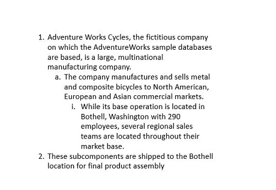

# Working with lists in PowerPoint Library

## Creating a simple list

Essential Presentation allows you to create simple and multi-level lists that make the content easier for reading. In PowerPoint, Presentation lists consists of the following types 

1. Numbered list
2. Bulleted list
3. Picture list 

### Numbered List

The following code example illustrates how to create a numbered list:




//Creates a new Presentation instance.
IPresentation pptxDoc = Presentation.Create();
//Adds a blank slide into the Presentation
ISlide slide = pptxDoc.Slides.Add(SlideLayoutType.Blank);
//Adds a textbox to hold the list
IShape textBoxShape = slide.AddTextBox(65, 140, 410, 270);
// Adds a new paragraph with the text in the left hand side textbox.
IParagraph paragraph = textBoxShape.TextBody.AddParagraph("AdventureWorks Cycles, the fictitious company on which the AdventureWorks sample databases are based, is a large, multinational manufacturing company.");
//Sets the list type as Numbered
paragraph.ListFormat.Type = ListType.Numbered;
//Sets the numbered style (list numbering) as Arabic number following by period.
paragraph.ListFormat.NumberStyle = NumberedListStyle.ArabicPeriod;
//Sets the starting value as 1
paragraph.ListFormat.StartValue = 1;
//Sets the list level as 1
paragraph.IndentLevelNumber = 1;
//Sets the hanging value
paragraph.FirstLineIndent = -20;
//Sets the bullet character size. Here, 100 means 100% of its text. Possible values can range from 25 to 400.
paragraph.ListFormat.Size = 100;
//Adds another paragraph with the text in the left hand side textbox.
paragraph = textBoxShape.TextBody.AddParagraph("The company manufactures and sells metal and composite bicycles to North American, European and Asian commercial markets.");
//Sets the list type as bulleted
paragraph.ListFormat.Type = ListType.Numbered;
//Sets the numbered style (list numbering) as Arabic number following by period.
paragraph.ListFormat.NumberStyle = NumberedListStyle.ArabicPeriod;
//Sets the list level as 1
paragraph.IndentLevelNumber = 1;
//Sets the hanging value
paragraph.FirstLineIndent = -20;
//Sets the bullet character size. Here, 100 means 100% of its text. Possible values can range from 25 to 400.
paragraph.ListFormat.Size = 100;
//Adds another paragraph with the text in the left hand side textbox.
paragraph = textBoxShape.TextBody.AddParagraph("While its base operation is located in Washington with 290 employees, several regional sales teams are located throughout their market base.");
//Sets the list type as bulleted
paragraph.ListFormat.Type = ListType.Numbered;
//Sets the numbered style (list numbering) as Arabic number following by period.
paragraph.ListFormat.NumberStyle = NumberedListStyle.ArabicPeriod;
//Sets the list level as 1
paragraph.IndentLevelNumber = 1;
//Sets the hanging value
paragraph.FirstLineIndent = -20;
//Sets the bullet character size. Here, 100 means 100% of its text. Possible values can range from 25 to 400.
paragraph.ListFormat.Size = 100;
//Saves the Presentation to the file system.
pptxDoc.Save("Sample.pptx");
Process.Start("Sample.pptx");
//Closes the Presentation
pptxDoc.Close();



'Creates a new Presentation instance.
Dim pptxDoc As IPresentation = Presentation.Create()
'Adds the slide into the Presentation
Dim slide As ISlide = pptxDoc.Slides.Add(SlideLayoutType.Blank)
'Adds a textbox to hold the list
Dim textBoxShape As IShape = slide.AddTextBox(65, 140, 410, 270)
'Adds a new paragraph with the text in the left hand side textbox.
Dim paragraph As IParagraph = textBoxShape.TextBody.AddParagraph("AdventureWorks Cycles, the fictitious company on which the AdventureWorks sample databases are based, is a large, multinational manufacturing company.")
'Sets the list type as Numbered
paragraph.ListFormat.Type = ListType.Numbered
'Sets the numbered style (list numbering) as Arabic number following by period.
paragraph.ListFormat.NumberStyle = NumberedListStyle.ArabicPeriod
'Sets the starting value as 1
paragraph.ListFormat.StartValue = 1
'Sets the list level as 1
paragraph.IndentLevelNumber = 1
'Sets the hanging value
paragraph.FirstLineIndent = -20
'Sets the bullet character size. Here, 100 means 100% of its text. Possible values can range from 25 to 400.
paragraph.ListFormat.Size = 100
'Adds another paragraph with the text in the left hand side textbox.
paragraph = textBoxShape.TextBody.AddParagraph("The company manufactures and sells metal and composite bicycles to North American, European and Asian commercial markets.")
'Sets the list type as bulleted
paragraph.ListFormat.Type = ListType.Numbered
'Sets the numbered style (list numbering) as Arabic number following by period.
paragraph.ListFormat.NumberStyle = NumberedListStyle.ArabicPeriod
'Sets the list level as 1
paragraph.IndentLevelNumber = 1
'Sets the hanging value
paragraph.FirstLineIndent = -20
'Sets the bullet character size. Here, 100 means 100% of its text. Possible values can range from 25 to 400.
paragraph.ListFormat.Size = 100
'Adds another paragraph with the text in the left hand side textbox.
paragraph = textBoxShape.TextBody.AddParagraph("While its base operation is located Washington with 290 employees, several regional sales teams are located throughout their market base.")
'Sets the list type as bulleted
paragraph.ListFormat.Type = ListType.Numbered
'Sets the numbered style (list numbering) as Arabic number following by period.
paragraph.ListFormat.NumberStyle = NumberedListStyle.ArabicPeriod
'Sets the list level as 1
paragraph.IndentLevelNumber = 1
'Sets the hanging value
paragraph.FirstLineIndent = -20
'Sets the bullet character size. Here, 100 means 100% of its text. Possible values can range from 25 to 400.
paragraph.ListFormat.Size = 100
'Saves the Presentation to the file system.
pptxDoc.Save("Sample.pptx")
Process.Start("Sample.pptx")
'Closes the Presentation
pptxDoc.Close()



//Creates a new Presentation instance.
IPresentation pptxDoc = Presentation.Create();
//Adds a blank slide into the Presentation
ISlide slide = pptxDoc.Slides.Add(SlideLayoutType.Blank);
//Adds a textbox to hold the list
IShape textBoxShape = slide.AddTextBox(65, 140, 410, 270);
//Adds a new paragraph with the text in the left hand side textbox.
IParagraph paragraph = textBoxShape.TextBody.AddParagraph("AdventureWorks Cycles, the fictitious company on which the AdventureWorks sample databases are based, is a large, multinational manufacturing company.");
//Sets the list type as Numbered
paragraph.ListFormat.Type = ListType.Numbered;
//Sets the numbered style (list numbering) as Arabic number following by period.
paragraph.ListFormat.NumberStyle = NumberedListStyle.ArabicPeriod;
//Sets the starting value as 1
paragraph.ListFormat.StartValue = 1;
//Sets the list level as 1
paragraph.IndentLevelNumber = 1;
//Sets the hanging value
paragraph.FirstLineIndent = -20;
//Sets the bullet character size. Here, 100 means 100% of its text. Possible values can range from 25 to 400.
paragraph.ListFormat.Size = 100;
//Adds another paragraph with the text in the left hand side textbox.
paragraph = textBoxShape.TextBody.AddParagraph("The company manufactures and sells metal and composite bicycles to North American, European and Asian commercial markets.");
//Sets the list type as bulleted
paragraph.ListFormat.Type = ListType.Numbered;
//Sets the numbered style (list numbering) as Arabic number following by period.
paragraph.ListFormat.NumberStyle = NumberedListStyle.ArabicPeriod;
//Sets the list level as 1
paragraph.IndentLevelNumber = 1;
//Sets the hanging value
paragraph.FirstLineIndent = -20;
//Sets the bullet character size. Here, 100 means 100% of its text. Possible values can range from 25 to 400.
paragraph.ListFormat.Size = 100;
//Adds another paragraph with the text in the left hand side textbox.
paragraph = textBoxShape.TextBody.AddParagraph("While its base operation is located in Washington with 290 employees, several regional sales teams are located throughout their market base.");
//Sets the list type as bulleted
paragraph.ListFormat.Type = ListType.Numbered;
//Sets the numbered style (list numbering) as Arabic number following by period.
paragraph.ListFormat.NumberStyle = NumberedListStyle.ArabicPeriod;
//Sets the list level as 1
paragraph.IndentLevelNumber = 1;
//Sets the hanging value
paragraph.FirstLineIndent = -20;
//Sets the bullet character size. Here, 100 means 100% of its text. Possible values can range from 25 to 400.
paragraph.ListFormat.Size = 100;
//Initializes FileSavePicker
FileSavePicker savePicker = new FileSavePicker();
savePicker.SuggestedStartLocation = PickerLocationId.Desktop;
savePicker.SuggestedFileName = "Sample";
savePicker.FileTypeChoices.Add("PowerPoint Files", new List<string>() { ".pptx" });
//Creates a storage file from FileSavePicker
StorageFile storageFile = await savePicker.PickSaveFileAsync();
//Saves changes to the specified storage file
await pptxDoc.SaveAsync(storageFile);



//Creates a new Presentation instance.
IPresentation pptxDoc = Presentation.Create();
//Adds a blank slide into the Presentation
ISlide slide = pptxDoc.Slides.Add(SlideLayoutType.Blank);
// Adds a textbox to hold the list
IShape textBoxShape = slide.AddTextBox(65, 140, 410, 270);
//Adds a new paragraph with the text in the left hand side textbox.
IParagraph paragraph = textBoxShape.TextBody.AddParagraph("AdventureWorks Cycles, the fictitious company on which the AdventureWorks sample databases are based, is a large, multinational manufacturing company.");
//Sets the list type as Numbered
paragraph.ListFormat.Type = ListType.Numbered;
//Sets the numbered style (list numbering) as Arabic number following by period.
paragraph.ListFormat.NumberStyle = NumberedListStyle.ArabicPeriod;
//Sets the starting value as 1
paragraph.ListFormat.StartValue = 1;
//Sets the list level as 1
paragraph.IndentLevelNumber = 1;
//Sets the hanging value
paragraph.FirstLineIndent = -20;
//Sets the bullet character size. Here, 100 means 100% of its text. Possible values can range from 25 to 400.
paragraph.ListFormat.Size = 100;
//Adds another paragraph with the text in the left hand side textbox.
paragraph = textBoxShape.TextBody.AddParagraph("The company manufactures and sells metal and composite bicycles to North American, European and Asian commercial markets.");
//Sets the list type as bulleted
paragraph.ListFormat.Type = ListType.Numbered;
//Sets the numbered style (list numbering) as Arabic number following by period.
paragraph.ListFormat.NumberStyle = NumberedListStyle.ArabicPeriod;
//Sets the list level as 1
paragraph.IndentLevelNumber = 1;
//Sets the hanging value
paragraph.FirstLineIndent = -20;
//Sets the bullet character size. Here, 100 means 100% of its text. Possible values can range from 25 to 400.
paragraph.ListFormat.Size = 100;
//Adds another paragraph with the text in the left hand side textbox.
paragraph = textBoxShape.TextBody.AddParagraph("While its base operation is located in Washington with 290 employees, several regional sales teams are located throughout their market base.");
//Sets the list type as bulleted
paragraph.ListFormat.Type = ListType.Numbered;
//Sets the numbered style (list numbering) as Arabic number following by period.
paragraph.ListFormat.NumberStyle = NumberedListStyle.ArabicPeriod;
//Sets the list level as 1
paragraph.IndentLevelNumber = 1;
// Sets the hanging value
paragraph.FirstLineIndent = -20;
// Sets the bullet character size. Here, 100 means 100% of its text. Possible values can range from 25 to 400.
paragraph.ListFormat.Size = 100;
//Save the PowerPoint Presentation as stream
FileStream outputStream = new FileStream("Sample.pptx", FileMode.Create);
pptxDoc.Save(outputStream);
//Closes the Presentation
pptxDoc.Close();



//Creates a new Presentation instance.
IPresentation pptxDoc = Presentation.Create();
//Adds a blank slide into the Presentation
ISlide slide = pptxDoc.Slides.Add(SlideLayoutType.Blank);
//Adds a textbox to hold the list
IShape textBoxShape = slide.AddTextBox(65, 140, 410, 270);
//Adds a new paragraph with the text in the left hand side textbox.
IParagraph paragraph = textBoxShape.TextBody.AddParagraph("AdventureWorks Cycles, the fictitious company on which the AdventureWorks sample databases are based, is a large, multinational manufacturing company.");
//Sets the list type as Numbered
paragraph.ListFormat.Type = ListType.Numbered;
//Sets the numbered style (list numbering) as Arabic number following by period.
paragraph.ListFormat.NumberStyle = NumberedListStyle.ArabicPeriod;
//Sets the starting value as 1
paragraph.ListFormat.StartValue = 1;
//Sets the list level as 1
paragraph.IndentLevelNumber = 1;
//Sets the hanging value
paragraph.FirstLineIndent = -20;
//Sets the bullet character size. Here, 100 means 100% of its text. Possible values can range from 25 to 400.
paragraph.ListFormat.Size = 100;           
//Adds another paragraph with the text in the left hand side textbox.
paragraph = textBoxShape.TextBody.AddParagraph("The company manufactures and sells metal and composite bicycles to North American, European and Asian commercial markets.");
//Sets the list type as bulleted
paragraph.ListFormat.Type = ListType.Numbered;
//Sets the numbered style (list numbering) as Arabic number following by period.
paragraph.ListFormat.NumberStyle = NumberedListStyle.ArabicPeriod;
//Sets the list level as 1
paragraph.IndentLevelNumber = 1;
//Sets the hanging value
paragraph.FirstLineIndent = -20;
// Sets the bullet character size. Here, 100 means 100% of its text. Possible values can range from 25 to 400.
paragraph.ListFormat.Size = 100;
//Adds another paragraph with the text in the left hand side textbox.
paragraph = textBoxShape.TextBody.AddParagraph("While its base operation is located in Washington with 290 employees, several regional sales teams are located throughout their market base.");
//Sets the list type as bulleted
paragraph.ListFormat.Type = ListType.Numbered;
//Sets the numbered style (list numbering) as Arabic number following by period.
paragraph.ListFormat.NumberStyle = NumberedListStyle.ArabicPeriod;
//Sets the list level as 1
paragraph.IndentLevelNumber = 1;
//Sets the hanging value
paragraph.FirstLineIndent = -20;
//Sets the bullet character size. Here, 100 means 100% of its text. Possible values can range from 25 to 400.
paragraph.ListFormat.Size = 100;
//Create new memory stream to save Presentation.
MemoryStream stream = new MemoryStream();
//Save Presentation in stream format.
pptxDoc.Save(stream);
//Close the presentation
pptxDoc.Close();
stream.Position = 0;
//The operation in Save under Xamarin varies between Windows Phone, Android and iOS platforms. Please refer presentation/xamarin section for respective code samples.
if (Device.OS == TargetPlatform.WinPhone || Device.OS == TargetPlatform.Windows)
    Xamarin.Forms.DependencyService.Get<ISaveWindowsPhone>().Save("Sample.pptx", "application/vnd.openxmlformats-officedocument.presentationml.presentation", stream);
else
    Xamarin.Forms.DependencyService.Get<ISave>().Save("Sample.pptx", "application/vnd.openxmlformats-officedocument.presentationml.presentation", stream);




### Bulleted list

The following code example demonstrates how to create a simple bulleted list.




//Creates a new Presentation instance.
IPresentation pptxDoc = Presentation.Create();
//Adds the slide into the Presentation
ISlide slide = pptxDoc.Slides.Add(SlideLayoutType.Blank);
//Adds a textbox to hold the list
IShape textBoxShape = slide.AddTextBox(65, 140, 410, 250);
// Adds a new paragraph with the text in the left hand side textbox.
IParagraph paragraph = textBoxShape.TextBody.AddParagraph("AdventureWorks Cycles, the fictitious company on which the AdventureWorks sample databases are based, is a large, multinational manufacturing company.");
//Sets the list type as bulleted
paragraph.ListFormat.Type = ListType.Bulleted;
//Sets the bullet character for this list
paragraph.ListFormat.BulletCharacter = Convert.ToChar(183);
//Sets the hanging value
paragraph.FirstLineIndent = -20;
//Sets the list level as 1
paragraph.IndentLevelNumber = 1;
//Sets the font for the bullet character
paragraph.ListFormat.FontName = "Symbol";
//Sets the bullet character size. Here, 100 means 100% of its text. Possible values can range from 25 to 400.
paragraph.ListFormat.Size = 100;
//Adds another paragraph with the text in the left hand side textbox.
paragraph = textBoxShape.TextBody.AddParagraph("The company manufactures and sells metal and composite bicycles to North American, European and Asian commercial markets.");
//Sets the list type as bulleted
paragraph.ListFormat.Type = ListType.Bulleted;
//Sets the bullet character for this list
paragraph.ListFormat.BulletCharacter = Convert.ToChar(183);
//Sets the hanging value
paragraph.FirstLineIndent = -20;
//Sets the list level as 1
paragraph.IndentLevelNumber = 1;
//Sets the font for the bullet character
paragraph.ListFormat.FontName = "Symbol";
//Sets the bullet character size. Here, 100 means 100% of its text. Possible values can range from 25 to 400.
paragraph.ListFormat.Size = 100;            
//Adds another paragraph with the text in the left hand side textbox.
paragraph = textBoxShape.TextBody.AddParagraph("While its base operation is located in Washington with 290 employees, several regional sales teams are located throughout their market base.");
//Sets the list type as bulleted
paragraph.ListFormat.Type = ListType.Bulleted;
//Sets the bullet character for this list
paragraph.ListFormat.BulletCharacter = Convert.ToChar(183);
//Sets the hanging value
paragraph.FirstLineIndent = -20;
//Sets the list level as 1
paragraph.IndentLevelNumber = 1;
//Sets the font of the bullet character
paragraph.ListFormat.FontName = "Symbol";
//Sets the bullet character size. Here, 100 means 100% of its text. Possible values can range from 25 to 400.
paragraph.ListFormat.Size = 100;
//Saves the Presentation to the file system.
pptxDoc.Save("Sample.pptx");
Process.Start("Sample.pptx");
//Closes the Presentation
pptxDoc.Close();



'Creates a new Presentation instance.
Dim pptxDoc As IPresentation = Presentation.Create()
'Adds the slide into the Presentation
Dim slide As ISlide = pptxDoc.Slides.Add(SlideLayoutType.Blank)
'Adds a textbox to hold the list
Dim textBoxShape As IShape = slide.AddTextBox(65, 140, 410, 250)
'Adds a new paragraph with the text in the left hand side textbox.
Dim paragraph As IParagraph = textBoxShape.TextBody.AddParagraph("AdventureWorks Cycles, the fictitious company on which the AdventureWorks sample databases are based, is a large, multinational manufacturing company.")
'Sets the list type as bulleted
paragraph.ListFormat.Type = ListType.Bulleted
'Sets the bullet character for this list
paragraph.ListFormat.BulletCharacter = Convert.ToChar(183)
'Sets the hanging value
paragraph.FirstLineIndent = -20
'Sets the list level as 1
paragraph.IndentLevelNumber = 1
'Sets the font for the bullet character
paragraph.ListFormat.FontName = "Symbol"
'Sets the bullet character size. Here, 100 means 100% of its text. Possible values can range from 25 to 400.
paragraph.ListFormat.Size = 100
'Adds another paragraph with the text in the left hand side textbox.
paragraph = textBoxShape.TextBody.AddParagraph("The company manufactures and sells metal and composite bicycles to North American, European and Asian commercial markets.")
'Sets the list type as bulleted
paragraph.ListFormat.Type = ListType.Bulleted
'Sets the bullet character for this list
paragraph.ListFormat.BulletCharacter = Convert.ToChar(183)
'Sets the hanging value
paragraph.FirstLineIndent = -20
'Sets the list level as 1
paragraph.IndentLevelNumber = 1
'Sets the font for the bullet character
paragraph.ListFormat.FontName = "Symbol"
'Sets the bullet character size. Here, 100 means 100% of its text. Possible values can range from 25 to 400.
paragraph.ListFormat.Size = 100
'Adds another paragraph with the text in the left hand side textbox.
paragraph = textBoxShape.TextBody.AddParagraph("While its base operation is located in Washington with 290 employees, several regional sales teams are located throughout their market base.")
'Sets the list type as bulleted
paragraph.ListFormat.Type = ListType.Bulleted
'Sets the bullet character for this list
paragraph.ListFormat.BulletCharacter = Convert.ToChar(183)
'Sets the hanging value
paragraph.FirstLineIndent = -20
'Sets the list level as 1
paragraph.IndentLevelNumber = 1
'Sets the font of the bullet character
paragraph.ListFormat.FontName = "Symbol"
'Sets the bullet character size. Here, 100 means 100% of its text. Possible values can range from 25 to 400.
paragraph.ListFormat.Size = 100
'Saves the Presentation to the file system.
pptxDoc.Save(""Sample.pptx"")
Process.Start(""Sample.pptx"")
'Closes the Presentation
pptxDoc.Close()



//Creates a new Presentation instance.
IPresentation pptxDoc = Presentation.Create();
//Adds the slide into the Presentation
ISlide slide = pptxDoc.Slides.Add(SlideLayoutType.Blank);
//Adds a textbox to hold the list
IShape textBoxShape = slide.AddTextBox(65, 140, 410, 250);
//Adds a new paragraph with the text in the left hand side textbox.
IParagraph paragraph = textBoxShape.TextBody.AddParagraph("AdventureWorks Cycles, the fictitious company on which the AdventureWorks sample databases are based, is a large, multinational manufacturing company.");
//Sets the list type as bulleted
paragraph.ListFormat.Type = ListType.Bulleted;
//Sets the bullet character for this list
paragraph.ListFormat.BulletCharacter = Convert.ToChar(183);
//Sets the hanging value
paragraph.FirstLineIndent = -20;
//Sets the list level as 1
paragraph.IndentLevelNumber = 1;
//Sets the font for the bullet character
paragraph.ListFormat.FontName = "Symbol";
//Sets the bullet character size. Here, 100 means 100% of its text. Possible values can range from 25 to 400.
paragraph.ListFormat.Size = 100;
//Adds another paragraph with the text in the left hand side textbox.
paragraph = textBoxShape.TextBody.AddParagraph("The company manufactures and sells metal and composite bicycles to North American, European and Asian commercial markets.");
//Sets the list type as bulleted
paragraph.ListFormat.Type = ListType.Bulleted;
//Sets the bullet character for this list
paragraph.ListFormat.BulletCharacter = Convert.ToChar(183);
//Sets the hanging value
paragraph.FirstLineIndent = -20;
//Sets the list level as 1
paragraph.IndentLevelNumber = 1;
//Sets the font for the bullet character
paragraph.ListFormat.FontName = "Symbol";
//Sets the bullet character size. Here, 100 means 100% of its text. Possible values can range from 25 to 400.
paragraph.ListFormat.Size = 100;
//Adds another paragraph with the text in the left hand side textbox.
paragraph = textBoxShape.TextBody.AddParagraph("While its base operation is located in Washington with 290 employees, several regional sales teams are located throughout their market base.");
//Sets the list type as bulleted
paragraph.ListFormat.Type = ListType.Bulleted;
//Sets the bullet character for this list
paragraph.ListFormat.BulletCharacter = Convert.ToChar(183);
//Sets the hanging value
paragraph.FirstLineIndent = -20;
//Sets the list level as 1
paragraph.IndentLevelNumber = 1;
//Sets the font of the bullet character
paragraph.ListFormat.FontName = "Symbol";
// Sets the bullet character size. Here, 100 means 100% of its text. Possible values can range from 25 to 400.
paragraph.ListFormat.Size = 100;
//Initializes FileSavePicker
FileSavePicker savePicker = new FileSavePicker();
savePicker.SuggestedStartLocation = PickerLocationId.Desktop;
savePicker.SuggestedFileName = "Sample";
savePicker.FileTypeChoices.Add("PowerPoint Files", new List<string>() { ".pptx" });
//Creates a storage file from FileSavePicker
StorageFile storageFile = await savePicker.PickSaveFileAsync();
//Saves changes to the specified storage file
await pptxDoc.SaveAsync(storageFile);



//Creates a new Presentation instance.
IPresentation pptxDoc = Presentation.Create();
//Adds the slide into the Presentation
ISlide slide = pptxDoc.Slides.Add(SlideLayoutType.Blank);
// Adds a textbox to hold the list
IShape textBoxShape = slide.AddTextBox(65, 140, 410, 250);
//Adds a new paragraph with the text in the left hand side textbox.
IParagraph paragraph = textBoxShape.TextBody.AddParagraph("AdventureWorks Cycles, the fictitious company on which the AdventureWorks sample databases are based, is a large, multinational manufacturing company.");
//Sets the list type as bulleted
paragraph.ListFormat.Type = ListType.Bulleted;
//Sets the bullet character for this list
paragraph.ListFormat.BulletCharacter = Convert.ToChar(183);
//Sets the hanging value
paragraph.FirstLineIndent = -20;
//Sets the list level as 1
paragraph.IndentLevelNumber = 1;
//Sets the font for the bullet character
paragraph.ListFormat.FontName = "Symbol";
//Sets the bullet character size. Here, 100 means 100% of its text. Possible values can range from 25 to 400.
paragraph.ListFormat.Size = 100;
//Adds another paragraph with the text in the left hand side textbox.
paragraph = textBoxShape.TextBody.AddParagraph("The company manufactures and sells metal and composite bicycles to North American, European and Asian commercial markets.");
//Sets the list type as bulleted
paragraph.ListFormat.Type = ListType.Bulleted;
//Sets the bullet character for this list
paragraph.ListFormat.BulletCharacter = Convert.ToChar(183);
//Sets the hanging value
paragraph.FirstLineIndent = -20;
//Sets the list level as 1
paragraph.IndentLevelNumber = 1;
//Sets the font for the bullet character
paragraph.ListFormat.FontName = "Symbol";
//Sets the bullet character size. Here, 100 means 100% of its text. Possible values can range from 25 to 400.
paragraph.ListFormat.Size = 100;            
//Adds another paragraph with the text in the left hand side textbox.
paragraph = textBoxShape.TextBody.AddParagraph("While its base operation is located in Washington with 290 employees, several regional sales teams are located throughout their market base.");
//Sets the list type as bulleted
paragraph.ListFormat.Type = ListType.Bulleted;
//Sets the bullet character for this list
paragraph.ListFormat.BulletCharacter = Convert.ToChar(183);
//Sets the hanging value
paragraph.FirstLineIndent = -20;
//Sets the list level as 1
paragraph.IndentLevelNumber = 1;
//Sets the font of the bullet character
paragraph.ListFormat.FontName = "Symbol";
//Sets the bullet character size. Here, 100 means 100% of its text. Possible values can range from 25 to 400.
paragraph.ListFormat.Size = 100;
//Save the PowerPoint Presentation as stream
FileStream outputStream = new FileStream("Sample.pptx", FileMode.Create);
pptxDoc.Save(outputStream);
//Closes the Presentation
pptxDoc.Close();



//Creates a new Presentation instance.
IPresentation pptxDoc = Presentation.Create();
//Adds the slide into the Presentation
ISlide slide = pptxDoc.Slides.Add(SlideLayoutType.Blank);
//Adds a textbox to hold the list
IShape textBoxShape = slide.AddTextBox(65, 140, 410, 250);
//Adds a new paragraph with the text in the left hand side textbox.
IParagraph paragraph = textBoxShape.TextBody.AddParagraph("AdventureWorks Cycles, the fictitious company on which the AdventureWorks sample databases are based, is a large, multinational manufacturing company.");
//Sets the list type as bulleted
paragraph.ListFormat.Type = ListType.Bulleted;
//Sets the bullet character for this list
paragraph.ListFormat.BulletCharacter = Convert.ToChar(183);
//Sets the hanging value
paragraph.FirstLineIndent = -20;
//Sets the list level as 1
paragraph.IndentLevelNumber = 1;
//Sets the font for the bullet character
paragraph.ListFormat.FontName = "Symbol";
//Sets the bullet character size. Here, 100 means 100% of its text. Possible values can range from 25 to 400.
paragraph.ListFormat.Size = 100;
//Adds another paragraph with the text in the left hand side textbox.
paragraph = textBoxShape.TextBody.AddParagraph("The company manufactures and sells metal and composite bicycles to North American, European and Asian commercial markets.");
//Sets the list type as bulleted
paragraph.ListFormat.Type = ListType.Bulleted;
//Sets the bullet character for this list
paragraph.ListFormat.BulletCharacter = Convert.ToChar(183);
//Sets the hanging value
paragraph.FirstLineIndent = -20;
//Sets the list level as 1
paragraph.IndentLevelNumber = 1;
//Sets the font for the bullet character
paragraph.ListFormat.FontName = "Symbol";
//Sets the bullet character size. Here, 100 means 100% of its text. Possible values can range from 25 to 400.
paragraph.ListFormat.Size = 100;
//Adds another paragraph with the text in the left hand side textbox.
paragraph = textBoxShape.TextBody.AddParagraph("While its base operation is located in Washington with 290 employees, several regional sales teams are located throughout their market base.");
//Sets the list type as bulleted
paragraph.ListFormat.Type = ListType.Bulleted;
//Sets the bullet character for this list
paragraph.ListFormat.BulletCharacter = Convert.ToChar(183);
//Sets the hanging value
paragraph.FirstLineIndent = -20;
//Sets the list level as 1
paragraph.IndentLevelNumber = 1;
//Sets the font of the bullet character
paragraph.ListFormat.FontName = "Symbol";
//Sets the bullet character size. Here, 100 means 100% of its text. Possible values can range from 25 to 400.
paragraph.ListFormat.Size = 100;
//Create new memory stream to save Presentation.
MemoryStream stream = new MemoryStream();
//Save Presentation in stream format.
pptxDoc.Save(stream);
//Close the presentation
pptxDoc.Close();
stream.Position = 0;
//The operation in Save under Xamarin varies between Windows Phone, Android and iOS platforms. Please refer presentation/xamarin section for respective code samples.
if (Device.OS == TargetPlatform.WinPhone || Device.OS == TargetPlatform.Windows)
    Xamarin.Forms.DependencyService.Get<ISaveWindowsPhone>().Save("Sample.pptx", "application/vnd.openxmlformats-officedocument.presentationml.presentation", stream);
else
    Xamarin.Forms.DependencyService.Get<ISave>().Save("Sample.pptx", "application/vnd.openxmlformats-officedocument.presentationml.presentation", stream);




### Picture List

The following code example demonstrates how to create a simple picture list.




//Creates a new Presentation instance.
IPresentation pptxDoc = Presentation.Create();
//Adds the slide into the Presentation
ISlide slide = pptxDoc.Slides.Add(SlideLayoutType.Blank);
// Adds a textbox to hold the list
IShape textBoxShape = slide.AddTextBox(65, 140, 410, 270);
// Adds a new paragraph with the text in the left hand side textbox.
IParagraph paragraph = textBoxShape.TextBody.AddParagraph("AdventureWorks Cycles, the fictitious company on which the AdventureWorks sample databases are based, is a large, multinational manufacturing company.");
//Sets the list type as Numbered
paragraph.ListFormat.Type = ListType.Picture;
//Sets the image for the list.
paragraph.ListFormat.Picture(new MemoryStream(Syncfusion.Drawing.Image.FromFile("Image.png").ImageData));
//Sets the picture size. Here, 100 means 100% of its text. Possible values can range from 25 to 400.
paragraph.ListFormat.Size = 150;
//Sets the list level as 1
paragraph.IndentLevelNumber = 1;
// Sets the hanging value
paragraph.FirstLineIndent = -20;
//Adds another paragraph with the text in the left hand side textbox.
paragraph = textBoxShape.TextBody.AddParagraph("The company manufactures and sells metal and composite bicycles to North American, European and Asian commercial markets.");
//Sets the list type as picture
paragraph.ListFormat.Type = ListType.Picture;
//Sets the image for the list.
paragraph.ListFormat.Picture(new MemoryStream(Syncfusion.Drawing.Image.FromFile("Image.png").ImageData));
//Sets the picture size. Here, 100 means 100% of its text. Possible values can range from 25 to 400.
paragraph.ListFormat.Size = 150;
//Sets the list level as 1
paragraph.IndentLevelNumber = 1;
//Sets the hanging value
paragraph.FirstLineIndent = -20;
//Saves the Presentation to the file system.
pptxDoc.Save("Sample.pptx");
//Closes the Presentation
pptxDoc.Close();



'Creates a new Presentation instance.
Dim pptxDoc As IPresentation = Presentation.Create()
'Adds the slide into the Presentation
Dim slide As ISlide = pptxDoc.Slides.Add(SlideLayoutType.Blank)
'Adds a textbox to hold the list
Dim textBoxShape As IShape = slide.AddTextBox(65, 140, 410, 270)
'Adds a new paragraph with the text in the left hand side textbox.
Dim paragraph As IParagraph = textBoxShape.TextBody.AddParagraph("AdventureWorks Cycles, the fictitious company on which the AdventureWorks sample databases are based, is a large, multinational manufacturing company.")
'Sets the list type as Numbered
paragraph.ListFormat.Type = ListType.Picture
'Sets the image for the list.
paragraph.ListFormat.Picture(New MemoryStream (Syncfusion.Drawing.Image.FromFile("Image.png").ImageData))
'Sets the picture size. Here, 100 means 100% of its text. Possible values can range from 25 to 400.
paragraph.ListFormat.Size = 150
'Sets the list level as 1
paragraph.IndentLevelNumber = 1
'Sets the hanging value
paragraph.FirstLineIndent = -20
'Adds another paragraph with the text in the left hand side textbox.
paragraph = textBoxShape.TextBody.AddParagraph("The company manufactures and sells metal and composite bicycles to North American, European and Asian commercial markets.")
'Sets the list type as picture
paragraph.ListFormat.Type = ListType.Picture
'Sets the image for the list.
paragraph.ListFormat.Picture(New MemoryStream (Syncfusion.Drawing. Image.FromFile("Image.png").ImageData))
'Sets the picture size. Here, 100 means 100% of its text. Possible values can range from 25 to 400.
paragraph.ListFormat.Size = 150
'Sets the list level as 1
paragraph.IndentLevelNumber = 1
'Sets the hanging value
paragraph.FirstLineIndent = -20
'Saves the Presentation to the file system.
pptxDoc.Save("Sample.pptx")
'Closes the Presentation
pptxDoc.Close()



//Creates a new Presentation instance.
IPresentation pptxDoc = Presentation.Create();
//Adds the slide into the Presentation
ISlide slide = pptxDoc.Slides.Add(SlideLayoutType.Blank);
//Adds a textbox to hold the list
IShape textBoxShape = slide.AddTextBox(65, 140, 410, 270);
//Adds a new paragraph with the text in the left hand side textbox.
IParagraph paragraph = textBoxShape.TextBody.AddParagraph("AdventureWorks Cycles, the fictitious company on which the AdventureWorks sample databases are based, is a large, multinational manufacturing company.");
//Sets the list type as Numbered
paragraph.ListFormat.Type = ListType.Picture;
//Sets the image for the list.
Assembly assembly = typeof(App).GetTypeInfo().Assembly;
Stream pictureStream = assembly.GetManifestResourceStream("UWP.Data.Image.png");
paragraph.ListFormat.Picture(pictureStream);
//Sets the picture size. Here, 100 means 100% of its text. Possible values can range from 25 to 400.
paragraph.ListFormat.Size = 150;
//Sets the list level as 1
paragraph.IndentLevelNumber = 1;
//Sets the hanging value
paragraph.FirstLineIndent = -20;
//Adds another paragraph with the text in the left hand side textbox.
paragraph = textBoxShape.TextBody.AddParagraph("The company manufactures and sells metal and composite bicycles to North American, European and Asian commercial markets.");
//Sets the list type as picture
paragraph.ListFormat.Type = ListType.Picture;
//Sets the image for the list.
paragraph.ListFormat.Picture(new MemoryStream(Syncfusion.Drawing.Image.FromFile("Image.png").ImageData));
//Sets the picture size. Here, 100 means 100% of its text. Possible values can range from 25 to 400.
paragraph.ListFormat.Size = 150;
//Sets the list level as 1
paragraph.IndentLevelNumber = 1;
//Sets the hanging value
paragraph.FirstLineIndent = -20;
//Initializes FileSavePicker
FileSavePicker savePicker = new FileSavePicker();
savePicker.SuggestedStartLocation = PickerLocationId.Desktop;
savePicker.SuggestedFileName = "Sample";
savePicker.FileTypeChoices.Add("PowerPoint Files", new List<string>() { ".pptx" });
//Creates a storage file from FileSavePicker
StorageFile storageFile = await savePicker.PickSaveFileAsync();
//Saves changes to the specified storage file
await pptxDoc.SaveAsync(storageFile);



//Creates a new Presentation instance.
IPresentation pptxDoc = Presentation.Create();
//Adds the slide into the Presentation
ISlide slide = pptxDoc.Slides.Add(SlideLayoutType.Blank);
//Adds a textbox to hold the list
IShape textBoxShape = slide.AddTextBox(65, 140, 410, 270);
//Adds a new paragraph with the text in the left hand side textbox.
IParagraph paragraph = textBoxShape.TextBody.AddParagraph("AdventureWorks Cycles, the fictitious company on which the AdventureWorks sample databases are based, is a large, multinational manufacturing company.");
//Sets the list type as Numbered
paragraph.ListFormat.Type = ListType.Picture;
//Sets the image for the list.
paragraph.ListFormat.Picture(pictureStream);
//Sets the picture size. Here, 100 means 100% of its text. Possible values can range from 25 to 400.
paragraph.ListFormat.Size = 150;
//Sets the list level as 1
paragraph.IndentLevelNumber = 1;
//Sets the hanging value
paragraph.FirstLineIndent = -20;
//Adds another paragraph with the text in the left hand side textbox.
paragraph = textBoxShape.TextBody.AddParagraph("The company manufactures and sells metal and composite bicycles to North American, European and Asian commercial markets.");
//Sets the list type as picture
paragraph.ListFormat.Type = ListType.Picture;
//Sets the image for the list.
paragraph.ListFormat.Picture(pictureStream);
//Sets the picture size. Here, 100 means 100% of its text. Possible values can range from 25 to 400.
paragraph.ListFormat.Size = 150;
//Sets the list level as 1
paragraph.IndentLevelNumber = 1;
//Sets the hanging value
paragraph.FirstLineIndent = -20;
//Save the PowerPoint Presentation as stream
FileStream outputStream = new FileStream("Sample.pptx", FileMode.Create);
pptxDoc.Save(outputStream);
//Closes the Presentation
pptxDoc.Close();



//Creates a new Presentation instance.
IPresentation pptxDoc = Presentation.Create();
//Adds the slide into the Presentation
ISlide slide = pptxDoc.Slides.Add(SlideLayoutType.Blank);
// Adds a textbox to hold the list
IShape textBoxShape = slide.AddTextBox(65, 140, 410, 270);
//Adds a new paragraph with the text in the left hand side textbox.
IParagraph paragraph = textBoxShape.TextBody.AddParagraph("AdventureWorks Cycles, the fictitious company on which the AdventureWorks sample databases are based, is a large, multinational manufacturing company.");
//Sets the list type as Numbered
paragraph.ListFormat.Type = ListType.Picture;
//Sets the image for the list.
paragraph.ListFormat.Picture(pictureStream);
//Sets the picture size. Here, 100 means 100% of its text. Possible values can range from 25 to 400.
paragraph.ListFormat.Size = 150;
//Sets the list level as 1
paragraph.IndentLevelNumber = 1;
//Sets the hanging value
paragraph.FirstLineIndent = -20;
//Adds another paragraph with the text in the left hand side textbox.
paragraph = textBoxShape.TextBody.AddParagraph("The company manufactures and sells metal and composite bicycles to North American, European and Asian commercial markets.");
//Sets the list type as picture
paragraph.ListFormat.Type = ListType.Picture;
//Sets the image for the list.
paragraph.ListFormat.Picture(pictureStream);
//Sets the picture size. Here, 100 means 100% of its text. Possible values can range from 25 to 400.
paragraph.ListFormat.Size = 150;
//Sets the list level as 1
paragraph.IndentLevelNumber = 1;
//Sets the hanging value
paragraph.FirstLineIndent = -20;
//Create new memory stream to save Presentation.
MemoryStream stream = new MemoryStream();
//Save Presentation in stream format.
pptxDoc.Save(stream);
//Close the presentation
pptxDoc.Close();
stream.Position = 0;
//The operation in Save under Xamarin varies between Windows Phone, Android and iOS platforms. Please refer presentation/xamarin section for respective code samples.
if (Device.OS == TargetPlatform.WinPhone || Device.OS == TargetPlatform.Windows)
    Xamarin.Forms.DependencyService.Get<ISaveWindowsPhone>().Save("Sample.pptx", "application/vnd.openxmlformats-officedocument.presentationml.presentation", stream);
else
    Xamarin.Forms.DependencyService.Get<ISave>().Save("Sample.pptx", "application/vnd.openxmlformats-officedocument.presentationml.presentation", stream);




## Creating a Multilevel List

You can create a multi-level list by setting the indentation levels. By default, the level begins at 0 and increments by 1 for each level. A list can be incremented or decremented from levels 0 to 8 as like Microsoft PowerPoint. 

The following code example demonstrates how to create a multilevel list.




//Creates a new Presentation instance.
IPresentation pptxDoc = Presentation.Create();
//Adds the slide into the Presentation
ISlide slide = pptxDoc.Slides.Add(SlideLayoutType.Blank);
//Adds a textbox to hold the bulleted list
IShape textBoxShape = slide.AddTextBox(65, 140, 410, 250);
//Adds paragraph to the textbox
IParagraph paragraph = textBoxShape.TextBody.AddParagraph("AdventureWorks Cycles, the fictitious company on which the AdventureWorks sample databases are based, is a large, multinational manufacturing company.");
//Sets the list type as Numbered list
paragraph.ListFormat.Type = ListType.Numbered;
//Sets the numbered style (list numbering) as Arabic number following by period.
paragraph.ListFormat.NumberStyle = NumberedListStyle.ArabicPeriod;
//Sets the starting value as 1
paragraph.ListFormat.StartValue = 1;
//Sets the list level as 1
paragraph.IndentLevelNumber = 1;
//Sets the hanging value
paragraph.FirstLineIndent = -20;
//Adds paragraph to the textbox
paragraph = textBoxShape.TextBody.AddParagraph("The company manufactures and sells metal and composite bicycles to North American, European and Asian commercial markets.");
//Sets the list type as Numbered list
paragraph.ListFormat.Type = ListType.Numbered;
//Sets the numbered style (list numbering) as lower case alphabet following by period.
paragraph.ListFormat.NumberStyle = NumberedListStyle.AlphaLcPeriod;
//Sets the list level as 2
paragraph.IndentLevelNumber = 2;
//Sets the hanging value
paragraph.FirstLineIndent = -20;
//Add paragraph to the textbox
paragraph = textBoxShape.TextBody.AddParagraph("While its base operation is located Washington with 290 employees, several regional sales teams are located throughout their market base.");
//Sets the list type as Numbered list
paragraph.ListFormat.Type = ListType.Numbered;
//Sets the numbered style (list numbering) as roman number lower casing following by period.
paragraph.ListFormat.NumberStyle = NumberedListStyle.RomanLcPeriod;
//Sets the list level as 3
paragraph.IndentLevelNumber = 3;
//Sets the hanging value
paragraph.FirstLineIndent = -20;
//Adds paragraph to the textbox
paragraph = textBoxShape.TextBody.AddParagraph("These subcomponents are shipped to another location for final product assembly");
//Sets the list type as Numbered list
paragraph.ListFormat.Type = ListType.Numbered;
paragraph.ListFormat.NumberStyle = NumberedListStyle.ArabicPeriod;
//Sets the list level as 1
paragraph.IndentLevelNumber = 1;
//Sets the hanging value
paragraph.FirstLineIndent = -20;
//Saves the Presentation to the file system.
pptxDoc.Save("MultiLevelList.pptx");
//Closes the Presentation
pptxDoc.Close();



'Creates a new Presentation instance.
Dim pptxDoc As IPresentation = Presentation.Create()
'Adds the slide into the Presentation
Dim slide As ISlide = pptxDoc.Slides.Add(SlideLayoutType.Blank)
'Adds a textbox to hold the bulleted list
Dim textBoxShape As IShape = slide.AddTextBox(65, 140, 410, 250)
'Adds paragraph to the textbox
Dim paragraph As IParagraph = textBoxShape.TextBody.AddParagraph("AdventureWorks Cycles, the fictitious company on which the AdventureWorks sample databases are based, is a large, multinational manufacturing company.")
'Sets the list type as Numbered list
paragraph.ListFormat.Type = ListType.Numbered
'Sets the numbered style (list numbering) as Arabic number following by period.
paragraph.ListFormat.NumberStyle = NumberedListStyle.ArabicPeriod
'Sets the starting value as 1
paragraph.ListFormat.StartValue = 1
'Sets the list level as 1
paragraph.IndentLevelNumber = 1
' Sets the hanging value
paragraph.FirstLineIndent = -20
'Adds paragraph to the textbox
paragraph = textBoxShape.TextBody.AddParagraph("The company manufactures and sells metal and composite bicycles to North American, European and Asian commercial markets.")
'Sets the list type as Numbered list
paragraph.ListFormat.Type = ListType.Numbered
'Sets the numbered style (list numbering) as lower case alphabet following by period.
paragraph.ListFormat.NumberStyle = NumberedListStyle.AlphaLcPeriod
'Sets the list level as 2
paragraph.IndentLevelNumber = 2
'Sets the hanging value
paragraph.FirstLineIndent = -20
'Adds paragraph to the textbox
paragraph = textBoxShape.TextBody.AddParagraph("While its base operation is located Washington with 290 employees, several regional sales teams are located throughout their market base.")
'Sets the list type as Numbered list
paragraph.ListFormat.Type = ListType.Numbered
'Sets the numbered style (list numbering) as roman number lower casing following by period.
paragraph.ListFormat.NumberStyle = NumberedListStyle.RomanLcPeriod
'Sets the list level as 3
paragraph.IndentLevelNumber = 3
'Sets the hanging value
paragraph.FirstLineIndent = -20
'Adds paragraph to the textbox
paragraph = textBoxShape.TextBody.AddParagraph("While its base operation is located in Washington with 290 employees, several regional sales teams are located throughout their market base.")
'Sets the list type as Numbered list
paragraph.ListFormat.Type = ListType.Numbered
paragraph.ListFormat.NumberStyle = NumberedListStyle.ArabicPeriod
'Sets the list level as 1
paragraph.IndentLevelNumber = 1
'Sets the hanging value
paragraph.FirstLineIndent = -20
'Saves the Presentation to the file system.
pptxDoc.Save("MultiLevelList.pptx")
'Closes the Presentation
pptxDoc.Close()



//Creates a new Presentation instance.
IPresentation pptxDoc = Presentation.Create();
//Adds the slide into the Presentation
ISlide slide = pptxDoc.Slides.Add(SlideLayoutType.Blank);
//Adds a textbox to hold the bulleted list
IShape textBoxShape = slide.AddTextBox(65, 140, 410, 250);
//Adds paragraph to the textbox
IParagraph paragraph = textBoxShape.TextBody.AddParagraph("AdventureWorks Cycles, the fictitious company on which the AdventureWorks sample databases are based, is a large, multinational manufacturing company.");
//Sets the list type as Numbered list
paragraph.ListFormat.Type = ListType.Numbered;
//Sets the numbered style (list numbering) as Arabic number following by period.
paragraph.ListFormat.NumberStyle = NumberedListStyle.ArabicPeriod;
//Sets the starting value as 1
paragraph.ListFormat.StartValue = 1;
//Sets the list level as 1
paragraph.IndentLevelNumber = 1;
// Sets the hanging value
paragraph.FirstLineIndent = -20;
//Adds paragraph to the textbox
paragraph = textBoxShape.TextBody.AddParagraph("The company manufactures and sells metal and composite bicycles to North American, European and Asian commercial markets.");
//Sets the list type as Numbered list
paragraph.ListFormat.Type = ListType.Numbered;
//Sets the numbered style (list numbering) as lower case alphabet following by period.
paragraph.ListFormat.NumberStyle = NumberedListStyle.AlphaLcPeriod;
//Sets the list level as 2
paragraph.IndentLevelNumber = 2;
//Sets the hanging value
paragraph.FirstLineIndent = -20;
//Add paragraph to the textbox
paragraph = textBoxShape.TextBody.AddParagraph("While its base operation is located Washington with 290 employees, several regional sales teams are located throughout their market base.");
//Sets the list type as Numbered list
paragraph.ListFormat.Type = ListType.Numbered;
//Sets the numbered style (list numbering) as roman number lower casing following by period.
paragraph.ListFormat.NumberStyle = NumberedListStyle.RomanLcPeriod;
//Sets the list level as 3
paragraph.IndentLevelNumber = 3;
//Sets the hanging value
paragraph.FirstLineIndent = -20;
//Adds paragraph to the textbox
paragraph = textBoxShape.TextBody.AddParagraph("These subcomponents are shipped to another location for final product assembly");
//Sets the list type as Numbered list
paragraph.ListFormat.Type = ListType.Numbered;
paragraph.ListFormat.NumberStyle = NumberedListStyle.ArabicPeriod;
//Sets the list level as 1
paragraph.IndentLevelNumber = 1;
//Sets the hanging value
paragraph.FirstLineIndent = -20;
//Initializes FileSavePicker
FileSavePicker savePicker = new FileSavePicker();
savePicker.SuggestedStartLocation = PickerLocationId.Desktop;
savePicker.SuggestedFileName = "MultiLevelList";
savePicker.FileTypeChoices.Add("PowerPoint Files", new List<string>() { ".pptx" });
//Creates a storage file from FileSavePicker
StorageFile storageFile = await savePicker.PickSaveFileAsync();
//Saves changes to the specified storage file
await pptxDoc.SaveAsync(storageFile);



//Creates a new Presentation instance.
IPresentation pptxDoc = Presentation.Create();
//Adds the slide into the Presentation
ISlide slide = pptxDoc.Slides.Add(SlideLayoutType.Blank);
//Adds a textbox to hold the bulleted list
IShape textBoxShape = slide.AddTextBox(65, 140, 410, 250);
//Adds paragraph to the textbox
IParagraph paragraph = textBoxShape.TextBody.AddParagraph("AdventureWorks Cycles, the fictitious company on which the AdventureWorks sample databases are based, is a large, multinational manufacturing company.");
//Sets the list type as Numbered list
paragraph.ListFormat.Type = ListType.Numbered;
//Sets the numbered style (list numbering) as Arabic number following by period.
paragraph.ListFormat.NumberStyle = NumberedListStyle.ArabicPeriod;
//Sets the starting value as 1
paragraph.ListFormat.StartValue = 1;
//Sets the list level as 1
paragraph.IndentLevelNumber = 1;
// Sets the hanging value
paragraph.FirstLineIndent = -20;
//Adds paragraph to the textbox
paragraph = textBoxShape.TextBody.AddParagraph("The company manufactures and sells metal and composite bicycles to North American, European and Asian commercial markets.");
//Sets the list type as Numbered list
paragraph.ListFormat.Type = ListType.Numbered;
//Sets the numbered style (list numbering) as lower case alphabet following by period.
paragraph.ListFormat.NumberStyle = NumberedListStyle.AlphaLcPeriod;
//Sets the list level as 2
paragraph.IndentLevelNumber = 2;
//Sets the hanging value
paragraph.FirstLineIndent = -20;         
//Add paragraph to the textbox
paragraph = textBoxShape.TextBody.AddParagraph("While its base operation is located Washington with 290 employees, several regional sales teams are located throughout their market base.");
//Sets the list type as Numbered list
paragraph.ListFormat.Type = ListType.Numbered;
//Sets the numbered style (list numbering) as roman number lower casing following by period.
paragraph.ListFormat.NumberStyle = NumberedListStyle.RomanLcPeriod;
//Sets the list level as 3
paragraph.IndentLevelNumber = 3;
//Sets the hanging value
paragraph.FirstLineIndent = -20;         
//Adds paragraph to the textbox
paragraph = textBoxShape.TextBody.AddParagraph("These subcomponents are shipped to another location for final product assembly");
//Sets the list type as Numbered list
paragraph.ListFormat.Type = ListType.Numbered;
paragraph.ListFormat.NumberStyle = NumberedListStyle.ArabicPeriod;
//Sets the list level as 1
paragraph.IndentLevelNumber = 1;
//Sets the hanging value
paragraph.FirstLineIndent = -20;         
//Save the PowerPoint Presentation as stream
FileStream outputStream = new FileStream("MultiLevelList.pptx", FileMode.Create);
pptxDoc.Save(outputStream);
//Closes the Presentation
pptxDoc.Close();



//Creates a new Presentation instance.
IPresentation pptxDoc = Presentation.Create();
//Adds the slide into the Presentation
ISlide slide = pptxDoc.Slides.Add(SlideLayoutType.Blank);
//Adds a textbox to hold the bulleted list
IShape textBoxShape = slide.AddTextBox(65, 140, 410, 250);
//Adds paragraph to the textbox
IParagraph paragraph = textBoxShape.TextBody.AddParagraph("AdventureWorks Cycles, the fictitious company on which the AdventureWorks sample databases are based, is a large, multinational manufacturing company.");
//Sets the list type as Numbered list
paragraph.ListFormat.Type = ListType.Numbered;
//Sets the numbered style (list numbering) as Arabic number following by period.
paragraph.ListFormat.NumberStyle = NumberedListStyle.ArabicPeriod;
//Sets the starting value as 1
paragraph.ListFormat.StartValue = 1;
//Sets the list level as 1
paragraph.IndentLevelNumber = 1;
//Sets the hanging value
paragraph.FirstLineIndent = -20;         
//Adds paragraph to the textbox
paragraph = textBoxShape.TextBody.AddParagraph("The company manufactures and sells metal and composite bicycles to North American, European and Asian commercial markets.");
//Sets the list type as Numbered list
paragraph.ListFormat.Type = ListType.Numbered;
//Sets the numbered style (list numbering) as lower case alphabet following by period.
paragraph.ListFormat.NumberStyle = NumberedListStyle.AlphaLcPeriod;
//Sets the list level as 2
paragraph.IndentLevelNumber = 2;
//Sets the hanging value
paragraph.FirstLineIndent = -20;         
//Add paragraph to the textbox
paragraph = textBoxShape.TextBody.AddParagraph("While its base operation is located Washington with 290 employees, several regional sales teams are located throughout their market base.");
//Sets the list type as Numbered list
paragraph.ListFormat.Type = ListType.Numbered;
//Sets the numbered style (list numbering) as roman number lower casing following by period.
paragraph.ListFormat.NumberStyle = NumberedListStyle.RomanLcPeriod;
//Sets the list level as 3
paragraph.IndentLevelNumber = 3;
//Sets the hanging value
paragraph.FirstLineIndent = -20;
//Adds paragraph to the textbox
paragraph = textBoxShape.TextBody.AddParagraph("These subcomponents are shipped to another location for final product assembly");
//Sets the list type as Numbered list
paragraph.ListFormat.Type = ListType.Numbered;
paragraph.ListFormat.NumberStyle = NumberedListStyle.ArabicPeriod;
//Sets the list level as 1
paragraph.IndentLevelNumber = 1;
//Sets the hanging value
paragraph.FirstLineIndent = -20;
//Create new memory stream to save Presentation.
MemoryStream stream = new MemoryStream();
//Save Presentation in stream format.
pptxDoc.Save(stream);
//Close the presentation
pptxDoc.Close();
stream.Position = 0;
//The operation in Save under Xamarin varies between Windows Phone, Android and iOS platforms. Please refer presentation/xamarin section for respective code samples.
if (Device.OS == TargetPlatform.WinPhone || Device.OS == TargetPlatform.Windows)
    Xamarin.Forms.DependencyService.Get<ISaveWindowsPhone>().Save(""MultiLevelList.pptx"", "application/vnd.openxmlformats-officedocument.presentationml.presentation", stream);
else
    Xamarin.Forms.DependencyService.Get<ISave>().Save(""MultiLevelList.pptx"", "application/vnd.openxmlformats-officedocument.presentationml.presentation", stream);




The above code example generates a multi-level list in Presentation as follows.

