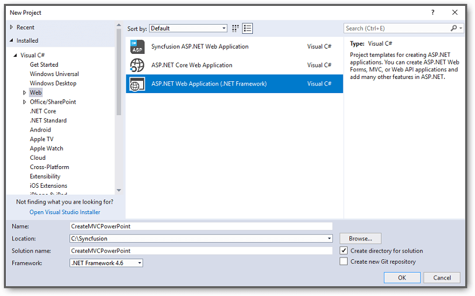
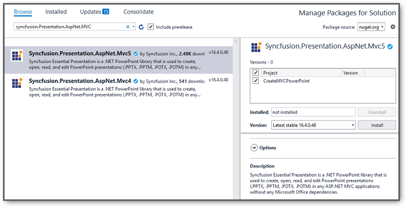
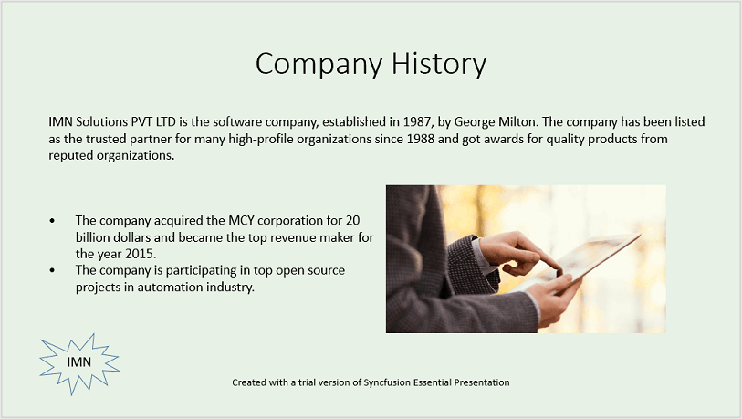

# Create, read and edit a PowerPoint file in ASP.NET MVC

You can create or edit a PowerPoint file in ASP.NET MVC with Syncfusion PowerPoint library. The below are the steps.

## Create a PowerPoint file in ASP.NET MVC

Step 1: Create a new C# ASP.NET MVC application project.

Step 2: Select the **MVC** template to create the project.

Step 3: Install the [Syncfusion.Presentation.AspNet.Mvc5](https://www.nuget.org/packages/Syncfusion.Presentation.AspNet.Mvc5/) NuGet package as reference to your .NET Standard applications from [NuGet.org](https://www.nuget.org/).

Step 4: After installing the **Syncfusion.Presentation.AspNet.Mvc5** nuget package, the following assemblies were included in our project.
<ul>
<li>Syncfusion.Compression.Base</li>
<li>Syncfusion.Licensing</li>
<li>Syncfusion.OfficeChart.Base</li>
<li>Syncfusion.Presentation.Base</li>
</ul>

Step 5: The below code snippets demonstrate how to create a PowerPoint Presentation in ASP.NET MVC platform.

**Create Presentation instance:**





//Create a new instance of PowerPoint Presentation file
IPresentation pptxDoc = Presentation.Create();





**Add a new slide**




//Add a new slide to file and apply background color
ISlide slide = pptxDoc.Slides.Add(SlideLayoutType.TitleOnly);




**Apply Background**




//Specify the fill type and fill color for the slide background 
slide.Background.Fill.FillType = FillType.Solid;
slide.Background.Fill.SolidFill.Color = ColorObject.FromArgb(232, 241, 229);




**Add title content:**




//Add title content to the slide by accessing the title placeholder of the TitleOnly layout-slide
IShape titleShape = slide.Shapes[0] as IShape;
titleShape.TextBody.AddParagraph("Company History").HorizontalAlignment = HorizontalAlignmentType.Center;




**Add description content:**




//Add description content to the slide by adding a new TextBox
IShape descriptionShape = slide.AddTextBox(53.22, 141.73, 874.19, 77.70);
descriptionShape.TextBody.Text = "IMN Solutions PVT LTD is the software company, established in 1987, by George Milton. The company has been listed as the trusted partner for many high-profile organizations since 1988 and got awards for quality products from reputed organizations.";




**Add bullet points:**




//Add bullet points to the slide
IShape bulletPointsShape = slide.AddTextBox(53.22, 270, 437.90, 116.32);
//Add a paragraph for a bullet point
IParagraph firstPara = bulletPointsShape.TextBody.AddParagraph("The company acquired the MCY corporation for 20 billion dollars and became the top revenue maker for the year 2015.");
//Format how the bullets should be displayed
firstPara.ListFormat.Type = ListType.Bulleted;
firstPara.LeftIndent = 35;
firstPara.FirstLineIndent = -35;
// Add another paragraph for the next bullet point
IParagraph secondPara = bulletPointsShape.TextBody.AddParagraph("The company is participating in top open source projects in automation industry.");
//Format how the bullets should be displayed
secondPara.ListFormat.Type = ListType.Bulleted;
secondPara.LeftIndent = 35;
secondPara.FirstLineIndent = -35;




**Add an image:**




//Gets a picture as stream.
FileStream pictureStream = new FileStream("Image.jpg", FileMode.Open);
//Adds the picture to a slide by specifying its size and position.
slide.Shapes.AddPicture(pictureStream, 499.79, 238.59, 364.54, 192.16);




You can download the image used in the sample from [here](http://www.syncfusion.com/downloads/support/directtrac/general/ze/Image-1995521764.zip).

**Add a shape:**




//Add an auto-shape to the slide
IShape stampShape = slide.Shapes.AddShape(AutoShapeType.Explosion1, 48.93, 430.71, 104.13, 80.54);
//Format the auto-shape color by setting the fill type and text
stampShape.Fill.FillType = FillType.None;
stampShape.TextBody.AddParagraph("IMN").HorizontalAlignment = HorizontalAlignmentType.Center;




**Save and close the presentation:**




//Save the PowerPoint Presentation
pptxDoc.Save("Sample.pptx", FormatType.Pptx, HttpContext.ApplicationInstance.Response);
//Close the PowerPoint presentation
pptxDoc.Close();




You can download a complete working sample from [GitHub](https://github.com/SyncfusionExamples/PowerPoint-Examples/tree/master/Getting-started/ASP.NET-MVC/Create-PowerPoint-presentation).

The output of the above code example will generate the below PowerPoint slide.

N> Starting with v16.2.0.x, if you reference Syncfusion assemblies from trial setup or from the NuGet feed, you also have to add "Syncfusion.Licensing" assembly reference and include a license key in your projects. Please refer to this [link](https://help.syncfusion.com/common/essential-studio/licensing/overview) to know about registering Syncfusion license key in your applications to use our components.

## Read and edit a PowerPoint file in ASP.NET MVC

You can edit an existing PowerPoint file using this library. The below code snippet demonstrates accessing a shape from a slide and changing the text within it.




//Open an existing PowerPoint presentation
IPresentation pptxDoc = Presentation.Open("Sample.pptx");
//Gets the first slide from the PowerPoint presentation
ISlide slide = pptxDoc.Slides[0];
//Gets the first shape of the slide
IShape shape = slide.Shapes[0] as IShape;
//Change the text of the shape
if(shape.TextBody.Text == "Company History")
    shape.TextBody.Text = "Company Profile";
//Save the PowerPoint presentation
pptxDoc.Save("Output.pptx", FormatType.Pptx, HttpContext.ApplicationInstance.Response);
//Close the PowerPoint presentation
pptxDoc.Close();




You can download a complete working sample from [GitHub](https://github.com/SyncfusionExamples/PowerPoint-Examples/tree/master/Getting-started/ASP.NET-MVC/Read-and-edit-PowerPoint-presentation).