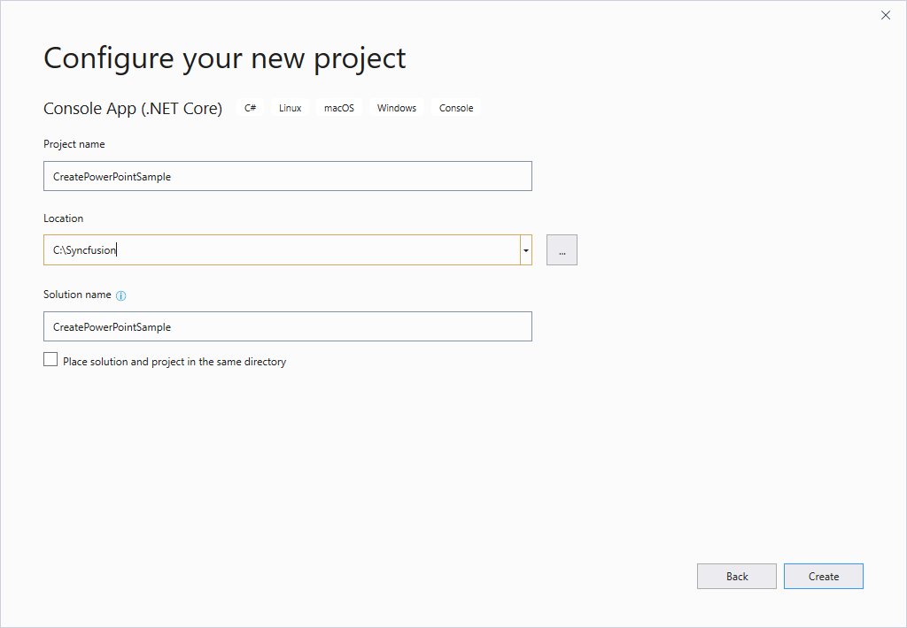
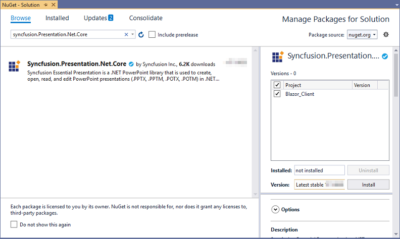
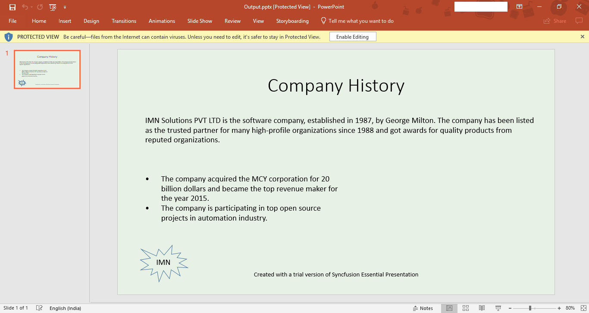

# Create PowerPoint document in Blazor

Syncfusion Essential PowerPoint is a [.NET Core PowerPoint library](https://www.syncfusion.com/powerpoint-framework/net-core) used to create, read, and edit PowerPoint documents programmatically without Microsoft PowerPoint or interop dependencies. Using this library, you can create a PowerPoint document in Blazor.

**Prerequisites**

* Visual Studio 2019 Preview
* Install [.NET Core SDK 3.0 Preview](https://dotnet.microsoft.com/download/dotnet-core/3.0)

**Creating a Blazor project**
<ol><li>Enable Visual Studio to use preview SDKs:</li>
<ul>
<li>Open Tools > Options in the menu bar.</li>
<li>Open the Projects and Solutions node. Open the .NET Core tab.</li>
<li>Check the box for Use previews of the .NET Core SDK and click OK.</li>
</ul>
<li>Restart the Visual Studio 2019.</li>
</ol>

## Client-side application

* Create a new project.

* Select ASP.NET Core Web Application. Select Next.

* Select **.NET Core**, **ASP.NET Core 3.0** and **Blazor (client-side)**.

**Creating a PowerPoint document in Client side application**

* To create a PowerPoint document, install [Syncfusion.Presentation.Net.Core](https://www.nuget.org/packages/Syncfusion.Presentation.Net.Core) to the Blazor project.

* Add the following namespace in the Index.razor to create a PowerPoint document from the scratch.





@using Syncfusion.Presentation;
@using Syncfusion.OfficeChart;
@using System.IO;





* Add a button and hook the click event function.





<button class="btn btn-primary" onclick="@CreatePowerPoint">Create PowerPoint</button>





* Add the following code to create a PowerPoint document in Blazor.





@functions {

	void CreatePowerPoint()
	{
		//Create a new instance of PowerPoint Presentation file           
		IPresentation pptxDoc = Presentation.Create();
		
		//Add a new slide to file and apply background color 
		ISlide slide = pptxDoc.Slides.Add(SlideLayoutType.TitleOnly);
		
		//Specify the fill type and fill color for the slide background         
		slide.Background.Fill.FillType = FillType.Solid;    
		slide.Background.Fill.SolidFill.Color = ColorObject.FromArgb(232, 241, 229);
		
		//Add title content to the slide by accessing the title placeholder of the TitleOnly layout-slide 
		IShape titleShape = slide.Shapes[0] as IShape;     
		titleShape.TextBody.AddParagraph("Company History").HorizontalAlignment =  HorizontalAlignmentType.Center;
		
		//Add description content to the slide by adding a new TextBox IShape  
		descriptionShape = slide.AddTextBox(53.22, 141.73, 874.19, 77.70);      
		descriptionShape.TextBody.Text = "IMN Solutions PVT LTD is the software company, established in 1987, by George Milton. The company has been listed as the trusted  partner for many high-profile organizations since 1988 and got awards for quality products from reputed organizations.";
								
		//Add bullet points to the slide 
		IShape bulletPointsShape = slide.AddTextBox(53.22, 270, 437.90, 116.32); 
		
		//Add a paragraph for a bullet point 
		IParagraph firstPara = bulletPointsShape.TextBody.AddParagraph("The company acquired the MCY corporation for 20 billion dollars and became the top revenue maker for the year 2015."); 
		
		//Format how the bullets should be displayed 
		firstPara.ListFormat.Type = ListType.Bulleted;
		firstPara.LeftIndent = 35;   
		firstPara.FirstLineIndent = -35; 
		
		// Add another paragraph for the next bullet point 
		IParagraph secondPara = bulletPointsShape.TextBody.AddParagraph("The company is  participating in top open source projects in automation industry."); 
		
		//Format how the bullets should be displayed 
		secondPara.ListFormat.Type = ListType.Bulleted; 
		secondPara.LeftIndent = 35;  
		secondPara.FirstLineIndent = -35;
		
		//Add an auto-shape to the slide 
		IShape stampShape = slide.Shapes.AddShape(AutoShapeType.Explosion1, 48.93, 430.71, 104.13, 80.54); 
		
		//Format the auto-shape color by setting the fill type and text   
		stampShape.Fill.FillType = FillType.None;  
		stampShape.TextBody.AddParagraph("IMN").HorizontalAlignment =   HorizontalAlignmentType.Center;
		
		// Save the PowerPoint Presentation as stream
		MemoryStream stream = new MemoryStream();
		document.Save(stream, FormatType.pptx);
		
		//Close the PowerPoint Presentation as stream
		pptxDoc.Close();
		stream.Position = 0;
		
		//Download the PowerPoint document in the browser.
		JS.SaveAs("Sample.pptx", stream.ToArray());
	}
}





**To download the PowerPoint document in browser**

Create a class file with FileUtil name and add the following code to invoke the JavaScript action to download the file in the browser.

* Add the following code in the created class file.





public static class FileUtil
{
    public static Task SaveAs(this IJSRuntime js, string filename, byte[] data)
       => js.InvokeAsync<object>(
           "saveAsFile",
           filename,
           Convert.ToBase64String(data));
}





* Add the following JavaScript function in the Index.html.





	





By executing the program, you will get the PowerPoint document as follows.

N> Even though PowerPoint library works in client-side, it is recommended to use server-side deployment. Since the client-side deployment increases the application payload size.

## Server-side application

* Create a new project.

* Select ASP.NET Core Web Application. Select Next.

* Select **.NET Core, ASP.NET Core 3.0** and **Blazor (server-side)**.

**Creating a PowerPoint document in Server-side application**

* To create a PowerPoint document, install [Syncfusion.Presentation.Net.Core](https://www.nuget.org/packages/Syncfusion.Presentation.Net.Core) to the Blazor project.

* Add the following namespace in the Index.razor to create a PowerPoint document from the scratch.





@using Syncfusion.Presentation;
@using Syncfusion.OfficeChart;
@using System.IO;





* Add a button and hook the click event function.





<button class="btn btn-primary" onclick="@CreatePowerPoint">Create PowerPoint</button>





* Add the following code to create a PowerPoint document in Blazor.





@@functions {

	void CreatePowerPoint()
	{
		//Create a new instance of PowerPoint Presentation file           
		IPresentation pptxDoc = Presentation.Create();
		
		//Add a new slide to file and apply background color 
		ISlide slide = pptxDoc.Slides.Add(SlideLayoutType.TitleOnly);
		
		//Specify the fill type and fill color for the slide background         
		slide.Background.Fill.FillType = FillType.Solid;    
		slide.Background.Fill.SolidFill.Color = ColorObject.FromArgb(232, 241, 229);
		
		//Add title content to the slide by accessing the title placeholder of the  TitleOnly layout-slide 
		IShape titleShape = slide.Shapes[0] as IShape;     
		titleShape.TextBody.AddParagraph("Company History").HorizontalAlignment =  HorizontalAlignmentType.Center;
		
		//Add description content to the slide by adding a new TextBox IShape  
		descriptionShape = slide.AddTextBox(53.22, 141.73, 874.19, 77.70);      
		descriptionShape.TextBody.Text = "IMN Solutions PVT LTD is the software company, established in 1987, by George Milton. The company has been listed as the trusted  partner for many high-profile organizations since 1988 and got awards for quality products from reputed organizations.";
								
		//Add bullet points to the slide 
		IShape bulletPointsShape = slide.AddTextBox(53.22, 270, 437.90, 116.32); 
		
		//Add a paragraph for a bullet point 
		IParagraph firstPara = bulletPointsShape.TextBody.AddParagraph("The company acquired the MCY corporation for 20 billion dollars and became the top revenue maker for the year 2015."); 
		
		//Format how the bullets should be displayed 
		firstPara.ListFormat.Type = ListType.Bulleted;
		firstPara.LeftIndent = 35;   
		firstPara.FirstLineIndent = -35; 
		
		// Add another paragraph for the next bullet point 
		IParagraph secondPara = bulletPointsShape.TextBody.AddParagraph("The company is participating in top open source projects in automation industry."); 
		
		//Format how the bullets should be displayed 
		secondPara.ListFormat.Type = ListType.Bulleted; 
		secondPara.LeftIndent = 35;  
		secondPara.FirstLineIndent = -35;
		
		//Add an auto-shape to the slide 
		IShape stampShape = slide.Shapes.AddShape(AutoShapeType.Explosion1, 48.93, 430.71, 104.13, 80.54); 
		
		//Format the auto-shape color by setting the fill type and text   
		stampShape.Fill.FillType = FillType.None;  
		stampShape.TextBody.AddParagraph("IMN").HorizontalAlignment =  HorizontalAlignmentType.Center;
		
		// Save the PowerPoint Presentation as stream
		MemoryStream stream = new MemoryStream();
		document.Save(stream, FormatType.pptx);
		
		//Close the PowerPoint Presentation as stream
		pptxDoc.Close();
		stream.Position = 0;
		
		//Download the PowerPoint document in the browser.
		JS.SaveAs("Sample.pptx", stream.ToArray());
	}
}





**To download the PowerPoint document in browser**

Create a class file with FileUtil name and add the following code to invoke the JavaScript action to download the file in the browser.

* Add the following code in the created class file.





public static class FileUtil
{
    public static Task SaveAs(this IJSRuntime js, string filename, byte[] data)
       => js.InvokeAsync<object>(
           "saveAsFile",
           filename,
           Convert.ToBase64String(data));
}





* Add the following JavaScript function in the _Host.cshtml in the Pages folder.









By executing the program, you will get the PowerPoint document as follows.

