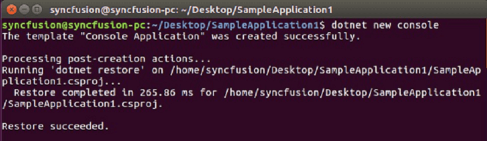
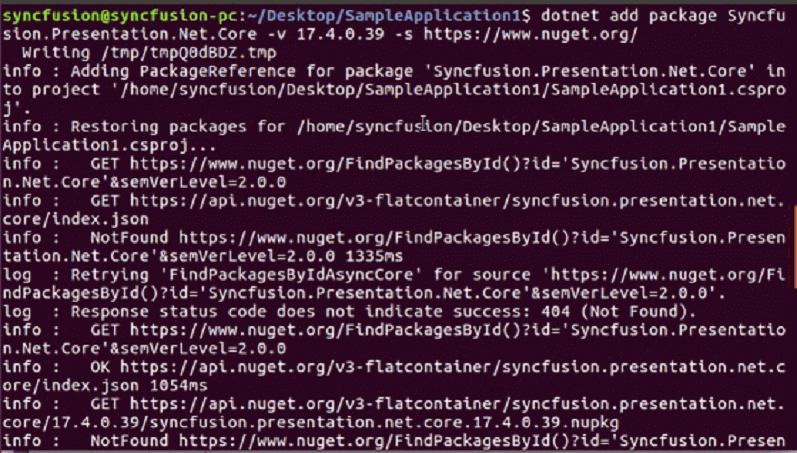

# Create, read and edit a PowerPoint file on Linux system

You can create or edit a PowerPoint file in .NET Core on Linux system using Syncfusion PowerPoint library. The below are the steps.

## Create a PowerPoint file in .NET Core Console application project on Linux OS

1.Execute the following command in Linux terminal to create a new .NET Core Console application.

<table>
<tr>
<td>

dotnet new console

</td>
</tr>
</table>

2.Install the [Syncfusion.Presentation.Net.Core](https://www.nuget.org/packages/Syncfusion.Presentation.Net.Core) NuGet package as a reference to your project from [NuGet.org](https://www.nuget.org/) by execute the following command.

<table>
<tr>
<td>

dotnet add package Syncfusion.Presentation.Net.Core -v 17.4.0.46 -s https://www.nuget.org/

</td>
</tr>
</table>

3.Add the following Namespaces in Program file.





using Syncfusion.Presentation;
using System.IO;





4.Add the following code snippet in Program.cs file.





//Create a new instance of PowerPoint Presentation file
IPresentation pptxDoc = Presentation.Create();

//Add a new slide to file and apply background color
ISlide slide = pptxDoc.Slides.Add(SlideLayoutType.TitleOnly);

//Specify the fill type and fill color for the slide background 
slide.Background.Fill.FillType = FillType.Solid;
slide.Background.Fill.SolidFill.Color = ColorObject.FromArgb(232, 241, 229);

//Add title content to the slide by accessing the title placeholder of the TitleOnly layout-slide
IShape titleShape = slide.Shapes[0] as IShape;
titleShape.TextBody.AddParagraph("Company History").HorizontalAlignment = HorizontalAlignmentType.Center;

//Add description content to the slide by adding a new TextBox
IShape descriptionShape = slide.AddTextBox(53.22, 141.73, 874.19, 77.70);
descriptionShape.TextBody.Text = "IMN Solutions PVT LTD is the software company, established in 1987, by George Milton. The company has been listed as the trusted partner for many high-profile organizations since 1988 and got awards for quality products from reputed organizations.";

//Add bullet points to the slide
IShape bulletPointsShape = slide.AddTextBox(53.22, 270, 437.90, 116.32);

//Add a paragraph for a bullet point
IParagraph firstPara = bulletPointsShape.TextBody.AddParagraph("The company acquired the MCY corporation for 20 billion dollars and became the top revenue maker for the year 2015.");

//Format how the bullets should be displayed
firstPara.ListFormat.Type = ListType.Bulleted;
firstPara.LeftIndent = 35;
firstPara.FirstLineIndent = -35;

// Add another paragraph for the next bullet point
IParagraph secondPara = bulletPointsShape.TextBody.AddParagraph("The company is participating in top open source projects in automation industry.");

//Format how the bullets should be displayed
secondPara.ListFormat.Type = ListType.Bulleted;
secondPara.LeftIndent = 35;
secondPara.FirstLineIndent = -35;

//Gets a picture as stream.
FileStream pictureStream = new FileStream("Image.jpg", FileMode.Open);

//Adds the picture to a slide by specifying its size and position.
slide.Shapes.AddPicture(pictureStream, 499.79, 238.59, 364.54, 192.16);

//Add an auto-shape to the slide
IShape stampShape = slide.Shapes.AddShape(AutoShapeType.Explosion1, 48.93, 430.71, 104.13, 80.54);

//Format the auto-shape color by setting the fill type and text
stampShape.Fill.FillType = FillType.None;
stampShape.TextBody.AddParagraph("IMN").HorizontalAlignment = HorizontalAlignmentType.Center;

//Save the PowerPoint Presentation as stream
FileStream outputStream = new FileStream("Sample.pptx", FileMode.Create);
pptxDoc.Save(outputStream);

//Release all resources from stream
outputStream.Dispose();

//Close the PowerPoint presentation
pptxDoc.Close();





5.Execute the following command to restore the NuGet packages.

<table>
<tr>
<td>

dotnet restore

</td>
</tr>
</table>

6.Execute the following command in terminal to run the application.

<table>
<tr>
<td>

dotnet run

</td>
</tr>
</table>

The output of the above code example will generate the below PowerPoint slide. The output will be saved in parallel to program.cs file.

N> Starting with v16.2.0.x, if you reference Syncfusion assemblies from trial setup or from the NuGet feed, you also have to add "Syncfusion.Licensing" assembly reference and include a license key in your projects. Please refer to this [link](https://help.syncfusion.com/common/essential-studio/licensing/license-key) to know about registering Syncfusion license key in your applications to use our components.

## Read and edit a PowerPoint file in .NET Core Console application project on Linux OS

You can edit an existing PowerPoint file on Linux system using this library. The below code snippet demonstrates accessing a shape from a slide and changing the text within it.





//Open an existing PowerPoint presentation
IPresentation pptxDoc = Presentation.Open(new FileStream("Sample.pptx",FileMode.Open));

//Gets the first slide from the PowerPoint presentation
ISlide slide = pptxDoc.Slides[0];

//Gets the first shape of the slide
IShape shape = slide.Shapes[0] as IShape;

//Change the text of the shape
if(shape.TextBody.Text == "Company History")
    shape.TextBody.Text = "Company Profile";

//Save the PowerPoint presentation as stream
FileStream outputStream = new FileStream("Output.pptx", FileMode.Create);
pptxDoc.Save(outputStream);
outputStream.Position = 0;
outputStream.Flush();
outputStream.Dispose();

//Close the PowerPoint presentation
pptxDoc.Close();



