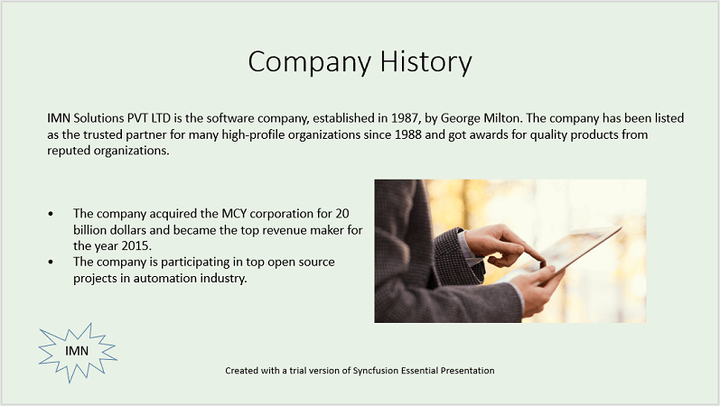

# Create, read and edit a PowerPoint file in .NET MAUI

Syncfusion Essential PowerPoint is a .NET MAUI PowerPoint library used to create, read, and edit PowerPoint documents programmatically without Microsoft PowerPoint or interop dependencies. Using this library, you can create a PowerPoint document in .NET MAUI.

**Prerequisites:**
To create .NET Multi-platform App UI (.NET MAUI) apps, you need the latest versions of Visual Studio 2022 and .NET 6. For more details, refer [here](https://docs.microsoft.com/en-us/dotnet/maui/get-started/installation).

## Steps to create PowerPoint file in .NET MAUI

1.Create a new C# .NET MAUI app. Select **.NET MAUI App (Preview)** from the template and click the **Next** button.

2.Enter the project name and click **Create**.

3.Install the Syncfusion.Presentation.NET NuGet package as a reference to your project from [NuGet.org](https://www.nuget.org/).

N> Starting with v16.2.0.x, if you reference Syncfusion assemblies from trial setup or from the NuGet feed, you also have to add "Syncfusion.Licensing" assembly reference and include a license key in your projects. Please refer to this [link](https://help.syncfusion.com/common/essential-studio/licensing/license-key) to know about registering a Syncfusion license key in your application to use our components.

4.Add a new button to the **MainPage.xaml** as shown below.





<ContentPage xmlns="http://schemas.microsoft.com/dotnet/2021/maui"
             xmlns:x="http://schemas.microsoft.com/winfx/2009/xaml"
             x:Class="CreatePowerPoint.MainPage"
             BackgroundColor="{DynamicResource SecondaryColor}">
    <ScrollView>
        <Grid RowSpacing="25" RowDefinitions="Auto,Auto,Auto,Auto,*"
              Padding="{OnPlatform iOS='30,60,30,30', Default='30'}">
            <Button 
                Text="Create Presentation"
                FontAttributes="Bold"
                Grid.Row="0"
                SemanticProperties.Hint="Creates Presentation you click"
                Clicked="OnButtonClicked"
                HorizontalOptions="Center" />
        </Grid>
    </ScrollView>
</ContentPage>





5.Include the following namespaces in the **MainPage.xaml.cs** file.





using Syncfusion.Presentation;
using System.IO;
using System.Reflection;





6.Add a new action method **CreatePresentation** in MainPage.xaml.cs and include the below code snippet to **create a PowerPoint file**.





//Creates a new instance of the PowerPoint Presentation file.
using IPresentation pptxDoc = Presentation.Create();
//Adds a new slide to the file and apply background color.
ISlide slide = pptxDoc.Slides.Add(SlideLayoutType.TitleOnly);
//Specifies the fill type and fill color for the slide background.
slide.Background.Fill.FillType = FillType.Solid;
slide.Background.Fill.SolidFill.Color = ColorObject.FromArgb(232, 241, 229);

//Adds title content to the slide by accessing the title placeholder of the TitleOnly layout-slide.
IShape titleShape = slide.Shapes[0] as IShape;
titleShape.TextBody.AddParagraph("Company History").HorizontalAlignment = HorizontalAlignmentType.Center;

//Adds description content to the slide by adding a new TextBox.
IShape descriptionShape = slide.AddTextBox(53.22, 141.73, 874.19, 77.70);
descriptionShape.TextBody.Text = "IMN Solutions PVT LTD is the software company, established in 1987, by George Milton. The company has been listed as the trusted partner for many high-profile organizations since 1988 and got awards for quality products from reputed organizations.";

//Adds bullet points to the slide.
IShape bulletPointsShape = slide.AddTextBox(53.22, 270, 437.90, 116.32);
//Adds a paragraph for a bullet point.
IParagraph firstPara = bulletPointsShape.TextBody.AddParagraph("The company acquired the MCY corporation for 20 billion dollars and became the top revenue maker for the year 2015.");
//Formats how the bullets should be displayed.
firstPara.ListFormat.Type = ListType.Bulleted;
firstPara.LeftIndent = 35;
firstPara.FirstLineIndent = -35;
//Adds another paragraph for the next bullet point.
IParagraph secondPara = bulletPointsShape.TextBody.AddParagraph("The company is participating in top open source projects in automation industry.");
//Formats how the bullets should be displayed.
secondPara.ListFormat.Type = ListType.Bulleted;
secondPara.LeftIndent = 35;
secondPara.FirstLineIndent = -35;

Assembly assembly = typeof(MainPage).GetTypeInfo().Assembly;
string resourcePath = "CreatePowerPoint.Resources.Presentation.Image.png";
//Gets a picture as stream.
Stream pictureStream = assembly.GetManifestResourceStream(resourcePath);
//Adds the picture to a slide by specifying its size and position.
slide.Shapes.AddPicture(pictureStream, 499.79, 238.59, 364.54, 192.16);

//Adds an auto-shape to the slide.
IShape stampShape = slide.Shapes.AddShape(AutoShapeType.Explosion1, 48.93, 430.71, 104.13, 80.54);
//Formats the auto-shape color by setting the fill type and text.
stampShape.Fill.FillType = FillType.None;
stampShape.TextBody.AddParagraph("IMN").HorizontalAlignment = HorizontalAlignmentType.Center;

//Saves the presentation to the memory stream.
using (MemoryStream stream = new();
pptxDoc.Save(stream);
stream.Position = 0;
//Saves the memory stream as file.
DependencyService.Get<ISave>().SaveAndView("Sample.pptx", "application/vnd.openxmlformats-officedocument.presentationml.presentation", stream);





A complete working example of creating a Presentation file in the .NET MAUI app can be downloaded from this [link](https://www.syncfusion.com/downloads/support/directtrac/general/ze/CreateWordSample1545592917.zip).

By executing the program, you will get the **PowerPoint slide** as follows.

## Read and edit a PowerPoint file in .NET MAUI

You can edit an existing PowerPoint file using this library. The below code snippet demonstrates accessing a shape from a slide and changing the text within it.




//Opens an existing PowerPoint presentation.
Assembly assembly = typeof(MainPage).GetTypeInfo().Assembly;
//Opens an existing PowerPoint presentation.
using IPresentation pptxDoc = Presentation.Open(assembly.GetManifestResourceStream("Sample.pptx"));

//Gets the first slide from the PowerPoint presentation.
ISlide slide = pptxDoc.Slides[0];

//Gets the first shape of the slide.
IShape shape = slide.Shapes[0] as IShape;

//Modifies the text of the shape.
if (shape.TextBody.Text == "Company History")
    shape.TextBody.Text = "Company Profile";
//Saves the presentation to the memory stream.
using (MemoryStream stream = new();
pptxDoc.Save(stream);
stream.Position = 0;
//Saves the memory stream as file.
DependencyService.Get<ISave>().SaveAndView("Output.pptx", "application/vnd.openxmlformats-officedocument.presentationml.presentation", stream);




N> Essential Presentation is only supported in .NET MAUI application targeting Windows, Android and iOS.

## Helper files for .NET MAUI

Download the helper files from this [link](https://www.syncfusion.com/downloads/support/directtrac/general/ze/HelperFiles_Presentation573247547.zip) and add them into the mentioned project. These helper files allow you to save the stream as a physical file and open the file for viewing.

<table>
  <tr>
  <td>
    <b>Folder Name</b>
  </td>
  <td>
    <b>File Name</b>
  </td>
  <td>
    <b>Summary</b>
  </td>
  </tr>
  <tr>
  <td>
    .NET MAUI Project
  </td>
  <td>
    ISave.cs
  </td>
  <td>Represent the base interface for save operation.
  </td>
  </tr>
  <tr>
  <td>
    Windows
  </td>
  <td>
    SaveWindows.cs
  </td>
  <td>Save implementation for Windows.
  </td>
  </tr>
  <tr>
  <td>
    Android
  </td>
  <td>
    SaveAndroid.cs
  </td>
  <td>Save implementation for Android device.
  </td>
  </tr>
  <tr>
  <td rowspan="2">
    iOS
  </td>
  <td>
    SaveIOS.cs
  </td>
  <td>
    Save implementation for iOS device.
  </td>
  </tr>
  <tr>
  <td>
    PreviewControllerDS.cs QLPreviewItemFileSystem.cs
  </td>
  <td>
    Helper classes for viewing the <b>Word document</b> in iOS device.
  </td>
  </tr>
</table>
