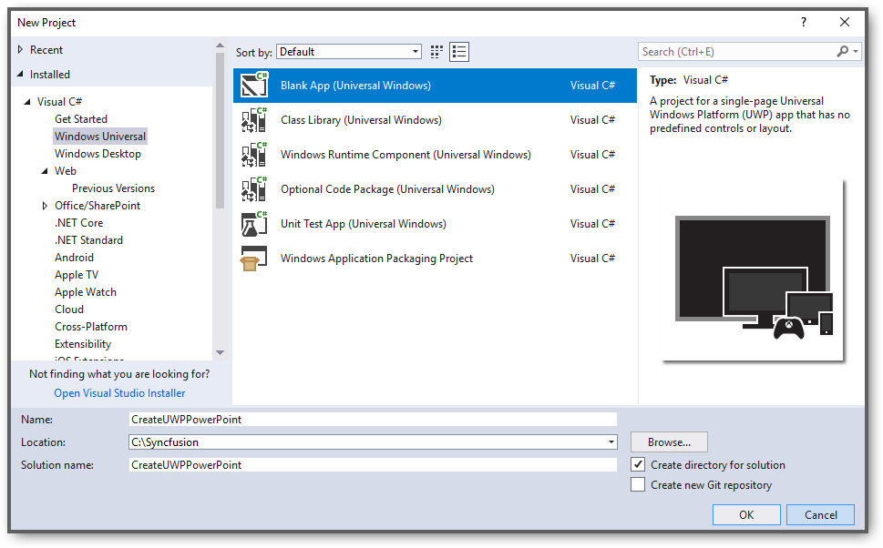
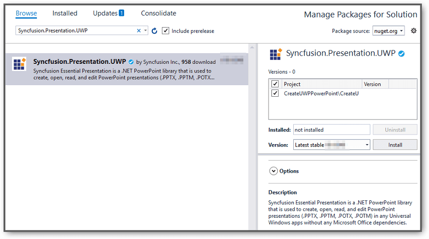
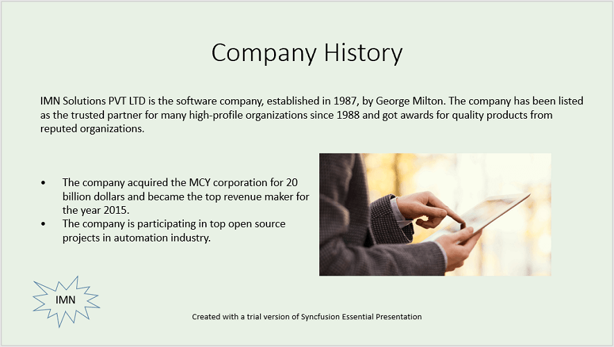

# Create, read and edit a PowerPoint file in UWP

You can create or edit a PowerPoint file with the Syncfusion [UWP PowerPoint library](https://www.syncfusion.com/powerpoint-framework/uwp/powerpoint-library). The below are the steps.

## Create a PowerPoint file in UWP

1.Create a new C# UWP application project.

2.Install the [Syncfusion.Presentation.UWP](https://www.nuget.org/packages/Syncfusion.Presentation.UWP/) NuGet package as reference to your .NET Standard applications from [NuGet.org](https://www.nuget.org/).

3.Add a new button in the MainPage.xaml as shown below.





<Page
    x:Class="CreateUWPPowerPoint.MainPage"
    xmlns="http://schemas.microsoft.com/winfx/2006/xaml/presentation"
    xmlns:x="http://schemas.microsoft.com/winfx/2006/xaml"
    xmlns:local="using:CreateUWPPowerPoint"
    xmlns:d="http://schemas.microsoft.com/expression/blend/2008"
    xmlns:mc="http://schemas.openxmlformats.org/markup-compatibility/2006"
    mc:Ignorable="d"
    Background="{ThemeResource ApplicationPageBackgroundThemeBrush}">

    <Grid>
        <Button x:Name="button" Content="Create Document" Click="OnButtonClicked" HorizontalAlignment="Center" VerticalAlignment="Center"/>
    </Grid>
</Page>





4.Include the following namespaces in the MainPage.xaml.cs file.





using Syncfusion.Presentation;
using Windows.Storage.Pickers;
using Windows.Storage;





5.Include the below code snippet in the click event of the button in MainPage.xaml.cs, to create a **PowerPoint** file and save the **PowerPoint** document as a physical file.

**Create Presentation instance:**





//Create a new instance of PowerPoint Presentation file
IPresentation pptxDoc = Presentation.Create();





**Add a new slide**





//Add a new slide to file and apply background color
ISlide slide = pptxDoc.Slides.Add(SlideLayoutType.TitleOnly);





**Apply Background**





//Specify the fill type and fill color for the slide background 
slide.Background.Fill.FillType = FillType.Solid;
slide.Background.Fill.SolidFill.Color = ColorObject.FromArgb(232, 241, 229);





**Add title content:**





//Add title content to the slide by accessing the title placeholder of the TitleOnly layout-slide
IShape titleShape = slide.Shapes[0] as IShape;
titleShape.TextBody.AddParagraph("Company History").HorizontalAlignment = HorizontalAlignmentType.Center;





**Add description content:**





//Add description content to the slide by adding a new TextBox
IShape descriptionShape = slide.AddTextBox(53.22, 141.73, 874.19, 77.70);
descriptionShape.TextBody.Text = "IMN Solutions PVT LTD is the software company, established in 1987, by George Milton. The company has been listed as the trusted partner for many high-profile organizations since 1988 and got awards for quality products from reputed organizations.";





**Add bullet points:**





//Add bullet points to the slide
IShape bulletPointsShape = slide.AddTextBox(53.22, 270, 437.90, 116.32);

//Add a paragraph for a bullet point
IParagraph firstPara = bulletPointsShape.TextBody.AddParagraph("The company acquired the MCY corporation for 20 billion dollars and became the top revenue maker for the year 2015.");

//Format how the bullets should be displayed
firstPara.ListFormat.Type = ListType.Bulleted;
firstPara.LeftIndent = 35;
firstPara.FirstLineIndent = -35;

// Add another paragraph for the next bullet point
IParagraph secondPara = bulletPointsShape.TextBody.AddParagraph("The company is participating in top open source projects in automation industry.");

//Format how the bullets should be displayed
secondPara.ListFormat.Type = ListType.Bulleted;
secondPara.LeftIndent = 35;
secondPara.FirstLineIndent = -35;





**Add an image:**





//Gets a picture as stream.
Assembly assembly = typeof(App).GetTypeInfo().Assembly;
Stream pictureStream = assembly.GetManifestResourceStream("CreateUWPPowerPoint.Assets.Image.jpg"); 

//Adds the picture to a slide by specifying its size and position.
slide.Shapes.AddPicture(pictureStream, 499.79, 238.59, 364.54, 192.16);





You can download the image used in the sample from [here](http://www.syncfusion.com/downloads/support/directtrac/general/ze/Image-1995521764.zip).

**Add a shape:**





//Add an auto-shape to the slide
IShape stampShape = slide.Shapes.AddShape(AutoShapeType.Explosion1, 48.93, 430.71, 104.13, 80.54);

//Format the auto-shape color by setting the fill type and text
stampShape.Fill.FillType = FillType.None;
stampShape.TextBody.AddParagraph("IMN").HorizontalAlignment = HorizontalAlignmentType.Center;





**Save and close the presentation:**





//Initializes FileSavePicker
FileSavePicker savePicker = new FileSavePicker();
savePicker.SuggestedStartLocation = PickerLocationId.Desktop;
savePicker.SuggestedFileName = "Sample";
savePicker.FileTypeChoices.Add("PowerPoint Files", new List<string>() { ".pptx" });

//Creates a storage file from FileSavePicker
StorageFile storageFile = await savePicker.PickSaveFileAsync();

//Saves changes to the specified storage file
await pptxDoc.SaveAsync(storageFile);

//Close the PowerPoint presentation
pptxDoc.Close();





The output of the above code example will generate the below PowerPoint slide.

N> Starting with v16.2.0.x, if you reference Syncfusion assemblies from trial setup or from the NuGet feed, you also have to add "Syncfusion.Licensing" assembly reference and include a license key in your projects. Please refer to this [link](https://help.syncfusion.com/common/essential-studio/licensing/license-key) to know about registering Syncfusion license key in your applications to use our components.

## Read and edit a PowerPoint file in UWP

You can edit an existing PowerPoint file using this library. The below code snippet demonstrates accessing a shape from a slide and changing the text within it.





//"App" is the class of Portable project.
Assembly assembly = typeof(App).GetTypeInfo().Assembly;

//Open an existing PowerPoint presentation
IPresentation pptxDoc = Presentation.Open(assembly.GetManifestResourceStream("CreateUWPPowerPoint.Assets.Sample_UWP.pptx"));

//Gets the first slide from the PowerPoint presentation
ISlide slide = pptxDoc.Slides[0];

//Gets the first shape of the slide
IShape shape = slide.Shapes[0] as IShape;

//Change the text of the shape
if(shape.TextBody.Text == "Company History")
    shape.TextBody.Text = "Company Profile";

//Initializes FileSavePicker
FileSavePicker savePicker = new FileSavePicker();
savePicker.SuggestedStartLocation = PickerLocationId.Desktop;
savePicker.SuggestedFileName = "Output";
savePicker.FileTypeChoices.Add("PowerPoint Files", new List<string>() { ".pptx" });

//Creates a storage file from FileSavePicker
StorageFile storageFile = await savePicker.PickSaveFileAsync();

//Saves changes to the specified storage file
await pptxDoc.SaveAsync(storageFile);

//Close the PowerPoint presentation
pptxDoc.Close();



