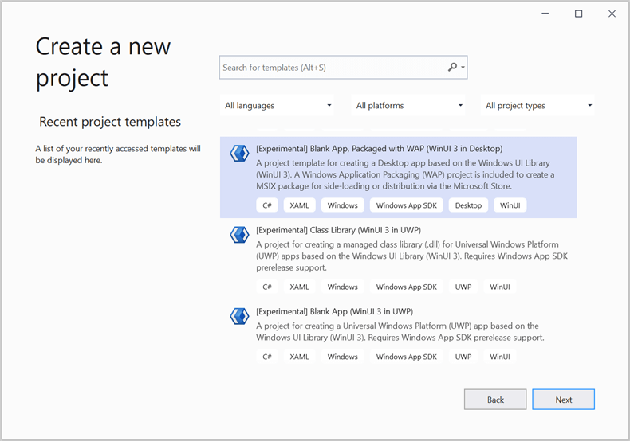
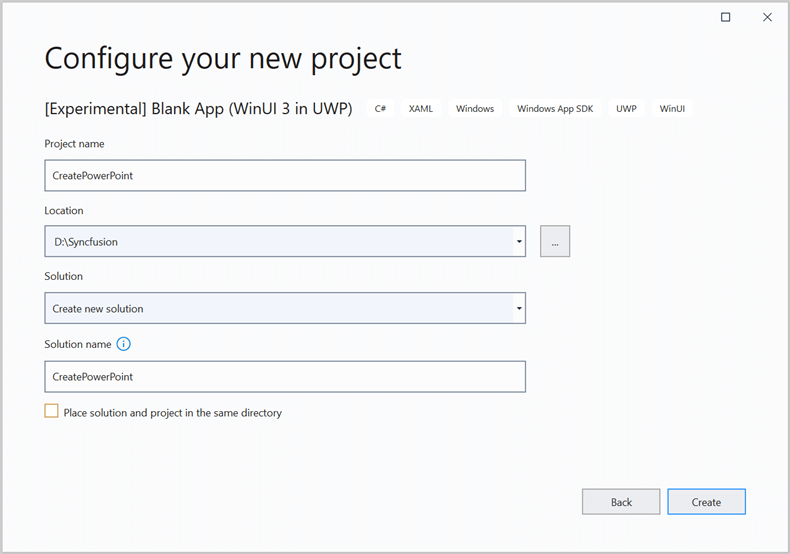
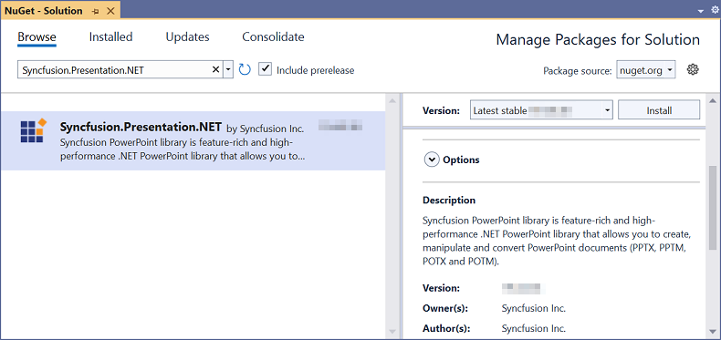
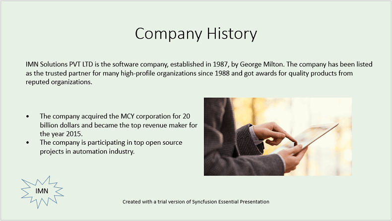
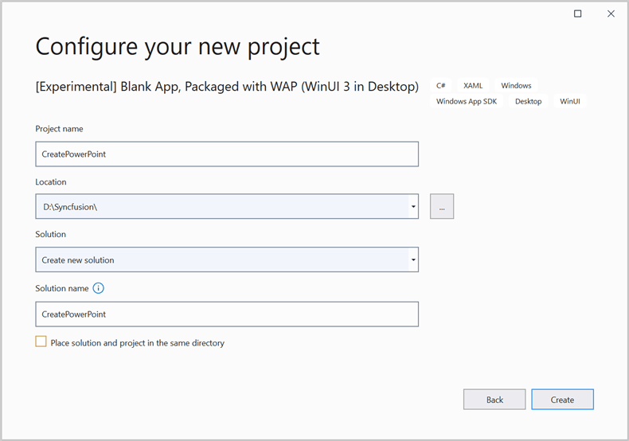

# Create, read and edit a PowerPoint file in WinUI

Syncfusion Essential Presentation is a [WinUI PowerPoint library](https://www.syncfusion.com/powerpoint-framework/winui/powerpoint-library) used to create, read, and edit **PowerPoint** documents programmatically without **Microsoft PowerPoint** or interop dependencies. Using this library, you can **create a PowerPoint document in WinUI**.

**Prerequisites:**
To use the WinUI 3 project templates, install the Windows App SDK extension for Visual Studio. For more details, refer [here](https://docs.microsoft.com/en-us/windows/apps/windows-app-sdk/set-up-your-development-environment).

## WinUI Desktop app

### Create a PowerPoint file in WinUI

Step 1: Create a new C# WinUI Desktop app. Select Blank App, Packaged with WAP (WinUI 3 in Desktop) from the template and click the **Next** button.

Step 2: Enter the project name and click **Create**.

Step 3: Set the Target version to Windows 10, version 2004 (build 19041) and the Minimum version to Windows 10, version 1809 (build 17763) and then click **OK**.

Step 4: Install the Syncfusion.Presentation.NET NuGet package as a reference to your .NET Standard applications from the [NuGet.org](https://www.nuget.org/).

N> Starting with v16.2.0.x, if you reference Syncfusion assemblies from trial setup or from the NuGet feed, you also have to add "Syncfusion.Licensing" assembly reference and include a license key in your projects. Please refer to this [link](https://help.syncfusion.com/common/essential-studio/licensing/license-key) to know about registering a Syncfusion license key in your application to use our components.

Step 5: Add a new button to the **MainWindow.xaml** as shown below.





<Window
    x:Class="CreatePowerPoint.MainWindow"
    xmlns="http://schemas.microsoft.com/winfx/2006/xaml/presentation"
    xmlns:x="http://schemas.microsoft.com/winfx/2006/xaml"
    xmlns:local="using:CreatePowerPoint"
    xmlns:d="http://schemas.microsoft.com/expression/blend/2008"
    xmlns:mc="http://schemas.openxmlformats.org/markup-compatibility/2006"
    mc:Ignorable="d">

    <StackPanel Orientation="Horizontal" HorizontalAlignment="Center" VerticalAlignment="Center">
        <Button x:Name="button" Click="CreatePresentation">Create Presentation</Button>
    </StackPanel>
</Window>





Step 6. Include the following namespaces in the **MainWindow.xaml.cs** file.




using Syncfusion.Presentation;
using System.IO;




Step 7: Add a new action method **CreatePresentation** in MainPage.xaml.cs and include the below code snippet to **create a PowerPoint file**.




//Create a new instance of the PowerPoint Presentation file.
using (IPresentation pptxDoc = Presentation.Create());
//Add a new slide to the file and apply background color.
ISlide slide = pptxDoc.Slides.Add(SlideLayoutType.TitleOnly);
//Specify the fill type and fill color for the slide background.
slide.Background.Fill.FillType = FillType.Solid;
slide.Background.Fill.SolidFill.Color = ColorObject.FromArgb(232, 241, 229);
//Add title content to the slide by accessing the title placeholder of the TitleOnly layout-slide.
IShape titleShape = slide.Shapes[0] as IShape;
titleShape.TextBody.AddParagraph("Company History").HorizontalAlignment = HorizontalAlignmentType.Center;
//Add description content to the slide by adding a new TextBox.
IShape descriptionShape = slide.AddTextBox(53.22, 141.73, 874.19, 77.70);
descriptionShape.TextBody.Text = "IMN Solutions PVT LTD is the software company, established in 1987, by George Milton. The company has been listed as the trusted partner for many high-profile organizations since 1988 and got awards for quality products from reputed organizations.";
//Add bullet points to the slide.
IShape bulletPointsShape = slide.AddTextBox(53.22, 270, 437.90, 116.32);
//Add a paragraph for a bullet point.
IParagraph firstPara = bulletPointsShape.TextBody.AddParagraph("The company acquired the MCY corporation for 20 billion dollars and became the top revenue maker for the year 2015.");
//Format how the bullets should be displayed.
firstPara.ListFormat.Type = ListType.Bulleted;
firstPara.LeftIndent = 35;
firstPara.FirstLineIndent = -35;
//Add another paragraph for the next bullet point.
IParagraph secondPara = bulletPointsShape.TextBody.AddParagraph("The company is participating in top open source projects in automation industry.");
//Format how the bullets should be displayed.
secondPara.ListFormat.Type = ListType.Bulleted;
secondPara.LeftIndent = 35;
secondPara.FirstLineIndent = -35;
//Get a picture as stream.
FileStream pictureStream = new FileStream("Image.png", FileMode.Open);
//Add the picture to a slide by specifying its size and position.
slide.Shapes.AddPicture(pictureStream, 499.79, 238.59, 364.54, 192.16);
//Add an auto-shape to the slide.
IShape stampShape = slide.Shapes.AddShape(AutoShapeType.Explosion1, 48.93, 430.71, 104.13, 80.54);
//Format the auto-shape color by setting the fill type and text.
stampShape.Fill.FillType = FillType.None;
stampShape.TextBody.AddParagraph("IMN").HorizontalAlignment = HorizontalAlignmentType.Center;
//Save the PowerPoint Presentation as a stream.
using (FileStream outputStream = new FileStream("Sample.pptx", FileMode.Create));
pptxDoc.Save(outputStream);




A complete working example of creating a Presentation file in the WinUI Desktop app can be downloaded from this [link](https://www.syncfusion.com/downloads/support/directtrac/general/ze/CreatePowerPoint724079917.zip).

By executing the program, you will get the **PowerPoint slide** as follows.

### Read and edit a PowerPoint file in WinUI

You can edit an existing PowerPoint file using this library. The below code snippet demonstrates accessing a shape from a slide and changing the text within it.




//Opens an existing PowerPoint presentation.
using (IPresentation pptxDoc = Presentation.Open(new FileStream("Sample.pptx", FileMode.Open)));
//Get the first slide from the PowerPoint presentation.
ISlide slide = pptxDoc.Slides[0];
//Get the first shape of the slide.
IShape shape = slide.Shapes[0] as IShape;
//Modify the text of the shape.
if (shape.TextBody.Text == "Company History")
    shape.TextBody.Text = "Company Profile";
//Save the PowerPoint Presentation as a stream.
using (FileStream outputStream = new FileStream("Output.pptx", FileMode.Create));
pptxDoc.Save(outputStream);




## WinUI UWP app

### Create a PowerPoint file in WinUI

Step 1: Create a new C# WinUI UWP app. Select Blank App (WinUI 3 in UWP)from the template and **click** the Next button.

N> To get the UWP Experimental project templates and build UWP apps with WinUI 3, you should download the [Windows App SDK Experimental Extension](https://aka.ms/projectreunion/previewdownload) for Visual Studio.

Step 2: Enter the project name and click **Create**.

Step 3: Set the Target version to Windows 10, version 2004 (build 19041) and the Minimum version to Windows 10, version 1809 (build 17763) and then click **OK**.

Step 4: Install the Syncfusion.Presentation.NET NuGet package as a reference to your .NET Standard applications from the [NuGet.org](https://www.nuget.org/).

N> Starting with v16.2.0.x, if you reference Syncfusion assemblies from trial setup or from the NuGet feed, you also have to add "Syncfusion.Licensing" assembly reference and include a license key in your projects. Please refer to this [link](https://help.syncfusion.com/common/essential-studio/licensing/license-key) to know about registering a Syncfusion license key in your application to use our components.

Step 5: Add a new button to the **MainPage.xaml** as shown below.





<Page
    x:Class="CreatePowerPoint.MainPage"
    xmlns="http://schemas.microsoft.com/winfx/2006/xaml/presentation"
    xmlns:x="http://schemas.microsoft.com/winfx/2006/xaml"
    xmlns:local="using:CreatePowerPoint"
    xmlns:d="http://schemas.microsoft.com/expression/blend/2008"
    xmlns:mc="http://schemas.openxmlformats.org/markup-compatibility/2006"
    mc:Ignorable="d"
    Background="{ThemeResource ApplicationPageBackgroundThemeBrush}">

    <StackPanel Orientation="Horizontal" HorizontalAlignment="Center" VerticalAlignment="Center">
        <Button x:Name="button" Click="CreatePresentaion">Create Presentaion</Button>
    </StackPanel>
</Page>





Step 6: Include the following namespaces in the **MainPage.xaml.cs** file.




using Syncfusion.Presentation;
using Windows.Storage;
using Windows.Storage.Streams;
using Windows.Storage.Pickers;
using System.Reflection;




Step 7: Add a new action method **CreatePresentation** in MainPage.xaml.cs and include the below code snippet to **create a PowerPoint file**.




//Create a new instance of the PowerPoint Presentation file.
using (IPresentation pptxDoc = Presentation.Create())
{
    //Add a new slide to file and apply background color.
    ISlide slide = pptxDoc.Slides.Add(SlideLayoutType.TitleOnly);
    //Specify the fill type and fill color for the slide background.
    slide.Background.Fill.FillType = FillType.Solid;
    slide.Background.Fill.SolidFill.Color = ColorObject.FromArgb(232, 241, 229);
    //Add title content to the slide by accessing the title placeholder of the TitleOnly layout-slide.
    IShape titleShape = slide.Shapes[0] as IShape;
    titleShape.TextBody.AddParagraph("Company History").HorizontalAlignment = HorizontalAlignmentType.Center;
    //Add description content to the slide by adding a new TextBox.
    IShape descriptionShape = slide.AddTextBox(53.22, 141.73, 874.19, 77.70);
    descriptionShape.TextBody.Text = "IMN Solutions PVT LTD is the software company, established in 1987, by George Milton. The company has been listed as the trusted partner for many high-profile organizations since 1988 and got awards for quality products from reputed organizations.";
    //Add bullet points to the slide.
    IShape bulletPointsShape = slide.AddTextBox(53.22, 270, 437.90, 116.32);
    //Add a paragraph for a bullet point.
    IParagraph firstPara = bulletPointsShape.TextBody.AddParagraph("The company acquired the MCY corporation for 20 billion dollars and became the top revenue maker for the year 2015.");
    //Format how the bullets should be displayed.
    firstPara.ListFormat.Type = ListType.Bulleted;
    firstPara.LeftIndent = 35;
    firstPara.FirstLineIndent = -35;
    //Add another paragraph for the next bullet point.
    IParagraph secondPara = bulletPointsShape.TextBody.AddParagraph("The company is participating in top open source projects in automation industry.");
    //Format how the bullets should be displayed.
    secondPara.ListFormat.Type = ListType.Bulleted;
    secondPara.LeftIndent = 35;
    secondPara.FirstLineIndent = -35;
    //Get a picture as stream.
    Assembly assembly = typeof(App).GetTypeInfo().Assembly;
    Stream pictureStream = assembly.GetManifestResourceStream("CreatePowerPoint.Assets.Image.jpg");
    //Add the picture to a slide by specifying its size and position.
    slide.Shapes.AddPicture(pictureStream, 499.79, 238.59, 364.54, 192.16);
    //Add an auto-shape to the slide.
    IShape stampShape = slide.Shapes.AddShape(AutoShapeType.Explosion1, 48.93, 430.71, 104.13, 80.54);
    //Format the auto-shape color by setting the fill type and text.
    stampShape.Fill.FillType = FillType.None;
    stampShape.TextBody.AddParagraph("IMN").HorizontalAlignment = HorizontalAlignmentType.Center;
    //Save the Presentation file to MemoryStream.
    using (MemoryStream stream = new MemoryStream())
    {
        pptxDoc.Save(stream);
        //Save the stream as a Presentation file in the local machine.
        Save(stream);
    }
}




A complete working example of creating a Presentation file in the WinUI UWP app can be downloaded from this [link](https://www.syncfusion.com/downloads/support/directtrac/general/ze/CreatePowerPoint_UWP-1654817345.zip).

By executing the program, you will get the **PowerPoint slide** as follows.

### Read and edit a PowerPoint file in WinUI

You can edit an existing PowerPoint file using this library. The below code snippet demonstrates accessing a shape from a slide and changing the text within it.




//"App" is the class of Portable project.
Assembly assembly = typeof(App).GetTypeInfo().Assembly;
//Open an existing PowerPoint presentation.
using (IPresentation pptxDoc = Presentation.Open(assembly.GetManifestResourceStream("CreatePowerPoint.Assets.Sample.pptx")))
{
    //Get the first slide from the PowerPoint presentation.
    ISlide slide = pptxDoc.Slides[0];
    //Gets the first shape of the slide.
    IShape shape = slide.Shapes[0] as IShape;
    //Modify the text of the shape.
    if (shape.TextBody.Text == "Company History")
        shape.TextBody.Text = "Company Profile";
    //Save the Presentation files to MemoryStream.
    using (MemoryStream stream = new MemoryStream())
    {
        pptxDoc.Save(stream);
        //Save the stream as a Presentation file in the local machine.
        Save(stream);
    }
}




### Save Presentation file in UWP




async void Save(MemoryStream stream)
{
    StorageFile stFile;
    if (!(Windows.Foundation.Metadata.ApiInformation.IsTypePresent("Windows.Phone.UI.Input.HardwareButtons")))
    {
        FileSavePicker savePicker = new FileSavePicker();
        savePicker.DefaultFileExtension = ".pptx";
        savePicker.SuggestedFileName = "Sample";
        savePicker.FileTypeChoices.Add("PowerPoint Files", new List<string>() { ".pptx" });
        stFile = await savePicker.PickSaveFileAsync();
    }
    else
    {
        StorageFolder local = Windows.Storage.ApplicationData.Current.LocalFolder;
        stFile = await local.CreateFileAsync("Sample", CreationCollisionOption.ReplaceExisting);
    }
    if (stFile != null)
    {
        using (IRandomAccessStream zipStream = await stFile.OpenAsync(FileAccessMode.ReadWrite))
        {
            //Write compressed data from memory to file.
            using (Stream outstream = zipStream.AsStreamForWrite())
            {
                byte[] buffer = stream.ToArray();
                outstream.Write(buffer, 0, buffer.Length);
                outstream.Flush();
            }
        }
    }
    //Launch the saved PowerPoint file.
    await Windows.System.Launcher.LaunchFileAsync(stFile);
}


