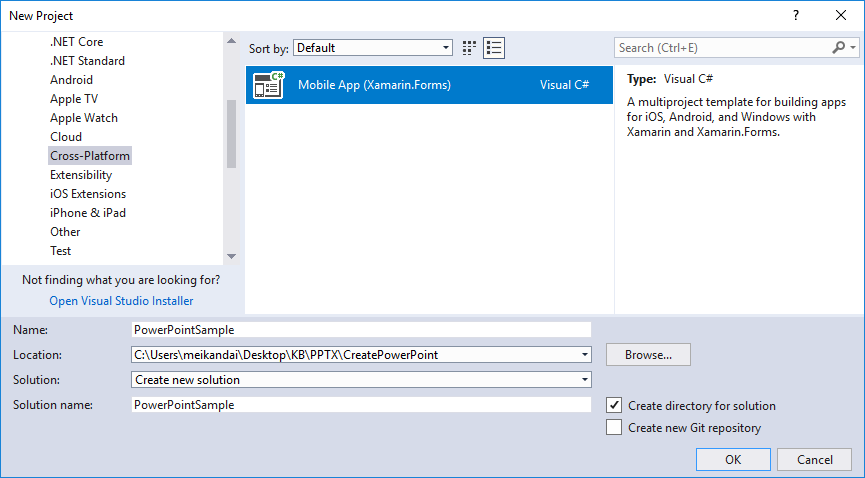
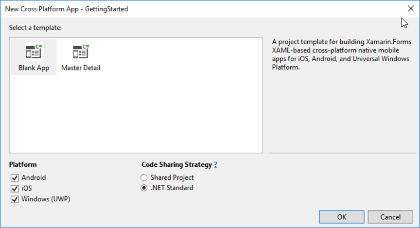
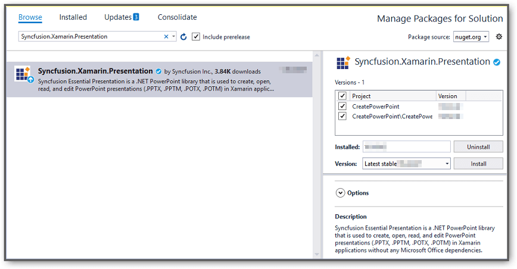
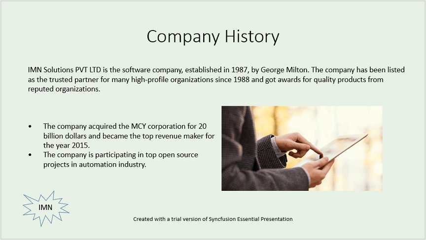

# Create, read and edit a PowerPoint file in Xamarin

You can create or edit a PowerPoint file with the Syncfusion [Xamarin PowerPoint library](https://www.syncfusion.com/powerpoint-framework/xamarin/powerpoint-library). The below are the steps.

## Create a PowerPoint file in Xamarin

1.Create a new C# **Xamarin.Forms** application project.

2.Select a project template and required platforms to deploy the application. In this application the portable assemblies to be shared across multiple platforms, the .NET Standard code sharing strategy has been selected. For more details about code sharing refer [here](https://docs.microsoft.com/en-us/xamarin/cross-platform/app-fundamentals/code-sharing).

3.Install [Syncfusion.Xamarin.Presentation](https://www.nuget.org/packages/Syncfusion.Xamarin.Presentation/) NuGet package as a reference to the .NET Standard project in your Xamarin applications from [NuGet.org](https://www.nuget.org/).

4.Add new Forms XAML page in portable project If there is no XAML page is defined in the App class. Otherwise proceed to the next step.
<ul>
<li>To add the new XAML page, right click on the project and select <b>Add > New Item</b> and add a Forms XAML Page from the list. Name it as MainXamlPage.</li>
<li>In App class of <b>portable project</b> (App.cs), replace the existing constructor of App class with the code snippet given below which invokes the <b>MainXamlPage</b>.</li>
</ul>
	 



public App()
{
    // The root page of your application
    MainPage = new MainXamlPage();
  
}




5.In the MainXamlPage.xaml add new button as shown below.




<ContentPage xmlns="http://xamarin.com/schemas/2014/forms"
 xmlns:x="http://schemas.microsoft.com/winfx/2009/xaml"
 x:Class="GettingStarted. MainXamlPage">
<StackLayout VerticalOptions="Center">
  
<Button Text="Generate Document" Clicked="OnButtonClicked" HorizontalOptions="Center"/>
  
</StackLayout> 
</ContentPage>




6.Include the following namespace in the MainXamlPage.xaml.cs file.




using Syncfusion.Presentation;




7.Include the below code snippet in the click event of the button in MainXamlPage.xaml.cs, to create a PowerPoint file and save it in a stream.

**Create Presentation instance:**




//Create a new PowerPoint presentation
IPresentation powerpointDoc = Presentation.Create();




**Add a new slide**





//Add a new slide to file and apply background color
ISlide slide = powerpointDoc.Slides.Add(SlideLayoutType.TitleOnly);





**Apply Background**





//Specify the fill type and fill color for the slide background 
slide.Background.Fill.FillType = FillType.Solid;
slide.Background.Fill.SolidFill.Color = ColorObject.FromArgb(232, 241, 229);





**Add title content:**





//Add title content to the slide by accessing the title placeholder of the TitleOnly layout-slide
IShape titleShape = slide.Shapes[0] as IShape;
titleShape.TextBody.AddParagraph("Company History").HorizontalAlignment = HorizontalAlignmentType.Center;





**Add description content:**





//Add description content to the slide by adding a new TextBox
IShape descriptionShape = slide.AddTextBox(53.22, 141.73, 874.19, 77.70);
descriptionShape.TextBody.Text = "IMN Solutions PVT LTD is the software company, established in 1987, by George Milton. The company has been listed as the trusted partner for many high-profile organizations since 1988 and got awards for quality products from reputed organizations.";





**Add bullet points:**





//Add bullet points to the slide
IShape bulletPointsShape = slide.AddTextBox(53.22, 270, 437.90, 116.32);

//Add a paragraph for a bullet point
IParagraph firstPara = bulletPointsShape.TextBody.AddParagraph("The company acquired the MCY corporation for 20 billion dollars and became the top revenue maker for the year 2015.");

//Format how the bullets should be displayed
firstPara.ListFormat.Type = ListType.Bulleted;
firstPara.LeftIndent = 35;
firstPara.FirstLineIndent = -35;

// Add another paragraph for the next bullet point
IParagraph secondPara = bulletPointsShape.TextBody.AddParagraph("The company is participating in top open source projects in automation industry.");

//Format how the bullets should be displayed
secondPara.ListFormat.Type = ListType.Bulleted;
secondPara.LeftIndent = 35;
secondPara.FirstLineIndent = -35;





**Add an image:**





//"App" is the class of Portable project.
Assembly assembly = typeof(App).GetTypeInfo().Assembly;

//Gets a picture as stream.
Stream fileStream = assembly.GetManifestResourceStream("Image.jpg");

//Adds the picture to a slide by specifying its size and position.
slide.Shapes.AddPicture(fileStream, 499.79, 238.59, 364.54, 192.16);





You can download the image used in the sample from [here](http://www.syncfusion.com/downloads/support/directtrac/general/ze/Image-1995521764.zip).

**Add a shape:**





//Add an auto-shape to the slide
IShape stampShape = slide.Shapes.AddShape(AutoShapeType.Explosion1, 48.93, 430.71, 104.13, 80.54);

//Format the auto-shape color by setting the fill type and text
stampShape.Fill.FillType = FillType.None;
stampShape.TextBody.AddParagraph("IMN").HorizontalAlignment = HorizontalAlignmentType.Center;





**Save and close the presentation:**





//Save the PowerPoint to stream in pptx format. 
MemoryStream stream = new MemoryStream();
powerpointDoc.Save(stream);

//Close the PowerPoint presentation
powerpointDoc.Close();

//Save the stream as a file in the device and invoke it for viewing
Xamarin.Forms.DependencyService.Get<ISave>().SaveAndView("GettingStared.pptx", "application/vnd.openxmlformats-officedocument.presentationml.presentation", stream);





8.Download the helper files from this [link](http://www.syncfusion.com/downloads/support/directtrac/general/HELPER~1-696201504.ZIP) and add them into the mentioned project. These helper files allow you to save the stream as a physical file and open the file for viewing.

<table>
  <tr>
  <td>
    <b>Project</b>
  </td>
  <td>
    <b>File Name</b>
  </td>
  <td>
    <b>Summary</b>
  </td>
  </tr>
  <tr>
  <td>
    Portable project
  </td>
  <td>
    ISave.cs
  </td>
  <td>Represent the base interface for save operation
  </td>
  </tr>
  <tr>
  <td rowspan="2">
    iOS Project
  </td>
  <td>
    SaveIOS.cs
  </td>
  <td>
    Save implementation for iOS device
  </td>
  </tr>
  <tr>
  <td>
    PreviewControllerDS.cs
  </td>
  <td>
    Helper class for viewing the PowerPoint file in iOS device
  </td>
  </tr>
  <tr>
  <td>
    Android project
  </td>
  <td>
    SaveAndroid.cs
  </td>
  <td>Save implementation for Android device
  </td>
  </tr>
  <tr>
  <td>
    UWP project
  </td>
  <td>
    SaveWindows.cs
  </td>
  <td>Save implementation for UWP device.
  </td>
  </tr>
</table>

9.Compile and execute the application. 

The output of the above code example will generate the below PowerPoint slide.

N> Starting with v16.2.0.x, if you reference Syncfusion assemblies from trial setup or from the NuGet feed, you also have to add "Syncfusion.Licensing" assembly reference and include a license key in your projects. Please refer to this [link](https://help.syncfusion.com/common/essential-studio/licensing/license-key) to know about registering Syncfusion license key in your applications to use our components.

## Read and edit a PowerPoint file in Xamarin

You can edit an existing PowerPoint file using this library. The below code snippet demonstrates accessing a shape from a slide and changing the text within it.





//"App" is the class of Portable project.
Assembly assembly = typeof(App).GetTypeInfo().Assembly;

//Open an existing PowerPoint presentation
IPresentation pptxDoc = Presentation.Open(assembly.GetManifestResourceStream("CreatePowerPoint.Templates.Sample.pptx"));

//Gets the first slide from the PowerPoint presentation
ISlide slide = pptxDoc.Slides[0];

//Gets the first shape of the slide
IShape shape = slide.Shapes[0] as IShape;

//Change the text of the shape
if(shape.TextBody.Text == "Company History")
    shape.TextBody.Text = "Company Profile";

//Create new memory stream to save Presentation.
MemoryStream stream = new MemoryStream();

//Save Presentation in stream format.
pptxDoc.Save(stream);

//Close the presentation
pptxDoc.Close();
stream.Position = 0;

//Save the stream as a file in the device and invoke it for viewing
Xamarin.Forms.DependencyService.Get<ISave>().SaveAndView("Output.pptx", "application/vnd.openxmlformats-officedocument.presentationml.presentation", stream);



