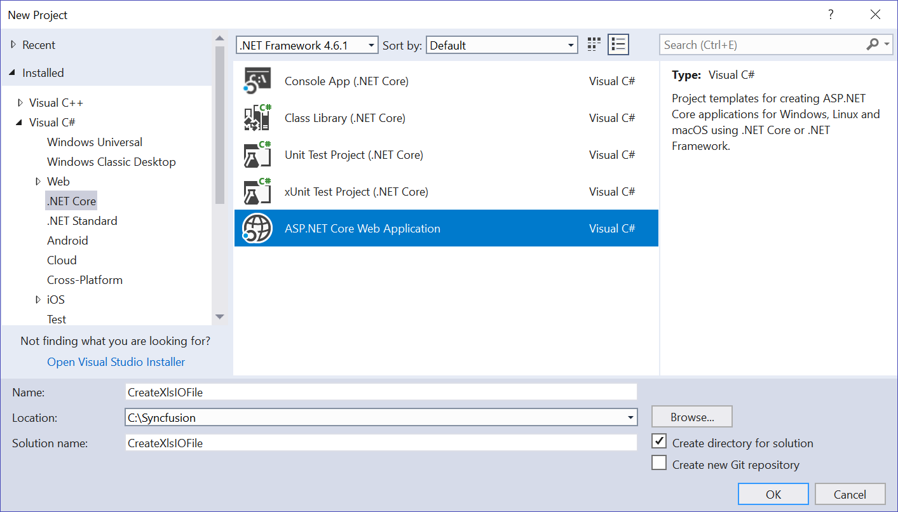
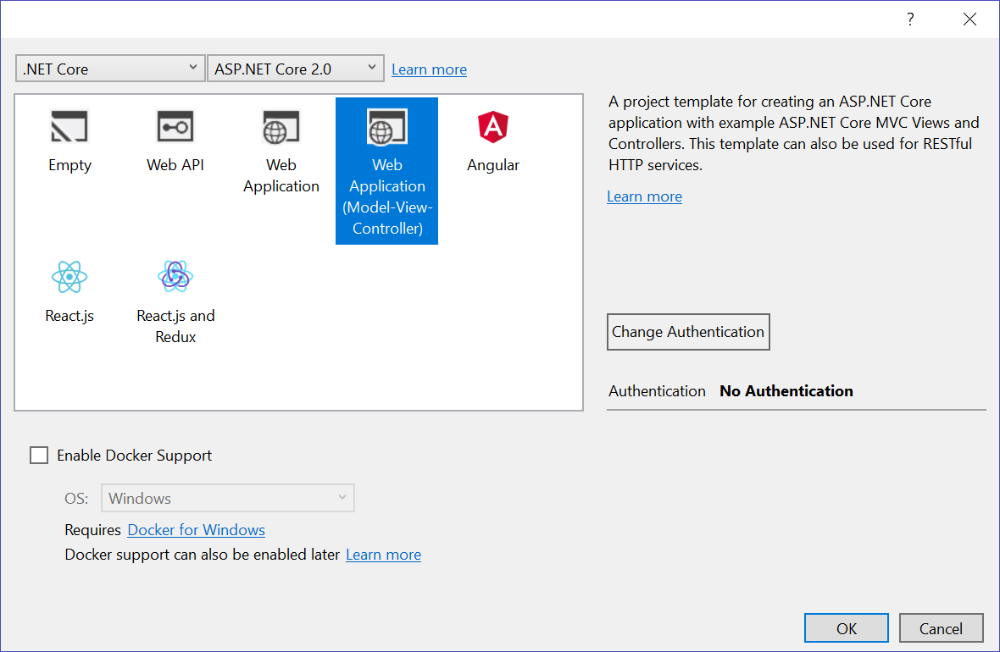
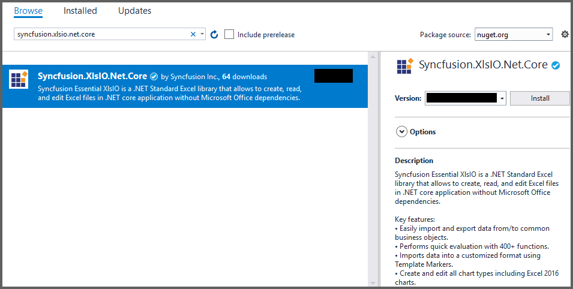
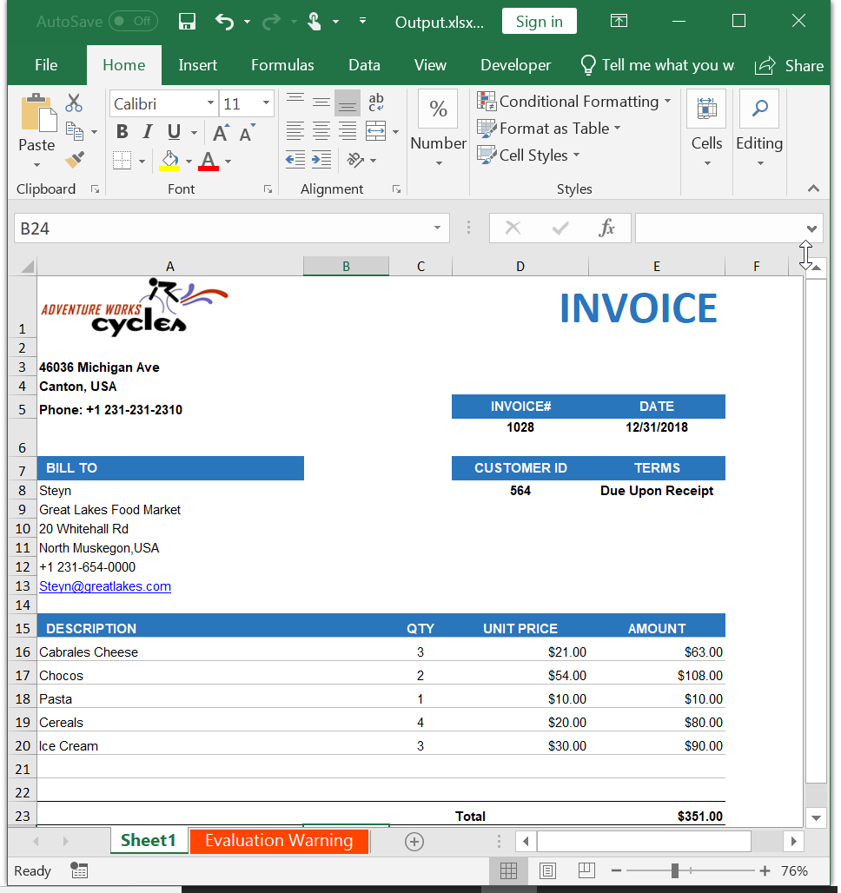

# ASP.NET Core

To use XlsIO in your ASP.NET Core application, please add the required assemblies in the application by referring to [Getting Started](https://help.syncfusion.com/aspnet-core/xlsio/getting-started) section.

##Getting Started

The below code snippet illustrates creating an simple Invoice formatted Excel document in ASP.NET Core.

*	Create a new C# ASP.NET Core Web Application project.

*	Select Web Application pattern (Model-View-Controller) for the project.

*	Install the [Syncfusion.XlsIO.Net.Core](https://www.nuget.org/packages/Syncfusion.XlsIO.Net.Core) NuGet package as reference to your .NET Standard applications from [NuGet.org](https://www.nuget.org).

*	A default controller with named HomeController.cs gets added on creation of ASP.NET MVC project. Include the following namespaces in the HomeController.cs file.

  

using Syncfusion.XlsIO;
using System.IO;
using Syncfusion.Drawing;



Imports Syncfusion.XlsIO
Imports System.IO
Imports Syncfusion.Drawing

  

*	A default action method named Index will be present in HomeController.cs. Right click on Index method and select Go To View where you will be directed to its associated view page Index.cshtml.

*	Add a new button in the Index.cshtml as shown below.

  

@{Html.BeginForm("CreateDocument", "Home", FormMethod.Get);
{

    <input type="submit" value="Create Document" style="width:150px;height:27px" />

}
Html.EndForm();
}

  

*	Add a new action method CreateDocument in HomeController.cs and include the below code snippet to create an Excel file and download it.

  

//Create an instance of ExcelEngine
using (ExcelEngine excelEngine = new ExcelEngine())
{
IApplication application = excelEngine.Excel;

application.DefaultVersion = ExcelVersion.Excel2016;

//Create a workbook
IWorkbook workbook = application.Workbooks.Create(1);
IWorksheet worksheet = workbook.Worksheets[0];

//Adding a picture
FileStream imageStream = new FileStream(@"D:\AdventureCycles-Logo.png", FileMode.Open, FileAccess.Read);
IPictureShape shape = worksheet.Pictures.AddPicture(1, 1, imageStream);

//Disable gridlines in the worksheet
worksheet.IsGridLinesVisible = false;

//Enter values to the cells from A3 to A5
worksheet.Range["A3"].Text = "46036 Michigan Ave";
worksheet.Range["A4"].Text = "Canton, USA";
worksheet.Range["A5"].Text = "Phone: +1 231-231-2310";

//Make the text bold
worksheet.Range["A3:A5"].CellStyle.Font.Bold = true;

//Merge cells
worksheet.Range["D1:E1"].Merge();

//Enter text to the cell D1 and apply formatting.
worksheet.Range["D1"].Text = "INVOICE";
worksheet.Range["D1"].CellStyle.Font.Bold = true;
worksheet.Range["D1"].CellStyle.Font.RGBColor = Color.FromArgb(42, 118, 189);
worksheet.Range["D1"].CellStyle.Font.Size = 35;

//Apply alignment in the cell D1
worksheet.Range["D1"].CellStyle.HorizontalAlignment = ExcelHAlign.HAlignRight;
worksheet.Range["D1"].CellStyle.VerticalAlignment = ExcelVAlign.VAlignTop;

//Enter values to the cells from D5 to E8
worksheet.Range["D5"].Text = "INVOICE#";
worksheet.Range["E5"].Text = "DATE";
worksheet.Range["D6"].Number = 1028;
worksheet.Range["E6"].Value = "12/31/2018";
worksheet.Range["D7"].Text = "CUSTOMER ID";
worksheet.Range["E7"].Text = "TERMS";
worksheet.Range["D8"].Number = 564;
worksheet.Range["E8"].Text = "Due Upon Receipt";

//Apply RGB backcolor to the cells from D5 to E8
worksheet.Range["D5:E5"].CellStyle.Color = Color.FromArgb(42, 118, 189);
worksheet.Range["D7:E7"].CellStyle.Color = Color.FromArgb(42, 118, 189);

//Apply known colors to the text in cells D5 to E8
worksheet.Range["D5:E5"].CellStyle.Font.Color = ExcelKnownColors.White;
worksheet.Range["D7:E7"].CellStyle.Font.Color = ExcelKnownColors.White;

//Make the text as bold from D5 to E8
worksheet.Range["D5:E8"].CellStyle.Font.Bold = true;

//Apply alignment to the cells from D5 to E8
worksheet.Range["D5:E8"].CellStyle.HorizontalAlignment = ExcelHAlign.HAlignCenter;
worksheet.Range["D5:E5"].CellStyle.VerticalAlignment = ExcelVAlign.VAlignCenter;
worksheet.Range["D7:E7"].CellStyle.VerticalAlignment = ExcelVAlign.VAlignCenter;
worksheet.Range["D6:E6"].CellStyle.VerticalAlignment = ExcelVAlign.VAlignTop;

//Enter value and applying formatting in the cell A7
worksheet.Range["A7"].Text = "  BILL TO";
worksheet.Range["A7"].CellStyle.Color = Color.FromArgb(42, 118, 189);
worksheet.Range["A7"].CellStyle.Font.Bold = true;
worksheet.Range["A7"].CellStyle.Font.Color = ExcelKnownColors.White;

//Apply alignment
worksheet.Range["A7"].CellStyle.HorizontalAlignment = ExcelHAlign.HAlignLeft;
worksheet.Range["A7"].CellStyle.VerticalAlignment = ExcelVAlign.VAlignCenter;

//Enter values in the cells A8 to A12
worksheet.Range["A8"].Text = "Steyn";
worksheet.Range["A9"].Text = "Great Lakes Food Market";
worksheet.Range["A10"].Text = "20 Whitehall Rd";
worksheet.Range["A11"].Text = "North Muskegon,USA";
worksheet.Range["A12"].Text = "+1 231-654-0000";

//Create a Hyperlink for e-mail in the cell A13
IHyperLink hyperlink = worksheet.HyperLinks.Add(worksheet.Range["A13"]);
hyperlink.Type = ExcelHyperLinkType.Url;
hyperlink.Address = "Steyn@greatlakes.com";
hyperlink.ScreenTip = "Send Mail";

//Merge column A and B from row 15 to 22
worksheet.Range["A15:B15"].Merge();
worksheet.Range["A16:B16"].Merge();
worksheet.Range["A17:B17"].Merge();
worksheet.Range["A18:B18"].Merge();
worksheet.Range["A19:B19"].Merge();
worksheet.Range["A20:B20"].Merge();
worksheet.Range["A21:B21"].Merge();
worksheet.Range["A22:B22"].Merge();

//Enter details of products and prices
worksheet.Range["A15"].Text = "  DESCRIPTION";
worksheet.Range["C15"].Text = "QTY";
worksheet.Range["D15"].Text = "UNIT PRICE";
worksheet.Range["E15"].Text = "AMOUNT";
worksheet.Range["A16"].Text = "Cabrales Cheese";
worksheet.Range["A17"].Text = "Chocos";
worksheet.Range["A18"].Text = "Pasta";
worksheet.Range["A19"].Text = "Cereals";
worksheet.Range["A20"].Text = "Ice Cream";
worksheet.Range["C16"].Number = 3;
worksheet.Range["C17"].Number = 2;
worksheet.Range["C18"].Number = 1;
worksheet.Range["C19"].Number = 4;
worksheet.Range["C20"].Number = 3;
worksheet.Range["D16"].Number = 21;
worksheet.Range["D17"].Number = 54;
worksheet.Range["D18"].Number = 10;
worksheet.Range["D19"].Number = 20;
worksheet.Range["D20"].Number = 30;
worksheet.Range["D23"].Text = "Total";

//Apply number format
worksheet.Range["D16:E22"].NumberFormat = "$.00";
worksheet.Range["E23"].NumberFormat = "$.00";

//Apply incremental formula for column Amount by multiplying Qty and UnitPrice
application.EnableIncrementalFormula = true;
worksheet.Range["E16:E20"].Formula = "=C16*D16";

//Formula for Sum the total
worksheet.Range["E23"].Formula = "=SUM(E16:E22)";

//Apply borders
worksheet.Range["A16:E22"].CellStyle.Borders[ExcelBordersIndex.EdgeTop].LineStyle = ExcelLineStyle.Thin;
worksheet.Range["A16:E22"].CellStyle.Borders[ExcelBordersIndex.EdgeBottom].LineStyle = ExcelLineStyle.Thin;
worksheet.Range["A16:E22"].CellStyle.Borders[ExcelBordersIndex.EdgeTop].Color = ExcelKnownColors.Grey_25_percent;
worksheet.Range["A16:E22"].CellStyle.Borders[ExcelBordersIndex.EdgeBottom].Color = ExcelKnownColors.Grey_25_percent;
worksheet.Range["A23:E23"].CellStyle.Borders[ExcelBordersIndex.EdgeTop].LineStyle = ExcelLineStyle.Thin;
worksheet.Range["A23:E23"].CellStyle.Borders[ExcelBordersIndex.EdgeBottom].LineStyle = ExcelLineStyle.Thin;
worksheet.Range["A23:E23"].CellStyle.Borders[ExcelBordersIndex.EdgeTop].Color = ExcelKnownColors.Black;
worksheet.Range["A23:E23"].CellStyle.Borders[ExcelBordersIndex.EdgeBottom].Color = ExcelKnownColors.Black;

//Apply font setting for cells with product details
worksheet.Range["A3:E23"].CellStyle.Font.FontName = "Arial";
worksheet.Range["A3:E23"].CellStyle.Font.Size = 10;
worksheet.Range["A15:E15"].CellStyle.Font.Color = ExcelKnownColors.White;
worksheet.Range["A15:E15"].CellStyle.Font.Bold = true;
worksheet.Range["D23:E23"].CellStyle.Font.Bold = true;

//Apply cell color
worksheet.Range["A15:E15"].CellStyle.Color = Color.FromArgb(42, 118, 189);

//Apply alignment to cells with product details
worksheet.Range["A15"].CellStyle.HorizontalAlignment = ExcelHAlign.HAlignLeft;
worksheet.Range["C15:C22"].CellStyle.HorizontalAlignment = ExcelHAlign.HAlignCenter;
worksheet.Range["D15:E15"].CellStyle.HorizontalAlignment = ExcelHAlign.HAlignCenter;

//Apply row height and column width to look good
worksheet.Range["A1"].ColumnWidth = 36;
worksheet.Range["B1"].ColumnWidth = 11;
worksheet.Range["C1"].ColumnWidth = 8;
worksheet.Range["D1:E1"].ColumnWidth = 18;
worksheet.Range["A1"].RowHeight = 47;
worksheet.Range["A2"].RowHeight = 15;
worksheet.Range["A3:A4"].RowHeight = 15;
worksheet.Range["A5"].RowHeight = 18;
worksheet.Range["A6"].RowHeight = 29;
worksheet.Range["A7"].RowHeight = 18;
worksheet.Range["A8"].RowHeight = 15;
worksheet.Range["A9:A14"].RowHeight = 15;
worksheet.Range["A15:A23"].RowHeight = 18;
                
//Saving the Excel to the MemoryStream 
MemoryStream stream = new MemoryStream();

workbook.SaveAs(stream);

//Set the position as '0'.
stream.Position = 0;

//Download the Excel file in the browser
FileStreamResult fileStreamResult = new FileStreamResult(stream, "application/excel");

fileStreamResult.FileDownloadName = "Output.xlsx";

return fileStreamResult;
}



'Create an instance of ExcelEngine
Using excelEngine As ExcelEngine = New ExcelEngine()

Dim application As IApplication = excelEngine.Excel

application.DefaultVersion = ExcelVersion.Excel2016

'Create a workbook
Dim workbook As IWorkbook = application.Workbooks.Create(1)
Dim worksheet As IWorksheet = workbook.Worksheets(0)

'Adding a picture
Dim imageStream As FileStream = New FileStream("D:\AdventureCycles-Logo.png", FileMode.Open, FileAccess.Read)
Dim shape As IPictureShape = worksheet.Pictures.AddPicture(1, 1, imageStream)

'Disable gridlines in the worksheet
worksheet.IsGridLinesVisible = False

'Enter values to the cells from A3 to A5
worksheet.Range("A3").Text = "46036 Michigan Ave"
worksheet.Range("A4").Text = "Canton, USA"
worksheet.Range("A5").Text = "Phone: +1 231-231-2310"

'Make the text bold
worksheet.Range("A3:A5").CellStyle.Font.Bold = True

'Merge cells
worksheet.Range("D1:E1").Merge()

'Enter text to the cell D1 and apply formatting.
worksheet.Range("D1").Text = "INVOICE"
worksheet.Range("D1").CellStyle.Font.Bold = True
worksheet.Range("D1").CellStyle.Font.RGBColor = Color.FromArgb(42, 118, 189)
worksheet.Range("D1").CellStyle.Font.Size = 35

'Apply alignment in the cell D1
worksheet.Range("D1").CellStyle.HorizontalAlignment = ExcelHAlign.HAlignRight
worksheet.Range("D1").CellStyle.VerticalAlignment = ExcelVAlign.VAlignTop

'Enter values to the cells from D5 to E8
worksheet.Range("D5").Text = "INVOICE#"
worksheet.Range("E5").Text = "DATE"
worksheet.Range("D6").Number = 1028
worksheet.Range("E6").Value = "12/31/2018"
worksheet.Range("D7").Text = "CUSTOMER ID"
worksheet.Range("E7").Text = "TERMS"
worksheet.Range("D8").Number = 564
worksheet.Range("E8").Text = "Due Upon Receipt"

'Apply RGB backcolor to the cells from D5 to E8
worksheet.Range("D5:E5").CellStyle.Color = Color.FromArgb(42, 118, 189)
worksheet.Range("D7:E7").CellStyle.Color = Color.FromArgb(42, 118, 189)

'Apply known colors to the text in cells D5 to E8
worksheet.Range("D5:E5").CellStyle.Font.Color = ExcelKnownColors.White
worksheet.Range("D7:E7").CellStyle.Font.Color = ExcelKnownColors.White

'Make the text as bold from D5 to E8
worksheet.Range("D5:E8").CellStyle.Font.Bold = True

'Apply alignment to the cells from D5 to E8
worksheet.Range("D5:E8").CellStyle.HorizontalAlignment = ExcelHAlign.HAlignCenter
worksheet.Range("D5:E5").CellStyle.VerticalAlignment = ExcelVAlign.VAlignCenter
worksheet.Range("D7:E7").CellStyle.VerticalAlignment = ExcelVAlign.VAlignCenter
worksheet.Range("D6:E6").CellStyle.VerticalAlignment = ExcelVAlign.VAlignTop

'Enter value and applying formatting in the cell A7
worksheet.Range("A7").Text = "  BILL TO"
worksheet.Range("A7").CellStyle.Color = Color.FromArgb(42, 118, 189)
worksheet.Range("A7").CellStyle.Font.Bold = True
worksheet.Range("A7").CellStyle.Font.Color = ExcelKnownColors.White

'Apply alignment
worksheet.Range("A7").CellStyle.HorizontalAlignment = ExcelHAlign.HAlignLeft
worksheet.Range("A7").CellStyle.VerticalAlignment = ExcelVAlign.VAlignCenter

'Enter values in the cells A8 to A12
worksheet.Range("A8").Text = "Steyn"
worksheet.Range("A9").Text = "Great Lakes Food Market"
worksheet.Range("A10").Text = "20 Whitehall Rd"
worksheet.Range("A11").Text = "North Muskegon,USA"
worksheet.Range("A12").Text = "+1 231-654-0000"

'Create a Hyperlink for e-mail in the cell A13
Dim hyperlink As IHyperLink = worksheet.HyperLinks.Add(worksheet.Range("A13"))
hyperlink.Type = ExcelHyperLinkType.Url
hyperlink.Address = "Steyn@greatlakes.com"
hyperlink.ScreenTip = "Send Mail"

'Merge column A and B from row 15 to 22
worksheet.Range("A15:B15").Merge()
worksheet.Range("A16:B16").Merge()
worksheet.Range("A17:B17").Merge()
worksheet.Range("A18:B18").Merge()
worksheet.Range("A19:B19").Merge()
worksheet.Range("A20:B20").Merge()
worksheet.Range("A21:B21").Merge()
worksheet.Range("A22:B22").Merge()

'Enter details of products and prices
worksheet.Range("A15").Text = "  DESCRIPTION"
worksheet.Range("C15").Text = "QTY"
worksheet.Range("D15").Text = "UNIT PRICE"
worksheet.Range("E15").Text = "AMOUNT"
worksheet.Range("A16").Text = "Cabrales Cheese"
worksheet.Range("A17").Text = "Chocos"
worksheet.Range("A18").Text = "Pasta"
worksheet.Range("A19").Text = "Cereals"
worksheet.Range("A20").Text = "Ice Cream"
worksheet.Range("C16").Number = 3
worksheet.Range("C17").Number = 2
worksheet.Range("C18").Number = 1
worksheet.Range("C19").Number = 4
worksheet.Range("C20").Number = 3
worksheet.Range("D16").Number = 21
worksheet.Range("D17").Number = 54
worksheet.Range("D18").Number = 10
worksheet.Range("D19").Number = 20
worksheet.Range("D20").Number = 30
worksheet.Range("D23").Text = "Total"

'Apply number format
worksheet.Range("D16:E22").NumberFormat = "$.00"
worksheet.Range("E23").NumberFormat = "$.00"

'Apply incremental formula for column Amount by multiplying Qty and UnitPrice
application.EnableIncrementalFormula = True
worksheet.Range("E16:E20").Formula = "=C16*D16"

'Formula for Sum the total
worksheet.Range("E23").Formula = "=SUM(E16:E22)"

'Apply borders
worksheet.Range("A16:E22").CellStyle.Borders(ExcelBordersIndex.EdgeTop).LineStyle = ExcelLineStyle.Thin
worksheet.Range("A16:E22").CellStyle.Borders(ExcelBordersIndex.EdgeBottom).LineStyle = ExcelLineStyle.Thin
worksheet.Range("A16:E22").CellStyle.Borders(ExcelBordersIndex.EdgeTop).Color = ExcelKnownColors.Grey_25_percent
worksheet.Range("A16:E22").CellStyle.Borders(ExcelBordersIndex.EdgeBottom).Color = ExcelKnownColors.Grey_25_percent
worksheet.Range("A23:E23").CellStyle.Borders(ExcelBordersIndex.EdgeTop).LineStyle = ExcelLineStyle.Thin
worksheet.Range("A23:E23").CellStyle.Borders(ExcelBordersIndex.EdgeBottom).LineStyle = ExcelLineStyle.Thin
worksheet.Range("A23:E23").CellStyle.Borders(ExcelBordersIndex.EdgeTop).Color = ExcelKnownColors.Black
worksheet.Range("A23:E23").CellStyle.Borders(ExcelBordersIndex.EdgeBottom).Color = ExcelKnownColors.Black

'Apply font setting for cells with product details
worksheet.Range("A3:E23").CellStyle.Font.FontName = "Arial"
worksheet.Range("A3:E23").CellStyle.Font.Size = 10
worksheet.Range("A15:E15").CellStyle.Font.Color = ExcelKnownColors.White
worksheet.Range("A15:E15").CellStyle.Font.Bold = True
worksheet.Range("D23:E23").CellStyle.Font.Bold = True

'Apply cell color
worksheet.Range("A15:E15").CellStyle.Color = Color.FromArgb(42, 118, 189)

'Apply alignment to cells with product details
worksheet.Range("A15").CellStyle.HorizontalAlignment = ExcelHAlign.HAlignLeft
worksheet.Range("C15:C22").CellStyle.HorizontalAlignment = ExcelHAlign.HAlignCenter
worksheet.Range("D15:E15").CellStyle.HorizontalAlignment = ExcelHAlign.HAlignCenter

'Apply row height and column width to look good
worksheet.Range("A1").ColumnWidth = 36
worksheet.Range("B1").ColumnWidth = 11
worksheet.Range("C1").ColumnWidth = 8
worksheet.Range("D1:E1").ColumnWidth = 18
worksheet.Range("A1").RowHeight = 47
worksheet.Range("A2").RowHeight = 15
worksheet.Range("A3:A4").RowHeight = 15
worksheet.Range("A5").RowHeight = 18
worksheet.Range("A6").RowHeight = 29
worksheet.Range("A7").RowHeight = 18
worksheet.Range("A8").RowHeight = 15
worksheet.Range("A9:A14").RowHeight = 15
worksheet.Range("A15:A23").RowHeight = 18

'Saving the Excel to the MemoryStream 			
Dim stream As MemoryStream = New MemoryStream()
workbook.SaveAs(stream)

'Set the position as '0'.
stream.Position = 0

'Download the Excel file in the browser
Dim fileStreamResult As FileStreamResult = New FileStreamResult(stream, "application/excel")
fileStreamResult.FileDownloadName = "Output.xlsx"
Return fileStreamResult
End Using

  

A complete working example of how to create an Excel file in ASP.NET Core can be downloaded from [Create-Excel-file.zip](http://www.syncfusion.com/downloads/support/directtrac/general/ze/GettingStarted_Core727789699.zip).

By executing the program, you will get the Excel file as follows.

Take a moment to peruse the [documentation](https://help.syncfusion.com/file-formats/xlsio/overview), where you can find basic worksheet data manipulation options along with features like [Conditional Formatting](https://help.syncfusion.com/file-formats/xlsio/working-with-conditional-formatting), worksheet calculations through [Formulas](https://help.syncfusion.com/file-formats/xlsio/working-with-formulas), adding Charts[https://help.syncfusion.com/file-formats/xlsio/working-with-charts] in worksheet or workbook, organizing and analyzing data through [Tables](https://help.syncfusion.com/file-formats/xlsio/working-with-tables) and [Pivot Tables](https://help.syncfusion.com/file-formats/xlsio/working-with-pivot-tables), appending multiple records to worksheet using [Template Markers](https://help.syncfusion.com/file-formats/xlsio/working-with-template-markers), and most importantly [PDF](https://help.syncfusion.com/file-formats/xlsio/excel-to-pdf-conversion) and [Image conversions](https://help.syncfusion.com/file-formats/xlsio/worksheet-to-image-conversion) etc., with code examples.

Refer [here](https://www.syncfusion.com/excel-framework/net) to explore the rich set of Syncfusion Essential XlsIO features.

An online sample link to [generate Excel file](https://aspnetcore.syncfusion.com/xlsio/create).

N> Starting with v16.2.0.x, if you reference Syncfusion assemblies from trial setup or from the NuGet feed, you also have to add "Syncfusion.Licensing" assembly reference and include a license key in your projects. Please refer to this [link](https://help.syncfusion.com/common/essential-studio/licensing/license-key) to know about registering Syncfusion license key in your applications to use our components.

## Loading the document

The below code snippet illustrates how to load an Excel file in ASP.NET Core.


//New instance of ExcelEngine is created 

//Equivalent to launching Microsoft Excel with no workbooks open

//Instantiate the spreadsheet creation engine

ExcelEngine excelEngine = new ExcelEngine();

//Instantiate the Excel application object

IApplication application = excelEngine.Excel;

//Assigns default application version

application.DefaultVersion = ExcelVersion.Excel2013;

//A existing workbook is opened.              

string basePath = _hostingEnvironment.WebRootPath + @"\XlsIO\Sample.xlsx";              

FileStream sampleFile = new FileStream(basePath, FileMode.Open);

IWorkbook workbook = application.Workbooks.Open(sampleFile);

//Access first worksheet from the workbook.

IWorksheet worksheet = workbook.Worksheets[0];             

//Defining the ContentType for excel file.

string ContentType = "Application/msexcel";

//Define the file name.

string fileName = "Output.xlsx";

//Creating stream object.

MemoryStream stream = new MemoryStream();

//Saving the workbook to stream in XLSX format

workbook.SaveAs(stream);

stream.Position = 0;

//Closing the workbook.

workbook.Close();

//Dispose the Excel engine

excelEngine.Dispose();

//Creates a FileContentResult object by using the file contents, content type, and file name.
return File(stream, ContentType, fileName);


N> _hostingEnvironment is the base path for input files of type IHostingEnvironment.

## Saving the document

The following code snippet illustrates how to save an Excel document in ASP.NET Core.


//New instance of ExcelEngine is created 

//Equivalent to launching Microsoft Excel with no workbooks open

//Instantiate the spreadsheet creation engine

ExcelEngine excelEngine = new ExcelEngine();

//Instantiate the Excel application object

IApplication application = excelEngine.Excel;

//Assigns default application version

application.DefaultVersion = ExcelVersion.Excel2013;

//A new workbook is created.              

IWorkbook workbook = application.Workbooks.Create(1);

//Access first worksheet from the workbook.

IWorksheet worksheet = workbook.Worksheets[0];             

//Defining the ContentType for excel file.

string ContentType = "Application/msexcel";

//Define the file name.

string fileName = "Output.xlsx";

//Creating stream object.

MemoryStream stream = new MemoryStream();

//Saving the workbook to stream in XLSX format

workbook.SaveAs(stream);

stream.Position = 0;

//Closing the workbook.

workbook.Close();

//Dispose the Excel engine

excelEngine.Dispose();

//Creates a FileContentResult object by using the file contents, content type, and file name.
return File(stream, ContentType, fileName);
