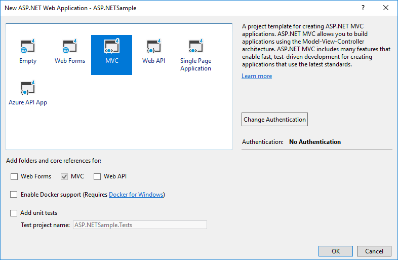
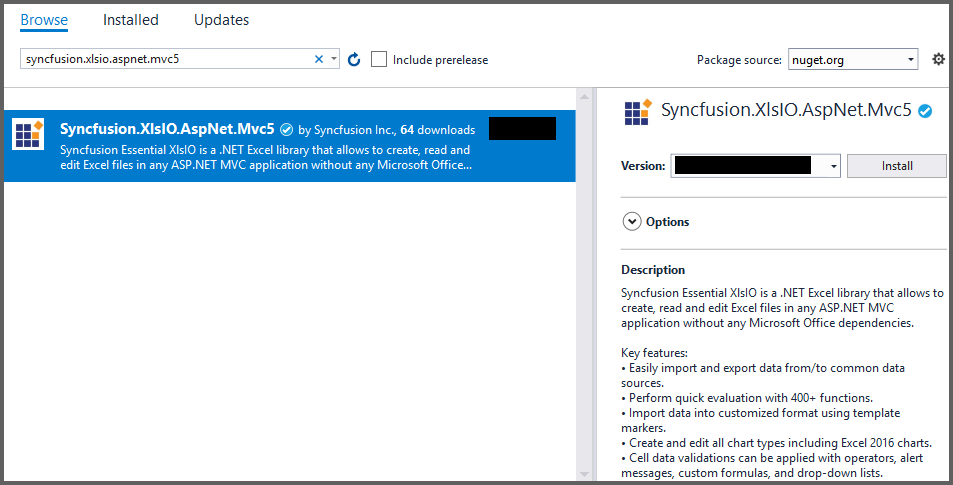

# ASP.NET MVC

In order to use XlsIO in your ASP.NET MVC application, please add the required assemblies in your ASP.NET MVC application. Refer [Assemblies Required](/File-Formats/XlsIO/Assemblies-Required).

## Getting Started

The below steps illustrates creating an simple Invoice formatted Excel document in ASP.NET MVC application.

#### 1. Create a new ASP.NET MVC application project.

#### 2. Install the [Syncfusion.XlsIO.AspNet.Mvc5](https://www.nuget.org/packages/Syncfusion.XlsIO.AspNet.Mvc5) NuGet package as reference to your .NET Framework application from [NuGet.org](https://www.nuget.org).

#### 3. A default controller with named HomeController.cs gets added on creation of ASP.NET MVC project. Include the following namespaces in the HomeController.cs file.

  

using Syncfusion.XlsIO;



Imports Syncfusion.XlsIO

  

#### 4. A default action method named Index will be present in HomeController.cs. Right click on this action method and select Go To View where you will be directed to its associated view page Index.cshtml

#### 5. Add a new button in the Index.cshtml as shown below.

  

@{Html.BeginForm("CreateDocument", "Home", FormMethod.Get);
    {
        

            <input type="submit" value="Create Document" style="width:150px;height:27px" />
        

    }
    Html.EndForm();
}

  

#### 6.Add a new action method CreateDocument in HomeController.cs and include the below code snippet to create an Excel file and download it.

  

//Create an instance of ExcelEngine
using (ExcelEngine excelEngine = new ExcelEngine())
{
	IApplication application = excelEngine.Excel;

	application.DefaultVersion = ExcelVersion.Excel2016;

	//Create a workbook
	IWorkbook workbook = application.Workbooks.Create(1);
	IWorksheet worksheet = workbook.Worksheets[0];

	//Add a picture
	IPictureShape shape = worksheet.Pictures.AddPicture(1, 1, Server.MapPath("App_Data/AdventureCycles-Logo.png"));

	//Disable gridlines in the worksheet
	worksheet.IsGridLinesVisible = false;

	//Enter values to the cells from A3 to A5
	worksheet.Range["A3"].Text = "46036 Michigan Ave";
	worksheet.Range["A4"].Text = "Canton, USA";
	worksheet.Range["A5"].Text = "Phone: +1 231-231-2310";

	//Make the text bold
	worksheet.Range["A3:A5"].CellStyle.Font.Bold = true;

	//Merge cells
	worksheet.Range["D1:E1"].Merge();

	//Enter text to the cell D1 and apply formatting.
	worksheet.Range["D1"].Text = "INVOICE";
	worksheet.Range["D1"].CellStyle.Font.Bold = true;
	worksheet.Range["D1"].CellStyle.Font.RGBColor = Color.FromArgb(42, 118, 189);
	worksheet.Range["D1"].CellStyle.Font.Size = 35;

	//Apply alignment in the cell D1
	worksheet.Range["D1"].CellStyle.HorizontalAlignment = ExcelHAlign.HAlignRight;
	worksheet.Range["D1"].CellStyle.VerticalAlignment = ExcelVAlign.VAlignTop;

	//Enter values to the cells from D5 to E8
	worksheet.Range["D5"].Text = "INVOICE#";
	worksheet.Range["E5"].Text = "DATE";
	worksheet.Range["D6"].Number = 1028;
	worksheet.Range["E6"].Value = "12/31/2018";
	worksheet.Range["D7"].Text = "CUSTOMER ID";
	worksheet.Range["E7"].Text = "TERMS";
	worksheet.Range["D8"].Number = 564;
	worksheet.Range["E8"].Text = "Due Upon Receipt";

	//Apply RGB backcolor to the cells from D5 to E8
	worksheet.Range["D5:E5"].CellStyle.Color = Color.FromArgb(42, 118, 189);
	worksheet.Range["D7:E7"].CellStyle.Color = Color.FromArgb(42, 118, 189);

	//Apply known colors to the text in cells D5 to E8
	worksheet.Range["D5:E5"].CellStyle.Font.Color = ExcelKnownColors.White;
	worksheet.Range["D7:E7"].CellStyle.Font.Color = ExcelKnownColors.White;

	//Make the text as bold from D5 to E8
	worksheet.Range["D5:E8"].CellStyle.Font.Bold = true;

	//Apply alignment to the cells from D5 to E8
	worksheet.Range["D5:E8"].CellStyle.HorizontalAlignment = ExcelHAlign.HAlignCenter;
	worksheet.Range["D5:E5"].CellStyle.VerticalAlignment = ExcelVAlign.VAlignCenter;
	worksheet.Range["D7:E7"].CellStyle.VerticalAlignment = ExcelVAlign.VAlignCenter;
	worksheet.Range["D6:E6"].CellStyle.VerticalAlignment = ExcelVAlign.VAlignTop;

	//Enter value and applying formatting in the cell A7
	worksheet.Range["A7"].Text = "  BILL TO";
	worksheet.Range["A7"].CellStyle.Color = Color.FromArgb(42, 118, 189);
	worksheet.Range["A7"].CellStyle.Font.Bold = true;
	worksheet.Range["A7"].CellStyle.Font.Color = ExcelKnownColors.White;

	//Apply alignment
	worksheet.Range["A7"].CellStyle.HorizontalAlignment = ExcelHAlign.HAlignLeft;
	worksheet.Range["A7"].CellStyle.VerticalAlignment = ExcelVAlign.VAlignCenter;

	//Enter values in the cells A8 to A12
	worksheet.Range["A8"].Text = "Steyn";
	worksheet.Range["A9"].Text = "Great Lakes Food Market";
	worksheet.Range["A10"].Text = "20 Whitehall Rd";
	worksheet.Range["A11"].Text = "North Muskegon,USA";
	worksheet.Range["A12"].Text = "+1 231-654-0000";

	//Create a Hyperlink for e-mail in the cell A13
	IHyperLink hyperlink = worksheet.HyperLinks.Add(worksheet.Range["A13"]);
	hyperlink.Type = ExcelHyperLinkType.Url;
	hyperlink.Address = "Steyn@greatlakes.com";
	hyperlink.ScreenTip = "Send Mail";

	//Merge column A and B from row 15 to 22
	worksheet.Range["A15:B15"].Merge();
	worksheet.Range["A16:B16"].Merge();
	worksheet.Range["A17:B17"].Merge();
	worksheet.Range["A18:B18"].Merge();
	worksheet.Range["A19:B19"].Merge();
	worksheet.Range["A20:B20"].Merge();
	worksheet.Range["A21:B21"].Merge();
	worksheet.Range["A22:B22"].Merge();

	//Enter details of products and prices
	worksheet.Range["A15"].Text = "  DESCRIPTION";
	worksheet.Range["C15"].Text = "QTY";
	worksheet.Range["D15"].Text = "UNIT PRICE";
	worksheet.Range["E15"].Text = "AMOUNT";
	worksheet.Range["A16"].Text = "Cabrales Cheese";
	worksheet.Range["A17"].Text = "Chocos";
	worksheet.Range["A18"].Text = "Pasta";
	worksheet.Range["A19"].Text = "Cereals";
	worksheet.Range["A20"].Text = "Ice Cream";
	worksheet.Range["C16"].Number = 3;
	worksheet.Range["C17"].Number = 2;
	worksheet.Range["C18"].Number = 1;
	worksheet.Range["C19"].Number = 4;
	worksheet.Range["C20"].Number = 3;
	worksheet.Range["D16"].Number = 21;
	worksheet.Range["D17"].Number = 54;
	worksheet.Range["D18"].Number = 10;
	worksheet.Range["D19"].Number = 20;
	worksheet.Range["D20"].Number = 30;
	worksheet.Range["D23"].Text = "Total";

	//Apply number format
	worksheet.Range["D16:E22"].NumberFormat = "$.00";
	worksheet.Range["E23"].NumberFormat = "$.00";

	//Apply incremental formula for column Amount by multiplying Qty and UnitPrice
	application.EnableIncrementalFormula = true;
	worksheet.Range["E16:E20"].Formula = "=C16*D16";

	//Formula for Sum the total
	worksheet.Range["E23"].Formula = "=SUM(E16:E22)";

	//Apply borders
	worksheet.Range["A16:E22"].CellStyle.Borders[ExcelBordersIndex.EdgeTop].LineStyle = ExcelLineStyle.Thin;
	worksheet.Range["A16:E22"].CellStyle.Borders[ExcelBordersIndex.EdgeBottom].LineStyle = ExcelLineStyle.Thin;
	worksheet.Range["A16:E22"].CellStyle.Borders[ExcelBordersIndex.EdgeTop].Color = ExcelKnownColors.Grey_25_percent;
	worksheet.Range["A16:E22"].CellStyle.Borders[ExcelBordersIndex.EdgeBottom].Color = ExcelKnownColors.Grey_25_percent;
	worksheet.Range["A23:E23"].CellStyle.Borders[ExcelBordersIndex.EdgeTop].LineStyle = ExcelLineStyle.Thin;
	worksheet.Range["A23:E23"].CellStyle.Borders[ExcelBordersIndex.EdgeBottom].LineStyle = ExcelLineStyle.Thin;
	worksheet.Range["A23:E23"].CellStyle.Borders[ExcelBordersIndex.EdgeTop].Color = ExcelKnownColors.Black;
	worksheet.Range["A23:E23"].CellStyle.Borders[ExcelBordersIndex.EdgeBottom].Color = ExcelKnownColors.Black;

	//Apply font setting for cells with product details
	worksheet.Range["A3:E23"].CellStyle.Font.FontName = "Arial";
	worksheet.Range["A3:E23"].CellStyle.Font.Size = 10;
	worksheet.Range["A15:E15"].CellStyle.Font.Color = ExcelKnownColors.White;
	worksheet.Range["A15:E15"].CellStyle.Font.Bold = true;
	worksheet.Range["D23:E23"].CellStyle.Font.Bold = true;

	//Apply cell color
	worksheet.Range["A15:E15"].CellStyle.Color = Color.FromArgb(42, 118, 189);

	//Apply alignment to cells with product details
	worksheet.Range["A15"].CellStyle.HorizontalAlignment = ExcelHAlign.HAlignLeft;
	worksheet.Range["C15:C22"].CellStyle.HorizontalAlignment = ExcelHAlign.HAlignCenter;
	worksheet.Range["D15:E15"].CellStyle.HorizontalAlignment = ExcelHAlign.HAlignCenter;

	//Apply row height and column width to look good
	worksheet.Range["A1"].ColumnWidth = 36;
	worksheet.Range["B1"].ColumnWidth = 11;
	worksheet.Range["C1"].ColumnWidth = 8;
	worksheet.Range["D1:E1"].ColumnWidth = 18;
	worksheet.Range["A1"].RowHeight = 47;
	worksheet.Range["A2"].RowHeight = 15;
	worksheet.Range["A3:A4"].RowHeight = 15;
	worksheet.Range["A5"].RowHeight = 18;
	worksheet.Range["A6"].RowHeight = 29;
	worksheet.Range["A7"].RowHeight = 18;
	worksheet.Range["A8"].RowHeight = 15;
	worksheet.Range["A9:A14"].RowHeight = 15;
	worksheet.Range["A15:A23"].RowHeight = 18;
	
	//Save the workbook to disk in xlsx format
	workbook.SaveAs("Output.xlsx", HttpContext.ApplicationInstance.Response, ExcelDownloadType.Open);
}



'Create an instance of ExcelEngine
Using excelEngine As ExcelEngine = New ExcelEngine()

	Dim application As IApplication = excelEngine.Excel

	application.DefaultVersion = ExcelVersion.Excel2016

	'Create a workbook
	Dim workbook As IWorkbook = application.Workbooks.Create(1)
	Dim worksheet As IWorksheet = workbook.Worksheets(0)

	'Adding a picture
	Dim shape As IPictureShape = worksheet.Pictures.AddPicture(1, 1, Server.MapPath("App_Data/AdventureCycles-Logo.png"))

	'Disable gridlines in the worksheet
	worksheet.IsGridLinesVisible = False

	'Enter values to the cells from A3 to A5
	worksheet.Range("A3").Text = "46036 Michigan Ave"
	worksheet.Range("A4").Text = "Canton, USA"
	worksheet.Range("A5").Text = "Phone: +1 231-231-2310"

	'Make the text bold
	worksheet.Range("A3:A5").CellStyle.Font.Bold = True

	'Merge cells
	worksheet.Range("D1:E1").Merge()

	'Enter text to the cell D1 and apply formatting.
	worksheet.Range("D1").Text = "INVOICE"
	worksheet.Range("D1").CellStyle.Font.Bold = True
	worksheet.Range("D1").CellStyle.Font.RGBColor = Color.FromArgb(42, 118, 189)
	worksheet.Range("D1").CellStyle.Font.Size = 35

	'Apply alignment in the cell D1
	worksheet.Range("D1").CellStyle.HorizontalAlignment = ExcelHAlign.HAlignRight
	worksheet.Range("D1").CellStyle.VerticalAlignment = ExcelVAlign.VAlignTop

	'Enter values to the cells from D5 to E8
	worksheet.Range("D5").Text = "INVOICE#"
	worksheet.Range("E5").Text = "DATE"
	worksheet.Range("D6").Number = 1028
	worksheet.Range("E6").Value = "12/31/2018"
	worksheet.Range("D7").Text = "CUSTOMER ID"
	worksheet.Range("E7").Text = "TERMS"
	worksheet.Range("D8").Number = 564
	worksheet.Range("E8").Text = "Due Upon Receipt"

	'Apply RGB back color to the cells from D5 to E8
	worksheet.Range("D5:E5").CellStyle.Color = Color.FromArgb(42, 118, 189)
	worksheet.Range("D7:E7").CellStyle.Color = Color.FromArgb(42, 118, 189)

	'Apply known colors to the text in cells D5 to E8
	worksheet.Range("D5:E5").CellStyle.Font.Color = ExcelKnownColors.White
	worksheet.Range("D7:E7").CellStyle.Font.Color = ExcelKnownColors.White

	'Make the text as bold from D5 to E8
	worksheet.Range("D5:E8").CellStyle.Font.Bold = True

	'Apply alignment to the cells from D5 to E8
	worksheet.Range("D5:E8").CellStyle.HorizontalAlignment = ExcelHAlign.HAlignCenter
	worksheet.Range("D5:E5").CellStyle.VerticalAlignment = ExcelVAlign.VAlignCenter
	worksheet.Range("D7:E7").CellStyle.VerticalAlignment = ExcelVAlign.VAlignCenter
	worksheet.Range("D6:E6").CellStyle.VerticalAlignment = ExcelVAlign.VAlignTop

	'Enter value and applying formatting in the cell A7
	worksheet.Range("A7").Text = "  BILL TO"
	worksheet.Range("A7").CellStyle.Color = Color.FromArgb(42, 118, 189)
	worksheet.Range("A7").CellStyle.Font.Bold = True
	worksheet.Range("A7").CellStyle.Font.Color = ExcelKnownColors.White

	'Apply alignment
	worksheet.Range("A7").CellStyle.HorizontalAlignment = ExcelHAlign.HAlignLeft
	worksheet.Range("A7").CellStyle.VerticalAlignment = ExcelVAlign.VAlignCenter

	'Enter values in the cells A8 to A12
	worksheet.Range("A8").Text = "Steven"
	worksheet.Range("A9").Text = "Great Lakes Food Market"
	worksheet.Range("A10").Text = "20 Whitehall Rd"
	worksheet.Range("A11").Text = "North Muskegon,USA"
	worksheet.Range("A12").Text = "+1 231-654-0000"

	'Create a Hyperlink for e-mail in the cell A13
	Dim hyperlink As IHyperLink = worksheet.HyperLinks.Add(worksheet.Range("A13"))
	hyperlink.Type = ExcelHyperLinkType.Url
	hyperlink.Address = "Steven@greatlakes.com"
	hyperlink.ScreenTip = "Send Mail"

	'Merge column A and B from row 15 to 22
	worksheet.Range("A15:B15").Merge()
	worksheet.Range("A16:B16").Merge()
	worksheet.Range("A17:B17").Merge()
	worksheet.Range("A18:B18").Merge()
	worksheet.Range("A19:B19").Merge()
	worksheet.Range("A20:B20").Merge()
	worksheet.Range("A21:B21").Merge()
	worksheet.Range("A22:B22").Merge()

	'Enter details of products and prices
	worksheet.Range("A15").Text = "  DESCRIPTION"
	worksheet.Range("C15").Text = "QTY"
	worksheet.Range("D15").Text = "UNIT PRICE"
	worksheet.Range("E15").Text = "AMOUNT"
	worksheet.Range("A16").Text = "Cabrales Cheese"
	worksheet.Range("A17").Text = "Chocos"
	worksheet.Range("A18").Text = "Pasta"
	worksheet.Range("A19").Text = "Cereals"
	worksheet.Range("A20").Text = "Ice Cream"
	worksheet.Range("C16").Number = 3
	worksheet.Range("C17").Number = 2
	worksheet.Range("C18").Number = 1
	worksheet.Range("C19").Number = 4
	worksheet.Range("C20").Number = 3
	worksheet.Range("D16").Number = 21
	worksheet.Range("D17").Number = 54
	worksheet.Range("D18").Number = 10
	worksheet.Range("D19").Number = 20
	worksheet.Range("D20").Number = 30
	worksheet.Range("D23").Text = "Total"

	'Apply number format
	worksheet.Range("D16:E22").NumberFormat = "$.00"
	worksheet.Range("E23").NumberFormat = "$.00"

	'Apply incremental formula for column Amount by multiplying Qty and UnitPrice
	application.EnableIncrementalFormula = True
	worksheet.Range("E16:E20").Formula = "=C16*D16"

	'Formula for Sum the total
	worksheet.Range("E23").Formula = "=SUM(E16:E22)"

	'Apply borders
	worksheet.Range("A16:E22").CellStyle.Borders(ExcelBordersIndex.EdgeTop).LineStyle = ExcelLineStyle.Thin
	worksheet.Range("A16:E22").CellStyle.Borders(ExcelBordersIndex.EdgeBottom).LineStyle = ExcelLineStyle.Thin
	worksheet.Range("A16:E22").CellStyle.Borders(ExcelBordersIndex.EdgeTop).Color = ExcelKnownColors.Grey_25_percent
	worksheet.Range("A16:E22").CellStyle.Borders(ExcelBordersIndex.EdgeBottom).Color = ExcelKnownColors.Grey_25_percent
	worksheet.Range("A23:E23").CellStyle.Borders(ExcelBordersIndex.EdgeTop).LineStyle = ExcelLineStyle.Thin
	worksheet.Range("A23:E23").CellStyle.Borders(ExcelBordersIndex.EdgeBottom).LineStyle = ExcelLineStyle.Thin
	worksheet.Range("A23:E23").CellStyle.Borders(ExcelBordersIndex.EdgeTop).Color = ExcelKnownColors.Black
	worksheet.Range("A23:E23").CellStyle.Borders(ExcelBordersIndex.EdgeBottom).Color = ExcelKnownColors.Black

	'Apply font setting for cells with product details
	worksheet.Range("A3:E23").CellStyle.Font.FontName = "Arial"
	worksheet.Range("A3:E23").CellStyle.Font.Size = 10
	worksheet.Range("A15:E15").CellStyle.Font.Color = ExcelKnownColors.White
	worksheet.Range("A15:E15").CellStyle.Font.Bold = True
	worksheet.Range("D23:E23").CellStyle.Font.Bold = True

	'Apply cell color
	worksheet.Range("A15:E15").CellStyle.Color = Color.FromArgb(42, 118, 189)

	'Apply alignment to cells with product details
	worksheet.Range("A15").CellStyle.HorizontalAlignment = ExcelHAlign.HAlignLeft
	worksheet.Range("C15:C22").CellStyle.HorizontalAlignment = ExcelHAlign.HAlignCenter
	worksheet.Range("D15:E15").CellStyle.HorizontalAlignment = ExcelHAlign.HAlignCenter

	'Apply row height and column width to look good
	worksheet.Range("A1").ColumnWidth = 36
	worksheet.Range("B1").ColumnWidth = 11
	worksheet.Range("C1").ColumnWidth = 8
	worksheet.Range("D1:E1").ColumnWidth = 18
	worksheet.Range("A1").RowHeight = 47
	worksheet.Range("A2").RowHeight = 15
	worksheet.Range("A3:A4").RowHeight = 15
	worksheet.Range("A5").RowHeight = 18
	worksheet.Range("A6").RowHeight = 29
	worksheet.Range("A7").RowHeight = 18
	worksheet.Range("A8").RowHeight = 15
	worksheet.Range("A9:A14").RowHeight = 15
	worksheet.Range("A15:A23").RowHeight = 18

	'Save and download the Excel file
	 workbook.SaveAs("Output.xlsx", HttpContext.ApplicationInstance.Response, ExcelDownloadType.Open)
End Using

  

A complete working example of how to create an Excel file in ASP.NET MVC can be downloaded from [Create-Excel-file.zip](http://www.syncfusion.com/downloads/support/directtrac/general/ze/GettingStarted-MVC-860065560.zip).

By executing the program, you will get the Excel file as follows.

Take a moment to peruse the [documentation](https://help.syncfusion.com/file-formats/xlsio/overview), where you can find basic worksheet data manipulation options along with features like [Conditional Formatting](https://help.syncfusion.com/file-formats/xlsio/working-with-conditional-formatting), worksheet calculations through [Formulas](https://help.syncfusion.com/file-formats/xlsio/working-with-formulas), adding [Charts](https://help.syncfusion.com/file-formats/xlsio/working-with-charts) in worksheet or workbook, organizing and analyzing data through [Tables](https://help.syncfusion.com/file-formats/xlsio/working-with-tables) and [Pivot Tables](https://help.syncfusion.com/file-formats/xlsio/working-with-pivot-tables), appending multiple records to worksheet using [Template Markers](https://help.syncfusion.com/file-formats/xlsio/working-with-template-markers), and most importantly [PDF](https://help.syncfusion.com/file-formats/xlsio/excel-to-pdf-conversion) and [Image conversions](https://help.syncfusion.com/file-formats/xlsio/worksheet-to-image-conversion) etc., with code examples.

An online sample link to [generate Excel file](https://mvc.syncfusion.com/demos/web/xlsio/create).

N> Starting with v16.2.0.x, if you reference Syncfusion assemblies from trial setup or from the NuGet feed, you also have to add "Syncfusion.Licensing" assembly reference and include a license key in your projects. Please refer to this [link](https://help.syncfusion.com/common/essential-studio/licensing/license-key) to know about registering Syncfusion license key in your applications to use our components.

## Saving a document

The following code snippet illustrates how to save an Excel document in ASP.NET MVC.

  

//New instance of ExcelEngine is created 
//Equivalent to launching Microsoft Excel with no workbooks open
//Instantiate the spreadsheet creation engine
ExcelEngine excelEngine = new ExcelEngine();

//Instantiate the Excel application object.
IApplication application = excelEngine.Excel;

'A new workbook is created.
IWorkbook workbook = application.Workbooks.Create(1);

//Access first worksheet from the workbook.
IWorksheet sheet = workbook.Worksheets[0];

//Set Text in cell A3.
sheet.Range["A3"].Text ="Hello World";

//Assigns workbook version.
workbook.Version = ExcelVersion.Excel2013;

//Saving the workbook.
return excelEngine.SaveAsActionResult(workbook, "output.xlsx", HttpContext.ApplicationInstance.Response, ExcelDownloadType.PromptDialog, ExcelHttpContentType.Excel2013);



'New instance of ExcelEngine is created 
'Equivalent to launching Microsoft Excel with no workbooks open
'Instantiate the spreadsheet creation engine
Dim excelEngine As ExcelEngine = New ExcelEngine()

'Instantiate the Excel application object.
Dim application As IApplication = excelEngine.Excel

'A new workbook is created.  
Dim workbook As IWorkbook = application.Workbooks.Create(1)

'Access first worksheet from the workbook.
Dim sheet As IWorksheet = workbook.Worksheets(0)

'Set Text in cell A3.
sheet.Range("A3").Text = "Hello World"

'Assigns workbook version.
workbook.Version = ExcelVersion.Excel2013

'Saving the workbook.
Return excelEngine.SaveAsActionResult(workbook, "output.xlsx", HttpContext.ApplicationInstance.Response, ExcelDownloadType.PromptDialog, ExcelHttpContentType.Excel2013)

  

The below codes illustrates the extension "SaveAsActionResult" used in the controller code above.

  

public static class XlsIOExtension
{
	public static ExcelResult SaveAsActionResult(this ExcelEngine _engine, IWorkbook _workbook, string filename, HttpResponse response)
	{
		ExcelHttpContentType contentType = ExcelHttpContentType.Excel2007;

		if (_workbook.Version == ExcelVersion.Excel2007)
			contentType = ExcelHttpContentType.Excel2007;
		else if (_workbook.Version == ExcelVersion.Excel97to2003)
			contentType = ExcelHttpContentType.Excel2000;

		return new ExcelResult(_engine, _workbook, filename, response, ExcelDownloadType.PromptDialog, contentType);
	}

	public static ExcelResult SaveAsActionResult(this ExcelEngine _engine, IWorkbook _workbook, string filename, HttpResponse response, ExcelDownloadType DownloadType)
	{
		ExcelHttpContentType contentType = ExcelHttpContentType.Excel2007;

		if (_workbook.Version == ExcelVersion.Excel2007)
			contentType = ExcelHttpContentType.Excel2007;
		else if (_workbook.Version == ExcelVersion.Excel97to2003)
			contentType = ExcelHttpContentType.Excel2000;

		return new ExcelResult(_engine, _workbook, filename, response, DownloadType, contentType);
	}

	public static ExcelResult SaveAsActionResult(this ExcelEngine _engine, IWorkbook _workbook, string filename, HttpResponse response, ExcelHttpContentType contentType)
	{
		return new ExcelResult(_engine, _workbook, filename, response, ExcelDownloadType.PromptDialog, contentType);
	}

	public static ExcelResult SaveAsActionResult(this ExcelEngine _engine, IWorkbook _workbook, string filename, HttpResponse response, ExcelDownloadType DownloadType, ExcelHttpContentType contentType)
	{
		return new ExcelResult(_engine, _workbook, filename, response, DownloadType, contentType);
	}

	public static ExcelResult SaveAsActionResult(this ExcelEngine _engine, IWorkbook _workbook, string filename, ExcelSaveType saveType, HttpResponse response, ExcelDownloadType DownloadType, ExcelHttpContentType contentType)
	{
		return new ExcelResult(_engine, _workbook, filename, response, DownloadType, contentType);
	}

	public static ExcelResult SaveAsActionResult(this ExcelEngine _engine, IWorkbook _workbook, string filename, string separator, HttpResponse response, ExcelDownloadType DownloadType, ExcelHttpContentType contentType)
	{
		return new ExcelResult(_engine, _workbook, filename, separator, response, DownloadType, contentType);
	}
}

public class ExcelResult : ActionResult
{
	private IWorkbook m_source;
	private ExcelEngine m_engine;
	private string m_filename;
	private HttpResponse m_response;
	private ExcelDownloadType m_downloadType;
	private ExcelHttpContentType m_contentType;
	private string m_separator;

	public string FileName
	{
		get
		{
			return m_filename;
		}
		set
		{
			m_filename = value;
		}
	}

	public IWorkbook Source
	{
		get
		{
			return m_source as IWorkbook;
		}
	}

	public ExcelEngine Engine
	{
		get
		{
			return m_engine as ExcelEngine;
		}
	}

	public HttpResponse Response
	{
		get
		{
			return m_response;
		}
	}

	public ExcelDownloadType DownloadType
	{
		set
		{
			m_downloadType = value;
		}
		get
		{
			return m_downloadType;
		}
	}

	public ExcelHttpContentType ContentType
	{
		set
		{
			m_contentType = value;
		}
		get
		{
			return m_contentType;
		}
	}

	public string Separator
	{
		set
		{
			m_separator = value;
		}
		get
		{
			return m_separator;
		}
	}

	public ExcelResult(ExcelEngine engine, IWorkbook source, string fileName, HttpResponse response, ExcelDownloadType downloadType, ExcelHttpContentType contentType)
	{
		this.FileName = fileName;
		this.m_source = source;
		this.m_engine = engine;
		m_response = response;
		DownloadType = downloadType;
		ContentType = contentType;
	}

	public ExcelResult(ExcelEngine engine, IWorkbook source, string fileName, string separator, HttpResponse response, ExcelDownloadType downloadType, ExcelHttpContentType contentType)
	{
		this.FileName = fileName;
		this.m_source = source;
		this.m_engine = engine;
		m_response = response;
		DownloadType = downloadType;
		ContentType = contentType;
		Separator = separator;
	}

	public override void ExecuteResult(ControllerContext context)
	{
		if (context == null)
			throw new ArgumentNullException("Context");

		if (m_contentType == ExcelHttpContentType.CSV)
		{
			this.m_source.SaveAs(FileName, Separator, Response, DownloadType, ContentType);
			this.m_source.Close();
			this.m_engine.Dispose();
		}
		else
		{
			this.m_source.SaveAs(FileName, Response, DownloadType, ContentType);
			this.m_source.Close();
			this.m_engine.Dispose();
		}
	}
}



Public static Class XlsIOExtension

	Public Shared Function SaveAsActionResult(ByVal ExcelEngine As Me, ByVal _workbook As IWorkbook, ByVal filename As String, ByVal response As HttpResponse) As ExcelResult

		Dim contentType As ExcelHttpContentType = ExcelHttpContentType.Excel2007

		If _workbook.Version = ExcelVersion.Excel2007 Then
			contentType = ExcelHttpContentType.Excel2007
		ElseIf _workbook.Version = ExcelVersion.Excel97to2003 Then
			contentType = ExcelHttpContentType.Excel2000
		End If

		Return New ExcelResult(_engine, _workbook, filename, response, ExcelDownloadType.PromptDialog, contentType)

	End Function

	Public Shared Function SaveAsActionResult(ByVal ExcelEngine As Me, ByVal _workbook As IWorkbook, ByVal filename As String, ByVal response As HttpResponse, ByVal DownloadType As ExcelDownloadType) As ExcelResult

	Dim contentType As ExcelHttpContentType = ExcelHttpContentType.Excel2007

	If _workbook.Version = ExcelVersion.Excel2007 Then
		contentType = ExcelHttpContentType.Excel2007
	ElseIf _workbook.Version = ExcelVersion.Excel97to2003 Then
		contentType = ExcelHttpContentType.Excel2000
	End If

	Return New ExcelResult(_engine, _workbook, filename, response, DownloadType, contentType)

	End Function

	Public Shared Function SaveAsActionResult(ByVal ExcelEngine As Me, ByVal _workbook As IWorkbook, ByVal filename As String, ByVal response As HttpResponse, ByVal contentType As ExcelHttpContentType) As ExcelResult

		Return New ExcelResult(_engine, _workbook, filename, response, ExcelDownloadType.PromptDialog, contentType)

	End Function

	Public Shared Function SaveAsActionResult(ByVal ExcelEngine As Me, ByVal _workbook As IWorkbook, ByVal filename As String, ByVal response As HttpResponse, ByVal DownloadType As ExcelDownloadType, ByVal contentType As ExcelHttpContentType) As ExcelResult

		Return New ExcelResult(_engine, _workbook, filename, response, DownloadType, contentType)

	End Function

	Public Shared Function SaveAsActionResult(ByVal ExcelEngine As Me, ByVal _workbook As IWorkbook, ByVal filename As String, ByVal saveType As ExcelSaveType, ByVal response As HttpResponse, ByVal DownloadType As ExcelDownloadType, ByVal contentType As ExcelHttpContentType) As ExcelResult

		Return New ExcelResult(_engine, _workbook, filename, response, DownloadType, contentType)

	End Function

	Public Shared Function SaveAsActionResult(ByVal ExcelEngine As Me, ByVal _workbook As IWorkbook, ByVal filename As String, ByVal separator As String, ByVal response As HttpResponse, ByVal DownloadType As ExcelDownloadType, ByVal contentType As ExcelHttpContentType) As ExcelResult

		Return New ExcelResult(_engine, _workbook, filename, separator, response, DownloadType, contentType)

	End Function

End Class

Public Class ExcelResult Inherits ActionResult

	Private m_source As IWorkbook
	Private m_engine As ExcelEngine
	Private m_filename As String
	Private m_response As HttpResponse
	Private m_downloadType As ExcelDownloadType
	Private m_contentType As ExcelHttpContentType
	Private m_separator As String

	Public Property FileName() As String
		Get
			Return m_filename
		End Get
		Set(ByVal Value As String)
			m_filename = value
		End Set
	End Property

	Public ReadOnly Property Source() As IWorkbook
		Get
			Return m_source as IWorkbook
		End Get
	End Property

	Public ReadOnly Property Engine() As ExcelEngine
		Get
			Return m_engine as ExcelEngine
		End Get
	End Property

	Public ReadOnly Property Response() As HttpResponse
		Get
			Return m_response
		End Get
	End Property

	Public Property DownloadType() As ExcelDownloadType
		Get
			Return m_downloadType
		End Get
		Set(ByVal Value As ExcelDownloadType)
			m_downloadType = value
		End Set
	End Property

	Public Property ContentType() As ExcelHttpContentType
	Get
		Return m_contentType
	End Get
	Set(ByVal Value As ExcelHttpContentType)
		m_contentType = value
	End Set
	End Property

	Public Property Separator() As String
		Get
			Return m_separator
		End Get
		Set(ByVal Value As String)
			m_separator = value
		End Set
	End Property

	Public Sub New(ByVal engine As ExcelEngine, ByVal source As IWorkbook, ByVal fileName As String, ByVal response As HttpResponse, ByVal downloadType As ExcelDownloadType, ByVal contentType As ExcelHttpContentType)

		Me.FileName = fileName
		Me.m_source = source
		Me.m_engine = engine
		m_response = response
		DownloadType = downloadType
		ContentType = contentType

	End Sub

	Public Sub New(ByVal engine As ExcelEngine, ByVal source As IWorkbook, ByVal fileName As String, ByVal separator As String, ByVal response As HttpResponse, ByVal downloadType As ExcelDownloadType, ByVal contentType As ExcelHttpContentType)

		Me.FileName = fileName
		Me.m_source = source
		Me.m_engine = engine
		m_response = response
		DownloadType = downloadType
		ContentType = contentType
		Separator = separator

	End Sub

	Public Overrides Sub ExecuteResult(ByVal context As ControllerContext)

	If context Is Nothing Then
		Throw New ArgumentNullException("Context")
	End If

	If m_contentType = ExcelHttpContentType.CSV Then
		Me.m_source.SaveAs(FileName, Separator, Response, DownloadType, ContentType)
		Me.m_source.Close()
		Me.m_engine.Dispose()
	Else
		Me.m_source.SaveAs(FileName, Response, DownloadType, ContentType)
		Me.m_source.Close()
		Me.m_engine.Dispose()
	End If

	End Sub

End Class

  
