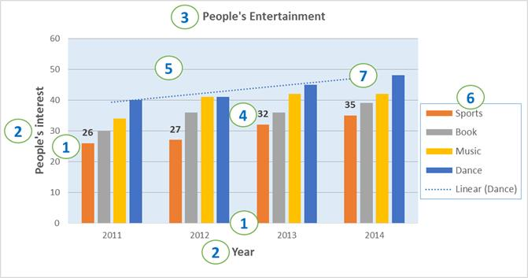

# Chart to Image Conversion

The following code snippets shows how to convert an Excel chart to an image using the **ExcelChartToImageConverter** class.

  


ExcelEngine excelEngine = new ExcelEngine();
IApplication application = excelEngine.Excel;
application.DefaultVersion = ExcelVersion.Excel2013;

application.ChartToImageConverter = new ChartToImageConverter();
application.ChartToImageConverter.ScalingMode = ScalingMode.Best;

IWorkbook workbook = application.Workbooks.Open("Sample.xlsx");
IWorksheet worksheet = workbook.Worksheets[0];

IChart chart = worksheet.Charts[0];

//Creating the memory stream for chart image
MemoryStream stream = new MemoryStream();

//Saving the chart as image
chart.SaveAsImage(stream);

Image image = Image.FromStream(stream);

//Saving image stream to file
image.Save("Output.png");

//Closing the workbook and disposing the Excel Engine
workbook.Close();
excelEngine.Dispose();




Dim excelEngine As New ExcelEngine()
Dim application As IApplication = excelEngine.Excel
application.DefaultVersion = ExcelVersion.Excel2013

Dim ChartToImageConverter As chartToImageConverter = New ChartToImageConverter()

application.ChartToImageConverter = chartToImageConverter
application.ChartToImageConverter.ScalingMode = ScalingMode.Best

Dim workbook As IWorkbook = application.Workbooks.Open("Sample.xlsx")
Dim worksheet As IWorksheet = workbook.Worksheets(0)

Dim chart As IChart = worksheet.Charts(0)

'Creating the memory stream for chart image
Dim stream As New MemoryStream()

'Saving the chart as image
chart.SaveAsImage(stream)

Dim image As Image = Image.FromStream(stream)

'Saving image stream to file
image.Save("Output.png")

'Closing the workbook and disposing the Excel Engine
workbook.Close()
excelEngine.Dispose()



//XlsIO supports chart to image conversion in Windows Forms, WPF, ASP.NET and ASP.NET MVC platforms alone.


//XlsIO supports chart to image conversion in Windows Forms, WPF, ASP.NET and ASP.NET MVC platforms alone.


//XlsIO supports chart to image conversion in Windows Forms, WPF, ASP.NET and ASP.NET MVC platforms alone.


  

N> Chart conversion to image and PDF are supported from .NET Framework 4.0 onwards.

## Supported Chart Types
XlsIO supports the following chart types in image conversion.
<table>
<tr>
<td>
{{'**Chart Type**'| markdownify }}
</td>
<td>
{{'**Chart Subtypes**'| markdownify }}
</td>
</tr>
<tr>
<td>
Area
</td>
<td>
* Area 
* Area_Stacked 
* Area_Stacked_100 
* Area_3D
</td>
</tr>
<tr>
<td>
Bar
</td>
<td>
* Bar_Clustered 
* Bar_Stacked 
* Bar_Stacked_100 
* Bar_Clustered_3D 
* Bar_Stacked_3D 
* Bar_Stacked_100_3D
</td>
</tr>
<tr>
<td>
Bubble
</td>
<td>
Bubble
</td>
</tr>
<tr>
<td>
Column
</td>
<td>
* Column_Clustered 
* Column_Stacked 
* Column_Stacked_100 
* Column_3D 
* Column_Clustered_3D 
* Column_Stacked_3D 
* Column_Stacked_100_3D
</td>
</tr>
<tr>
<td>
Doughnut
</td>
<td>
* Doughnut 
* Doughnut_Exploded
</td>
</tr>
<tr>
<td>
Line
</td>
<td>
* Line 
* Line_Markers 
* Line_3D
</td>
</tr>
<tr>
<td>
Pie
</td>
<td>
* Pie 
* Pie_Exploded 
* Pie_3D 
* Pie_Exploded_3D
</td>
</tr>
<tr>
<td>
Radar
</td>
<td>
* Radar 
* Radar_Filled 
* Radar_Markers
</td>
</tr>
<tr>
<td>
Scatter
</td>
<td>
* Scatter_Line 
* Scatter_Line_Markers 
* Scatter_Markers 
* Scatter_SmoothedLine 
* Scatter_SmoothedLine_Markers
</td>
</tr>
<tr>
<td>
Stock
</td>
<td>
* Stock_HighLowClose 
* Stock_OpenHighLowClose
</td>
</tr>
<tr>
<td>
Excel 2016 Charts
</td>
<td>
* Funnel * Waterfall * Histogram * Pareto </td>
</tr>
</table>

## Supported Chart Elements
XlsIO supports the following chart elements in image conversion.

**Chart Elements:**
1. Axis
2. Axis Titles
3. Chart Title
4. Data Labels
5. Grid Lines
6. Legend
7. Trend Line
