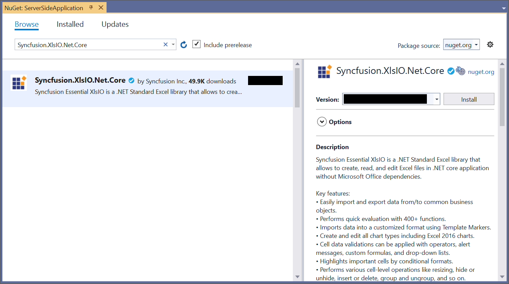
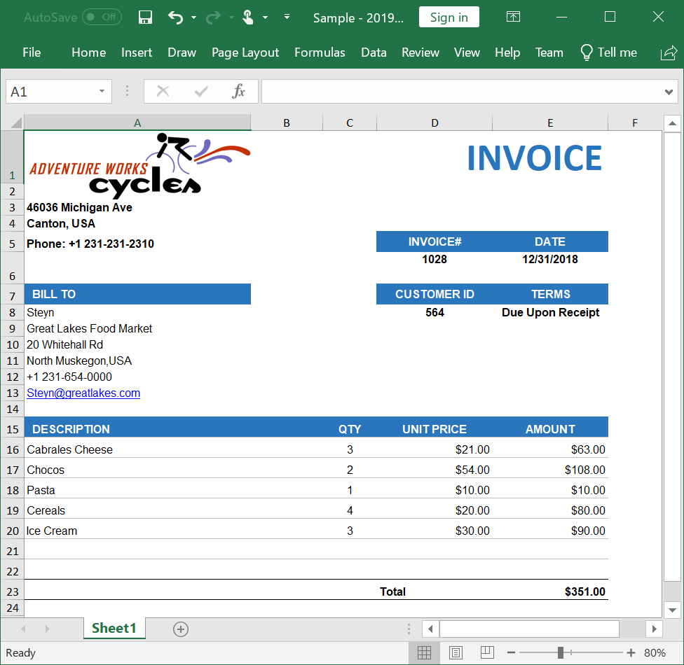
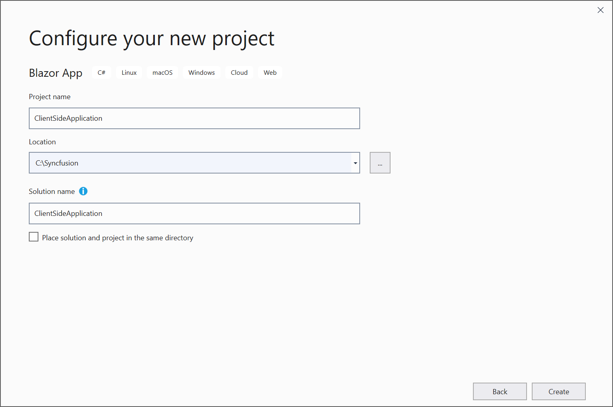
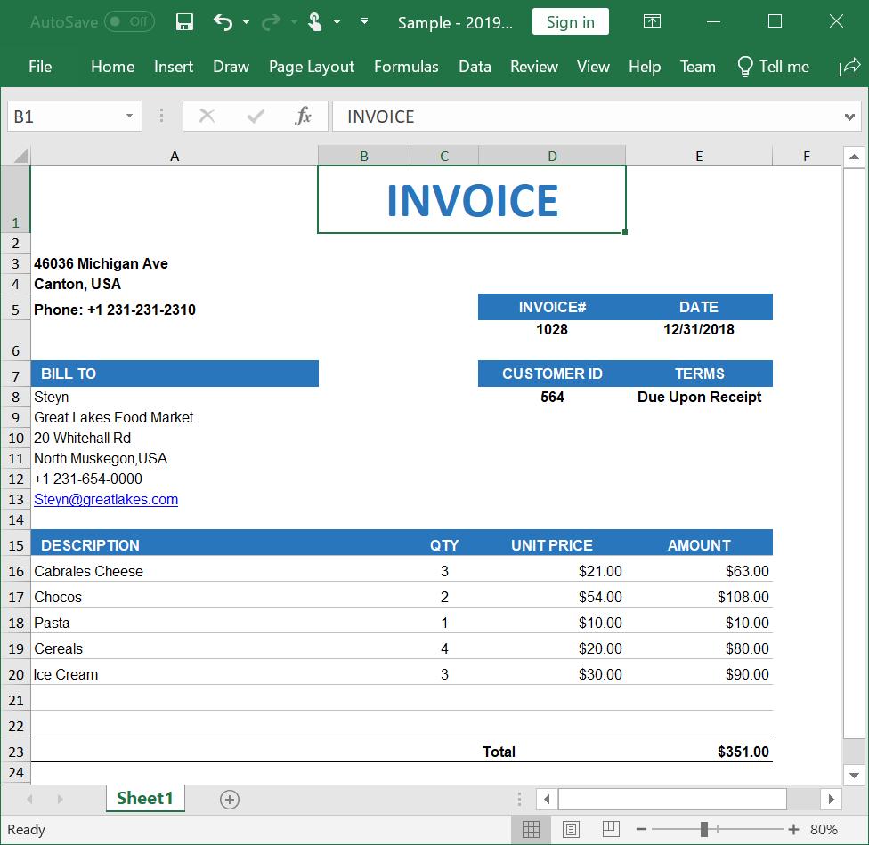

# Create, read, and edit Excel files in Blazor

[Syncfusion Excel library for Blazor platform](https://www.syncfusion.com/excel-framework/blazor/excel-library) can be used to create, read, edit Excel files. This also convert Excel files to PDF.

## Create a simple Excel report in Blazor Server-Side application

The below steps illustrates the creation of a simple Invoice formatted Excel document in Blazor Server-Side application.

1.Create a new C# Blazor Server-Side application project. Select Blazor App from the template and click the Next button.

2.Now, the project configuration window will popup. Click Create button to create a new project with the required project name.

3.Choose Blazor Server App and click Create button to create a new Blazor Server-Side application for .NET Core 3.0.0-preview9.

4.Install the [Syncfusion.XlsIO.Net.Core](https://www.nuget.org/packages/Syncfusion.XlsIO.Net.Core) NuGet package as reference to your Blazor application from [NuGet.org](https://www.nuget.org).

5.Create a razor file with name as ``Excel`` under ``Pages`` folder and include the following namespaces in the file.



@page "/Excel"
@using System.IO;
@using ServerSideApplication;
@inject ServerSideApplication.Data.ExcelService service
@inject Microsoft.JSInterop.IJSRuntime JS



6.Add the following code to create a new button.



<h2>Syncfusion Excel library (Essential XlsIO)</h2>

Syncfusion Excel library (Essential XlsIO)  is a Blazor Excel library used to create, read, edit, and convert Excel files in your applications without Microsoft Office dependencies.

<button class="btn btn-primary" @onclick="@CreateDocument">Create Document</button>



7.Add the following code in ``Excel.razor`` file to create and download the Excel document.



@code {
    MemoryStream excelStream;

    /// 

    /// Create and download the Excel document
    /// 

    protected async void CreateDocument()
    {
        excelStream = service.CreateExcel();
        await JS.SaveAs("Sample.xlsx", excelStream.ToArray());
    }
}



8.Create a new cs file with name as ``ExcelService`` under ``Data`` folder and include the following namespaces in the file.



@using Syncfusion.XlsIO;
@using Syncfusion.Drawing;
@using System.IO;



9.Create a new MemoryStream method with name as ``CreateExcel`` and include the following code snippet to create a simple Invoice formatted Excel document in Blazor Server-Side application.



//Create an instance of ExcelEngine
using (ExcelEngine excelEngine = new ExcelEngine())
{
    IApplication application = excelEngine.Excel;
    application.DefaultVersion = ExcelVersion.Excel2016;

    //Create a workbook
    IWorkbook workbook = application.Workbooks.Create(1);
    IWorksheet worksheet = workbook.Worksheets[0];

    //Add a picture
    FileStream imageStream = new FileStream("AdventureCycle.png", FileMode.Open);
    Image image = Image.FromStream(imageStream);
    IPictureShape shape = worksheet.Pictures.AddPicture(1, 1, image, 20, 20);

    //Disable gridlines in the worksheet
    worksheet.IsGridLinesVisible = false;

    //Enter values to the cells from A3 to A5
    worksheet.Range["A3"].Text = "46036 Michigan Ave";
    worksheet.Range["A4"].Text = "Canton, USA";
    worksheet.Range["A5"].Text = "Phone: +1 231-231-2310";

    //Make the text bold
    worksheet.Range["A3:A5"].CellStyle.Font.Bold = true;

    //Merge cells
    worksheet.Range["D1:E1"].Merge();

    //Enter text to the cell D1 and apply formatting
    worksheet.Range["D1"].Text = "INVOICE";
    worksheet.Range["D1"].CellStyle.Font.Bold = true;
    worksheet.Range["D1"].CellStyle.Font.RGBColor = Color.FromArgb(42, 118, 189);
    worksheet.Range["D1"].CellStyle.Font.Size = 35;

    //Apply alignment in the cell D1
    worksheet.Range["D1"].CellStyle.HorizontalAlignment = ExcelHAlign.HAlignRight;
    worksheet.Range["D1"].CellStyle.VerticalAlignment = ExcelVAlign.VAlignTop;

    //Enter values to the cells from D5 to E8
    worksheet.Range["D5"].Text = "INVOICE#";
    worksheet.Range["E5"].Text = "DATE";
    worksheet.Range["D6"].Number = 1028;
    worksheet.Range["E6"].Value = "12/31/2018";
    worksheet.Range["D7"].Text = "CUSTOMER ID";
    worksheet.Range["E7"].Text = "TERMS";
    worksheet.Range["D8"].Number = 564;
    worksheet.Range["E8"].Text = "Due Upon Receipt";

    //Apply RGB backcolor to the cells from D5 to E8
    worksheet.Range["D5:E5"].CellStyle.Color = Color.FromArgb(42, 118, 189);
    worksheet.Range["D7:E7"].CellStyle.Color = Color.FromArgb(42, 118, 189);

    //Apply known colors to the text in cells D5 to E8
    worksheet.Range["D5:E5"].CellStyle.Font.Color = ExcelKnownColors.White;
    worksheet.Range["D7:E7"].CellStyle.Font.Color = ExcelKnownColors.White;

    //Make the text as bold from D5 to E8
    worksheet.Range["D5:E8"].CellStyle.Font.Bold = true;

    //Apply alignment to the cells from D5 to E8
    worksheet.Range["D5:E8"].CellStyle.HorizontalAlignment = ExcelHAlign.HAlignCenter;
    worksheet.Range["D5:E5"].CellStyle.VerticalAlignment = ExcelVAlign.VAlignCenter;
    worksheet.Range["D7:E7"].CellStyle.VerticalAlignment = ExcelVAlign.VAlignCenter;
    worksheet.Range["D6:E6"].CellStyle.VerticalAlignment = ExcelVAlign.VAlignTop;

    //Enter value and applying formatting in the cell A7
    worksheet.Range["A7"].Text = "  BILL TO";
    worksheet.Range["A7"].CellStyle.Color = Color.FromArgb(42, 118, 189);
    worksheet.Range["A7"].CellStyle.Font.Bold = true;
    worksheet.Range["A7"].CellStyle.Font.Color = ExcelKnownColors.White;

    //Apply alignment
    worksheet.Range["A7"].CellStyle.HorizontalAlignment = ExcelHAlign.HAlignLeft;
    worksheet.Range["A7"].CellStyle.VerticalAlignment = ExcelVAlign.VAlignCenter;

    //Enter values in the cells A8 to A12
    worksheet.Range["A8"].Text = "Steyn";
    worksheet.Range["A9"].Text = "Great Lakes Food Market";
    worksheet.Range["A10"].Text = "20 Whitehall Rd";
    worksheet.Range["A11"].Text = "North Muskegon,USA";
    worksheet.Range["A12"].Text = "+1 231-654-0000";

    //Create a Hyperlink for e-mail in the cell A13
    IHyperLink hyperlink = worksheet.HyperLinks.Add(worksheet.Range["A13"]);
    hyperlink.Type = ExcelHyperLinkType.Url;
    hyperlink.Address = "Steyn@greatlakes.com";
    hyperlink.ScreenTip = "Send Mail";

    //Merge column A and B from row 15 to 22
    worksheet.Range["A15:B15"].Merge();
    worksheet.Range["A16:B16"].Merge();
    worksheet.Range["A17:B17"].Merge();
    worksheet.Range["A18:B18"].Merge();
    worksheet.Range["A19:B19"].Merge();
    worksheet.Range["A20:B20"].Merge();
    worksheet.Range["A21:B21"].Merge();
    worksheet.Range["A22:B22"].Merge();

    //Enter details of products and prices
    worksheet.Range["A15"].Text = "  DESCRIPTION";
    worksheet.Range["C15"].Text = "QTY";
    worksheet.Range["D15"].Text = "UNIT PRICE";
    worksheet.Range["E15"].Text = "AMOUNT";
    worksheet.Range["A16"].Text = "Cabrales Cheese";
    worksheet.Range["A17"].Text = "Chocos";
    worksheet.Range["A18"].Text = "Pasta";
    worksheet.Range["A19"].Text = "Cereals";
    worksheet.Range["A20"].Text = "Ice Cream";
    worksheet.Range["C16"].Number = 3;
    worksheet.Range["C17"].Number = 2;
    worksheet.Range["C18"].Number = 1;
    worksheet.Range["C19"].Number = 4;
    worksheet.Range["C20"].Number = 3;
    worksheet.Range["D16"].Number = 21;
    worksheet.Range["D17"].Number = 54;
    worksheet.Range["D18"].Number = 10;
    worksheet.Range["D19"].Number = 20;
    worksheet.Range["D20"].Number = 30;
    worksheet.Range["D23"].Text = "Total";

    //Apply number format
    worksheet.Range["D16:E22"].NumberFormat = "$.00";
    worksheet.Range["E23"].NumberFormat = "$.00";

    //Apply incremental formula for column Amount by multiplying Qty and UnitPrice
    application.EnableIncrementalFormula = true;
    worksheet.Range["E16:E20"].Formula = "=C16*D16";

    //Formula for Sum the total
    worksheet.Range["E23"].Formula = "=SUM(E16:E22)";

    //Apply borders
    worksheet.Range["A16:E22"].CellStyle.Borders[ExcelBordersIndex.EdgeTop].LineStyle = ExcelLineStyle.Thin;
    worksheet.Range["A16:E22"].CellStyle.Borders[ExcelBordersIndex.EdgeBottom].LineStyle = ExcelLineStyle.Thin;
    worksheet.Range["A16:E22"].CellStyle.Borders[ExcelBordersIndex.EdgeTop].Color = ExcelKnownColors.Grey_25_percent;
    worksheet.Range["A16:E22"].CellStyle.Borders[ExcelBordersIndex.EdgeBottom].Color = ExcelKnownColors.Grey_25_percent;
    worksheet.Range["A23:E23"].CellStyle.Borders[ExcelBordersIndex.EdgeTop].LineStyle = ExcelLineStyle.Thin;
    worksheet.Range["A23:E23"].CellStyle.Borders[ExcelBordersIndex.EdgeBottom].LineStyle = ExcelLineStyle.Thin;
    worksheet.Range["A23:E23"].CellStyle.Borders[ExcelBordersIndex.EdgeTop].Color = ExcelKnownColors.Black;
    worksheet.Range["A23:E23"].CellStyle.Borders[ExcelBordersIndex.EdgeBottom].Color = ExcelKnownColors.Black;

    //Apply font setting for cells with product details
    worksheet.Range["A3:E23"].CellStyle.Font.FontName = "Arial";
    worksheet.Range["A3:E23"].CellStyle.Font.Size = 10;
    worksheet.Range["A15:E15"].CellStyle.Font.Color = ExcelKnownColors.White;
    worksheet.Range["A15:E15"].CellStyle.Font.Bold = true;
    worksheet.Range["D23:E23"].CellStyle.Font.Bold = true;

    //Apply cell color
    worksheet.Range["A15:E15"].CellStyle.Color = Color.FromArgb(42, 118, 189);

    //Apply alignment to cells with product details
    worksheet.Range["A15"].CellStyle.HorizontalAlignment = ExcelHAlign.HAlignLeft;
    worksheet.Range["C15:C22"].CellStyle.HorizontalAlignment = ExcelHAlign.HAlignCenter;
    worksheet.Range["D15:E15"].CellStyle.HorizontalAlignment = ExcelHAlign.HAlignCenter;

    //Apply row height and column width to look good
    worksheet.Range["A1"].ColumnWidth = 36;
    worksheet.Range["B1"].ColumnWidth = 11;
    worksheet.Range["C1"].ColumnWidth = 8;
    worksheet.Range["D1:E1"].ColumnWidth = 18;
    worksheet.Range["A1"].RowHeight = 47;
    worksheet.Range["A2"].RowHeight = 15;
    worksheet.Range["A3:A4"].RowHeight = 15;
    worksheet.Range["A5"].RowHeight = 18;
    worksheet.Range["A6"].RowHeight = 29;
    worksheet.Range["A7"].RowHeight = 18;
    worksheet.Range["A8"].RowHeight = 15;
    worksheet.Range["A9:A14"].RowHeight = 15;
    worksheet.Range["A15:A23"].RowHeight = 18;

    //Save the document as a stream and retrun the stream.
    using (MemoryStream stream = new MemoryStream())
    {
        //Save the created Excel document to MemoryStream
        workbook.SaveAs(stream);
        return stream;
    }
}



10.Create a new class file in the project, with name as ``FileUtils`` and add the following code to invoke the JavaScript action for downloading the file in browser.



public static class FileUtils
{
    public static ValueTask<object> SaveAs(this IJSRuntime js, string filename, byte[] data)
        => js.InvokeAsync<object>(
           "saveAsFile",
           filename,
           Convert.ToBase64String(data));
}



11.Add the following JavaScript function in the ``_Host.cshtml`` file present under ``Pages`` folder.







A complete working example of how to create an Excel file in Blazor Server-Side Application can be downloaded from [Create-Excel-file.zip](https://www.syncfusion.com/downloads/support/directtrac/general/ze/ServerSideApplication-1829684710.zip).

By executing the program, you will get the Excel file as below.

N> It is recommended to use Blazor Server-Side application to reduce the pay back load which is high in Blazor Client-Side.

## Read and Edit Excel file in Blazor Server-Side application

The below code snippet illustrates how to read and edit an Excel file in Blazor Server-Side application.



//Create an instance of ExcelEngine
using (ExcelEngine excelEngine = new ExcelEngine())
{
    //Instantiate the Excel application object
    IApplication application = excelEngine.Excel;

    //Set the default application version
    application.DefaultVersion = ExcelVersion.Excel2016;

    //Load the existing Excel workbook into IWorkbook
    FileStream inputStream = new FileStream("Sample.xlsx", FileMode.Open);
    IWorkbook workbook = application.Workbooks.Open(inputStream);

    //Get the first worksheet in the workbook into IWorksheet
    IWorksheet worksheet = workbook.Worksheets[0];

    //Assign some text in a cell
    worksheet.Range["A3"].Text = "Hello World";

    //Save the document as a stream and retrun the stream.
    using (MemoryStream stream = new MemoryStream())
    {
        //Save the created Excel document to MemoryStream.
        workbook.SaveAs(stream);

        return stream;
    }
}



## Create a simple Excel report in Blazor Client-Side application

The below steps illustrates the creation of a simple Invoice formatted Excel document in Blazor Client-Side application.

1.Create a new C# Blazor Client-Side application project. Select Blazor App from the template and click the Next button.

2.Now, the project configuration window will popup. Click Create button to create a new project with the required project name.

3.Choose Blazor WebAssembly App and click Create button to create a new Blazor Client-Side application for .NET Core 3.0.0-preview9.

4.Install the [Syncfusion.XlsIO.Net.Core](https://www.nuget.org/packages/Syncfusion.XlsIO.Net.Core) NuGet package as reference to your Blazor application from [NuGet.org](https://www.nuget.org).

5.Create a razor file with name as ``Excel`` under ``Pages`` folder and add the following namespaces in the file.



@page "/Excel"
@using Syncfusion.XlsIO;
@using Syncfusion.Drawing;
@using System.IO;
@inject Microsoft.JSInterop.IJSRuntime JS



6.Add the following code to create a new button.



<h2>Syncfusion Excel library (Essential XlsIO)</h2>

Syncfusion Excel library (Essential XlsIO)  is a Blazor Excel library used to create, read, edit, and convert Excel files in your applications without Microsoft Office dependencies.

<button class="btn btn-primary" @onclick="@CreateDocument">Create Document</button>



7.Create a new async method with name as ``CreateDocument`` and include the following code snippet to create a simple Invoice formatted Excel document in Blazor Client-Side application.



//Create an instance of ExcelEngine
using (ExcelEngine excelEngine = new ExcelEngine())
{
    IApplication application = excelEngine.Excel;
    application.DefaultVersion = ExcelVersion.Excel2016;

    //Create a workbook
    IWorkbook workbook = application.Workbooks.Create(1);
    IWorksheet worksheet = workbook.Worksheets[0];

    //Disable gridlines in the worksheet
    worksheet.IsGridLinesVisible = false;

    //Enter values to the cells from A3 to A5
    worksheet.Range["A3"].Text = "46036 Michigan Ave";
    worksheet.Range["A4"].Text = "Canton, USA";
    worksheet.Range["A5"].Text = "Phone: +1 231-231-2310";

    //Make the text bold
    worksheet.Range["A3:A5"].CellStyle.Font.Bold = true;

    //Merge cells
    worksheet.Range["D1:E1"].Merge();

    //Enter text to the cell B1 and apply formatting
    worksheet.Range["B1"].Text = "INVOICE";
    worksheet.Range["B1"].CellStyle.Font.Bold = true;
    worksheet.Range["B1"].CellStyle.Font.RGBColor = Color.FromArgb(42, 118, 189);
    worksheet.Range["B1"].CellStyle.Font.Size = 35;

    //Apply alignment in the cell B1
    worksheet.Range["B1"].CellStyle.HorizontalAlignment = ExcelHAlign.HAlignCenter;
    worksheet.Range["B1"].CellStyle.VerticalAlignment = ExcelVAlign.VAlignTop;

    //Enter values to the cells from D5 to E8
    worksheet.Range["D5"].Text = "INVOICE#";
    worksheet.Range["E5"].Text = "DATE";
    worksheet.Range["D6"].Number = 1028;
    worksheet.Range["E6"].Value = "12/31/2018";
    worksheet.Range["D7"].Text = "CUSTOMER ID";
    worksheet.Range["E7"].Text = "TERMS";
    worksheet.Range["D8"].Number = 564;
    worksheet.Range["E8"].Text = "Due Upon Receipt";

    //Apply RGB backcolor to the cells from D5 to E8
    worksheet.Range["D5:E5"].CellStyle.Color = Color.FromArgb(42, 118, 189);
    worksheet.Range["D7:E7"].CellStyle.Color = Color.FromArgb(42, 118, 189);

    //Apply known colors to the text in cells D5 to E8
    worksheet.Range["D5:E5"].CellStyle.Font.Color = ExcelKnownColors.White;
    worksheet.Range["D7:E7"].CellStyle.Font.Color = ExcelKnownColors.White;

    //Make the text as bold from D5 to E8
    worksheet.Range["D5:E8"].CellStyle.Font.Bold = true;

    //Apply alignment to the cells from D5 to E8
    worksheet.Range["D5:E8"].CellStyle.HorizontalAlignment = ExcelHAlign.HAlignCenter;
    worksheet.Range["D5:E5"].CellStyle.VerticalAlignment = ExcelVAlign.VAlignCenter;
    worksheet.Range["D7:E7"].CellStyle.VerticalAlignment = ExcelVAlign.VAlignCenter;
    worksheet.Range["D6:E6"].CellStyle.VerticalAlignment = ExcelVAlign.VAlignTop;

    //Enter value and applying formatting in the cell A7
    worksheet.Range["A7"].Text = "  BILL TO";
    worksheet.Range["A7"].CellStyle.Color = Color.FromArgb(42, 118, 189);
    worksheet.Range["A7"].CellStyle.Font.Bold = true;
    worksheet.Range["A7"].CellStyle.Font.Color = ExcelKnownColors.White;

    //Apply alignment
    worksheet.Range["A7"].CellStyle.HorizontalAlignment = ExcelHAlign.HAlignLeft;
    worksheet.Range["A7"].CellStyle.VerticalAlignment = ExcelVAlign.VAlignCenter;

    //Enter values in the cells A8 to A12
    worksheet.Range["A8"].Text = "Steyn";
    worksheet.Range["A9"].Text = "Great Lakes Food Market";
    worksheet.Range["A10"].Text = "20 Whitehall Rd";
    worksheet.Range["A11"].Text = "North Muskegon,USA";
    worksheet.Range["A12"].Text = "+1 231-654-0000";

    //Create a Hyperlink for e-mail in the cell A13
    IHyperLink hyperlink = worksheet.HyperLinks.Add(worksheet.Range["A13"]);
    hyperlink.Type = ExcelHyperLinkType.Url;
    hyperlink.Address = "Steyn@greatlakes.com";
    hyperlink.ScreenTip = "Send Mail";

    //Merge column A and B from row 15 to 22
    worksheet.Range["A15:B15"].Merge();
    worksheet.Range["A16:B16"].Merge();
    worksheet.Range["A17:B17"].Merge();
    worksheet.Range["A18:B18"].Merge();
    worksheet.Range["A19:B19"].Merge();
    worksheet.Range["A20:B20"].Merge();
    worksheet.Range["A21:B21"].Merge();
    worksheet.Range["A22:B22"].Merge();

    //Enter details of products and prices
    worksheet.Range["A15"].Text = "  DESCRIPTION";
    worksheet.Range["C15"].Text = "QTY";
    worksheet.Range["D15"].Text = "UNIT PRICE";
    worksheet.Range["E15"].Text = "AMOUNT";
    worksheet.Range["A16"].Text = "Cabrales Cheese";
    worksheet.Range["A17"].Text = "Chocos";
    worksheet.Range["A18"].Text = "Pasta";
    worksheet.Range["A19"].Text = "Cereals";
    worksheet.Range["A20"].Text = "Ice Cream";
    worksheet.Range["C16"].Number = 3;
    worksheet.Range["C17"].Number = 2;
    worksheet.Range["C18"].Number = 1;
    worksheet.Range["C19"].Number = 4;
    worksheet.Range["C20"].Number = 3;
    worksheet.Range["D16"].Number = 21;
    worksheet.Range["D17"].Number = 54;
    worksheet.Range["D18"].Number = 10;
    worksheet.Range["D19"].Number = 20;
    worksheet.Range["D20"].Number = 30;
    worksheet.Range["D23"].Text = "Total";

    //Apply number format
    worksheet.Range["D16:E22"].NumberFormat = "$.00";
    worksheet.Range["E23"].NumberFormat = "$.00";

    //Apply incremental formula for column Amount by multiplying Qty and UnitPrice
    application.EnableIncrementalFormula = true;
    worksheet.Range["E16:E20"].Formula = "=C16*D16";

    //Formula for Sum the total
    worksheet.Range["E23"].Formula = "=SUM(E16:E22)";

    //Apply borders
    worksheet.Range["A16:E22"].CellStyle.Borders[ExcelBordersIndex.EdgeTop].LineStyle = ExcelLineStyle.Thin;
    worksheet.Range["A16:E22"].CellStyle.Borders[ExcelBordersIndex.EdgeBottom].LineStyle = ExcelLineStyle.Thin;
    worksheet.Range["A16:E22"].CellStyle.Borders[ExcelBordersIndex.EdgeTop].Color = ExcelKnownColors.Grey_25_percent;
    worksheet.Range["A16:E22"].CellStyle.Borders[ExcelBordersIndex.EdgeBottom].Color = ExcelKnownColors.Grey_25_percent;
    worksheet.Range["A23:E23"].CellStyle.Borders[ExcelBordersIndex.EdgeTop].LineStyle = ExcelLineStyle.Thin;
    worksheet.Range["A23:E23"].CellStyle.Borders[ExcelBordersIndex.EdgeBottom].LineStyle = ExcelLineStyle.Thin;
    worksheet.Range["A23:E23"].CellStyle.Borders[ExcelBordersIndex.EdgeTop].Color = ExcelKnownColors.Black;
    worksheet.Range["A23:E23"].CellStyle.Borders[ExcelBordersIndex.EdgeBottom].Color = ExcelKnownColors.Black;

    //Apply font setting for cells with product details
    worksheet.Range["A3:E23"].CellStyle.Font.FontName = "Arial";
    worksheet.Range["A3:E23"].CellStyle.Font.Size = 10;
    worksheet.Range["A15:E15"].CellStyle.Font.Color = ExcelKnownColors.White;
    worksheet.Range["A15:E15"].CellStyle.Font.Bold = true;
    worksheet.Range["D23:E23"].CellStyle.Font.Bold = true;

    //Apply cell color
    worksheet.Range["A15:E15"].CellStyle.Color = Color.FromArgb(42, 118, 189);

    //Apply alignment to cells with product details
    worksheet.Range["A15"].CellStyle.HorizontalAlignment = ExcelHAlign.HAlignLeft;
    worksheet.Range["C15:C22"].CellStyle.HorizontalAlignment = ExcelHAlign.HAlignCenter;
    worksheet.Range["D15:E15"].CellStyle.HorizontalAlignment = ExcelHAlign.HAlignCenter;

    //Apply row height and column width to look good
    worksheet.Range["A1"].ColumnWidth = 36;
    worksheet.Range["B1"].ColumnWidth = 11;
    worksheet.Range["C1"].ColumnWidth = 8;
    worksheet.Range["D1:E1"].ColumnWidth = 18;
    worksheet.Range["A1"].RowHeight = 47;
    worksheet.Range["A2"].RowHeight = 15;
    worksheet.Range["A3:A4"].RowHeight = 15;
    worksheet.Range["A5"].RowHeight = 18;
    worksheet.Range["A6"].RowHeight = 29;
    worksheet.Range["A7"].RowHeight = 18;
    worksheet.Range["A8"].RowHeight = 15;
    worksheet.Range["A9:A14"].RowHeight = 15;
    worksheet.Range["A15:A23"].RowHeight = 18;

    //Save the document as a stream and retrun the stream.
    using (MemoryStream stream = new MemoryStream())
    {
        //Save the created Excel document to MemoryStream
        workbook.SaveAs(stream);
		
        //Download the excel file
        await JS.SaveAs("Sample.xlsx", stream.ToArray());
    }
}



8.Create a class file with name as ``FileUtils`` and add the following code to invoke the JavaScript action for downloading the file in browser.



public static class FileUtils
{
    public static ValueTask<object> SaveAs(this IJSRuntime js, string filename, byte[] data)
        => js.InvokeAsync<object>(
           "saveAsFile",
           filename,
           Convert.ToBase64String(data));
}



9.Add the following JavaScript function in the ``index.html`` file present under ``wwwroot``.







A complete working example of how to create an Excel file in Blazor Client-Side can be downloaded from [Create-Excel-file.zip](https://www.syncfusion.com/downloads/support/directtrac/general/ze/ClientSideApplication1352688647.zip).

By executing the program, you will get the Excel file as below.

N> Starting with v16.2.0.x, if you reference Syncfusion assemblies from trial setup or from the NuGet feed, you also have to add "Syncfusion.Licensing" assembly reference and include a license key in your projects. Please refer to this [link](https://help.syncfusion.com/common/essential-studio/licensing/license-key) to know about registering Syncfusion license key in your applications to use our components.
