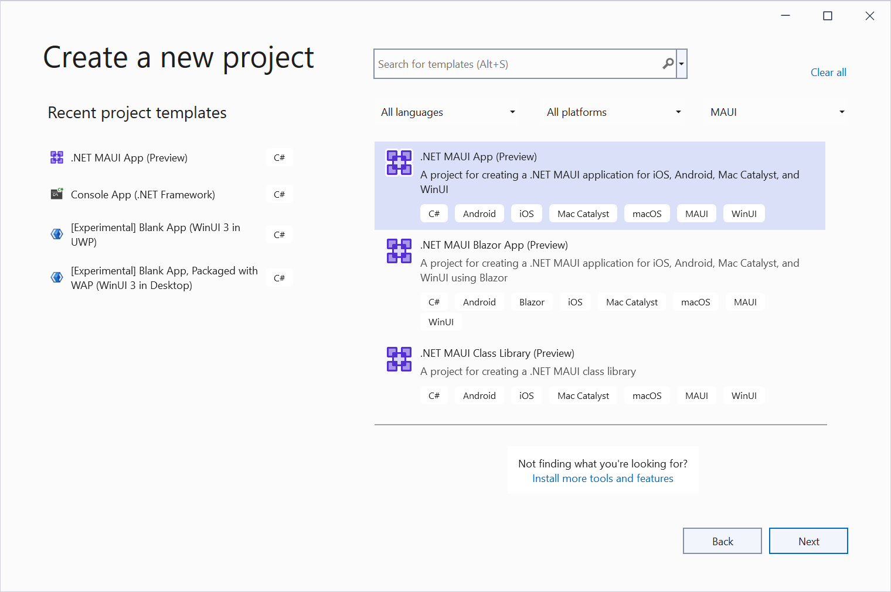
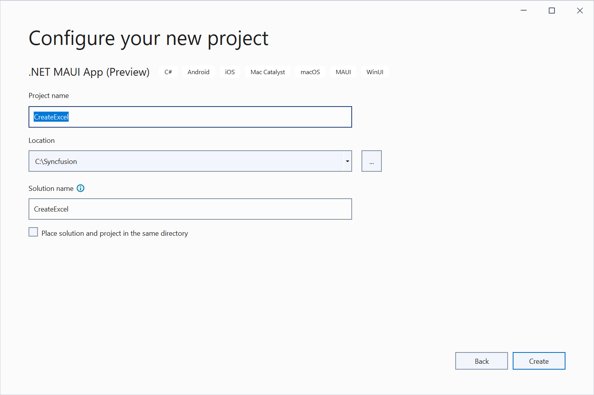
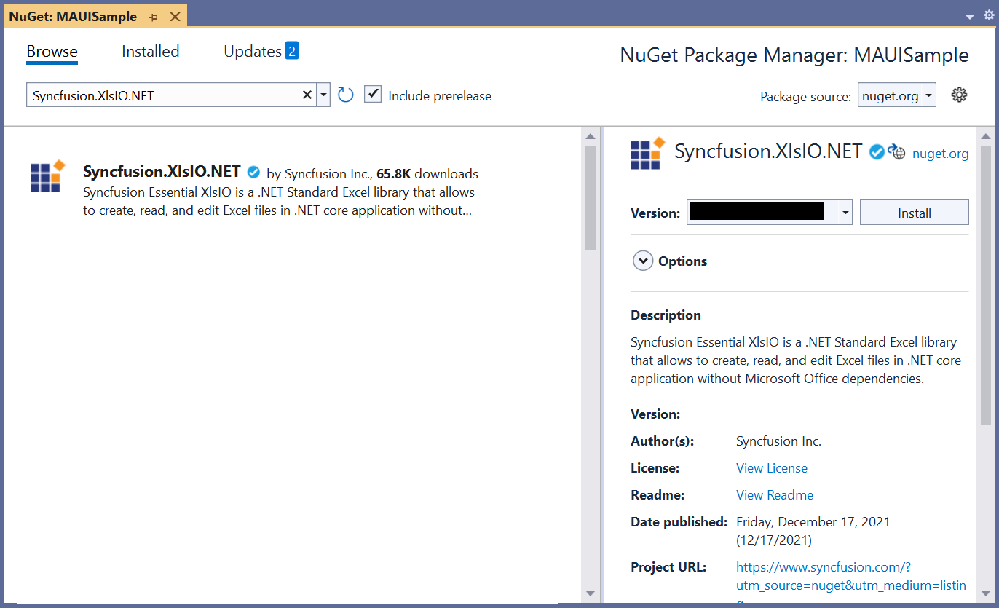
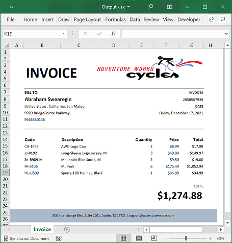

# Create, read, and edit Excel files in .NET MAUI

Syncfusion Excel library for .NET MAUI platform can be used to create, read, edit Excel files. This also convert Excel files to PDF. Syncfusion Excel library is compatible with .NET MAUI Windows, iOS, and Android platforms only.

**Prerequisites:**

To use the MAUI project templates, install the Mobile development with .NET extension for Visual Studio. For more details, refer [here](https://docs.microsoft.com/en-us/dotnet/maui/get-started/installation).

## Create a simple Excel report

The below steps illustrates creating a simple Invoice formatted Excel document in .NET MAUI.

1. Create a new project in VS2022, select the .NET MAUI App (Preview) template, and click the **Next** button.

2. Enter the project name and click **Create**.

3. Install the [Syncfusion.XlsIO.NET](https://www.nuget.org/packages/Syncfusion.XlsIO.NET/) NuGet package as reference to your .NET MAUI application from [NuGet.org](https://www.nuget.org).

4. Add a new button to the **MainWindow.xaml** as shown below.



<ContentPage xmlns="http://schemas.microsoft.com/dotnet/2021/maui"
       xmlns:x="http://schemas.microsoft.com/winfx/2009/xaml"
       x:Class="MAUISample.MainPage"
       BackgroundColor="{DynamicResource SecondaryColor}">
   <ScrollView>  
     <Button 
        Text="Create Excel"
        FontAttributes="Bold"
        Grid.Row="3"
        Clicked="createExcel_Click"
        HorizontalOptions="Center" 
        VerticalOptions="Center"/>
    </ScrollView>
</ContentPage>



{{ codesnippet1 | OrderList_Indent_Level_1 }}

5. Include the following namespaces in the **MainWindow.xaml.cs** file.

  

using Syncfusion.XlsIO;
using System.IO;
using System.Reflection;

 

{{ codesnippet2 | OrderList_Indent_Level_1 }}

6. Add a new action method **createExcel_Click** in MainWindow.xaml.cs and include the below code snippet to **create an Excel document**.

  

//Create an instance of ExcelEngine.
using (ExcelEngine excelEngine = new ExcelEngine())
{
  IApplication application = excelEngine.Excel;
  application.DefaultVersion = ExcelVersion.Xlsx;

  //Create a workbook with a worksheet
  IWorkbook workbook = application.Workbooks.Create(1);

  //Access first worksheet from the workbook instance.
  IWorksheet worksheet = workbook.Worksheets[0];

  Assembly executingAssembly = typeof(App).GetTypeInfo().Assembly;
  Stream inputStream = executingAssembly.GetManifestResourceStream("MAUISample.AdventureCycles-Logo.png");

  //Add a picture
  IPictureShape shape = worksheet.Pictures.AddPicture(1, 1, inputStream, 20, 20);

  //Disable gridlines in the worksheet
  worksheet.IsGridLinesVisible = false;

  //Enter values to the cells from A3 to A5
  worksheet.Range["A3"].Text = "46036 Michigan Ave";
  worksheet.Range["A4"].Text = "Canton, USA";
  worksheet.Range["A5"].Text = "Phone: +1 231-231-2310";

  //Make the text bold
  worksheet.Range["A3:A5"].CellStyle.Font.Bold = true;

  //Merge cells
  worksheet.Range["D1:E1"].Merge();

  //Enter text to the cell D1 and apply formatting.
  worksheet.Range["D1"].Text = "INVOICE";
  worksheet.Range["D1"].CellStyle.Font.Bold = true;
  worksheet.Range["D1"].CellStyle.Font.RGBColor = Syncfusion.Drawing.Color.FromArgb(0, 42, 118, 189);
  worksheet.Range["D1"].CellStyle.Font.Size = 35;

  //Apply alignment in the cell D1
  worksheet.Range["D1"].CellStyle.HorizontalAlignment = ExcelHAlign.HAlignRight;
  worksheet.Range["D1"].CellStyle.VerticalAlignment = ExcelVAlign.VAlignTop;

  //Enter values to the cells from D5 to E8
  worksheet.Range["D5"].Text = "INVOICE#";
  worksheet.Range["E5"].Text = "DATE";
  worksheet.Range["D6"].Number = 1028;
  worksheet.Range["E6"].Value = "12/31/2018";
  worksheet.Range["D7"].Text = "CUSTOMER ID";
  worksheet.Range["E7"].Text = "TERMS";
  worksheet.Range["D8"].Number = 564;
  worksheet.Range["E8"].Text = "Due Upon Receipt";

  //Apply RGB backcolor to the cells from D5 to E8
  worksheet.Range["D5:E5"].CellStyle.Color = Syncfusion.Drawing.Color.FromArgb(0, 42, 118, 189);
  worksheet.Range["D7:E7"].CellStyle.Color = Syncfusion.Drawing.Color.FromArgb(0, 42, 118, 189);

  //Apply known colors to the text in cells D5 to E8
  worksheet.Range["D5:E5"].CellStyle.Font.Color = ExcelKnownColors.White;
  worksheet.Range["D7:E7"].CellStyle.Font.Color = ExcelKnownColors.White;

  //Make the text as bold from D5 to E8
  worksheet.Range["D5:E8"].CellStyle.Font.Bold = true;

  //Apply alignment to the cells from D5 to E8
  worksheet.Range["D5:E8"].CellStyle.HorizontalAlignment = ExcelHAlign.HAlignCenter;
  worksheet.Range["D5:E5"].CellStyle.VerticalAlignment = ExcelVAlign.VAlignCenter;
  worksheet.Range["D7:E7"].CellStyle.VerticalAlignment = ExcelVAlign.VAlignCenter;
  worksheet.Range["D6:E6"].CellStyle.VerticalAlignment = ExcelVAlign.VAlignTop;

  //Enter value and applying formatting in the cell A7
  worksheet.Range["A7"].Text = "  BILL TO";
  worksheet.Range["A7"].CellStyle.Color = Syncfusion.Drawing.Color.FromArgb(0, 42, 118, 189);
  worksheet.Range["A7"].CellStyle.Font.Bold = true;
  worksheet.Range["A7"].CellStyle.Font.Color = ExcelKnownColors.White;

  //Apply alignment
  worksheet.Range["A7"].CellStyle.HorizontalAlignment = ExcelHAlign.HAlignLeft;
  worksheet.Range["A7"].CellStyle.VerticalAlignment = ExcelVAlign.VAlignCenter;

  //Enter values in the cells A8 to A12
  worksheet.Range["A8"].Text = "Steyn";
  worksheet.Range["A9"].Text = "Great Lakes Food Market";
  worksheet.Range["A10"].Text = "20 Whitehall Rd";
  worksheet.Range["A11"].Text = "North Muskegon,USA";
  worksheet.Range["A12"].Text = "+1 231-654-0000";

  //Create a Hyperlink for e-mail in the cell A13
  IHyperLink hyperlink = worksheet.HyperLinks.Add(worksheet.Range["A13"]);
  hyperlink.Type = ExcelHyperLinkType.Url;
  hyperlink.Address = "Steyn@greatlakes.com";
  hyperlink.ScreenTip = "Send Mail";

  //Enter details of products and prices
  worksheet.Range["A15"].Text = "  DESCRIPTION";
  worksheet.Range["C15"].Text = "QTY";
  worksheet.Range["D15"].Text = "UNIT PRICE";
  worksheet.Range["E15"].Text = "AMOUNT";
  worksheet.Range["A16"].Text = "Cabrales Cheese";
  worksheet.Range["A17"].Text = "Chocos";
  worksheet.Range["A18"].Text = "Pasta";
  worksheet.Range["A19"].Text = "Cereals";
  worksheet.Range["A20"].Text = "Ice Cream";
  worksheet.Range["C16"].Number = 3;
  worksheet.Range["C17"].Number = 2;
  worksheet.Range["C18"].Number = 1;
  worksheet.Range["C19"].Number = 4;
  worksheet.Range["C20"].Number = 3;
  worksheet.Range["D16"].Number = 21;
  worksheet.Range["D17"].Number = 54;
  worksheet.Range["D18"].Number = 10;
  worksheet.Range["D19"].Number = 20;
  worksheet.Range["D20"].Number = 30;
  worksheet.Range["D23"].Text = "Total";

  //Apply number format
  worksheet.Range["D16:E22"].NumberFormat = "$.00";
  worksheet.Range["E23"].NumberFormat = "$.00";

  //Merge column A and B from row 15 to 22
  worksheet.Range["A15:B15"].Merge();
  worksheet.Range["A16:B16"].Merge();
  worksheet.Range["A17:B17"].Merge();
  worksheet.Range["A18:B18"].Merge();
  worksheet.Range["A19:B19"].Merge();
  worksheet.Range["A20:B20"].Merge();
  worksheet.Range["A21:B21"].Merge();
  worksheet.Range["A22:B22"].Merge();

  //Apply incremental formula for column Amount by multiplying Qty and UnitPrice
  application.EnableIncrementalFormula = true;
  worksheet.Range["E16:E20"].Formula = "=C16*D16";

  //Formula for Sum the total
  worksheet.Range["E23"].Formula = "=SUM(E16:E22)";

  //Apply borders
  worksheet.Range["A16:E22"].CellStyle.Borders[ExcelBordersIndex.EdgeTop].LineStyle = ExcelLineStyle.Thin;
  worksheet.Range["A16:E22"].CellStyle.Borders[ExcelBordersIndex.EdgeBottom].LineStyle = ExcelLineStyle.Thin;
  worksheet.Range["A16:E22"].CellStyle.Borders[ExcelBordersIndex.EdgeTop].Color = ExcelKnownColors.Grey_25_percent;
  worksheet.Range["A16:E22"].CellStyle.Borders[ExcelBordersIndex.EdgeBottom].Color = ExcelKnownColors.Grey_25_percent;
  worksheet.Range["A23:E23"].CellStyle.Borders[ExcelBordersIndex.EdgeTop].LineStyle = ExcelLineStyle.Thin;
  worksheet.Range["A23:E23"].CellStyle.Borders[ExcelBordersIndex.EdgeBottom].LineStyle = ExcelLineStyle.Thin;
  worksheet.Range["A23:E23"].CellStyle.Borders[ExcelBordersIndex.EdgeTop].Color = ExcelKnownColors.Black;
  worksheet.Range["A23:E23"].CellStyle.Borders[ExcelBordersIndex.EdgeBottom].Color = ExcelKnownColors.Black;

  //Apply font setting for cells with product details
  worksheet.Range["A3:E23"].CellStyle.Font.FontName = "Arial";
  worksheet.Range["A3:E23"].CellStyle.Font.Size = 10;
  worksheet.Range["A15:E15"].CellStyle.Font.Color = ExcelKnownColors.White;
  worksheet.Range["A15:E15"].CellStyle.Font.Bold = true;
  worksheet.Range["D23:E23"].CellStyle.Font.Bold = true;

  //Apply cell color
  worksheet.Range["A15:E15"].CellStyle.Color = Syncfusion.Drawing.Color.FromArgb(0, 42, 118, 189);

  //Apply alignment to cells with product details
  worksheet.Range["A15"].CellStyle.HorizontalAlignment = ExcelHAlign.HAlignLeft;
  worksheet.Range["C15:C22"].CellStyle.HorizontalAlignment = ExcelHAlign.HAlignCenter;
  worksheet.Range["D15:E15"].CellStyle.HorizontalAlignment = ExcelHAlign.HAlignCenter;

  //Apply row height and column width to look good
  worksheet.Range["A1"].ColumnWidth = 36;
  worksheet.Range["B1"].ColumnWidth = 11;
  worksheet.Range["C1"].ColumnWidth = 8;
  worksheet.Range["D1:E1"].ColumnWidth = 18;
  worksheet.Range["A1"].RowHeight = 47;
  worksheet.Range["A2"].RowHeight = 15;
  worksheet.Range["A3:A4"].RowHeight = 15;
  worksheet.Range["A5"].RowHeight = 18;
  worksheet.Range["A6"].RowHeight = 29;
  worksheet.Range["A7"].RowHeight = 18;
  worksheet.Range["A8"].RowHeight = 15;
  worksheet.Range["A9:A14"].RowHeight = 15;
  worksheet.Range["A15:A23"].RowHeight = 18;

  MemoryStream ms = new MemoryStream();
  workbook.SaveAs(ms);
  ms.Position = 0;

  //Saves the memory stream as a file.
  SaveService saveService = new SaveService();
  saveService.SaveAndView("Output.xlsx", "application/vnd.openxmlformats-officedocument.spreadsheetml.sheet", ms);
}

 

{{ codesnippet3 | OrderList_Indent_Level_1 }} 

## Save Service class in portable project

Add the new class file with name as **SaveService** to the **Project** and add below code in it. This is the helper class used to save and view the Excel file in windows, android, iOS and MAC devices.



namespace MAUISample.Services
{
  public partial class SaveService
  {
    //Method to save document as a file and view the saved document.
    public partial void SaveAndView(string filename, string contentType, MemoryStream stream);
  }
}



## Save and View the Excel document in windows

Add the new class file with name **SaveWindows** file under **Project-> Platforms-> Windows** directory to save and view the Excel document in the windows machine and use the below code in it.



using Windows.Storage;
using Windows.Storage.Pickers;
using Windows.Storage.Streams;
using Windows.UI.Popups;

namespace MAUISample.Services
{
  public partial class SaveService
  {
    public async partial void SaveAndView(string filename, string contentType, MemoryStream stream)
    {
      StorageFile stFile;
      string extension = Path.GetExtension(filename);
      //Gets process windows handle to open the dialog in application process. 
      IntPtr windowHandle = System.Diagnostics.Process.GetCurrentProcess().MainWindowHandle;
      if (!Windows.Foundation.Metadata.ApiInformation.IsTypePresent("Windows.Phone.UI.Input.HardwareButtons"))
      {
        //Creates file save picker to save a file. 
        FileSavePicker savePicker = new();
        savePicker.DefaultFileExtension = ".xlsx";
        savePicker.SuggestedFileName = filename;
        //Saves the file as xlsx file.
        savePicker.FileTypeChoices.Add("XLSX", new List<string>() { ".xlsx" });
        WinRT.Interop.InitializeWithWindow.Initialize(savePicker, windowHandle);
        stFile = await savePicker.PickSaveFileAsync();
      }
      else
      {
        StorageFolder local = ApplicationData.Current.LocalFolder;
        stFile = await local.CreateFileAsync(filename, CreationCollisionOption.ReplaceExisting);
      }
      if (stFile != null)
      {
        using (IRandomAccessStream zipStream = await stFile.OpenAsync(FileAccessMode.ReadWrite))
        {
          //Writes compressed data from memory to file.
          using Stream outstream = zipStream.AsStreamForWrite();
          outstream.SetLength(0);
          //Saves the stream as file.
          byte[] buffer = stream.ToArray();
          outstream.Write(buffer, 0, buffer.Length);
          outstream.Flush();
        }
        //Create message dialog box. 
        MessageDialog msgDialog = new("Do you want to view the document?", "File has been created successfully");
        UICommand yesCmd = new("Yes");
        msgDialog.Commands.Add(yesCmd);
        UICommand noCmd = new("No");
        msgDialog.Commands.Add(noCmd);

        WinRT.Interop.InitializeWithWindow.Initialize(msgDialog, windowHandle);

        //Showing a dialog box. 
        IUICommand cmd = await msgDialog.ShowAsync();
        if (cmd.Label == yesCmd.Label)
        {
          //Launch the saved file. 
          await Windows.System.Launcher.LaunchFileAsync(stFile);
        }
      }
    }
  }
}



## Save and View the Excel document in Android

Add the new class file with name **SaveAndroid** file under **Project-> Platforms-> Android** directory to save and view the Excel document in the Android Device and use the below code in it.



using Android.Content;
using Android.OS;
using Java.IO;
using System;
using System.IO;
using System.Threading.Tasks;

namespace MAUISample.Services
{
  public partial class SaveService
  {
    public partial void SaveAndView(string filename, string contentType, MemoryStream stream)
    {
      string exception = string.Empty;
      string? root = null;

      if (Android.OS.Environment.IsExternalStorageEmulated)
      {
        root = Android.App.Application.Context!.GetExternalFilesDir(Android.OS.Environment.DirectoryDownloads)!.AbsolutePath;
      }
      else
        root = System.Environment.GetFolderPath(System.Environment.SpecialFolder.MyDocuments);

      Java.IO.File myDir = new(root + "/Syncfusion");
      myDir.Mkdir();
      Java.IO.File file = new(myDir, filename);

      if (file.Exists())
      {
        file.Delete();
      }

      try
      {
        FileOutputStream outs = new(file);
        outs.Write(stream.ToArray());

        outs.Flush();
        outs.Close();
      }
      catch (Exception e)
      {
        exception = e.ToString();
      }
      if (file.Exists())
      {
        if (Build.VERSION.SdkInt >= Android.OS.BuildVersionCodes.N)
        {
          var fileUri = AndroidX.Core.Content.FileProvider.GetUriForFile(Android.App.Application.Context, Android.App.Application.Context.PackageName + ".provider", file);
          var intent = new Intent(Intent.ActionView);
          intent.SetData(fileUri);
          intent.AddFlags(ActivityFlags.NewTask);
          intent.AddFlags(ActivityFlags.GrantReadUriPermission);
          Android.App.Application.Context.StartActivity(intent);
        }
        else
        {
          var fileUri = Android.Net.Uri.Parse(file.AbsolutePath);
          var intent = new Intent(Intent.ActionView);
          intent.SetDataAndType(fileUri, contentType);
          intent = Intent.CreateChooser(intent, "Open File");
          intent!.AddFlags(ActivityFlags.NewTask);
          Android.App.Application.Context.StartActivity(intent);
        }
      }
    }
  }
}



N> Introduced a new runtime permission model for the Android SDK version 23 and above. So, include the following code for enabling the Android file provider to save and view the generated PDF document.

Create a new XML file with the name of **provider_path.xml** under the **Resources-> xml** folder of **Android project** and add the following code in it. Eg: Resources/xml/provider_path.xml



<?xml version="1.0" encoding="UTF-8" ?>
<paths xmlns:android="http://schemas.android.com/apk/res/android">
   <external-path name="external_files" path="."/>
</paths>



Add the following code to the **AndroidManifest.xml** file located under **Properties** folder.



<?xml version="1.0" encoding="utf-8"?>
<manifest xmlns:android="http://schemas.android.com/apk/res/android" android:versionCode="1" android:versionName="1.0" package="com.companyname.MAUISample">
   <uses-sdk android:minSdkVersion="19" android:targetSdkVersion="27" />
   <application android:label="MAUISample.Android">
      <provider android:name="androidx.core.content.FileProvider"
         android:authorities="${applicationId}.provider"
         android:exported="false"
         android:grantUriPermissions="true">
         <meta-data android:name="android.support.FILE_PROVIDER_PATHS"
            android:resource="@xml/provider_paths" />
      </provider>
   </application>
</manifest>



## Save and View the Excel document in iOS

Add the new class file with name **SaveIOS** file under **Project-> Platforms-> iOS** directory to save and view the Excel document in the iOS Device and use the below code in it.



using QuickLook;
using UIKit;

namespace MAUISample.Services
{
  public partial class SaveService
  {
    public partial void SaveAndView(string filename, string contentType, MemoryStream stream)
    {
      string exception = string.Empty;
      string path = Environment.GetFolderPath(Environment.SpecialFolder.Personal);
      string filePath = Path.Combine(path, filename);
      try
      {
        FileStream fileStream = File.Open(filePath, FileMode.Create);
        stream.Position = 0;
        stream.CopyTo(fileStream);
        fileStream.Flush();
        fileStream.Close();
      }
      catch (Exception e)
      {
        exception = e.ToString();
      }
      if (contentType != "application/html" || exception == string.Empty)
      {
#pragma warning disable CA1416 
        UIViewController? currentController = UIApplication.SharedApplication!.KeyWindow!.RootViewController;
#pragma warning restore CA1416 
        while (currentController!.PresentedViewController != null)
          currentController = currentController.PresentedViewController;

        QLPreviewController qlPreview = new();
        QLPreviewItem item = new QLPreviewItemBundle(filename, filePath);
        qlPreview.DataSource = new PreviewControllerDS(item);
        currentController.PresentViewController((UIViewController)qlPreview, true, null);
      }
    }
  }
}



## Save and View the Excel document in MacCatalyst

Add the new class file with name **SaveMAC** file under **Project-> Platforms-> MacCatalyst** directory to save and view the Excel document in the MAC Device and use the below code in it.



using Foundation;
using QuickLook;
using UIKit;

namespace MAUISample.Services
{
  public partial class SaveService
  {
    public partial void SaveAndView(string filename, string contentType, MemoryStream stream)
    {
      string path = Environment.GetFolderPath(Environment.SpecialFolder.MyDocuments);
      string filePath = Path.Combine(path, filename);
      stream.Position = 0;
      //Saves the document
      using FileStream fileStream = new(filePath, FileMode.Create, FileAccess.ReadWrite);
      stream.CopyTo(fileStream);
      fileStream.Flush();
      fileStream.Dispose();
#pragma warning disable CA1416 
      //Launch the file
      UIViewController? currentController = UIApplication.SharedApplication!.KeyWindow!.RootViewController;
#pragma warning restore CA1416 
      while (currentController!.PresentedViewController != null)
        currentController = currentController.PresentedViewController;
      UIView? currentView = currentController.View;

      QLPreviewController qlPreview = new();
      QLPreviewItem item = new QLPreviewItemBundle(filename, filePath);
      qlPreview.DataSource = new PreviewControllerDS(item);
      currentController.PresentViewController((UIViewController)qlPreview, true, null);
    }
  }
}

public class QLPreviewItemFileSystem : QLPreviewItem
{
  readonly string _fileName, _filePath;

  public QLPreviewItemFileSystem(string fileName, string filePath)
  {
    _fileName = fileName;
    _filePath = filePath;
  }

  public override string PreviewItemTitle
  {
    get
    {
      return _fileName;
    }
  }
  public override NSUrl PreviewItemUrl
  {
    get
    {
      return NSUrl.FromFilename(_filePath);
    }
  }
}

public class QLPreviewItemBundle : QLPreviewItem
{
  readonly string _fileName, _filePath;
  public QLPreviewItemBundle(string fileName, string filePath)
  {
    _fileName = fileName;
    _filePath = filePath;
  }

  public override string PreviewItemTitle
  {
    get
    {
      return _fileName;
    }
  }
  public override NSUrl PreviewItemUrl
  {
    get
    {
      var documents = NSBundle.MainBundle.BundlePath;
      var lib = Path.Combine(documents, _filePath);
      var url = NSUrl.FromFilename(lib);
      return url;
    }
  }
}

public class PreviewControllerDS : QLPreviewControllerDataSource
{
  private readonly QLPreviewItem _item;

  public PreviewControllerDS(QLPreviewItem item)
  {
    _item = item;
  }

  public override nint PreviewItemCount(QLPreviewController controller)
  {
    return (nint)1;
  }

  public override IQLPreviewItem GetPreviewItem(QLPreviewController controller, nint index)
  {
    return _item;
  }
}



A complete working example of creating an Excel document in the .NET MAUI application in C# is present on [this GitHub page](https://github.com/SyncfusionExamples/XlsIO-Examples/tree/master/Getting%20Started/.NET%20MAUI/Create%20Excel).

By executing the program in windows, you will get the **Excel document** as follows.

## Read and Edit Excel file

The below code snippet illustrates how to read and edit an Excel file in .NET MAUI.



//Create an instance of ExcelEngine.
using (ExcelEngine excelEngine = new ExcelEngine())
{
  IApplication application = excelEngine.Excel;
  application.DefaultVersion = ExcelVersion.Xlsx;

  Assembly executingAssembly = typeof(App).GetTypeInfo().Assembly;
  Stream inputStream = executingAssembly.GetManifestResourceStream("MAUISample.Sample.xlsx");

  //Create a workbook with a worksheet
  IWorkbook workbook = application.Workbooks.Open(inputStream);

  //Access first worksheet from the workbook instance.
  IWorksheet worksheet = workbook.Worksheets[0];

  //Set Text in cell A3.
  worksheet.Range["A3"].Text = "Hello World";

  //Access a cell value from Excel
  var value = worksheet.Range["A1"].Value;

  MemoryStream ms = new MemoryStream();
  workbook.SaveAs(ms);
  ms.Position = 0;
	
  //Saves the memory stream as a file.
  DependencyService.Get<ISave>().SaveAndView("Invoice.xlsx", "application/excel", ms);
}



A complete working example of how to read and edit an Excel file in the .NET MAUI application in C# is present on [this GitHub page](https://github.com/SyncfusionExamples/XlsIO-Examples/tree/master/Getting%20Started/.NET%20MAUI/Edit%20Excel).

N> Starting with v16.2.0.x, if you reference Syncfusion assemblies from trial setup or from the NuGet feed, you also have to add "Syncfusion.Licensing" assembly reference and include a license key in your projects. Please refer to this [link](https://help.syncfusion.com/common/essential-studio/licensing/license-key) to know about registering Syncfusion license key in your applications to use our components. You can also explore our [MAUI Excel Library](https://www.syncfusion.com/document-processing/excel-framework/maui) Feature Tour page and [MAUI Excel library demo](https://www.syncfusion.com/demos/fileformats/excel-library) that shows how to create and modify Excel files from C# with just five lines of code.
