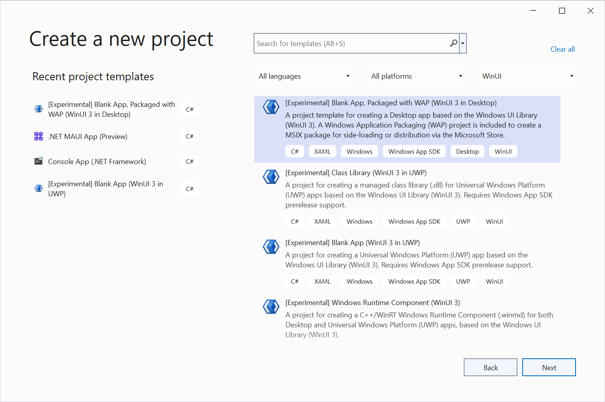
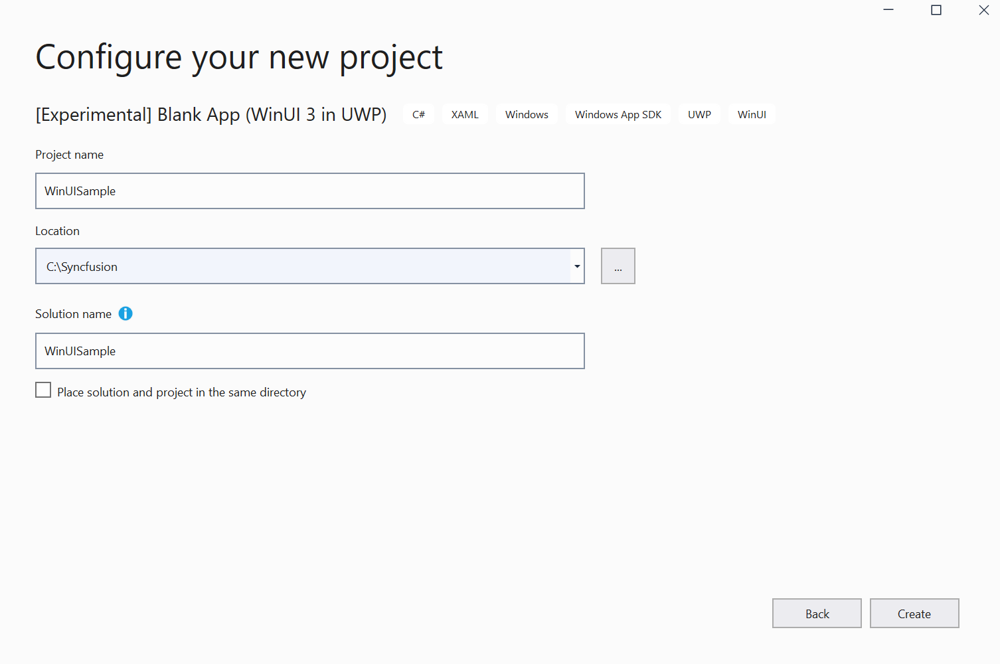
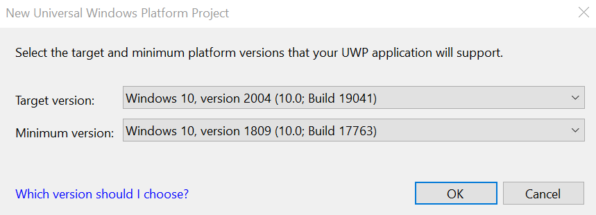
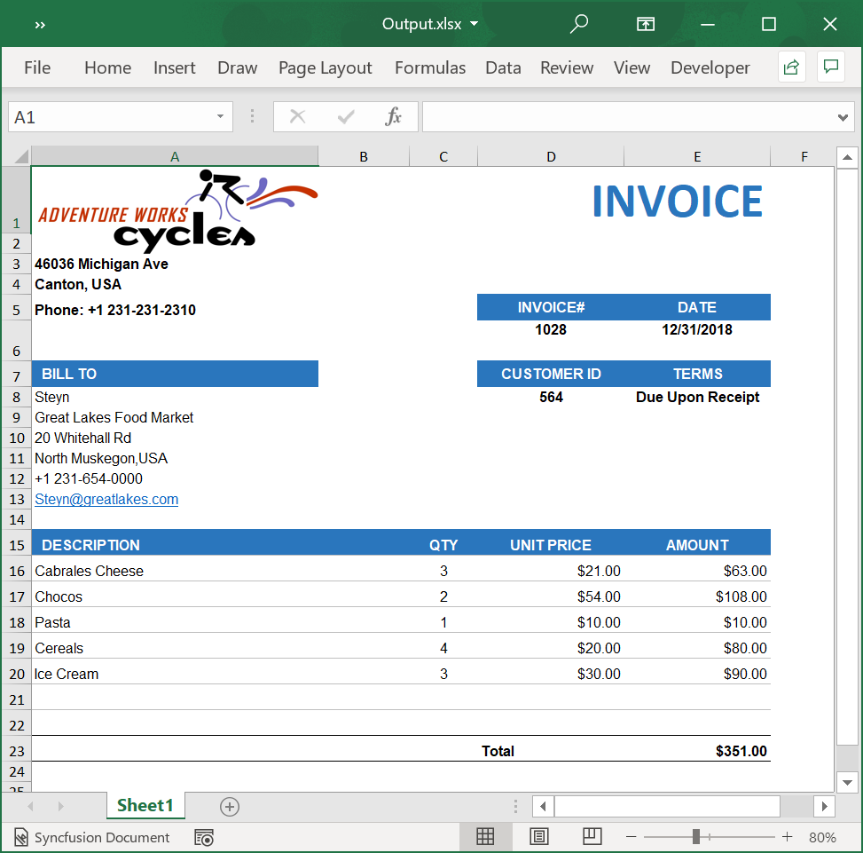

# Create, read, and edit Excel files in WinUI

Syncfusion Excel library for WinUI platform can be used to create, read, edit Excel files. This also convert Excel files to PDF.

## Create a simple Excel report

The below steps illustrates creating a simple Invoice formatted Excel document in WinUI.

1.Create a new C# Blank App (WinUI 3 in UWP) Application project.

2.Name the project.

3.Select the target and minimum platform versions.

4.Install the [Syncfusion.XlsIO.Net.Core](https://www.nuget.org/packages/Syncfusion.XlsIO.Net.Core) NuGet package as reference to your WinUI application from [NuGet.org](https://www.nuget.org).

5.Include the following namespaces in MainPage.xaml.cs file.

  

using Windows.Storage;
using Windows.Storage.Pickers;
using Windows.Storage.Streams;
using System.Reflection;
using Syncfusion.XlsIO;

 

6.Include the below code snippet in button click event to create an Excel file and download it.

  

//Create an instance of ExcelEngine.
using (ExcelEngine excelEngine = new ExcelEngine())
{
    IApplication application = excelEngine.Excel;

    application.DefaultVersion = ExcelVersion.Excel2016;

    //Create a workbook with a worksheet
    IWorkbook workbook = application.Workbooks.Create(1);

    //Access first worksheet from the workbook instance.
    IWorksheet worksheet = workbook.Worksheets[0];

    Assembly executingAssembly = typeof(App).GetTypeInfo().Assembly;
    Stream inputStream = executingAssembly.GetManifestResourceStream("WinUISample.AdventureCycles-Logo.png");

    //Add a picture
    IPictureShape shape = worksheet.Pictures.AddPicture(1, 1, inputStream);

    //Disable gridlines in the worksheet
    worksheet.IsGridLinesVisible = false;

    //Enter values to the cells from A3 to A5
    worksheet.Range["A3"].Text = "46036 Michigan Ave";
    worksheet.Range["A4"].Text = "Canton, USA";
    worksheet.Range["A5"].Text = "Phone: +1 231-231-2310";

    //Make the text bold
    worksheet.Range["A3:A5"].CellStyle.Font.Bold = true;

    //Merge cells
    worksheet.Range["D1:E1"].Merge();

    //Enter text to the cell D1 and apply formatting.
    worksheet.Range["D1"].Text = "INVOICE";
    worksheet.Range["D1"].CellStyle.Font.Bold = true;
    worksheet.Range["D1"].CellStyle.Font.RGBColor = Syncfusion.Drawing.Color.FromArgb(0, 42, 118, 189);
    worksheet.Range["D1"].CellStyle.Font.Size = 35;

    //Apply alignment in the cell D1
    worksheet.Range["D1"].CellStyle.HorizontalAlignment = ExcelHAlign.HAlignRight;
    worksheet.Range["D1"].CellStyle.VerticalAlignment = ExcelVAlign.VAlignTop;

    //Enter values to the cells from D5 to E8
    worksheet.Range["D5"].Text = "INVOICE#";
    worksheet.Range["E5"].Text = "DATE";
    worksheet.Range["D6"].Number = 1028;
    worksheet.Range["E6"].Value = "12/31/2018";
    worksheet.Range["D7"].Text = "CUSTOMER ID";
    worksheet.Range["E7"].Text = "TERMS";
    worksheet.Range["D8"].Number = 564;
    worksheet.Range["E8"].Text = "Due Upon Receipt";

    //Apply RGB backcolor to the cells from D5 to E8
    worksheet.Range["D5:E5"].CellStyle.Color = Syncfusion.Drawing.Color.FromArgb(0, 42, 118, 189);
    worksheet.Range["D7:E7"].CellStyle.Color = Syncfusion.Drawing.Color.FromArgb(0, 42, 118, 189);

    //Apply known colors to the text in cells D5 to E8
    worksheet.Range["D5:E5"].CellStyle.Font.Color = ExcelKnownColors.White;
    worksheet.Range["D7:E7"].CellStyle.Font.Color = ExcelKnownColors.White;

    //Make the text as bold from D5 to E8
    worksheet.Range["D5:E8"].CellStyle.Font.Bold = true;

    //Apply alignment to the cells from D5 to E8
    worksheet.Range["D5:E8"].CellStyle.HorizontalAlignment = ExcelHAlign.HAlignCenter;
    worksheet.Range["D5:E5"].CellStyle.VerticalAlignment = ExcelVAlign.VAlignCenter;
    worksheet.Range["D7:E7"].CellStyle.VerticalAlignment = ExcelVAlign.VAlignCenter;
    worksheet.Range["D6:E6"].CellStyle.VerticalAlignment = ExcelVAlign.VAlignTop;

    //Enter value and applying formatting in the cell A7
    worksheet.Range["A7"].Text = "  BILL TO";
    worksheet.Range["A7"].CellStyle.Color = Syncfusion.Drawing.Color.FromArgb(0, 42, 118, 189);
    worksheet.Range["A7"].CellStyle.Font.Bold = true;
    worksheet.Range["A7"].CellStyle.Font.Color = ExcelKnownColors.White;

    //Apply alignment
    worksheet.Range["A7"].CellStyle.HorizontalAlignment = ExcelHAlign.HAlignLeft;
    worksheet.Range["A7"].CellStyle.VerticalAlignment = ExcelVAlign.VAlignCenter;

    //Enter values in the cells A8 to A12
    worksheet.Range["A8"].Text = "Steyn";
    worksheet.Range["A9"].Text = "Great Lakes Food Market";
    worksheet.Range["A10"].Text = "20 Whitehall Rd";
    worksheet.Range["A11"].Text = "North Muskegon,USA";
    worksheet.Range["A12"].Text = "+1 231-654-0000";

    //Create a Hyperlink for e-mail in the cell A13
    IHyperLink hyperlink = worksheet.HyperLinks.Add(worksheet.Range["A13"]);
    hyperlink.Type = ExcelHyperLinkType.Url;
    hyperlink.Address = "Steyn@greatlakes.com";
    hyperlink.ScreenTip = "Send Mail";

    //Enter details of products and prices
    worksheet.Range["A15"].Text = "  DESCRIPTION";
    worksheet.Range["C15"].Text = "QTY";
    worksheet.Range["D15"].Text = "UNIT PRICE";
    worksheet.Range["E15"].Text = "AMOUNT";
    worksheet.Range["A16"].Text = "Cabrales Cheese";
    worksheet.Range["A17"].Text = "Chocos";
    worksheet.Range["A18"].Text = "Pasta";
    worksheet.Range["A19"].Text = "Cereals";
    worksheet.Range["A20"].Text = "Ice Cream";
    worksheet.Range["C16"].Number = 3;
    worksheet.Range["C17"].Number = 2;
    worksheet.Range["C18"].Number = 1;
    worksheet.Range["C19"].Number = 4;
    worksheet.Range["C20"].Number = 3;
    worksheet.Range["D16"].Number = 21;
    worksheet.Range["D17"].Number = 54;
    worksheet.Range["D18"].Number = 10;
    worksheet.Range["D19"].Number = 20;
    worksheet.Range["D20"].Number = 30;
    worksheet.Range["D23"].Text = "Total";

    //Apply number format
    worksheet.Range["D16:E22"].NumberFormat = "$.00";
    worksheet.Range["E23"].NumberFormat = "$.00";

    //Merge column A and B from row 15 to 22
    worksheet.Range["A15:B15"].Merge();
    worksheet.Range["A16:B16"].Merge();
    worksheet.Range["A17:B17"].Merge();
    worksheet.Range["A18:B18"].Merge();
    worksheet.Range["A19:B19"].Merge();
    worksheet.Range["A20:B20"].Merge();
    worksheet.Range["A21:B21"].Merge();
    worksheet.Range["A22:B22"].Merge();

    //Apply incremental formula for column Amount by multiplying Qty and UnitPrice
    application.EnableIncrementalFormula = true;
    worksheet.Range["E16:E20"].Formula = "=C16*D16";

    //Formula for Sum the total
    worksheet.Range["E23"].Formula = "=SUM(E16:E22)";

    //Apply borders
    worksheet.Range["A16:E22"].CellStyle.Borders[ExcelBordersIndex.EdgeTop].LineStyle = ExcelLineStyle.Thin;
    worksheet.Range["A16:E22"].CellStyle.Borders[ExcelBordersIndex.EdgeBottom].LineStyle = ExcelLineStyle.Thin;
    worksheet.Range["A16:E22"].CellStyle.Borders[ExcelBordersIndex.EdgeTop].Color = ExcelKnownColors.Grey_25_percent;
    worksheet.Range["A16:E22"].CellStyle.Borders[ExcelBordersIndex.EdgeBottom].Color = ExcelKnownColors.Grey_25_percent;
    worksheet.Range["A23:E23"].CellStyle.Borders[ExcelBordersIndex.EdgeTop].LineStyle = ExcelLineStyle.Thin;
    worksheet.Range["A23:E23"].CellStyle.Borders[ExcelBordersIndex.EdgeBottom].LineStyle = ExcelLineStyle.Thin;
    worksheet.Range["A23:E23"].CellStyle.Borders[ExcelBordersIndex.EdgeTop].Color = ExcelKnownColors.Black;
    worksheet.Range["A23:E23"].CellStyle.Borders[ExcelBordersIndex.EdgeBottom].Color = ExcelKnownColors.Black;

    //Apply font setting for cells with product details
    worksheet.Range["A3:E23"].CellStyle.Font.FontName = "Arial";
    worksheet.Range["A3:E23"].CellStyle.Font.Size = 10;
    worksheet.Range["A15:E15"].CellStyle.Font.Color = ExcelKnownColors.White;
    worksheet.Range["A15:E15"].CellStyle.Font.Bold = true;
    worksheet.Range["D23:E23"].CellStyle.Font.Bold = true;

    //Apply cell color
    worksheet.Range["A15:E15"].CellStyle.Color = Syncfusion.Drawing.Color.FromArgb(0, 42, 118, 189);

    //Apply alignment to cells with product details
    worksheet.Range["A15"].CellStyle.HorizontalAlignment = ExcelHAlign.HAlignLeft;
    worksheet.Range["C15:C22"].CellStyle.HorizontalAlignment = ExcelHAlign.HAlignCenter;
    worksheet.Range["D15:E15"].CellStyle.HorizontalAlignment = ExcelHAlign.HAlignCenter;

    //Apply row height and column width to look good
    worksheet.Range["A1"].ColumnWidth = 36;
    worksheet.Range["B1"].ColumnWidth = 11;
    worksheet.Range["C1"].ColumnWidth = 8;
    worksheet.Range["D1:E1"].ColumnWidth = 18;
    worksheet.Range["A1"].RowHeight = 47;
    worksheet.Range["A2"].RowHeight = 15;
    worksheet.Range["A3:A4"].RowHeight = 15;
    worksheet.Range["A5"].RowHeight = 18;
    worksheet.Range["A6"].RowHeight = 29;
    worksheet.Range["A7"].RowHeight = 18;
    worksheet.Range["A8"].RowHeight = 15;
    worksheet.Range["A9:A14"].RowHeight = 15;
    worksheet.Range["A15:A23"].RowHeight = 18;

    MemoryStream stream = new MemoryStream();
    workbook.SaveAs(stream);
    Save(stream, "Output");
}

  

7.Include this below helper Save method in MainPage.xaml.cs file.



async void Save(MemoryStream stream, string filename)
{

    StorageFile stFile;
    if (!(Windows.Foundation.Metadata.ApiInformation.IsTypePresent("Windows.Phone.UI.Input.HardwareButtons")))
    {
        FileSavePicker savePicker = new FileSavePicker();
        savePicker.DefaultFileExtension = ".xlsx";
        savePicker.SuggestedFileName = filename;
        savePicker.FileTypeChoices.Add("Excel Documents", new List<string>() { ".xlsx" });
        stFile = await savePicker.PickSaveFileAsync();
    }
    else
    {
        StorageFolder local = Windows.Storage.ApplicationData.Current.LocalFolder;
        stFile = await local.CreateFileAsync(filename, CreationCollisionOption.ReplaceExisting);
    }
    if (stFile != null)
    {
        using (IRandomAccessStream zipStream = await stFile.OpenAsync(FileAccessMode.ReadWrite))
        {
            //Write compressed data from memory to file
            using (Stream outstream = zipStream.AsStreamForWrite())
            {
                byte[] buffer = stream.ToArray();
                outstream.Write(buffer, 0, buffer.Length);
                outstream.Flush();
            }
        }
    }
    //Launch the saved Excel file
    await Windows.System.Launcher.LaunchFileAsync(stFile);
}



A complete working example of how to create an Excel file in WinUI can be downloaded from [Create-Excel-file.zip](https://www.syncfusion.com/downloads/support/directtrac/general/ze/WinUISample-191739498.zip).

By executing the program, you will get the Excel file as below.

## Read and Edit Excel file

The below code snippet illustrates how to read and edit an Excel file in WinUI.



//Create an instance of ExcelEngine.
using (ExcelEngine excelEngine = new ExcelEngine())
{
    IApplication application = excelEngine.Excel;

    application.DefaultVersion = ExcelVersion.Excel2016;

    Assembly executingAssembly = typeof(App).GetTypeInfo().Assembly;
    Stream inputStream = executingAssembly.GetManifestResourceStream("WinUISample.Sample.xlsx");

    //Create a workbook with a worksheet
    IWorkbook workbook = application.Workbooks.Open(inputStream);

    //Access first worksheet from the workbook instance.
    IWorksheet worksheet = workbook.Worksheets[0];

    //Set Text in cell A3.
    worksheet.Range["A3"].Text = "Hello World";

    MemoryStream stream = new MemoryStream();
    workbook.SaveAs(stream);
    Save(stream, "Output");
}



N> Starting with v16.2.0.x, if you reference Syncfusion assemblies from trial setup or from the NuGet feed, you also have to add "Syncfusion.Licensing" assembly reference and include a license key in your projects. Please refer to this [link](https://help.syncfusion.com/common/essential-studio/licensing/license-key) to know about registering Syncfusion license key in your applications to use our components.
