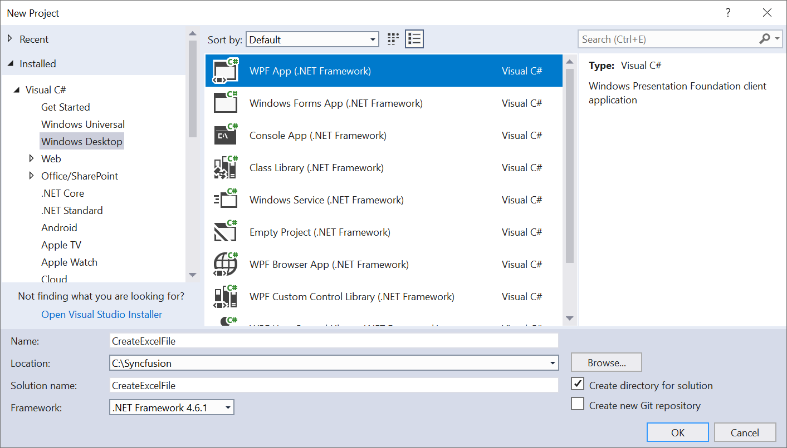
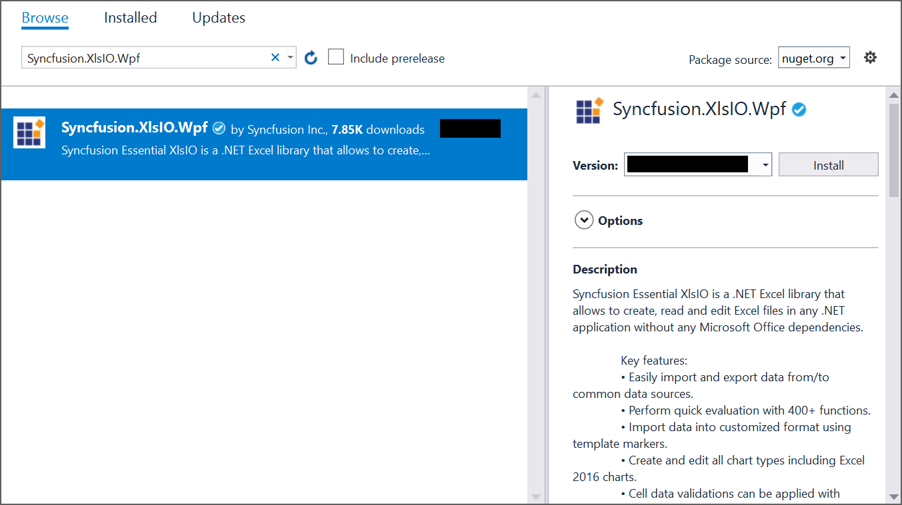

# Create, read, and edit Excel files in WPF

[Syncfusion Excel library for WPF platform](https://www.syncfusion.com/excel-framework/net/excel-library) can be used to create, read, edit Excel files. This also convert Excel files to PDF.

## Create a simple Excel report

The below steps illustrates creating a simple Invoice formatted Excel document in WPF.

1.Create a new C# WPF Application project.

2.Install the [Syncfusion.XlsIO.Wpf](https://www.nuget.org/packages/Syncfusion.XlsIO.Wpf) NuGet package as reference to your .NET Framework applications from [NuGet.org](https://www.nuget.org).

3.Include the following code snippet in Add a new button in MainWindow.xaml file to add a button for the creation of Excel document.



<Grid>
    <Button Content="Create Excel" HorizontalAlignment="Left" Margin="309,172,0,0" VerticalAlignment="Top" Width="124" Height="46" Click="Button_Click"/>
</Grid>



4.Include the following namespaces in MainWindow.xaml.cs file.

  

using Syncfusion.XlsIO;
using System.Drawing;
using System.IO;
using System.Windows;



Imports Syncfusion.XlsIO
Imports System.Drawing
Imports System.IO
Imports System.Windows



5.Include the following code snippet in btnCreate_Click, the click event of the button to create the Excel document.

  

//Create an instance of ExcelEngine
using (ExcelEngine excelEngine = new ExcelEngine())
{
    IApplication application = excelEngine.Excel;

    application.DefaultVersion = ExcelVersion.Excel2016;

    //Create a workbook
    IWorkbook workbook = application.Workbooks.Create(1);
    IWorksheet worksheet = workbook.Worksheets[0];

    //Adding a picture
    FileStream imageStream = new FileStream("AdventureCycles-Logo.png", FileMode.Open, FileAccess.Read);
    IPictureShape shape = worksheet.Pictures.AddPicture(1, 1, imageStream, 20, 20);

    //Disable gridlines in the worksheet
    worksheet.IsGridLinesVisible = false;

    //Enter values to the cells from A3 to A5
    worksheet.Range["A3"].Text = "46036 Michigan Ave";
    worksheet.Range["A4"].Text = "Canton, USA";
    worksheet.Range["A5"].Text = "Phone: +1 231-231-2310";

    //Make the text bold
    worksheet.Range["A3:A5"].CellStyle.Font.Bold = true;

    //Merge cells
    worksheet.Range["D1:E1"].Merge();

    //Enter text to the cell D1 and apply formatting.
    worksheet.Range["D1"].Text = "INVOICE";
    worksheet.Range["D1"].CellStyle.Font.Bold = true;
    worksheet.Range["D1"].CellStyle.Font.RGBColor = Color.FromArgb(42, 118, 189);
    worksheet.Range["D1"].CellStyle.Font.Size = 35;

    //Apply alignment in the cell D1
    worksheet.Range["D1"].CellStyle.HorizontalAlignment = ExcelHAlign.HAlignRight;
    worksheet.Range["D1"].CellStyle.VerticalAlignment = ExcelVAlign.VAlignTop;

    //Enter values to the cells from D5 to E8
    worksheet.Range["D5"].Text = "INVOICE#";
    worksheet.Range["E5"].Text = "DATE";
    worksheet.Range["D6"].Number = 1028;
    worksheet.Range["E6"].Value = "12/31/2018";
    worksheet.Range["D7"].Text = "CUSTOMER ID";
    worksheet.Range["E7"].Text = "TERMS";
    worksheet.Range["D8"].Number = 564;
    worksheet.Range["E8"].Text = "Due Upon Receipt";

    //Apply RGB backcolor to the cells from D5 to E8
    worksheet.Range["D5:E5"].CellStyle.Color = Color.FromArgb(42, 118, 189);
    worksheet.Range["D7:E7"].CellStyle.Color = Color.FromArgb(42, 118, 189);

    //Apply known colors to the text in cells D5 to E8
    worksheet.Range["D5:E5"].CellStyle.Font.Color = ExcelKnownColors.White;
    worksheet.Range["D7:E7"].CellStyle.Font.Color = ExcelKnownColors.White;

    //Make the text as bold from D5 to E8
    worksheet.Range["D5:E8"].CellStyle.Font.Bold = true;

    //Apply alignment to the cells from D5 to E8
    worksheet.Range["D5:E8"].CellStyle.HorizontalAlignment = ExcelHAlign.HAlignCenter;
    worksheet.Range["D5:E5"].CellStyle.VerticalAlignment = ExcelVAlign.VAlignCenter;
    worksheet.Range["D7:E7"].CellStyle.VerticalAlignment = ExcelVAlign.VAlignCenter;
    worksheet.Range["D6:E6"].CellStyle.VerticalAlignment = ExcelVAlign.VAlignTop;

    //Enter value and applying formatting in the cell A7
    worksheet.Range["A7"].Text = "  BILL TO";
    worksheet.Range["A7"].CellStyle.Color = Color.FromArgb(42, 118, 189);
    worksheet.Range["A7"].CellStyle.Font.Bold = true;
    worksheet.Range["A7"].CellStyle.Font.Color = ExcelKnownColors.White;

    //Apply alignment
    worksheet.Range["A7"].CellStyle.HorizontalAlignment = ExcelHAlign.HAlignLeft;
    worksheet.Range["A7"].CellStyle.VerticalAlignment = ExcelVAlign.VAlignCenter;

    //Enter values in the cells A8 to A12
    worksheet.Range["A8"].Text = "Steyn";
    worksheet.Range["A9"].Text = "Great Lakes Food Market";
    worksheet.Range["A10"].Text = "20 Whitehall Rd";
    worksheet.Range["A11"].Text = "North Muskegon,USA";
    worksheet.Range["A12"].Text = "+1 231-654-0000";

    //Create a Hyperlink for e-mail in the cell A13
    IHyperLink hyperlink = worksheet.HyperLinks.Add(worksheet.Range["A13"]);
    hyperlink.Type = ExcelHyperLinkType.Url;
    hyperlink.Address = "Steyn@greatlakes.com";
    hyperlink.ScreenTip = "Send Mail";

    //Merge column A and B from row 15 to 22
    worksheet.Range["A15:B15"].Merge();
    worksheet.Range["A16:B16"].Merge();
    worksheet.Range["A17:B17"].Merge();
    worksheet.Range["A18:B18"].Merge();
    worksheet.Range["A19:B19"].Merge();
    worksheet.Range["A20:B20"].Merge();
    worksheet.Range["A21:B21"].Merge();
    worksheet.Range["A22:B22"].Merge();

    //Enter details of products and prices
    worksheet.Range["A15"].Text = "  DESCRIPTION";
    worksheet.Range["C15"].Text = "QTY";
    worksheet.Range["D15"].Text = "UNIT PRICE";
    worksheet.Range["E15"].Text = "AMOUNT";
    worksheet.Range["A16"].Text = "Cabrales Cheese";
    worksheet.Range["A17"].Text = "Chocos";
    worksheet.Range["A18"].Text = "Pasta";
    worksheet.Range["A19"].Text = "Cereals";
    worksheet.Range["A20"].Text = "Ice Cream";
    worksheet.Range["C16"].Number = 3;
    worksheet.Range["C17"].Number = 2;
    worksheet.Range["C18"].Number = 1;
    worksheet.Range["C19"].Number = 4;
    worksheet.Range["C20"].Number = 3;
    worksheet.Range["D16"].Number = 21;
    worksheet.Range["D17"].Number = 54;
    worksheet.Range["D18"].Number = 10;
    worksheet.Range["D19"].Number = 20;
    worksheet.Range["D20"].Number = 30;
    worksheet.Range["D23"].Text = "Total";

    //Apply number format
    worksheet.Range["D16:E22"].NumberFormat = "$.00";
    worksheet.Range["E23"].NumberFormat = "$.00";

    //Apply incremental formula for column Amount by multiplying Qty and UnitPrice
    application.EnableIncrementalFormula = true;
    worksheet.Range["E16:E20"].Formula = "=C16*D16";

    //Formula for Sum the total
    worksheet.Range["E23"].Formula = "=SUM(E16:E22)";

    //Apply borders
    worksheet.Range["A16:E22"].CellStyle.Borders[ExcelBordersIndex.EdgeTop].LineStyle = ExcelLineStyle.Thin;
    worksheet.Range["A16:E22"].CellStyle.Borders[ExcelBordersIndex.EdgeBottom].LineStyle = ExcelLineStyle.Thin;
    worksheet.Range["A16:E22"].CellStyle.Borders[ExcelBordersIndex.EdgeTop].Color = ExcelKnownColors.Grey_25_percent;
    worksheet.Range["A16:E22"].CellStyle.Borders[ExcelBordersIndex.EdgeBottom].Color = ExcelKnownColors.Grey_25_percent;
    worksheet.Range["A23:E23"].CellStyle.Borders[ExcelBordersIndex.EdgeTop].LineStyle = ExcelLineStyle.Thin;
    worksheet.Range["A23:E23"].CellStyle.Borders[ExcelBordersIndex.EdgeBottom].LineStyle = ExcelLineStyle.Thin;
    worksheet.Range["A23:E23"].CellStyle.Borders[ExcelBordersIndex.EdgeTop].Color = ExcelKnownColors.Black;
    worksheet.Range["A23:E23"].CellStyle.Borders[ExcelBordersIndex.EdgeBottom].Color = ExcelKnownColors.Black;

    //Apply font setting for cells with product details
    worksheet.Range["A3:E23"].CellStyle.Font.FontName = "Arial";
    worksheet.Range["A3:E23"].CellStyle.Font.Size = 10;
    worksheet.Range["A15:E15"].CellStyle.Font.Color = ExcelKnownColors.White;
    worksheet.Range["A15:E15"].CellStyle.Font.Bold = true;
    worksheet.Range["D23:E23"].CellStyle.Font.Bold = true;

    //Apply cell color
    worksheet.Range["A15:E15"].CellStyle.Color = Color.FromArgb(42, 118, 189);

    //Apply alignment to cells with product details
    worksheet.Range["A15"].CellStyle.HorizontalAlignment = ExcelHAlign.HAlignLeft;
    worksheet.Range["C15:C22"].CellStyle.HorizontalAlignment = ExcelHAlign.HAlignCenter;
    worksheet.Range["D15:E15"].CellStyle.HorizontalAlignment = ExcelHAlign.HAlignCenter;

    //Apply row height and column width to look good
    worksheet.Range["A1"].ColumnWidth = 36;
    worksheet.Range["B1"].ColumnWidth = 11;
    worksheet.Range["C1"].ColumnWidth = 8;
    worksheet.Range["D1:E1"].ColumnWidth = 18;
    worksheet.Range["A1"].RowHeight = 47;
    worksheet.Range["A2"].RowHeight = 15;
    worksheet.Range["A3:A4"].RowHeight = 15;
    worksheet.Range["A5"].RowHeight = 18;
    worksheet.Range["A6"].RowHeight = 29;
    worksheet.Range["A7"].RowHeight = 18;
    worksheet.Range["A8"].RowHeight = 15;
    worksheet.Range["A9:A14"].RowHeight = 15;
    worksheet.Range["A15:A23"].RowHeight = 18;

    //Save the Excel document
    workbook.SaveAs("Output.xlsx");
}



'Create an instance of ExcelEngine
Using excelEngine As ExcelEngine = New ExcelEngine()

    Dim application As IApplication = excelEngine.Excel

    application.DefaultVersion = ExcelVersion.Excel2016

    'Create a workbook
    Dim workbook As IWorkbook = application.Workbooks.Create(1)
    Dim worksheet As IWorksheet = workbook.Worksheets(0)

    'Adding a picture
    Dim imageStream As FileStream = New FileStream("AdventureCycles-Logo.png", FileMode.Open, FileAccess.Read)
    Dim shape As IPictureShape = worksheet.Pictures.AddPicture(1, 1, imageStream, 20, 20)

    'Disable gridlines in the worksheet
    worksheet.IsGridLinesVisible = False

    'Enter values to the cells from A3 to A5
    worksheet.Range("A3").Text = "46036 Michigan Ave"
    worksheet.Range("A4").Text = "Canton, USA"
    worksheet.Range("A5").Text = "Phone: +1 231-231-2310"

    'Make the text bold
    worksheet.Range("A3:A5").CellStyle.Font.Bold = True

    'Merge cells
    worksheet.Range("D1:E1").Merge()

    'Enter text to the cell D1 and apply formatting.
    worksheet.Range("D1").Text = "INVOICE"
    worksheet.Range("D1").CellStyle.Font.Bold = True
    worksheet.Range("D1").CellStyle.Font.RGBColor = Color.FromArgb(42, 118, 189)
    worksheet.Range("D1").CellStyle.Font.Size = 35

    'Apply alignment in the cell D1
    worksheet.Range("D1").CellStyle.HorizontalAlignment = ExcelHAlign.HAlignRight
    worksheet.Range("D1").CellStyle.VerticalAlignment = ExcelVAlign.VAlignTop

    'Enter values to the cells from D5 to E8
    worksheet.Range("D5").Text = "INVOICE#"
    worksheet.Range("E5").Text = "DATE"
    worksheet.Range("D6").Number = 1028
    worksheet.Range("E6").Value = "12/31/2018"
    worksheet.Range("D7").Text = "CUSTOMER ID"
    worksheet.Range("E7").Text = "TERMS"
    worksheet.Range("D8").Number = 564
    worksheet.Range("E8").Text = "Due Upon Receipt"

    'Apply RGB back color to the cells from D5 to E8
    worksheet.Range("D5:E5").CellStyle.Color = Color.FromArgb(42, 118, 189)
    worksheet.Range("D7:E7").CellStyle.Color = Color.FromArgb(42, 118, 189)

    'Apply known colors to the text in cells D5 to E8
    worksheet.Range("D5:E5").CellStyle.Font.Color = ExcelKnownColors.White
    worksheet.Range("D7:E7").CellStyle.Font.Color = ExcelKnownColors.White

    'Make the text as bold from D5 to E8
    worksheet.Range("D5:E8").CellStyle.Font.Bold = True

    'Apply alignment to the cells from D5 to E8
    worksheet.Range("D5:E8").CellStyle.HorizontalAlignment = ExcelHAlign.HAlignCenter
    worksheet.Range("D5:E5").CellStyle.VerticalAlignment = ExcelVAlign.VAlignCenter
    worksheet.Range("D7:E7").CellStyle.VerticalAlignment = ExcelVAlign.VAlignCenter
    worksheet.Range("D6:E6").CellStyle.VerticalAlignment = ExcelVAlign.VAlignTop

    'Enter value and applying formatting in the cell A7
    worksheet.Range("A7").Text = "  BILL TO"
    worksheet.Range("A7").CellStyle.Color = Color.FromArgb(42, 118, 189)
    worksheet.Range("A7").CellStyle.Font.Bold = True
    worksheet.Range("A7").CellStyle.Font.Color = ExcelKnownColors.White

    'Apply alignment
    worksheet.Range("A7").CellStyle.HorizontalAlignment = ExcelHAlign.HAlignLeft
    worksheet.Range("A7").CellStyle.VerticalAlignment = ExcelVAlign.VAlignCenter

    'Enter values in the cells A8 to A12
    worksheet.Range("A8").Text = "Steyn"
    worksheet.Range("A9").Text = "Great Lakes Food Market"
    worksheet.Range("A10").Text = "20 Whitehall Rd"
    worksheet.Range("A11").Text = "North Muskegon,USA"
    worksheet.Range("A12").Text = "+1 231-654-0000"

    'Create a Hyperlink for e-mail in the cell A13
    Dim hyperlink As IHyperLink = worksheet.HyperLinks.Add(worksheet.Range("A13"))
    hyperlink.Type = ExcelHyperLinkType.Url
    hyperlink.Address = "Steyn@greatlakes.com"
    hyperlink.ScreenTip = "Send Mail"

    'Merge column A and B from row 15 to 22
    worksheet.Range("A15:B15").Merge()
    worksheet.Range("A16:B16").Merge()
    worksheet.Range("A17:B17").Merge()
    worksheet.Range("A18:B18").Merge()
    worksheet.Range("A19:B19").Merge()
    worksheet.Range("A20:B20").Merge()
    worksheet.Range("A21:B21").Merge()
    worksheet.Range("A22:B22").Merge()

    'Enter details of products and prices
    worksheet.Range("A15").Text = "  DESCRIPTION"
    worksheet.Range("C15").Text = "QTY"
    worksheet.Range("D15").Text = "UNIT PRICE"
    worksheet.Range("E15").Text = "AMOUNT"
    worksheet.Range("A16").Text = "Cabrales Cheese"
    worksheet.Range("A17").Text = "Chocos"
    worksheet.Range("A18").Text = "Pasta"
    worksheet.Range("A19").Text = "Cereals"
    worksheet.Range("A20").Text = "Ice Cream"
    worksheet.Range("C16").Number = 3
    worksheet.Range("C17").Number = 2
    worksheet.Range("C18").Number = 1
    worksheet.Range("C19").Number = 4
    worksheet.Range("C20").Number = 3
    worksheet.Range("D16").Number = 21
    worksheet.Range("D17").Number = 54
    worksheet.Range("D18").Number = 10
    worksheet.Range("D19").Number = 20
    worksheet.Range("D20").Number = 30
    worksheet.Range("D23").Text = "Total"

    'Apply number format
    worksheet.Range("D16:E22").NumberFormat = "$.00"
    worksheet.Range("E23").NumberFormat = "$.00"

    'Apply incremental formula for column Amount by multiplying Qty and UnitPrice
    application.EnableIncrementalFormula = True
    worksheet.Range("E16:E20").Formula = "=C16*D16"

    'Formula for Sum the total
    worksheet.Range("E23").Formula = "=SUM(E16:E22)"

    'Apply borders
    worksheet.Range("A16:E22").CellStyle.Borders(ExcelBordersIndex.EdgeTop).LineStyle = ExcelLineStyle.Thin
    worksheet.Range("A16:E22").CellStyle.Borders(ExcelBordersIndex.EdgeBottom).LineStyle = ExcelLineStyle.Thin
    worksheet.Range("A16:E22").CellStyle.Borders(ExcelBordersIndex.EdgeTop).Color = ExcelKnownColors.Grey_25_percent
    worksheet.Range("A16:E22").CellStyle.Borders(ExcelBordersIndex.EdgeBottom).Color = ExcelKnownColors.Grey_25_percent
    worksheet.Range("A23:E23").CellStyle.Borders(ExcelBordersIndex.EdgeTop).LineStyle = ExcelLineStyle.Thin
    worksheet.Range("A23:E23").CellStyle.Borders(ExcelBordersIndex.EdgeBottom).LineStyle = ExcelLineStyle.Thin
    worksheet.Range("A23:E23").CellStyle.Borders(ExcelBordersIndex.EdgeTop).Color = ExcelKnownColors.Black
    worksheet.Range("A23:E23").CellStyle.Borders(ExcelBordersIndex.EdgeBottom).Color = ExcelKnownColors.Black

    'Apply font setting for cells with product details
    worksheet.Range("A3:E23").CellStyle.Font.FontName = "Arial"
    worksheet.Range("A3:E23").CellStyle.Font.Size = 10
    worksheet.Range("A15:E15").CellStyle.Font.Color = ExcelKnownColors.White
    worksheet.Range("A15:E15").CellStyle.Font.Bold = True
    worksheet.Range("D23:E23").CellStyle.Font.Bold = True

    'Apply cell color
    worksheet.Range("A15:E15").CellStyle.Color = Color.FromArgb(42, 118, 189)

    'Apply alignment to cells with product details
    worksheet.Range("A15").CellStyle.HorizontalAlignment = ExcelHAlign.HAlignLeft
    worksheet.Range("C15:C22").CellStyle.HorizontalAlignment = ExcelHAlign.HAlignCenter
    worksheet.Range("D15:E15").CellStyle.HorizontalAlignment = ExcelHAlign.HAlignCenter

    'Apply row height and column width to look good
    worksheet.Range("A1").ColumnWidth = 36
    worksheet.Range("B1").ColumnWidth = 11
    worksheet.Range("C1").ColumnWidth = 8
    worksheet.Range("D1:E1").ColumnWidth = 18
    worksheet.Range("A1").RowHeight = 47
    worksheet.Range("A2").RowHeight = 15
    worksheet.Range("A3:A4").RowHeight = 15
    worksheet.Range("A5").RowHeight = 18
    worksheet.Range("A6").RowHeight = 29
    worksheet.Range("A7").RowHeight = 18
    worksheet.Range("A8").RowHeight = 15
    worksheet.Range("A9:A14").RowHeight = 15
    worksheet.Range("A15:A23").RowHeight = 18

    'Save the Excel document
    workbook.SaveAs("Output.xlsx")
End Using

  

A complete working example to create an Excel file in WPF can be downloaded from [Create-Excel-file.zip](https://www.syncfusion.com/downloads/support/directtrac/general/ze/CreateExcelFile-2038092778.zip).

By executing the program, you will get the Excel file as below.

## Read and Edit Excel file

The below code snippet illustrates how to read and edit an Excel file in WPF.



//Create an instance of ExcelEngine
using (ExcelEngine excelEngine = new ExcelEngine())
{
    //Instantiate the Excel application object
    IApplication application = excelEngine.Excel;

    //Set the default application version
    application.DefaultVersion = ExcelVersion.Excel2016;

    //Load the existing Excel workbook into IWorkbook
    IWorkbook workbook = application.Workbooks.Open("Sample.xlsx");

    //Get the first worksheet in the workbook into IWorksheet
    IWorksheet worksheet = workbook.Worksheets[0];

    //Assign some text in a cell
    worksheet.Range["A3"].Text = "Hello World";

    //Save the Excel document
    workbook.SaveAs("Output.xlsx");
}



'Create an instance of ExcelEngine
Using excelEngine As ExcelEngine = New ExcelEngine()

    'Instantiate the excel application object
    Dim application As IApplication = excelEngine.Excel

    'Set the default application version
    application.DefaultVersion = ExcelVersion.Excel2016

    'Load the existing Excel workbook into IWorkbook
    Dim workbook As IWorkbook = application.Workbooks.Open("Sample.xlsx")

    'Get the first worksheet in the workbook into IWorksheet
    Dim worksheet As IWorksheet = workbook.Worksheets(0)

    'Assign some text in a cell
    worksheet.Range("A3").Text = "Hello World"

    'Save the Excel document
    workbook.SaveAs("Output.xlsx")
End Using



N> Starting with v16.2.0.x, if you reference Syncfusion assemblies from trial setup or from the NuGet feed, you also have to add "Syncfusion.Licensing" assembly reference and include a license key in your projects. Please refer to this [link](https://help.syncfusion.com/common/essential-studio/licensing/license-key) to know about registering Syncfusion license key in your applications to use our components. You can also explore our [WPF Excel library demo](https://github.com/syncfusion/file-formats-wpf-demos/tree/master/xlsio) that shows how to create and modify Excel files from C# with just five lines of code.
