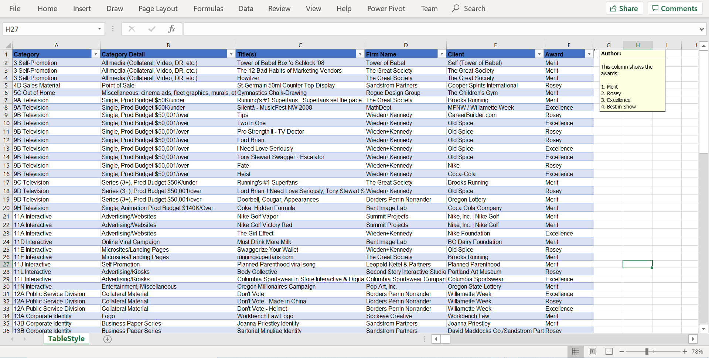
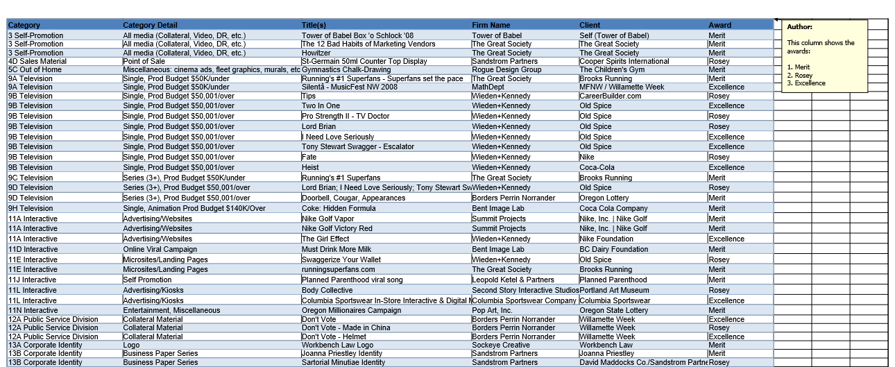
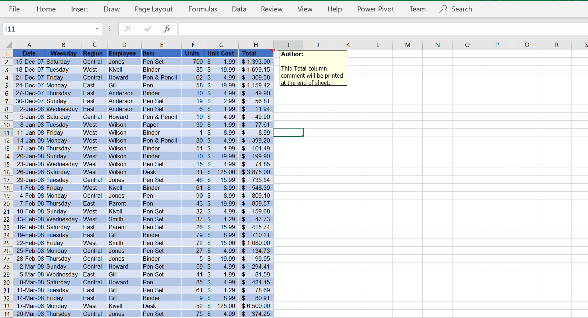
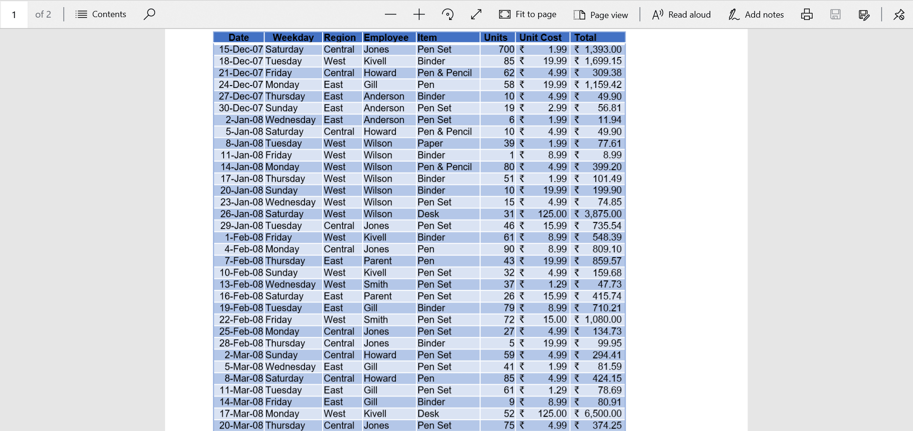
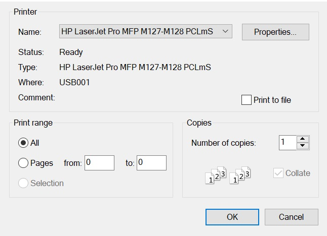

# Excel to PDF Conversion

[XlsIO](https://www.syncfusion.com/excel-framework/net/excel-to-pdf-conversion) allows you to convert an entire workbook or a single worksheet into PDF document. Refer to the following links for assemblies/nuget packages required based on platforms to convert Excel document into PDF.

* [Assemblies Information](https://help.syncfusion.com/file-formats/xlsio/assemblies-required#converting-excel-document-to-pdf) 
* [NuGet Information](https://help.syncfusion.com/file-formats/xlsio/nuget-packages-required#converting-excel-document-into-pdf)

N> Excel to PDF conversion works proper in Blazor server-side alone and not in client-side.

## Workbook to PDF

The following code illustrates how to convert an Excel workbook to PDF.

  


using(ExcelEngine excelEngine = new ExcelEngine())
{
  IApplication application = excelEngine.Excel;
  application.DefaultVersion = ExcelVersion.Excel2013;
  IWorkbook workbook = application.Workbooks.Open("Sample.xlsx", ExcelOpenType.Automatic);

  //Open the Excel document to Convert
  ExcelToPdfConverter converter = new ExcelToPdfConverter(workbook);

  //Initialize PDF document
  PdfDocument pdfDocument = new PdfDocument();

  //Convert Excel document into PDF document
  pdfDocument = converter.Convert();

  //Save the PDF file
  pdfDocument.Save("ExcelToPDF.pdf");
}




Using excelEngine As ExcelEngine = New ExcelEngine()
  Dim application As IApplication = excelEngine.Excel
  application.DefaultVersion = ExcelVersion.Excel2013
  Dim workbook As IWorkbook = application.Workbooks.Open("Sample.xlsx", ExcelOpenType.Automatic)

  'Open the Excel document to convert
  Dim converter As ExcelToPdfConverter = New ExcelToPdfConverter(workbook)

  'Initialize the PDF document
  Dim pdfDocument As PdfDocument = New PdfDocument()

  'Convert Excel document into PDF document
  pdfDocument = converter.Convert()

  'Save the PDF file
  pdfDocument.Save("ExcelToPDF.pdf")
End Using



//Excel To PDF conversion can be performed by referring .NET Standard assemblies in UWP platform

#region Excel To PDF
using (ExcelEngine excelEngine = new ExcelEngine())
{
    IApplication application = excelEngine.Excel;
    
    //Gets assembly
    Assembly assembly = typeof(App).GetTypeInfo().Assembly;

    //Gets input Excel document from an embedded resource collection
    Stream excelStream = assembly.GetManifestResourceStream("ExcelToPDF.xlsx");
	
    IWorkbook workbook = await application.Workbooks.OpenAsync(excelStream);

    //Initialize XlsIO renderer.
    XlsIORenderer renderer = new XlsIORenderer();

    //Convert Excel document into PDF document 
    PdfDocument pdfDocument = renderer.ConvertToPDF(workbook);

    //Save the PDF document to stream.
    MemoryStream stream = new MemoryStream();

    await doc.SaveAsync(stream);
    Save(stream, "ExcelToPDF.pdf");

    excelStream.Dispose();
    stream.Dispose();
}
#endregion

//Save the workbook stream as a file.

#region Setting output location
async void Save(Stream stream, string filename)
{
    stream.Position = 0;

    StorageFile stFile;
    if (!(Windows.Foundation.Metadata.ApiInformation.IsTypePresent("Windows.Phone.UI.Input.HardwareButtons")))
    {
        FileSavePicker savePicker = new FileSavePicker();
        savePicker.DefaultFileExtension = ".pdf";
        savePicker.SuggestedFileName = "Sample";
        savePicker.FileTypeChoices.Add("Adobe PDF Document", new List<string>() { ".pdf" });
        stFile = await savePicker.PickSaveFileAsync();
    }
    else
    {
        StorageFolder local = Windows.Storage.ApplicationData.Current.LocalFolder;
        stFile = await local.CreateFileAsync(filename, CreationCollisionOption.ReplaceExisting);
    }
    if (stFile != null)
    {
        Windows.Storage.Streams.IRandomAccessStream fileStream = await stFile.OpenAsync(FileAccessMode.ReadWrite);
        Stream st = fileStream.AsStreamForWrite();
        st.Write((stream as MemoryStream).ToArray(), 0, (int)stream.Length);
        st.Flush();
        st.Dispose();
        fileStream.Dispose();
    }
}
#endregion



using (ExcelEngine excelEngine = new ExcelEngine())
{
   IApplication application = excelEngine.Excel;
   FileStream excelStream = new FileStream("ExcelToPDF.xlsx", FileMode.Open, FileAccess.Read);
   IWorkbook workbook = application.Workbooks.Open(excelStream);

   //Initialize XlsIO renderer.
   XlsIORenderer renderer = new XlsIORenderer();

   //Convert Excel document into PDF document 
   PdfDocument pdfDocument = renderer.ConvertToPDF(workbook);

   Stream stream = new FileStream("ExcelToPDF.pdf", FileMode.Create, FileAccess.ReadWrite);
   pdfDocument.Save(stream);

   excelStream.Dispose();
   stream.Dispose();
}



using (ExcelEngine excelEngine = new ExcelEngine())
{
    IApplication application = excelEngine.Excel;
   
    //Gets assembly
    Assembly assembly = typeof(App).GetTypeInfo().Assembly;

    //Gets input Excel document from an embedded resource collection
    Stream excelStream = assembly.GetManifestResourceStream("ExcelToPDF.xlsx");

    IWorkbook workbook = application.Workbooks.Open(excelStream);

    //Initialize XlsIO renderer.
    XlsIORenderer renderer = new XlsIORenderer();

    //Convert Excel document into PDF document 
    PdfDocument pdfDocument = renderer.ConvertToPDF(workbook);

    //Save the PDF document to stream.
    MemoryStream stream = new MemoryStream();
    doc.Save(stream);

    stream.Position = 0;

    //Save the stream into pdf file
    if (Device.OS == TargetPlatform.WinPhone || Device.OS == TargetPlatform.Windows)
    {
        Xamarin.Forms.DependencyService.Get<ISaveWindowsPhone>().Save("ExcelToPDF.pdf", "application/pdf", stream);
    }
    else
    {
        Xamarin.Forms.DependencyService.Get<ISave>().Save("ExcelToPDF.pdf", "application/pdf", stream);
    }

    excelStream.Dispose();
    stream.Dispose();
}




A complete working example convert workbook to PDF in C# is present on [this GitHub page](https://github.com/SyncfusionExamples/XlsIO-Examples/tree/master/Excel%20to%20PDF/Workbook%20to%20PDF).      

To learn more about different conversion settings in Excel To PDF conversion, refer to the ExcelToPdfConverterSettings in API section.

## Worksheet to PDF

The following code shows how to convert a particular sheet to PDF document.



Using(ExcelEngine excelEngine = new ExcelEngine())
{
  IApplication application = excelEngine.Excel;
  application.DefaultVersion = ExcelVersion.Excel2013;

  IWorkbook workbook = application.Workbooks.Open("Sample.xlsx", ExcelOpenType.Automatic);
  IWorksheet sheet = workbook.Worksheets[0];

  //convert the sheet to PDF
  ExcelToPdfConverter converter = new ExcelToPdfConverter(sheet);

  PdfDocument pdfDocument= new PdfDocument();
  pdfDocument = converter.Convert();
  pdfDocument.Save("ExcelToPDF.pdf");       
}




Using excelEngine As ExcelEngine = New ExcelEngine()
  Dim application As IApplication = excelEngine.Excel
  application.DefaultVersion = ExcelVersion.Excel2013

  Dim workbook As IWorkbook = application.Workbooks.Open("Sample.xlsx", ExcelOpenType.Automatic)
  Dim sheet As IWorksheet = workbook.Worksheets(0)

  'Converts the particular sheet 
  Dim converter As ExcelToPdfConverter = New ExcelToPdfConverter(sheet)

  Dim pdfDocument As PdfDocument = New PdfDocument()
  pdfDocument = converter.Convert()

  'Save the PDF file
  pdfDocument.Save("ExcelToPDF.pdf")
End Using



//Excel To PDF conversion can be performed by referring .NET Standard assemblies in UWP platform

#region Excel To PDF
using (ExcelEngine excelEngine = new ExcelEngine())
{
    IApplication application = excelEngine.Excel;
    
    //Gets assembly
    Assembly assembly = typeof(App).GetTypeInfo().Assembly;

    //Gets input Excel document from an embedded resource collection
    Stream excelStream = assembly.GetManifestResourceStream("ExcelToPDF.xlsx");
	
    IWorkbook workbook = await application.Workbooks.OpenAsync(excelStream);
	IWorksheet worksheet = workbook.Worksheets[0];
	
    //Initialize XlsIO renderer.
    XlsIORenderer renderer = new XlsIORenderer();

    //Convert Excel document into PDF document 
    PdfDocument pdfDocument = renderer.ConvertToPDF(worksheet);

    //Save the PDF document to stream.
    MemoryStream stream = new MemoryStream();

    await doc.SaveAsync(stream);
    Save(stream, "ExcelToPDF.pdf");

    excelStream.Dispose();
    stream.Dispose();
}
#endregion

//Save the workbook stream as a file.

#region Setting output location
async void Save(Stream stream, string filename)
{
    stream.Position = 0;

    StorageFile stFile;
    if (!(Windows.Foundation.Metadata.ApiInformation.IsTypePresent("Windows.Phone.UI.Input.HardwareButtons")))
    {
        FileSavePicker savePicker = new FileSavePicker();
        savePicker.DefaultFileExtension = ".pdf";
        savePicker.SuggestedFileName = "Sample";
        savePicker.FileTypeChoices.Add("Adobe PDF Document", new List<string>() { ".pdf" });
        stFile = await savePicker.PickSaveFileAsync();
    }
    else
    {
        StorageFolder local = Windows.Storage.ApplicationData.Current.LocalFolder;
        stFile = await local.CreateFileAsync(filename, CreationCollisionOption.ReplaceExisting);
    }
    if (stFile != null)
    {
        Windows.Storage.Streams.IRandomAccessStream fileStream = await stFile.OpenAsync(FileAccessMode.ReadWrite);
        Stream st = fileStream.AsStreamForWrite();
        st.Write((stream as MemoryStream).ToArray(), 0, (int)stream.Length);
        st.Flush();
        st.Dispose();
        fileStream.Dispose();
    }
}
#endregion




using (ExcelEngine excelEngine = new ExcelEngine())
{
   IApplication application = excelEngine.Excel;
   FileStream excelStream = new FileStream("ExcelToPDF.xlsx", FileMode.Open, FileAccess.Read);
   IWorkbook workbook = application.Workbooks.Open(excelStream);
   IWorksheet worksheet = workbook.Worksheets[0];
   
   //Initialize XlsIO renderer.
   XlsIORenderer renderer = new XlsIORenderer();

   //Convert Excel document into PDF document 
   PdfDocument pdfDocument = renderer.ConvertToPDF(worksheet);

   Stream stream = new FileStream("ExcelToPDF.pdf", FileMode.Create, FileAccess.ReadWrite);
   pdfDocument.Save(stream);

   excelStream.Dispose();
   stream.Dispose();
}





using (ExcelEngine excelEngine = new ExcelEngine())
{
    IApplication application = excelEngine.Excel;
   
    //Gets assembly
    Assembly assembly = typeof(App).GetTypeInfo().Assembly;

    //Gets input Excel document from an embedded resource collection
    Stream excelStream = assembly.GetManifestResourceStream("ExcelToPDF.xlsx");

    IWorkbook workbook = application.Workbooks.Open(excelStream);
    IWorksheet worksheet = workbook.Worksheets[0];

    //Initialize XlsIO renderer.
    XlsIORenderer renderer = new XlsIORenderer();

    //Convert Excel document into PDF document 
    PdfDocument pdfDocument = renderer.ConvertToPDF(worksheet);

    //Save the PDF document to stream.
    MemoryStream stream = new MemoryStream();
    doc.Save(stream);

    stream.Position = 0;

    //Save the stream into pdf file
    if (Device.OS == TargetPlatform.WinPhone || Device.OS == TargetPlatform.Windows)
    {
        Xamarin.Forms.DependencyService.Get<ISaveWindowsPhone>().Save("ExcelToPDF.pdf", "application/pdf", stream);
    }
    else
    {
        Xamarin.Forms.DependencyService.Get<ISave>().Save("ExcelToPDF.pdf", "application/pdf", stream);
    }

    excelStream.Dispose();
    stream.Dispose();
}


  

A complete working example convert worksheet to PDF in C# is present on [this GitHub page](https://github.com/SyncfusionExamples/XlsIO-Examples/tree/master/Excel%20to%20PDF/Worksheet%20to%20PDF). 

**Creating** **individual** **PDF** **document** **for** **each** **worksheet**

The following code snippet shows how to create an individual PDF document for each worksheet in a workbook.



Using(ExcelEngine excelEngine = new ExcelEngine())
{
  IApplication application = excelEngine.Excel;
  application.DefaultVersion = ExcelVersion.Excel2013;
  IWorkbook workbook = application.Workbooks.Open("Sample.xlsx", ExcelOpenType.Automatic);

  PdfDocument pdfDocument = new PdfDocument();     

  foreach (IWorksheet sheet in workbook.Worksheets)
  {
    ExcelToPdfConverter converter = new ExcelToPdfConverter(sheet);
    pdfDocument = converter.Convert();

    //Save the PDF file
    pdfDocument.Save(sheet.Name+".pdf");
    converter.Dispose();
  }
}



Using excelEngine As ExcelEngine = New ExcelEngine()
  Dim application As IApplication = excelEngine.Excel
  application.DefaultVersion = ExcelVersion.Excel2013
  Dim workbook As IWorkbook = application.Workbooks.Open("Sample.xlsx")

  Dim pdfDocument As New PdfDocument()

  For Each sheet As IWorksheet In workbook.Worksheets
    Dim converter As New ExcelToPdfConverter(sheet)
    PdfDocument = converter.Convert()

    'Save the PDF file
    PdfDocument.Save(sheet.Name + ".pdf")
    converter.Dispose()
  Next
End Using



//Excel To PDF conversion can be performed by referring .NET Standard assemblies in UWP platform

#region Excel To PDF
using (ExcelEngine excelEngine = new ExcelEngine())
{
    IApplication application = excelEngine.Excel;
    
    //Gets assembly
    Assembly assembly = typeof(App).GetTypeInfo().Assembly;

    //Gets input Excel document from an embedded resource collection
    Stream excelStream = assembly.GetManifestResourceStream("ExcelToPDF.xlsx");
	
    IWorkbook workbook = await application.Workbooks.OpenAsync(excelStream);
	
    //Initialize XlsIO renderer.
    XlsIORenderer renderer = new XlsIORenderer();
	PdfDocument pdfDocument = new PdfDocument();     
    	
    foreach (IWorksheet sheet in workbook.Worksheets)
    {
      pdfDocument = renderer.ConvertToPDF(sheet);
    
	  //Save the PDF file
	  MemoryStream stream = new MemoryStream();
	  await doc.SaveAsync(stream);
      Save(stream, sheet.Name+".pdf");
	  stream.Dispose();
    }
	
    excelStream.Dispose();
}
#endregion

//Save the workbook stream as a file.

#region Setting output location
async void Save(Stream stream, string filename)
{
    stream.Position = 0;

    StorageFile stFile;
    if (!(Windows.Foundation.Metadata.ApiInformation.IsTypePresent("Windows.Phone.UI.Input.HardwareButtons")))
    {
        FileSavePicker savePicker = new FileSavePicker();
        savePicker.DefaultFileExtension = ".pdf";
        savePicker.SuggestedFileName = "Sample";
        savePicker.FileTypeChoices.Add("Adobe PDF Document", new List<string>() { ".pdf" });
        stFile = await savePicker.PickSaveFileAsync();
    }
    else
    {
        StorageFolder local = Windows.Storage.ApplicationData.Current.LocalFolder;
        stFile = await local.CreateFileAsync(filename, CreationCollisionOption.ReplaceExisting);
    }
    if (stFile != null)
    {
        Windows.Storage.Streams.IRandomAccessStream fileStream = await stFile.OpenAsync(FileAccessMode.ReadWrite);
        Stream st = fileStream.AsStreamForWrite();
        st.Write((stream as MemoryStream).ToArray(), 0, (int)stream.Length);
        st.Flush();
        st.Dispose();
        fileStream.Dispose();
    }
}
#endregion




using (ExcelEngine excelEngine = new ExcelEngine())
{
   IApplication application = excelEngine.Excel;
   FileStream excelStream = new FileStream("ExcelToPDF.xlsx", FileMode.Open, FileAccess.Read);
   IWorkbook workbook = application.Workbooks.Open(excelStream);
   
   //Initialize XlsIO renderer.
   XlsIORenderer renderer = new XlsIORenderer();
   PdfDocument pdfDocument = new PdfDocument();     
    	
   foreach (IWorksheet sheet in workbook.Worksheets)
   {
     pdfDocument = renderer.ConvertToPDF(sheet);
   
     //Save the PDF file
     Stream stream = new FileStream(sheet.Name+".pdf", FileMode.Create, FileAccess.ReadWrite);
     pdfDocument.Save(stream);
     stream.Dispose();
   }

   excelStream.Dispose();
}





using (ExcelEngine excelEngine = new ExcelEngine())
{
    IApplication application = excelEngine.Excel;
   
    //Gets assembly
    Assembly assembly = typeof(App).GetTypeInfo().Assembly;

    //Gets input Excel document from an embedded resource collection
    Stream excelStream = assembly.GetManifestResourceStream("ExcelToPDF.xlsx");

    IWorkbook workbook = application.Workbooks.Open(excelStream);

    //Initialize XlsIO renderer.
    XlsIORenderer renderer = new XlsIORenderer();
    PdfDocument pdfDocument = new PdfDocument();     
     	
    foreach (IWorksheet sheet in workbook.Worksheets)
    {
      pdfDocument = renderer.ConvertToPDF(sheet);
    
      //Save the PDF file
      Stream stream = new FileStream(sheet.Name+".pdf", FileMode.Create, FileAccess.ReadWrite);
      pdfDocument.Save(stream);
	  
	  stream.Position = 0;
	  //Save the stream into pdf file
      if (Device.OS == TargetPlatform.WinPhone || Device.OS == TargetPlatform.Windows)
      {
          Xamarin.Forms.DependencyService.Get<ISaveWindowsPhone>().Save("ExcelToPDF.pdf", "application/pdf", stream);
      }
      else
      {
          Xamarin.Forms.DependencyService.Get<ISave>().Save("ExcelToPDF.pdf", "application/pdf", stream);
      }
      stream.Dispose();
    }    
    excelStream.Dispose();
}




A complete working example convert each worksheet to individual PDF in C# is present on [this GitHub page](https://github.com/SyncfusionExamples/XlsIO-Examples/tree/master/Excel%20to%20PDF/Each%20Worksheet%20to%20PDF).
  
## Excel with chart to PDF

XlsIO allows you to convert a workbook/worksheet with charts or a single chart into PDF document.

To preserve the charts during Excel To PDF conversion in .NET Framework, initialize the ChartToImageConverter of **IApplication** interface otherwise the charts present in worksheet gets skipped.

The following code illustrates how to convert an Excel with chart to PDF document.



Using(ExcelEngine excelEngine = new ExcelEngine())
{
  IApplication application = excelEngine.Excel;
  application.DefaultVersion = ExcelVersion.Excel2013;

  //Instantiating the ChartToImageConverter and assigning the ChartToImageConverter instance of XlsIO application
  application.ChartToImageConverter = new ChartToImageConverter();

  //Tuning chart image quality
  application.ChartToImageConverter.ScalingMode = ScalingMode.Best;

  IWorkbook workbook = application.Workbooks.Open("chart.xlsx");
  IWorksheet worksheet = workbook.Worksheets[0];

  ExcelToPdfConverter converter = new ExcelToPdfConverter(workbook);

  PdfDocument pdfDocument = new PdfDocument();
  pdfDocument = converter.Convert();
  pdfDocument.Save("ExcelToPDF.pdf");
}




Using excelEngine As ExcelEngine = New ExcelEngine()
  Dim application As IApplication = excelEngine.Excel
  application.DefaultVersion = ExcelVersion.Excel2013

  'Instantiating the ChartToImageConverter and assigning the ChartToImageConverter instance of XlsIO application
  application.ChartToImageConverter = New ChartToImageConverter()

  'Tuning chart image quality
  application.ChartToImageConverter.ScalingMode = ScalingMode.Best

  Dim workbook As IWorkbook = application.Workbooks.Open("chart.xlsx")
  Dim worksheet As IWorksheet = workbook.Worksheets(0)

  Dim converter As New ExcelToPdfConverter(workbook)
  
  Dim pdfDocument As New PdfDocument()
  pdfDocument = converter.Convert()
  pdfDocument.Save("ExcelToPDF.pdf")
End Using



//Excel To PDF conversion can be performed by referring .NET Standard 2.0 assemblies in UWP platform

#region Excel To PDF
using (ExcelEngine excelEngine = new ExcelEngine())
{
    IApplication application = excelEngine.Excel;
    
	//Initializing XlsIORenderer
	XlsIORenderer renderer = new XlsIORenderer();
	
    //Gets assembly
    Assembly assembly = typeof(App).GetTypeInfo().Assembly;

    //Gets input Excel document from an embedded resource collection
    Stream excelStream = assembly.GetManifestResourceStream("chart.xlsx");
	
    IWorkbook workbook = await application.Workbooks.OpenAsync(excelStream);
	    
	//Convert Excel document with charts into PDF document 
    PdfDocument pdfDocument = renderer.ConvertToPDF(workbook);	
	
	//Save the PDF document to stream.
    MemoryStream stream = new MemoryStream();

    await doc.SaveAsync(stream);
    Save(stream, "ExcelToPDF.pdf");

    excelStream.Dispose();
    stream.Dispose();
}
#endregion

//Save the workbook stream as a file.

#region Setting output location
async void Save(Stream stream, string filename)
{
    stream.Position = 0;

    StorageFile stFile;
    if (!(Windows.Foundation.Metadata.ApiInformation.IsTypePresent("Windows.Phone.UI.Input.HardwareButtons")))
    {
        FileSavePicker savePicker = new FileSavePicker();
        savePicker.DefaultFileExtension = ".pdf";
        savePicker.SuggestedFileName = "Sample";
        savePicker.FileTypeChoices.Add("Adobe PDF Document", new List<string>() { ".pdf" });
        stFile = await savePicker.PickSaveFileAsync();
    }
    else
    {
        StorageFolder local = Windows.Storage.ApplicationData.Current.LocalFolder;
        stFile = await local.CreateFileAsync(filename, CreationCollisionOption.ReplaceExisting);
    }
    if (stFile != null)
    {
        Windows.Storage.Streams.IRandomAccessStream fileStream = await stFile.OpenAsync(FileAccessMode.ReadWrite);
        Stream st = fileStream.AsStreamForWrite();
        st.Write((stream as MemoryStream).ToArray(), 0, (int)stream.Length);
        st.Flush();
        st.Dispose();
        fileStream.Dispose();
    }
}
#endregion




using (ExcelEngine excelEngine = new ExcelEngine())
{
   IApplication application = excelEngine.Excel;
   
   //Initialize XlsIO renderer.
   XlsIORenderer renderer = new XlsIORenderer();
   
   FileStream excelStream = new FileStream("chart.xlsx", FileMode.Open, FileAccess.Read);
   IWorkbook workbook = application.Workbooks.Open(excelStream);

   //Convert Excel document with charts into PDF document 
   PdfDocument pdfDocument = renderer.ConvertToPDF(workbook);

   Stream stream = new FileStream("ExcelToPDF.pdf", FileMode.Create, FileAccess.ReadWrite);
   pdfDocument.Save(stream);

   excelStream.Dispose();
   stream.Dispose();
}





using (ExcelEngine excelEngine = new ExcelEngine())
{
    IApplication application = excelEngine.Excel;

	//Initialize XlsIO renderer.
    XlsIORenderer renderer = new XlsIORenderer();
	
    //Gets assembly
    Assembly assembly = typeof(App).GetTypeInfo().Assembly;

    //Gets input Excel document from an embedded resource collection
    Stream excelStream = assembly.GetManifestResourceStream("chart.xlsx");

    IWorkbook workbook = application.Workbooks.Open(excelStream);
    
    //Convert Excel document into PDF document 
    PdfDocument pdfDocument = renderer.ConvertToPDF(workbook);

    //Save the PDF document to stream.
    MemoryStream stream = new MemoryStream();
    doc.Save(stream);

    stream.Position = 0;

    //Save the stream into pdf file
    if (Device.OS == TargetPlatform.WinPhone || Device.OS == TargetPlatform.Windows)
    {
        Xamarin.Forms.DependencyService.Get<ISaveWindowsPhone>().Save("ExcelToPDF.pdf", "application/pdf", stream);
    }
    else
    {
        Xamarin.Forms.DependencyService.Get<ISave>().Save("ExcelToPDF.pdf", "application/pdf", stream);
    }

    excelStream.Dispose();
    stream.Dispose();
}



  

A complete working example convert Excel chart to PDF in C# is present on [this GitHub page](https://github.com/SyncfusionExamples/XlsIO-Examples/tree/master/Excel%20to%20PDF/Chart%20to%20PDF).

## Excel with comments (notes) to PDF

XlsIO allows you to convert a workbook or a worksheet with comments (notes) to PDF documents. By default, comments (notes) will not get converted. To convert the comments in worksheets of an Excel workbook, it is a must to set the print options. XlsIO supports to convert Excel documents with comments (notes) to PDF with the options in `ExcelPrintLocation` enumeration. This option helps to convert,

* comments as displayed in place,
* comments at the end of the sheet, and
* without comments.

### Convert comments as displayed in place
Comments (notes) will be rendered in the output PDF document as displayed in the Excel file, if the **PrintInPlace** option is selected.

The following code illustrates how to convert an Excel workbook to PDF with comments (notes) using `PrintInPlace` option.



using (ExcelEngine excelEngine = new ExcelEngine())
{
	IApplication application = excelEngine.Excel;
    application.DefaultVersion = ExcelVersion.Excel2013;

    IWorkbook workbook = application.Workbooks.Open("Sample1.xlsx");
    IWorksheet worksheet = workbook.Worksheets[0];
    
    //Set print location to comments
	worksheet.PageSetup.PrintComments = ExcelPrintLocation.PrintInPlace;
    ExcelToPdfConverter converter = new ExcelToPdfConverter(worksheet);
	
    //Initialize PDF document
    PdfDocument pdfDocument = new PdfDocument();

    //Convert Excel document into PDF document
    pdfDocument = converter.Convert();

    //Save the PDF file
    pdfDocument.Save("ExcelToPDF1.pdf");
    System.Diagnostics.Process.Start("ExcelToPDF1.pdf");
}



Using excelEngine As ExcelEngine = New ExcelEngine()
	Dim application As IApplication = excelEngine.Excel
    application.DefaultVersion = ExcelVersion.Excel2013
    Dim workbook As IWorkbook = application.Workbooks.Open("Sample1.xlsx", ExcelOpenType.Automatic)
    Dim worksheet As IWorksheet = workbook.Worksheets(0)

    'Set print location to comments
    worksheet.PageSetup.PrintComments = ExcelPrintLocation.PrintInPlace

	'Open the Excel document to convert
    Dim converter As ExcelToPdfConverter = New ExcelToPdfConverter(workbook)

    'Initialize the PDF document
    Dim pdfDocument As PdfDocument = New PdfDocument()

    'Convert Excel document into PDF document
    pdfDocument = converter.Convert()

    'Save the PDF file
    pdfDocument.Save("ExcelToPDF1.pdf")
End Using



#region Excel To PDF
using (ExcelEngine excelEngine = new ExcelEngine())
{
	IApplication application = excelEngine.Excel;
    application.DefaultVersion = ExcelVersion.Excel2016;

    //Get assembly
    Assembly assembly = typeof(App).GetTypeInfo().Assembly;

    //Get input Excel document from an embedded resource collection
    Stream excelStream = assembly.GetManifestResourceStream("Sample1.xlsx");
    IWorkbook workbook = application.Workbooks.Open(excelStream);
    IWorksheet worksheet = workbook.Worksheets[0];
    
    //Set print location to comments
    worksheet.PageSetup.PrintComments = ExcelPrintLocation.PrintInPlace;

    //Initialize XlsIORenderer
    XlsIORenderer renderer = new XlsIORenderer();

    //Convert the Excel document to PDF with renderer settings
    PdfDocument document = renderer.ConvertToPDF(workbook);

    //Save the PDF document
    MemoryStream stream = new MemoryStream();
    document.Save(stream);
    Save(stream, "ExcelToPDF1.pdf");

    excelStream.Dispose();
}
#endregion

//Save the workbook stream as a file.
#region Setting output location
async void Save(Stream stream, string filename)
{
	stream.Position = 0;
    StorageFile stFile;
    if (!(Windows.Foundation.Metadata.ApiInformation.IsTypePresent("Windows.Phone.UI.Input.HardwareButtons")))
    {
		FileSavePicker savePicker = new FileSavePicker();
        savePicker.DefaultFileExtension = ".pdf";
        savePicker.SuggestedFileName = "Sample";
        savePicker.FileTypeChoices.Add("Adobe PDF Document", new List<string>() { ".pdf" });
        stFile = await savePicker.PickSaveFileAsync();
    }
    else
    {
        StorageFolder local = Windows.Storage.ApplicationData.Current.LocalFolder;
        stFile = await local.CreateFileAsync(filename, CreationCollisionOption.ReplaceExisting);
    }
    if (stFile != null)
    {
        Windows.Storage.Streams.IRandomAccessStream fileStream = await stFile.OpenAsync(FileAccessMode.ReadWrite);
        Stream st = fileStream.AsStreamForWrite();
        st.Write((stream as MemoryStream).ToArray(), 0, (int)stream.Length);
        st.Flush();
        st.Dispose();
        fileStream.Dispose();
    }
    stream.Dispose();
}
#endregion



using (ExcelEngine excelEngine = new ExcelEngine())
{
	IApplication application = excelEngine.Excel;
    FileStream excelStream = new FileStream("Sample1.xlsx", FileMode.Open, FileAccess.Read);
    IWorkbook workbook = application.Workbooks.Open(excelStream);
    IWorksheet worksheet = workbook.Worksheets[0];
    
    //Set print location to comments
	worksheet.PageSetup.PrintComments = ExcelPrintLocation.PrintInPlace;

    //Initialize XlsIO renderer.
    XlsIORenderer renderer = new XlsIORenderer();

    //Convert Excel document into PDF document 
    PdfDocument pdfDocument = renderer.ConvertToPDF(worksheet);

    Stream stream = new FileStream("ExcelToPDF1.pdf", FileMode.Create, FileAccess.ReadWrite);
    pdfDocument.Save(stream);

    excelStream.Dispose();
    stream.Dispose();
}



using (ExcelEngine excelEngine = new ExcelEngine())
{
    IApplication application = excelEngine.Excel;
   
    //Gets assembly
    Assembly assembly = typeof(App).GetTypeInfo().Assembly;

    //Gets input Excel document from an embedded resource collection
    Stream excelStream = assembly.GetManifestResourceStream("Sample1.xlsx");

    IWorkbook workbook = application.Workbooks.Open(excelStream);
	IWorksheet worksheet = workbook.Worksheets[0];
	
	//Set print location to comments
    worksheet.PageSetup.PrintComments = ExcelPrintLocation.PrintInPlace;

    //Initialize XlsIO renderer.
    XlsIORenderer renderer = new XlsIORenderer();

    //Convert Excel document into PDF document 
    PdfDocument pdfDocument = renderer.ConvertToPDF(workbook);

    //Save the PDF document to stream.
    MemoryStream stream = new MemoryStream();
    doc.Save(stream);

    stream.Position = 0;

    //Save the stream into pdf file
    if (Device.OS == TargetPlatform.WinPhone || Device.OS == TargetPlatform.Windows)
    {
        Xamarin.Forms.DependencyService.Get<ISaveWindowsPhone>().Save("ExcelToPDF1.pdf", "application/pdf", stream);
    }
    else
    {
        Xamarin.Forms.DependencyService.Get<ISave>().Save("ExcelToPDF1.pdf", "application/pdf", stream);
    }

    excelStream.Dispose();
    stream.Dispose();
}




A complete working example convert Excel with comments to PDF and render comments in place in C# is present on [this GitHub page](https://github.com/SyncfusionExamples/XlsIO-Examples/tree/master/Excel%20to%20PDF/Comments%20in%20Place%20to%20PDF).

The following screenshot represents the input Excel file with notes

The following screenshot represents the output pdf file generated by the XlsIO using PrintInPlace option

### Convert comments at the end of the sheet
Comments (notes) will be rendered in the output PDF document at the end of the each sheet which contains the comments (notes), when the **PrintSheetEnd** option is selected.

The following code illustrates how to convert an Excel workbook to PDF with comments (notes) using `PrintSheetEnd` option.



using (ExcelEngine excelEngine = new ExcelEngine())
{
	IApplication application = excelEngine.Excel;
    application.DefaultVersion = ExcelVersion.Excel2013;

    IWorkbook workbook = application.Workbooks.Open("Sample2.xlsx");
    IWorksheet worksheet = workbook.Worksheets[0];
    
    //Set print location to comments
	worksheet.PageSetup.PrintComments = ExcelPrintLocation.PrintSheetEnd;
    
    ExcelToPdfConverter converter = new ExcelToPdfConverter(worksheet);
	
    //Initialize PDF document
    PdfDocument pdfDocument = new PdfDocument();

    //Convert Excel document into PDF document
    pdfDocument = converter.Convert();

    //Save the PDF file
    pdfDocument.Save("ExcelToPDF2.pdf");
    System.Diagnostics.Process.Start("ExcelToPDF2.pdf");
}



Using excelEngine As ExcelEngine = New ExcelEngine()
	Dim application As IApplication = excelEngine.Excel
    application.DefaultVersion = ExcelVersion.Excel2013
    Dim workbook As IWorkbook = application.Workbooks.Open("Sample2.xlsx", ExcelOpenType.Automatic)
    Dim worksheet As IWorksheet = workbook.Worksheets(0)

    'Set print location to comments
    worksheet.PageSetup.PrintComments = ExcelPrintLocation.PrintSheetEnd

	'Open the Excel document to convert
    Dim converter As ExcelToPdfConverter = New ExcelToPdfConverter(workbook)

    'Initialize the PDF document
    Dim pdfDocument As PdfDocument = New PdfDocument()

    'Convert Excel document into PDF document
    pdfDocument = converter.Convert()

    'Save the PDF file
    pdfDocument.Save("ExcelToPDF2.pdf")
End Using



#region Excel To PDF
using (ExcelEngine excelEngine = new ExcelEngine())
{
	IApplication application = excelEngine.Excel;
    application.DefaultVersion = ExcelVersion.Excel2016;

    //Get assembly
    Assembly assembly = typeof(App).GetTypeInfo().Assembly;

    //Get input Excel document from an embedded resource collection
    Stream excelStream = assembly.GetManifestResourceStream("Sample2.xlsx");
    IWorkbook workbook = application.Workbooks.Open(excelStream);
    IWorksheet worksheet = workbook.Worksheets[0];
    
    //Set print location to comments
    worksheet.PageSetup.PrintComments = ExcelPrintLocation.PrintSheetEnd;

    //Initialize XlsIORenderer
    XlsIORenderer renderer = new XlsIORenderer();

    //Convert the Excel document to PDF with renderer settings
    PdfDocument document = renderer.ConvertToPDF(workbook);

    //Save the PDF document
    MemoryStream stream = new MemoryStream();
    document.Save(stream);
    Save(stream, "ExcelToPDF2.pdf");

    excelStream.Dispose();
}
#endregion
//Save the workbook stream as a file.
#region Setting output location
async void Save(Stream stream, string filename)
{
	stream.Position = 0;
    StorageFile stFile;
    if (!(Windows.Foundation.Metadata.ApiInformation.IsTypePresent("Windows.Phone.UI.Input.HardwareButtons")))
    {
		FileSavePicker savePicker = new FileSavePicker();
        savePicker.DefaultFileExtension = ".pdf";
        savePicker.SuggestedFileName = "Sample";
        savePicker.FileTypeChoices.Add("Adobe PDF Document", new List<string>() { ".pdf" });
        stFile = await savePicker.PickSaveFileAsync();
    }
    else
    {
        StorageFolder local = Windows.Storage.ApplicationData.Current.LocalFolder;
        stFile = await local.CreateFileAsync(filename, CreationCollisionOption.ReplaceExisting);
    }
    if (stFile != null)
    {
        Windows.Storage.Streams.IRandomAccessStream fileStream = await stFile.OpenAsync(FileAccessMode.ReadWrite);
        Stream st = fileStream.AsStreamForWrite();
        st.Write((stream as MemoryStream).ToArray(), 0, (int)stream.Length);
        st.Flush();
        st.Dispose();
        fileStream.Dispose();
    }
    stream.Dispose();
}
#endregion



using (ExcelEngine excelEngine = new ExcelEngine())
{
	IApplication application = excelEngine.Excel;
    FileStream excelStream = new FileStream("Sample2.xlsx", FileMode.Open, FileAccess.Read);
    IWorkbook workbook = application.Workbooks.Open(excelStream);
    IWorksheet worksheet = workbook.Worksheets[0];
    
    //Set print location to comments
    worksheet.PageSetup.PrintComments = ExcelPrintLocation.PrintSheetEnd;

    //Initialize XlsIO renderer.
    XlsIORenderer renderer = new XlsIORenderer();

    //Convert Excel document into PDF document 
    PdfDocument pdfDocument = renderer.ConvertToPDF(worksheet);

    Stream stream = new FileStream("ExcelToPDF2.pdf", FileMode.Create, FileAccess.ReadWrite);
    pdfDocument.Save(stream);

    excelStream.Dispose();
    stream.Dispose();
}



using (ExcelEngine excelEngine = new ExcelEngine())
{
    IApplication application = excelEngine.Excel;
   
    //Gets assembly
    Assembly assembly = typeof(App).GetTypeInfo().Assembly;

    //Gets input Excel document from an embedded resource collection
    Stream excelStream = assembly.GetManifestResourceStream("Sample2.xlsx");

    IWorkbook workbook = application.Workbooks.Open(excelStream);
	IWorksheet worksheet = workbook.Worksheets[0];
	
	//Set print location to comments
    worksheet.PageSetup.PrintComments = ExcelPrintLocation.PrintSheetEnd;

    //Initialize XlsIO renderer.
    XlsIORenderer renderer = new XlsIORenderer();

    //Convert Excel document into PDF document 
    PdfDocument pdfDocument = renderer.ConvertToPDF(workbook);

    //Save the PDF document to stream.
    MemoryStream stream = new MemoryStream();
    doc.Save(stream);

    stream.Position = 0;

    //Save the stream into pdf file
    if (Device.OS == TargetPlatform.WinPhone || Device.OS == TargetPlatform.Windows)
    {
        Xamarin.Forms.DependencyService.Get<ISaveWindowsPhone>().Save("ExcelToPDF2.pdf", "application/pdf", stream);
    }
    else
    {
        Xamarin.Forms.DependencyService.Get<ISave>().Save("ExcelToPDF2.pdf", "application/pdf", stream);
    }

    excelStream.Dispose();
    stream.Dispose();
}




A complete working example convert Excel with comments to PDF and render comments at the end in C# is present on [this GitHub page](https://github.com/SyncfusionExamples/XlsIO-Examples/tree/master/Excel%20to%20PDF/Comments%20to%20PDF%20at%20End).

The following screenshot represents the input Excel file with notes

The following screenshot represents the output pdf file generated by the XlsIO using PrintSheetEnd option

### Convert without comments
Comments (notes) will not be displayed in the output PDF document, if the **PrintNoComments** option is selected.

The following code illustrates how to convert an Excel workbook to PDF without comments (notes) using `PrintNoComments` option.



using (ExcelEngine excelEngine = new ExcelEngine())
{
	IApplication application = excelEngine.Excel;
    application.DefaultVersion = ExcelVersion.Excel2013;

    IWorkbook workbook = application.Workbooks.Open("Sample1.xlsx");
    IWorksheet worksheet = workbook.Worksheets[0];
    
    //Set print location to comments
	worksheet.PageSetup.PrintComments = ExcelPrintLocation.PrintNoComments;
    
    ExcelToPdfConverter converter = new ExcelToPdfConverter(worksheet);
	
    //Initialize PDF document
    PdfDocument pdfDocument = new PdfDocument();

    //Convert Excel document into PDF document
    pdfDocument = converter.Convert();

    //Save the PDF file
    pdfDocument.Save("ExcelToPDF3.pdf");
    System.Diagnostics.Process.Start("ExcelToPDF3.pdf");
}



Using excelEngine As ExcelEngine = New ExcelEngine()
	Dim application As IApplication = excelEngine.Excel
    application.DefaultVersion = ExcelVersion.Excel2013
    Dim workbook As IWorkbook = application.Workbooks.Open("Sample1.xlsx", ExcelOpenType.Automatic)
    Dim worksheet As IWorksheet = workbook.Worksheets(0)

    'Set print location to comments
    worksheet.PageSetup.PrintComments = ExcelPrintLocation.PrintNoComments

	'Open the Excel document to convert
    Dim converter As ExcelToPdfConverter = New ExcelToPdfConverter(workbook)

    'Initialize the PDF document
    Dim pdfDocument As PdfDocument = New PdfDocument()

    'Convert Excel document into PDF document
    pdfDocument = converter.Convert()

    'Save the PDF file
    pdfDocument.Save("ExcelToPDF3.pdf")
End Using



#region Excel To PDF
using (ExcelEngine excelEngine = new ExcelEngine())
{
	IApplication application = excelEngine.Excel;
    application.DefaultVersion = ExcelVersion.Excel2016;

    //Get assembly
    Assembly assembly = typeof(App).GetTypeInfo().Assembly;

    //Get input Excel document from an embedded resource collection
    Stream excelStream = assembly.GetManifestResourceStream("Sample1.xlsx");
    IWorkbook workbook = application.Workbooks.Open(excelStream);
    IWorksheet worksheet = workbook.Worksheets[0];
    
    //Set print location to comments
    worksheet.PageSetup.PrintComments = ExcelPrintLocation.PrintNoComments;

    //Initialize XlsIORenderer
    XlsIORenderer renderer = new XlsIORenderer();

    //Convert the Excel document to PDF with renderer settings
    PdfDocument document = renderer.ConvertToPDF(workbook);

    //Save the PDF document
    MemoryStream stream = new MemoryStream();
    document.Save(stream);
    Save(stream, "ExcelToPDF3.pdf");

    excelStream.Dispose();
}
#endregion
//Save the workbook stream as a file.
#region Setting output location
async void Save(Stream stream, string filename)
{
	stream.Position = 0;
    StorageFile stFile;
    if (!(Windows.Foundation.Metadata.ApiInformation.IsTypePresent("Windows.Phone.UI.Input.HardwareButtons")))
    {
		FileSavePicker savePicker = new FileSavePicker();
        savePicker.DefaultFileExtension = ".pdf";
        savePicker.SuggestedFileName = "Sample";
        savePicker.FileTypeChoices.Add("Adobe PDF Document", new List<string>() { ".pdf" });
        stFile = await savePicker.PickSaveFileAsync();
    }
    else
    {
        StorageFolder local = Windows.Storage.ApplicationData.Current.LocalFolder;
        stFile = await local.CreateFileAsync(filename, CreationCollisionOption.ReplaceExisting);
    }
    if (stFile != null)
    {
        Windows.Storage.Streams.IRandomAccessStream fileStream = await stFile.OpenAsync(FileAccessMode.ReadWrite);
        Stream st = fileStream.AsStreamForWrite();
        st.Write((stream as MemoryStream).ToArray(), 0, (int)stream.Length);
        st.Flush();
        st.Dispose();
        fileStream.Dispose();
    }
    stream.Dispose();
}
#endregion



using (ExcelEngine excelEngine = new ExcelEngine())
{
	IApplication application = excelEngine.Excel;
    FileStream excelStream = new FileStream("Sample1.xlsx", FileMode.Open, FileAccess.Read);
    IWorkbook workbook = application.Workbooks.Open(excelStream);
    IWorksheet worksheet = workbook.Worksheets[0];
    
    //Set print location to comments
    worksheet.PageSetup.PrintComments = ExcelPrintLocation.PrintNoComments;

    //Initialize XlsIO renderer.
    XlsIORenderer renderer = new XlsIORenderer();

    //Convert Excel document into PDF document 
    PdfDocument pdfDocument = renderer.ConvertToPDF(worksheet);

    Stream stream = new FileStream("ExcelToPDF3.pdf", FileMode.Create, FileAccess.ReadWrite);
    pdfDocument.Save(stream);

    excelStream.Dispose();
    stream.Dispose();
}



using (ExcelEngine excelEngine = new ExcelEngine())
{
    IApplication application = excelEngine.Excel;
   
    //Gets assembly
    Assembly assembly = typeof(App).GetTypeInfo().Assembly;

    //Gets input Excel document from an embedded resource collection
    Stream excelStream = assembly.GetManifestResourceStream("Sample1.xlsx");

    IWorkbook workbook = application.Workbooks.Open(excelStream);
	IWorksheet worksheet = workbook.Worksheets[0];
	
	//Set print location to comments
    worksheet.PageSetup.PrintComments = ExcelPrintLocation.PrintNoComments;

    //Initialize XlsIO renderer.
    XlsIORenderer renderer = new XlsIORenderer();

    //Convert Excel document into PDF document 
    PdfDocument pdfDocument = renderer.ConvertToPDF(workbook);

    //Save the PDF document to stream.
    MemoryStream stream = new MemoryStream();
    doc.Save(stream);

    stream.Position = 0;

    //Save the stream into pdf file
    if (Device.OS == TargetPlatform.WinPhone || Device.OS == TargetPlatform.Windows)
    {
        Xamarin.Forms.DependencyService.Get<ISaveWindowsPhone>().Save("ExcelToPDF3.pdf", "application/pdf", stream);
    }
    else
    {
        Xamarin.Forms.DependencyService.Get<ISave>().Save("ExcelToPDF3.pdf", "application/pdf", stream);
    }

    excelStream.Dispose();
    stream.Dispose();
}




A complete working example convert Excel with comments to PDF ignoring the comments in C# is present on [this GitHub page](https://github.com/SyncfusionExamples/XlsIO-Examples/tree/master/Excel%20to%20PDF/No%20Comments%20in%20PDF).

The following screenshot represents the input Excel file with notes

The following screenshot represents the output pdf file generated by the XlsIO using PrintNoComments option

## Substitute Font in Excel-to-PDF Conversion

By default, XlsIO substitutes unsupported fonts to Microsoft Sans Serif in Excel-to-PDF conversion. However, you may require substituting a different font or the same font for the unsupported font during the conversion. XlsIO supports substituting unsupported or missing fonts from the event `SubstituteFont`. The event has the below arguments:

**AlternateFontName** – Substitutes an available font in the machine for the `OriginalFontName`.
**AlternateFontStream** – Substitutes a font from stream that is added as embedded resource for the `OriginalFontName`.	

The following code illustrates how to perform Excel-to-PDF conversion by substituting unsupported fonts in the machine.



using Syncfusion.ExcelToPdfConverter;
using Syncfusion.Pdf;
using Syncfusion.XlsIO;
using Syncfusion.XlsIO.Implementation;
using System.IO;
using System.Reflection;

namespace FontSubstitution
{
    class Program
    {
        static void Main(string[] args)
        {
            using (ExcelEngine excelEngine = new ExcelEngine())
            {
                IApplication application = excelEngine.Excel;
                application.DefaultVersion = ExcelVersion.Xlsx;

                //Initializes the SubstituteFont event to perform font substitution in Excel-to-PDF conversion.
                application.SubstituteFont += new SubstituteFontEventHandler(SubstituteFont);

                IWorkbook workbook = application.Workbooks.Open("Template.xlsx");
                IWorksheet worksheet = workbook.Worksheets[0];

                ExcelToPdfConverter converter = new ExcelToPdfConverter(workbook);

                PdfDocument pdfDocument = new PdfDocument();
                pdfDocument = converter.Convert();
                pdfDocument.Save("ExcelToPDF.pdf");
            }
        }

        private static void SubstituteFont(object sender, SubstituteFontEventArgs args)
        {
            //Substitute a font if the specified font is not installed in the machine.
            if (args.OriginalFontName == "Arial Unicode MS")
            {
                //Substitute by font name.
                args.AlternateFontName = "Arial";
            }
            else if (args.OriginalFontName == "Homizio")
            {
                //Substitute by font stream.
                var assembly = Assembly.GetExecutingAssembly();
                var resourceName = "ExceltoPDF.Fonts.Homizio.ttf";
                Stream fileStream = assembly.GetManifestResourceStream(resourceName);
                MemoryStream memoryStream = new MemoryStream();
                fileStream.CopyTo(memoryStream);
                fileStream.Close();
                args.AlternateFontStream = memoryStream;
            }
        }
    }
}



Imports Syncfusion.ExcelToPdfConverter
Imports Syncfusion.Pdf
Imports Syncfusion.XlsIO
Imports Syncfusion.XlsIO.Implementation
Imports System.IO
Imports System.Reflection

Namespace FontSubstitution
    
    Class Program
        
        Private Shared Sub Main(ByVal args() As String)
            Dim excelEngine As ExcelEngine = New ExcelEngine
            Dim application As IApplication = excelEngine.Excel
            application.DefaultVersion = ExcelVersion.Xlsx
            'Initializes the SubstituteFont event to perform font substitution in Excel-to-PDF conversion.
            AddHandler application.SubstituteFont, AddressOf Me.SubstituteFont
            Dim workbook As IWorkbook = application.Workbooks.Open("Template.xlsx")
            Dim worksheet As IWorksheet = workbook.Worksheets(0)
            Dim converter As ExcelToPdfConverter = New ExcelToPdfConverter(workbook)
            Dim pdfDocument As PdfDocument = New PdfDocument
            pdfDocument = converter.Convert
            pdfDocument.Save("ExcelToPDF.pdf")
        End Sub
        
        Private Shared Sub SubstituteFont(ByVal sender As Object, ByVal args As SubstituteFontEventArgs)
            'Substitute a font if the specified font is not installed in the machine.
            If (args.OriginalFontName = "Arial Unicode MS") Then
                'Substitute by font name.
                args.AlternateFontName = "Arial"
            ElseIf (args.OriginalFontName = "Homizio") Then
                'Substitute by font stream.
                Dim assembly = Assembly.GetExecutingAssembly
                Dim resourceName = "ExceltoPDF.Fonts.Homizio.ttf"
                Dim fileStream As Stream = assembly.GetManifestResourceStream(resourceName)
                Dim memoryStream As MemoryStream = New MemoryStream
                fileStream.CopyTo(memoryStream)
                fileStream.Close
                args.AlternateFontStream = memoryStream
            End If
            
        End Sub
    End Class
End Namespace



//Excel-to-PDF conversion can be performed by referring .NET Standard 2.0 assemblies in UWP platform

using System;
using System.Collections.Generic;
using System.IO;
using System.Reflection;
using Windows.Storage;
using Windows.Storage.Pickers;
using Windows.UI.Xaml;
using Windows.UI.Xaml.Controls;
using Syncfusion.XlsIORenderer;
using Syncfusion.Pdf;
using Syncfusion.XlsIO;
using Syncfusion.XlsIO.Implementation;

namespace FontSubstitution
{
    public sealed partial class MainPage : Page
    {
        public MainPage()
        {
            this.InitializeComponent();
        }

        private async void button_Click(object sender, RoutedEventArgs e)
        {
            #region Excel To PDF
            using (ExcelEngine excelEngine = new ExcelEngine())
            {
                IApplication application = excelEngine.Excel;

                //Initializes the SubstituteFont event to perform font substitution during Excel-to-PDF conversion
                application.SubstituteFont += new SubstituteFontEventHandler(SubstituteFont);

                //Initializing XlsIORenderer
                XlsIORenderer renderer = new XlsIORenderer();

                //Gets assembly
                Assembly assembly = typeof(App).GetTypeInfo().Assembly;

                //Gets input Excel document from an embedded resource collection
                Stream excelStream = assembly.GetManifestResourceStream("Template.xlsx");

                IWorkbook workbook = await application.Workbooks.OpenAsync(excelStream);

                //Convert Excel document with charts into PDF document 
                PdfDocument pdfDocument = renderer.ConvertToPDF(workbook);

                //Save the PDF document to stream.
                MemoryStream stream = new MemoryStream();

                await pdfDocument.SaveAsync(stream);
                Save(stream, "ExcelToPDF.pdf");

                excelStream.Dispose();
                stream.Dispose();
            }
            #endregion
        }

        #region Excel To PDF
        private static void SubstituteFont(object sender, SubstituteFontEventArgs args)
        {
            //Substitute a font if the specified font is not installed in the machine.
            if (args.OriginalFontName == "Arial Unicode MS")
                args.AlternateFontName = "Arial";
            else if (args.OriginalFontName == "Homizio")
            {
                //Substitute by font stream.
                Assembly assembly = typeof(App).GetTypeInfo().Assembly;
                Stream fileStream = assembly.GetManifestResourceStream("Homizio.ttf");
                MemoryStream memoryStream = new MemoryStream();
                fileStream.CopyTo(memoryStream);
                fileStream.Close();
                args.AlternateFontStream = memoryStream;
            }
        }
        #endregion

        //Save the workbook stream as a file.
        #region Setting output location
        async void Save(Stream stream, string filename)
        {
            stream.Position = 0;

            StorageFile stFile;
            if (!(Windows.Foundation.Metadata.ApiInformation.IsTypePresent("Windows.Phone.UI.Input.HardwareButtons")))
            {
                FileSavePicker savePicker = new FileSavePicker();
                savePicker.DefaultFileExtension = ".pdf";
                savePicker.SuggestedFileName = "Sample";
                savePicker.FileTypeChoices.Add("Adobe PDF Document", new List<string>() { ".pdf" });
                stFile = await savePicker.PickSaveFileAsync();
            }
            else
            {
                StorageFolder local = Windows.Storage.ApplicationData.Current.LocalFolder;
                stFile = await local.CreateFileAsync(filename, CreationCollisionOption.ReplaceExisting);
            }
            if (stFile != null)
            {
                Windows.Storage.Streams.IRandomAccessStream fileStream = await stFile.OpenAsync(FileAccessMode.ReadWrite);
                Stream st = fileStream.AsStreamForWrite();
                st.Write((stream as MemoryStream).ToArray(), 0, (int)stream.Length);
                st.Flush();
                st.Dispose();
                fileStream.Dispose();
            }
        }
        #endregion
    }
}




using System;
using System.IO;
using Syncfusion.XlsIO;
using Syncfusion.XlsIORenderer;
using Syncfusion.Pdf;
using System.Reflection;

namespace FontSubstitution
{
    class Program
    {
        static void Main(string[] args)
        {
            using (ExcelEngine excelEngine = new ExcelEngine())
            {
                IApplication application = excelEngine.Excel;

                //Initializes the SubstituteFont event to perform font substitution during Excel-to-PDF conversion
                application.SubstituteFont += new SubstituteFontEventHandler(SubstituteFont);

                //Initialize XlsIO renderer.
                XlsIORenderer renderer = new XlsIORenderer();

                FileStream excelStream = new FileStream("Template.xlsx", FileMode.Open, FileAccess.Read);
                IWorkbook workbook = application.Workbooks.Open(excelStream);

                //Convert Excel document with charts into PDF document 
                PdfDocument pdfDocument = renderer.ConvertToPDF(workbook);

                Stream stream = new FileStream("ExcelToPDF.pdf", FileMode.Create, FileAccess.ReadWrite);
                pdfDocument.Save(stream);

                excelStream.Dispose();
                stream.Dispose();
            }
        }

        private static void SubstituteFont(object sender, SubstituteFontEventArgs args)
        {
            //Substitute a font if the specified font is not installed in the machine.
            if (args.OriginalFontName == "Arial Unicode MS")
                args.AlternateFontName = "Arial";
            else if (args.OriginalFontName == "Homizio")
            {
                //Substitute by font stream.
                var assembly = Assembly.GetExecutingAssembly();
                var resourceName = "ExceltoPDF.Fonts.Homizio.ttf";
                Stream fileStream = assembly.GetManifestResourceStream(resourceName);
                MemoryStream memoryStream = new MemoryStream();
                fileStream.CopyTo(memoryStream);
                fileStream.Close();
                args.AlternateFontStream = memoryStream;
            }
        }
    }
}





using System;
using Xamarin.Forms;
using System.IO;
using Syncfusion.XlsIO;
using Syncfusion.XlsIORenderer;
using Syncfusion.Pdf;
using Syncfusion.XlsIO.Implementation;
using System.Reflection;

namespace FontSubstitution
{
	public partial class MainPage : ContentPage
	{
		public MainPage()
		{
			InitializeComponent();
		}

        void OnButtonClicked(object sender, EventArgs args)
        {
            using (ExcelEngine excelEngine = new ExcelEngine())
            {
                IApplication application = excelEngine.Excel;

                //Initializes the SubstituteFont event to perform font substitution during Excel-to-PDF conversion
                application.SubstituteFont += new SubstituteFontEventHandler(SubstituteFont);

                //Initialize XlsIO renderer.
                XlsIORenderer renderer = new XlsIORenderer();

                //Gets assembly
                Assembly assembly = typeof(App).GetTypeInfo().Assembly;

                //Gets input Excel document from an embedded resource collection
                Stream excelStream = assembly.GetManifestResourceStream("Template.xlsx");

                IWorkbook workbook = application.Workbooks.Open(excelStream);

                //Convert Excel document into PDF document 
                PdfDocument pdfDocument = renderer.ConvertToPDF(workbook);

                //Save the PDF document to stream.
                MemoryStream stream = new MemoryStream();
                pdfDocument.Save(stream);

                stream.Position = 0;

                //Save the stream into pdf file
                if (Device.OS == TargetPlatform.WinPhone || Device.OS == TargetPlatform.Windows)
                {
                    Xamarin.Forms.DependencyService.Get<ISaveWindowsPhone>().Save("ExcelToPDF.pdf", "application/pdf", stream);
                }
                else
                {
                    Xamarin.Forms.DependencyService.Get<ISave>().Save("ExcelToPDF.pdf", "application/pdf", stream);
                }

                excelStream.Dispose();
                stream.Dispose();
            }
        }
		
        private static void SubstituteFont(object sender, SubstituteFontEventArgs args)
        {
            //Substitute a font if the specified font is not installed in the machine.
            if (args.OriginalFontName == "Arial Unicode MS")
                args.AlternateFontName = "Arial";
            else if (args.OriginalFontName == "Homizio")
            {
                //Substitute by font stream.
                Stream fileStream = typeof(App).GetTypeInfo().Assembly.GetManifestResourceStream("ExceltoPDF.Fonts.Homizio.ttf");
                MemoryStream memoryStream = new MemoryStream();
                fileStream.CopyTo(memoryStream);
                fileStream.Close();
                args.AlternateFontStream = memoryStream;
            }
        }
    }
}



  

## Excel to PDF conversion in Linux OS

In Linux OS, you can perform the Excel to PDF conversion using .NET Core (Targeting .netcoreapp) application. You can refer [Excel to PDF conversion NuGet packages](https://help.syncfusion.com/file-formats/xlsio/nuget-packages-required#converting-excel-document-into-pdf) to know about the packages required to deploy .NET Core (Targeting .netcoreapp) application with Excel to PDF conversion capabilities.

In addition to the previous NuGet packages, SkiaSharp.Linux helper NuGet package is required that can be generated by the following steps: 

1. Download libSkiaSharp.so [here](https://github.com/mono/SkiaSharp/releases/tag/v1.59.3#).
2. Create a folder and name it as SkiaSharp.Linux and place the downloaded file in the folder structure "SkiaSharp.Linux\runtimes\linux-x64\native"
3. Create a nuspec file with name SkiaSharp.Linux.nuspec using the following metadata information and place it inside SkiaSharp.Linux folder. The nuspec file can be customized.

	
	
	<?xml version="1.0" encoding="utf-8"?>
	<package xmlns="http://schemas.microsoft.com/packaging/2012/06/nuspec.xsd">
		<metadata>
			<id>SkiaSharp.Linux</id>
			<version>1.59.3</version>
			<title>SkiaSharp for Linux</title>
			<authors>Syncfusion Inc.</authors>
			<owners>Syncfusion Inc.</owners>
			<requireLicenseAcceptance>false</requireLicenseAcceptance>
			<description>SkiaSharp for Linux is a supporting package for Linux platforms.</description>
			<tags>linux,cross-platform,skiasharp,net-standard,net-core,excel-to-pdf</tags>
			<dependencies>
				<group targetFramework=".NETStandard1.4">
					<dependency id="SkiaSharp" version="1.59.3" />
				</group>
			</dependencies>
		</metadata>
	</package>
	
	

4. Make sure that the nuget.exe file is present along with SkiaSharp.Linux folder (in the parent folder of SkiaSharp.Linux folder). If not, download it from [here](https://www.nuget.org/downloads#).
5. Open a command prompt and navigate to SkiaSharp.Linux folder.
6. Execute the following command.

~~~
nuget pack SkiaSharp.Linux\SkiaSharp.Linux.nuspec -outputdirectory "C:\NuGet" 
~~~

The output directory can be customized as per your need.

Now, SkiaSharp.Linux NuGet will be generated in the mentioned output directory and add the generated NuGet as additional reference. You can also find the SkiaSharp.Linux NuGet package created by us from [here](https://www.syncfusion.com/downloads/support/directtrac/general/ze/SkiaSharp.Linux.1.59.3-2103435070#).

## Print Excel document

XlsIO supports Excel printing option by converting Excel To PDF and printing that PDF document. The Excel can be printed with specified page setup and printer settings in XlsIO.

The following printer settings can be applied to print Excel in XlsIO. 

 
### Print Excel document 

The following code snippet illustrates how to print the Excel document in XlsIO.



Using(ExcelEngine excelEngine = new ExcelEngine())
{
  IApplication application = excelEngine.Excel;
  IWorkbook workbook = application.Workbooks.Open("Excel.xlsx"));

  // Convert the workbook
  ExcelToPdfConverter converter = new ExcelToPdfConverter(workbook);

  // Print the converted PDF document
  converter.Print();
}




Using excelEngine As ExcelEngine = New ExcelEngine()
  Dim application As IApplication = excelEngine.Excel
  Dim workbook As IWorkbook = application.Workbooks.Open("Excel.xlsx")

  'Convert the workbook
  Dim converter As ExcelToPdfConverter = New ExcelToPdfConverter(workbook)

  'Print the converted PDF document
  converter.Print()
End Using



//XlsIO supports Excel To PDF conversion in Windows Forms, WPF, ASP.NET, and ASP.NET MVC platforms. Refer to the Workbook to PDF section to convert using web service.



//XlsIO supports Excel To PDF conversion in Windows Forms, WPF, ASP.NET, and ASP.NET MVC platforms. Refer to the Workbook to PDF section to convert using web service.



//XlsIO supports Excel To PDF conversion in Windows Forms, WPF, ASP.NET, and ASP.NET MVC platforms. Refer to the Workbook to PDF section to convert using web service.



### Print with printer settings

The following code snippet illustrates how to print the Excel document with printer settings in XlsIO.



Using(ExcelEngine excelEngine = new ExcelEngine())
{
  IApplication application = excelEngine.Excel;
  IWorkbook workbook = application.Workbooks.Open("Excel.xlsx"));

  //Convert the workbook
  ExcelToPdfConverter converter = new ExcelToPdfConverter(workbook);

  //Initialize the printer settings
  PrinterSettings printerSettings = new PrinterSettings();

  //customizing the printer settings
  printerSettings.PrinterName = "HP LaserJet Pro MFP M127-M128 PCLmS";
  printerSettings.Copies = 2;
  printerSettings.FromPage = 2;
  printerSettings.ToPage = 3;
  printerSettings.DefaultPageSettings.Color = false;
  printerSettings.Duplex = Duplex.Vertical;

  //Print the converted PDF document with printer settings
  converter.Print(printerSettings);
}



Using excelEngine As ExcelEngine = New ExcelEngine()
  Dim application As IApplication = excelEngine.Excel
  Dim workbook As IWorkbook = application.Workbooks.Open("Excel.xlsx")

  'Convert the workbook
  Dim converter As ExcelToPdfConverter = New ExcelToPdfConverter(workbook)

  'Initialize the printer settings
  Dim printerSettings As PrinterSettings = New PrinterSettings

  'customizing the printer settings
  printerSettings.PrinterName = "HP LaserJet Pro MFP M127-M128 PCLmS"
  printerSettings.Copies = 2
  printerSettings.FromPage = 2
  printerSettings.ToPage = 3
  printerSettings.DefaultPageSettings.Color = false
  printerSettings.Duplex = Duplex.Vertical

  'Print the converted PDF document with printer settings
  converter.Print(printerSettings)
End Using



//XlsIO supports Excel To PDF conversion in Windows Forms, WPF, ASP.NET, and ASP.NET MVC platforms. Refer to the Workbook to PDF section to convert using web service.



//XlsIO supports Excel To PDF conversion in Windows Forms, WPF, ASP.NET, and ASP.NET MVC platforms. Refer to the Workbook to PDF section to convert using web service.



//XlsIO supports Excel To PDF conversion in Windows Forms, WPF, ASP.NET, and ASP.NET MVC platforms. Refer to the Workbook to PDF section to convert using web service.



### Print with Excel To PDF converter settings

The following code snippet illustrates how to print the Excel document with Excel To PDF converter settings in XlsIO.

  

Using(ExcelEngine excelEngine = new ExcelEngine())
{
  IApplication application = excelEngine.Excel;
  IWorkbook workbook = application.Workbooks.Open("Excel.xlsx");

  //Convert the workbook
  ExcelToPdfConverter converter = new ExcelToPdfConverter(workbook);

  //Initializes the Excel To PDF converter setting class
  ExcelToPdfConverterSettings converterSettings = new ExcelToPdfConverterSettings();

  //Layout the page using FitAllColumnsOnOnePage options
  converterSettings.DisplayGridLines = GridLinesDisplayStyle.Visible;
  converterSettings.LayoutOptions = LayoutOptions.FitAllColumnsOnOnePage;

  //Print the converted PDF document with converter settings
  converter.Print(converterSettings);
}



Using excelEngine As ExcelEngine = New ExcelEngine()
  Dim application As IApplication = excelEngine.Excel
  Dim workbook As IWorkbook = application.Workbooks.Open("Excel.xlsx")

  'Convert the workbook
  Dim converter As ExcelToPdfConverter = New ExcelToPdfConverter(workbook)

  'Initialize the Excel To PDF converter setting class
  Dim converterSettings As ExcelToPdfConverterSettings = New ExcelToPdfConverterSettings

  'Layout the page using FitAllColumnsOnOnePage options
  converterSettings.DisplayGridLines = GridLinesDisplayStyle.Visible
  converterSettings.LayoutOptions = LayoutOptions.FitAllColumnsOnOnePage

  'Print the converted PDF document with converter settings
  converter.Print(converterSettings)
End Using



//XlsIO supports Excel To PDF conversion in Windows Forms, WPF, ASP.NET, and ASP.NET MVC platforms. Refer to the Workbook to PDF section to convert using web service.



//XlsIO supports Excel To PDF conversion in Windows Forms, WPF, ASP.NET, and ASP.NET MVC platforms. Refer to the Workbook to PDF section to convert using web service.



//XlsIO supports Excel To PDF conversion in Windows Forms, WPF, ASP.NET, and ASP.NET MVC platforms. Refer to the Workbook to PDF section to convert using web service.



### Print with Excel To PDF converter and printer settings

The following code snippet illustrates how to print the Excel document with Excel To PDF converter settings and printer settings in XlsIO.

  

Using(ExcelEngine excelEngine = new ExcelEngine())
{
  IApplication application = excelEngine.Excel;
  IWorkbook workbook = application.Workbooks.Open("Excel.xlsx"));

  ExcelToPdfConverter converter = new ExcelToPdfConverter(workbook);

  //Initialize the printer settings
  PrinterSettings printerSettings = new PrinterSettings();

  //customizing the printer settings
  printerSettings.PrinterName = "HP LaserJet Pro MFP M127-M128 PCLmS";
  printerSettings.Copies = 2;
  printerSettings.FromPage = 2;
  printerSettings.ToPage = 3;
  printerSettings.DefaultPageSettings.Color = true;
  printerSettings.Duplex = Duplex.Vertical;
  printerSettings.Collate = true;

  //Initializes the Excel To PDF converter setting class
  ExcelToPdfConverterSettings converterSettings = new ExcelToPdfConverterSettings();

  //Layout the page using FitAllColumnsOnOnePage options
  converterSettings.DisplayGridLines = GridLinesDisplayStyle.Visible;
  converterSettings.LayoutOptions = LayoutOptions.FitAllColumnsOnOnePage;

  //Print the converted PDF document with printer settings and converter settings
  converter.Print(printerSettings, converterSettings);
}



Using excelEngine As ExcelEngine = New ExcelEngine()
  Dim application As IApplication = excelEngine.Excel
  Dim workbook As IWorkbook = application.Workbooks.Open("Excel.xlsx")
  Dim converter As ExcelToPdfConverter = New ExcelToPdfConverter(workbook)

  'Initialize the printer settings
  Dim printerSettings As PrinterSettings = New PrinterSettings

  'customizing the printer settings
  printerSettings.PrinterName = "HP LaserJet Pro MFP M127-M128 PCLmS"
  printerSettings.Copies = 2
  printerSettings.FromPage = 2
  printerSettings.ToPage = 3
  printerSettings.DefaultPageSettings.Color = true
  printerSettings.Duplex = Duplex.Vertical
  printerSettings.Collate = true

  'Initialize the Excel To PDF converter setting class
  Dim converterSettings As ExcelToPdfConverterSettings = New ExcelToPdfConverterSettings

  'Layout the page using FitAllColumnsOnOnePage options
  converterSettings.DisplayGridLines = GridLinesDisplayStyle.Visible
  converterSettings.LayoutOptions = LayoutOptions.FitAllColumnsOnOnePage

  'Print the converted PDF document with printer settings and converter settings
  converter.Print(printerSettings, converterSettings)
End Using



//XlsIO supports Excel To PDF conversion in Windows Forms, WPF, ASP.NET, and ASP.NET MVC platforms. Refer to the Workbook to PDF section to convert using web service.



//XlsIO supports Excel To PDF conversion in Windows Forms, WPF, ASP.NET, and ASP.NET MVC platforms. Refer to the Workbook to PDF section to convert using web service.



//XlsIO supports Excel To PDF conversion in Windows Forms, WPF, ASP.NET, and ASP.NET MVC platforms. Refer to the Workbook to PDF section to convert using web service.



  
N> Printing support is applicable only in Windows Forms and WPF platforms.

## Supported elements

This feature supports the following elements:

* Styles
* Rich-text formatting
* Headers and footers
* Images
* Picture recolor
	* Black and white
	* Color change
	* DuoTone
	* Gray scale
* Text boxes
* Hyperlinks
* Document properties
* Table styles
* Text rotations
* Excel page setup options
* Unicode
* Print titles
* Page breaks
* Print area
* Print order
* 2D charts
* 3D charts
* AutoShapes
* Group shapes
* Conditional formats
* Pivot tables
* Comments
* Form controls
	* Check box
	* Combo box
	* Option button

## Unsupported elements

The following list contains unsupported elements that presently not preserved in the generated PDF document: 

* Gradient fill
* Sparklines
* Pivot charts
* SmartArt graphics
* Different first page headers
* Different odd and even pages
* Tables
	* Custom styles
* Row and column headings
* ActiveX controls
* OLE objects

N> You can also explore our [.Net Excel Framework demo](https://www.syncfusion.com/demos/fileformats/excel-library) that shows how to create and modify Excel files from C# with 5 lines of code on different platforms.
