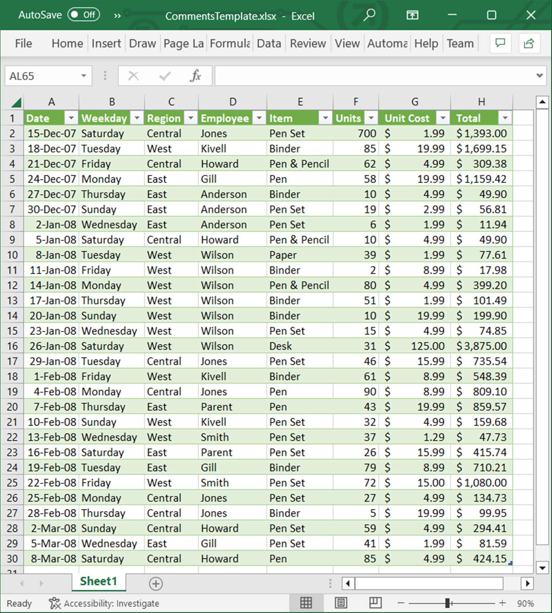
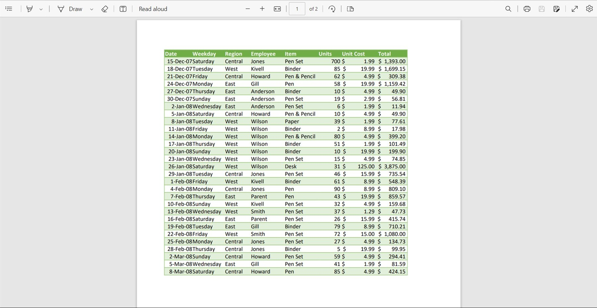

# Excel to PDF Conversion

[XlsIO](https://www.syncfusion.com/document-processing/excel-framework/net/excel-to-pdf-conversion) supports converting an entire workbook or a single worksheet into PDF document. Refer the following links for assemblies/nuget packages required based on platforms to convert Excel document into PDF.

* [Assemblies Information](https://help.syncfusion.com/file-formats/xlsio/assemblies-required#converting-excel-document-to-pdf) 
* [NuGet Information](https://help.syncfusion.com/file-formats/xlsio/nuget-packages-required#converting-excel-document-into-pdf)

N> Worksheet To Image conversion can be performed by referring [Syncfusion.XlsIORenderer.Net.Core](https://www.nuget.org/packages/Syncfusion.XlsIORenderer.Net.Core) NuGet package in UWP platform.

## Workbook to PDF

The following code illustrates how to convert an entire Excel workbook to PDF.

 

using (ExcelEngine excelEngine = new ExcelEngine())
{
   IApplication application = excelEngine.Excel;
   application.DefaultVersion = ExcelVersion.Xlsx;
   FileStream excelStream = new FileStream("Sample.xlsx", FileMode.Open, FileAccess.Read);
   IWorkbook workbook = application.Workbooks.Open(excelStream);

   //Initialize XlsIO renderer.
   XlsIORenderer renderer = new XlsIORenderer();

   //Convert Excel document into PDF document 
   PdfDocument pdfDocument = renderer.ConvertToPDF(workbook);

   Stream stream = new FileStream("ExcelToPDF.pdf", FileMode.Create, FileAccess.ReadWrite);
   pdfDocument.Save(stream);

   excelStream.Dispose();
   stream.Dispose();
}



using(ExcelEngine excelEngine = new ExcelEngine())
{
  IApplication application = excelEngine.Excel;
  application.DefaultVersion = ExcelVersion.Xlsx;
  IWorkbook workbook = application.Workbooks.Open("Sample.xlsx", ExcelOpenType.Automatic);

  //Open the Excel document to Convert
  ExcelToPdfConverter converter = new ExcelToPdfConverter(workbook);

  //Initialize PDF document
  PdfDocument pdfDocument = new PdfDocument();

  //Convert Excel document into PDF document
  pdfDocument = converter.Convert();

  //Save the PDF file
  pdfDocument.Save("ExcelToPDF.pdf");
}



Using excelEngine As ExcelEngine = New ExcelEngine()
  Dim application As IApplication = excelEngine.Excel
  application.DefaultVersion = ExcelVersion.Xlsx
  Dim workbook As IWorkbook = application.Workbooks.Open("Sample.xlsx", ExcelOpenType.Automatic)

  'Open the Excel document to convert
  Dim converter As ExcelToPdfConverter = New ExcelToPdfConverter(workbook)

  'Initialize the PDF document
  Dim pdfDocument As PdfDocument = New PdfDocument()

  'Convert Excel document into PDF document
  pdfDocument = converter.Convert()

  'Save the PDF file
  pdfDocument.Save("ExcelToPDF.pdf")
End Using



A complete working example for converting entire Excel workbook to PDF in C# is present on [this GitHub page](https://github.com/SyncfusionExamples/XlsIO-Examples/tree/master/Excel%20to%20PDF/Workbook%20to%20PDF).    

To learn more about different conversion settings in Excel To PDF conversion, refer the [Excel to PDF conversion settings](https://help.syncfusion.com/file-formats/xlsio/excel-to-pdf-converter-settings). 

## Worksheet to PDF

The following code shows how to convert a particular worksheet to PDF document.



using (ExcelEngine excelEngine = new ExcelEngine())
{
  IApplication application = excelEngine.Excel;
  application.DefaultVersion = ExcelVersion.Xlsx;
  FileStream excelStream = new FileStream("Sample.xlsx", FileMode.Open, FileAccess.Read);
  IWorkbook workbook = application.Workbooks.Open(excelStream);
  IWorksheet worksheet = workbook.Worksheets[0];

  //Initialize XlsIO renderer.
  XlsIORenderer renderer = new XlsIORenderer();

  //Convert Excel document into PDF document 
  PdfDocument pdfDocument = renderer.ConvertToPDF(worksheet);

  Stream stream = new FileStream("ExcelToPDF.pdf", FileMode.Create, FileAccess.ReadWrite);
  pdfDocument.Save(stream);
  excelStream.Dispose();
  stream.Dispose();
}



Using(ExcelEngine excelEngine = new ExcelEngine())
{
  IApplication application = excelEngine.Excel;
  application.DefaultVersion = ExcelVersion.Xlsx;

  IWorkbook workbook = application.Workbooks.Open("Sample.xlsx", ExcelOpenType.Automatic);
  IWorksheet sheet = workbook.Worksheets[0];

  //convert the sheet to PDF
  ExcelToPdfConverter converter = new ExcelToPdfConverter(sheet);

  PdfDocument pdfDocument= new PdfDocument();
  pdfDocument = converter.Convert();
  pdfDocument.Save("ExcelToPDF.pdf");     
}



Using excelEngine As ExcelEngine = New ExcelEngine()
  Dim application As IApplication = excelEngine.Excel
  application.DefaultVersion = ExcelVersion.Xlsx

  Dim workbook As IWorkbook = application.Workbooks.Open("Sample.xlsx", ExcelOpenType.Automatic)
  Dim sheet As IWorksheet = workbook.Worksheets(0)

  'Converts the particular sheet 
  Dim converter As ExcelToPdfConverter = New ExcelToPdfConverter(sheet)

  Dim pdfDocument As PdfDocument = New PdfDocument()
  pdfDocument = converter.Convert()

  'Save the PDF file
  pdfDocument.Save("ExcelToPDF.pdf")
End Using

  

A complete working example for converting particular worksheet to PDF in C# is present on [this GitHub page](https://github.com/SyncfusionExamples/XlsIO-Examples/tree/master/Excel%20to%20PDF/Worksheet%20to%20PDF). 

### Creating individual PDF document for each worksheet

The following code snippet shows how to create an individual PDF document for each worksheet in a workbook.



using (ExcelEngine excelEngine = new ExcelEngine())
{
  IApplication application = excelEngine.Excel;
  applicatin.DefaultVersion = ExcelVersion.Xlsx;
  FileStream excelStream = new FileStream("Sample.xlsx", FileMode.Open, FileAccess.Read);
  IWorkbook workbook = application.Workbooks.Open(excelStream);

  //Initialize XlsIO renderer.
  XlsIORenderer renderer = new XlsIORenderer();
  PdfDocument pdfDocument = new PdfDocument();   

  foreach (IWorksheet sheet in workbook.Worksheets)
  {
    pdfDocument = renderer.ConvertToPDF(sheet);
    //Save the PDF file
    Stream stream = new FileStream(sheet.Name+".pdf", FileMode.Create, FileAccess.ReadWrite);
    pdfDocument.Save(stream);
    stream.Dispose();
  }
  excelStream.Dispose();
}



Using(ExcelEngine excelEngine = new ExcelEngine())
{
  IApplication application = excelEngine.Excel;
  application.DefaultVersion = ExcelVersion.Xlsx;
  IWorkbook workbook = application.Workbooks.Open("Sample.xlsx", ExcelOpenType.Automatic);

  PdfDocument pdfDocument = new PdfDocument();     

  foreach (IWorksheet sheet in workbook.Worksheets)
  {
    ExcelToPdfConverter converter = new ExcelToPdfConverter(sheet);
    pdfDocument = converter.Convert();

    //Save the PDF file
    pdfDocument.Save(sheet.Name+".pdf");
    converter.Dispose();
  }
}



Using excelEngine As ExcelEngine = New ExcelEngine()
  Dim application As IApplication = excelEngine.Excel
  application.DefaultVersion = ExcelVersion.Xlsx
  Dim workbook As IWorkbook = application.Workbooks.Open("Sample.xlsx")

  Dim pdfDocument As New PdfDocument()

  For Each sheet As IWorksheet In workbook.Worksheets
    Dim converter As New ExcelToPdfConverter(sheet)
    PdfDocument = converter.Convert()

    'Save the PDF file
    PdfDocument.Save(sheet.Name + ".pdf")
    converter.Dispose()
  Next
End Using



A complete working example to convert each worksheet into individual PDF in C# is present on [this GitHub page](https://github.com/SyncfusionExamples/XlsIO-Examples/tree/master/Excel%20to%20PDF/Each%20Worksheet%20to%20PDF).
  
## Excel with chart to PDF

XlsIO supports to convert a workbook/worksheet with charts or a single chart into PDF document.

To preserve the charts during Excel To PDF conversion in .NET Framework, initialize the [ChartToImageConverter](https://help.syncfusion.com/cr/file-formats/Syncfusion.XlsIO.IApplication.html#Syncfusion_XlsIO_IApplication_ChartToImageConverter) of [IApplication](https://help.syncfusion.com/cr/file-formats/Syncfusion.XlsIO.IApplication.html) interface. Otherwise the charts present in worksheet gets skipped.

The following code illustrates how to convert an Excel with chart to PDF document.



using (ExcelEngine excelEngine = new ExcelEngine())
{
  IApplication application = excelEngine.Excel;
  application.DefaultVersion = ExcelVersion.Xlsx;

  //Initialize XlsIO renderer.
  XlsIORenderer renderer = new XlsIORenderer();

  FileStream excelStream = new FileStream("chart.xlsx", FileMode.Open, FileAccess.Read);
  IWorkbook workbook = application.Workbooks.Open(excelStream);

  //Convert Excel document with charts into PDF document 
  PdfDocument pdfDocument = renderer.ConvertToPDF(workbook);
  Stream stream = new FileStream("ExcelToPDF.pdf", FileMode.Create, FileAccess.ReadWrite);
  pdfDocument.Save(stream);
  excelStream.Dispose();
  stream.Dispose();
}



Using(ExcelEngine excelEngine = new ExcelEngine())
{
  IApplication application = excelEngine.Excel;
  application.DefaultVersion = ExcelVersion.Xlsx;

  //Instantiating the ChartToImageConverter and assigning the ChartToImageConverter instance of XlsIO application
  application.ChartToImageConverter = new ChartToImageConverter();

  //Tuning chart image quality
  application.ChartToImageConverter.ScalingMode = ScalingMode.Best;
  IWorkbook workbook = application.Workbooks.Open("chart.xlsx");
  IWorksheet worksheet = workbook.Worksheets[0];

  ExcelToPdfConverter converter = new ExcelToPdfConverter(workbook);
  PdfDocument pdfDocument = new PdfDocument();
  pdfDocument = converter.Convert();
  pdfDocument.Save("ExcelToPDF.pdf");
}



Using excelEngine As ExcelEngine = New ExcelEngine()
  Dim application As IApplication = excelEngine.Excel
  application.DefaultVersion = ExcelVersion.Xlsx

  'Instantiating the ChartToImageConverter and assigning the ChartToImageConverter instance of XlsIO application
  application.ChartToImageConverter = New ChartToImageConverter()

  'Tuning chart image quality
  application.ChartToImageConverter.ScalingMode = ScalingMode.Best

  Dim workbook As IWorkbook = application.Workbooks.Open("chart.xlsx")
  Dim worksheet As IWorksheet = workbook.Worksheets(0)
  Dim converter As New ExcelToPdfConverter(workbook)  
  Dim pdfDocument As New PdfDocument()
  pdfDocument = converter.Convert()
  pdfDocument.Save("ExcelToPDF.pdf")
End Using

  

A complete working example to convert Excel chart to PDF in C# is present on [this GitHub page](https://github.com/SyncfusionExamples/XlsIO-Examples/tree/master/Excel%20to%20PDF/Chart%20to%20PDF).

## Excel with comments (notes) to PDF

XlsIO supports to convert a workbook or a worksheet with comments (notes) to PDF documents. By default, comments (notes) will not get converted. To convert the comments in worksheets of an Excel workbook, it is a must to set the print options through [ExcelPrintLocation](https://help.syncfusion.com/cr/file-formats/Syncfusion.XlsIO.ExcelPrintLocation.html) enumeration. This option helps to convert,

* comments as displayed in place,
* comments at the end of the sheet, and
* without comments.

### Convert comments as displayed in place
Comments (notes) will be rendered in the output PDF document as displayed in the Excel file, if the **PrintInPlace** option is selected. The following code illustrates this.



using (ExcelEngine excelEngine = new ExcelEngine())
{
  IApplication application = excelEngine.Excel;
  application.DefaultVersion = ExcelVersion.Xlsx;
  FileStream excelStream = new FileStream("Sample.xlsx", FileMode.Open, FileAccess.Read);
  IWorkbook workbook = application.Workbooks.Open(excelStream);
  IWorksheet worksheet = workbook.Worksheets[0];

  //Set print location to comments
  worksheet.PageSetup.PrintComments = ExcelPrintLocation.PrintInPlace;

  //Initialize XlsIO renderer.
  XlsIORenderer renderer = new XlsIORenderer();

  //Convert Excel document into PDF document 
  PdfDocument pdfDocument = renderer.ConvertToPDF(worksheet);

  Stream stream = new FileStream("ExcelToPDF.pdf", FileMode.Create, FileAccess.ReadWrite);
  pdfDocument.Save(stream);
  excelStream.Dispose();
  stream.Dispose();
}



using (ExcelEngine excelEngine = new ExcelEngine())
{
  IApplication application = excelEngine.Excel;
  application.DefaultVersion = ExcelVersion.Xlsx;
  IWorkbook workbook = application.Workbooks.Open("Sample.xlsx");
  IWorksheet worksheet = workbook.Worksheets[0];

  //Set print location to comments
  worksheet.PageSetup.PrintComments = ExcelPrintLocation.PrintInPlace;
  ExcelToPdfConverter converter = new ExcelToPdfConverter(worksheet);

  //Initialize PDF document
  PdfDocument pdfDocument = new PdfDocument();

  //Convert Excel document into PDF document
  pdfDocument = converter.Convert();

  //Save the PDF file
  pdfDocument.Save("ExcelToPDF.pdf");
  System.Diagnostics.Process.Start("ExcelToPDF.pdf");
}



Using excelEngine As ExcelEngine = New ExcelEngine()
  Dim application As IApplication = excelEngine.Excel
  application.DefaultVersion = ExcelVersion.Xlsx
  Dim workbook As IWorkbook = application.Workbooks.Open("Sample.xlsx", ExcelOpenType.Automatic)
  Dim worksheet As IWorksheet = workbook.Worksheets(0)

  'Set print location to comments
  worksheet.PageSetup.PrintComments = ExcelPrintLocation.PrintInPlace

  'Open the Excel document to convert
  Dim converter As ExcelToPdfConverter = New ExcelToPdfConverter(workbook)

  'Initialize the PDF document
  Dim pdfDocument As PdfDocument = New PdfDocument()

  'Convert Excel document into PDF document
  pdfDocument = converter.Convert()

  'Save the PDF file
  pdfDocument.Save("ExcelToPDF.pdf")
End Using



A complete working example to convert Excel with comments to PDF and render comments in place in C# is present on [this GitHub page](https://github.com/SyncfusionExamples/XlsIO-Examples/tree/master/Excel%20to%20PDF/Comments%20in%20Place%20to%20PDF).

The following screenshot represents the input Excel file with notes

The following screenshot represents the output pdf file generated by the XlsIO using **PrintInPlace** option

### Convert comments at the end of the sheet
Comments (notes) will be rendered in the output PDF document at the end of the each sheet which contains the comments (notes), when the **PrintSheetEnd** option is selected. The following code illustrates this. 



using (ExcelEngine excelEngine = new ExcelEngine())
{
  IApplication application = excelEngine.Excel;
  application.DefaultVersion = ExcelVersion.Xlsx;
  FileStream excelStream = new FileStream("Sample.xlsx", FileMode.Open, FileAccess.Read);
  IWorkbook workbook = application.Workbooks.Open(excelStream);
  IWorksheet worksheet = workbook.Worksheets[0];

  //Set print location to comments
  worksheet.PageSetup.PrintComments = ExcelPrintLocation.PrintSheetEnd;

  //Initialize XlsIO renderer.
  XlsIORenderer renderer = new XlsIORenderer();

  //Convert Excel document into PDF document 
  PdfDocument pdfDocument = renderer.ConvertToPDF(worksheet);
  Stream stream = new FileStream("ExcelToPDF.pdf", FileMode.Create, FileAccess.ReadWrite);
  pdfDocument.Save(stream);
  excelStream.Dispose();
  stream.Dispose();
}



using (ExcelEngine excelEngine = new ExcelEngine())
{
  IApplication application = excelEngine.Excel;
  application.DefaultVersion = ExcelVersion.Xlsx;
  IWorkbook workbook = application.Workbooks.Open("Sample.xlsx");
  IWorksheet worksheet = workbook.Worksheets[0];

  //Set print location to comments
  worksheet.PageSetup.PrintComments = ExcelPrintLocation.PrintSheetEnd;
  ExcelToPdfConverter converter = new ExcelToPdfConverter(worksheet);

  //Initialize PDF document
  PdfDocument pdfDocument = new PdfDocument();

  //Convert Excel document into PDF document
  pdfDocument = converter.Convert();

  //Save the PDF file
  pdfDocument.Save("ExcelToPDF.pdf");
  System.Diagnostics.Process.Start("ExcelToPDF.pdf");
}



Using excelEngine As ExcelEngine = New ExcelEngine()
  Dim application As IApplication = excelEngine.Excel
  application.DefaultVersion = ExcelVersion.Xlsx
  Dim workbook As IWorkbook = application.Workbooks.Open("Sample.xlsx", ExcelOpenType.Automatic)
  Dim worksheet As IWorksheet = workbook.Worksheets(0)

  'Set print location to comments
  worksheet.PageSetup.PrintComments = ExcelPrintLocation.PrintSheetEnd

  'Open the Excel document to convert
  Dim converter As ExcelToPdfConverter = New ExcelToPdfConverter(workbook)

  'Initialize the PDF document
  Dim pdfDocument As PdfDocument = New PdfDocument()

  'Convert Excel document into PDF document
  pdfDocument = converter.Convert()

  'Save the PDF file
  pdfDocument.Save("ExcelToPDF.pdf")
End Using



A complete working example to convert Excel with comments to PDF and render comments at the end in C# is present on [this GitHub page](https://github.com/SyncfusionExamples/XlsIO-Examples/tree/master/Excel%20to%20PDF/Comments%20to%20PDF%20at%20End).

The following screenshot represents the input Excel file with notes

The following screenshot represents the output pdf file generated by the XlsIO using **PrintSheetEnd** option

### Convert without comments
Comments (notes) will not be displayed in the output PDF document, if the **PrintNoComments** option is selected. The following code illustrates this. 



using (ExcelEngine excelEngine = new ExcelEngine())
{
  IApplication application = excelEngine.Excel;
  application.DefaultVersion = ExcelVersion.Xlsx;
  FileStream excelStream = new FileStream("Sample.xlsx", FileMode.Open, FileAccess.Read);
  IWorkbook workbook = application.Workbooks.Open(excelStream);
  IWorksheet worksheet = workbook.Worksheets[0];

  //Set print location to comments
  worksheet.PageSetup.PrintComments = ExcelPrintLocation.PrintNoComments;

  //Initialize XlsIO renderer.
  XlsIORenderer renderer = new XlsIORenderer();

  //Convert Excel document into PDF document 
  PdfDocument pdfDocument = renderer.ConvertToPDF(worksheet);
  Stream stream = new FileStream("ExcelToPDF.pdf", FileMode.Create, FileAccess.ReadWrite);
  pdfDocument.Save(stream);
  excelStream.Dispose();
  stream.Dispose();
}



using (ExcelEngine excelEngine = new ExcelEngine())
{
  IApplication application = excelEngine.Excel;
  application.DefaultVersion = ExcelVersion.Xlsx;
  IWorkbook workbook = application.Workbooks.Open("Sample.xlsx");
  IWorksheet worksheet = workbook.Worksheets[0];

  //Set print location to comments
  worksheet.PageSetup.PrintComments = ExcelPrintLocation.PrintNoComments;
  ExcelToPdfConverter converter = new ExcelToPdfConverter(worksheet);

  //Initialize PDF document
  PdfDocument pdfDocument = new PdfDocument();

  //Convert Excel document into PDF document
  pdfDocument = converter.Convert();

  //Save the PDF file
  pdfDocument.Save("ExcelToPDF.pdf");
  System.Diagnostics.Process.Start("ExcelToPDF.pdf");
}



Using excelEngine As ExcelEngine = New ExcelEngine()
  Dim application As IApplication = excelEngine.Excel
  application.DefaultVersion = ExcelVersion.Xlsx
  Dim workbook As IWorkbook = application.Workbooks.Open("Sample.xlsx", ExcelOpenType.Automatic)
  Dim worksheet As IWorksheet = workbook.Worksheets(0)

  'Set print location to comments
  worksheet.PageSetup.PrintComments = ExcelPrintLocation.PrintNoComments

  'Open the Excel document to convert
  Dim converter As ExcelToPdfConverter = New ExcelToPdfConverter(workbook)

  'Initialize the PDF document
  Dim pdfDocument As PdfDocument = New PdfDocument()

  'Convert Excel document into PDF document
  pdfDocument = converter.Convert()

  'Save the PDF file
  pdfDocument.Save("ExcelToPDF.pdf")
End Using



A complete working example to convert Excel with comments to PDF ignoring the comments in C# is present on [this GitHub page](https://github.com/SyncfusionExamples/XlsIO-Examples/tree/master/Excel%20to%20PDF/No%20Comments%20in%20PDF).

The following screenshot represents the input Excel file with notes

The following screenshot represents the output pdf file generated by the XlsIO using **PrintNoComments** option

## Excel with threaded comments to PDF

XlsIO supports converting threaded comments conversation in Excel document to PDF. To convert the threaded comments to PDF, the print options should be set through [ExcelPrintLocation](https://help.syncfusion.com/cr/file-formats/Syncfusion.XlsIO.ExcelPrintLocation.html) enumeration.

### Convert threaded comments at the end of the sheet

Threaded comments will be rendered in the PDF document at the end of the each sheet, when the **PrintSheetEnd** option is selected. The following code illustrates how to set print options to convert threaded comments.



using (ExcelEngine excelEngine = new ExcelEngine())
{
  IApplication application = excelEngine.Excel;
  application.DefaultVersion = ExcelVersion.Xlsx;
  FileStream inputStream = new FileStream("CommentsTemplate.xlsx", FileMode.Open, FileAccess.Read);
  IWorkbook workbook = application.Workbooks.Open(inputStream);
  IWorksheet worksheet = workbook.Worksheets[0];

  //Add threaded comment
  IThreadedComment threadedComment = worksheet.Range["H16"].AddThreadedComment("What is the reason for the higher total amount of \"desk\"  in the west region?", "User1", DateTime.Now);
  
  //Add reply to the threaded comement
  threadedComment.AddReply("The unit cost of desk is higher compared to other items in the west region. As a result, the total amount is elevated.", "User2", DateTime.Now);
  threadedComment.AddReply("Additionally, Wilson sold 31 desks in the west region, which is also a contributing factor to the increased total amount.", "User3", DateTime.Now);

  //Set print location to threaded comments
  worksheet.PageSetup.PrintComments = ExcelPrintLocation.PrintSheetEnd;

  //Initialize XlsIO renderer.
  XlsIORenderer renderer = new XlsIORenderer();

  //Convert Excel document into PDF document 
  PdfDocument pdfDocument = renderer.ConvertToPDF(worksheet);
  Stream stream = new FileStream("ExcelComments.pdf", FileMode.Create, FileAccess.ReadWrite);
  pdfDocument.Save(stream);
  stream.Dispose();
}



using (ExcelEngine excelEngine = new ExcelEngine())
{
  IApplication application = excelEngine.Excel;
  application.DefaultVersion = ExcelVersion.Xlsx;
  IWorkbook workbook = application.Workbooks.Open("CommentsTemplate.xlsx");
  IWorksheet worksheet = workbook.Worksheets[0];

  //Add threaded comment
  IThreadedComment threadedComment = worksheet.Range["H16"].AddThreadedComment("What is the reason for the higher total amount of \"desk\"  in the west region?", "User1", DateTime.Now);
  
  //Add reply to the threaded comement
  threadedComment.AddReply("The unit cost of desk is higher compared to other items in the west region. As a result, the total amount is elevated.", "User2", DateTime.Now);
  threadedComment.AddReply("Additionally, Wilson sold 31 desks in the west region, which is also a contributing factor to the increased total amount.", "User3", DateTime.Now);
  
  //Set print location to threaded comments
  worksheet.PageSetup.PrintComments = ExcelPrintLocation.PrintSheetEnd;
  ExcelToPdfConverter converter = new ExcelToPdfConverter(worksheet);

  //Initialize PDF document
  PdfDocument pdfDocument = new PdfDocument();

  //Convert Excel document into PDF document
  pdfDocument = converter.Convert();

  //Save the PDF document
  pdfDocument.Save("ExcelComments.pdf");
}



Using excelEngine As ExcelEngine = New ExcelEngine()
  Dim application As IApplication = excelEngine.Excel
  application.DefaultVersion = ExcelVersion.Xlsx
  Dim workbook As IWorkbook = application.Workbooks.Open("CommentsTemplate.xlsx", ExcelOpenType.Automatic)
  Dim worksheet As IWorksheet = workbook.Worksheets(0)

  'Add threaded comment
  Dim threadedComment As IThreadedComment = worksheet.Range("H16").AddThreadedComment("What is the reason for the higher total amount of ""desk""  in the west region?", "User1", DateTime.Now)

  'Add reply to the threaded comement
  threadedComment.AddReply("The unit cost of desk is higher compared to other items in the west region. As a result, the total amount is elevated.", "User2", DateTime.Now)
  threadedComment.AddReply("Additionally, Wilson sold 31 desks in the west region, which is also a contributing factor to the increased total amount.", "User3", DateTime.Now)
  
  'Set print location to threaded comments
  worksheet.PageSetup.PrintComments = ExcelPrintLocation.PrintSheetEnd

  'Open the Excel document to convert
  Dim converter As ExcelToPdfConverter = New ExcelToPdfConverter(workbook)

  'Initialize the PDF document
  Dim pdfDocument As PdfDocument = New PdfDocument()

  'Convert Excel document into PDF document
  pdfDocument = converter.Convert()

  'Save the PDF document
  pdfDocument.Save("ExcelComments.pdf")
End Using



The following screenshot represents the input Excel document with threaded comments

The following screenshot represents the output pdf document generated by the XlsIO using **PrintSheetEnd** option

## Substitute Font in Excel-to-PDF Conversion

By default, XlsIO substitutes unsupported fonts to **Microsoft Sans Serif** in Excel-to-PDF conversion. However, there might be a requirement for substituting a different font or the same font for the unsupported font during the conversion. XlsIO supports substituting unsupported or missing fonts through the event [SubstituteFont](https://help.syncfusion.com/cr/file-formats/Syncfusion.XlsIO.IApplication.html#Syncfusion_XlsIO_IApplication_SubstituteFont). The event has the below arguments:

**AlternateFontName** – Substitutes an available font in the machine for the [OriginalFontName](https://help.syncfusion.com/cr/file-formats/Syncfusion.XlsIO.Implementation.SubstituteFontEventArgs.html#Syncfusion_XlsIO_Implementation_SubstituteFontEventArgs_OriginalFontName).
**AlternateFontStream** – Substitutes a font from stream that is added as embedded resource for the [OriginalFontName](https://help.syncfusion.com/cr/file-formats/Syncfusion.XlsIO.Implementation.SubstituteFontEventArgs.html#Syncfusion_XlsIO_Implementation_SubstituteFontEventArgs_OriginalFontName).	

The following code illustrates how to perform Excel-to-PDF conversion by substituting unsupported fonts in the machine.



using System;
using System.IO;
using Syncfusion.XlsIO;
using Syncfusion.XlsIORenderer;
using Syncfusion.Pdf;
using System.Reflection;

namespace FontSubstitution
{
  class Program
  {
    static void Main(string[] args)
    {
      using (ExcelEngine excelEngine = new ExcelEngine())
      {
        IApplication application = excelEngine.Excel;
        application.DefaultVersion = ExcelVersion.Xlsx;
        //Initializes the SubstituteFont event to perform font substitution during Excel-to-PDF conversion
        application.SubstituteFont += new SubstituteFontEventHandler(SubstituteFont);

        //Initialize XlsIO renderer.
        XlsIORenderer renderer = new XlsIORenderer();

        FileStream excelStream = new FileStream("Template.xlsx", FileMode.Open, FileAccess.Read);
        IWorkbook workbook = application.Workbooks.Open(excelStream);

        //Convert Excel document with charts into PDF document 
        PdfDocument pdfDocument = renderer.ConvertToPDF(workbook);

        Stream stream = new FileStream("ExcelToPDF.pdf", FileMode.Create, FileAccess.ReadWrite);
        pdfDocument.Save(stream);

        excelStream.Dispose();
        stream.Dispose();
      }
    }

    private static void SubstituteFont(object sender, SubstituteFontEventArgs args)
    {
      //Substitute a font if the specified font is not installed in the machine.
      if (args.OriginalFontName == "Arial Unicode MS")
        args.AlternateFontName = "Arial";
      else if (args.OriginalFontName == "Homizio")
      {
        //Substitute by font stream.
        var assembly = Assembly.GetExecutingAssembly();
        var resourceName = "ExceltoPDF.Fonts.Homizio.ttf";
        Stream fileStream = assembly.GetManifestResourceStream(resourceName);
        MemoryStream memoryStream = new MemoryStream();
        fileStream.CopyTo(memoryStream);
        fileStream.Close();
        args.AlternateFontStream = memoryStream;
      }
    }
  }
}



using Syncfusion.ExcelToPdfConverter;
using Syncfusion.Pdf;
using Syncfusion.XlsIO;
using Syncfusion.XlsIO.Implementation;
using System.IO;
using System.Reflection;

namespace FontSubstitution
{
  class Program
  {
    static void Main(string[] args)
    {
      using (ExcelEngine excelEngine = new ExcelEngine())
      {
        IApplication application = excelEngine.Excel;
        application.DefaultVersion = ExcelVersion.Xlsx;

        //Initializes the SubstituteFont event to perform font substitution in Excel-to-PDF conversion.
        application.SubstituteFont += new SubstituteFontEventHandler(SubstituteFont);

        IWorkbook workbook = application.Workbooks.Open("Template.xlsx");
        IWorksheet worksheet = workbook.Worksheets[0];
        ExcelToPdfConverter converter = new ExcelToPdfConverter(workbook);

        PdfDocument pdfDocument = new PdfDocument();
        pdfDocument = converter.Convert();
        pdfDocument.Save("ExcelToPDF.pdf");
      }
    }

    private static void SubstituteFont(object sender, SubstituteFontEventArgs args)
    {
      //Substitute a font if the specified font is not installed in the machine.
      if (args.OriginalFontName == "Arial Unicode MS")
      {
        //Substitute by font name.
        args.AlternateFontName = "Arial";
      }
      else if (args.OriginalFontName == "Homizio")
      {
        //Substitute by font stream.
        var assembly = Assembly.GetExecutingAssembly();
        var resourceName = "ExceltoPDF.Fonts.Homizio.ttf";
        Stream fileStream = assembly.GetManifestResourceStream(resourceName);
        MemoryStream memoryStream = new MemoryStream();
        fileStream.CopyTo(memoryStream);
        fileStream.Close();
        args.AlternateFontStream = memoryStream;
      }
    }
  }
}



Imports Syncfusion.ExcelToPdfConverter
Imports Syncfusion.Pdf
Imports Syncfusion.XlsIO
Imports Syncfusion.XlsIO.Implementation
Imports System.IO
Imports System.Reflection

Namespace FontSubstitution
  
  Class Program
    
    Private Shared Sub Main(ByVal args() As String)
      Dim excelEngine As ExcelEngine = New ExcelEngine
      Dim application As IApplication = excelEngine.Excel
      application.DefaultVersion = ExcelVersion.Xlsx

      'Initializes the SubstituteFont event to perform font substitution in Excel-to-PDF conversion.
      AddHandler application.SubstituteFont, AddressOf Me.SubstituteFont

      Dim workbook As IWorkbook = application.Workbooks.Open("Template.xlsx")
      Dim worksheet As IWorksheet = workbook.Worksheets(0)
      Dim converter As ExcelToPdfConverter = New ExcelToPdfConverter(workbook)
      Dim pdfDocument As PdfDocument = New PdfDocument
      pdfDocument = converter.Convert
      pdfDocument.Save("ExcelToPDF.pdf")
    End Sub
    
    Private Shared Sub SubstituteFont(ByVal sender As Object, ByVal args As SubstituteFontEventArgs)
      'Substitute a font if the specified font is not installed in the machine.
      If (args.OriginalFontName = "Arial Unicode MS") Then
        'Substitute by font name.
        args.AlternateFontName = "Arial"
      ElseIf (args.OriginalFontName = "Homizio") Then
        'Substitute by font stream.
        Dim assembly = Assembly.GetExecutingAssembly
        Dim resourceName = "ExceltoPDF.Fonts.Homizio.ttf"
        Dim fileStream As Stream = assembly.GetManifestResourceStream(resourceName)
        Dim memoryStream As MemoryStream = New MemoryStream
        fileStream.CopyTo(memoryStream)
        fileStream.Close
        args.AlternateFontStream = memoryStream
      End If
      
    End Sub
  End Class
End Namespace

  

## Excel to PDF conversion in Linux OS

In Linux OS, the Excel to PDF conversion can be performed using .NET Core (Targeting .netcoreapp) application. Please refer [Excel to PDF conversion NuGet packages](https://help.syncfusion.com/file-formats/xlsio/nuget-packages-required#converting-excel-document-into-pdf) to know about the packages required to deploy .NET Core (Targeting .netcoreapp) application with Excel to PDF conversion capabilities.

In addition to the previous NuGet packages, SkiaSharp.Linux helper NuGet package is required, that can be generated by the following steps: 

1. Download libSkiaSharp.so [here](https://github.com/mono/SkiaSharp/releases/tag/v1.59.3#).
2. Create a folder and name it as SkiaSharp.Linux and place the downloaded file in the folder structure "SkiaSharp.Linux\runtimes\linux-x64\native"
3. Create a nuspec file with name SkiaSharp.Linux.nuspec using the following metadata information and place it inside SkiaSharp.Linux folder. The nuspec file can be customized.



<?xml version="1.0" encoding="utf-8"?>
<package xmlns="http://schemas.microsoft.com/packaging/2012/06/nuspec.xsd">
  <metadata>
    <id>SkiaSharp.Linux</id>
    <version>1.59.3</version>
    <title>SkiaSharp for Linux</title>
    <authors>Syncfusion Inc.</authors>
    <owners>Syncfusion Inc.</owners>
    <requireLicenseAcceptance>false</requireLicenseAcceptance>
    <description>SkiaSharp for Linux is a supporting package for Linux platforms.</description>
    <tags>linux,cross-platform,skiasharp,net-standard,net-core,excel-to-pdf</tags>
    <dependencies>
      <group targetFramework=".NETStandard1.4">
        <dependency id="SkiaSharp" version="1.59.3" />
      </group>
    </dependencies>
  </metadata>
</package>



4. Make sure that the nuget.exe file is present along with SkiaSharp.Linux folder (in the parent folder of SkiaSharp.Linux folder). If not, download it from [here](https://www.nuget.org/downloads#).
5. Open a command prompt and navigate to SkiaSharp.Linux folder.
6. Execute the following command.

~~~
nuget pack SkiaSharp.Linux\SkiaSharp.Linux.nuspec -outputdirectory "C:\NuGet" 
~~~

The output directory can be customized as per your need.

Now, SkiaSharp.Linux NuGet will be generated in the mentioned output directory and add the generated NuGet as additional reference. SkiaSharp.Linux NuGet package can also be downloaded from [here](https://www.syncfusion.com/downloads/support/directtrac/general/ze/SkiaSharp.Linux.1.59.3-2103435070#).

## Print Excel document

XlsIO supports Excel printing option by converting Excel To PDF and printing that PDF document. The Excel can be printed with specified page setup and printer settings in XlsIO.

The following printer settings can be applied to print Excel in XlsIO. 

 
### Print Excel document 

The following code snippet illustrates how to print the Excel document in XlsIO.



//XlsIO supports Excel To PDF conversion in Windows Forms, WPF, ASP.NET, and ASP.NET MVC platforms. Refer to the Workbook to PDF section to convert using web service.



Using(ExcelEngine excelEngine = new ExcelEngine())
{
  IApplication application = excelEngine.Excel;
  application.DefaultVersion = ExcelVersion.Xlsx;
  IWorkbook workbook = application.Workbooks.Open("Excel.xlsx"));

  // Convert the workbook
  ExcelToPdfConverter converter = new ExcelToPdfConverter(workbook);

  // Print the converted PDF document
  converter.Print();
}




Using excelEngine As ExcelEngine = New ExcelEngine()
  Dim application As IApplication = excelEngine.Excel
  application.DefaultVersion = ExcelVersion.Xlsx
  Dim workbook As IWorkbook = application.Workbooks.Open("Excel.xlsx")

  'Convert the workbook
  Dim converter As ExcelToPdfConverter = New ExcelToPdfConverter(workbook)

  'Print the converted PDF document
  converter.Print()
End Using



### Print with printer settings

The following code snippet illustrates how to print the Excel document with printer settings in XlsIO.



//XlsIO supports Excel To PDF conversion in Windows Forms, WPF, ASP.NET, and ASP.NET MVC platforms. Refer to the Workbook to PDF section to convert using web service.



Using(ExcelEngine excelEngine = new ExcelEngine())
{
  IApplication application = excelEngine.Excel;
  application.DefaultVersion = ExcelVersion.Xlsx;
  IWorkbook workbook = application.Workbooks.Open("Excel.xlsx"));

  //Convert the workbook
  ExcelToPdfConverter converter = new ExcelToPdfConverter(workbook);

  //Initialize the printer settings
  PrinterSettings printerSettings = new PrinterSettings();

  //customizing the printer settings
  printerSettings.PrinterName = "HP LaserJet Pro MFP M127-M128 PCLmS";
  printerSettings.Copies = 2;
  printerSettings.FromPage = 2;
  printerSettings.ToPage = 3;
  printerSettings.DefaultPageSettings.Color = false;
  printerSettings.Duplex = Duplex.Vertical;

  //Print the converted PDF document with printer settings
  converter.Print(printerSettings);
}



Using excelEngine As ExcelEngine = New ExcelEngine()
  Dim application As IApplication = excelEngine.Excel
  application.DefaultVersion = ExcelVersion.Xlsx
  Dim workbook As IWorkbook = application.Workbooks.Open("Excel.xlsx")

  'Convert the workbook
  Dim converter As ExcelToPdfConverter = New ExcelToPdfConverter(workbook)

  'Initialize the printer settings
  Dim printerSettings As PrinterSettings = New PrinterSettings

  'customizing the printer settings
  printerSettings.PrinterName = "HP LaserJet Pro MFP M127-M128 PCLmS"
  printerSettings.Copies = 2
  printerSettings.FromPage = 2
  printerSettings.ToPage = 3
  printerSettings.DefaultPageSettings.Color = false
  printerSettings.Duplex = Duplex.Vertical

  'Print the converted PDF document with printer settings
  converter.Print(printerSettings)
End Using



### Print with Excel To PDF converter settings

The following code snippet illustrates how to print the Excel document with Excel To PDF converter settings in XlsIO.

  

//XlsIO supports Excel To PDF conversion in Windows Forms, WPF, ASP.NET, and ASP.NET MVC platforms. Refer to the Workbook to PDF section to convert using web service.



Using(ExcelEngine excelEngine = new ExcelEngine())
{
  IApplication application = excelEngine.Excel;
  application.DefaultVersion = ExcelVersion.Xlsx;
  IWorkbook workbook = application.Workbooks.Open("Excel.xlsx");

  //Convert the workbook
  ExcelToPdfConverter converter = new ExcelToPdfConverter(workbook);

  //Initializes the Excel To PDF converter setting class
  ExcelToPdfConverterSettings converterSettings = new ExcelToPdfConverterSettings();

  //Layout the page using FitAllColumnsOnOnePage options
  converterSettings.DisplayGridLines = GridLinesDisplayStyle.Visible;
  converterSettings.LayoutOptions = LayoutOptions.FitAllColumnsOnOnePage;

  //Print the converted PDF document with converter settings
  converter.Print(converterSettings);
}



Using excelEngine As ExcelEngine = New ExcelEngine()
  Dim application As IApplication = excelEngine.Excel
  application.DefaultVersion = ExcelVersion.Xlsx
  Dim workbook As IWorkbook = application.Workbooks.Open("Excel.xlsx")

  'Convert the workbook
  Dim converter As ExcelToPdfConverter = New ExcelToPdfConverter(workbook)

  'Initialize the Excel To PDF converter setting class
  Dim converterSettings As ExcelToPdfConverterSettings = New ExcelToPdfConverterSettings

  'Layout the page using FitAllColumnsOnOnePage options
  converterSettings.DisplayGridLines = GridLinesDisplayStyle.Visible
  converterSettings.LayoutOptions = LayoutOptions.FitAllColumnsOnOnePage

  'Print the converted PDF document with converter settings
  converter.Print(converterSettings)
End Using



### Print with Excel To PDF converter and printer settings

The following code snippet illustrates how to print the Excel document with Excel To PDF converter settings and printer settings in XlsIO.

  

//XlsIO supports Excel To PDF conversion in Windows Forms, WPF, ASP.NET, and ASP.NET MVC platforms. Refer to the Workbook to PDF section to convert using web service.



Using(ExcelEngine excelEngine = new ExcelEngine())
{
  IApplication application = excelEngine.Excel;
  application.DefaultVersion = ExcelVersion.Xlsx;
  IWorkbook workbook = application.Workbooks.Open("Excel.xlsx"));

  ExcelToPdfConverter converter = new ExcelToPdfConverter(workbook);

  //Initialize the printer settings
  PrinterSettings printerSettings = new PrinterSettings();

  //customizing the printer settings
  printerSettings.PrinterName = "HP LaserJet Pro MFP M127-M128 PCLmS";
  printerSettings.Copies = 2;
  printerSettings.FromPage = 2;
  printerSettings.ToPage = 3;
  printerSettings.DefaultPageSettings.Color = true;
  printerSettings.Duplex = Duplex.Vertical;
  printerSettings.Collate = true;

  //Initializes the Excel To PDF converter setting class
  ExcelToPdfConverterSettings converterSettings = new ExcelToPdfConverterSettings();

  //Layout the page using FitAllColumnsOnOnePage options
  converterSettings.DisplayGridLines = GridLinesDisplayStyle.Visible;
  converterSettings.LayoutOptions = LayoutOptions.FitAllColumnsOnOnePage;

  //Print the converted PDF document with printer settings and converter settings
  converter.Print(printerSettings, converterSettings);
}



Using excelEngine As ExcelEngine = New ExcelEngine()
  Dim application As IApplication = excelEngine.Excel
  application.DefaultVersion = ExcelVersion.Xlsx
  Dim workbook As IWorkbook = application.Workbooks.Open("Excel.xlsx")
  Dim converter As ExcelToPdfConverter = New ExcelToPdfConverter(workbook)

  'Initialize the printer settings
  Dim printerSettings As PrinterSettings = New PrinterSettings

  'customizing the printer settings
  printerSettings.PrinterName = "HP LaserJet Pro MFP M127-M128 PCLmS"
  printerSettings.Copies = 2
  printerSettings.FromPage = 2
  printerSettings.ToPage = 3
  printerSettings.DefaultPageSettings.Color = true
  printerSettings.Duplex = Duplex.Vertical
  printerSettings.Collate = true

  'Initialize the Excel To PDF converter setting class
  Dim converterSettings As ExcelToPdfConverterSettings = New ExcelToPdfConverterSettings

  'Layout the page using FitAllColumnsOnOnePage options
  converterSettings.DisplayGridLines = GridLinesDisplayStyle.Visible
  converterSettings.LayoutOptions = LayoutOptions.FitAllColumnsOnOnePage

  'Print the converted PDF document with printer settings and converter settings
  converter.Print(printerSettings, converterSettings)
End Using



  
N> Printing is supported only in Windows Forms and WPF platforms.

## Fallback fonts

During Excel to PDF conversions, if a glyph of the input text is unavailable in the specified font, the text will not be rendered properly. To address this, the Syncfusion Excel (XlsIO) library allows users to specify fallback fonts. When a glyph is missing, the library will use one of the fallback fonts to render the text correctly in the output PDF document.

Users can configure fallback fonts in the following ways:
* Initialize default fallback fonts.
* Set custom fonts as fallback fonts for specific script types, including Arabic, Hebrew, Chinese, Japanese, and more.
* Set custom fonts as fallback fonts for a particular range of Unicode text.

N> XlsIO internally uses user-initialized or specified fallback fonts for Unicode characters during Excel to PDF conversion. Therefore, the specified fallback fonts must be installed in the production environment or embedded in the input Excel document (xlsx). Otherwise, it will not render the text properly using the fallback fonts.

### Initialize default fallback fonts

The following code example demonstrates how to initialize a default fallback fonts while converting an Excel document to PDF. The *InitializeDefault* API sets the default fallback fonts for specific script types like Arabic, Hebrew, Chinese, Japanese etc.



using (ExcelEngine excelEngine = new ExcelEngine())
{
    IApplication application = excelEngine.Excel;
    application.DefaultVersion = ExcelVersion.Xlsx;
    FileStream fileStream = new FileStream("Sample.xlsx", FileMode.Open, FileAccess.Read);
    IWorkbook workbook = application.Workbooks.Open(fileStream);
    application.XlsIORenderer = new XlsIORenderer();

    //Initialize fallBack font
    application.FallbackFonts.InitializeDefault();

    //Initialize XlsIO renderer.
    XlsIORenderer renderer = new XlsIORenderer();

    //Convert Excel document into PDF document 
    PdfDocument pdfDocument = renderer.ConvertToPDF(workbook);

    //Save the converted PDF document to stream.
    FileStream stream = new FileStream("ExcelToPDF.pdf", FileMode.Create, FileAccess.ReadWrite);
    pdfDocument.Save(stream);

    //Close and Dispose
    workbook.Close();
    stream.Dispose();
}



using(ExcelEngine excelEngine = new ExcelEngine())
{
    IApplication application = excelEngine.Excel;
    application.DefaultVersion = ExcelVersion.Xlsx;
    IWorkbook workbook = application.Workbooks.Open("Sample.xlsx");

    //Convert Excel document into PDF document
    ExcelToPdfConverter converter = new ExcelToPdfConverter(workbook);

    //Initialize fallback font
    application.FallbackFonts.InitializeDefault();

    //Initialize PdfDocument
    PdfDocument pdfDocument = new PdfDocument();
    pdfDocument = converter.Convert();

    //Save the converted PDF.
    pdfDocument.Save("ExcelToPDF.pdf");
}



Using excelEngine As ExcelEngine = New ExcelEngine()
    Dim application As IApplication = excelEngine.Excel
    application.DefaultVersion = ExcelVersion.Xlsx
    Dim workbook As IWorkbook = application.Workbooks.Open("Sample.xlsx")

    'Convert Excel document into PDF document
    Dim converter As ExcelToPdfConverter = New ExcelToPdfConverter(workbook)

    'Initialize fallback font
    application.FallbackFonts.InitializeDefault()

    'Initialize PdfDocument
    Dim pdfDocument As PdfDocument = New PdfDocument()
    pdfDocument = converter.Convert()

    'Save the converted PDF.
    pdfDocument.Save("ExcelToPDF.pdf")
End Using



A complete working example for Initialize default fallback fonts in C# is present on [this GitHub page](https://github.com/SyncfusionExamples/XlsIO-Examples/tree/master/Excel%20to%20PDF/Initialize%20default%20fallback%20fonts/NET%20Standard/Initialize_default-fallback_fonts).

### Fallback fonts based on script type

The following code example demonstrates how a user can add fallback fonts based on the script types, which XlsIO considers internally when converting an Excel document to PDF.



using (ExcelEngine excelEngine = new ExcelEngine())
{
    IApplication application = excelEngine.Excel;
    application.DefaultVersion = ExcelVersion.Xlsx;
    FileStream fileStream = new FileStream("Sample.xlsx", FileMode.Open, FileAccess.Read);
    IWorkbook workbook = application.Workbooks.Open(fileStream);
    application.XlsIORenderer = new XlsIORenderer();

    //Initialize fallBack font
    application.FallbackFonts.InitializeDefault();

    //Adds fallback font for "Arabic" script type.
    application.FallbackFonts.Add(ScriptType.Arabic, "Arial, Times New Roman");
    //Adds fallback font for "Hebrew" script type.
    application.FallbackFonts.Add(ScriptType.Hebrew, "Arial, Courier New");
    //Adds fallback font for "Thai" script type.
    application.FallbackFonts.Add(ScriptType.Thai, "Tahoma, Microsoft Sans Serif");
    //Adds fallback font for "Korean" script type.
    application.FallbackFonts.Add(ScriptType.Korean, "Malgun Gothic, Batang");

    //Initialize XlsIO renderer.
    XlsIORenderer renderer = new XlsIORenderer();

    //Convert Excel document into PDF document 
    PdfDocument pdfDocument = renderer.ConvertToPDF(workbook);

    //Save the converted PDF document to stream.
    FileStream stream = new FileStream("ExcelToPDF.pdf", FileMode.Create, FileAccess.ReadWrite);
    pdfDocument.Save(stream);

    //Close and Dispose
    workbook.Close();
    stream.Dispose();
}



using (ExcelEngine excelEngine = new ExcelEngine())
{
    IApplication application = excelEngine.Excel;
    application.DefaultVersion = ExcelVersion.Xlsx;
    IWorkbook workbook = application.Workbooks.Open("Sample.xlsx");

    //Convert Excel document into PDF document
    ExcelToPdfConverter converter = new ExcelToPdfConverter(workbook);

    //Initialize fallBack font
    application.FallbackFonts.InitializeDefault();

    //Adds fallback font for "Arabic" script type.
    application.FallbackFonts.Add(ScriptType.Arabic, "Arial, Times New Roman");
    //Adds fallback font for "Hebrew" script type.
    application.FallbackFonts.Add(ScriptType.Hebrew, "Arial, Courier New");
    //Adds fallback font for "Thai" script type.
    application.FallbackFonts.Add(ScriptType.Thai, "Tahoma, Microsoft Sans Serif");
    //Adds fallback font for "Korean" script type.
    application.FallbackFonts.Add(ScriptType.Korean, "Malgun Gothic, Batang");

    //Initialize PdfDocument
    PdfDocument pdfDocument = new PdfDocument();
    pdfDocument = converter.Convert();

    //Save the converted PDF.
    pdfDocument.Save("ExcelToPDFScript.pdf");
}



Using excelEngine As ExcelEngine = New ExcelEngine()
    Dim application As IApplication = excelEngine.Excel
    application.DefaultVersion = ExcelVersion.Xlsx
    Dim workbook As IWorkbook = application.Workbooks.Open("Sample.xlsx")

    'Convert Excel document into PDF document
    Dim converter As ExcelToPdfConverter = New ExcelToPdfConverter(workbook)

    'Initialize fallback font
    application.FallbackFonts.InitializeDefault()

    'Adds fallback font for "Arabic" script type.
    application.FallbackFonts.Add(ScriptType.Arabic, "Arial, Times New Roman")
    'Adds fallback font for "Hebrew" script type.
    application.FallbackFonts.Add(ScriptType.Hebrew, "Arial, Courier New")
    'Adds fallback font for "Thai" script type.
    application.FallbackFonts.Add(ScriptType.Thai, "Tahoma, Microsoft Sans Serif")
    'Adds fallback font for "Korean" script type.
    application.FallbackFonts.Add(ScriptType.Korean, "Malgun Gothic, Batang")

    'Intialize PdfDocument
    Dim pdfDocument As PdfDocument = New PdfDocument()
    pdfDocument = converter.Convert()

    'Save the converted PDF.
    pdfDocument.Save("ExcelToPDF.pdf")
End Using



A complete working example for Fallback fonts based on script type in C# is present on [this GitHub page](https://github.com/SyncfusionExamples/XlsIO-Examples/tree/master/Excel%20to%20PDF/Fallback%20fonts%20based%20on%20script%20type/NET%20Standard/Fallback_fonts_based_on_scripttype).

### Fallback fonts for range of Unicode text

Users can set fallback fonts for specific Unicode range of text to be used in Excel to PDF conversion.

The following code example demonstrates how users can add fallback fonts by using a specific Unicode range of text that XlsIO considers internally while converting an Excel document to PDF.



using (ExcelEngine excelEngine = new ExcelEngine())
{
    IApplication application = excelEngine.Excel;
    application.DefaultVersion = ExcelVersion.Xlsx;
    FileStream fileStream = new FileStream("Sample.xlsx", FileMode.Open, FileAccess.Read);
    IWorkbook workbook = application.Workbooks.Open(fileStream);

    //Initialize XlsIORenderer
    application.XlsIORenderer = new XlsIORenderer();

    //Initialize fallBack font
    application.FallbackFonts.InitializeDefault();

    //Adds fallback font for "Arabic" specific unicode range.
    application.FallbackFonts.Add(new FallbackFont(0x0600,0x06ff,"Arial"));
    //Adds fallback font for "Hebrew" specific unicode range.
    application.FallbackFonts.Add(new FallbackFont(0x0590, 0x05ff, "Times New Roman"));
    //Adds fallback font for "Thai" specific unicode range.
    application.FallbackFonts.Add(new FallbackFont(0x0E00, 0x0E7F, "Tahoma"));
    //Adds fallback font for "Korean" specific unicode range.
    application.FallbackFonts.Add(new FallbackFont(0xAC00, 0xD7A3, "Malgun Gothic"));

    //Initialize XlsIO renderer.
    XlsIORenderer renderer = new XlsIORenderer();

    //Convert Excel document into PDF document 
    PdfDocument pdfDocument = renderer.ConvertToPDF(workbook);

    //Excel to PDF
    Stream stream = new FileStream("ExcelToPDF.pdf", FileMode.Create, FileAccess.ReadWrite);
    pdfDocument.Save(stream);

    //Close and Dispose
    workbook.Close();
    stream.Dispose();
}



using (ExcelEngine excelEngine = new ExcelEngine())
{
    IApplication application = excelEngine.Excel;
    application.DefaultVersion = ExcelVersion.Xlsx;
    IWorkbook workbook = application.Workbooks.Open("Sample.xlsx");

    //Convert Excel document into PDF document
    ExcelToPdfConverter converter = new ExcelToPdfConverter(workbook);

    //Initialize fallBack font
    application.FallbackFonts.InitializeDefault();

    //Adds fallback font for "Arabic" specific unicode range.
    application.FallbackFonts.Add(new FallbackFont(0x0600, 0x06ff, "Arial"));
    //Adds fallback font for "Hebrew" specific unicode range.
    application.FallbackFonts.Add(new FallbackFont(0x0590, 0x05ff, "Times New Roman"));
    //Adds fallback font for "Thai" specific unicode range.
    application.FallbackFonts.Add(new FallbackFont(0x0E00, 0x0E7F, "Tahoma"));
    //Adds fallback font for "Korean" specific unicode range.
    application.FallbackFonts.Add(new FallbackFont(0xAC00, 0xD7A3, "Malgun Gothic"));

    //Initialize PdfDocument
    PdfDocument pdfDocument = new PdfDocument();
    pdfDocument = converter.Convert();

    //Save the converted PDF.
    pdfDocument.Save("ExcelToPDF.pdf");
}



Using excelEngine As ExcelEngine = New ExcelEngine()
    Dim application As IApplication = excelEngine.Excel
    application.DefaultVersion = ExcelVersion.Xlsx
    Dim workbook As IWorkbook = application.Workbooks.Open("Sample.xlsx")

    'Convert Excel document into PDF document
    Dim converter As ExcelToPdfConverter = New ExcelToPdfConverter(workbook)

    'Initialize fallback font
    application.FallbackFonts.InitializeDefault()

    'Adds fallback font for "Arabic" specific unicode range.
    application.FallbackFonts.Add(New FallbackFont(&H600, &H6FF, "Arial"))
    'Adds fallback font for "Hebrew" specific unicode range.
    application.FallbackFonts.Add(New FallbackFont(&H590, &H5FF, "Times New Roman"))
    'Adds fallback font for "Thai" specific unicode range.
    application.FallbackFonts.Add(New FallbackFont(&HE00, &HE7F, "Tahoma"))
    'Adds fallback font for "Korean" specific unicode range.
    application.FallbackFonts.Add(New FallbackFont(&HAC00, &HD7A3, "Malgun Gothic"))

    'Intialize PdfDocument
    Dim pdfDocument As PdfDocument = New PdfDocument()
    pdfDocument = converter.Convert()

    'Save the converted PDF.
    pdfDocument.Save("ExcelToPDF.pdf")
End Using



A complete working example for Fallback fonts for range of Unicode text in C# is present on [this GitHub page](https://github.com/SyncfusionExamples/XlsIO-Examples/tree/master/Excel%20to%20PDF/Fallback%20fonts%20for%20unicode%20range/NET%20Standard/Fallback_fonts_for_unicode_range).

### Modify the existing fallback fonts

The following code example demonstrates how user can modify or customize the existing fallback fonts using *FontNames* API while converting an Excel document to PDF.



using (ExcelEngine excelEngine = new ExcelEngine())
{
    IApplication application = excelEngine.Excel;
    application.DefaultVersion = ExcelVersion.Xlsx;
    FileStream fileStream = new FileStream("Sample.xlsx", FileMode.Open, FileAccess.Read);
    IWorkbook workbook = application.Workbooks.Open(fileStream);
    application.XlsIORenderer = new XlsIORenderer();

    //Initialize fallBack font
    application.FallbackFonts.InitializeDefault();

    FallbackFonts fallbackFonts = application.FallbackFonts;
    foreach(FallbackFont fallbackFont in fallbackFonts)
    {
        //Customize a default fallback font name as "David" for the Hebrew script.
        if (fallbackFont.ScriptType == ScriptType.Hebrew)
            fallbackFont.FontNames = "David";
    }

    //Initialize XlsIO renderer.
    XlsIORenderer renderer = new XlsIORenderer();

    //Convert Excel document into PDF document 
    PdfDocument pdfDocument = renderer.ConvertToPDF(workbook);

    //Save the converted PDF document to stream
    FileStream stream = new FileStream("ExcelToPDF.pdf", FileMode.Create, FileAccess.ReadWrite);
    pdfDocument.Save(stream);

    //Close and Dispose
    workbook.Close();
    stream.Dispose();
}



using (ExcelEngine excelEngine = new ExcelEngine())
{
    IApplication application = excelEngine.Excel;
    application.DefaultVersion = ExcelVersion.Xlsx;
    IWorkbook workbook = application.Workbooks.Open("Sample.xlsx");

    //Convert Excel document into PDF document
    ExcelToPdfConverter converter = new ExcelToPdfConverter(workbook);

    //Initialize fallBack font
    application.FallbackFonts.InitializeDefault();

    FallbackFonts fallbackFonts = application.FallbackFonts;
    foreach (FallbackFont fallbackFont in fallbackFonts)
    {
        //Customize a default fallback font name as "David" for the Hebrew script.
        if (fallbackFont.ScriptType == ScriptType.Hebrew)
            fallbackFont.FontNames = "David";
    }

    //Initialize PdfDocument
    PdfDocument pdfDocument = new PdfDocument();
    pdfDocument = converter.Convert();

    //Save the converted PDF.
    pdfDocument.Save("ExcelToPDFModify.pdf");
}



Using excelEngine As ExcelEngine = New ExcelEngine()
    Dim application As IApplication = excelEngine.Excel
    application.DefaultVersion = ExcelVersion.Xlsx
    Dim workbook As IWorkbook = application.Workbooks.Open("Sample.xlsx")

    'Convert Excel document into PDF document
    Dim converter As ExcelToPdfConverter = New ExcelToPdfConverter(workbook)

    'Initialize fallback font
    application.FallbackFonts.InitializeDefault()

    Dim fallbackFonts As FallbackFonts = application.FallbackFonts
    For Each fallbackFont As FallbackFont In fallbackFonts
        ' Customize a default fallback font name as "David" for the Hebrew script.
        If fallbackFont.ScriptType = ScriptType.Hebrew Then
            fallbackFont.FontNames = "David"
        End If
    Next

    'Intialize PdfDocument
    Dim pdfDocument As PdfDocument = New PdfDocument()
    pdfDocument = converter.Convert()

    'Save the converted PDF.
    pdfDocument.Save("ExcelToPDF.pdf")
End Using



A complete working example for Modify the existing fallback fonts in C# is present on [this GitHub page](https://github.com/SyncfusionExamples/XlsIO-Examples/tree/master/Excel%20to%20PDF/Modify%20the%20existing%20fallback%20fonts/NET%20Standard/Modify_the_existing_fallback_fonts).

### Supported script types

The following table illustrates the supported script types by the .NET Excel library (XlsIO) in Excel to PDF conversion.

<table>
<thead> 
<tr>
<th>Script types</th>
<th>Ranges</th>
<th>Default fallback fonts considered in InitializeDefault() API</th>
</tr>
</thead>
<tr>
<td>
Arabic
</td>
<td>
0x0600 - 0x06ff 
0x0750 - 0x077f 
0x08a0 - 0x08ff 
0xfb50 - 0xfdff 
0xfe70 - 0xfeff 
</td>
<td>
Arial, Times New Roman, Microsoft Uighur
</td>
</tr>
<tr>
<td>
Hebrew
</td>
<td>
0x0590 - 0x05ff 
0xfb1d - 0xfb4f 
</td>
<td>
Arial, Times New Roman, David
</td>
</tr>
<tr>
<td>
Hindi
</td>
<td>
0x0900 - 0x097F 
0xa8e0 - 0xa8ff 
0x1cd0 - 0x1cff 
</td>
<td>
Mangal, Utsaah
</td>
</tr>
<tr>
<td>
Chinese
</td>
<td>
0x4E00 - 0x9FFF 
0x3400 - 0x4DBF 
0xd840 - 0xd869 
0xdc00 - 0xdedf 
0xA960 - 0xA97F 
0xFF00 - 0xFFEF 
0x3000 - 0x303F 
</td>
<td>
DengXian, MingLiU, MS Gothic
</td>
</tr>
<tr>
<td>
Japanese
</td>
<td>
0x30A0 - 0x30FF 
0x3040 - 0x309F 
</td>
<td>
Yu Mincho, MS Mincho
</td>
</tr>
<tr>
<td>
Thai 
</td>
<td>
0x0E00 - 0x0E7F
</td>
<td>
Tahoma, Microsoft Sans Serif
</td>
</tr>
<tr>
<td>
Korean 
</td>
<td>
0xAC00 - 0xD7A3 
0x1100 - 0x11FF 
0x3130 - 0x318F 
0xA960 - 0xA97F 
0xD7B0 - 0xD7FF 
0xAC00 - 0xD7AF 
</td>
<td>
Malgun Gothic, Batang
</td>
</tr>
</table>

## Supported elements

This feature supports the following elements:

* Styles
* Rich-text formatting
* Headers and footers
* Images
* Picture recolor
	* Black and white
	* Color change
	* DuoTone
	* Gray scale
* Text boxes
* Hyperlinks
* Document properties
* Table styles
* Text rotations
* Excel page setup options
* Unicode
* Print titles
* Page breaks
* Print area
* Print order
* 2D charts
* 3D charts
* AutoShapes
* Group shapes
* Conditional formats
* Pivot tables
* Comments
* Form controls
	* Check box
	* Combo box
	* Option button
* Linear and Radial Gradient fill
	* Cells
	* Shapes

## Unsupported elements

The following list contains unsupported elements that presently not preserved in the generated PDF document: 

* Sparklines
* Pivot charts
* SmartArt graphics
* Different first page headers
* Different odd and even pages
* Tables
	* Custom styles
* Row and column headings
* ActiveX controls
* OLE objects

N> Explore our [.NET Excel Library](https://www.syncfusion.com/document-processing/excel-framework/net) Feature Tour page and [.Net Excel Framework demo](https://www.syncfusion.com/demos/fileformats/excel-library) that shows how to create and modify Excel files from C# with 5 lines of code on different platforms.
