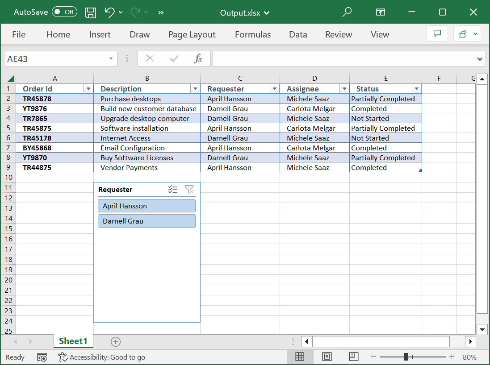
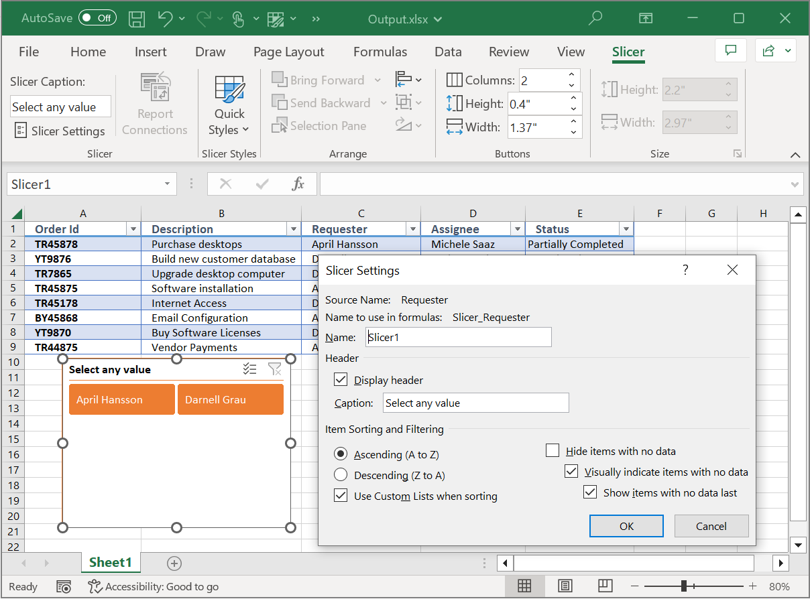

# Working with Excel Slicer

Slicers are UI filters that help to display only specific data based on the selection criteria. They provide easy and simple UI options to enable or disable the filters in a table.

Syncfusion XlsIO supports below features.

* Create slicers and filter table data.
* Format slicers with built-in styles. 

## Create Slicer

The following code snippet explains how to create a table slicer.



using (ExcelEngine excelEngine = new ExcelEngine())
{
  IApplication application = excelEngine.Excel;
  application.DefaultVersion = ExcelVersion.Xlsx;
  IWorkbook workbook = application.Workbooks.Open("Sample.xlsx", ExcelOpenType.Automatic);
  IWorksheet sheet = workbook.Worksheets[0];

  //Access the table.
  IListObject table = sheet.ListObjects[0];

  //Add slicer for the table.
  sheet.Slicers.Add(table, 3, 11, 2);

  workbook.SaveAs("Output.xlsx");
}



Using excelEngine As ExcelEngine = New ExcelEngine
  Dim application As IApplication = excelEngine.Excel
  application.DefaultVersion = ExcelVersion.Xlsx
  Dim workbook As IWorkbook = application.Workbooks.Open("Sample.xlsx", ExcelOpenType.Automatic)
  Dim sheet As IWorksheet = workbook.Worksheets(0)

  'Access the first table.
  Dim table As IListObject = sheet.ListObjects(0)

  'Add slicer for the table.
  sheet.Slicers.Add(table, 3, 11, 2)

  workbook.SaveAs("Output.xlsx")
End Using



using (ExcelEngine excelEngine = new ExcelEngine())
{
  IApplication application = excelEngine.Excel;
  application.DefaultVersion = ExcelVersion.Xlsx;

  Assembly assembly = typeof(App).GetTypeInfo().Assembly;
  Stream inputStream = assembly.GetManifestResourceStream("Table.Sample.xlsx");
  IWorkbook workbook = await application.Workbooks.OpenAsync(inputStream, ExcelOpenType.Automatic);
  IWorksheet sheet = workbook.Worksheets[0];

  //Access the first table.
  IListObject table = sheet.ListObjects[0];

  //Add slicer for the table.
  sheet.Slicers.Add(table, 3, 11, 2);

  //Initializes FileSavePicker      
  FileSavePicker savePicker = new FileSavePicker();
  savePicker.SuggestedStartLocation = PickerLocationId.Desktop;
  savePicker.SuggestedFileName = "Output";
  savePicker.FileTypeChoices.Add("Excel Files", new List<string>() { ".xlsx" });

  //Creates a storage file from FileSavePicker            
  StorageFile storageFile = await savePicker.PickSaveFileAsync();

  //Saves changes to the specified storage file
  await workbook.SaveAsAsync(storageFile);
}



using (ExcelEngine excelEngine = new ExcelEngine())
{
  IApplication application = excelEngine.Excel;
  application.DefaultVersion = ExcelVersion.Xlsx;
  FileStream inputStream = new FileStream("Sample.xlsx", FileMode.Open, FileAccess.Read);
  IWorkbook workbook = application.Workbooks.Open(inputStream, ExcelOpenType.Automatic);
  IWorksheet sheet = workbook.Worksheets[0];

  //Access the table.
  IListObject table = sheet.ListObjects[0];

  //Add slicer for the table.
  sheet.Slicers.Add(table, 3, 11, 2);

  FileStream stream = new FileStream("Output.xlsx", FileMode.Create, FileAccess.ReadWrite);
  workbook.SaveAs(stream);
  stream.Dispose();
}



using (ExcelEngine excelEngine = new ExcelEngine())
{
  IApplication application = excelEngine.Excel;
  application.DefaultVersion = ExcelVersion.Xlsx;

  //Gets assembly
  Assembly assembly = typeof(App).GetTypeInfo().Assembly;

  //Gets input Excel document from an embedded resource collection
  Stream inputStream = assembly.GetManifestResourceStream("Table.Sample.xlsx");

  IWorkbook workbook = application.Workbooks.Open(inputStream, ExcelOpenType.Automatic);
  IWorksheet sheet = workbook.Worksheets[0];

  //Access the table.
  IListObject table = sheet.ListObjects[0];

  //Add slicer for the table.
  sheet.Slicers.Add(table, 3, 11, 2);

  //Saving the workbook as stream
  MemoryStream stream = new MemoryStream();
  workbook.SaveAs(stream);

  stream.Position = 0;

  //Save the document as file and view the saved document
  //The operation in SaveAndView under Xamarin varies between Windows Phone, Android and iOS platforms. Please refer xlsio/xamarin section for respective code samples.
  if (Device.OS == TargetPlatform.WinPhone || Device.OS == TargetPlatform.Windows)
  {
    Xamarin.Forms.DependencyService.Get<ISaveWindowsPhone>().SaveAndView("Output.xlsx", "application/msexcel", stream);
  }
  else
  {
    Xamarin.Forms.DependencyService.Get<ISave>().SaveAndView("Output.xlsx", "application/msexcel", stream);
  }
}



## Slicer Properties

### Slicer name

The existing name of a slicer can be obtained or changed through **Name** property. 



ISlicer slicer = worksheet.Slicers[0];
slicer.Name = "Slicer1";



ISlicer slicer = worksheet.Slicers(0)
slicer.Name = "Slicer1"



ISlicer slicer = worksheet.Slicers[0];
slicer.Name = "Slicer1";



ISlicer slicer = worksheet.Slicers[0];
slicer.Name = "Slicer1";



ISlicer slicer = worksheet.Slicers[0];
slicer.Name = "Slicer1";



### Slicer caption

Slicer caption can be modified through **Caption** property. 



ISlicer slicer = worksheet.Slicers[0];
slicer.Caption = "Select any value";



ISlicer slicer = worksheet.Slicers(0)
slicer.Caption = "Select any value"



ISlicer slicer = worksheet.Slicers[0];
slicer.Caption = "Select any value";



ISlicer slicer = worksheet.Slicers[0];
slicer.Caption = "Select any value";



ISlicer slicer = worksheet.Slicers[0];
slicer.Caption = "Select any value";



### Positioning a Slicer

Slicer can be positioned in the worksheet as required, as below.



ISlicer slicer = worksheet.Slicers[0];
slicer.Top = 100;
slicer.Left = 300;



ISlicer slicer = worksheet.Slicers(0)
slicer.Top = 100
slicer.Left = 300



ISlicer slicer = worksheet.Slicers[0];
slicer.Top = 100;
slicer.Left = 300;



ISlicer slicer = worksheet.Slicers[0];
slicer.Top = 100;
slicer.Left = 300;



ISlicer slicer = worksheet.Slicers[0];
slicer.Top = 100;
slicer.Left = 300;



### Resize a Slicer

A slicer can be resized as shown below.



ISlicer slicer = worksheet.Slicers[0];
slicer.Height = 200;
slicer.Width = 150;



ISlicer slicer = worksheet.Slicers(0)
slicer.Height = 200
slicer.Width = 150



ISlicer slicer = worksheet.Slicers[0];
slicer.Height = 200;
slicer.Width = 150;



ISlicer slicer = worksheet.Slicers[0];
slicer.Height = 200;
slicer.Width = 150;



ISlicer slicer = worksheet.Slicers[0];
slicer.Height = 200;
slicer.Width = 150;



### Resize Slicer item

Slicer item can also the resized, as shown below.



ISlicer slicer = worksheet.Slicers[0];
slicer.SlicerItemHeight = 0.4;
slicer.SlicerItemWidth = 80;



ISlicer slicer = worksheet.Slicers(0)
slicer.SlicerItemHeight = 0.4
slicer.SlicerItemWidth = 80



ISlicer slicer = worksheet.Slicers[0];
slicer.SlicerItemHeight = 0.4;
slicer.SlicerItemWidth = 80;



ISlicer slicer = worksheet.Slicers[0];
slicer.SlicerItemHeight = 0.4;
slicer.SlicerItemWidth = 80;



ISlicer slicer = worksheet.Slicers[0];
slicer.SlicerItemHeight = 0.4;
slicer.SlicerItemWidth = 80;



### Slicer columns

Select the number of columns inside a slicer as below.



ISlicer slicer = worksheet.Slicers[0];
slicer.NumberOfColumns = 2;



ISlicer slicer = worksheet.Slicers(0)
slicer.NumberOfColumns = 2



ISlicer slicer = worksheet.Slicers[0];
slicer.NumberOfColumns = 2;



ISlicer slicer = worksheet.Slicers[0];
slicer.NumberOfColumns = 2;



ISlicer slicer = worksheet.Slicers[0];
slicer.NumberOfColumns = 2;



### Slicer header

A slicer header can be shown or hidden through **DisplayHeader** property.



ISlicer slicer = worksheet.Slicers[0];
slicer.DisplayHeader = true;



ISlicer slicer = worksheet.Slicers(0)
slicer.DisplayHeader = True



ISlicer slicer = worksheet.Slicers[0];
slicer.DisplayHeader = true;



ISlicer slicer = worksheet.Slicers[0];
slicer.DisplayHeader = true;



ISlicer slicer = worksheet.Slicers[0];
slicer.DisplayHeader = true;



### Slicer style

Slicer style can be selected as shown below.



ISlicer slicer = worksheet.Slicers[0];
slicer.SlicerStyle = ExcelSlicerStyle.SlicerStyleDark2;



ISlicer slicer = worksheet.Slicers(0)
slicer.SlicerStyle = ExcelSlicerStyle.SlicerStyleDark2



ISlicer slicer = worksheet.Slicers[0];
slicer.SlicerStyle = ExcelSlicerStyle.SlicerStyleDark2;



ISlicer slicer = worksheet.Slicers[0];
slicer.SlicerStyle = ExcelSlicerStyle.SlicerStyleDark2;



ISlicer slicer = worksheet.Slicers[0];
slicer.SlicerStyle = ExcelSlicerStyle.SlicerStyleDark2;



The following code snippet illustrates how to format an existing slicer with all the above discussed properties. 



using (ExcelEngine excelEngine = new ExcelEngine())
{
  IApplication application = excelEngine.Excel;
  application.DefaultVersion = ExcelVersion.Xlsx;
  IWorkbook workbook = application.Workbooks.Open("Sample.xlsx", ExcelOpenType.Automatic);
  IWorksheet sheet = workbook.Worksheets[0];

  //Access the table
  IListObject table = sheet.ListObjects[0];

  //Add slicer for the table
  sheet.Slicers.Add(table, 3, 11, 2);

  //Access the slicer
  ISlicer slicer = worksheet.Slicers[0];

  //Slicer name
  slicer.Name = "Slicer1";

  //Slicer caption
  slicer.Caption = "Select any value";

  //Positioning a Slicer
  slicer.Top = 100;
  slicer.Left = 300;

  //Resize a Slicer
  slicer.Height = 200;
  slicer.Width = 150;

  //Resize Slicer item
  slicer.SlicerItemHeight = 0.4;
  slicer.SlicerItemWidth = 80;

  //Slicer columns
  slicer.NumberOfColumns = 2;

  //Slicer header
  slicer.DisplayHeader = true;

  //Slicer style
  slicer.SlicerStyle = ExcelSlicerStyle.SlicerStyleDark2;

  workbook.SaveAs("Output.xlsx");
}



Using excelEngine As ExcelEngine = New ExcelEngine
  Dim application As IApplication = excelEngine.Excel
  application.DefaultVersion = ExcelVersion.Xlsx
  Dim workbook As IWorkbook = application.Workbooks.Open("Sample.xlsx", ExcelOpenType.Automatic)
  Dim sheet As IWorksheet = workbook.Worksheets(0)

  'Access the first table.
  Dim table As IListObject = sheet.ListObjects(0)

  'Add slicer for the table
  sheet.Slicers.Add(table, 3, 11, 2)

  'Access the slicer
  Dim slicer As ISlicer = worksheet.Slicers(0)

  'Slicer name
  slicer.Name = "Slicer1"

  'Slicer caption
  slicer.Caption = "Select any value"

  'Positioning a Slicer
  slicer.Top = 100
  slicer.Left = 300

  'Resize a Slicer
  slicer.Height = 200
  slicer.Width = 150

  'Resize Slicer item
  slicer.SlicerItemHeight = 0.4
  slicer.SlicerItemWidth = 80

  'Slicer columns
  slicer.NumberOfColumns = 2

  'Slicer header
  slicer.DisplayHeader = True

  'Slicer style
  slicer.SlicerStyle = ExcelSlicerStyle.SlicerStyleDark2

  workbook.SaveAs("Output.xlsx")
End Using



using (ExcelEngine excelEngine = new ExcelEngine())
{
  IApplication application = excelEngine.Excel;
  application.DefaultVersion = ExcelVersion.Xlsx;

  Assembly assembly = typeof(App).GetTypeInfo().Assembly;
  Stream inputStream = assembly.GetManifestResourceStream("Table.Sample.xlsx");
  IWorkbook workbook = await application.Workbooks.OpenAsync(inputStream, ExcelOpenType.Automatic);
  IWorksheet sheet = workbook.Worksheets[0];

  //Access the table
  IListObject table = sheet.ListObjects[0];

  //Add slicer for the table
  sheet.Slicers.Add(table, 3, 11, 2);

  //Access the slicer
  ISlicer slicer = worksheet.Slicers[0];

  //Slicer name
  slicer.Name = "Slicer1";

  //Slicer caption
  slicer.Caption = "Select any value";

  //Positioning a Slicer
  slicer.Top = 100;
  slicer.Left = 300;

  //Resize a Slicer
  slicer.Height = 200;
  slicer.Width = 150;

  //Resize Slicer item
  slicer.SlicerItemHeight = 0.4;
  slicer.SlicerItemWidth = 80;

  //Slicer columns
  slicer.NumberOfColumns = 2;

  //Slicer header
  slicer.DisplayHeader = true;

  //Slicer style
  slicer.SlicerStyle = ExcelSlicerStyle.SlicerStyleDark2;

  //Initializes FileSavePicker      
  FileSavePicker savePicker = new FileSavePicker();
  savePicker.SuggestedStartLocation = PickerLocationId.Desktop;
  savePicker.SuggestedFileName = "Output";
  savePicker.FileTypeChoices.Add("Excel Files", new List<string>() { ".xlsx" });

  //Creates a storage file from FileSavePicker            
  StorageFile storageFile = await savePicker.PickSaveFileAsync();

  //Saves changes to the specified storage file
  await workbook.SaveAsAsync(storageFile);
}



using (ExcelEngine excelEngine = new ExcelEngine())
{
  IApplication application = excelEngine.Excel;
  application.DefaultVersion = ExcelVersion.Xlsx;
  FileStream inputStream = new FileStream("Sample.xlsx", FileMode.Open, FileAccess.Read);
  IWorkbook workbook = application.Workbooks.Open(inputStream, ExcelOpenType.Automatic);
  IWorksheet sheet = workbook.Worksheets[0];

  //Access the table
  IListObject table = sheet.ListObjects[0];

  //Add slicer for the table
  sheet.Slicers.Add(table, 3, 11, 2);

  //Access the slicer
  ISlicer slicer = worksheet.Slicers[0];

  //Slicer name
  slicer.Name = "Slicer1";

  //Slicer caption
  slicer.Caption = "Select any value";

  //Positioning a Slicer
  slicer.Top = 100;
  slicer.Left = 300;

  //Resize a Slicer
  slicer.Height = 200;
  slicer.Width = 150;

  //Resize Slicer item
  slicer.SlicerItemHeight = 0.4;
  slicer.SlicerItemWidth = 80;

  //Slicer columns
  slicer.NumberOfColumns = 2;

  //Slicer header
  slicer.DisplayHeader = true;

  //Slicer style
  slicer.SlicerStyle = ExcelSlicerStyle.SlicerStyleDark2;

  FileStream stream = new FileStream("Output.xlsx", FileMode.Create, FileAccess.ReadWrite);
  workbook.SaveAs(stream);
  stream.Dispose();
}



using (ExcelEngine excelEngine = new ExcelEngine())
{
  IApplication application = excelEngine.Excel;
  application.DefaultVersion = ExcelVersion.Xlsx;

  //Gets assembly
  Assembly assembly = typeof(App).GetTypeInfo().Assembly;

  //Gets input Excel document from an embedded resource collection
  Stream inputStream = assembly.GetManifestResourceStream("Table.Sample.xlsx");

  IWorkbook workbook = application.Workbooks.Open(inputStream, ExcelOpenType.Automatic);
  IWorksheet sheet = workbook.Worksheets[0];

  //Access the table
  IListObject table = sheet.ListObjects[0];

  //Add slicer for the table
  sheet.Slicers.Add(table, 3, 11, 2);

  //Access the slicer
  ISlicer slicer = worksheet.Slicers[0];

  //Slicer name
  slicer.Name = "Slicer1";

  //Slicer caption
  slicer.Caption = "Select any value";

  //Positioning a Slicer
  slicer.Top = 100;
  slicer.Left = 300;

  //Resize a Slicer
  slicer.Height = 200;
  slicer.Width = 150;

  //Resize Slicer item
  slicer.SlicerItemHeight = 0.4;
  slicer.SlicerItemWidth = 80;

  //Slicer columns
  slicer.NumberOfColumns = 2;

  //Slicer header
  slicer.DisplayHeader = true;

  //Slicer style
  slicer.SlicerStyle = ExcelSlicerStyle.SlicerStyleDark2;

  //Saving the workbook as stream
  MemoryStream stream = new MemoryStream();
  workbook.SaveAs(stream);

  stream.Position = 0;

  //Save the document as file and view the saved document
  //The operation in SaveAndView under Xamarin varies between Windows Phone, Android and iOS platforms. Please refer xlsio/xamarin section for respective code samples.
  if (Device.OS == TargetPlatform.WinPhone || Device.OS == TargetPlatform.Windows)
  {
    Xamarin.Forms.DependencyService.Get<ISaveWindowsPhone>().SaveAndView("Output.xlsx", "application/msexcel", stream);
  }
  else
  {
    Xamarin.Forms.DependencyService.Get<ISave>().SaveAndView("Output.xlsx", "application/msexcel", stream);
  }
}



