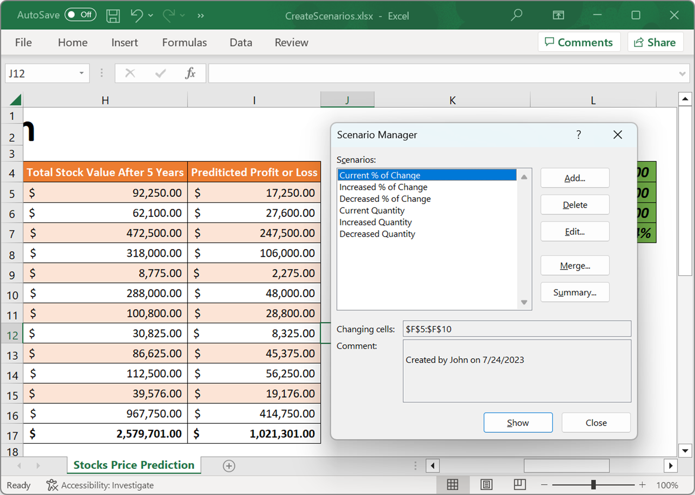
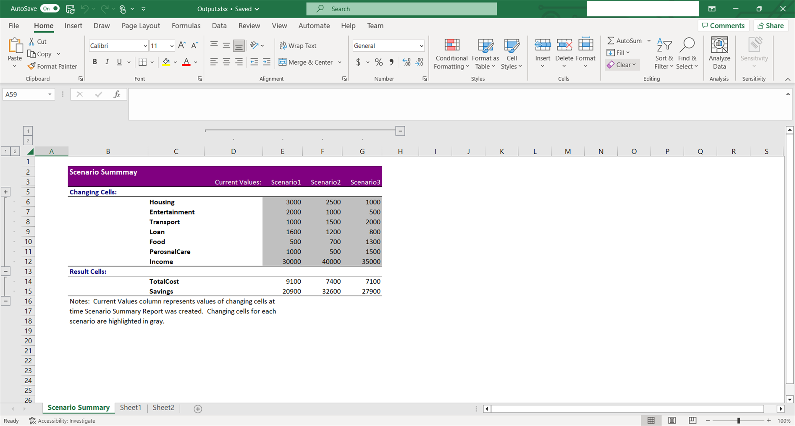

# What-If Analysis

What-If Analysis is the process of changing the values in cells to see how those changes will affect the outcome of formulas on the worksheet. XlsIO supports the What-If Analysis of Scenarios type.

## Scenario Manager
Scenario Manager in Excel allows you to create and manage scenarios for different sets of input values to see how they impact the results of formulas in a worksheet.

### Create Scenario

The following code snippet explains how to create scenarios for different values in an Excel worksheet.



using (ExcelEngine excelEngine = new ExcelEngine())
{
    IApplication application = excelEngine.Excel;
    application.DefaultVersion = ExcelVersion.Xlsx;
    FileStream inputStream = new FileStream("InputTemplate.xlsx", FileMode.Open, FileAccess.Read);
    IWorkbook workbook = application.Workbooks.Open(inputStream, ExcelOpenType.Automatic);
    IWorksheet worksheet = workbook.Worksheets[0];

    IScenarios scenarios = worksheet.Scenarios;

    //Initialize list objects with different values for scenarios
    List<object> currentChangePercentage_Values = new List<object> { 0.23, 0.8, 1.1, 0.5, 0.35, 0.2};
    List<object> increasedChangePercentage_Values = new List<object> { 0.45, 0.56, 0.9, 0.5, 0.58, 0.43};
    List<object> decreasedChangePercentage_Values = new List<object> { 0.3, 0.2, 0.5, 0.3, 0.5, 0.23};
    List<object> currentQuantity_Values = new List<object> { 1500, 3000, 5000, 4000, 500, 4000 };
    List<object> increasedQuantity_Values = new List<object> { 1000, 5000, 4500, 3900, 10000, 8900 };
    List<object> decreasedQuantity_Values = new List<object> { 1000, 2000, 3000, 3000, 300, 4000 };

    //Add scenarios in the worksheet with different values for the same cells
    scenarios.Add("Current % of Change", worksheet.Range["F5:F10"], currentChangePercentage_Values);
    scenarios.Add("Increased % of Change", worksheet.Range["F5:F10"], increasedChangePercentage_Values);
    scenarios.Add("Decreased % of Change", worksheet.Range["F5:F10"], decreasedChangePercentage_Values);
    scenarios.Add("Current Quantity", worksheet.Range["D5:D10"], currentQuantity_Values);
    scenarios.Add("Increased Quantity", worksheet.Range["D5:D10"], increasedQuantity_Values);
    scenarios.Add("Decreased Quantity", worksheet.Range["D5:D10"], decreasedQuantity_Values);

    //Saving the workbook as stream
    FileStream stream = new FileStream("Output.xlsx", FileMode.Create, FileAccess.ReadWrite);
    workbook.SaveAs(stream);
    stream.Dispose();
}



using (ExcelEngine excelEngine = new ExcelEngine())
{
    IApplication application = excelEngine.Excel;
    application.DefaultVersion = ExcelVersion.Xlsx;
    IWorkbook workbook = application.Workbooks.Open("InputTemplate.xlsx", ExcelOpenType.Automatic);
    IWorksheet worksheet = workbook.Worksheets[0];

    IScenarios scenarios = worksheet.Scenarios;

    //Initialize list objects with different values for scenarios
    List<object> currentChangePercentage_Values = new List<object> { 0.23, 0.8, 1.1, 0.5, 0.35, 0.2};
    List<object> increasedChangePercentage_Values = new List<object> { 0.45, 0.56, 0.9, 0.5, 0.58, 0.43};
    List<object> decreasedChangePercentage_Values = new List<object> { 0.3, 0.2, 0.5, 0.3, 0.5, 0.23};
    List<object> currentQuantity_Values = new List<object> { 1500, 3000, 5000, 4000, 500, 4000 };
    List<object> increasedQuantity_Values = new List<object> { 1000, 5000, 4500, 3900, 10000, 8900 };
    List<object> decreasedQuantity_Values = new List<object> { 1000, 2000, 3000, 3000, 300, 4000 };

    //Add scenarios in the worksheet with different values for the same cells
    scenarios.Add("Current % of Change", worksheet.Range["F5:F10"], currentChangePercentage_Values);
    scenarios.Add("Increased % of Change", worksheet.Range["F5:F10"], increasedChangePercentage_Values);
    scenarios.Add("Decreased % of Change", worksheet.Range["F5:F10"], decreasedChangePercentage_Values);
    scenarios.Add("Current Quantity", worksheet.Range["D5:D10"], currentQuantity_Values);
    scenarios.Add("Increased Quantity", worksheet.Range["D5:D10"], increasedQuantity_Values);
    scenarios.Add("Decreased Quantity", worksheet.Range["D5:D10"], decreasedQuantity_Values);

    //Saving the workbook
    workbook.SaveAs("Output.xlsx");
}



Using excelEngine As ExcelEngine = New ExcelEngine

    Dim application As IApplication = excelEngine.Excel
    application.DefaultVersion = ExcelVersion.Xlsx
    Dim workbook As IWorkbook = application.Workbooks.Open("InputTemplate.xlsx", ExcelOpenType.Automatic)
    Dim worksheet As IWorksheet = workbook.Worksheets(0)

    Dim scenarios As IScenarios = worksheet.Scenarios

    Dim currentChangePercentage_Values As List(Of Object) = New List(Of Object)() {0.23, 0.8, 1.1, 0.5, 0.35, 0.2}
    Dim increasedChangePercentage_Values As List(Of Object) = New List(Of Object)() {0.45, 0.56, 0.9, 0.5, 0.58, 0.43}
    Dim decreasedChangePercentage_Values As List(Of Object) = New List(Of Object)() {0.3, 0.2, 0.5, 0.3, 0.5, 0.23}
    Dim currentQuantity_Values As List(Of Object) = New List(Of Object)() {1500, 3000, 5000, 4000, 500, 4000}
    Dim increasedQuantity_Values As List(Of Object) = New List(Of Object)() {1000, 5000, 4500, 3900, 10000, 8900}
    Dim decreasedQuantity_Values As List(Of Object) = New List(Of Object)() {1000, 2000, 3000, 3000, 300, 4000}

    'Add scenarios in the worksheet with different values for the same cells
    scenarios.Add("Current % of Change", worksheet.Range("F5:F10"), currentChangePercentage_Values)
    scenarios.Add("Increased % of Change", worksheet.Range("F5:F10"), increasedChangePercentage_Values)
    scenarios.Add("Decreased % of Change", worksheet.Range("F5:F10"), decreasedChangePercentage_Values)
    scenarios.Add("Current Quantity", worksheet.Range("D5:D10"), currentQuantity_Values)
    scenarios.Add("Increased Quantity", worksheet.Range("D5:D10"), increasedQuantity_Values)
    scenarios.Add("Decreased Quantity", worksheet.Range("D5:D10"), decreasedQuantity_Values)

    'Saving the workbook  
    workbook.SaveAs("Output.xlsx")
End Using



A complete working example to create scenarios in C# is present on [this GitHub page](https://github.com/SyncfusionExamples/XlsIO-Examples/tree/master/What-If%20Analysis/Create%20Scenarios).

By executing the program, you will get the Excel file as below.

### Edit Scenario

An existing scenario can be edited or modified through [ModifyScenario](https://help.syncfusion.com/cr/file-formats/Syncfusion.XlsIO.IScenario.html#Syncfusion_XlsIO_IScenario_ModifyScenario_Syncfusion_XlsIO_IRange_System_Collections_Generic_List_System_Object__) method of [IScenario](https://help.syncfusion.com/cr/file-formats/Syncfusion.XlsIO.IScenario.html).



using (ExcelEngine excelEngine = new ExcelEngine())
{
    IApplication application = excelEngine.Excel;
    application.DefaultVersion = ExcelVersion.Xlsx;
    FileStream inputStream = new FileStream("InputTemplate.xlsx", FileMode.Open, FileAccess.Read);
    IWorkbook workbook = application.Workbooks.Open(inputStream, ExcelOpenType.Automatic);
    IWorksheet worksheet = workbook.Worksheets[0];

    IScenarios scenarios = worksheet.Scenarios;
    IScenario scenario1 = scenarios[0];
    IScenario scenario2 = scenarios[1];

    //Modify the scenario 
    scenario1.ModifyScenario(scenario2.ChangingCells, scenario2.Values);

    //Saving the workbook as stream
    FileStream stream = new FileStream("Output.xlsx", FileMode.Create, FileAccess.ReadWrite);
    workbook.SaveAs(stream);
    stream.Dispose();
}



using (ExcelEngine excelEngine = new ExcelEngine())
{
    IApplication application = excelEngine.Excel;
    application.DefaultVersion = ExcelVersion.Xlsx;
    IWorkbook workbook = application.Workbooks.Open("InputTemplate.xlsx", ExcelOpenType.Automatic);
    IWorksheet worksheet = workbook.Worksheets[0];

    IScenarios scenarios = worksheet.Scenarios;
    IScenario scenario1 = scenarios[0];
    IScenario scenario2 = scenarios[1];

    //Modify the scenario 
    scenario1.ModifyScenario(scenario2.ChangingCells, scenario2.Values);

    //Saving the workbook
    workbook.SaveAs("Output.xlsx");
}



Using excelEngine As ExcelEngine = New ExcelEngine

    Dim application As IApplication = excelEngine.Excel
    application.DefaultVersion = ExcelVersion.Xlsx
    Dim workbook As IWorkbook = application.Workbooks.Open("InputTemplate.xlsx", ExcelOpenType.Automatic)
    Dim worksheet As IWorksheet = workbook.Worksheets(0)

    Dim scenarios As IScenarios = worksheet.Scenarios
    Dim scenario1 As IScenario = scenarios(0)
    Dim scenario2 As IScenario = scenarios(1)

    'Modify the scenario 
    scenario1.ModifyScenario(scenario2.ChangingCells, scenario2.Values)

    'Saving the workbook  
    workbook.SaveAs("Output.xlsx")
End Using



### Delete Scenario

A scenario can be deleted from the Excel worksheet through [Delete](https://help.syncfusion.com/cr/file-formats/Syncfusion.XlsIO.IScenario.html#Syncfusion_XlsIO_IScenario_Delete) method of [IScenario](https://help.syncfusion.com/cr/file-formats/Syncfusion.XlsIO.IScenario.html).



using (ExcelEngine excelEngine = new ExcelEngine())
{
    IApplication application = excelEngine.Excel;
    application.DefaultVersion = ExcelVersion.Xlsx;
    FileStream inputStream = new FileStream("InputTemplate.xlsx", FileMode.Open, FileAccess.Read);
    IWorkbook workbook = application.Workbooks.Open(inputStream, ExcelOpenType.Automatic);
    IWorksheet worksheet = workbook.Worksheets[0];

    IScenarios scenarios = worksheet.Scenarios;
    IScenario scenario1 = scenarios[0];

    //Delete the scenario 
    scenario1.Delete();

    //Saving the workbook as stream
    FileStream stream = new FileStream("Output.xlsx", FileMode.Create, FileAccess.ReadWrite);
    workbook.SaveAs(stream);
    stream.Dispose();
}



using (ExcelEngine excelEngine = new ExcelEngine())
{
    IApplication application = excelEngine.Excel;
    application.DefaultVersion = ExcelVersion.Xlsx;
    IWorkbook workbook = application.Workbooks.Open("InputTemplate.xlsx", ExcelOpenType.Automatic);
    IWorksheet worksheet = workbook.Worksheets[0];

    IScenarios scenarios = worksheet.Scenarios;
    IScenario scenario1 = scenarios[0];
    IScenario scenario2 = scenarios[1];

    //Delete the scenario 
    scenario1.Delete();

    //Saving the workbook
    workbook.SaveAs("Output.xlsx");
}



Using excelEngine As ExcelEngine = New ExcelEngine

    Dim application As IApplication = excelEngine.Excel
    application.DefaultVersion = ExcelVersion.Xlsx
    Dim workbook As IWorkbook = application.Workbooks.Open("InputTemplate.xlsx", ExcelOpenType.Automatic)
    Dim worksheet As IWorksheet = workbook.Worksheets(0)

    Dim scenarios As IScenarios = worksheet.Scenarios
    Dim scenario1 As IScenario = scenarios(0)

    'Delete the scenario
    scenario1.Delete()

    'Saving the workbook  
    workbook.SaveAs("Output.xlsx")
End Using



### Merge Scenario

Scenarios in one Excel worksheet can be merged in to another, using [Merge](https://help.syncfusion.com/cr/file-formats/Syncfusion.XlsIO.IScenarios.html#Syncfusion_XlsIO_IScenarios_Merge_Syncfusion_XlsIO_IWorksheet_) method of [IScenarios](https://help.syncfusion.com/cr/file-formats/Syncfusion.XlsIO.IScenarios.html).



using (ExcelEngine excelEngine = new ExcelEngine())
{
    IApplication application = excelEngine.Excel;
    application.DefaultVersion = ExcelVersion.Xlsx;
    FileStream inputStream = new FileStream("InputTemplate.xlsx", FileMode.Open, FileAccess.Read);
    IWorkbook workbook = application.Workbooks.Open(inputStream, ExcelOpenType.Automatic);
    IWorksheet worksheet1 = workbook.Worksheets[0];
    IWorksheet worksheet2 = workbook.Worksheets[1];

    //Merge the second worksheet scenario into first worksheet.
    worksheet1.Scenarios.Merge(worksheet2);

    //Saving the workbook as stream
    FileStream stream = new FileStream("Output.xlsx", FileMode.Create, FileAccess.ReadWrite);
    workbook.SaveAs(stream);
    stream.Dispose();
}



using (ExcelEngine excelEngine = new ExcelEngine())
{
    IApplication application = excelEngine.Excel;
    application.DefaultVersion = ExcelVersion.Xlsx;
    IWorkbook workbook = application.Workbooks.Open("InputTemplate.xlsx", ExcelOpenType.Automatic);
    IWorksheet worksheet1 = workbook.Worksheets[0];
    IWorksheet worksheet2 = workbook.Worksheets[1];

    //Merge the second worksheet scenario into first worksheet.
    worksheet1.Scenarios.Merge(worksheet2);

    //Saving the workbook
    workbook.SaveAs("Output.xlsx");
}



Using excelEngine As ExcelEngine = New ExcelEngine

    Dim application As IApplication = excelEngine.Excel
    application.DefaultVersion = ExcelVersion.Xlsx
    Dim workbook As IWorkbook = application.Workbooks.Open("InputTemplate.xlsx", ExcelOpenType.Automatic)
    Dim worksheet1 As IWorksheet = workbook.Worksheets(0)
    Dim worksheet2 As IWorksheet = workbook.Worksheets(1)

    'Merge the second worksheet scenario into first worksheet.
    worksheet1.Scenarios.Merge(worksheet2)

    'Saving the workbook  
    workbook.SaveAs("Output.xlsx")
End Using



### Create Summary

[CreateSummary](https://help.syncfusion.com/cr/file-formats/Syncfusion.XlsIO.IScenarios.html#Syncfusion_XlsIO_IScenarios_CreateSummary_Syncfusion_XlsIO_IRange_) method of [IScenarios](https://help.syncfusion.com/cr/file-formats/Syncfusion.XlsIO.IScenarios.html) creates a new worksheet that contains a summary report for the scenarios on the specified worksheet.



using (ExcelEngine excelEngine = new ExcelEngine())
{
    IApplication application = excelEngine.Excel;
    application.DefaultVersion = ExcelVersion.Xlsx;
    FileStream inputStream = new FileStream("InputTemplate.xlsx", FileMode.Open, FileAccess.Read);
    IWorkbook workbook = application.Workbooks.Open(inputStream, ExcelOpenType.Automatic);
    IWorksheet worksheet = workbook.Worksheets[0];

    IScenarios scenarios = worksheet.Scenarios;

    //Initialize list objects with different values for scenarios
    List<object> currentChangePercentage_Values = new List<object> { 0.23, 0.8, 1.1, 0.5, 0.35, 0.2};
    List<object> increasedChangePercentage_Values = new List<object> { 0.45, 0.56, 0.9, 0.5, 0.58, 0.43};
    List<object> decreasedChangePercentage_Values = new List<object> { 0.3, 0.2, 0.5, 0.3, 0.5, 0.23};
    List<object> currentQuantity_Values = new List<object> { 1500, 3000, 5000, 4000, 500, 4000 };
    List<object> increasedQuantity_Values = new List<object> { 1000, 5000, 4500, 3900, 10000, 8900 };
    List<object> decreasedQuantity_Values = new List<object> { 1000, 2000, 3000, 3000, 300, 4000 };

    //Add scenarios in the worksheet with different values for the same cells
    scenarios.Add("Current % of Change", worksheet.Range["F5:F10"], currentChangePercentage_Values);
    scenarios.Add("Increased % of Change", worksheet.Range["F5:F10"], increasedChangePercentage_Values);
    scenarios.Add("Decreased % of Change", worksheet.Range["F5:F10"], decreasedChangePercentage_Values);
    scenarios.Add("Current Quantity", worksheet.Range["D5:D10"], currentQuantity_Values);
    scenarios.Add("Increased Quantity", worksheet.Range["D5:D10"], increasedQuantity_Values);
    scenarios.Add("Decreased Quantity", worksheet.Range["D5:D10"], decreasedQuantity_Values);

    //Create Summary
    worksheet.Scenarios.CreateSummary(worksheet.Range["L7"]);

    //Saving the workbook as stream
    FileStream stream = new FileStream("Output.xlsx", FileMode.Create, FileAccess.ReadWrite);
    workbook.SaveAs(stream);
    stream.Dispose();
}



using (ExcelEngine excelEngine = new ExcelEngine())
{
    IApplication application = excelEngine.Excel;
    application.DefaultVersion = ExcelVersion.Xlsx;
    IWorkbook workbook = application.Workbooks.Open("InputTemplate.xlsx", ExcelOpenType.Automatic);
    IWorksheet worksheet = workbook.Worksheets[0];

    IScenarios scenarios = worksheet.Scenarios;

    //Initialize list objects with different values for scenarios
    List<object> currentChangePercentage_Values = new List<object> { 0.23, 0.8, 1.1, 0.5, 0.35, 0.2};
    List<object> increasedChangePercentage_Values = new List<object> { 0.45, 0.56, 0.9, 0.5, 0.58, 0.43};
    List<object> decreasedChangePercentage_Values = new List<object> { 0.3, 0.2, 0.5, 0.3, 0.5, 0.23};
    List<object> currentQuantity_Values = new List<object> { 1500, 3000, 5000, 4000, 500, 4000 };
    List<object> increasedQuantity_Values = new List<object> { 1000, 5000, 4500, 3900, 10000, 8900 };
    List<object> decreasedQuantity_Values = new List<object> { 1000, 2000, 3000, 3000, 300, 4000 };

    //Add scenarios in the worksheet with different values for the same cells
    scenarios.Add("Current % of Change", worksheet.Range["F5:F10"], currentChangePercentage_Values);
    scenarios.Add("Increased % of Change", worksheet.Range["F5:F10"], increasedChangePercentage_Values);
    scenarios.Add("Decreased % of Change", worksheet.Range["F5:F10"], decreasedChangePercentage_Values);
    scenarios.Add("Current Quantity", worksheet.Range["D5:D10"], currentQuantity_Values);
    scenarios.Add("Increased Quantity", worksheet.Range["D5:D10"], increasedQuantity_Values);
    scenarios.Add("Decreased Quantity", worksheet.Range["D5:D10"], decreasedQuantity_Values);

    //Create Summary
    worksheet.Scenarios.CreateSummary(worksheet.Range["L7"]);

    //Saving the workbook
    workbook.SaveAs("Output.xlsx");
}



Using excelEngine As ExcelEngine = New ExcelEngine

    Dim application As IApplication = excelEngine.Excel
    application.DefaultVersion = ExcelVersion.Xlsx
    Dim workbook As IWorkbook = application.Workbooks.Open("InputTemplate.xlsx", ExcelOpenType.Automatic)
    Dim worksheet As IWorksheet = workbook.Worksheets(0)

    Dim scenarios As IScenarios = worksheet.Scenarios

    Dim currentChangePercentage_Values As List(Of Object) = New List(Of Object)() {0.23, 0.8, 1.1, 0.5, 0.35, 0.2}
    Dim increasedChangePercentage_Values As List(Of Object) = New List(Of Object)() {0.45, 0.56, 0.9, 0.5, 0.58, 0.43}
    Dim decreasedChangePercentage_Values As List(Of Object) = New List(Of Object)() {0.3, 0.2, 0.5, 0.3, 0.5, 0.23}
    Dim currentQuantity_Values As List(Of Object) = New List(Of Object)() {1500, 3000, 5000, 4000, 500, 4000}
    Dim increasedQuantity_Values As List(Of Object) = New List(Of Object)() {1000, 5000, 4500, 3900, 10000, 8900}
    Dim decreasedQuantity_Values As List(Of Object) = New List(Of Object)() {1000, 2000, 3000, 3000, 300, 4000}

    'Add scenarios in the worksheet with different values for the same cells
    scenarios.Add("Current % of Change", worksheet.Range("F5:F10"), currentChangePercentage_Values)
    scenarios.Add("Increased % of Change", worksheet.Range("F5:F10"), increasedChangePercentage_Values)
    scenarios.Add("Decreased % of Change", worksheet.Range("F5:F10"), decreasedChangePercentage_Values)
    scenarios.Add("Current Quantity", worksheet.Range("D5:D10"), currentQuantity_Values)
    scenarios.Add("Increased Quantity", worksheet.Range("D5:D10"), increasedQuantity_Values)
    scenarios.Add("Decreased Quantity", worksheet.Range("D5:D10"), decreasedQuantity_Values)

    'Create Summary
    worksheet.Scenarios.CreateSummary(worksheet.Range("L7"))

    'Saving the workbook  
    workbook.SaveAs("Output.xlsx")
End Using



### Apply Scenario

Update the scenario values in the worksheet and display it using the [Show](https://help.syncfusion.com/cr/file-formats/Syncfusion.XlsIO.IScenario.html#Syncfusion_XlsIO_IScenario_Show) method.



using (ExcelEngine excelEngine = new ExcelEngine())
{
    IApplication application = excelEngine.Excel;
    application.DefaultVersion = ExcelVersion.Xlsx;
    FileStream inputStream = new FileStream("InputTemplate.xlsx", FileMode.Open, FileAccess.Read);
    IWorkbook workbook = application.Workbooks.Open(inputStream, ExcelOpenType.Automatic);
    IWorksheet worksheet = workbook.Worksheets[0];

    IScenarios scenarios = worksheet.Scenarios;
    IScenario scenario1 = scenarios[0];
    IScenario scenario2 = scenarios[1];

    //Show the scenario 
    scenario2.Show();

    //Saving the workbook as stream
    FileStream stream = new FileStream("Output.xlsx", FileMode.Create, FileAccess.ReadWrite);
    workbook.SaveAs(stream);
    stream.Dispose();
}



using (ExcelEngine excelEngine = new ExcelEngine())
{
    IApplication application = excelEngine.Excel;
    application.DefaultVersion = ExcelVersion.Xlsx;
    IWorkbook workbook = application.Workbooks.Open("InputTemplate.xlsx", ExcelOpenType.Automatic);
    IWorksheet worksheet = workbook.Worksheets[0];

    IScenarios scenarios = worksheet.Scenarios;
    IScenario scenario1 = scenarios[0];
    IScenario scenario2 = scenarios[1];

    //Show the scenario 
    scenario2.Show();

    //Saving the workbook
    workbook.SaveAs("Output.xlsx");
}



Using excelEngine As ExcelEngine = New ExcelEngine

    Dim application As IApplication = excelEngine.Excel
    application.DefaultVersion = ExcelVersion.Xlsx
    Dim workbook As IWorkbook = application.Workbooks.Open("InputTemplate.xlsx", ExcelOpenType.Automatic)
    Dim worksheet As IWorksheet = workbook.Worksheets(0)

    Dim scenarios As IScenarios = worksheet.Scenarios
    Dim scenario1 As IScenario = scenarios(0)
    Dim scenario2 As IScenario = scenarios(1)

    'Show the scenario 
    scenario2.Show()

    'Saving the workbook  
    workbook.SaveAs("Output.xlsx")
End Using



A complete working example to show scenario in C# is present on [this GitHub page](https://github.com/SyncfusionExamples/XlsIO-Examples/tree/master/What-If%20Analysis/Apply%20Scenario).

### Set Name

The name of the scenario can be defined using the [Name](https://help.syncfusion.com/cr/file-formats/Syncfusion.XlsIO.IScenario.html#Syncfusion_XlsIO_IScenario_Name) property..



using (ExcelEngine excelEngine = new ExcelEngine())
{
    IApplication application = excelEngine.Excel;
    application.DefaultVersion = ExcelVersion.Xlsx;
    FileStream inputStream = new FileStream("InputTemplate.xlsx", FileMode.Open, FileAccess.Read);
    IWorkbook workbook = application.Workbooks.Open(inputStream, ExcelOpenType.Automatic);
    IWorksheet worksheet = workbook.Worksheets[0];

    IScenarios scenarios = worksheet.Scenarios;
    IScenario scenario = scenarios[0];

    //Set the name of the scenario
    scenario.Name = "Current Quantity";

    //Saving the workbook as stream
    FileStream stream = new FileStream("Output.xlsx", FileMode.Create, FileAccess.ReadWrite);
    workbook.SaveAs(stream);
    stream.Dispose();
}



using (ExcelEngine excelEngine = new ExcelEngine())
{
    IApplication application = excelEngine.Excel;
    application.DefaultVersion = ExcelVersion.Xlsx;
    IWorkbook workbook = application.Workbooks.Open("InputTemplate.xlsx", ExcelOpenType.Automatic);
    IWorksheet worksheet = workbook.Worksheets[0];

    IScenarios scenarios = worksheet.Scenarios;
    IScenario scenario = scenarios[0];

    //Set the name of the scenario
    scenario.Name = "Current Quantity";

    //Saving the workbook
    workbook.SaveAs("Output.xlsx");
}



Using excelEngine As ExcelEngine = New ExcelEngine

    Dim application As IApplication = excelEngine.Excel
    application.DefaultVersion = ExcelVersion.Xlsx
    Dim workbook As IWorkbook = application.Workbooks.Open("InputTemplate.xlsx", ExcelOpenType.Automatic)
    Dim worksheet As IWorksheet = workbook.Worksheets(0)

    Dim scenarios As IScenarios = worksheet.Scenarios
    Dim scenario As IScenario = scenarios(0)

    'Set the name of the scenario
    scenario.Name = "Current Quantity"
    'Saving the workbook  
    workbook.SaveAs("Output.xlsx")
End Using



### Hide Scenario

The scenario can be hidden by enabling the [Hidden](https://help.syncfusion.com/cr/file-formats/Syncfusion.XlsIO.IScenario.html#Syncfusion_XlsIO_IScenario_Hidden) property of [IScenario](https://help.syncfusion.com/cr/file-formats/Syncfusion.XlsIO.IScenario.html).



using (ExcelEngine excelEngine = new ExcelEngine())
{
    IApplication application = excelEngine.Excel;
    application.DefaultVersion = ExcelVersion.Xlsx;
    FileStream inputStream = new FileStream("InputTemplate.xlsx", FileMode.Open, FileAccess.Read);
    IWorkbook workbook = application.Workbooks.Open(inputStream, ExcelOpenType.Automatic);
    IWorksheet worksheet = workbook.Worksheets[0];

    IScenarios scenarios = worksheet.Scenarios;
    IScenario scenario = scenarios[0];

    //Hidden the scenario
    scenario.Hidden = true;

    //Saving the workbook as stream
    FileStream stream = new FileStream("Output.xlsx", FileMode.Create, FileAccess.ReadWrite);
    workbook.SaveAs(stream);
    stream.Dispose();
}



using (ExcelEngine excelEngine = new ExcelEngine())
{
    IApplication application = excelEngine.Excel;
    application.DefaultVersion = ExcelVersion.Xlsx;
    IWorkbook workbook = application.Workbooks.Open("InputTemplate.xlsx", ExcelOpenType.Automatic);
    IWorksheet worksheet = workbook.Worksheets[0];

    IScenarios scenarios = worksheet.Scenarios;
    IScenario scenario = scenarios[0];

    //Hidden the scenario
    scenario.Hidden = true;

    //Saving the workbook
    workbook.SaveAs("Output.xlsx");
}



Using excelEngine As ExcelEngine = New ExcelEngine

    Dim application As IApplication = excelEngine.Excel
    application.DefaultVersion = ExcelVersion.Xlsx
    Dim workbook As IWorkbook = application.Workbooks.Open("InputTemplate.xlsx", ExcelOpenType.Automatic)
    Dim worksheet As IWorksheet = workbook.Worksheets(0)

    Dim scenarios As IScenarios = worksheet.Scenarios
    Dim scenario As IScenario = scenarios(0)

    'Hidden the scenario
    scenario.Hidden = True

    'Saving the workbook  
    workbook.SaveAs("Output.xlsx")
End Using



A complete working example to hide a scenario in C# is present on [this GitHub page](https://github.com/SyncfusionExamples/XlsIO-Examples/tree/master/What-If%20Analysis/Hide%20Scenario).

### Protect Scenario

The scenario can be locked or unlocked through [Locked](https://help.syncfusion.com/cr/file-formats/Syncfusion.XlsIO.IScenario.html#Syncfusion_XlsIO_IScenario_Locked) property of [IScenario](https://help.syncfusion.com/cr/file-formats/Syncfusion.XlsIO.IScenario.html). A scenario is locked by default.



using (ExcelEngine excelEngine = new ExcelEngine())
{
    IApplication application = excelEngine.Excel;
    application.DefaultVersion = ExcelVersion.Xlsx;
    FileStream inputStream = new FileStream("InputTemplate.xlsx", FileMode.Open, FileAccess.Read);
    IWorkbook workbook = application.Workbooks.Open(inputStream, ExcelOpenType.Automatic);
    IWorksheet worksheet = workbook.Worksheets[0];

    IScenarios scenarios = worksheet.Scenarios;
    IScenario scenario = scenarios[0];

    //Unlock a scenario
    scenario.Locked = false;

    //Saving the workbook as stream
    FileStream stream = new FileStream("Output.xlsx", FileMode.Create, FileAccess.ReadWrite);
    workbook.SaveAs(stream);
    stream.Dispose();
}



using (ExcelEngine excelEngine = new ExcelEngine())
{
    IApplication application = excelEngine.Excel;
    application.DefaultVersion = ExcelVersion.Xlsx;
    IWorkbook workbook = application.Workbooks.Open("InputTemplate.xlsx", ExcelOpenType.Automatic);
    IWorksheet worksheet = workbook.Worksheets[0];

    IScenarios scenarios = worksheet.Scenarios;
    IScenario scenario = scenarios[0];

    //Unlock a scenario
    scenario.Locked = false;

    //Saving the workbook
    workbook.SaveAs("Output.xlsx");
}



Using excelEngine As ExcelEngine = New ExcelEngine

    Dim application As IApplication = excelEngine.Excel
    application.DefaultVersion = ExcelVersion.Xlsx
    Dim workbook As IWorkbook = application.Workbooks.Open("InputTemplate.xlsx", ExcelOpenType.Automatic)
    Dim worksheet As IWorksheet = workbook.Worksheets(0)

    Dim scenarios As IScenarios = worksheet.Scenarios
    Dim scenario As IScenario = scenarios(0)

    'Unlock a scenario
    scenario.Locked = False

    'Saving the workbook  
    workbook.SaveAs("Output.xlsx")
End Using




A complete working example to unprotect a scenario in C# is present on [this GitHub page](https://github.com/SyncfusionExamples/XlsIO-Examples/tree/master/What-If%20Analysis/Protect%20Scenario).

### Add Comment

The comment associated with that particular scenario can be generated using the [Comment](https://help.syncfusion.com/cr/file-formats/Syncfusion.XlsIO.IScenario.html#Syncfusion_XlsIO_IScenario_Comment) property.



using (ExcelEngine excelEngine = new ExcelEngine())
{
    IApplication application = excelEngine.Excel;
    application.DefaultVersion = ExcelVersion.Xlsx;
    FileStream inputStream = new FileStream("InputTemplate.xlsx", FileMode.Open, FileAccess.Read);
    IWorkbook workbook = application.Workbooks.Open(inputStream, ExcelOpenType.Automatic);
    IWorksheet worksheet = workbook.Worksheets[0];

    IScenarios scenarios = worksheet.Scenarios;
    IScenario scenario = scenarios[0];

    //Set the comment value 
    scenario.Comment = "Scenario has been created";

    //Saving the workbook as stream
    FileStream stream = new FileStream("Output.xlsx", FileMode.Create, FileAccess.ReadWrite);
    workbook.SaveAs(stream);
    stream.Dispose();
}



using (ExcelEngine excelEngine = new ExcelEngine())
{
    IApplication application = excelEngine.Excel;
    application.DefaultVersion = ExcelVersion.Xlsx;
    IWorkbook workbook = application.Workbooks.Open("InputTemplate.xlsx", ExcelOpenType.Automatic);
    IWorksheet worksheet = workbook.Worksheets[0];

    IScenarios scenarios = worksheet.Scenarios;
    IScenario scenario = scenarios[0];

    //Set the comment value 
    scenario.Comment = "Scenario has been created";

    //Saving the workbook
    workbook.SaveAs("Output.xlsx");
}



Using excelEngine As ExcelEngine = New ExcelEngine

    Dim application As IApplication = excelEngine.Excel
    application.DefaultVersion = ExcelVersion.Xlsx
    Dim workbook As IWorkbook = application.Workbooks.Open("InputTemplate.xlsx", ExcelOpenType.Automatic)
    Dim worksheet As IWorksheet = workbook.Worksheets(0)

    Dim scenarios As IScenarios = worksheet.Scenarios
    Dim scenario As IScenario = scenarios[0]

    'Set the comment value 
    scenario.Comment = "Scenario has been created"

    'Saving the workbook  
    workbook.SaveAs("Output.xlsx")
End Using

