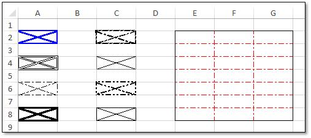

# Working with Cell or Range Formatting

This section covers the various formatting options in a cell or a range.

## Create a Style

The following code shows how to create and apply cell style.



using (ExcelEngine excelEngine = new ExcelEngine())
{
  IApplication application = excelEngine.Excel;
  application.DefaultVersion = ExcelVersion.Excel2013;
  IWorkbook workbook = application.Workbooks.Create(1);
  IWorksheet worksheet = workbook.Worksheets[0];

  //Creating a new style with cell back color, fill pattern and font attribute
  IStyle style = workbook.Styles.Add("NewStyle");
  style.Color = Color.LightGreen;
  style.FillPattern = ExcelPattern.DarkUpwardDiagonal;
  style.Font.Bold = true;
  worksheet.Range["B2"].CellStyle = style;

  workbook.SaveAs("Style.xlsx");
}



Using excelEngine As ExcelEngine = New ExcelEngine()
  Dim application As IApplication = excelEngine.Excel
  application.DefaultVersion = ExcelVersion.Excel2013
  Dim workbook As IWorkbook = application.Workbooks.Create(1)
  Dim worksheet As IWorksheet = workbook.Worksheets(0)

  'Creating a new style with cell back color, fill pattern and font attribute
  Dim style As IStyle = workbook.Styles.Add("NewStyle")
  style.Color = Color.LightGreen
  style.FillPattern = ExcelPattern.DarkUpwardDiagonal
  style.Font.Bold = True
  worksheet.Range("B2").CellStyle = style

  workbook.SaveAs("Style.xlsx")
End Using



using (ExcelEngine excelEngine = new ExcelEngine())
{
  IApplication application = excelEngine.Excel;
  application.DefaultVersion = ExcelVersion.Excel2013;
  IWorkbook workbook = application.Workbooks.Create(1);
  IWorksheet worksheet = workbook.Worksheets[0];

  //Creating a new style with cell back color, fill pattern and font attribute
  IStyle style = workbook.Styles.Add("NewStyle");
  style.Color = Color.FromArgb(255, 144, 238, 144);
  style.FillPattern = ExcelPattern.DarkUpwardDiagonal;
  style.Font.Bold = true;
  worksheet.Range["B2"].CellStyle = style;

  //Initializes FileSavePicker
  FileSavePicker savePicker = new FileSavePicker();
  savePicker.SuggestedStartLocation = PickerLocationId.Desktop;
  savePicker.SuggestedFileName = "Style";
  savePicker.FileTypeChoices.Add("Excel Files", new List<string>() { ".xlsx" });

  //Creates a storage file from FileSavePicker
  StorageFile storageFile = await savePicker.PickSaveFileAsync();

  //Saves changes to the specified storage file
  await workbook.SaveAsAsync(storageFile);
}



using (ExcelEngine excelEngine = new ExcelEngine())
{
  IApplication application = excelEngine.Excel;
  application.DefaultVersion = ExcelVersion.Excel2013;
  IWorkbook workbook = application.Workbooks.Create(1);
  IWorksheet worksheet = workbook.Worksheets[0];

  //Creating a new style with cell back color, fill pattern and font attribute
  IStyle style = workbook.Styles.Add("NewStyle");
  style.Color = Color.LightGreen;
  style.FillPattern = ExcelPattern.DarkUpwardDiagonal;
  style.Font.Bold = true;
  worksheet.Range["B2"].CellStyle = style;

  //Saving the workbook as stream
  FileStream stream = new FileStream("Style.xlsx", FileMode.Create, FileAccess.ReadWrite);
  workbook.SaveAs(stream);
  stream.Dispose();
}



using (ExcelEngine excelEngine = new ExcelEngine())
{
  IApplication application = excelEngine.Excel;
  application.DefaultVersion = ExcelVersion.Excel2013;
  IWorkbook workbook = application.Workbooks.Create(1);
  IWorksheet worksheet = workbook.Worksheets[0];

  //Creating a new style with cell back color, fill pattern and font attribute
  IStyle style = workbook.Styles.Add("NewStyle");
  style.Color = Syncfusion.Drawing.Color.LightGreen;
  style.FillPattern = ExcelPattern.DarkUpwardDiagonal;
  style.Font.Bold = true;
  worksheet.Range["B2"].CellStyle = style;

  //Saving the workbook as stream
  MemoryStream stream = new MemoryStream();
  workbook.SaveAs(stream);

  stream.Position = 0;

  //Save the document as file and view the saved document

  //The operation in SaveAndView under Xamarin varies between Windows Phone, Android, and iOS platforms. Refer to the xlsio/xamarin section for respective code samples.

  if (Device.OS == TargetPlatform.WinPhone || Device.OS == TargetPlatform.Windows)
  {
	Xamarin.Forms.DependencyService.Get<ISaveWindowsPhone>().SaveAndView("Style.xlsx", "application/msexcel", stream);
  }
  else
  {
	Xamarin.Forms.DependencyService.Get<ISave>().SaveAndView("Style.xlsx", "application/msexcel", stream);
  }
}



A complete working example to create style in C# is present on [this GitHub page](https://github.com/SyncfusionExamples/XlsIO-Examples/tree/master/Editing%20Excel%20cell-styles/Create%20Style).

## Set Default Style for row or column

It is the recommended and optimized approach to format entire row or column with same styles instead of formatting each and every cell individually. Use the following code to set default style.

  

using (ExcelEngine excelEngine = new ExcelEngine())
{
  IApplication application = excelEngine.Excel;
  application.DefaultVersion = ExcelVersion.Excel2013;
  IWorkbook workbook = application.Workbooks.Create(1);
  IWorksheet worksheet = workbook.Worksheets[0];

  //Define new styles to apply in rows and columns
  IStyle rowStyle = workbook.Styles.Add("RowStyle");
  rowStyle.Color = Color.LightGreen;
  IStyle columnStyle = workbook.Styles.Add("ColumnStyle");
  columnStyle.Color = Color.Orange;

  //Set default row style for entire row
  worksheet.SetDefaultRowStyle(1, 2, rowStyle);
  //Set default column style for entire column
  worksheet.SetDefaultColumnStyle(1, 2, columnStyle);

  workbook.SaveAs("DefaultStyles.xlsx");
}



Using excelEngine As ExcelEngine = New ExcelEngine()
  Dim application As IApplication = excelEngine.Excel
  application.DefaultVersion = ExcelVersion.Excel2013
  Dim workbook As IWorkbook = application.Workbooks.Create(1)
  Dim worksheet As IWorksheet = workbook.Worksheets(0)

  'Define new styles to apply in rows and columns
  Dim rowStyle As IStyle = workbook.Styles.Add("RowStyle")
  rowStyle.Color = Color.LightGreen
  Dim columnStyle As IStyle = workbook.Styles.Add("ColumnStyle")
  columnStyle.Color = Color.Orange

  'Set default row style for entire row
  worksheet.SetDefaultRowStyle(1, 2, rowStyle)
  'Set default column style for entire column
  worksheet.SetDefaultColumnStyle(1, 2, columnStyle)

  workbook.SaveAs("DefaultStyles.xlsx")
End Using



using (ExcelEngine excelEngine = new ExcelEngine())
{
  IApplication application = excelEngine.Excel;
  application.DefaultVersion = ExcelVersion.Excel2013;
  IWorkbook workbook = application.Workbooks.Create(1);
  IWorksheet worksheet = workbook.Worksheets[0];

  //Define new styles to apply in rows and columns
  IStyle rowStyle = workbook.Styles.Add("RowStyle");
  rowStyle.Color = Color.FromArgb(255, 144, 238, 144);
  IStyle columnStyle = workbook.Styles.Add("ColumnStyle");
  columnStyle.Color = Color.FromArgb(255, 255, 165, 0);

  //Set default row style for entire row
  worksheet.SetDefaultRowStyle(1, 2, rowStyle);
  //Set default column style for entire column
  worksheet.SetDefaultColumnStyle(1, 2, columnStyle);

  //Initializes FileSavePicker
  FileSavePicker savePicker = new FileSavePicker();
  savePicker.SuggestedStartLocation = PickerLocationId.Desktop;
  savePicker.SuggestedFileName = "DefaultStyles";
  savePicker.FileTypeChoices.Add("Excel Files", new List<string>() { ".xlsx" });

  //Creates a storage file from FileSavePicker
  StorageFile storageFile = await savePicker.PickSaveFileAsync();

  //Saves changes to the specified storage file
  await workbook.SaveAsAsync(storageFile);
}



using (ExcelEngine excelEngine = new ExcelEngine())
{
  IApplication application = excelEngine.Excel;
  application.DefaultVersion = ExcelVersion.Excel2013;
  IWorkbook workbook = application.Workbooks.Create(1);
  IWorksheet worksheet = workbook.Worksheets[0];

  //Define new styles to apply in rows and columns
  IStyle rowStyle = workbook.Styles.Add("RowStyle");
  rowStyle.Color = Color.LightGreen;
  IStyle columnStyle = workbook.Styles.Add("ColumnStyle");
  columnStyle.Color = Color.Orange;

  //Set default row style for entire row
  worksheet.SetDefaultRowStyle(1, 2, rowStyle);
  //Set default column style for entire column
  worksheet.SetDefaultColumnStyle(1, 2, columnStyle);

  //Saving the workbook as stream
  FileStream stream = new FileStream("DefaultStyles.xlsx", FileMode.Create, FileAccess.ReadWrite);
  workbook.SaveAs(stream);
  stream.Dispose();
}



using (ExcelEngine excelEngine = new ExcelEngine())
{
  IApplication application = excelEngine.Excel;
  application.DefaultVersion = ExcelVersion.Excel2013;
  IWorkbook workbook = application.Workbooks.Create(1);
  IWorksheet worksheet = workbook.Worksheets[0];

  //Define new styles to apply in rows and columns
  IStyle rowStyle = workbook.Styles.Add("RowStyle");
  rowStyle.Color = Syncfusion.Drawing.Color.LightGreen;
  IStyle columnStyle = workbook.Styles.Add("ColumnStyle");
  columnStyle.Color = Syncfusion.Drawing.Color.Orange;

  //Set default row style for entire row
  worksheet.SetDefaultRowStyle(1, 2, rowStyle);
  //Set default column style for entire column
  worksheet.SetDefaultColumnStyle(1, 2, columnStyle);

  //Saving the workbook as stream
  MemoryStream stream = new MemoryStream();
  workbook.SaveAs(stream);

  stream.Position = 0;

  //Save the document as file and view the saved document

  //The operation in SaveAndView under Xamarin varies between Windows Phone, Android, and iOS platforms. Refer to the xlsio/xamarin section for respective code samples.

  if (Device.OS == TargetPlatform.WinPhone || Device.OS == TargetPlatform.Windows)
  {
	Xamarin.Forms.DependencyService.Get<ISaveWindowsPhone>().SaveAndView("DefaultStyles.xlsx", "application/msexcel", stream);
  }
  else
  {
	Xamarin.Forms.DependencyService.Get<ISave>().SaveAndView("DefaultStyles.xlsx", "application/msexcel", stream);
  }
}



A complete working example to apply default style for rows and columns in C# is present on [this GitHub page](https://github.com/SyncfusionExamples/XlsIO-Examples/tree/master/Editing%20Excel%20cell-styles/Row%20and%20Column%20Style).

N> Applying custom styles will override original styles.

T> To apply styles for whole column instead of applying in each cell, use default styles.

## Apply Global Style

The XlsIO adds styles globally that can be applied to one or more cells in a workbook. This is a recommended approach to apply single style in different rows and columns, which improves memory and performance considerably.

To learn more about performance, refer to the [Improving Performing section for better performance in XlsIO](https://help.syncfusion.com/file-formats/xlsio/improving-performance).

The following code snippet illustrates how to set header style and body style to the cells.

  

using (ExcelEngine excelEngine = new ExcelEngine())
{
  IApplication application = excelEngine.Excel;
  application.DefaultVersion = ExcelVersion.Excel2013;
  IWorkbook workbook = application.Workbooks.Create(2);
  IWorksheet worksheet = workbook.Worksheets[0];

  //Adding values to a worksheet range
  worksheet.Range["A1"].Text = "CustomerID";
  worksheet.Range["B1"].Text = "CompanyName";
  worksheet.Range["C1"].Text = "ContactName";
  worksheet.Range["A2"].Text = "ALFKI";
  worksheet.Range["A3"].Text = "ANATR";
  worksheet.Range["A4"].Text = "BONAP";
  worksheet.Range["A5"].Text = "BSBEV";
  worksheet.Range["B2"].Text = "Alfred Futterkiste";
  worksheet.Range["B3"].Text = "Ana Trujillo Emparedados y helados";
  worksheet.Range["B4"].Text = "Bon App";
  worksheet.Range["B5"].Text = "B's Beverages";
  worksheet.Range["C2"].Text = "Maria Anders";
  worksheet.Range["C3"].Text = "Ana Trujillo";
  worksheet.Range["C4"].Text = "Laurence Lebihan";
  worksheet.Range["C5"].Text = "Victoria Ashworth";

  //Formatting
  //Global styles should be used when the same style needs to be applied to more than one cell. This usage of a global style reduces memory usage.
  //Add custom colors to the palette
  workbook.SetPaletteColor(8, Color.FromArgb(255, 174, 33));

  //Defining header style
  IStyle headerStyle = workbook.Styles.Add("HeaderStyle");
  headerStyle.BeginUpdate();
  headerStyle.Color = Color.FromArgb(255, 174, 33);
  headerStyle.Font.Bold = true;
  headerStyle.Borders[ExcelBordersIndex.EdgeLeft].LineStyle = ExcelLineStyle.Thin;
  headerStyle.Borders[ExcelBordersIndex.EdgeRight].LineStyle = ExcelLineStyle.Thin;
  headerStyle.Borders[ExcelBordersIndex.EdgeTop].LineStyle = ExcelLineStyle.Thin;
  headerStyle.Borders[ExcelBordersIndex.EdgeBottom].LineStyle = ExcelLineStyle.Thin;
  headerStyle.EndUpdate();

  //Add custom colors to the palette
  workbook.SetPaletteColor(9, Color.FromArgb(239, 243, 247));

  //Defining body style
  IStyle bodyStyle = workbook.Styles.Add("BodyStyle");
  bodyStyle.BeginUpdate();
  bodyStyle.Color = Color.FromArgb(239, 243, 247);
  bodyStyle.Borders[ExcelBordersIndex.EdgeLeft].LineStyle = ExcelLineStyle.Thin;
  bodyStyle.Borders[ExcelBordersIndex.EdgeRight].LineStyle = ExcelLineStyle.Thin;
  bodyStyle.EndUpdate();

  //Apply Header style
  worksheet.Rows[0].CellStyle = headerStyle;
  //Apply Body Style
  worksheet.Range["A2:C5"].CellStyle = bodyStyle;
  //Auto-fit the columns
  worksheet.UsedRange.AutofitColumns();

  workbook.SaveAs("GlobalStyles.xlsx");
}



Using excelEngine As ExcelEngine = New ExcelEngine()
  Dim application As IApplication = excelEngine.Excel
  application.DefaultVersion = ExcelVersion.Excel2013
  Dim workbook As IWorkbook = application.Workbooks.Create(2)
  Dim worksheet As IWorksheet = workbook.Worksheets(0)

  'Adding values to a worksheet range
  worksheet.Range("A1").Text = "CustomerID"
  worksheet.Range("B1").Text = "CompanyName"
  worksheet.Range("C1").Text = "ContactName"
  worksheet.Range("A2").Text = "ALFKI"
  worksheet.Range("A3").Text = "ANATR"
  worksheet.Range("A4").Text = "BONAP"
  worksheet.Range("A5").Text = "BSBEV"
  worksheet.Range("B2").Text = "Alfred Futterkiste"
  worksheet.Range("B3").Text = "Ana Trujillo Emparedados y helados"
  worksheet.Range("B4").Text = "Bon App"
  worksheet.Range("B5").Text = "B's Beverages"
  worksheet.Range("C2").Text = "Maria Anders"
  worksheet.Range("C3").Text = "Ana Trujillo"
  worksheet.Range("C4").Text = "Laurence Lebihan"
  worksheet.Range("C5").Text = "Victoria Ashworth"

  'Formatting
  'Global styles should be used when the same style needs to be applied to more than one cell. This usage of a global style reduces memory usage.
  'Add custom colors to the palette
  workbook.SetPaletteColor(8, Color.FromArgb(255, 174, 33))

  'Defining header style
  Dim headerStyle As IStyle = workbook.Styles.Add("HeaderStyle")
  headerStyle.BeginUpdate()
  headerStyle.Color = Color.FromArgb(255, 174, 33)
  headerStyle.Font.Bold = True
  headerStyle.Borders(ExcelBordersIndex.EdgeLeft).LineStyle = ExcelLineStyle.Thin
  headerStyle.Borders(ExcelBordersIndex.EdgeRight).LineStyle = ExcelLineStyle.Thin
  headerStyle.Borders(ExcelBordersIndex.EdgeTop).LineStyle = ExcelLineStyle.Thin
  headerStyle.Borders(ExcelBordersIndex.EdgeBottom).LineStyle = ExcelLineStyle.Thin
  headerStyle.EndUpdate()

  'Add custom colors to the palette
  workbook.SetPaletteColor(9, Color.FromArgb(239, 243, 247))

  'Defining body style
  Dim bodyStyle As IStyle = workbook.Styles.Add("BodyStyle")
  bodyStyle.BeginUpdate()
  bodyStyle.Color = Color.FromArgb(239, 243, 247)
  bodyStyle.Borders(ExcelBordersIndex.EdgeLeft).LineStyle = ExcelLineStyle.Thin
  bodyStyle.Borders(ExcelBordersIndex.EdgeRight).LineStyle = ExcelLineStyle.Thin
  bodyStyle.EndUpdate()

  'Apply Header style
  worksheet.Rows(0).CellStyle = headerStyle
  'Apply Body Style
  worksheet.Range("A2:C5").CellStyle = bodyStyle
  'Auto-fit the columns
  worksheet.UsedRange.AutofitColumns()

  workbook.SaveAs("GlobalStyles.xlsx")
End Using



using (ExcelEngine excelEngine = new ExcelEngine())
{
  IApplication application = excelEngine.Excel;
  application.DefaultVersion = ExcelVersion.Excel2013;
  IWorkbook workbook = application.Workbooks.Create(2);
  IWorksheet worksheet = workbook.Worksheets[0];

  //Adding values to a worksheet range
  worksheet.Range["A1"].Text = "CustomerID";
  worksheet.Range["B1"].Text = "CompanyName";
  worksheet.Range["C1"].Text = "ContactName";
  worksheet.Range["A2"].Text = "ALFKI";
  worksheet.Range["A3"].Text = "ANATR";
  worksheet.Range["A4"].Text = "BONAP";
  worksheet.Range["A5"].Text = "BSBEV";
  worksheet.Range["B2"].Text = "Alfred Futterkiste";
  worksheet.Range["B3"].Text = "Ana Trujillo Emparedados y helados";
  worksheet.Range["B4"].Text = "Bon App";
  worksheet.Range["B5"].Text = "B's Beverages";
  worksheet.Range["C2"].Text = "Maria Anders";
  worksheet.Range["C3"].Text = "Ana Trujillo";
  worksheet.Range["C4"].Text = "Laurence Lebihan";
  worksheet.Range["C5"].Text = "Victoria Ashworth";

  //Formatting
  //Global styles should be used when the same style needs to be applied to more than one cell. This usage of a global style reduces memory usage.
  //Add custom colors to the palette
  workbook.SetPaletteColor(8, Color.FromArgb(255, 255, 174, 33));

  //Defining header style
  IStyle headerStyle = workbook.Styles.Add("HeaderStyle");
  headerStyle.BeginUpdate();
  headerStyle.Color = Color.FromArgb(255, 255, 174, 33);
  headerStyle.Font.Bold = true;
  headerStyle.Borders[ExcelBordersIndex.EdgeLeft].LineStyle = ExcelLineStyle.Thin;
  headerStyle.Borders[ExcelBordersIndex.EdgeRight].LineStyle = ExcelLineStyle.Thin;
  headerStyle.Borders[ExcelBordersIndex.EdgeTop].LineStyle = ExcelLineStyle.Thin;
  headerStyle.Borders[ExcelBordersIndex.EdgeBottom].LineStyle = ExcelLineStyle.Thin;
  headerStyle.EndUpdate();

  //Add custom colors to the palette
  workbook.SetPaletteColor(9, Color.FromArgb(255, 239, 243, 247));

  //Defining body style
  IStyle bodyStyle = workbook.Styles.Add("BodyStyle");
  bodyStyle.BeginUpdate();
  bodyStyle.Color = Color.FromArgb(255, 239, 243, 247);
  bodyStyle.Borders[ExcelBordersIndex.EdgeLeft].LineStyle = ExcelLineStyle.Thin;
  bodyStyle.Borders[ExcelBordersIndex.EdgeRight].LineStyle = ExcelLineStyle.Thin;
  bodyStyle.EndUpdate();

  //Apply Header style
  worksheet.Rows[0].CellStyle = headerStyle;
  //Apply Body Style
  worksheet.Range["A2:C5"].CellStyle = bodyStyle;
  //Auto-fit the columns
  worksheet.UsedRange.AutofitColumns();

  //Initializes FileSavePicker
  FileSavePicker savePicker = new FileSavePicker();
  savePicker.SuggestedStartLocation = PickerLocationId.Desktop;
  savePicker.SuggestedFileName = "GlobalStyles";
  savePicker.FileTypeChoices.Add("Excel Files", new List<string>() { ".xlsx" });

  //Creates a storage file from FileSavePicker
  StorageFile storageFile = await savePicker.PickSaveFileAsync();

  //Saves changes to the specified storage file
  await workbook.SaveAsAsync(storageFile);
}



using (ExcelEngine excelEngine = new ExcelEngine())
{
  IApplication application = excelEngine.Excel;
  application.DefaultVersion = ExcelVersion.Excel2013;
  IWorkbook workbook = application.Workbooks.Create(2);
  IWorksheet worksheet = workbook.Worksheets[0];

  //Adding values to a worksheet range
  worksheet.Range["A1"].Text = "CustomerID";
  worksheet.Range["B1"].Text = "CompanyName";
  worksheet.Range["C1"].Text = "ContactName";
  worksheet.Range["A2"].Text = "ALFKI";
  worksheet.Range["A3"].Text = "ANATR";
  worksheet.Range["A4"].Text = "BONAP";
  worksheet.Range["A5"].Text = "BSBEV";
  worksheet.Range["B2"].Text = "Alfred Futterkiste";
  worksheet.Range["B3"].Text = "Ana Trujillo Emparedados y helados";
  worksheet.Range["B4"].Text = "Bon App";
  worksheet.Range["B5"].Text = "B's Beverages";
  worksheet.Range["C2"].Text = "Maria Anders";
  worksheet.Range["C3"].Text = "Ana Trujillo";
  worksheet.Range["C4"].Text = "Laurence Lebihan";
  worksheet.Range["C5"].Text = "Victoria Ashworth";

  //Formatting
  //Global styles should be used when the same style needs to be applied to more than one cell. This usage of a global style reduces memory usage.
  //Add custom colors to the palette
  workbook.SetPaletteColor(8, Color.FromArgb(255, 174, 33));

  //Defining header style
  IStyle headerStyle = workbook.Styles.Add("HeaderStyle");
  headerStyle.BeginUpdate();
  headerStyle.Color = Color.FromArgb(255, 174, 33);
  headerStyle.Font.Bold = true;
  headerStyle.Borders[ExcelBordersIndex.EdgeLeft].LineStyle = ExcelLineStyle.Thin;
  headerStyle.Borders[ExcelBordersIndex.EdgeRight].LineStyle = ExcelLineStyle.Thin;
  headerStyle.Borders[ExcelBordersIndex.EdgeTop].LineStyle = ExcelLineStyle.Thin;
  headerStyle.Borders[ExcelBordersIndex.EdgeBottom].LineStyle = ExcelLineStyle.Thin;
  headerStyle.EndUpdate();

  //Add custom colors to the palette
  workbook.SetPaletteColor(9, Color.FromArgb(239, 243, 247));

  //Defining body style
  IStyle bodyStyle = workbook.Styles.Add("BodyStyle");
  bodyStyle.BeginUpdate();
  bodyStyle.Color = Color.FromArgb(239, 243, 247);
  bodyStyle.Borders[ExcelBordersIndex.EdgeLeft].LineStyle = ExcelLineStyle.Thin;
  bodyStyle.Borders[ExcelBordersIndex.EdgeRight].LineStyle = ExcelLineStyle.Thin;
  bodyStyle.EndUpdate();

  //Apply Header style
  worksheet.Rows[0].CellStyle = headerStyle;
  //Apply Body Style
  worksheet.Range["A2:C5"].CellStyle = bodyStyle;
  //Auto-fit the columns
  worksheet.UsedRange.AutofitColumns();

  //Saving the workbook as stream
  FileStream stream = new FileStream("GlobalStyles.xlsx", FileMode.Create, FileAccess.ReadWrite);
  workbook.SaveAs(stream);
  stream.Dispose();
}



using (ExcelEngine excelEngine = new ExcelEngine())
{
  IApplication application = excelEngine.Excel;
  application.DefaultVersion = ExcelVersion.Excel2013;
  IWorkbook workbook = application.Workbooks.Create(2);
  IWorksheet worksheet = workbook.Worksheets[0];

  //Adding values to a worksheet range
  worksheet.Range["A1"].Text = "CustomerID";
  worksheet.Range["B1"].Text = "CompanyName";
  worksheet.Range["C1"].Text = "ContactName";
  worksheet.Range["A2"].Text = "ALFKI";
  worksheet.Range["A3"].Text = "ANATR";
  worksheet.Range["A4"].Text = "BONAP";
  worksheet.Range["A5"].Text = "BSBEV";
  worksheet.Range["B2"].Text = "Alfred Futterkiste";
  worksheet.Range["B3"].Text = "Ana Trujillo Emparedados y helados";
  worksheet.Range["B4"].Text = "Bon App";
  worksheet.Range["B5"].Text = "B's Beverages";
  worksheet.Range["C2"].Text = "Maria Anders";
  worksheet.Range["C3"].Text = "Ana Trujillo";
  worksheet.Range["C4"].Text = "Laurence Lebihan";
  worksheet.Range["C5"].Text = "Victoria Ashworth";

  //Formatting
  //Global styles should be used when the same style needs to be applied to more than one cell. This usage of a global style reduces memory usage.
  //Add custom colors to the palette
  workbook.SetPaletteColor(8, Syncfusion.Drawing.Color.FromArgb(255, 174, 33));
  
  //Defining header style
  IStyle headerStyle = workbook.Styles.Add("HeaderStyle");
  headerStyle.BeginUpdate();
  headerStyle.Color = Syncfusion.Drawing.Color.FromArgb(255, 174, 33);
  headerStyle.Font.Bold = true;
  headerStyle.Borders[ExcelBordersIndex.EdgeLeft].LineStyle = ExcelLineStyle.Thin;
  headerStyle.Borders[ExcelBordersIndex.EdgeRight].LineStyle = ExcelLineStyle.Thin;
  headerStyle.Borders[ExcelBordersIndex.EdgeTop].LineStyle = ExcelLineStyle.Thin;
  headerStyle.Borders[ExcelBordersIndex.EdgeBottom].LineStyle = ExcelLineStyle.Thin;
  headerStyle.EndUpdate();

  //Add custom colors to the palette
  workbook.SetPaletteColor(9, Syncfusion.Drawing.Color.FromArgb(255, 239, 243, 247));

  //Defining body style
  IStyle bodyStyle = workbook.Styles.Add("BodyStyle");
  bodyStyle.BeginUpdate();
  bodyStyle.Color = Syncfusion.Drawing.Color.FromArgb(255, 239, 243, 247);
  bodyStyle.Borders[ExcelBordersIndex.EdgeLeft].LineStyle = ExcelLineStyle.Thin;
  bodyStyle.Borders[ExcelBordersIndex.EdgeRight].LineStyle = ExcelLineStyle.Thin;
  bodyStyle.EndUpdate();

  //Apply Header style
  worksheet.Rows[0].CellStyle = headerStyle;
  //Apply Body Style
  worksheet.Range["A2:C5"].CellStyle = bodyStyle;
  //Auto-fit the columns
  worksheet.UsedRange.AutofitColumns();

  //Saving the workbook as stream
  MemoryStream stream = new MemoryStream();
  workbook.SaveAs(stream);

  stream.Position = 0;

  //Save the document as file and view the saved document

  //The operation in SaveAndView under Xamarin varies between Windows Phone, Android, and iOS platforms. Refer to the xlsio/xamarin section for respective code samples.

  if (Device.OS == TargetPlatform.WinPhone || Device.OS == TargetPlatform.Windows)
  {
	Xamarin.Forms.DependencyService.Get<ISaveWindowsPhone>().SaveAndView("GlobalStyles.xlsx", "application/msexcel", stream);
  }
  else
  {
	Xamarin.Forms.DependencyService.Get<ISave>().SaveAndView("GlobalStyles.xlsx", "application/msexcel", stream);
  }
}



A complete working example to apply global style in C# is present on [this GitHub page](https://github.com/SyncfusionExamples/XlsIO-Examples/tree/master/Editing%20Excel%20cell-styles/Global%20Style).

__Excel__ __document__ __with__ __Global__ __Styles__

## Apply Number Formats 

Number Formats are codes that helps to control the appearance of cell values especially numbers in an Excel document. Excel recognizes the numbers in various formats like:

* Number
* Currency
* Percentage
* DateTime
* Accounting
* Scientific
* Fraction and
* Text

This number format can be of maximum 4 parts, separated by semicolons. They are:

* Positive Numbers
* Negative Numbers
* Zeros
* Text

Each part is an individual number format.  Default format is “General”, it means anything that will fit. 

The following table shows various custom formatting codes:

<table>
<tr>
<th>
Number Code   </th><th>
Description  </th></tr>
<tbody>
<tr>
<td>
General  </td><td>
General number format.  </td></tr>
<tr>
<td>
0 (zero)  </td><td>
Digit placeholder. This code pads the value with zeros to fill the format.  </td></tr>
<tr>
<td>
#  </td><td>
Digit placeholder. This code does not display extra zeros.  </td></tr>
<tr>
<td>
?  </td><td>
Digit placeholder. This code leaves a space for insignificant zeros but does not display them.  </td></tr>
<tr>
<td>
. (period)  </td><td>
Decimal placeholder. The decimal placeholder determines how many digits are displayed to the left and right of the decimal separator.  </td></tr>
<tr>
<td>
%  </td><td>
Percentage placeholder. Multiplies by 100 and adds the % character.  </td></tr>
<tr>
<td>
, (comma)  </td><td>
Thousands separator. A comma followed by a placeholder (0 or #) scales the number by a thousand.  </td></tr>
<tr>
<td>
E+ E- e+ e-  </td><td>
Scientific notation.  </td></tr>
<tr>
<th>
Text Code  </th><th>
Description  </th></tr>
<tr>
<td>
$ - + / ( ) : space  </td><td>
These characters are displayed in the number. To display any other character, enclose the character in quotation marks or precede it with a backslash.  </td></tr>
<tr>
<td>
\character  </td><td>
This code displays the succeeding character you specify.  Note Typing !, ^, &, ', ~, {, }, =, <, or > automatically places a backslash in front of the character.  </td></tr>
<tr>
<td>
"text"  </td><td>
This code displays the text.  </td></tr>
<tr>
<td>
*  </td><td>
This code repeats the next character in the format to fill the column width.  Note: Only one asterisk per section of a format is allowed.  </td></tr>
<tr>
<td>
_ (underscore)  </td><td>
This code skips the width of the next character. This code is commonly used as "_)" (without the quotation marks) to leave space for a closing parenthesis in a positive number format when the negative number format includes parentheses.   This allows the values to line up at the decimal point.  </td></tr>
<tr>
<td>
@  </td><td>
Text placeholder.  </td></tr>
<tr>
<th>
Date Code  </th><th>
Description  </th></tr>
<tr>
<td>
m  </td><td>
Month as a number without leading zeros (1-12).  </td></tr>
<tr>
<td>
mm  </td><td>
Month as a number with leading zeros (01-12).  </td></tr>
<tr>
<td>
mmm  </td><td>
Month as an abbreviation (Jan - Dec).  </td></tr>
<tr>
<td>
mmmm  </td><td>
Unabbreviated Month (January - December).  </td></tr>
<tr>
<td>
d  </td><td>
Day without leading zeros (1-31).  </td></tr>
<tr>
<td>
dd  </td><td>
Day with leading zeros (01-31).  </td></tr>
<tr>
<td>
ddd  </td><td>
Week day as an abbreviation (Sun - Sat).  </td></tr>
<tr>
<td>
dddd  </td><td>
Unabbreviated week day (Sunday - Saturday).  </td></tr>
<tr>
<td>
yy  </td><td>
Year as a two-digit number (for example, 96).  </td></tr>
<tr>
<td>
yyyy  </td><td>
Year as a four-digit number (for example, 1996).  </td></tr>
<tr>
<th>
Time Code  </th><th>
Description   </th></tr>
<tr>
<td>
h  </td><td>
Hours as a number without leading zeros (0-23).  </td></tr>
<tr>
<td>
hh  </td><td>
Hours as a number with leading zeros (00-23).  </td></tr>
<tr>
<td>
m  </td><td>
Minutes as a number without leading zeros (0-59).  </td></tr>
<tr>
<td>
mm  </td><td>
Minutes as a number with leading zeros (00-59).  </td></tr>
<tr>
<td>
s  </td><td>
Seconds as a number without leading zeros (0-59).  </td></tr>
<tr>
<td>
ss  </td><td>
Seconds as a number with leading zeros (00-59).  </td></tr>
<tr>
<td>
AM/PM am/pm  </td><td>
Time based on the twelve-hour clock.  </td></tr>
<tr>
<th>
Miscellaneous Code  </th><th>
Description  </th></tr>
<tr>
<td>
[BLACK], [BLUE], [CYAN], [GREEN], [MAGENTA], [RED], [WHITE], [YELLOW], [COLOR n]  </td><td>
These codes display the characters in the specified colors.   Note: n is a value from 1 to 56 and refers to the nth color in the color palette.  </td></tr>
<tr>
<td>
[Condition value]  </td><td>
Condition may be <, >, =, >=, <=, &lt;&gt; and value may be any number.  Note: A number format may contain up to two conditions.  </td></tr>
</tbody>
</table>
XlsIO provides support for reading and writing various built-in and custom number formats in a cell by using the **NumberFormat** property of **IRange** interface.

The following code snippet illustrates how to set different number formats in a worksheet range.

  

using (ExcelEngine excelEngine = new ExcelEngine())
{
  IApplication application = excelEngine.Excel;
  application.DefaultVersion = ExcelVersion.Excel2013;
  IWorkbook workbook = application.Workbooks.Create(1);
  IWorksheet worksheet = workbook.Worksheets[0];

  worksheet.Range["A1"].Text = "DATA";
  worksheet.Range["B1"].Text = "NUMBER FORMAT APPLIED";
  worksheet.Range["C1"].Text = "RESULT";
  IStyle headingStyle = workbook.Styles.Add("HeadingStyle");
  headingStyle.Font.Bold = true;
  headingStyle.HorizontalAlignment = ExcelHAlign.HAlignCenter;
  worksheet.Range["A1:C1"].CellStyle = headingStyle;

  //Applying different number formats
  worksheet.Range["A2"].Text = "1000000.00075";
  worksheet.Range["B2"].Text = "0.00";
  worksheet.Range["C2"].NumberFormat = "0.00";
  worksheet.Range["C2"].Number = 1000000.00075;
  worksheet.Range["A3"].Text = "1000000.500";
  worksheet.Range["B3"].Text = "###,##";
  worksheet.Range["C3"].NumberFormat = "###,##";
  worksheet.Range["C3"].Number = 1000000.500;
  worksheet.Range["A5"].Text = "10000";
  worksheet.Range["B5"].Text = "0.00";
  worksheet.Range["C5"].NumberFormat = "0.00";
  worksheet.Range["C5"].Number = 10000;
  worksheet.Range["A6"].Text = "-500";
  worksheet.Range["B6"].Text = "[Blue]#,##0";
  worksheet.Range["C6"].NumberFormat = "[Blue]#,##0";
  worksheet.Range["C6"].Number = -500;
  worksheet.Range["A7"].Text = "0.000000000000000000001234567890";
  worksheet.Range["B7"].Text = "0.000000000000000000000000000000";
  worksheet.Range["C7"].NumberFormat = "0.000000000000000000000000000000";
  worksheet.Range["C7"].Number = 0.000000000000000000001234567890;
  worksheet.Range["A9"].Text = "1.20";
  worksheet.Range["B9"].Text = "0.00E+00";
  worksheet.Range["C9"].NumberFormat = "0.00E+00";
  worksheet.Range["C9"].Number = 1.20;

  //Applying percentage format
  worksheet.Range["A10"].Text = "1.20";
  worksheet.Range["B10"].Text = "0.00%";
  worksheet.Range["C10"].NumberFormat = "0.00%";
  worksheet.Range["C10"].Number = 1.20;

  //Applying date format
  worksheet.Range["A11"].Text = new DateTime(2005, 12, 25).ToString();
  worksheet.Range["B11"].Text = "m/d/yyyy";
  worksheet.Range["C11"].NumberFormat = "m/d/yyyy";
  worksheet.Range["C11"].DateTime = new DateTime(2005, 12, 25);

  //Applying currency format
  worksheet.Range["A12"].Text = "1.20";
  worksheet.Range["B12"].Text = "$#,##0.00";
  worksheet.Range["C12"].NumberFormat = "$#,##0.00";
  worksheet.Range["C12"].Number = 1.20;

  //Applying accounting format
  worksheet.Range["A12"].Text = "234";
  worksheet.Range["B12"].Text = "_($* #,##0_)";
  worksheet.Range["C12"].NumberFormat = "_($* #,##0_)";
  worksheet.Range["C12"].Number = 234;

  //Fit column width to data
  worksheet.UsedRange.AutofitColumns();

  workbook.SaveAs("NumberFormats.xlsx");
}



Using excelEngine As ExcelEngine = New ExcelEngine()
  Dim application As IApplication = excelEngine.Excel
  application.DefaultVersion = ExcelVersion.Excel2013
  Dim workbook As IWorkbook = application.Workbooks.Create(1)

  Dim worksheet As IWorksheet = workbook.Worksheets(0)
  worksheet.Range("A1").Text = "DATA"
  worksheet.Range("B1").Text = "NUMBER FORMAT APPLIED"
  worksheet.Range("C1").Text = "RESULT"
  Dim headingStyle As IStyle = workbook.Styles.Add("HeadingStyle")
  headingStyle.Font.Bold = True
  headingStyle.HorizontalAlignment = ExcelHAlign.HAlignCenter
  worksheet.Range("A1:C1").CellStyle = headingStyle

  'Applying different number formats
  worksheet.Range("A2").Text = "1000000.00075"
  worksheet.Range("B2").Text = "0.00"
  worksheet.Range("C2").NumberFormat = "0.00"
  worksheet.Range("C2").Number = 1000000.00075
  worksheet.Range("A3").Text = "1000000.500"
  worksheet.Range("B3").Text = "###,##"
  worksheet.Range("C3").NumberFormat = "###,##"
  worksheet.Range("C3").Number = 1000000.5
  worksheet.Range("A5").Text = "10000"
  worksheet.Range("B5").Text = "0.00"
  worksheet.Range("C5").NumberFormat = "0.00"
  worksheet.Range("C5").Number = 10000
  worksheet.Range("A6").Text = "-500"
  worksheet.Range("B6").Text = "[Blue]#,##0"
  worksheet.Range("C6").NumberFormat = "[Blue]#,##0"
  worksheet.Range("C6").Number = -500
  worksheet.Range("A7").Text = "0.000000000000000000001234567890"
  worksheet.Range("B7").Text = "0.000000000000000000000000000000"
  worksheet.Range("C7").NumberFormat = "0.000000000000000000000000000000"
  worksheet.Range("C7").Number = 1.23456789E-21
  worksheet.Range("A9").Text = "1.20"
  worksheet.Range("B9").Text = "0.00E+00"
  worksheet.Range("C9").NumberFormat = "0.00E+00"
  worksheet.Range("C9").Number = 1.2

  'Applying percentage format
  worksheet.Range("A10").Text = "1.20"
  worksheet.Range("B10").Text = "0.00%"
  worksheet.Range("C10").NumberFormat = "0.00%"
  worksheet.Range("C10").Number = 1.2

  'Applying date format
  worksheet.Range("A11").Text = New DateTime(2005, 12, 25).ToString()
  worksheet.Range("B11").Text = "m/d/yyyy"
  worksheet.Range("C11").NumberFormat = "m/d/yyyy"
  worksheet.Range("C11").DateTime = New DateTime(2005, 12, 25)

  'Applying currency format
  worksheet.Range("A12").Text = "1.20"
  worksheet.Range("B12").Text = "$#,##0.00"
  worksheet.Range("C12").NumberFormat = "$#,##0.00"
  worksheet.Range("C12").Number = 1.2

  'Applying accounting format
  worksheet.Range("A12").Text = "234"
  worksheet.Range("B12").Text = "_($* #,##0_)"
  worksheet.Range("C12").NumberFormat = "_($* #,##0_)"
  worksheet.Range("C12").Number = 234

  'Fit column width to data
  worksheet.UsedRange.AutofitColumns()

  workbook.SaveAs("NumberFormats.xlsx")
End Using



using (ExcelEngine excelEngine = new ExcelEngine())
{
  IApplication application = excelEngine.Excel;
  application.DefaultVersion = ExcelVersion.Excel2013;
  IWorkbook workbook = application.Workbooks.Create(1);
  IWorksheet worksheet = workbook.Worksheets[0];

  worksheet.Range["A1"].Text = "DATA";
  worksheet.Range["B1"].Text = "NUMBER FORMAT APPLIED";
  worksheet.Range["C1"].Text = "RESULT";
  IStyle headingStyle = workbook.Styles.Add("HeadingStyle");
  headingStyle.Font.Bold = true;
  headingStyle.HorizontalAlignment = ExcelHAlign.HAlignCenter;
  worksheet.Range["A1:C1"].CellStyle = headingStyle;

  //Applying different number formats
  worksheet.Range["A2"].Text = "1000000.00075";
  worksheet.Range["B2"].Text = "0.00";
  worksheet.Range["C2"].NumberFormat = "0.00";
  worksheet.Range["C2"].Number = 1000000.00075;
  worksheet.Range["A3"].Text = "1000000.500";
  worksheet.Range["B3"].Text = "###,##";
  worksheet.Range["C3"].NumberFormat = "###,##";
  worksheet.Range["C3"].Number = 1000000.500;
  worksheet.Range["A5"].Text = "10000";
  worksheet.Range["B5"].Text = "0.00";
  worksheet.Range["C5"].NumberFormat = "0.00";
  worksheet.Range["C5"].Number = 10000;
  worksheet.Range["A6"].Text = "-500";
  worksheet.Range["B6"].Text = "[Blue]#,##0";
  worksheet.Range["C6"].NumberFormat = "[Blue]#,##0";
  worksheet.Range["C6"].Number = -500;
  worksheet.Range["A7"].Text = "0.000000000000000000001234567890";
  worksheet.Range["B7"].Text = "0.000000000000000000000000000000";
  worksheet.Range["C7"].NumberFormat = "0.000000000000000000000000000000";
  worksheet.Range["C7"].Number = 0.000000000000000000001234567890;
  worksheet.Range["A9"].Text = "1.20";
  worksheet.Range["B9"].Text = "0.00E+00";
  worksheet.Range["C9"].NumberFormat = "0.00E+00";
  worksheet.Range["C9"].Number = 1.20;

  //Applying percentage format
  worksheet.Range["A10"].Text = "1.20";
  worksheet.Range["B10"].Text = "0.00%";
  worksheet.Range["C10"].NumberFormat = "0.00%";
  worksheet.Range["C10"].Number = 1.20;

  //Applying date format
  worksheet.Range["A11"].Text = new DateTime(2005, 12, 25).ToString();
  worksheet.Range["B11"].Text = "m/d/yyyy";
  worksheet.Range["C11"].NumberFormat = "m/d/yyyy";
  worksheet.Range["C11"].DateTime = new DateTime(2005, 12, 25);

  //Applying currency format
  worksheet.Range["A12"].Text = "1.20";
  worksheet.Range["B12"].Text = "$#,##0.00";
  worksheet.Range["C12"].NumberFormat = "$#,##0.00";
  worksheet.Range["C12"].Number = 1.20;

  //Applying accounting format
  worksheet.Range["A12"].Text = "234";
  worksheet.Range["B12"].Text = "_($* #,##0_)";
  worksheet.Range["C12"].NumberFormat = "_($* #,##0_)";
  worksheet.Range["C12"].Number = 234;
  
  //Fit column width to data
  worksheet.UsedRange.AutofitColumns();

  //Initializes FileSavePicker
  FileSavePicker savePicker = new FileSavePicker();
  savePicker.SuggestedStartLocation = PickerLocationId.Desktop;
  savePicker.SuggestedFileName = "NumberFormats";
  savePicker.FileTypeChoices.Add("Excel Files", new List<string>() { ".xlsx" });

  //Creates a storage file from FileSavePicker
  StorageFile storageFile = await savePicker.PickSaveFileAsync();

  //Saves changes to the specified storage file
  await workbook.SaveAsAsync(storageFile);
}



using (ExcelEngine excelEngine = new ExcelEngine())
{
  IApplication application = excelEngine.Excel;
  application.DefaultVersion = ExcelVersion.Excel2013;
  IWorkbook workbook = application.Workbooks.Create(1);
  IWorksheet worksheet = workbook.Worksheets[0];

  worksheet.Range["A1"].Text = "DATA";
  worksheet.Range["B1"].Text = "NUMBER FORMAT APPLIED";
  worksheet.Range["C1"].Text = "RESULT";
  IStyle headingStyle = workbook.Styles.Add("HeadingStyle");
  headingStyle.Font.Bold = true;
  headingStyle.HorizontalAlignment = ExcelHAlign.HAlignCenter;
  worksheet.Range["A1:C1"].CellStyle = headingStyle;

  //Applying different number formats
  worksheet.Range["A2"].Text = "1000000.00075";
  worksheet.Range["B2"].Text = "0.00";
  worksheet.Range["C2"].NumberFormat = "0.00";
  worksheet.Range["C2"].Number = 1000000.00075;
  worksheet.Range["A3"].Text = "1000000.500";
  worksheet.Range["B3"].Text = "###,##";
  worksheet.Range["C3"].NumberFormat = "###,##";
  worksheet.Range["C3"].Number = 1000000.500;
  worksheet.Range["A5"].Text = "10000";
  worksheet.Range["B5"].Text = "0.00";
  worksheet.Range["C5"].NumberFormat = "0.00";
  worksheet.Range["C5"].Number = 10000;
  worksheet.Range["A6"].Text = "-500";
  worksheet.Range["B6"].Text = "[Blue]#,##0";
  worksheet.Range["C6"].NumberFormat = "[Blue]#,##0";
  worksheet.Range["C6"].Number = -500;
  worksheet.Range["A7"].Text = "0.000000000000000000001234567890";
  worksheet.Range["B7"].Text = "0.000000000000000000000000000000";
  worksheet.Range["C7"].NumberFormat = "0.000000000000000000000000000000";
  worksheet.Range["C7"].Number = 0.000000000000000000001234567890;
  worksheet.Range["A9"].Text = "1.20";
  worksheet.Range["B9"].Text = "0.00E+00";
  worksheet.Range["C9"].NumberFormat = "0.00E+00";
  worksheet.Range["C9"].Number = 1.20;

  //Applying percentage format
  worksheet.Range["A10"].Text = "1.20";
  worksheet.Range["B10"].Text = "0.00%";
  worksheet.Range["C10"].NumberFormat = "0.00%";
  worksheet.Range["C10"].Number = 1.20;

  //Applying date format
  worksheet.Range["A11"].Text = new DateTime(2005, 12, 25).ToString();
  worksheet.Range["B11"].Text = "m/d/yyyy";
  worksheet.Range["C11"].NumberFormat = "m/d/yyyy";
  worksheet.Range["C11"].DateTime = new DateTime(2005, 12, 25);

  //Applying currency format
  worksheet.Range["A12"].Text = "1.20";
  worksheet.Range["B12"].Text = "$#,##0.00";
  worksheet.Range["C12"].NumberFormat = "$#,##0.00";
  worksheet.Range["C12"].Number = 1.20;

  //Applying accounting format
  worksheet.Range["A12"].Text = "234";
  worksheet.Range["B12"].Text = "_($* #,##0_)";
  worksheet.Range["C12"].NumberFormat = "_($* #,##0_)";
  worksheet.Range["C12"].Number = 234;

  //Fit column width to data
  worksheet.UsedRange.AutofitColumns();

  //Saving the workbook as stream
  FileStream stream = new FileStream("NumberFormats.xlsx", FileMode.Create, FileAccess.ReadWrite);
  workbook.SaveAs(stream);
  stream.Dispose();
}



using (ExcelEngine excelEngine = new ExcelEngine())
{
  IApplication application = excelEngine.Excel;
  application.DefaultVersion = ExcelVersion.Excel2013;
  IWorkbook workbook = application.Workbooks.Create(1);
  IWorksheet worksheet = workbook.Worksheets[0];

  worksheet.Range["A1"].Text = "DATA";
  worksheet.Range["B1"].Text = "NUMBER FORMAT APPLIED";
  worksheet.Range["C1"].Text = "RESULT";
  IStyle headingStyle = workbook.Styles.Add("HeadingStyle");
  headingStyle.Font.Bold = true;
  headingStyle.HorizontalAlignment = ExcelHAlign.HAlignCenter;
  worksheet.Range["A1:C1"].CellStyle = headingStyle;

  //Applying different number formats
  worksheet.Range["A2"].Text = "1000000.00075";
  worksheet.Range["B2"].Text = "0.00";
  worksheet.Range["C2"].NumberFormat = "0.00";
  worksheet.Range["C2"].Number = 1000000.00075;
  worksheet.Range["A3"].Text = "1000000.500";
  worksheet.Range["B3"].Text = "###,##";
  worksheet.Range["C3"].NumberFormat = "###,##";
  worksheet.Range["C3"].Number = 1000000.500;
  worksheet.Range["A5"].Text = "10000";
  worksheet.Range["B5"].Text = "0.00";
  worksheet.Range["C5"].NumberFormat = "0.00";
  worksheet.Range["C5"].Number = 10000;
  worksheet.Range["A6"].Text = "-500";
  worksheet.Range["B6"].Text = "[Blue]#,##0";
  worksheet.Range["C6"].NumberFormat = "[Blue]#,##0";
  worksheet.Range["C6"].Number = -500;
  worksheet.Range["A7"].Text = "0.000000000000000000001234567890";
  worksheet.Range["B7"].Text = "0.000000000000000000000000000000";
  worksheet.Range["C7"].NumberFormat = "0.000000000000000000000000000000";
  worksheet.Range["C7"].Number = 0.000000000000000000001234567890;
  worksheet.Range["A9"].Text = "1.20";
  worksheet.Range["B9"].Text = "0.00E+00";
  worksheet.Range["C9"].NumberFormat = "0.00E+00";
  worksheet.Range["C9"].Number = 1.20;

  //Applying percentage format
  worksheet.Range["A10"].Text = "1.20";
  worksheet.Range["B10"].Text = "0.00%";
  worksheet.Range["C10"].NumberFormat = "0.00%";
  worksheet.Range["C10"].Number = 1.20;

  //Applying date format
  worksheet.Range["A11"].Text = new DateTime(2005, 12, 25).ToString();
  worksheet.Range["B11"].Text = "m/d/yyyy";
  worksheet.Range["C11"].NumberFormat = "m/d/yyyy";
  worksheet.Range["C11"].DateTime = new DateTime(2005, 12, 25);

  //Applying currency format
  worksheet.Range["A12"].Text = "1.20";
  worksheet.Range["B12"].Text = "$#,##0.00";
  worksheet.Range["C12"].NumberFormat = "$#,##0.00";
  worksheet.Range["C12"].Number = 1.20;

  //Applying accounting format
  worksheet.Range["A12"].Text = "234";
  worksheet.Range["B12"].Text = "_($* #,##0_)";
  worksheet.Range["C12"].NumberFormat = "_($* #,##0_)";
  worksheet.Range["C12"].Number = 234;

  //Fit column width to data
  worksheet.UsedRange.AutofitColumns();

  //Saving the workbook as stream
  MemoryStream stream = new MemoryStream();
  workbook.SaveAs(stream);

  stream.Position = 0;

  //Save the document as file and view the saved document

  //The operation in SaveAndView under Xamarin varies between Windows Phone, Android and iOS platforms. Refer to the xlsio/xamarin section for respective code samples.

  if (Device.OS == TargetPlatform.WinPhone || Device.OS == TargetPlatform.Windows)
  {
	Xamarin.Forms.DependencyService.Get<ISaveWindowsPhone>().SaveAndView("NumberFormats.xlsx", "application/msexcel", stream);
  }
  else
  {
	Xamarin.Forms.DependencyService.Get<ISave>().SaveAndView("NumberFormats.xlsx", "application/msexcel", stream);
  }
}



The screenshot of the previous code is shown as follows:

A complete working example to apply number formats in C# is present on [this GitHub page](https://github.com/SyncfusionExamples/XlsIO-Examples/tree/master/Editing%20Excel%20cell-styles/Number%20Format).

**Access** **number** **format** **applied** **results** **at** **runtime**

Cell values can be accessed as __Text__, __Number__, __DateTime__ and __Formula__ of __IRange__ interface. In addition to this, there is an another property __DisplayText__ in __IRange__, which returns a resultant value of a cell with its number format applied.

The following code example illustrates how to display the text of a cell.

  

using (ExcelEngine excelEngine = new ExcelEngine())
{
  IApplication application = excelEngine.Excel;
  application.DefaultVersion = ExcelVersion.Excel2013;
  IWorkbook workbook = application.Workbooks.Create(1);
  IWorksheet worksheet = workbook.Worksheets[0];

  //Set value to the cell
  worksheet.Range["C4"].Number = 1.20;

  //Set value to a cell
  worksheet.Range["B4"].Text = "$#,##0.00";

  //Get display text of the cell
  string text = worksheet.Range["B4"].DisplayText;

  workbook.SaveAs("Output.xlsx");
}



Using excelEngine As ExcelEngine = New ExcelEngine()
  Dim application As IApplication = excelEngine.Excel
  application.DefaultVersion = ExcelVersion.Excel2013
  Dim workbook As IWorkbook = application.Workbooks.Create(1)
  Dim worksheet As IWorksheet = workbook.Worksheets(0)

  'Set value to the cell
  worksheet.Range("C4").Number = 1.2

  'Set value to a cell
  worksheet.Range("B4").Text = "$#,##0.00"

  'Get display text of the cell
  Dim text As String = worksheet.Range("B4").DisplayText

  workbook.SaveAs("Output.xlsx")
End Using



using (ExcelEngine excelEngine = new ExcelEngine())
{
  IApplication application = excelEngine.Excel;
  application.DefaultVersion = ExcelVersion.Excel2013;
  IWorkbook workbook = application.Workbooks.Create(1);
  IWorksheet worksheet = workbook.Worksheets[0];

  //Set value to the cell
  worksheet.Range["C4"].Number = 1.20;

  //Set value to a cell
  worksheet.Range["B4"].Text = "$#,##0.00";

  //Get display text of the cell
  string text = worksheet.Range["B4"].DisplayText;

  //Initializes FileSavePicker
  FileSavePicker savePicker = new FileSavePicker();
  savePicker.SuggestedStartLocation = PickerLocationId.Desktop;
  savePicker.SuggestedFileName = "Output";
  savePicker.FileTypeChoices.Add("Excel Files", new List<string>() { ".xlsx" });

  //Creates a storage file from FileSavePicker
  StorageFile storageFile = await savePicker.PickSaveFileAsync();

  //Saves changes to the specified storage file
  await workbook.SaveAsAsync(storageFile);
}



using (ExcelEngine excelEngine = new ExcelEngine())
{
  IApplication application = excelEngine.Excel;
  application.DefaultVersion = ExcelVersion.Excel2013;
  IWorkbook workbook = application.Workbooks.Create(1);
  IWorksheet worksheet = workbook.Worksheets[0];

  //Set value to the cell
  worksheet.Range["C4"].Number = 1.20;

  //Set value to a cell
  worksheet.Range["B4"].Text = "$#,##0.00";

  //Get display text of the cell
  string text = worksheet.Range["B4"].DisplayText;

  //Saving the workbook as stream
  FileStream stream = new FileStream("Output.xlsx", FileMode.Create, FileAccess.ReadWrite);
  workbook.SaveAs(stream);
  stream.Dispose();
}



using (ExcelEngine excelEngine = new ExcelEngine())
{
  IApplication application = excelEngine.Excel;
  application.DefaultVersion = ExcelVersion.Excel2013;
  IWorkbook workbook = application.Workbooks.Create(1);
  IWorksheet worksheet = workbook.Worksheets[0];

  //Set value to the cell
  worksheet.Range["C4"].Number = 1.20;

  //Set value to a cell
  worksheet.Range["B4"].Text = "$#,##0.00";

  //Get display text of the cell
  string text = worksheet.Range["B4"].DisplayText;

  //Saving the workbook as stream
  MemoryStream stream = new MemoryStream();
  workbook.SaveAs(stream);

  stream.Position = 0;

  //Save the document as file and view the saved document

  //The operation in SaveAndView under Xamarin varies between Windows Phone, Android and iOS platforms. Refer to he xlsio/xamarin section for respective code samples.

  if (Device.OS == TargetPlatform.WinPhone || Device.OS == TargetPlatform.Windows)
  {
	Xamarin.Forms.DependencyService.Get<ISaveWindowsPhone>().SaveAndView("Output.xlsx", "application/msexcel", stream);
  }
  else
  {
	Xamarin.Forms.DependencyService.Get<ISave>().SaveAndView("Output.xlsx", "application/msexcel", stream);
  }
}



You can set **IWorkbook**.**DetectDateTimeInValue** property as ‘false’ with Value2 property, if you are sure that the given value is not of DateTime data type which improves time performance. 

  


workbook.DetectDateTimeInValue = false;



workbook.DetectDateTimeInValue = False



workbook.DetectDateTimeInValue = false;



workbook.DetectDateTimeInValue = false;



workbook.DetectDateTimeInValue = false;

  
  
## Hide Cell Content by setting Number Format

Essential XlsIO supports [hiding rows or columns](https://help.syncfusion.com/file-formats/xlsio/worksheet-rows-and-columns-manipulation#show-or-hide-rows-and-columns) in a worksheet along with [hiding specific range](https://help.syncfusion.com/file-formats/xlsio/worksheet-rows-and-columns-manipulation#show-or-hide-specific-range). You can also hide a particular cell content by setting a specific number format to that cell.

Refer to the following complete code snippets.



using (ExcelEngine excelEngine = new ExcelEngine())
{
  IApplication application = excelEngine.Excel;
  application.DefaultVersion = ExcelVersion.Excel2013;
  IWorkbook workbook = application.Workbooks.Create(1);
  IWorksheet worksheet = workbook.Worksheets[0];

  //Assign values to a range of cells in the worksheet
  worksheet.Range["A1:A10"].Text = "Hide Cell Content";

  //Apply number format for the cell to hide its content
  worksheet.Range["A5"].NumberFormat = ";;;";

  workbook.SaveAs("Output.xlsx");
}



Using excelEngine As ExcelEngine = New ExcelEngine()
  Dim application As IApplication = excelEngine.Excel
  application.DefaultVersion = ExcelVersion.Excel2013
  Dim workbook As IWorkbook = application.Workbooks.Create(1)
  Dim worksheet As IWorksheet = workbook.Worksheets(0)

  'Assign values to a range of cells in the worksheet
  worksheet.Range("A1:A10").Text = "Hide Cell Content"

  'Apply number format for the cell to hide its content
  worksheet.Range("A5").NumberFormat = ";;;"

  workbook.SaveAs("Output.xlsx")
End Using



using (ExcelEngine excelEngine = new ExcelEngine())
{
  IApplication application = excelEngine.Excel;
  application.DefaultVersion = ExcelVersion.Excel2013;
  IWorkbook workbook = application.Workbooks.Create(1);
  IWorksheet worksheet = workbook.Worksheets[0];

  //Assign values to a range of cells in the worksheet
  worksheet.Range["A1:A10"].Text = "Hide Cell Content";

  //Apply number format for the cell to hide its content
  worksheet.Range["A5"].NumberFormat = ";;;";

  //Initializes FileSavePicker
  FileSavePicker savePicker = new FileSavePicker();
  savePicker.SuggestedStartLocation = PickerLocationId.Desktop;
  savePicker.SuggestedFileName = "Output";
  savePicker.FileTypeChoices.Add("Excel Files", new List<string>() { ".xlsx" });

  //Creates a storage file from FileSavePicker
  StorageFile storageFile = await savePicker.PickSaveFileAsync();

  //Saves changes to the specified storage file
  await workbook.SaveAsAsync(storageFile);
}



using (ExcelEngine excelEngine = new ExcelEngine())
{
  IApplication application = excelEngine.Excel;
  application.DefaultVersion = ExcelVersion.Excel2016;
  IWorkbook workbook = application.Workbooks.Create(1);
  IWorksheet worksheet = workbook.Worksheets[0];

  //Assign values to a range of cells in the worksheet
  worksheet.Range["A1:A10"].Text = "Hide Cell Content";

  //Apply number format for the cell to hide its content
  worksheet.Range["A5"].NumberFormat = ";;;";

  //Saving the workbook as stream
  FileStream stream = new FileStream("Output.xlsx", FileMode.Create, FileAccess.ReadWrite);
  workbook.SaveAs(stream);
  stream.Dispose();
}



using (ExcelEngine excelEngine = new ExcelEngine())
{
  IApplication application = excelEngine.Excel;
  application.DefaultVersion = ExcelVersion.Excel2013;
  IWorkbook workbook = application.Workbooks.Create(1);
  IWorksheet worksheet = workbook.Worksheets[0];

  //Assign values to a range of cells in the worksheet
  worksheet.Range["A1:A10"].Text = "Hide Cell Content";

  //Apply number format for the cell to hide its content
  worksheet.Range["A5"].NumberFormat = ";;;";

  //Saving the workbook as stream
  MemoryStream stream = new MemoryStream();
  workbook.SaveAs(stream);

  stream.Position = 0;

  //Save the document as file and view the saved document

  //The operation in SaveAndView under Xamarin varies among Windows Phone, Android, and iOS platforms. Refer to the xlsio/xamarin section for respective code samples.

  if (Device.OS == TargetPlatform.WinPhone || Device.OS == TargetPlatform.Windows)
  {
    Xamarin.Forms.DependencyService.Get<ISaveWindowsPhone>().SaveAndView("Output.xlsx", "application/msexcel", stream);
  }
  else
  {
    Xamarin.Forms.DependencyService.Get<ISave>().SaveAndView("Output.xlsx", "application/msexcel", stream);
  }
}



A complete working example to hide cell content by applying number format in C# is present on [this GitHub page](https://github.com/SyncfusionExamples/XlsIO-Examples/tree/master/Editing%20Excel%20cell-styles/Hide%20Cell%20Content).

## Apply Cell Text Alignment

The XlsIO supports the following alignment options:

* Horizontal Alignment
* Vertical Alignment
* Indentation
* Orientation
* Text Direction

**Horizontal** **Alignment**

This code snippet aligns the cell content horizontally.

  

//Text Alignment Setting (Horizontal Alignment)
worksheet.Range["A2"].CellStyle.HorizontalAlignment = ExcelHAlign.HAlignCenter;



'Text Alignment Setting (Horizontal Alignment)
worksheet.Range("A2").CellStyle.HorizontalAlignment = ExcelHAlign.HAlignCenter



//Text Alignment Setting (Horizontal Alignment)
worksheet.Range["A2"].CellStyle.HorizontalAlignment = ExcelHAlign.HAlignCenter;



//Text Alignment Setting (Horizontal Alignment)
worksheet.Range["A2"].CellStyle.HorizontalAlignment = ExcelHAlign.HAlignCenter;



//Text Alignment Setting (Horizontal Alignment)
worksheet.Range["A2"].CellStyle.HorizontalAlignment = ExcelHAlign.HAlignCenter;

    

**Vertical** **Alignment**

This code snippet aligns the cell content vertically.

  

//Text Alignment Setting (Vertical Alignment)
worksheet.Range["B2"].CellStyle.VerticalAlignment = ExcelVAlign.VAlignBottom;



'Text Alignment Setting (Vertical Alignment)
worksheet.Range("B2").CellStyle.VerticalAlignment = ExcelVAlign.VAlignBottom



//Text Alignment Setting (Vertical Alignment)
worksheet.Range["B2"].CellStyle.VerticalAlignment = ExcelVAlign.VAlignBottom;



//Text Alignment Setting (Vertical Alignment)
worksheet.Range["B2"].CellStyle.VerticalAlignment = ExcelVAlign.VAlignBottom;



//Text Alignment Setting (Vertical Alignment)
worksheet.Range["B2"].CellStyle.VerticalAlignment = ExcelVAlign.VAlignBottom;

    

**Indentation**

This allows to set the cell content either to move it closer to the cell border or to move it farther away from cell border. 

  

//Text Indent Setting
worksheet.Range["C6"].CellStyle.IndentLevel = 6;



'Text Indent Setting
worksheet.Range("C6").CellStyle.IndentLevel = 6



//Text Indent Setting
worksheet.Range["C6"].CellStyle.IndentLevel = 6;



//Text Indent Setting
worksheet.Range["C6"].CellStyle.IndentLevel = 6;



//Text Indent Setting
worksheet.Range["C6"].CellStyle.IndentLevel = 6;

    

**Orientation**

This helps to rotate the cell text diagonally or vertically. The text orientation can be set by using the **Rotation** property as shown as follows. 

  

//Text Orientation Settings
worksheet.Range["C2"].CellStyle.Rotation = 60;



'Text Orientation Settings
worksheet.Range("C2").CellStyle.Rotation = 60



//Text Orientation Settings
worksheet.Range["C2"].CellStyle.Rotation = 60;



//Text Orientation Settings
worksheet.Range["C2"].CellStyle.Rotation = 60;



//Text Orientation Settings
worksheet.Range["C2"].CellStyle.Rotation = 60;

    

**Text** **Direction**

You can specify the text direction by using the **ReadingOrder** property as shown as follows.

  

//Text Direction Setting
worksheet.Range["D2"].CellStyle.ReadingOrder = ExcelReadingOrderType.LeftToRight;



'Text Direction Setting
worksheet.Range("D2").CellStyle.ReadingOrder = ExcelReadingOrderType.LeftToRight



//Text Direction Setting
worksheet.Range["D2"].CellStyle.ReadingOrder = ExcelReadingOrderType.LeftToRight;



//Text Direction Setting
worksheet.Range["D2"].CellStyle.ReadingOrder = ExcelReadingOrderType.LeftToRight;



//Text Direction Setting
worksheet.Range["D2"].CellStyle.ReadingOrder = ExcelReadingOrderType.LeftToRight;

    

The following is the complete code snippet illustrating the previous options.

  

using (ExcelEngine excelEngine = new ExcelEngine())
{
  IApplication application = excelEngine.Excel;
  application.DefaultVersion = ExcelVersion.Excel2013;
  IWorkbook workbook = application.Workbooks.Create(1);
  IWorksheet worksheet = workbook.Worksheets[0];

  worksheet.Range["A2"].Text = "HAlignCenter";
  worksheet.Range["A4"].Text = "HAlignFill";
  worksheet.Range["A6"].Text = "HAlignRight";
  worksheet.Range["A8"].Text = "HAlignCenterAcrossSelection";
  worksheet.Range["B2"].Text = "VAlignCenter";
  worksheet.Range["B4"].Text = "VAlignFill";
  worksheet.Range["B6"].Text = "VAlignTop";
  worksheet.Range["B8"].Text = "VAlignCenterAcrossSelection";
  worksheet.Range["C2"].Text = "Text Rotation to 60 degree";
  worksheet.Range["C4"].Text = "Text Rotation to 90 degree";
  worksheet.Range["C6"].Text = "Indent level is 6";
  worksheet.Range["D2"].Text = "Text Direction(LeftToRight)";
  worksheet.Range["D3"].Text = "Text Direction(RightToLeft)";
  worksheet.Range["D4"].Text = "Text Direction(Context)";

  //Text Alignment Setting (Horizontal Alignment)
  worksheet.Range["A2"].CellStyle.HorizontalAlignment = ExcelHAlign.HAlignCenter;
  worksheet.Range["A4"].CellStyle.HorizontalAlignment = ExcelHAlign.HAlignFill;
  worksheet.Range["A6"].CellStyle.HorizontalAlignment = ExcelHAlign.HAlignRight;
  worksheet.Range["A8"].CellStyle.HorizontalAlignment = ExcelHAlign.HAlignCenterAcrossSelection;

  //Text Alignment Setting (Vertical Alignment)
  worksheet.Range["B2"].CellStyle.VerticalAlignment = ExcelVAlign.VAlignBottom;
  worksheet.Range["B4"].CellStyle.VerticalAlignment = ExcelVAlign.VAlignCenter;
  worksheet.Range["B6"].CellStyle.VerticalAlignment = ExcelVAlign.VAlignTop;
  worksheet.Range["B8"].CellStyle.VerticalAlignment = ExcelVAlign.VAlignDistributed;

  //Text Orientation Settings
  worksheet.Range["C2"].CellStyle.Rotation = 60;
  worksheet.Range["C4"].CellStyle.Rotation = 90;

  //Text Indent Setting
  worksheet.Range["C6"].CellStyle.IndentLevel = 6;

  //Text Direction Setting
  worksheet.Range["D2"].CellStyle.ReadingOrder = ExcelReadingOrderType.LeftToRight;
  worksheet.Range["D3"].CellStyle.ReadingOrder = ExcelReadingOrderType.RightToLeft;
  worksheet.Range["D4"].CellStyle.ReadingOrder = ExcelReadingOrderType.Context;
  worksheet.UsedRange.AutofitColumns();
  worksheet.UsedRange.AutofitRows();

  workbook.SaveAs("Book1.xlsx");
}



Using excelEngine As ExcelEngine = New ExcelEngine()
  Dim application As IApplication = excelEngine.Excel
  application.DefaultVersion = ExcelVersion.Excel2013
  Dim workbook As IWorkbook = application.Workbooks.Create(1)
  Dim worksheet As IWorksheet = workbook.Worksheets(0)

  worksheet.Range("A2").Text = "HAlignCenter"
  worksheet.Range("A4").Text = "HAlignFill"
  worksheet.Range("A6").Text = "HAlignRight"
  worksheet.Range("A8").Text = "HAlignCenterAcrossSelection"
  worksheet.Range("B2").Text = "VAlignCenter"
  worksheet.Range("B4").Text = "VAlignFill"
  worksheet.Range("B6").Text = "VAlignTop"
  worksheet.Range("B8").Text = "VAlignCenterAcrossSelection"
  worksheet.Range("C2").Text = "Text Rotation to 60 degree"
  worksheet.Range("C4").Text = "Text Rotation to 90 degree"
  worksheet.Range("C6").Text = "Indent level is 6"
  worksheet.Range("D2").Text = "Text Direction(LeftToRight)"
  worksheet.Range("D3").Text = "Text Direction(RightToLeft)"
  worksheet.Range("D4").Text = "Text Direction(Context)"

  'Text Alignment Setting (Horizontal Alignment)
  worksheet.Range("A2").CellStyle.HorizontalAlignment = ExcelHAlign.HAlignCenter
  worksheet.Range("A4").CellStyle.HorizontalAlignment = ExcelHAlign.HAlignFill
  worksheet.Range("A6").CellStyle.HorizontalAlignment = ExcelHAlign.HAlignRight
  worksheet.Range("A8").CellStyle.HorizontalAlignment = ExcelHAlign.HAlignCenterAcrossSelection

  'Text Alignment Setting (Vertical Alignment)
  worksheet.Range("B2").CellStyle.VerticalAlignment = ExcelVAlign.VAlignBottom
  worksheet.Range("B4").CellStyle.VerticalAlignment = ExcelVAlign.VAlignCenter
  worksheet.Range("B6").CellStyle.VerticalAlignment = ExcelVAlign.VAlignTop
  worksheet.Range("B8").CellStyle.VerticalAlignment = ExcelVAlign.VAlignDistributed

  'Text Orientation Settings
  worksheet.Range("C2").CellStyle.Rotation = 60
  worksheet.Range("C4").CellStyle.Rotation = 90

  'Text Indent Setting
  worksheet.Range("C6").CellStyle.IndentLevel = 6

  'Text Direction Setting
  worksheet.Range("D2").CellStyle.ReadingOrder = ExcelReadingOrderType.LeftToRight
  worksheet.Range("D3").CellStyle.ReadingOrder = ExcelReadingOrderType.RightToLeft
  worksheet.Range("D4").CellStyle.ReadingOrder = ExcelReadingOrderType.Context
  worksheet.UsedRange.AutofitColumns()
  worksheet.UsedRange.AutofitRows()

  workbook.SaveAs("Book1.xlsx")
End Using



using (ExcelEngine excelEngine = new ExcelEngine())
{
  IApplication application = excelEngine.Excel;
  application.DefaultVersion = ExcelVersion.Excel2013;
  IWorkbook workbook = application.Workbooks.Create(1);
  IWorksheet worksheet = workbook.Worksheets[0];

  worksheet.Range["A2"].Text = "HAlignCenter";
  worksheet.Range["A4"].Text = "HAlignFill";
  worksheet.Range["A6"].Text = "HAlignRight";
  worksheet.Range["A8"].Text = "HAlignCenterAcrossSelection";
  worksheet.Range["B2"].Text = "VAlignCenter";
  worksheet.Range["B4"].Text = "VAlignFill";
  worksheet.Range["B6"].Text = "VAlignTop";
  worksheet.Range["B8"].Text = "VAlignCenterAcrossSelection";
  worksheet.Range["C2"].Text = "Text Rotation to 60 degree";
  worksheet.Range["C4"].Text = "Text Rotation to 90 degree";
  worksheet.Range["C6"].Text = "Indent level is 6";
  worksheet.Range["D2"].Text = "Text Direction(LeftToRight)";
  worksheet.Range["D3"].Text = "Text Direction(RightToLeft)";
  worksheet.Range["D4"].Text = "Text Direction(Context)";

  //Text Alignment Setting (Horizontal Alignment)
  worksheet.Range["A2"].CellStyle.HorizontalAlignment = ExcelHAlign.HAlignCenter;
  worksheet.Range["A4"].CellStyle.HorizontalAlignment = ExcelHAlign.HAlignFill;
  worksheet.Range["A6"].CellStyle.HorizontalAlignment = ExcelHAlign.HAlignRight;
  worksheet.Range["A8"].CellStyle.HorizontalAlignment = ExcelHAlign.HAlignCenterAcrossSelection;

  //Text Alignment Setting (Vertical Alignment)
  worksheet.Range["B2"].CellStyle.VerticalAlignment = ExcelVAlign.VAlignBottom;
  worksheet.Range["B4"].CellStyle.VerticalAlignment = ExcelVAlign.VAlignCenter;
  worksheet.Range["B6"].CellStyle.VerticalAlignment = ExcelVAlign.VAlignTop;
  worksheet.Range["B8"].CellStyle.VerticalAlignment = ExcelVAlign.VAlignDistributed;

  //Text Orientation Settings
  worksheet.Range["C2"].CellStyle.Rotation = 60;
  worksheet.Range["C4"].CellStyle.Rotation = 90;

  //Text Indent Setting
  worksheet.Range["C6"].CellStyle.IndentLevel = 6;

  //Text Direction Setting
  worksheet.Range["D2"].CellStyle.ReadingOrder = ExcelReadingOrderType.LeftToRight;
  worksheet.Range["D3"].CellStyle.ReadingOrder = ExcelReadingOrderType.RightToLeft;
  worksheet.Range["D4"].CellStyle.ReadingOrder = ExcelReadingOrderType.Context;
  worksheet.UsedRange.AutofitColumns();
  worksheet.UsedRange.AutofitRows();

  //Initializes FileSavePicker
  FileSavePicker savePicker = new FileSavePicker();
  savePicker.SuggestedStartLocation = PickerLocationId.Desktop;
  savePicker.SuggestedFileName = "Book1";
  savePicker.FileTypeChoices.Add("Excel Files", new List<string>() { ".xlsx" });

  //Creates a storage file from FileSavePicker
  StorageFile storageFile = await savePicker.PickSaveFileAsync();

  //Saves changes to the specified storage file
  await workbook.SaveAsAsync(storageFile);
}



using (ExcelEngine excelEngine = new ExcelEngine())
{
  IApplication application = excelEngine.Excel;
  application.DefaultVersion = ExcelVersion.Excel2013;
  IWorkbook workbook = application.Workbooks.Create(1);
  IWorksheet worksheet = workbook.Worksheets[0];

  worksheet.Range["A2"].Text = "HAlignCenter";
  worksheet.Range["A4"].Text = "HAlignFill";
  worksheet.Range["A6"].Text = "HAlignRight";
  worksheet.Range["A8"].Text = "HAlignCenterAcrossSelection";
  worksheet.Range["B2"].Text = "VAlignCenter";
  worksheet.Range["B4"].Text = "VAlignFill";
  worksheet.Range["B6"].Text = "VAlignTop";
  worksheet.Range["B8"].Text = "VAlignCenterAcrossSelection";
  worksheet.Range["C2"].Text = "Text Rotation to 60 degree";
  worksheet.Range["C4"].Text = "Text Rotation to 90 degree";
  worksheet.Range["C6"].Text = "Indent level is 6";
  worksheet.Range["D2"].Text = "Text Direction(LeftToRight)";
  worksheet.Range["D3"].Text = "Text Direction(RightToLeft)";
  worksheet.Range["D4"].Text = "Text Direction(Context)";

  //Text Alignment Setting (Horizontal Alignment)
  worksheet.Range["A2"].CellStyle.HorizontalAlignment = ExcelHAlign.HAlignCenter;
  worksheet.Range["A4"].CellStyle.HorizontalAlignment = ExcelHAlign.HAlignFill;
  worksheet.Range["A6"].CellStyle.HorizontalAlignment = ExcelHAlign.HAlignRight;
  worksheet.Range["A8"].CellStyle.HorizontalAlignment = ExcelHAlign.HAlignCenterAcrossSelection;

  //Text Alignment Setting (Vertical Alignment)
  worksheet.Range["B2"].CellStyle.VerticalAlignment = ExcelVAlign.VAlignBottom;
  worksheet.Range["B4"].CellStyle.VerticalAlignment = ExcelVAlign.VAlignCenter;
  worksheet.Range["B6"].CellStyle.VerticalAlignment = ExcelVAlign.VAlignTop;
  worksheet.Range["B8"].CellStyle.VerticalAlignment = ExcelVAlign.VAlignDistributed;

  //Text Orientation Settings
  worksheet.Range["C2"].CellStyle.Rotation = 60;
  worksheet.Range["C4"].CellStyle.Rotation = 90;

  //Text Indent Setting
  worksheet.Range["C6"].CellStyle.IndentLevel = 6;

  //Text Direction Setting
  worksheet.Range["D2"].CellStyle.ReadingOrder = ExcelReadingOrderType.LeftToRight;
  worksheet.Range["D3"].CellStyle.ReadingOrder = ExcelReadingOrderType.RightToLeft;
  worksheet.Range["D4"].CellStyle.ReadingOrder = ExcelReadingOrderType.Context;
  worksheet.UsedRange.AutofitColumns();
  worksheet.UsedRange.AutofitRows();

  //Saving the workbook as stream
  FileStream stream = new FileStream("Book1.xlsx", FileMode.Create, FileAccess.ReadWrite);
  workbook.SaveAs(stream);
  stream.Dispose();
}



using (ExcelEngine excelEngine = new ExcelEngine())
{
  IApplication application = excelEngine.Excel;
  application.DefaultVersion = ExcelVersion.Excel2013;
  IWorkbook workbook = application.Workbooks.Create(1);
  IWorksheet worksheet = workbook.Worksheets[0];

  worksheet.Range["A2"].Text = "HAlignCenter";
  worksheet.Range["A4"].Text = "HAlignFill";
  worksheet.Range["A6"].Text = "HAlignRight";
  worksheet.Range["A8"].Text = "HAlignCenterAcrossSelection";
  worksheet.Range["B2"].Text = "VAlignCenter";
  worksheet.Range["B4"].Text = "VAlignFill";
  worksheet.Range["B6"].Text = "VAlignTop";
  worksheet.Range["B8"].Text = "VAlignCenterAcrossSelection";
  worksheet.Range["C2"].Text = "Text Rotation to 60 degree";
  worksheet.Range["C4"].Text = "Text Rotation to 90 degree";
  worksheet.Range["C6"].Text = "Indent level is 6";
  worksheet.Range["D2"].Text = "Text Direction(LeftToRight)";
  worksheet.Range["D3"].Text = "Text Direction(RightToLeft)";
  worksheet.Range["D4"].Text = "Text Direction(Context)";

  //Text Alignment Setting (Horizontal Alignment)
  worksheet.Range["A2"].CellStyle.HorizontalAlignment = ExcelHAlign.HAlignCenter;
  worksheet.Range["A4"].CellStyle.HorizontalAlignment = ExcelHAlign.HAlignFill;
  worksheet.Range["A6"].CellStyle.HorizontalAlignment = ExcelHAlign.HAlignRight;
  worksheet.Range["A8"].CellStyle.HorizontalAlignment = ExcelHAlign.HAlignCenterAcrossSelection;

  //Text Alignment Setting (Vertical Alignment)
  worksheet.Range["B2"].CellStyle.VerticalAlignment = ExcelVAlign.VAlignBottom;
  worksheet.Range["B4"].CellStyle.VerticalAlignment = ExcelVAlign.VAlignCenter;
  worksheet.Range["B6"].CellStyle.VerticalAlignment = ExcelVAlign.VAlignTop;
  worksheet.Range["B8"].CellStyle.VerticalAlignment = ExcelVAlign.VAlignDistributed;

  //Text Orientation Settings
  worksheet.Range["C2"].CellStyle.Rotation = 60;
  worksheet.Range["C4"].CellStyle.Rotation = 90;

  //Text Indent Setting
  worksheet.Range["C6"].CellStyle.IndentLevel = 6;

  //Text Direction Setting
  worksheet.Range["D2"].CellStyle.ReadingOrder = ExcelReadingOrderType.LeftToRight;
  worksheet.Range["D3"].CellStyle.ReadingOrder = ExcelReadingOrderType.RightToLeft;
  worksheet.Range["D4"].CellStyle.ReadingOrder = ExcelReadingOrderType.Context;
  worksheet.UsedRange.AutofitColumns();
  worksheet.UsedRange.AutofitRows();

  //Saving the workbook as stream
  MemoryStream stream = new MemoryStream();
  workbook.SaveAs(stream);

  stream.Position = 0;

  //Save the document as file and view the saved document

  //The operation in SaveAndView under Xamarin varies between Windows Phone, Android, and iOS platforms. Refer to the xlsio/xamarin section for respective code samples.

  if (Device.OS == TargetPlatform.WinPhone || Device.OS == TargetPlatform.Windows)
  {
	Xamarin.Forms.DependencyService.Get<ISaveWindowsPhone>().SaveAndView("Book1.xlsx", "application/msexcel", stream);
  }
  else
  {
	Xamarin.Forms.DependencyService.Get<ISave>().SaveAndView("Book1.xlsx", "application/msexcel", stream);
  }
}



A complete working example to apply cell text alignment in C# is present on [this GitHub page](https://github.com/SyncfusionExamples/XlsIO-Examples/tree/master/Editing%20Excel%20cell-styles/Alignment).

The following screenshot is the output of previous code:

## Merging and Un-Merging Cells

The cells can be merged using the **Merge****()** method in __IRange__ as shown as follows. 

  

//Merging Cells from A16 to C16
worksheet.Range["A16:C16"].Merge();



'Merging Cells from A16 to C16
worksheet.Range("A16:C16").Merge()



//Merging Cells from A16 to C16
worksheet.Range["A16:C16"].Merge();



//Merging Cells from A16 to C16
worksheet.Range["A16:C16"].Merge();



//Merging Cells from A16 to C16
worksheet.Range["A16:C16"].Merge();

    

Merged cells can be unmerged using the **UnMerge****()** method in __IRange__ as shown below. 

  

//Un-Merging merged cells from A16 to C16
worksheet.Range["A16:C16"].UnMerge();



'Un-Merging merged cells from A16 to C16
worksheet.Range("A16:C16").UnMerge()



//Un-Merging merged cells from A16 to C16
worksheet.Range["A16:C16"].UnMerge();



//Un-Merging merged cells from A16 to C16
worksheet.Range["A16:C16"].UnMerge();



//Un-Merging merged cells from A16 to C16
worksheet.Range["A16:C16"].UnMerge();

    

The below code shows merging and unmerging worksheet cells.

  

using (ExcelEngine excelEngine = new ExcelEngine())
{
  IApplication application = excelEngine.Excel;
  application.DefaultVersion = ExcelVersion.Excel2013;
  IWorkbook workbook = application.Workbooks.Create(1);
  IWorksheet worksheet = workbook.Worksheets[0];

  //Merging cells
  worksheet.Range["A16:C16"].Merge();
  //Un-Merging merged cells
  worksheet.Range["A16:C16"].UnMerge();

  workbook.SaveAs("MergingUnMerging.xlsx");
}



Using excelEngine As ExcelEngine = New ExcelEngine()
  Dim application As IApplication = excelEngine.Excel
  application.DefaultVersion = ExcelVersion.Excel2013
  Dim workbook As IWorkbook = application.Workbooks.Create()
  Dim worksheet As IWorksheet = workbook.Worksheets(0)

  'Merging cells
  worksheet.Range("A16:C16").Merge()
  'Un-Merging merged cells
  worksheet.Range("A16:C16").UnMerge()

  workbook.SaveAs("MergingUnMerging.xlsx")
End Using



using (ExcelEngine excelEngine = new ExcelEngine())
{
  IApplication application = excelEngine.Excel;
  application.DefaultVersion = ExcelVersion.Excel2013;
  IWorkbook workbook = application.Workbooks.Create(1);
  IWorksheet worksheet = workbook.Worksheets[0];

  //Merging cells
  worksheet.Range["A16:C16"].Merge();
  //Un-Merging merged cells
  worksheet.Range["A16:C16"].UnMerge();

  //Initializes FileSavePicker
  FileSavePicker savePicker = new FileSavePicker();
  savePicker.SuggestedStartLocation = PickerLocationId.Desktop;
  savePicker.SuggestedFileName = "MergingUnMerging";
  savePicker.FileTypeChoices.Add("Excel Files", new List<string>() { ".xlsx" });

  //Creates a storage file from FileSavePicker
  StorageFile storageFile = await savePicker.PickSaveFileAsync();

  //Saves changes to the specified storage file
  await workbook.SaveAsAsync(storageFile);
}



using (ExcelEngine excelEngine = new ExcelEngine())
{
  IApplication application = excelEngine.Excel;
  application.DefaultVersion = ExcelVersion.Excel2013;
  IWorkbook workbook = application.Workbooks.Create(1);
  IWorksheet worksheet = workbook.Worksheets[0];

  //Merging cells
  worksheet.Range["A16:C16"].Merge();
  //Un-Merging merged cells
  worksheet.Range["A16:C16"].UnMerge();

  //Saving the workbook as stream
  FileStream stream = new FileStream("MergingUnMerging.xlsx", FileMode.Create, FileAccess.ReadWrite);
  workbook.SaveAs(stream);
  stream.Dispose();
}



using (ExcelEngine excelEngine = new ExcelEngine())
{
  IApplication application = excelEngine.Excel;
  application.DefaultVersion = ExcelVersion.Excel2013;
  IWorkbook workbook = application.Workbooks.Create(1);
  IWorksheet worksheet = workbook.Worksheets[0];

  //Merging cells
  worksheet.Range["A16:C16"].Merge();
  //Un-Merging merged cells
  worksheet.Range["A16:C16"].UnMerge();

  //Saving the workbook as stream
  MemoryStream stream = new MemoryStream();
  workbook.SaveAs(stream);

  stream.Position = 0;

  //Save the document as file and view the saved document

  //The operation in SaveAndView under Xamarin varies between Windows Phone, Android, and iOS platforms. Refer to the xlsio/xamarin section for respective code samples.

  if (Device.OS == TargetPlatform.WinPhone || Device.OS == TargetPlatform.Windows)
  {
	Xamarin.Forms.DependencyService.Get<ISaveWindowsPhone>().SaveAndView("MergingUnMerging.xlsx", "application/msexcel", stream);
  }
  else
  {
	Xamarin.Forms.DependencyService.Get<ISave>().SaveAndView("MergingUnMerging.xlsx", "application/msexcel", stream);
  }
}



A complete working example to merge and unmerge cells in C# is present on [this GitHub page](https://github.com/SyncfusionExamples/XlsIO-Examples/tree/master/Editing%20Excel%20cell-styles/Merge%20and%20UnMerge).

## Apply Wrap Text

If a cell content is too wide to fit a column and do not want to split over into adjacent cells, you can use the **WrapText** property. This will set the content within the cell border. The following code snippet illustrates this behavior.

N> Applying wrap-text will not auto-fit the rows by default. It is recommended to [auto-fit](#_AutoFit_Rows_or "") manually.

  

using (ExcelEngine excelEngine = new ExcelEngine())
{
  IApplication application = excelEngine.Excel;
  application.DefaultVersion = ExcelVersion.Excel2013;
  IWorkbook workbook = application.Workbooks.Create(1);
  IWorksheet worksheet = workbook.Worksheets[0];

  worksheet.Range["A2"].Text = "First Sentence is wrapped";
  worksheet.Range["B2"].Text = "Second Sentence is wrapped";
  worksheet.Range["C2"].Text = "Third Sentence is wrapped";

  //Applying Wrap-text
  worksheet.Range["A2:C2"].WrapText = true;

  workbook.SaveAs("WrapText.xlsx");
}



Using excelEngine As ExcelEngine = New ExcelEngine()
  Dim application As IApplication = excelEngine.Excel
  application.DefaultVersion = ExcelVersion.Excel2013
  Dim workbook As IWorkbook = application.Workbooks.Create(1)
  Dim worksheet As IWorksheet = workbook.Worksheets(0)

  worksheet.Range("A2").Text = "First Sentence is wrapped"
  worksheet.Range("B2").Text = "Second Sentence is wrapped"
  worksheet.Range("C2").Text = "Third Sentence is wrapped"

  'Applying wrap-text
  worksheet.Range("A2:C2").WrapText = True

  workbook.SaveAs("WrapText.xlsx")
End Using



using (ExcelEngine excelEngine = new ExcelEngine())
{
  IApplication application = excelEngine.Excel;
  application.DefaultVersion = ExcelVersion.Excel2013;
  IWorkbook workbook = application.Workbooks.Create(1);
  IWorksheet worksheet = workbook.Worksheets[0];

  worksheet.Range["A2"].Text = "First Sentence is wrapped";
  worksheet.Range["B2"].Text = "Second Sentence is wrapped";
  worksheet.Range["C2"].Text = "Third Sentence is wrapped";

  //Applying Wrap-text
  worksheet.Range["A2:C2"].WrapText = true;

  //Initializes FileSavePicker
  FileSavePicker savePicker = new FileSavePicker();
  savePicker.SuggestedStartLocation = PickerLocationId.Desktop;
  savePicker.SuggestedFileName = "WrapText";
  savePicker.FileTypeChoices.Add("Excel Files", new List<string>() { ".xlsx" });

  //Creates a storage file from FileSavePicker
  StorageFile storageFile = await savePicker.PickSaveFileAsync();

  //Saves changes to the specified storage file
  await workbook.SaveAsAsync(storageFile);
}



using (ExcelEngine excelEngine = new ExcelEngine())
{
  IApplication application = excelEngine.Excel;
  application.DefaultVersion = ExcelVersion.Excel2013;
  IWorkbook workbook = application.Workbooks.Create(1);
  IWorksheet worksheet = workbook.Worksheets[0];

  worksheet.Range["A2"].Text = "First Sentence is wrapped";
  worksheet.Range["B2"].Text = "Second Sentence is wrapped";
  worksheet.Range["C2"].Text = "Third Sentence is wrapped";

  //Applying Wrap-text
  worksheet.Range["A2:C2"].WrapText = true;

  //Saving the workbook as stream
  FileStream stream = new FileStream("WrapText.xlsx", FileMode.Create, FileAccess.ReadWrite);
  workbook.SaveAs(stream);
  stream.Dispose();
}



using (ExcelEngine excelEngine = new ExcelEngine())
{
  IApplication application = excelEngine.Excel;
  application.DefaultVersion = ExcelVersion.Excel2013;
  IWorkbook workbook = application.Workbooks.Create(1);
  IWorksheet worksheet = workbook.Worksheets[0];

  worksheet.Range["A2"].Text = "First Sentence is wrapped";
  worksheet.Range["B2"].Text = "Second Sentence is wrapped";
  worksheet.Range["C2"].Text = "Third Sentence is wrapped";

  //Applying Wrap-text
  worksheet.Range["A2:C2"].WrapText = true;

  //Saving the workbook as stream
  MemoryStream stream = new MemoryStream();
  workbook.SaveAs(stream);

  stream.Position = 0;

  //Save the document as file and view the saved document

  //The operation in SaveAndView under Xamarin varies between Windows Phone, Android, and iOS platforms. Refer to the xlsio/xamarin section for respective code samples.

  if (Device.OS == TargetPlatform.WinPhone || Device.OS == TargetPlatform.Windows)
  {
	Xamarin.Forms.DependencyService.Get<ISaveWindowsPhone>().SaveAndView("WrapText.xlsx", "application/msexcel", stream);
  }
  else
  {
	Xamarin.Forms.DependencyService.Get<ISave>().SaveAndView("WrapText.xlsx", "application/msexcel", stream);
  }
}



A complete working example to apply wrap text in C# is present on [this GitHub page](https://github.com/SyncfusionExamples/XlsIO-Examples/tree/master/Editing%20Excel%20cell-styles/Wrap%20Text).

## Auto-Fit Rows or Columns

Cell dimensions can be auto-sized to its content dynamically to make its content visible. 

The following code shows how to auto-size row height and column width to its cell content.

  

using (ExcelEngine excelEngine = new ExcelEngine())
{
  IApplication application = excelEngine.Excel;
  application.DefaultVersion = ExcelVersion.Excel2013;
  IWorkbook workbook = application.Workbooks.Create(1);
  IWorksheet worksheet = workbook.Worksheets[0];

  //Auto-fit rows
  worksheet.Range["A2"].Text = "Fit the content to row";
  worksheet.Range["A2"].WrapText = true;
  worksheet.Range["A2"].AutofitRows();

  //Auto-fit columns
  worksheet.Range["B4"].Text = "Fit the content to column";
  worksheet.Range["B4"].AutofitColumns();

  workbook.SaveAs("AutoFit.xlsx");
}



Using excelEngine As ExcelEngine = New ExcelEngine()
  Dim application As IApplication = excelEngine.Excel
  application.DefaultVersion = ExcelVersion.Excel2013
  Dim workbook As IWorkbook = application.Workbooks.Create(1)
  Dim worksheet As IWorksheet = workbook.Worksheets(0)

  'Auto-fit rows
  worksheet.Range("A2").Text = "Fit the content to row"
  worksheet.Range("A2").WrapText = True
  worksheet.Range("A2").AutofitRows()

  'Auto-fit columns
  worksheet.Range("B4").Text = "Fit the content to column"
  worksheet.Range("B4").AutofitColumns()

  workbook.SaveAs("AutoFit.xlsx")
End Using



using (ExcelEngine excelEngine = new ExcelEngine())
{
  IApplication application = excelEngine.Excel;
  application.DefaultVersion = ExcelVersion.Excel2013;
  IWorkbook workbook = application.Workbooks.Create(1);
  IWorksheet worksheet = workbook.Worksheets[0];

  //Auto-fit rows
  worksheet.Range["A2"].Text = "Fit the content to row";
  worksheet.Range["A2"].WrapText = true;
  worksheet.Range["A2"].AutofitRows();

  //Auto-fit columns
  worksheet.Range["B4"].Text = "Fit the content to column";
  worksheet.Range["B4"].AutofitColumns();

  //Initializes FileSavePicker
  FileSavePicker savePicker = new FileSavePicker();
  savePicker.SuggestedStartLocation = PickerLocationId.Desktop;
  savePicker.SuggestedFileName = "AutoFit";
  savePicker.FileTypeChoices.Add("Excel Files", new List<string>() { ".xlsx" });

  //Creates a storage file from FileSavePicker
  StorageFile storageFile = await savePicker.PickSaveFileAsync();

  //Saves changes to the specified storage file
  await workbook.SaveAsAsync(storageFile);
}



using (ExcelEngine excelEngine = new ExcelEngine())
{
  IApplication application = excelEngine.Excel;
  application.DefaultVersion = ExcelVersion.Excel2013;
  IWorkbook workbook = application.Workbooks.Create(1);
  IWorksheet worksheet = workbook.Worksheets[0];

  //Auto-fit rows
  worksheet.Range["A2"].Text = "Fit the content to row";
  worksheet.Range["A2"].WrapText = true;
  worksheet.Range["A2"].AutofitRows();

  //Auto-fit columns
  worksheet.Range["B4"].Text = "Fit the content to column";
  worksheet.Range["B4"].AutofitColumns();

  //Saving the workbook as stream
  FileStream stream = new FileStream("AutoFit.xlsx", FileMode.Create, FileAccess.ReadWrite);
  workbook.SaveAs(stream);
  stream.Dispose();
}



using (ExcelEngine excelEngine = new ExcelEngine())
{
  IApplication application = excelEngine.Excel;
  application.DefaultVersion = ExcelVersion.Excel2013;
  IWorkbook workbook = application.Workbooks.Create(1);
  IWorksheet worksheet = workbook.Worksheets[0];

  //Auto-fit rows
  worksheet.Range["A2"].Text = "Fit the content to row";
  worksheet.Range["A2"].WrapText = true;
  worksheet.Range["A2"].AutofitRows();

  //Auto-fit columns
  worksheet.Range["B4"].Text = "Fit the content to column";
  worksheet.Range["B4"].AutofitColumns();

  //Saving the workbook as stream
  MemoryStream stream = new MemoryStream();
  workbook.SaveAs(stream);

  stream.Position = 0;

  //Save the document as file and view the saved document

  //The operation in SaveAndView under Xamarin varies between Windows Phone, Android, and iOS platforms. Refer to the xlsio/xamarin section for respective code samples.

  if (Device.OS == TargetPlatform.WinPhone || Device.OS == TargetPlatform.Windows)
  {
	Xamarin.Forms.DependencyService.Get<ISaveWindowsPhone>().SaveAndView("AutoFit.xlsx", "application/msexcel", stream);
  }
  else
  {
	Xamarin.Forms.DependencyService.Get<ISave>().SaveAndView("AutoFit.xlsx", "application/msexcel", stream);
  }
}



A complete working example to autofit rows and columns in C# is present on [this GitHub page](https://github.com/SyncfusionExamples/XlsIO-Examples/tree/master/Editing%20Excel%20cell-styles/AutoFit%20Rows%20and%20Columns).

## Apply Font Settings 

The appearance of a text can be controlled by font settings of a cell. These settings can be done by using the **Font** property in __CellStyle__. Refer to the following code.

  

using (ExcelEngine excelEngine = new ExcelEngine())
{
  IApplication application = excelEngine.Excel;
  application.DefaultVersion = ExcelVersion.Excel2013;
  IWorkbook workbook = application.Workbooks.Create(1);
  IWorksheet worksheet = workbook.Worksheets[0];

  //Adding text for a range
  worksheet.Range["A1:B6"].Text = "Hello World";

  //Setting Font Type
  worksheet.Range["A1"].CellStyle.Font.FontName = "Arial Black";
  worksheet.Range["A3"].CellStyle.Font.FontName = "Castellar";

  //Setting Font Styles
  worksheet.Range["A2"].CellStyle.Font.Bold = true;
  worksheet.Range["A4"].CellStyle.Font.Italic = true;

  //Setting Font Size
  worksheet.Range["A5"].CellStyle.Font.Size = 18;

  //Setting Font Effects
  worksheet.Range["A6"].CellStyle.Font.Strikethrough = true;
  worksheet.Range["B3"].CellStyle.Font.Subscript = true;
  worksheet.Range["B5"].CellStyle.Font.Superscript = true;

  //Setting UnderLine Types
  worksheet.Range["B1"].CellStyle.Font.Underline = ExcelUnderline.Double;
  worksheet.Range["B2"].CellStyle.Font.Underline = ExcelUnderline.Single;
  worksheet.Range["B4"].CellStyle.Font.Underline = ExcelUnderline.DoubleAccounting;
  worksheet.Range["B6"].CellStyle.Font.Underline = ExcelUnderline.SingleAccounting;

  //Setting Font Color
  worksheet.Range["B6"].CellStyle.Font.Color = ExcelKnownColors.Green;
  worksheet.UsedRange.AutofitColumns();
  worksheet.UsedRange.AutofitRows();

  workbook.SaveAs("FontSettings.xlsx");
}



Using excelEngine As ExcelEngine = New ExcelEngine()
  Dim application As IApplication = excelEngine.Excel
  application.DefaultVersion = ExcelVersion.Excel2013
  Dim workbook As IWorkbook = application.Workbooks.Create(1)
  Dim worksheet As IWorksheet = workbook.Worksheets(0)

  'Adding text for a range
  worksheet.Range("A1:B6").Text = "Hello World"

  'Setting Font Type
  worksheet.Range("A1").CellStyle.Font.FontName = "Arial Black"
  worksheet.Range("A3").CellStyle.Font.FontName = "Castellar"

  'Setting Font Styles
  worksheet.Range("A2").CellStyle.Font.Bold = True
  worksheet.Range("A4").CellStyle.Font.Italic = True

  'Setting Font Size
  worksheet.Range("A5").CellStyle.Font.Size = 18

  'Setting Font Effects
  worksheet.Range("A6").CellStyle.Font.Strikethrough = True
  worksheet.Range("B3").CellStyle.Font.Subscript = True
  worksheet.Range("B5").CellStyle.Font.Superscript = True

  'Setting UnderLine Types
  worksheet.Range("B1").CellStyle.Font.Underline = ExcelUnderline.Double
  worksheet.Range("B2").CellStyle.Font.Underline = ExcelUnderline.Single
  worksheet.Range("B4").CellStyle.Font.Underline = ExcelUnderline.DoubleAccounting
  worksheet.Range("B6").CellStyle.Font.Underline = ExcelUnderline.SingleAccounting

  'Setting Font Color
  worksheet.Range("B6").CellStyle.Font.Color = ExcelKnownColors.Green
  worksheet.UsedRange.AutofitColumns()
  worksheet.UsedRange.AutofitRows()

  workbook.SaveAs("FontSettings.xlsx")
End Using



using (ExcelEngine excelEngine = new ExcelEngine())
{
  IApplication application = excelEngine.Excel;
  application.DefaultVersion = ExcelVersion.Excel2013;
  IWorkbook workbook = application.Workbooks.Create(1);
  IWorksheet worksheet = workbook.Worksheets[0];

  //Adding text for a range
  worksheet.Range["A1:B6"].Text = "Hello World";

  //Setting Font Type
  worksheet.Range["A1"].CellStyle.Font.FontName = "Arial Black";
  worksheet.Range["A3"].CellStyle.Font.FontName = "Castellar";

  //Setting Font Styles
  worksheet.Range["A2"].CellStyle.Font.Bold = true;
  worksheet.Range["A4"].CellStyle.Font.Italic = true;

  //Setting Font Size
  worksheet.Range["A5"].CellStyle.Font.Size = 18;

  //Setting Font Effects
  worksheet.Range["A6"].CellStyle.Font.Strikethrough = true;
  worksheet.Range["B3"].CellStyle.Font.Subscript = true;
  worksheet.Range["B5"].CellStyle.Font.Superscript = true;

  //Setting UnderLine Types
  worksheet.Range["B1"].CellStyle.Font.Underline = ExcelUnderline.Double;
  worksheet.Range["B2"].CellStyle.Font.Underline = ExcelUnderline.Single;
  worksheet.Range["B4"].CellStyle.Font.Underline = ExcelUnderline.DoubleAccounting;
  worksheet.Range["B6"].CellStyle.Font.Underline = ExcelUnderline.SingleAccounting;

  //Setting Font Color
  worksheet.Range["B6"].CellStyle.Font.Color = ExcelKnownColors.Green;
  worksheet.UsedRange.AutofitColumns();
  worksheet.UsedRange.AutofitRows();

  //Initializes FileSavePicker
  FileSavePicker savePicker = new FileSavePicker();
  savePicker.SuggestedStartLocation = PickerLocationId.Desktop;
  savePicker.SuggestedFileName = "FontSettings";
  savePicker.FileTypeChoices.Add("Excel Files", new List<string>() { ".xlsx" });

  //Creates a storage file from FileSavePicker
  StorageFile storageFile = await savePicker.PickSaveFileAsync();

  //Saves changes to the specified storage file
  await workbook.SaveAsAsync(storageFile);
}



using (ExcelEngine excelEngine = new ExcelEngine())
{
  IApplication application = excelEngine.Excel;
  application.DefaultVersion = ExcelVersion.Excel2013;
  IWorkbook workbook = application.Workbooks.Create(1);
  IWorksheet worksheet = workbook.Worksheets[0];

  //Adding text for a range
  worksheet.Range["A1:B6"].Text = "Hello World";

  //Setting Font Type
  worksheet.Range["A1"].CellStyle.Font.FontName = "Arial Black";
  worksheet.Range["A3"].CellStyle.Font.FontName = "Castellar";

  //Setting Font Styles
  worksheet.Range["A2"].CellStyle.Font.Bold = true;
  worksheet.Range["A4"].CellStyle.Font.Italic = true;

  //Setting Font Size
  worksheet.Range["A5"].CellStyle.Font.Size = 18;

  //Setting Font Effects
  worksheet.Range["A6"].CellStyle.Font.Strikethrough = true;
  worksheet.Range["B3"].CellStyle.Font.Subscript = true;
  worksheet.Range["B5"].CellStyle.Font.Superscript = true;

  //Setting UnderLine Types
  worksheet.Range["B1"].CellStyle.Font.Underline = ExcelUnderline.Double;
  worksheet.Range["B2"].CellStyle.Font.Underline = ExcelUnderline.Single;
  worksheet.Range["B4"].CellStyle.Font.Underline = ExcelUnderline.DoubleAccounting;
  worksheet.Range["B6"].CellStyle.Font.Underline = ExcelUnderline.SingleAccounting;

  //Setting Font Color
  worksheet.Range["B6"].CellStyle.Font.Color = ExcelKnownColors.Green;
  worksheet.UsedRange.AutofitColumns();
  worksheet.UsedRange.AutofitRows();

  //Saving the workbook as stream
  FileStream stream = new FileStream("FontSettings.xlsx", FileMode.Create, FileAccess.ReadWrite);
  workbook.SaveAs(stream);
  stream.Dispose();
}



using (ExcelEngine excelEngine = new ExcelEngine())
{
  IApplication application = excelEngine.Excel;
  application.DefaultVersion = ExcelVersion.Excel2013;
  IWorkbook workbook = application.Workbooks.Create(1);
  IWorksheet worksheet = workbook.Worksheets[0];

  //Adding text for a range
  worksheet.Range["A1:B6"].Text = "Hello World";

  //Setting Font Type
  worksheet.Range["A1"].CellStyle.Font.FontName = "Arial Black";
  worksheet.Range["A3"].CellStyle.Font.FontName = "Castellar";

  //Setting Font Styles
  worksheet.Range["A2"].CellStyle.Font.Bold = true;
  worksheet.Range["A4"].CellStyle.Font.Italic = true;

  //Setting Font Size
  worksheet.Range["A5"].CellStyle.Font.Size = 18;

  //Setting Font Effects
  worksheet.Range["A6"].CellStyle.Font.Strikethrough = true;
  worksheet.Range["B3"].CellStyle.Font.Subscript = true;
  worksheet.Range["B5"].CellStyle.Font.Superscript = true;

  //Setting UnderLine Types
  worksheet.Range["B1"].CellStyle.Font.Underline = ExcelUnderline.Double;
  worksheet.Range["B2"].CellStyle.Font.Underline = ExcelUnderline.Single;
  worksheet.Range["B4"].CellStyle.Font.Underline = ExcelUnderline.DoubleAccounting;
  worksheet.Range["B6"].CellStyle.Font.Underline = ExcelUnderline.SingleAccounting;

  //Setting Font Color
  worksheet.Range["B6"].CellStyle.Font.Color = ExcelKnownColors.Green;
  worksheet.UsedRange.AutofitColumns();
  worksheet.UsedRange.AutofitRows();

  //Saving the workbook as stream
  MemoryStream stream = new MemoryStream();
  workbook.SaveAs(stream);

  stream.Position = 0;

  //Save the document as file and view the saved document

  //The operation in SaveAndView under Xamarin varies between Windows Phone, Android, and iOS platforms. Refer to the xlsio/xamarin section for respective code samples.

  if (Device.OS == TargetPlatform.WinPhone || Device.OS == TargetPlatform.Windows)
  {
	Xamarin.Forms.DependencyService.Get<ISaveWindowsPhone>().SaveAndView("FontSettings.xlsx", "application/msexcel", stream);
  }
  else
  {
	Xamarin.Forms.DependencyService.Get<ISave>().SaveAndView("FontSettings.xlsx", "application/msexcel", stream);
  }
}



A complete working example to apply different font settings in C# is present on [this GitHub page](https://github.com/SyncfusionExamples/XlsIO-Examples/tree/master/Editing%20Excel%20cell-styles/Font%20Settings).

The output of the previous code is shown as follows.

## Apply Color Settings

Colors give enhancement to cell values to highlight the data. These color settings in a cell are differentiated as BackColor, ForeColor, and PatternColor.

**Back** **Color** **settings**

Back color of a cell can be set using the **ColorIndex** property of __CellStyle__ as shown as follows.

  

//Apply cell back color
worksheet.Range["A1"].CellStyle.ColorIndex = ExcelKnownColors.Aqua;



'Apply cell back color
worksheet.Range("A1").CellStyle.ColorIndex = ExcelKnownColors.Aqua



//Apply cell back color
worksheet.Range["A1"].CellStyle.ColorIndex = ExcelKnownColors.Aqua;



//Apply cell back color
worksheet.Range["A1"].CellStyle.ColorIndex = ExcelKnownColors.Aqua;



//Apply cell back color
worksheet.Range["A1"].CellStyle.ColorIndex = ExcelKnownColors.Aqua;

    

**Fore** **Color** **Settings**

Fore color of a cell can be set using the **PatternColorIndex** property of __CellStyle__ as shown as follows.

  

//Apply cell fore color
worksheet.Range["A2"].CellStyle.PatternColorIndex = ExcelKnownColors.Green;



'Apply cell fore color
worksheet.Range("A2").CellStyle.PatternColorIndex = ExcelKnownColors.Green



//Apply cell fore color
worksheet.Range["A2"].CellStyle.PatternColorIndex = ExcelKnownColors.Green;



//Apply cell fore color
worksheet.Range["A2"].CellStyle.PatternColorIndex = ExcelKnownColors.Green;



//Apply cell fore color
worksheet.Range["A2"].CellStyle.PatternColorIndex = ExcelKnownColors.Green;

    

**Pattern** **Settings**

Excel provides various pattern styles for highlighting the cells. These patterns can be applied using the **FillPattern** property of __CellStyle__ as shown as follows.

  

//Apply cell pattern
worksheet.Range["A2"].CellStyle.FillPattern = ExcelPattern.Angle;



'Apply cell pattern
worksheet.Range("A2").CellStyle.FillPattern = ExcelPattern.Angle



//Apply cell pattern
worksheet.Range["A2"].CellStyle.FillPattern = ExcelPattern.Angle;



//Apply cell pattern
worksheet.Range["A2"].CellStyle.FillPattern = ExcelPattern.Angle;



//Apply cell pattern
worksheet.Range["A2"].CellStyle.FillPattern = ExcelPattern.Angle;

 

A complete working example to apply different color settings in C# is present on [this GitHub page](https://github.com/SyncfusionExamples/XlsIO-Examples/tree/master/Editing%20Excel%20cell-styles/Color%20Settings).   

## Apply Border Settings

The XlsIO applies cell borders and format it through **IBorder** interface as shown as follows. 

  

using (ExcelEngine excelEngine = new ExcelEngine())
{
  IApplication application = excelEngine.Excel;
  application.DefaultVersion = ExcelVersion.Excel2013;
  IWorkbook workbook = application.Workbooks.Create(1);
  IWorksheet worksheet = workbook.Worksheets[0];

  //Apply borders
  worksheet.Range["A2"].CellStyle.Borders.LineStyle = ExcelLineStyle.Medium;
  worksheet.Range["A4"].CellStyle.Borders.LineStyle = ExcelLineStyle.Double;
  worksheet.Range["A6"].CellStyle.Borders.LineStyle = ExcelLineStyle.Dash_dot;
  worksheet.Range["A8"].CellStyle.Borders.LineStyle = ExcelLineStyle.Thick;
  worksheet.Range["C2"].CellStyle.Borders.LineStyle = ExcelLineStyle.Slanted_dash_dot;
  worksheet.Range["C4"].CellStyle.Borders.LineStyle = ExcelLineStyle.Hair;
  worksheet.Range["C6"].CellStyle.Borders.LineStyle = ExcelLineStyle.Medium_dash_dot_dot;
  worksheet.Range["C8"].CellStyle.Borders.LineStyle = ExcelLineStyle.Thin;

  //Apply Border using Border Index
  //Top Border
  worksheet.Range["E2"].CellStyle.Borders[ExcelBordersIndex.EdgeTop].LineStyle = ExcelLineStyle.Medium;
  //Left Border
  worksheet.Range["E4"].CellStyle.Borders[ExcelBordersIndex.EdgeLeft].LineStyle = ExcelLineStyle.Double;
  //Bottom Border
  worksheet.Range["E6"].CellStyle.Borders[ExcelBordersIndex.EdgeBottom].LineStyle = ExcelLineStyle.Dashed;
  //Right Border
  worksheet.Range["E8"].CellStyle.Borders[ExcelBordersIndex.EdgeRight].LineStyle = ExcelLineStyle.Thick;
  //DiagonalUp Border
  worksheet.Range["E10"].CellStyle.Borders[ExcelBordersIndex.DiagonalUp].LineStyle = ExcelLineStyle.Thin;
  //DiagonalDown Border
  worksheet.Range["E12"].CellStyle.Borders[ExcelBordersIndex.DiagonalDown].LineStyle = ExcelLineStyle.Dotted;
  //Inside Horizontal Border
  worksheet.Range["G2:I5"].CellStyle.Borders[ExcelBordersIndex.InsideHorizontal].LineStyle = ExcelLineStyle.Thick;
  //Inside Vertical Border
  worksheet.Range["G6:I8"].CellStyle.Borders[ExcelBordersIndex.InsideVertical].LineStyle = ExcelLineStyle.Thick;

  //Apply border color
  worksheet.Range["A2"].CellStyle.Borders.Color = ExcelKnownColors.Blue;

  //Setting the Border as Range
  worksheet.Range["G10:I16"].BorderAround();
  worksheet.Range["G10:I16"].BorderInside(ExcelLineStyle.Dash_dot, ExcelKnownColors.Red);

  workbook.SaveAs("BorderSettings.xlsx");
}



Using excelEngine As ExcelEngine = New ExcelEngine()
  Dim application As IApplication = excelEngine.Excel
  application.DefaultVersion = ExcelVersion.Excel2013
  Dim workbook As IWorkbook = application.Workbooks.Create(1)
  Dim worksheet As IWorksheet = workbook.Worksheets(0)

  'Apply borders
  worksheet.Range("A2").CellStyle.Borders.LineStyle = ExcelLineStyle.Medium
  worksheet.Range("A4").CellStyle.Borders.LineStyle = ExcelLineStyle.Double
  worksheet.Range("A6").CellStyle.Borders.LineStyle = ExcelLineStyle.Dash_dot
  worksheet.Range("A8").CellStyle.Borders.LineStyle = ExcelLineStyle.Thick
  worksheet.Range("C2").CellStyle.Borders.LineStyle = ExcelLineStyle.Slanted_dash_dot
  worksheet.Range("C4").CellStyle.Borders.LineStyle = ExcelLineStyle.Hair
  worksheet.Range("C6").CellStyle.Borders.LineStyle = ExcelLineStyle.Medium_dash_dot_dot
  worksheet.Range("C8").CellStyle.Borders.LineStyle = ExcelLineStyle.Thin

  'Apply Border using Border Index
  'Top Border
  worksheet.Range("E2").CellStyle.Borders(ExcelBordersIndex.EdgeTop).LineStyle = ExcelLineStyle.Medium
  'Left Border
  worksheet.Range("E4").CellStyle.Borders(ExcelBordersIndex.EdgeLeft).LineStyle = ExcelLineStyle.Double
  'Bottom Border
  worksheet.Range("E6").CellStyle.Borders(ExcelBordersIndex.EdgeBottom).LineStyle = ExcelLineStyle.Dashed
  'Right Border
  worksheet.Range("E8").CellStyle.Borders(ExcelBordersIndex.EdgeRight).LineStyle = ExcelLineStyle.Thick
  'DiagonalUp Border
  worksheet.Range("E10").CellStyle.Borders(ExcelBordersIndex.DiagonalUp).LineStyle = ExcelLineStyle.Thin
  'DiagonalDown Border
  worksheet.Range("E12").CellStyle.Borders(ExcelBordersIndex.DiagonalDown).LineStyle = ExcelLineStyle.Dotted
  'Inside Horizontal Border
  worksheet.Range("G2:I5").CellStyle.Borders(ExcelBordersIndex.InsideHorizontal).LineStyle = ExcelLineStyle.Thick
  'Inside Vertical Border
  worksheet.Range("G6:I8").CellStyle.Borders(ExcelBordersIndex.InsideVertical).LineStyle = ExcelLineStyle.Thick
  
  'Apply border color
  worksheet.Range("A2").CellStyle.Borders.Color = ExcelKnownColors.Blue

  'Setting the Border as Range
  worksheet.Range("G10:I16").BorderAround()
  worksheet.Range("G10:I16").BorderInside(ExcelLineStyle.Dash_dot, ExcelKnownColors.Red)

  workbook.SaveAs("BorderSettings.xlsx")
End Using



using (ExcelEngine excelEngine = new ExcelEngine())
{
  IApplication application = excelEngine.Excel;
  application.DefaultVersion = ExcelVersion.Excel2013;
  IWorkbook workbook = application.Workbooks.Create(1);
  IWorksheet worksheet = workbook.Worksheets[0];

  //Apply borders
  worksheet.Range["A2"].CellStyle.Borders.LineStyle = ExcelLineStyle.Medium;
  worksheet.Range["A4"].CellStyle.Borders.LineStyle = ExcelLineStyle.Double;
  worksheet.Range["A6"].CellStyle.Borders.LineStyle = ExcelLineStyle.Dash_dot;
  worksheet.Range["A8"].CellStyle.Borders.LineStyle = ExcelLineStyle.Thick;
  worksheet.Range["C2"].CellStyle.Borders.LineStyle = ExcelLineStyle.Slanted_dash_dot;
  worksheet.Range["C4"].CellStyle.Borders.LineStyle = ExcelLineStyle.Hair;
  worksheet.Range["C6"].CellStyle.Borders.LineStyle = ExcelLineStyle.Medium_dash_dot_dot;
  worksheet.Range["C8"].CellStyle.Borders.LineStyle = ExcelLineStyle.Thin;

  //Apply Border using Border Index
  //Top Border
  worksheet.Range["E2"].CellStyle.Borders[ExcelBordersIndex.EdgeTop].LineStyle = ExcelLineStyle.Medium;
  //Left Border
  worksheet.Range["E4"].CellStyle.Borders[ExcelBordersIndex.EdgeLeft].LineStyle = ExcelLineStyle.Double;
  //Bottom Border
  worksheet.Range["E6"].CellStyle.Borders[ExcelBordersIndex.EdgeBottom].LineStyle = ExcelLineStyle.Dashed;
  //Right Border
  worksheet.Range["E8"].CellStyle.Borders[ExcelBordersIndex.EdgeRight].LineStyle = ExcelLineStyle.Thick;
  //DiagonalUp Border
  worksheet.Range["E10"].CellStyle.Borders[ExcelBordersIndex.DiagonalUp].LineStyle = ExcelLineStyle.Thin;
  //DiagonalDown Border
  worksheet.Range["E12"].CellStyle.Borders[ExcelBordersIndex.DiagonalDown].LineStyle = ExcelLineStyle.Dotted;
  //Inside Horizontal Border
  worksheet.Range["G2:I5"].CellStyle.Borders[ExcelBordersIndex.InsideHorizontal].LineStyle = ExcelLineStyle.Thick;
  //Inside Vertical Border
  worksheet.Range["G6:I8"].CellStyle.Borders[ExcelBordersIndex.InsideVertical].LineStyle = ExcelLineStyle.Thick;

  //Apply border color
  worksheet.Range["A2"].CellStyle.Borders.Color = ExcelKnownColors.Blue;

  //Setting the Border as Range
  worksheet.Range["G10:I16"].BorderAround();
  worksheet.Range["G10:I16"].BorderInside(ExcelLineStyle.Dash_dot, ExcelKnownColors.Red);

  //Initializes FileSavePicker
  FileSavePicker savePicker = new FileSavePicker();
  savePicker.SuggestedStartLocation = PickerLocationId.Desktop;
  savePicker.SuggestedFileName = "BorderSettings";
  savePicker.FileTypeChoices.Add("Excel Files", new List<string>() { ".xlsx" });

  //Creates a storage file from FileSavePicker
  StorageFile storageFile = await savePicker.PickSaveFileAsync();

  //Saves changes to the specified storage file
  await workbook.SaveAsAsync(storageFile);
}



using (ExcelEngine excelEngine = new ExcelEngine())
{
  IApplication application = excelEngine.Excel;
  application.DefaultVersion = ExcelVersion.Excel2013;
  IWorkbook workbook = application.Workbooks.Create(1);
  IWorksheet worksheet = workbook.Worksheets[0];

  //Apply borders
  worksheet.Range["A2"].CellStyle.Borders.LineStyle = ExcelLineStyle.Medium;
  worksheet.Range["A4"].CellStyle.Borders.LineStyle = ExcelLineStyle.Double;
  worksheet.Range["A6"].CellStyle.Borders.LineStyle = ExcelLineStyle.Dash_dot;
  worksheet.Range["A8"].CellStyle.Borders.LineStyle = ExcelLineStyle.Thick;
  worksheet.Range["C2"].CellStyle.Borders.LineStyle = ExcelLineStyle.Slanted_dash_dot;
  worksheet.Range["C4"].CellStyle.Borders.LineStyle = ExcelLineStyle.Hair;
  worksheet.Range["C6"].CellStyle.Borders.LineStyle = ExcelLineStyle.Medium_dash_dot_dot;
  worksheet.Range["C8"].CellStyle.Borders.LineStyle = ExcelLineStyle.Thin;

  //Apply Border using Border Index
  //Top Border
  worksheet.Range["E2"].CellStyle.Borders[ExcelBordersIndex.EdgeTop].LineStyle = ExcelLineStyle.Medium;
  //Left Border
  worksheet.Range["E4"].CellStyle.Borders[ExcelBordersIndex.EdgeLeft].LineStyle = ExcelLineStyle.Double;
  //Bottom Border
  worksheet.Range["E6"].CellStyle.Borders[ExcelBordersIndex.EdgeBottom].LineStyle = ExcelLineStyle.Dashed;
  //Right Border
  worksheet.Range["E8"].CellStyle.Borders[ExcelBordersIndex.EdgeRight].LineStyle = ExcelLineStyle.Thick;
  //DiagonalUp Border
  worksheet.Range["E10"].CellStyle.Borders[ExcelBordersIndex.DiagonalUp].LineStyle = ExcelLineStyle.Thin;
  //DiagonalDown Border
  worksheet.Range["E12"].CellStyle.Borders[ExcelBordersIndex.DiagonalDown].LineStyle = ExcelLineStyle.Dotted;
  //Inside Horizontal Border
  worksheet.Range["G2:I5"].CellStyle.Borders[ExcelBordersIndex.InsideHorizontal].LineStyle = ExcelLineStyle.Thick;
  //Inside Vertical Border
  worksheet.Range["G6:I8"].CellStyle.Borders[ExcelBordersIndex.InsideVertical].LineStyle = ExcelLineStyle.Thick;

  //Apply border color
  worksheet.Range["A2"].CellStyle.Borders.Color = ExcelKnownColors.Blue;

  //Setting the Border as Range
  worksheet.Range["G10:I16"].BorderAround();
  worksheet.Range["G10:I16"].BorderInside(ExcelLineStyle.Dash_dot, ExcelKnownColors.Red);

  //Saving the workbook as stream
  FileStream stream = new FileStream("BorderSettings.xlsx", FileMode.Create, FileAccess.ReadWrite);
  workbook.SaveAs(stream);
  stream.Dispose();
}



using (ExcelEngine excelEngine = new ExcelEngine())
{
  IApplication application = excelEngine.Excel;
  application.DefaultVersion = ExcelVersion.Excel2013;
  IWorkbook workbook = application.Workbooks.Create(1);
  IWorksheet worksheet = workbook.Worksheets[0];

  //Apply borders
  worksheet.Range["A2"].CellStyle.Borders.LineStyle = ExcelLineStyle.Medium;
  worksheet.Range["A4"].CellStyle.Borders.LineStyle = ExcelLineStyle.Double;
  worksheet.Range["A6"].CellStyle.Borders.LineStyle = ExcelLineStyle.Dash_dot;
  worksheet.Range["A8"].CellStyle.Borders.LineStyle = ExcelLineStyle.Thick;
  worksheet.Range["C2"].CellStyle.Borders.LineStyle = ExcelLineStyle.Slanted_dash_dot;
  worksheet.Range["C4"].CellStyle.Borders.LineStyle = ExcelLineStyle.Hair;
  worksheet.Range["C6"].CellStyle.Borders.LineStyle = ExcelLineStyle.Medium_dash_dot_dot;
  worksheet.Range["C8"].CellStyle.Borders.LineStyle = ExcelLineStyle.Thin;

  //Apply Border using Border Index
  //Top Border
  worksheet.Range["E2"].CellStyle.Borders[ExcelBordersIndex.EdgeTop].LineStyle = ExcelLineStyle.Medium;
  //Left Border
  worksheet.Range["E4"].CellStyle.Borders[ExcelBordersIndex.EdgeLeft].LineStyle = ExcelLineStyle.Double;
  //Bottom Border
  worksheet.Range["E6"].CellStyle.Borders[ExcelBordersIndex.EdgeBottom].LineStyle = ExcelLineStyle.Dashed;
  //Right Border
  worksheet.Range["E8"].CellStyle.Borders[ExcelBordersIndex.EdgeRight].LineStyle = ExcelLineStyle.Thick;
  //DiagonalUp Border
  worksheet.Range["E10"].CellStyle.Borders[ExcelBordersIndex.DiagonalUp].LineStyle = ExcelLineStyle.Thin;
  //DiagonalDown Border
  worksheet.Range["E12"].CellStyle.Borders[ExcelBordersIndex.DiagonalDown].LineStyle = ExcelLineStyle.Dotted;
  //Inside Horizontal Border
  worksheet.Range["G2:I5"].CellStyle.Borders[ExcelBordersIndex.InsideHorizontal].LineStyle = ExcelLineStyle.Thick;
  //Inside Vertical Border
  worksheet.Range["G6:I8"].CellStyle.Borders[ExcelBordersIndex.InsideVertical].LineStyle = ExcelLineStyle.Thick;

  //Apply border color
  worksheet.Range["A2"].CellStyle.Borders.Color = ExcelKnownColors.Blue;

  //Setting the Border as Range
  worksheet.Range["G10:I16"].BorderAround();
  worksheet.Range["G10:I16"].BorderInside(ExcelLineStyle.Dash_dot, ExcelKnownColors.Red);

  //Saving the workbook as stream
  MemoryStream stream = new MemoryStream();
  workbook.SaveAs(stream);

  stream.Position = 0;

  //Save the document as file and view the saved document

  //The operation in SaveAndView under Xamarin varies between Windows Phone, Android, and iOS platforms. Refer to the xlsio/xamarin section for respective code samples.

  if (Device.OS == TargetPlatform.WinPhone || Device.OS == TargetPlatform.Windows)
  {
	Xamarin.Forms.DependencyService.Get<ISaveWindowsPhone>().SaveAndView("BorderSettings.xlsx", "application/msexcel", stream);
  }
  else
  {
	Xamarin.Forms.DependencyService.Get<ISave>().SaveAndView("BorderSettings.xlsx", "application/msexcel", stream);
  }
}



A complete working example to apply different border settings in C# is present on [this GitHub page](https://github.com/SyncfusionExamples/XlsIO-Examples/tree/master/Editing%20Excel%20cell-styles/Border%20Settings).   

The output of the previous code is shown in the following screenshot:

## HTML String Formatting

HTML string generates a string of characters with different formatting styles using different HTML tags for each character. This makes it easy to manipulate the text or value in the worksheet range as each character is independent and doesn't depend on hierarchical tag structure.

XlsIO supports adding HTML Rich-Text to a range of cells in worksheet.

### Applying HTML String

The following code snippet illustrates how to read and write HTML Rich-Text using `HtmlString` property of IRange.



using (ExcelEngine excelEngine = new ExcelEngine())
{
  IApplication application = excelEngine.Excel;
  application.DefaultVersion = ExcelVersion.Excel2013;
  IWorkbook workbook = application.Workbooks.Create(3);
  IWorksheet worksheet = workbook.Worksheets[0];

  //Add HTML string
  worksheet.Range["A1"].HtmlString = "Welcome Syncfusion";

  //Assign HTML string as text to different range
  worksheet.Range["A2"].Text = worksheet.Range["A1"].HtmlString;

  workbook.SaveAs("Output.xlsx");
}



Using excelEngine As ExcelEngine = New ExcelEngine()
  Dim application As IApplication = excelEngine.Excel
  application.DefaultVersion = ExcelVersion.Excel2013
  Dim workbook As IWorkbook = application.Workbooks.Create(3)
  Dim worksheet As IWorksheet = workbook.Worksheets(0)

  'Add HTML string
  worksheet.Range("A1").HtmlString = "Welcome Syncfusion"

  'Assign HTML string as text to different range
  worksheet.Range("A2").Text = worksheet.Range("A1").HtmlString

  workbook.SaveAs("Output.xlsx")
End Using



//XlsIO supports adding HTML string to worksheet range in Windows Forms, WPF, ASP.NET, ASP.NET MVC platforms alone.



//XlsIO supports adding HTML string to worksheet range in Windows Forms, WPF, ASP.NET, ASP.NET MVC platforms alone.



//XlsIO supports adding HTML string to worksheet range in Windows Forms, WPF, ASP.NET, ASP.NET MVC platforms alone.



### Supported Tags

The following are the list of tags supported in addition to HTML string.

* \

				- Defines a paragraph
* \		- Defines font, color and size of text
* \<h1….h6></h1…h6>		- Defines HTML headings
* \			- Defines a hyperlink
* \<i></i>				- Defines italic text
* \<u></u>				- Underlines the text
* \<b></b>				- Defines bold text
* \			- Defines subscript
* \			- Defines superscript
* \  			- Inserts link break
* \<strike></strike>	- Strikes out the text
* \<strong></strong>	- Defines important text

These mentioned tags do support the following style attributes.

* Color
* Font-family
* Text-decoration
* Font-size
* Size
* Face

## Rich-Text Formatting 

You can format each character in a cell with different font styles. XlsIO reads and writes rich-text by using the **IRichTextString** interface. 

N> Currently XlsIO cannot process and write RTF codes to cells.

  

using (ExcelEngine excelEngine = new ExcelEngine())
{
  IApplication application = excelEngine.Excel;
  application.DefaultVersion = ExcelVersion.Excel2013;
  IWorkbook workbook = application.Workbooks.Create(1);
  IWorksheet worksheet = workbook.Worksheets[0];

  //Add Text
  IRange range = worksheet.Range["A1"];
  range.Text = "RichText";
  IRichTextString richText = range.RichText;

  //Formatting first 4 characters
  IFont redFont = workbook.CreateFont();
  redFont.Bold = true;
  redFont.Italic = true;
  redFont.RGBColor = Color.Red;
  richText.SetFont(0, 3, redFont);

  //Formatting last 4 characters
  IFont blueFont = workbook.CreateFont();
  blueFont.Bold = true;
  blueFont.Italic = true;
  blueFont.RGBColor = Color.Blue;
  richText.SetFont(4, 7, blueFont);

  workbook.SaveAs("RichText.xlsx");
}



Using excelEngine As ExcelEngine = New ExcelEngine()
  Dim application As IApplication = excelEngine.Excel
  application.DefaultVersion = ExcelVersion.Excel2013
  Dim workbook As IWorkbook = application.Workbooks.Create(1)
  Dim worksheet As IWorksheet = workbook.Worksheets(0)

  'Add Text
  Dim range As IRange = worksheet.Range("A1")
  range.Text = "RichText"
  Dim richText As IRichTextString = range.RichText

  'Formatting first 4 characters
  Dim redFont As IFont = workbook.CreateFont()
  redFont.Bold = True
  redFont.Italic = True
  redFont.RGBColor = Color.Red
  richText.SetFont(0, 3, redFont)

  'Formatting last 4 characters
  Dim blueFont As IFont = workbook.CreateFont()
  blueFont.Bold = True
  blueFont.Italic = True
  blueFont.RGBColor = Color.Blue
  richText.SetFont(4, 7, blueFont)

  workbook.SaveAs("RichText.xlsx")
End Using



using (ExcelEngine excelEngine = new ExcelEngine())
{
  IApplication application = excelEngine.Excel;
  application.DefaultVersion = ExcelVersion.Excel2013;
  IWorkbook workbook = application.Workbooks.Create(1);
  IWorksheet worksheet = workbook.Worksheets[0];

  //Add Text
  IRange range = worksheet.Range["A1"];
  range.Text = "RichText";
  IRichTextString richText = range.RichText;

  //Formatting first 4 characters.
  IFont redFont = workbook.CreateFont();
  redFont.Bold = true;
  redFont.Italic = true;
  redFont.RGBColor = Color.FromArgb(255, 255, 0, 0);
  richText.SetFont(0, 3, redFont);

  //Formatting last 4 characters.
  IFont blueFont = workbook.CreateFont();
  blueFont.Bold = true;
  blueFont.Italic = true;
  blueFont.RGBColor = Color.FromArgb(255, 0, 0, 255);
  richText.SetFont(4, 7, blueFont);

  //Initializes FileSavePicker
  FileSavePicker savePicker = new FileSavePicker();
  savePicker.SuggestedStartLocation = PickerLocationId.Desktop;
  savePicker.SuggestedFileName = "RichText";
  savePicker.FileTypeChoices.Add("Excel Files", new List<string>() { ".xlsx" });

  //Creates a storage file from FileSavePicker
  StorageFile storageFile = await savePicker.PickSaveFileAsync();

  //Saves changes to the specified storage file
  await workbook.SaveAsAsync(storageFile);
}



using (ExcelEngine excelEngine = new ExcelEngine())
{
  IApplication application = excelEngine.Excel;
  application.DefaultVersion = ExcelVersion.Excel2013;
  IWorkbook workbook = application.Workbooks.Create(1);
  IWorksheet worksheet = workbook.Worksheets[0];

  //Add Text
  IRange range = worksheet.Range["A1"];
  range.Text = "RichText";
  IRichTextString richText = range.RichText;

  //Formatting first 4 characters.
  IFont redFont = workbook.CreateFont();
  redFont.Bold = true;
  redFont.Italic = true;
  redFont.RGBColor = Color.Red;
  richText.SetFont(0, 3, redFont);

  //Formatting last 4 characters.
  IFont blueFont = workbook.CreateFont();
  blueFont.Bold = true;
  blueFont.Italic = true;
  blueFont.RGBColor = Color.Blue;
  richText.SetFont(4, 7, blueFont);

  //Saving the workbook as stream
  FileStream stream = new FileStream("RichText.xlsx", FileMode.Create, FileAccess.ReadWrite);
  workbook.SaveAs(stream);
  stream.Dispose();
}



using (ExcelEngine excelEngine = new ExcelEngine())
{
  IApplication application = excelEngine.Excel;
  application.DefaultVersion = ExcelVersion.Excel2013;
  IWorkbook workbook = application.Workbooks.Create(1);
  IWorksheet worksheet = workbook.Worksheets[0];

  //Add Text
  IRange range = worksheet.Range["A1"];
  range.Text = "RichText";
  IRichTextString richText = range.RichText;

  //Formatting first 4 characters.
  IFont redFont = workbook.CreateFont();
  redFont.Bold = true;
  redFont.Italic = true;
  redFont.RGBColor = Syncfusion.Drawing.Color.Red;
  richText.SetFont(0, 3, redFont);

  //Formatting last 4 characters.
  IFont blueFont = workbook.CreateFont();
  blueFont.Bold = true;
  blueFont.Italic = true;
  blueFont.RGBColor = Syncfusion.Drawing.Color.Blue;
  richText.SetFont(4, 7, blueFont);

  //Saving the workbook as stream
  MemoryStream stream = new MemoryStream();
  workbook.SaveAs(stream);

  stream.Position = 0;

  //Save the document as file and view the saved document

  //The operation in SaveAndView under Xamarin varies between Windows Phone, Android and iOS platforms. Refer to the xlsio/xamarin section for respective code samples.

  if (Device.OS == TargetPlatform.WinPhone || Device.OS == TargetPlatform.Windows)
  {
	Xamarin.Forms.DependencyService.Get<ISaveWindowsPhone>().SaveAndView("RichText.xlsx", "application/msexcel", stream);
  }
  else
  {
	Xamarin.Forms.DependencyService.Get<ISave>().SaveAndView("RichText.xlsx", "application/msexcel", stream);
  }
}



A complete working example to apply rich text formatting in C# is present on [this GitHub page](https://github.com/SyncfusionExamples/XlsIO-Examples/tree/master/Editing%20Excel%20cell-styles/Rich%20Text).   

The output of the previous code is shown as follows:

