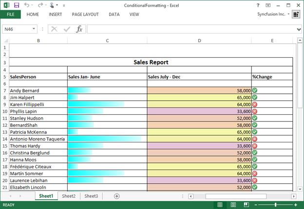

# Working with Conditional Formatting

Conditional formatting allows to format the contents of a cell dynamically. This can be defined and applied in XlsIO through the **IConditionalFormat** interface.

## Create a Conditional Format 

The IConditionalFormats represents a collection of conditional formats for a single IRange. One or more conditional formats can be added to the range as follows.

  

//Applying conditional formatting to "A1"
IConditionalFormats condition = worksheet.Range["A1"].ConditionalFormats;
IConditionalFormat condition1 = condition.AddCondition();



'Applying conditional formatting to "A1"
Dim condition As IConditionalFormats = worksheet.Range("A1").ConditionalFormats
Dim condition1 As IConditionalFormat = condition.AddCondition()



//Applying conditional formatting to "A1"
IConditionalFormats condition = worksheet.Range["A1"].ConditionalFormats;
IConditionalFormat condition1 = condition.AddCondition();



//Applying conditional formatting to "A1"
IConditionalFormats condition = worksheet.Range["A1"].ConditionalFormats;
IConditionalFormat condition1 = condition.AddCondition();



//Applying conditional formatting to "A1"
IConditionalFormats condition = worksheet.Range["A1"].ConditionalFormats;
IConditionalFormat condition1 = condition.AddCondition();

  

The target range should meet the criteria, which is set using the **IConditionalFormat** interface. The  desired format type is set through the **ExcelCFType** enumerator, which are the supported conditional format types in XlsIO. Refer to the following code.

  

//Represents conditional format rule that the value in target range should be between 10 and 20
condition1.FormatType = ExcelCFType.CellValue;
condition1.Operator = ExcelComparisonOperator.Between;
condition1.FirstFormula = "10";
condition1.SecondFormula = "20";
worksheet.Range["A1"].Text = "Enter a number between 10 and 20";



'Represents conditional format rule that the value in target range should be between 10 and 20
condition1.FormatType = ExcelCFType.CellValue
condition1.Operator = ExcelComparisonOperator.Between
condition1.FirstFormula = "10"
condition1.SecondFormula = "20"
worksheet.Range("A1").Text = "Enter a number between 10 and 20"



//Represents conditional format rule that the value in target range should be between 10 and 20
condition1.FormatType = ExcelCFType.CellValue;
condition1.Operator = ExcelComparisonOperator.Between;
condition1.FirstFormula = "10";
condition1.SecondFormula = "20";
worksheet.Range["A1"].Text = "Enter a number between 10 and 20";



//Represents conditional format rule that the value in target range should be between 10 and 20
condition1.FormatType = ExcelCFType.CellValue;
condition1.Operator = ExcelComparisonOperator.Between;
condition1.FirstFormula = "10";
condition1.SecondFormula = "20";
worksheet.Range["A1"].Text = "Enter a number between 10 and 20";



//Represents conditional format rule that the value in target range should be between 10 and 20
condition1.FormatType = ExcelCFType.CellValue;
condition1.Operator = ExcelComparisonOperator.Between;
condition1.FirstFormula = "10";
condition1.SecondFormula = "20";
worksheet.Range["A1"].Text = "Enter a number between 10 and 20";

  

When the criteria set for the target range is satisfied, the defined formats (like the one below) are applied in the order of priority. For more details about conditional format priority, see [Manage conditional formatting rule precedence](https://support.microsoft.com/en-us/office/video-manage-conditional-formatting-6b69364e-dc79-4fe4-bd94-1883e40848f9).

  

//Setting format properties to be applied when the above condition is met
condition1.BackColor = ExcelKnownColors.Light_orange;
condition1.IsBold = true;
condition1.IsItalic = true;



'Setting format properties to be applied when the above condition is met
condition1.BackColor = ExcelKnownColors.Light_orange
condition1.IsBold = True
condition1.IsItalic = True



//Setting format properties to be applied when the above condition is met
condition1.BackColor = ExcelKnownColors.Light_orange;
condition1.IsBold = true;
condition1.IsItalic = true;



//Setting format properties to be applied when the above condition is met
condition1.BackColor = ExcelKnownColors.Light_orange;
condition1.IsBold = true;
condition1.IsItalic = true;



//Setting format properties to be applied when the above condition is met
condition1.BackColor = ExcelKnownColors.Light_orange;
condition1.IsBold = true;
condition1.IsItalic = true;

  

The following code creates and applies various different conditional formats for different ranges in XlsIO.

  

using (ExcelEngine excelEngine = new ExcelEngine())
{
  IApplication application = excelEngine.Excel;
  application.DefaultVersion = ExcelVersion.Excel2013;
  IWorkbook workbook = application.Workbooks.Create(1);
  IWorksheet worksheet = workbook.Worksheets[0];

  //Applying conditional formatting to "A1"
  IConditionalFormats condition = worksheet.Range["A1"].ConditionalFormats;
  IConditionalFormat condition1 = condition.AddCondition();

  //Represents conditional format rule that the value in target range should be between 10 and 20
  condition1.FormatType = ExcelCFType.CellValue;
  condition1.Operator = ExcelComparisonOperator.Between;
  condition1.FirstFormula = "10";
  condition1.SecondFormula = "20";
  worksheet.Range["A1"].Text = "Enter a number between 10 and 20";

  //Setting back color and font style to be applied for target range
  condition1.BackColor = ExcelKnownColors.Light_orange;
  condition1.IsBold = true;
  condition1.IsItalic = true;

  //Applying conditional formatting to "A3"
  condition = worksheet.Range["A3"].ConditionalFormats;
  IConditionalFormat condition2 = condition.AddCondition();

  //Represents conditional format rule that the cell value should be 1000
  condition2.FormatType = ExcelCFType.CellValue;
  condition2.Operator = ExcelComparisonOperator.Equal;
  condition2.FirstFormula = "1000";
  worksheet.Range["A3"].Text = "Enter the Number as 1000";

  //Setting fill pattern and back color to target range
  condition2.FillPattern = ExcelPattern.LightUpwardDiagonal;
  condition2.BackColor = ExcelKnownColors.Yellow;

  //Applying conditional formatting to "A5"
  condition = worksheet.Range["A5"].ConditionalFormats;
  IConditionalFormat condition3 = condition.AddCondition();

  //Setting conditional format rule that the cell value for target range should be less than or equal to 1000
  condition3.FormatType = ExcelCFType.CellValue;
  condition3.Operator = ExcelComparisonOperator.LessOrEqual;
  condition3.FirstFormula = "1000";
  worksheet.Range["A5"].Text = "Enter a Number which is less than or equal to 1000";

  //Setting back color to target range
  condition3.BackColor = ExcelKnownColors.Light_green;

  workbook.SaveAs("ConditionalFormatting.xlsx");
}



Using excelEngine As ExcelEngine = New ExcelEngine()
  Dim application As IApplication = excelEngine.Excel
  application.DefaultVersion = ExcelVersion.Excel2013
  Dim workbook As IWorkbook = application.Workbooks.Create(1)
  Dim worksheet As IWorksheet = workbook.Worksheets(0)

  'Applying conditional formatting to "A1"
  Dim condition As IConditionalFormats = worksheet.Range("A1").ConditionalFormats
  Dim condition1 As IConditionalFormat = condition.AddCondition()

  'Represents conditional format rule that the value in target range should be between 10 and 20
  condition1.FormatType = ExcelCFType.CellValue
  condition1.Operator = ExcelComparisonOperator.Between
  condition1.FirstFormula = "10"
  condition1.SecondFormula = "20"
  worksheet.Range("A1").Text = "Enter a number between 10 and 20"

  'Setting back color and font style to be applied for target range
  condition1.BackColor = ExcelKnownColors.Light_orange
  condition1.IsBold = True
  condition1.IsItalic = True

  'Applying conditional formatting to "A3"
  condition = worksheet.Range("A3").ConditionalFormats
  Dim condition2 As IConditionalFormat = condition.AddCondition()

  'Represents conditional format rule that the cell value should be 1000
  condition2.FormatType = ExcelCFType.CellValue
  condition2.Operator = ExcelComparisonOperator.Equal
  condition2.FirstFormula = "1000"
  worksheet.Range("A3").Text = "Enter the Number as 1000"

  'Setting fill pattern and back color to target range
  condition2.FillPattern = ExcelPattern.LightUpwardDiagonal
  condition2.BackColor = ExcelKnownColors.Yellow

  'Applying conditional formatting to "A5"
  condition = worksheet.Range("A5").ConditionalFormats
  Dim condition3 As IConditionalFormat = condition.AddCondition()

  'Setting conditional format rule that the cell value for target range should be less than or equal to 1000
  condition3.FormatType = ExcelCFType.CellValue
  condition3.Operator = ExcelComparisonOperator.LessOrEqual
  condition3.FirstFormula = "1000"
  worksheet.Range("A5").Text = "Enter a Number which is less than or equal to 1000"

  'Setting back color to target range
  condition3.BackColor = ExcelKnownColors.Light_green

  workbook.SaveAs("ConditionalFormatting.xlsx")
End Using



using (ExcelEngine excelEngine = new ExcelEngine())
{
  IApplication application = excelEngine.Excel;
  application.DefaultVersion = ExcelVersion.Excel2013;
  IWorkbook workbook = application.Workbooks.Create(1);
  IWorksheet worksheet = workbook.Worksheets[0];

  //Applying conditional formatting to "A1"
  IConditionalFormats condition = worksheet.Range["A1"].ConditionalFormats;
  IConditionalFormat condition1 = condition.AddCondition();

  //Represents conditional format rule that the value in target range should be between 10 and 20
  condition1.FormatType = ExcelCFType.CellValue;
  condition1.Operator = ExcelComparisonOperator.Between;
  condition1.FirstFormula = "10";
  condition1.SecondFormula = "20";
  worksheet.Range["A1"].Text = "Enter a number between 10 and 20";

  //Setting back color and font style to be applied for target range
  condition1.BackColor = ExcelKnownColors.Light_orange;
  condition1.IsBold = true;
  condition1.IsItalic = true;

  //Applying conditional formatting to "A3"
  condition = worksheet.Range["A3"].ConditionalFormats;
  IConditionalFormat condition2 = condition.AddCondition();

  //Represents conditional format rule that the cell value should be 1000
  condition2.FormatType = ExcelCFType.CellValue;
  condition2.Operator = ExcelComparisonOperator.Equal;
  condition2.FirstFormula = "1000";
  worksheet.Range["A3"].Text = "Enter the Number as 1000";

  //Setting fill pattern and back color to target range
  condition2.FillPattern = ExcelPattern.LightUpwardDiagonal;
  condition2.BackColor = ExcelKnownColors.Yellow;

  //Applying conditional formatting to "A5"
  condition = worksheet.Range["A5"].ConditionalFormats;
  IConditionalFormat condition3 = condition.AddCondition();

  //Setting conditional format rule that the cell value for target range should be less than or equal to 1000
  condition3.FormatType = ExcelCFType.CellValue;
  condition3.Operator = ExcelComparisonOperator.LessOrEqual;
  condition3.FirstFormula = "1000";
  worksheet.Range["A5"].Text = "Enter a Number which is less than or equal to 1000";

  //Setting back color to target range
  condition3.BackColor = ExcelKnownColors.Light_green;

  //Initializes FileSavePicker
  FileSavePicker savePicker = new FileSavePicker();
  savePicker.SuggestedStartLocation = PickerLocationId.Desktop;
  savePicker.SuggestedFileName = "ConditionalFormatting";
  savePicker.FileTypeChoices.Add("Excel Files", new List<string>() { ".xlsx" });

  //Creates a storage file from FileSavePicker
  StorageFile storageFile = await savePicker.PickSaveFileAsync();

  //Saves changes to the specified storage file
  await workbook.SaveAsAsync(storageFile);
}



using (ExcelEngine excelEngine = new ExcelEngine())
{
  IApplication application = excelEngine.Excel;
  application.DefaultVersion = ExcelVersion.Excel2013;
  IWorkbook workbook = application.Workbooks.Create(1);
  IWorksheet worksheet = workbook.Worksheets[0];

  //Applying conditional formatting to "A1"
  IConditionalFormats condition = worksheet.Range["A1"].ConditionalFormats;
  IConditionalFormat condition1 = condition.AddCondition();

  //Represents conditional format rule that the value in target range should be between 10 and 20
  condition1.FormatType = ExcelCFType.CellValue;
  condition1.Operator = ExcelComparisonOperator.Between;
  condition1.FirstFormula = "10";
  condition1.SecondFormula = "20";
  worksheet.Range["A1"].Text = "Enter a number between 10 and 20";

  //Setting back color and font style to be applied for target range
  condition1.BackColor = ExcelKnownColors.Light_orange;
  condition1.IsBold = true;
  condition1.IsItalic = true;

  //Applying conditional formatting to "A3"
  condition = worksheet.Range["A3"].ConditionalFormats;
  IConditionalFormat condition2 = condition.AddCondition();

  //Represents conditional format rule that the cell value should be 1000
  condition2.FormatType = ExcelCFType.CellValue;
  condition2.Operator = ExcelComparisonOperator.Equal;
  condition2.FirstFormula = "1000";
  worksheet.Range["A3"].Text = "Enter the Number as 1000";

  //Setting fill pattern and back color to target range
  condition2.FillPattern = ExcelPattern.LightUpwardDiagonal;
  condition2.BackColor = ExcelKnownColors.Yellow;

  //Applying conditional formatting to "A5"
  condition = worksheet.Range["A5"].ConditionalFormats;
  IConditionalFormat condition3 = condition.AddCondition();

  //Setting conditional format rule that the cell value for target range should be less than or equal to 1000
  condition3.FormatType = ExcelCFType.CellValue;
  condition3.Operator = ExcelComparisonOperator.LessOrEqual;
  condition3.FirstFormula = "1000";
  worksheet.Range["A5"].Text = "Enter a Number which is less than or equal to 1000";

  //Setting back color to target range
  condition3.BackColor = ExcelKnownColors.Light_green;

  //Saving the workbook as stream
  FileStream stream = new FileStream("ConditionalFormatting.xlsx", FileMode.Create, FileAccess.ReadWrite);
  workbook.SaveAs(stream);
  stream.Dispose();
}



using (ExcelEngine excelEngine = new ExcelEngine())
{
  IApplication application = excelEngine.Excel;
  application.DefaultVersion = ExcelVersion.Excel2013;
  IWorkbook workbook = application.Workbooks.Create(1);
  IWorksheet worksheet = workbook.Worksheets[0];

  //Applying conditional formatting to "A1"
  IConditionalFormats condition = worksheet.Range["A1"].ConditionalFormats;
  IConditionalFormat condition1 = condition.AddCondition();

  //Represents conditional format rule that the value in target range should be between 10 and 20
  condition1.FormatType = ExcelCFType.CellValue;
  condition1.Operator = ExcelComparisonOperator.Between;
  condition1.FirstFormula = "10";
  condition1.SecondFormula = "20";
  worksheet.Range["A1"].Text = "Enter a number between 10 and 20";

  //Setting back color and font style to be applied for target range
  condition1.BackColor = ExcelKnownColors.Light_orange;
  condition1.IsBold = true;
  condition1.IsItalic = true;

  //Applying conditional formatting to "A3"
  condition = worksheet.Range["A3"].ConditionalFormats;
  IConditionalFormat condition2 = condition.AddCondition();

  //Represents conditional format rule that the cell value should be 1000
  condition2.FormatType = ExcelCFType.CellValue;
  condition2.Operator = ExcelComparisonOperator.Equal;
  condition2.FirstFormula = "1000";
  worksheet.Range["A3"].Text = "Enter the Number as 1000";

  //Setting fill pattern and back color to target range
  condition2.FillPattern = ExcelPattern.LightUpwardDiagonal;
  condition2.BackColor = ExcelKnownColors.Yellow;

  //Applying conditional formatting to "A5"
  condition = worksheet.Range["A5"].ConditionalFormats;
  IConditionalFormat condition3 = condition.AddCondition();

  //Setting conditional format rule that the cell value for target range should be less than or equal to 1000
  condition3.FormatType = ExcelCFType.CellValue;
  condition3.Operator = ExcelComparisonOperator.LessOrEqual;
  condition3.FirstFormula = "1000";
  worksheet.Range["A5"].Text = "Enter a Number which is less than or equal to 1000";

  //Setting back color to target range
  condition3.BackColor = ExcelKnownColors.Light_green;

  //Saving the workbook as stream
  MemoryStream stream = new MemoryStream();
  workbook.SaveAs(stream);

  stream.Position = 0;

  //Save the document as file and view the saved document
  //The operation in SaveAndView under Xamarin varies between Windows Phone, Android, and iOS platforms. Refer to the xlsio/xamarin section for respective code samples.
  if (Device.OS == TargetPlatform.WinPhone || Device.OS == TargetPlatform.Windows)
  {
    Xamarin.Forms.DependencyService.Get<ISaveWindowsPhone>().SaveAndView("ConditionalFormatting.xlsx", "application/msexcel", stream);
  }
  else
  {
    Xamarin.Forms.DependencyService.Get<ISave>().SaveAndView("ConditionalFormatting.xlsx", "application/msexcel", stream);
  }
}



A complete working example to create conditional formatting in C# is present on [this GitHub page](https://github.com/SyncfusionExamples/XlsIO-Examples/tree/master/Conditional%20Formatting/Create%20Conditional%20Format).

N> Excel allows the addition of a maximum of three conditions for the same cell in the Biff8 format and XlsIO. However, this restriction is removed from the Excel 2007 formats.

N> The conditional formats for a single range should be added in descending order in XlsIO.

When proper criteria is met, the output file looks as follows:

## Reading Conditional Formats in XlsIO

XlsIO also reads conditional formats from existing excel workbook. The following code example illustrates this.

  

using (ExcelEngine excelEngine = new ExcelEngine())
{
  IApplication application = excelEngine.Excel;
  application.DefaultVersion = ExcelVersion.Excel2013;
  IWorkbook workbook = application.Workbooks.Open("Sample.xlsx", ExcelOpenType.Automatic);
  IWorksheet worksheet = workbook.Worksheets[0];

  //Read conditional formatting settings 
  string formatType = worksheet.Range["A1"].ConditionalFormats[0].FormatType.ToString();
  string cfOperator = worksheet.Range["A1"].ConditionalFormats[0].Operator.ToString();
  string backColor = worksheet.Range["A1"].ConditionalFormats[0].BackColor.ToString();

  workbook.SaveAs("Output.xlsx");
}



Using excelEngine As ExcelEngine = New ExcelEngine()
  Dim application As IApplication = excelEngine.Excel
  application.DefaultVersion = ExcelVersion.Excel2013
  Dim workbook As IWorkbook = application.Workbooks.Open("Sample.xlsx", ExcelOpenType.Automatic)
  Dim worksheet As IWorksheet = workbook.Worksheets(0)

  'Read conditional formatting settings
  Dim formatType As String = worksheet.Range("A1").ConditionalFormats(0).FormatType.ToString()
  Dim cfOperator As String = worksheet.Range("A1").ConditionalFormats(0).Operator.ToString()
  Dim backColor As String = worksheet.Range("A1").ConditionalFormats(0).BackColor.ToString()

  workbook.SaveAs("Output.xlsx")
End Using



using (ExcelEngine excelEngine = new ExcelEngine())
{
  IApplication application = excelEngine.Excel;
  application.DefaultVersion = ExcelVersion.Excel2013;
  
  //Instantiates the File Picker
  FileOpenPicker openPicker = new FileOpenPicker();
  openPicker.SuggestedStartLocation = PickerLocationId.Desktop;
  openPicker.FileTypeFilter.Add(".xlsx");
  openPicker.FileTypeFilter.Add(".xls");
  StorageFile file = await openPicker.PickSingleFileAsync();

  //Opens the workbook
  IWorkbook workbook = await application.Workbooks.OpenAsync(file, ExcelOpenType.Automatic);
  IWorksheet worksheet = workbook.Worksheets[0];

  //Read conditional formatting settings 
  string formatType = worksheet.Range["A1"].ConditionalFormats[0].FormatType.ToString();
  string cfOperator = worksheet.Range["A1"].ConditionalFormats[0].Operator.ToString();
  string backColor = worksheet.Range["A1"].ConditionalFormats[0].BackColor.ToString();

  //Initializes FileSavePicker
  FileSavePicker savePicker = new FileSavePicker();
  savePicker.SuggestedStartLocation = PickerLocationId.Desktop;
  savePicker.SuggestedFileName = "Output";
  savePicker.FileTypeChoices.Add("Excel Files", new List<string>() { ".xlsx" });

  //Creates a storage file from FileSavePicker
  StorageFile storageFile = await savePicker.PickSaveFileAsync();

  //Saves changes to the specified storage file
  await workbook.SaveAsAsync(storageFile);
}



using (ExcelEngine excelEngine = new ExcelEngine())
{
  IApplication application = excelEngine.Excel;
  application.DefaultVersion = ExcelVersion.Excel2013;
  
  FileStream fileStream = new FileStream("Sample.xlsx", FileMode.Open, FileAccess.Read);
  IWorkbook workbook = application.Workbooks.Open(fileStream, ExcelOpenType.Automatic);
  IWorksheet worksheet = workbook.Worksheets[0];

  //Read conditional formatting settings 
  string formatType = worksheet.Range["A1"].ConditionalFormats[0].FormatType.ToString();
  string cfOperator = worksheet.Range["A1"].ConditionalFormats[0].Operator.ToString();
  string backColor = worksheet.Range["A1"].ConditionalFormats[0].BackColor.ToString();

  //Saving the workbook as stream
  FileStream stream = new FileStream("Output.xlsx", FileMode.Create, FileAccess.ReadWrite);
  workbook.SaveAs(stream);
  stream.Dispose();
}



using (ExcelEngine excelEngine = new ExcelEngine())
{
  IApplication application = excelEngine.Excel;
  application.DefaultVersion = ExcelVersion.Excel2013;
  
  //"App" is the class of Portable project
  Assembly assembly = typeof(App).GetTypeInfo().Assembly;
  Stream inputStream = assembly.GetManifestResourceStream("SampleBrowser.XlsIO.Samples.Template.Sample.xlsx");
  IWorkbook workbook = application.Workbooks.Open(inputStream, ExcelOpenType.Automatic);
  IWorksheet worksheet = workbook.Worksheets[0];

  //Read conditional formatting settings 
  string formatType = worksheet.Range["A1"].ConditionalFormats[0].FormatType.ToString();
  string cfOperator = worksheet.Range["A1"].ConditionalFormats[0].Operator.ToString();
  string backColor = worksheet.Range["A1"].ConditionalFormats[0].BackColor.ToString();

  //Saving the workbook as stream
  MemoryStream stream = new MemoryStream();
  workbook.SaveAs(stream);

  stream.Position = 0;

  //Save the document as file and view the saved document
  //The operation in SaveAndView under Xamarin varies between Windows Phone, Android, and iOS platforms. Refer to the xlsio/xamarin section for respective code samples.
  if (Device.OS == TargetPlatform.WinPhone || Device.OS == TargetPlatform.Windows)
  {
    Xamarin.Forms.DependencyService.Get<ISaveWindowsPhone>().SaveAndView("Output.xlsx", "application/msexcel", stream);
  }
  else
  {
    Xamarin.Forms.DependencyService.Get<ISave>().SaveAndView("Output.xlsx", "application/msexcel", stream);
  }
}



A complete working example to read conditional formatting in C# is present on [this GitHub page](https://github.com/SyncfusionExamples/XlsIO-Examples/tree/master/Conditional%20Formatting/Read%20Conditional%20Format).

## Removing Conditional Formats

All the conditional formats for a specified range can be removed using the **Remove** method. This is illustrated as follows.

  

using (ExcelEngine excelEngine = new ExcelEngine())
{
  IApplication application = excelEngine.Excel;
  application.DefaultVersion = ExcelVersion.Excel2013;
  IWorkbook workbook = application.Workbooks.Open("Sample.xlsx", ExcelOpenType.Automatic);
  IWorksheet worksheet = workbook.Worksheets[0];

  //Removing conditional format for a specified range
  worksheet.Range["E5"].ConditionalFormats.Remove();

  workbook.SaveAs("Output.xlsx");
}



Using excelEngine As ExcelEngine = New ExcelEngine()
  Dim application As IApplication = excelEngine.Excel
  application.DefaultVersion = ExcelVersion.Excel2013
  Dim workbook As IWorkbook = application.Workbooks.Open("Sample.xlsx", ExcelOpenType.Automatic)
  Dim worksheet As IWorksheet = workbook.Worksheets(0)

  'Removing conditional format for a specified range
  worksheet.Range("E5").ConditionalFormats.Remove()

  workbook.SaveAs("Output.xlsx")
End Using



using (ExcelEngine excelEngine = new ExcelEngine())
{
  IApplication application = excelEngine.Excel;
  application.DefaultVersion = ExcelVersion.Excel2013;
  
  //Instantiates the File Picker
  FileOpenPicker openPicker = new FileOpenPicker();
  openPicker.SuggestedStartLocation = PickerLocationId.Desktop;
  openPicker.FileTypeFilter.Add(".xlsx");
  openPicker.FileTypeFilter.Add(".xls");
  StorageFile file = await openPicker.PickSingleFileAsync();

  //Opens the workbook
  IWorkbook workbook = await application.Workbooks.OpenAsync(file, ExcelOpenType.Automatic);
  IWorksheet worksheet = workbook.Worksheets[0];

  //Removing conditional format for a specified range 
  worksheet.Range["E5"].ConditionalFormats.Remove();

  //Initializes FileSavePicker
  FileSavePicker savePicker = new FileSavePicker();
  savePicker.SuggestedStartLocation = PickerLocationId.Desktop;
  savePicker.SuggestedFileName = "Output";
  savePicker.FileTypeChoices.Add("Excel Files", new List<string>() { ".xlsx" });

  //Creates a storage file from FileSavePicker
  StorageFile storageFile = await savePicker.PickSaveFileAsync();

  //Saves changes to the specified storage file
  await workbook.SaveAsAsync(storageFile);
}



using (ExcelEngine excelEngine = new ExcelEngine())
{
  IApplication application = excelEngine.Excel;
  application.DefaultVersion = ExcelVersion.Excel2013;
  
  FileStream fileStream = new FileStream("Sample.xlsx", FileMode.Open, FileAccess.Read);
  IWorkbook workbook = application.Workbooks.Open(fileStream, ExcelOpenType.Automatic);
  IWorksheet worksheet = workbook.Worksheets[0];

  //Removing conditional format for a specified range 
  worksheet.Range["E5"].ConditionalFormats.Remove();

  //Saving the workbook as stream
  FileStream stream = new FileStream("Output.xlsx", FileMode.Create, FileAccess.ReadWrite);
  workbook.SaveAs(stream);
  stream.Dispose();
}



using (ExcelEngine excelEngine = new ExcelEngine())
{
  IApplication application = excelEngine.Excel;
  application.DefaultVersion = ExcelVersion.Excel2013;
  
  //"App" is the class of Portable project
  Assembly assembly = typeof(App).GetTypeInfo().Assembly;
  Stream inputStream = assembly.GetManifestResourceStream("SampleBrowser.XlsIO.Samples.Template.Sample.xlsx");
  IWorkbook workbook = application.Workbooks.Open(inputStream, ExcelOpenType.Automatic);
  IWorksheet worksheet = workbook.Worksheets[0];

  //Removing conditional format for a specified range 
  worksheet.Range["E5"].ConditionalFormats.Remove();

  //Saving the workbook as stream
  MemoryStream stream = new MemoryStream();
  workbook.SaveAs(stream);

  stream.Position = 0;

  //Save the document as file and view the saved document
  //The operation in SaveAndView under Xamarin varies between Windows Phone, Android, and iOS platforms. Refer to the xlsio/xamarin section for respective code samples.
  if (Device.OS == TargetPlatform.WinPhone || Device.OS == TargetPlatform.Windows)
  {
    Xamarin.Forms.DependencyService.Get<ISaveWindowsPhone>().SaveAndView("Output.xlsx", "application/msexcel", stream);
  }
  else
  {
    Xamarin.Forms.DependencyService.Get<ISave>().SaveAndView("Output.xlsx", "application/msexcel", stream);
  }
}



A complete working example to remove conditional formatting in C# is present on [this GitHub page](https://github.com/SyncfusionExamples/XlsIO-Examples/tree/master/Conditional%20Formatting/Remove%20Conditional%20Format).

### Removing Conditional Formats at specified index value

A particular conditional format at the specified range can be removed by using the *RemoveAt** method as follows.

  

using (ExcelEngine excelEngine = new ExcelEngine())
{
  IApplication application = excelEngine.Excel;
  application.DefaultVersion = ExcelVersion.Excel2013;
  IWorkbook workbook = application.Workbooks.Open("Sample.xlsx", ExcelOpenType.Automatic);
  IWorksheet worksheet = workbook.Worksheets[0];

  //Removing first conditional Format at the specified Range
  worksheet.Range["E5"].ConditionalFormats.RemoveAt(0);

  workbook.SaveAs("Output.xlsx");
}



Using excelEngine As ExcelEngine = New ExcelEngine()
  Dim application As IApplication = excelEngine.Excel
  application.DefaultVersion = ExcelVersion.Excel2013
  Dim workbook As IWorkbook = application.Workbooks.Open("Sample.xlsx", ExcelOpenType.Automatic)
  Dim worksheet As IWorksheet = workbook.Worksheets(0)

  'Removing first conditional Format at the specified Range
  worksheet.Range("E5").ConditionalFormats.RemoveAt(0)

  workbook.SaveAs("Output.xlsx")
End Using



using (ExcelEngine excelEngine = new ExcelEngine())
{
  IApplication application = excelEngine.Excel;
  application.DefaultVersion = ExcelVersion.Excel2013;

  //Instantiates the File Picker
  FileOpenPicker openPicker = new FileOpenPicker();
  openPicker.SuggestedStartLocation = PickerLocationId.Desktop;
  openPicker.FileTypeFilter.Add(".xlsx");
  openPicker.FileTypeFilter.Add(".xls");
  StorageFile file = await openPicker.PickSingleFileAsync();

  //Opens the workbook
  IWorkbook workbook = await application.Workbooks.OpenAsync(file, ExcelOpenType.Automatic);
  IWorksheet worksheet = workbook.Worksheets[0];

  //Removing first conditional Format at the specified Range
  worksheet.Range["E5"].ConditionalFormats.RemoveAt(0);

  //Initializes FileSavePicker
  FileSavePicker savePicker = new FileSavePicker();
  savePicker.SuggestedStartLocation = PickerLocationId.Desktop;
  savePicker.SuggestedFileName = "Output";
  savePicker.FileTypeChoices.Add("Excel Files", new List<string>() { ".xlsx" });

  //Creates a storage file from FileSavePicker
  StorageFile storageFile = await savePicker.PickSaveFileAsync();

  //Saves changes to the specified storage file
  await workbook.SaveAsAsync(storageFile);
}



using (ExcelEngine excelEngine = new ExcelEngine())
{
  IApplication application = excelEngine.Excel;
  application.DefaultVersion = ExcelVersion.Excel2013;
  
  FileStream fileStream = new FileStream("Sample.xlsx", FileMode.Open, FileAccess.Read);
  IWorkbook workbook = application.Workbooks.Open(fileStream, ExcelOpenType.Automatic);
  IWorksheet worksheet = workbook.Worksheets[0];

  //Removing first conditional Format at the specified Range
  worksheet.Range["E5"].ConditionalFormats.RemoveAt(0);

  //Saving the workbook as stream
  FileStream stream = new FileStream("Output.xlsx", FileMode.Create, FileAccess.ReadWrite);
  workbook.SaveAs(stream);
  stream.Dispose();
}



using (ExcelEngine excelEngine = new ExcelEngine())
{
  IApplication application = excelEngine.Excel;
  application.DefaultVersion = ExcelVersion.Excel2013;
  
  //"App" is the class of Portable project
  Assembly assembly = typeof(App).GetTypeInfo().Assembly;
  Stream inputStream = assembly.GetManifestResourceStream("SampleBrowser.XlsIO.Samples.Template.Sample.xlsx");
  IWorkbook workbook = application.Workbooks.Open(inputStream, ExcelOpenType.Automatic);
  IWorksheet worksheet = workbook.Worksheets[0];

  //Removing first conditional Format at the specified Range
  worksheet.Range["E5"].ConditionalFormats.RemoveAt(0);

  //Saving the workbook as stream
  MemoryStream stream = new MemoryStream();
  workbook.SaveAs(stream);

  stream.Position = 0;

  //Save the document as file and view the saved document
  //The operation in SaveAndView under Xamarin varies between Windows Phone, Android, and iOS platforms. Refer to the xlsio/xamarin section for respective code samples.
  if (Device.OS == TargetPlatform.WinPhone || Device.OS == TargetPlatform.Windows)
  {
    Xamarin.Forms.DependencyService.Get<ISaveWindowsPhone>().SaveAndView("Output.xlsx", "application/msexcel", stream);
  }
  else
  {
    Xamarin.Forms.DependencyService.Get<ISave>().SaveAndView("Output.xlsx", "application/msexcel", stream);
  }
}



A complete working example to remove conditional formatting at specified index in C# is present on [this GitHub page](https://github.com/SyncfusionExamples/XlsIO-Examples/tree/master/Conditional%20Formatting/Remove%20at%20Index).

### Removing Conditional Formats from entire sheet

The entire conditional formats from the worksheet can be removed as follows.

  

using (ExcelEngine excelEngine = new ExcelEngine())
{
  IApplication application = excelEngine.Excel;
  application.DefaultVersion = ExcelVersion.Excel2013;
  IWorkbook workbook = application.Workbooks.Open("Sample.xlsx", ExcelOpenType.Automatic);
  IWorksheet worksheet = workbook.Worksheets[0];

  //Removing Conditional Formatting Settings From Entire Sheet
  worksheet.UsedRange.Clear(ExcelClearOptions.ClearConditionalFormats);

  workbook.SaveAs("Output.xlsx");
}



Using excelEngine As ExcelEngine = New ExcelEngine()
  Dim application As IApplication = excelEngine.Excel
  application.DefaultVersion = ExcelVersion.Excel2013
  Dim workbook As IWorkbook = application.Workbooks.Open("Sample.xlsx", ExcelOpenType.Automatic)
  Dim worksheet As IWorksheet = workbook.Worksheets(0)

  'Removing Conditional Formatting Settings From Entire Sheet
  worksheet.UsedRange.Clear(ExcelClearOptions.ClearConditionalFormats)

  workbook.SaveAs("Output.xlsx")
End Using



using (ExcelEngine excelEngine = new ExcelEngine())
{
  IApplication application = excelEngine.Excel;
  application.DefaultVersion = ExcelVersion.Excel2013;

  //Instantiates the File Picker
  FileOpenPicker openPicker = new FileOpenPicker();
  openPicker.SuggestedStartLocation = PickerLocationId.Desktop;
  openPicker.FileTypeFilter.Add(".xlsx");
  openPicker.FileTypeFilter.Add(".xls");
  StorageFile file = await openPicker.PickSingleFileAsync();

  //Opens the workbook
  IWorkbook workbook = await application.Workbooks.OpenAsync(file, ExcelOpenType.Automatic);
  IWorksheet worksheet = workbook.Worksheets[0];

  //Removing Conditional Formatting Settings From Entire Sheet
  worksheet.UsedRange.Clear(ExcelClearOptions.ClearConditionalFormats);

  //Initializes FileSavePicker
  FileSavePicker savePicker = new FileSavePicker();
  savePicker.SuggestedStartLocation = PickerLocationId.Desktop;
  savePicker.SuggestedFileName = "Output";
  savePicker.FileTypeChoices.Add("Excel Files", new List<string>() { ".xlsx" });

  //Creates a storage file from FileSavePicker
  StorageFile storageFile = await savePicker.PickSaveFileAsync();

  //Saves changes to the specified storage file
  await workbook.SaveAsAsync(storageFile);
}



using (ExcelEngine excelEngine = new ExcelEngine())
{
  IApplication application = excelEngine.Excel;
  application.DefaultVersion = ExcelVersion.Excel2013;

  FileStream fileStream = new FileStream("Sample.xlsx", FileMode.Open, FileAccess.Read);
  IWorkbook workbook = application.Workbooks.Open(fileStream, ExcelOpenType.Automatic);
  IWorksheet worksheet = workbook.Worksheets[0];

  //Removing Conditional Formatting Settings From Entire Sheet
  worksheet.UsedRange.Clear(ExcelClearOptions.ClearConditionalFormats);

  //Saving the workbook as stream
  FileStream stream = new FileStream("Output.xlsx", FileMode.Create, FileAccess.ReadWrite);
  workbook.SaveAs(stream);
  stream.Dispose();
}



using (ExcelEngine excelEngine = new ExcelEngine())
{
  IApplication application = excelEngine.Excel;
  application.DefaultVersion = ExcelVersion.Excel2013;

  //"App" is the class of Portable project
  Assembly assembly = typeof(App).GetTypeInfo().Assembly;
  Stream inputStream = assembly.GetManifestResourceStream("SampleBrowser.XlsIO.Samples.Template.Sample.xlsx");
  IWorkbook workbook = application.Workbooks.Open(inputStream, ExcelOpenType.Automatic);
  IWorksheet worksheet = workbook.Worksheets[0];

  //Removing Conditional Formatting Settings From Entire Sheet
  worksheet.UsedRange.Clear(ExcelClearOptions.ClearConditionalFormats);

  //Saving the workbook as stream
  MemoryStream stream = new MemoryStream();
  workbook.SaveAs(stream);

  stream.Position = 0;

  //Save the document as file and view the saved document
  //The operation in SaveAndView under Xamarin varies between Windows Phone, Android, and iOS platforms. Refer to the xlsio/xamarin section for respective code samples.
  if (Device.OS == TargetPlatform.WinPhone || Device.OS == TargetPlatform.Windows)
  {
    Xamarin.Forms.DependencyService.Get<ISaveWindowsPhone>().SaveAndView("Output.xlsx", "application/msexcel", stream);
  }
  else
  {
    Xamarin.Forms.DependencyService.Get<ISave>().SaveAndView("Output.xlsx", "application/msexcel", stream);
  }
}



A complete working example to remove conditional formatting in entire worksheet in C# is present on [this GitHub page](https://github.com/SyncfusionExamples/XlsIO-Examples/tree/master/Conditional%20Formatting/Remove%20all%20Conditional%20Formats).

## Using FormulaR1C1 property in Conditional Formats

XlsIO sets the formula for the conditional format in R1C1-style notation. The following code example illustrates this.

  

using (ExcelEngine excelEngine = new ExcelEngine())
{
  IApplication application = excelEngine.Excel;
  application.DefaultVersion = ExcelVersion.Excel2013;
  IWorkbook workbook = application.Workbooks.Create(1);
  IWorksheet worksheet = workbook.Worksheets[0];

  //Using FormulaR1C1 property in Conditional Formatting
  IConditionalFormats condition = worksheet.Range["E5:E18"].ConditionalFormats;
  IConditionalFormat condition1 = condition.AddCondition();
  condition1.FirstFormulaR1C1 = "=R[1]C[0]";
  condition1.SecondFormulaR1C1 = "=R[1]C[1]";

  workbook.SaveAs("Output.xlsx");
}



Using excelEngine As ExcelEngine = New ExcelEngine()
  Dim application As IApplication = excelEngine.Excel
  application.DefaultVersion = ExcelVersion.Excel2013
  Dim workbook As IWorkbook = application.Workbooks.Create(1)
  Dim worksheet As IWorksheet = workbook.Worksheets(0)

  'Using FormulaR1C1 property in Conditional Formatting
  Dim condition As IConditionalFormats = worksheet.Range("E5:E18").ConditionalFormats
  Dim condition1 As IConditionalFormat = condition.AddCondition()
  condition1.FirstFormulaR1C1 = "=R[1]C[0]"
  condition1.SecondFormulaR1C1 = "=R[1]C[1]"

  workbook.SaveAs("Output.xlsx")
End Using



using (ExcelEngine excelEngine = new ExcelEngine())
{
  IApplication application = excelEngine.Excel;
  application.DefaultVersion = ExcelVersion.Excel2013;
  IWorkbook workbook = application.Workbooks.Create(1);
  IWorksheet worksheet = workbook.Worksheets[0];

  //Using FormulaR1C1 property in Conditional Formatting 
  IConditionalFormats condition = worksheet.Range["E5:E18"].ConditionalFormats;
  IConditionalFormat condition1 = condition.AddCondition();
  condition1.FirstFormulaR1C1 = "=R[1]C[0]";
  condition1.SecondFormulaR1C1 = "=R[1]C[1]";

  //Initializes FileSavePicker
  FileSavePicker savePicker = new FileSavePicker();
  savePicker.SuggestedStartLocation = PickerLocationId.Desktop;
  savePicker.SuggestedFileName = "Output";
  savePicker.FileTypeChoices.Add("Excel Files", new List<string>() { ".xlsx" });

  //Creates a storage file from FileSavePicker
  StorageFile storageFile = await savePicker.PickSaveFileAsync();

  //Saves changes to the specified storage file
  await workbook.SaveAsAsync(storageFile);
}



using (ExcelEngine excelEngine = new ExcelEngine())
{
  IApplication application = excelEngine.Excel;
  application.DefaultVersion = ExcelVersion.Excel2013;
  IWorkbook workbook = application.Workbooks.Create(1);
  IWorksheet worksheet = workbook.Worksheets[0];

  //Using FormulaR1C1 property in Conditional Formatting 
  IConditionalFormats condition = worksheet.Range["E5:E18"].ConditionalFormats;
  IConditionalFormat condition1 = condition.AddCondition();
  condition1.FirstFormulaR1C1 = "=R[1]C[0]";
  condition1.SecondFormulaR1C1 = "=R[1]C[1]";

  //Saving the workbook as stream
  FileStream stream = new FileStream("Output.xlsx", FileMode.Create, FileAccess.ReadWrite);
  workbook.SaveAs(stream);
  stream.Dispose();
}



using (ExcelEngine excelEngine = new ExcelEngine())
{
  IApplication application = excelEngine.Excel;
  application.DefaultVersion = ExcelVersion.Excel2013;
  IWorkbook workbook = application.Workbooks.Create(1);
  IWorksheet worksheet = workbook.Worksheets[0];

  //Using FormulaR1C1 property in Conditional Formatting 
  IConditionalFormats condition = worksheet.Range["E5:E18"].ConditionalFormats;
  IConditionalFormat condition1 = condition.AddCondition();
  condition1.FirstFormulaR1C1 = "=R[1]C[0]";
  condition1.SecondFormulaR1C1 = "=R[1]C[1]";

  //Saving the workbook as stream
  MemoryStream stream = new MemoryStream();
  workbook.SaveAs(stream);

  stream.Position = 0;

  //Save the document as file and view the saved document
  //The operation in SaveAndView under Xamarin varies between Windows Phone, Android, and iOS platforms. Refer to the xlsio/xamarin section for respective code samples.
  if (Device.OS == TargetPlatform.WinPhone || Device.OS == TargetPlatform.Windows)
  {
    Xamarin.Forms.DependencyService.Get<ISaveWindowsPhone>().SaveAndView("Output.xlsx", "application/msexcel", stream);
  }
  else
  {
    Xamarin.Forms.DependencyService.Get<ISave>().SaveAndView("Output.xlsx", "application/msexcel", stream);
  }
}



A complete working example to create conditional formatting with R1C1 in C# is present on [this GitHub page](https://github.com/SyncfusionExamples/XlsIO-Examples/tree/master/Conditional%20Formatting/Conditional%20Format%20with%20R1C1).

## Format Unique and Duplicate Values

Format unique and duplicate values of an Excel range using conditional formatting. The values, Unique and Duplicate of the enumeration ExcelCFType helps to achieve the requirement.

The below code example shows how to format unique and duplicate values using conditional formatting in XlsIO.

  

using (ExcelEngine excelEngine = new ExcelEngine())
{
  IApplication application = excelEngine.Excel;
  application.DefaultVersion = ExcelVersion.Excel2016;
  IWorkbook workbook = application.Workbooks.Create(1);
  IWorksheet worksheet = workbook.Worksheets[0];
  
  //Fill worksheet with data
  worksheet.Range["A1:B1"].Merge();
  worksheet.Range["A1:B1"].CellStyle.Font.RGBColor = Color.FromArgb(255, 102, 102, 255);
  worksheet.Range["A1:B1"].CellStyle.Font.Size = 14;
  worksheet.Range["A1:B1"].CellStyle.HorizontalAlignment = ExcelHAlign.HAlignCenter;
  worksheet.Range["A1"].Text = "Global Internet Usage";
  worksheet.Range["A1:B1"].CellStyle.Font.Bold = true;
  
  worksheet.Range["A3:B21"].CellStyle.Font.RGBColor = Color.FromArgb(255, 64, 64, 64);
  worksheet.Range["A3:B3"].CellStyle.Font.Bold = true;
  worksheet.Range["B3"].CellStyle.HorizontalAlignment = ExcelHAlign.HAlignRight;
  
  worksheet.Range["A3"].Text = "Country";
  worksheet.Range["A4"].Text = "Northern America";
  worksheet.Range["A5"].Text = "Central America";
  worksheet.Range["A6"].Text = "The Caribbean";
  worksheet.Range["A7"].Text = "South America";
  worksheet.Range["A8"].Text = "Northern Europe";
  worksheet.Range["A9"].Text = "Eastern Europe";
  worksheet.Range["A10"].Text = "Western Europe";
  worksheet.Range["A11"].Text = "Southern Europe";
  worksheet.Range["A12"].Text = "Northern Africa";
  worksheet.Range["A13"].Text = "Eastern Africa";
  worksheet.Range["A14"].Text = "Middle Africa";
  worksheet.Range["A15"].Text = "Western Africa";
  worksheet.Range["A16"].Text = "Southern Africa";
  worksheet.Range["A17"].Text = "Central Asia";
  worksheet.Range["A18"].Text = "Eastern Asia";
  worksheet.Range["A19"].Text = "Southern Asia";
  worksheet.Range["A20"].Text = "SouthEast Asia";
  worksheet.Range["A21"].Text = "Oceania";    
  
  worksheet.Range["B3"].Text = "Usage";
  worksheet.Range["B4"].Value = "88%";
  worksheet.Range["B5"].Value = "61%";
  worksheet.Range["B6"].Value = "49%";
  worksheet.Range["B7"].Value = "68%";
  worksheet.Range["B8"].Value = "94%";
  worksheet.Range["B9"].Value = "74%";
  worksheet.Range["B10"].Value = "90%";
  worksheet.Range["B11"].Value = "77%";
  worksheet.Range["B12"].Value = "49%";
  worksheet.Range["B13"].Value = "27%";
  worksheet.Range["B14"].Value = "12%";
  worksheet.Range["B15"].Value = "39%";
  worksheet.Range["B16"].Value = "51%";
  worksheet.Range["B17"].Value = "50%";
  worksheet.Range["B18"].Value = "58%";
  worksheet.Range["B19"].Value = "36%";
  worksheet.Range["B20"].Value = "58%";
  worksheet.Range["B21"].Value = "69%";
  
  worksheet.SetColumnWidth(1, 23.45);
  worksheet.SetColumnWidth(2, 8.09);
  
  IConditionalFormats conditionalFormats =
  worksheet.Range["A4:B21"].ConditionalFormats;
  IConditionalFormat condition = conditionalFormats.AddCondition();
  
  //conditional format to set duplicate format type
  condition.FormatType = ExcelCFType.Duplicate;
  condition.BackColorRGB = Color.FromArgb(255, 255, 199, 206);
  
  //Saves the Excel
  workbook.SaveAs("Output.xlsx");
}



Using excelEngine As ExcelEngine = New ExcelEngine()
  Dim application As IApplication = excelEngine.Excel
  application.DefaultVersion = ExcelVersion.Excel2016
  Dim workbook As IWorkbook = application.Workbooks.Create(1)
  Dim worksheet As IWorksheet = workbook.Worksheets(0)
  
  'Fill worksheet with data
  worksheet.Range("A1:B1").Merge()
  worksheet.Range("A1:B1").CellStyle.Font.RGBColor = Color.FromArgb(255, 102, 102, 255)
  worksheet.Range("A1:B1").CellStyle.Font.Size = 14
  worksheet.Range("A1:B1").CellStyle.HorizontalAlignment = ExcelHAlign.HAlignCenter
  worksheet.Range("A1").Text = "Global Internet Usage"
  
  worksheet.Range("A1:B1").CellStyle.Font.Bold = True
  worksheet.Range("A3:B21").CellStyle.Font.RGBColor = Color.FromArgb(255, 64, 64, 64)
  worksheet.Range("A3:B3").CellStyle.Font.Bold = True
  worksheet.Range("B3").CellStyle.HorizontalAlignment = ExcelHAlign.HAlignRight
  
  worksheet.Range("A3").Text = "Country"
  worksheet.Range("A4").Text = "Northern America"
  worksheet.Range("A5").Text = "Central America"
  worksheet.Range("A6").Text = "The Caribbean"
  worksheet.Range("A7").Text = "South America"
  worksheet.Range("A8").Text = "Northern Europe"
  worksheet.Range("A9").Text = "Eastern Europe"
  worksheet.Range("A10").Text = "Western Europe"
  worksheet.Range("A11").Text = "Southern Europe"
  worksheet.Range("A12").Text = "Northern Africa"
  worksheet.Range("A13").Text = "Eastern Africa"
  worksheet.Range("A14").Text = "Middle Africa"
  worksheet.Range("A15").Text = "Western Africa"
  worksheet.Range("A16").Text = "Southern Africa"
  worksheet.Range("A17").Text = "Central Asia"
  worksheet.Range("A18").Text = "Eastern Asia"
  worksheet.Range("A19").Text = "Southern Asia"
  worksheet.Range("A20").Text = "SouthEast Asia"
  worksheet.Range("A21").Text = "Oceania"
  
  worksheet.Range("B3").Text = "Usage"
  worksheet.Range("B4").Value = "88%"
  worksheet.Range("B5").Value = "61%"
  worksheet.Range("B6").Value = "49%"
  worksheet.Range("B7").Value = "68%"
  worksheet.Range("B8").Value = "94%"
  worksheet.Range("B9").Value = "74%"
  worksheet.Range("B10").Value = "90%"
  worksheet.Range("B11").Value = "77%"
  worksheet.Range("B12").Value = "49%"
  worksheet.Range("B13").Value = "27%"
  worksheet.Range("B14").Value = "12%"
  worksheet.Range("B15").Value = "39%"
  worksheet.Range("B16").Value = "51%"
  worksheet.Range("B17").Value = "50%"
  worksheet.Range("B18").Value = "58%"
  worksheet.Range("B19").Value = "36%"
  worksheet.Range("B20").Value = "58%"
  worksheet.Range("B21").Value = "69%"
  
  worksheet.SetColumnWidth(1, 23.45)
  worksheet.SetColumnWidth(2, 8.09)
  
  'conditional format to set duplicate format type
  Dim conditionalFormats As IConditionalFormats =
  worksheet.Range("A4:B21").ConditionalFormats
  Dim condition As IConditionalFormat = conditionalFormats.AddCondition()
  condition.FormatType = ExcelCFType.Duplicate
  condition.BackColorRGB = Color.FromArgb(255, 255, 199, 206)
  
  'Saves the Excel
  workbook.SaveAs("Output.xlsx")
End Using



using (ExcelEngine excelEngine = new ExcelEngine())
{
  IApplication application = excelEngine.Excel;
  application.DefaultVersion = ExcelVersion.Excel2016;
  IWorkbook workbook = application.Workbooks.Create(1);
  IWorksheet worksheet = workbook.Worksheets[0];
  
  //Fill worksheet with data
  worksheet.Range["A1:B1"].Merge();
  worksheet.Range["A1:B1"].CellStyle.Font.RGBColor = Color.FromArgb(255, 102, 102, 255);
  worksheet.Range["A1:B1"].CellStyle.Font.Size = 14;
  worksheet.Range["A1:B1"].CellStyle.HorizontalAlignment = ExcelHAlign.HAlignCenter;
  worksheet.Range["A1"].Text = "Global Internet Usage";
  worksheet.Range["A1:B1"].CellStyle.Font.Bold = true;
  
  worksheet.Range["A3:B21"].CellStyle.Font.RGBColor = Color.FromArgb(255, 64, 64, 64);
  worksheet.Range["A3:B3"].CellStyle.Font.Bold = true;
  worksheet.Range["B3"].CellStyle.HorizontalAlignment = ExcelHAlign.HAlignRight;
  
  worksheet.Range["A3"].Text = "Country";
  worksheet.Range["A4"].Text = "Northern America";
  worksheet.Range["A5"].Text = "Central America";
  worksheet.Range["A6"].Text = "The Caribbean";
  worksheet.Range["A7"].Text = "South America";
  worksheet.Range["A8"].Text = "Northern Europe";
  worksheet.Range["A9"].Text = "Eastern Europe";
  worksheet.Range["A10"].Text = "Western Europe";
  worksheet.Range["A11"].Text = "Southern Europe";
  worksheet.Range["A12"].Text = "Northern Africa";
  worksheet.Range["A13"].Text = "Eastern Africa";
  worksheet.Range["A14"].Text = "Middle Africa";
  worksheet.Range["A15"].Text = "Western Africa";
  worksheet.Range["A16"].Text = "Southern Africa";
  worksheet.Range["A17"].Text = "Central Asia";
  worksheet.Range["A18"].Text = "Eastern Asia";
  worksheet.Range["A19"].Text = "Southern Asia";
  worksheet.Range["A20"].Text = "SouthEast Asia";
  worksheet.Range["A21"].Text = "Oceania";    
  
  worksheet.Range["B3"].Text = "Usage";
  worksheet.Range["B4"].Value = "88%";
  worksheet.Range["B5"].Value = "61%";
  worksheet.Range["B6"].Value = "49%";
  worksheet.Range["B7"].Value = "68%";
  worksheet.Range["B8"].Value = "94%";
  worksheet.Range["B9"].Value = "74%";
  worksheet.Range["B10"].Value = "90%";
  worksheet.Range["B11"].Value = "77%";
  worksheet.Range["B12"].Value = "49%";
  worksheet.Range["B13"].Value = "27%";
  worksheet.Range["B14"].Value = "12%";
  worksheet.Range["B15"].Value = "39%";
  worksheet.Range["B16"].Value = "51%";
  worksheet.Range["B17"].Value = "50%";
  worksheet.Range["B18"].Value = "58%";
  worksheet.Range["B19"].Value = "36%";
  worksheet.Range["B20"].Value = "58%";
  worksheet.Range["B21"].Value = "69%";
  
  worksheet.SetColumnWidth(1, 23.45);
  worksheet.SetColumnWidth(2, 8.09);
  
  IConditionalFormats conditionalFormats =
  worksheet.Range["A4:B21"].ConditionalFormats;
  IConditionalFormat condition = conditionalFormats.AddCondition();
  
  //conditional format to set duplicate format type
  condition.FormatType = ExcelCFType.Duplicate;
  condition.BackColorRGB = Color.FromArgb(255, 255, 199, 206);
  FileSavePicker savePicker = new FileSavePicker();
  savePicker.SuggestedStartLocation = PickerLocationId.Desktop;
  savePicker.SuggestedFileName = "Output";
  savePicker.FileTypeChoices.Add("Excel Files", new List<string>() {".xlsx" });
  
  //Creates a storage file from FileSavePicker
  StorageFile outputStorageFile = await savePicker.PickSaveFileAsync();
  
  //Saves changes to the specified storage file
  await workbook.SaveAsAsync(outputStorageFile);
}



using (ExcelEngine excelEngine = new ExcelEngine())
{
  IApplication application = excelEngine.Excel;
  application.DefaultVersion = ExcelVersion.Excel2016;
  IWorkbook workbook = application.Workbooks.Create(1);
  IWorksheet worksheet = workbook.Worksheets[0];
  
  //Fill worksheet with data
  worksheet.Range["A1:B1"].Merge();
  worksheet.Range["A1:B1"].CellStyle.Font.RGBColor = Color.FromArgb(255, 102, 102, 255);
  worksheet.Range["A1:B1"].CellStyle.Font.Size = 14;
  worksheet.Range["A1:B1"].CellStyle.HorizontalAlignment = ExcelHAlign.HAlignCenter;
  worksheet.Range["A1"].Text = "Global Internet Usage";
  worksheet.Range["A1:B1"].CellStyle.Font.Bold = true;
  
  worksheet.Range["A3:B21"].CellStyle.Font.RGBColor = Color.FromArgb(255, 64, 64, 64);
  worksheet.Range["A3:B3"].CellStyle.Font.Bold = true;
  worksheet.Range["B3"].CellStyle.HorizontalAlignment = ExcelHAlign.HAlignRight;
  
  worksheet.Range["A3"].Text = "Country";
  worksheet.Range["A4"].Text = "Northern America";
  worksheet.Range["A5"].Text = "Central America";
  worksheet.Range["A6"].Text = "The Caribbean";
  worksheet.Range["A7"].Text = "South America";
  worksheet.Range["A8"].Text = "Northern Europe";
  worksheet.Range["A9"].Text = "Eastern Europe";
  worksheet.Range["A10"].Text = "Western Europe";
  worksheet.Range["A11"].Text = "Southern Europe";
  worksheet.Range["A12"].Text = "Northern Africa";
  worksheet.Range["A13"].Text = "Eastern Africa";
  worksheet.Range["A14"].Text = "Middle Africa";
  worksheet.Range["A15"].Text = "Western Africa";
  worksheet.Range["A16"].Text = "Southern Africa";
  worksheet.Range["A17"].Text = "Central Asia";
  worksheet.Range["A18"].Text = "Eastern Asia";
  worksheet.Range["A19"].Text = "Southern Asia";
  worksheet.Range["A20"].Text = "SouthEast Asia";
  worksheet.Range["A21"].Text = "Oceania";    
  
  worksheet.Range["B3"].Text = "Usage";
  worksheet.Range["B4"].Value = "88%";
  worksheet.Range["B5"].Value = "61%";
  worksheet.Range["B6"].Value = "49%";
  worksheet.Range["B7"].Value = "68%";
  worksheet.Range["B8"].Value = "94%";
  worksheet.Range["B9"].Value = "74%";
  worksheet.Range["B10"].Value = "90%";
  worksheet.Range["B11"].Value = "77%";
  worksheet.Range["B12"].Value = "49%";
  worksheet.Range["B13"].Value = "27%";
  worksheet.Range["B14"].Value = "12%";
  worksheet.Range["B15"].Value = "39%";
  worksheet.Range["B16"].Value = "51%";
  worksheet.Range["B17"].Value = "50%";
  worksheet.Range["B18"].Value = "58%";
  worksheet.Range["B19"].Value = "36%";
  worksheet.Range["B20"].Value = "58%";
  worksheet.Range["B21"].Value = "69%";
  
  worksheet.SetColumnWidth(1, 23.45);
  worksheet.SetColumnWidth(2, 8.09);
  
  IConditionalFormats conditionalFormats =
  worksheet.Range["A4:B21"].ConditionalFormats;
  IConditionalFormat condition = conditionalFormats.AddCondition();
  
  //conditional format to set duplicate format type
  condition.FormatType = ExcelCFType.Duplicate;
  condition.BackColorRGB = Color.FromArgb(255, 255, 199, 206);
  
  //Saves the excel document to MemoryStream
  FileStream stream = new FileStream("Output.xlsx", FileMode.Create, FileAccess.ReadWrite);
  workbook.SaveAs(stream);
  stream.Dispose();
}



using (ExcelEngine excelEngine = new ExcelEngine())
{
  IApplication application = excelEngine.Excel;
  application.DefaultVersion = ExcelVersion.Excel2016;
  IWorkbook workbook = application.Workbooks.Create(1);
  IWorksheet worksheet = workbook.Worksheets[0];
  
  //Fill worksheet with data
  worksheet.Range["A1:B1"].Merge();
  worksheet.Range["A1:B1"].CellStyle.Font.RGBColor = Color.FromArgb(255, 102, 102, 255);
  worksheet.Range["A1:B1"].CellStyle.Font.Size = 14;
  worksheet.Range["A1:B1"].CellStyle.HorizontalAlignment = ExcelHAlign.HAlignCenter;
  worksheet.Range["A1"].Text = "Global Internet Usage";
  worksheet.Range["A1:B1"].CellStyle.Font.Bold = true;
  
  worksheet.Range["A3:B21"].CellStyle.Font.RGBColor = Color.FromArgb(255, 64, 64, 64);
  worksheet.Range["A3:B3"].CellStyle.Font.Bold = true;
  worksheet.Range["B3"].CellStyle.HorizontalAlignment = ExcelHAlign.HAlignRight;
  
  worksheet.Range["A3"].Text = "Country";
  worksheet.Range["A4"].Text = "Northern America";
  worksheet.Range["A5"].Text = "Central America";
  worksheet.Range["A6"].Text = "The Caribbean";
  worksheet.Range["A7"].Text = "South America";
  worksheet.Range["A8"].Text = "Northern Europe";
  worksheet.Range["A9"].Text = "Eastern Europe";
  worksheet.Range["A10"].Text = "Western Europe";
  worksheet.Range["A11"].Text = "Southern Europe";
  worksheet.Range["A12"].Text = "Northern Africa";
  worksheet.Range["A13"].Text = "Eastern Africa";
  worksheet.Range["A14"].Text = "Middle Africa";
  worksheet.Range["A15"].Text = "Western Africa";
  worksheet.Range["A16"].Text = "Southern Africa";
  worksheet.Range["A17"].Text = "Central Asia";
  worksheet.Range["A18"].Text = "Eastern Asia";
  worksheet.Range["A19"].Text = "Southern Asia";
  worksheet.Range["A20"].Text = "SouthEast Asia";
  worksheet.Range["A21"].Text = "Oceania";
  
  worksheet.Range["B3"].Text = "Usage";
  worksheet.Range["B4"].Value = "88%";
  worksheet.Range["B5"].Value = "61%";
  worksheet.Range["B6"].Value = "49%";
  worksheet.Range["B7"].Value = "68%";
  worksheet.Range["B8"].Value = "94%";
  worksheet.Range["B9"].Value = "74%";
  worksheet.Range["B10"].Value = "90%";
  worksheet.Range["B11"].Value = "77%";
  worksheet.Range["B12"].Value = "49%";
  worksheet.Range["B13"].Value = "27%";
  worksheet.Range["B14"].Value = "12%";
  worksheet.Range["B15"].Value = "39%";
  worksheet.Range["B16"].Value = "51%";
  worksheet.Range["B17"].Value = "50%";
  worksheet.Range["B18"].Value = "58%";
  worksheet.Range["B19"].Value = "36%";
  worksheet.Range["B20"].Value = "58%";
  worksheet.Range["B21"].Value = "69%";
  
  worksheet.SetColumnWidth(1, 23.45);
  worksheet.SetColumnWidth(2, 8.09);
  
  IConditionalFormats conditionalFormats =
  worksheet.Range["A4:B21"].ConditionalFormats;
  IConditionalFormat condition = conditionalFormats.AddCondition();
  
  //conditional format to set duplicate format type
  condition.FormatType = ExcelCFType.Duplicate;
  condition.BackColorRGB = Color.FromArgb(255, 255, 199, 206);
  
  //Saving the workbook as stream
  MemoryStream stream = new MemoryStream();
  workbook.SaveAs(stream);
  
  stream.Position = 0;
  
  //Save the document as file and view the saved document 	
  //The operation in SaveAndView under Xamarin varies between Windows Phone, Android and iOS platforms. Please refer xlsio/xamarin section for respective code samples.   
  if (Device.OS == TargetPlatform.WinPhone || Device.OS == TargetPlatform.Windows)
  {
    Xamarin.Forms.DependencyService.Get<ISaveWindowsPhone>().SaveAndView("Output.xlsx", "application/msexcel", stream);
  }
  else
  {
    Xamarin.Forms.DependencyService.Get<ISave>().SaveAndView("Output.xlsx", "application/msexcel", stream);
  }    
}



A complete working example to format unique and duplicate values in C# is present on [this GitHub page](https://github.com/SyncfusionExamples/XlsIO-Examples/tree/master/Conditional%20Formatting/Unique%20and%20Duplicate).

The following screenshot represents generated Excel file with unique and duplicate conditional format in XlsIO.

## Format Top or Bottom Values

Top/Bottom rule in conditional formatting is used to highlight the top or bottom ranked cells in a data range. Top/Bottom conditional formatting rule can be created and customized using the `ITopBottom` interface in XlsIO.

The properties of `ITopBottom` interface are:

* **Type** - Specifies whether the rank is evaluated from the top or bottom.
* **Percent** - Specifies whether the rank is determined by a percentage value.
* **Rank** - Specifies the maximum number or percentage of cells to be highlighted.

The following screenshot represents the input template of conditional formatting.

### Top/Bottom ‘n’ rank values

The below code example shows how to format top 10 rank values from the given data range using `ITopBottom` `Type` and `Rank` properties in XlsIO.

  

using (ExcelEngine excelEngine = new ExcelEngine())
{
  IApplication application = excelEngine.Excel;
  application.DefaultVersion = ExcelVersion.Excel2013;
  IWorkbook workbook = workbook = application.Workbooks.Open("CFTemplate.xlsx");
  IWorksheet worksheet = workbook.Worksheets[0];
  
  //Applying conditional formatting to "N6:N35".
  IConditionalFormats formats = worksheet.Range["N6:N35"].ConditionalFormats;
  IConditionalFormat format = formats.AddCondition();
  
  //Applying top or bottom rule in the conditional formatting.
  format.FormatType = ExcelCFType.TopBottom;
  ITopBottom topBottom = format.TopBottom;
  
  //Set type as Top for TopBottom rule.
  topBottom.Type = ExcelCFTopBottomType.Top;
  
  //Set rank value for the TopBottom rule.
  topBottom.Rank = 10;
  
  //Set color for Conditional Formattting.
  format.BackColorRGB = System.Drawing.Color.FromArgb(51, 153, 102);
  
  //Saves the Excel
  workbook.SaveAs("TopBottom.xlsx");
}



Using excelEngine As ExcelEngine = New ExcelEngine()
  Dim application As IApplication = excelEngine.Excel
  application.DefaultVersion = ExcelVersion.Excel2013
  Dim workbook As IWorkbook = application.Workbooks.Open("CFTemplate.xlsx")
  Dim worksheet As IWorksheet = workbook.Worksheets(0)

  'Applying conditional formatting to "N6:N35".
  Dim formats As IConditionalFormats = worksheet.Range("N6:N35").ConditionalFormats
  Dim format As IConditionalFormat = formats.AddCondition()

  'Set type as Top for TopBottom rule.
  format.FormatType = ExcelCFType.TopBottom
  Dim topBottom As ITopBottom = format.TopBottom

  'Set rank value for the TopBottom rule.
  topBottom.Type = ExcelCFTopBottomType.Top

  'Set rank value for the TopBottom rule.
  topBottom.Rank = 10

  'Set color for Conditional Formattting.
  format.BackColorRGB = System.Drawing.Color.FromArgb(51, 153, 102)

  'Saves the Excel
  workbook.SaveAs("TopBottom.xlsx")
End Using



using (ExcelEngine excelEngine = new ExcelEngine())
{
  IApplication application = excelEngine.Excel;
  application.DefaultVersion = ExcelVersion.Excel2013;

  //Instantiates the File Picker
  FileOpenPicker openPicker = new FileOpenPicker();
  openPicker.SuggestedStartLocation = PickerLocationId.Desktop;
  openPicker.FileTypeFilter.Add(".xlsx");
  openPicker.FileTypeFilter.Add(".xls");
  StorageFile openFile = await openPicker.PickSingleFileAsync();

  //Open the workbook
  IWorkbook workbook = await application.Workbooks.OpenAsync(openFile);  
  IWorksheet worksheet = workbook.Worksheets[0];

  //Applying conditional formatting to "N6:N35".
  IConditionalFormats formats = worksheet.Range["N6:N35"].ConditionalFormats;
  IConditionalFormat format = formats.AddCondition();

  //Applying top or bottom rule in the conditional formatting.
  format.FormatType = ExcelCFType.TopBottom;
  ITopBottom topBottom = format.TopBottom;

  //Set type as Top for TopBottom rule.
  topBottom.Type = ExcelCFTopBottomType.Top;

  //Set rank value for the TopBottom rule.
  topBottom.Rank = 10;

  //Set color for Conditional Formattting.
  format.BackColorRGB = System.Drawing.Color.FromArgb(51, 153, 102);

  //Save the workbook
  FileSavePicker savePicker = new FileSavePicker();
  savePicker.SuggestedStartLocation = PickerLocationId.Desktop;
  savePicker.SuggestedFileName = "TopBottom";
  savePicker.FileTypeChoices.Add("Excel Files", new List<string>() {".xlsx" });

  //Creates a storage file from FileSavePicker
  StorageFile outputStorageFile = await savePicker.PickSaveFileAsync();

  //Saves changes to the specified storage file
  await workbook.SaveAsAsync(outputStorageFile);
}



using (ExcelEngine excelEngine = new ExcelEngine())
{
  IApplication application = excelEngine.Excel;
  application.DefaultVersion = ExcelVersion.Excel2013;
  FileStream fileStream = new FileStream("CFTemplate.xlsx", FileMode.Open, FileAccess.Read);
  IWorkbook workbook = application.Workbooks.Open(fileStream);
  IWorksheet worksheet = workbook.Worksheets[0];
  
  //Applying conditional formatting to "N6:N35".
  IConditionalFormats formats = worksheet.Range["N6:N35"].ConditionalFormats;
  IConditionalFormat format = formats.AddCondition();
  
  //Applying top or bottom rule in the conditional formatting.
  format.FormatType = ExcelCFType.TopBottom;
  ITopBottom topBottom = format.TopBottom;
  
  //Set type as Top for TopBottom rule.
  topBottom.Type = ExcelCFTopBottomType.Top;
  
  //Set rank value for the TopBottom rule.
  topBottom.Rank = 10;
  
  //Set color for Conditional Formattting.
  format.BackColorRGB = System.Drawing.Color.FromArgb(51, 153, 102);
  
  //Saves the excel document to MemoryStream
  FileStream stream = new FileStream("TopBottom.xlsx", FileMode.Create, FileAccess.ReadWrite);
  workbook.SaveAs(stream);
  stream.Dispose();
}



using (ExcelEngine excelEngine = new ExcelEngine())
{
  IApplication application = excelEngine.Excel;
  application.DefaultVersion = ExcelVersion.Excel2016;
  Assembly assembly = typeof(App).GetTypeInfo().Assembly;
  Stream inputStream = assembly.GetManifestResourceStream("SampleBrowser.XlsIO.Samples.Template.CFTemplate.xlsx");
  IWorkbook workbook = application.Workbooks.Open(inputStream);
  IWorksheet worksheet = workbook.Worksheets[0];
  
  //Applying conditional formatting to "N6:N35".
  IConditionalFormats formats = worksheet.Range["N6:N35"].ConditionalFormats;
  IConditionalFormat format = formats.AddCondition();
  
  //Applying top or bottom rule in the conditional formatting.
  format.FormatType = ExcelCFType.TopBottom;
  ITopBottom topBottom = format.TopBottom;
  
  //Set type as Top for TopBottom rule.
  topBottom.Type = ExcelCFTopBottomType.Top;
  
  //Set rank value for the TopBottom rule.
  topBottom.Rank = 10;
  
  //Set color for Conditional Formattting.
  format.BackColorRGB = System.Drawing.Color.FromArgb(51, 153, 102);
  
  //Saving the workbook as stream
  MemoryStream stream = new MemoryStream();
  workbook.SaveAs(stream);
  
  stream.Position = 0;
  
  //Save the document as file and view the saved document 	
  //The operation in SaveAndView under Xamarin varies between Windows Phone, Android and iOS platforms. Please refer xlsio/xamarin section for respective code samples.   
  if (Device.OS == TargetPlatform.WinPhone || Device.OS == TargetPlatform.Windows)
  {
    Xamarin.Forms.DependencyService.Get<ISaveWindowsPhone>().SaveAndView("TopBottom.xlsx", "application/msexcel", stream);
  }
  else
  {
    Xamarin.Forms.DependencyService.Get<ISave>().SaveAndView("TopBottom.xlsx", "application/msexcel", stream);
  }    
}



A complete working example to format top and bottom rank values in C# is present on [this GitHub page](https://github.com/SyncfusionExamples/XlsIO-Examples/tree/master/Conditional%20Formatting/Top%20to%20Bottom%20Rank).

The following screenshot represents the Excel file generated with TopBottom conditional format with `Rank` set to 10 in XlsIO.

N> `ITopBottom` `Rank` value should be in a range between 1 and 1000.

### Top/Bottom ‘n’% rank values

The below code example shows how to format top 50 percentage rank values from the given data range using `ITopBottom` `Type`, `Rank` and `Percent` properties in XlsIO

  

using (ExcelEngine excelEngine = new ExcelEngine())
{
  IApplication application = excelEngine.Excel;
  application.DefaultVersion = ExcelVersion.Excel2013;
  IWorkbook workbook = workbook = application.Workbooks.Open("CFTemplate.xlsx");
  IWorksheet worksheet = workbook.Worksheets[0];

  //Applying conditional formatting to "N6:N35".
  IConditionalFormats formats = worksheet.Range["N6:N35"].ConditionalFormats;
  IConditionalFormat format = formats.AddCondition();

  //Applying top or bottom rule in the conditional formatting.
  format.FormatType = ExcelCFType.TopBottom;
  ITopBottom topBottom = format.TopBottom;

  //Set type as Bottom for TopBottom rule.
  topBottom.Type = ExcelCFTopBottomType.Bottom;

  //Set true to Percent property for TopBottom rule.
  topBottom.Percent = true;

  //Set rank value for the TopBottom rule.
  topBottom.Rank = 50;

  //Set color for Conditional Formattting.
  format.BackColorRGB = System.Drawing.Color.FromArgb(51, 153, 102);

  //Saves the Excel
  workbook.SaveAs("TopBottom.xlsx");   
}



Using excelEngine As ExcelEngine = New ExcelEngine()
  Dim application As IApplication = excelEngine.Excel
  application.DefaultVersion = ExcelVersion.Excel2013
  Dim workbook As IWorkbook = application.Workbooks.Open("CFTemplate.xlsx")
  Dim worksheet As IWorksheet = workbook.Worksheets(0)

  'Applying conditional formatting to "N6:N35".
  Dim formats As IConditionalFormats = worksheet.Range("N6:N35").ConditionalFormats
  Dim format As IConditionalFormat = formats.AddCondition()

  'Set type as Top for TopBottom rule.
  format.FormatType = ExcelCFType.TopBottom
  Dim topBottom As ITopBottom = format.TopBottom

  'Set type as Bottom for TopBottom rule.
  topBottom.Type = ExcelCFTopBottomType.Bottom

  'Set true to Percent property for TopBottom rule.
  topBottom.Percent = true

  Set rank value for the TopBottom rule.
  topBottom.Rank = 50

  'Set color for Conditional Formattting.
  format.BackColorRGB = System.Drawing.Color.FromArgb(51, 153, 102)

  'Saves the Excel
  workbook.SaveAs("TopBottom.xlsx")
End Using



using (ExcelEngine excelEngine = new ExcelEngine())
{
  IApplication application = excelEngine.Excel;
  application.DefaultVersion = ExcelVersion.Excel2013;
  
  //Instantiates the File Picker
  FileOpenPicker openPicker = new FileOpenPicker();
  openPicker.SuggestedStartLocation = PickerLocationId.Desktop;
  openPicker.FileTypeFilter.Add(".xlsx");
  openPicker.FileTypeFilter.Add(".xls");
  StorageFile openFile = await openPicker.PickSingleFileAsync();

  //Open the workbook
  IWorkbook workbook = await application.Workbooks.OpenAsync(openFile);  
  IWorksheet worksheet = workbook.Worksheets[0];

  //Applying conditional formatting to "N6:N35".
  IConditionalFormats formats = worksheet.Range["N6:N35"].ConditionalFormats;
  IConditionalFormat format = formats.AddCondition();

  //Applying top or bottom rule in the conditional formatting.
  format.FormatType = ExcelCFType.TopBottom;
  ITopBottom topBottom = format.TopBottom;

  //Set type as Bottom for TopBottom rule.
  topBottom.Type = ExcelCFTopBottomType.Bottom;

  //Set true to Percent property for TopBottom rule.
  topBottom.Percent = true;

  //Set rank value for the TopBottom rule.
  topBottom.Rank = 50;

  //Set color for Conditional Formattting.
  format.BackColorRGB = System.Drawing.Color.FromArgb(51, 153, 102);

  //Save the workbook
  FileSavePicker savePicker = new FileSavePicker();
  savePicker.SuggestedStartLocation = PickerLocationId.Desktop;
  savePicker.SuggestedFileName = "TopBottom";
  savePicker.FileTypeChoices.Add("Excel Files", new List<string>() {".xlsx" });

  //Creates a storage file from FileSavePicker
  StorageFile outputStorageFile = await savePicker.PickSaveFileAsync();

  //Saves changes to the specified storage file
  await workbook.SaveAsAsync(outputStorageFile);
}



using (ExcelEngine excelEngine = new ExcelEngine())
{
  IApplication application = excelEngine.Excel;
  application.DefaultVersion = ExcelVersion.Excel2013;
  FileStream fileStream = new FileStream("CFTemplate.xlsx", FileMode.Open, FileAccess.Read);
  IWorkbook workbook = application.Workbooks.Open(fileStream);
  IWorksheet worksheet = workbook.Worksheets[0];

  //Applying conditional formatting to "N6:N35".
  IConditionalFormats formats = worksheet.Range["N6:N35"].ConditionalFormats;
  IConditionalFormat format = formats.AddCondition();

  //Applying top or bottom rule in the conditional formatting.
  format.FormatType = ExcelCFType.TopBottom;
  ITopBottom topBottom = format.TopBottom;

  //Set type as Bottom for TopBottom rule.
  topBottom.Type = ExcelCFTopBottomType.Bottom;

  //Set true to Percent property for TopBottom rule.
  topBottom.Percent = true;

  //Set rank value for the TopBottom rule.
  topBottom.Rank = 50;

  //Set color for Conditional Formattting.
  format.BackColorRGB = System.Drawing.Color.FromArgb(51, 153, 102);

  //Saves the excel document to MemoryStream
  FileStream stream = new FileStream("TopBottom.xlsx", FileMode.Create, FileAccess.ReadWrite);
  workbook.SaveAs(stream);
  stream.Dispose();
}



using (ExcelEngine excelEngine = new ExcelEngine())
{
  IApplication application = excelEngine.Excel;
  application.DefaultVersion = ExcelVersion.Excel2016;
  Assembly assembly = typeof(App).GetTypeInfo().Assembly;
  Stream inputStream = assembly.GetManifestResourceStream("SampleBrowser.XlsIO.Samples.Template.CFTemplate.xlsx");
  IWorkbook workbook = application.Workbooks.Open(inputStream);
  IWorksheet worksheet = workbook.Worksheets[0];

  //Applying conditional formatting to "N6:N35".
  IConditionalFormats formats = worksheet.Range["N6:N35"].ConditionalFormats;
  IConditionalFormat format = formats.AddCondition();

  //Applying top or bottom rule in the conditional formatting.
  format.FormatType = ExcelCFType.TopBottom;
  ITopBottom topBottom = format.TopBottom;

  //Set type as Bottom for TopBottom rule.
  topBottom.Type = ExcelCFTopBottomType.Bottom;

  //Set true to Percent property for TopBottom rule.
  topBottom.Percent = true;

  //Set rank value for the TopBottom rule.
  topBottom.Rank = 50;

  //Set color for Conditional Formattting.
  format.BackColorRGB = System.Drawing.Color.FromArgb(51, 153, 102);

  //Saving the workbook as stream
  MemoryStream stream = new MemoryStream();
  workbook.SaveAs(stream);

  stream.Position = 0;
 
  //Save the document as file and view the saved document 	
  //The operation in SaveAndView under Xamarin varies between Windows Phone, Android and iOS platforms. Please refer xlsio/xamarin section for respective code samples.   
  if (Device.OS == TargetPlatform.WinPhone || Device.OS == TargetPlatform.Windows)
  {
    Xamarin.Forms.DependencyService.Get<ISaveWindowsPhone>().SaveAndView("TopBottom.xlsx", "application/msexcel", stream);
  }
  else
  {
    Xamarin.Forms.DependencyService.Get<ISave>().SaveAndView("TopBottom.xlsx", "application/msexcel", stream);
  }    
}



A complete working example to format top and bottom rank percentage in C# is present on [this GitHub page](https://github.com/SyncfusionExamples/XlsIO-Examples/tree/master/Conditional%20Formatting/Top%20To%20Bottom%20Percent).

The following screenshot represents the Excel file generated with TopBottom conditional format with `Percent` value set to 50 in XlsIO.

N> `ITopBottom` `Rank` value should be in a range between 1 and 100 when set true to `Percent` property.

## Format Above or Below Average Values

Above/Below average rule in conditional formatting is used to highlight the cells which contains above/below the average values in a data range. Top/Bottom conditional formatting rule can be created and customized using the `IAboveBelowAverage` interface in XlsIO.

The properties of `IAboveBelowAverage` are:

* **AverageType** - Specifies whether the conditional formatting rule looks for cell values that are above average or below average or standard deviation.
* **StdDevValue** - Specifies standard deviation number for `AboveBelowAverage` conditional formatting rule.

The following screenshot represents the input template of conditional formatting.

The below code example shows how to format a range with values that are below average using `IAboveBelowAverage` `AverageType` property in XlsIO.

  

using (ExcelEngine excelEngine = new ExcelEngine())
{
  IApplication application = excelEngine.Excel;
  application.DefaultVersion = ExcelVersion.Excel2013;
  IWorkbook workbook = workbook = application.Workbooks.Open("CFTemplate.xlsx");
  IWorksheet worksheet = workbook.Worksheets[0];

  //Applying conditional formatting to "M6:M35"
  IConditionalFormats formats = worksheet.Range["M6:M35"].ConditionalFormats;
  IConditionalFormat format = formats.AddCondition();

  //Applying above or below average rule in the conditional formatting
  format.FormatType = ExcelCFType.AboveBelowAverage;
  IAboveBelowAverage aboveBelowAverage = format.AboveBelowAverage;

  //Set AverageType as Below for AboveBelowAverage rule.
  aboveBelowAverage.AverageType = ExcelCFAverageType.Below;

  //Set color for Conditional Formattting.
  format.FontColorRGB = System.Drawing.Color.FromArgb(255, 255, 255);
  format.BackColorRGB = System.Drawing.Color.FromArgb(166, 59, 38);

  //Saves the Excel
  workbook.SaveAs("AboveBelowAverage.xlsx");   
}



Using excelEngine As ExcelEngine = New ExcelEngine()
  Dim application As IApplication = excelEngine.Excel
  application.DefaultVersion = ExcelVersion.Excel2013
  Dim workbook As IWorkbook = application.Workbooks.Open("CFTemplate.xlsx")
  Dim worksheet As IWorksheet = workbook.Worksheets(0)

  'Applying conditional formatting to "M6:M35"
  IConditionalFormats formats = worksheet.Range["M6:M35"].ConditionalFormats;
  IConditionalFormat format = formats.AddCondition();

  'Applying above or below average rule in the conditional formatting
  format.FormatType = ExcelCFType.AboveBelowAverage;
  IAboveBelowAverage aboveBelowAverage = format.AboveBelowAverage;

  'Set AverageType as Below for AboveBelowAverage rule.
  aboveBelowAverage.AverageType = ExcelCFAverageType.Below;

  'Set color for Conditional Formattting.
  format.FontColorRGB = System.Drawing.Color.FromArgb(255, 255, 255);
  format.BackColorRGB = System.Drawing.Color.FromArgb(166, 59, 38);

  'Saves the Excel
  workbook.SaveAs("AboveBelowAverage.xlsx")
End Using



using (ExcelEngine excelEngine = new ExcelEngine())
{
  IApplication application = excelEngine.Excel;
  application.DefaultVersion = ExcelVersion.Excel2013;
  
  //Instantiates the File Picker
  FileOpenPicker openPicker = new FileOpenPicker();
  openPicker.SuggestedStartLocation = PickerLocationId.Desktop;
  openPicker.FileTypeFilter.Add(".xlsx");
  openPicker.FileTypeFilter.Add(".xls");
  StorageFile openFile = await openPicker.PickSingleFileAsync();

  //Open the workbook
  IWorkbook workbook = await application.Workbooks.OpenAsync(openFile);  
  IWorksheet worksheet = workbook.Worksheets[0];

  //Applying conditional formatting to "M6:M35"
  IConditionalFormats formats = worksheet.Range["M6:M35"].ConditionalFormats;
  IConditionalFormat format = formats.AddCondition();

  //Applying above or below average rule in the conditional formatting
  format.FormatType = ExcelCFType.AboveBelowAverage;
  IAboveBelowAverage aboveBelowAverage = format.AboveBelowAverage;

  //Set AverageType as Below for AboveBelowAverage rule.
  aboveBelowAverage.AverageType = ExcelCFAverageType.Below;

  //Set color for Conditional Formattting.
  format.FontColorRGB = System.Drawing.Color.FromArgb(255, 255, 255);
  format.BackColorRGB = System.Drawing.Color.FromArgb(166, 59, 38);

  //Save the workbook
  FileSavePicker savePicker = new FileSavePicker();
  savePicker.SuggestedStartLocation = PickerLocationId.Desktop;
  savePicker.SuggestedFileName = "AboveBelowAverage";
  savePicker.FileTypeChoices.Add("Excel Files", new List<string>() {".xlsx" });

  //Creates a storage file from FileSavePicker
  StorageFile outputStorageFile = await savePicker.PickSaveFileAsync();

  //Saves changes to the specified storage file
  await workbook.SaveAsAsync(outputStorageFile);
}



using (ExcelEngine excelEngine = new ExcelEngine())
{
  IApplication application = excelEngine.Excel;
  application.DefaultVersion = ExcelVersion.Excel2013;
  FileStream fileStream = new FileStream("CFTemplate.xlsx", FileMode.Open, FileAccess.Read);
  IWorkbook workbook = application.Workbooks.Open(fileStream);
  IWorksheet worksheet = workbook.Worksheets[0];

  //Applying conditional formatting to "M6:M35"
  IConditionalFormats formats = worksheet.Range["M6:M35"].ConditionalFormats;
  IConditionalFormat format = formats.AddCondition();

  //Applying above or below average rule in the conditional formatting
  format.FormatType = ExcelCFType.AboveBelowAverage;
  IAboveBelowAverage aboveBelowAverage = format.AboveBelowAverage;

  //Set AverageType as Below for AboveBelowAverage rule.
  aboveBelowAverage.AverageType = ExcelCFAverageType.Below;

  //Set color for Conditional Formattting.
  format.FontColorRGB = System.Drawing.Color.FromArgb(255, 255, 255);
  format.BackColorRGB = System.Drawing.Color.FromArgb(166, 59, 38);

  //Saves the excel document to MemoryStream
  FileStream stream = new FileStream("AboveBelowAverage.xlsx", FileMode.Create, FileAccess.ReadWrite);
  workbook.SaveAs(stream);
  stream.Dispose();
}



using (ExcelEngine excelEngine = new ExcelEngine())
{
  IApplication application = excelEngine.Excel;
  application.DefaultVersion = ExcelVersion.Excel2016;
  Assembly assembly = typeof(App).GetTypeInfo().Assembly;
  Stream inputStream = assembly.GetManifestResourceStream("SampleBrowser.XlsIO.Samples.Template.CFTemplate.xlsx");
  IWorkbook workbook = application.Workbooks.Open(inputStream);
  IWorksheet worksheet = workbook.Worksheets[0];

  //Applying conditional formatting to "M6:M35"
  IConditionalFormats formats = worksheet.Range["M6:M35"].ConditionalFormats;
  IConditionalFormat format = formats.AddCondition();

  //Applying above or below average rule in the conditional formatting
  format.FormatType = ExcelCFType.AboveBelowAverage;
  IAboveBelowAverage aboveBelowAverage = format.AboveBelowAverage;

  //Set AverageType as Below for AboveBelowAverage rule.
  aboveBelowAverage.AverageType = ExcelCFAverageType.Below;

  //Set color for Conditional Formattting.
  format.FontColorRGB = System.Drawing.Color.FromArgb(255, 255, 255);
  format.BackColorRGB = System.Drawing.Color.FromArgb(166, 59, 38);

  //Saving the workbook as stream
  MemoryStream stream = new MemoryStream();
  workbook.SaveAs(stream);

  stream.Position = 0;

  //Save the document as file and view the saved document 	
  //The operation in SaveAndView under Xamarin varies between Windows Phone, Android and iOS platforms. Please refer xlsio/xamarin section for respective code samples.   
  if (Device.OS == TargetPlatform.WinPhone || Device.OS == TargetPlatform.Windows)
  {
    Xamarin.Forms.DependencyService.Get<ISaveWindowsPhone>().SaveAndView("AboveBelowAverage.xlsx", "application/msexcel", stream);
  }
  else
  {
    Xamarin.Forms.DependencyService.Get<ISave>().SaveAndView("AboveBelowAverage.xlsx", "application/msexcel", stream);
  }    
}



A complete working example to format above and below average values in C# is present on [this GitHub page](https://github.com/SyncfusionExamples/XlsIO-Examples/tree/master/Conditional%20Formatting/Above%20and%20Below%20Average).

The following screenshot represents the Excel file generated with `AboveBelowAverage` conditional format with `AverageType` set as `Below` in XlsIO.

### Above or Below Standard Deviation values

The below code example shows how to format a range with values above standard deviation, using `IAboveBelowAverage` `AverageType` and `StdDevValue` properties in XlsIO.

  

using (ExcelEngine excelEngine = new ExcelEngine())
{
  IApplication application = excelEngine.Excel;
  application.DefaultVersion = ExcelVersion.Excel2013;
  IWorkbook workbook = workbook = application.Workbooks.Open("CFTemplate.xlsx");
  IWorksheet worksheet = workbook.Worksheets[0];

  //Applying conditional formatting to "M6:M35"
  IConditionalFormats formats = worksheet.Range["M6:M35"].ConditionalFormats;
  IConditionalFormat format = formats.AddCondition();

  //Applying above or below average rule in the conditional formatting
  format.FormatType = ExcelCFType.AboveBelowAverage;
  IAboveBelowAverage aboveBelowAverage = format.AboveBelowAverage;

  //Set AverageType as AboveStdDev for AboveBelowAverage rule.
  aboveBelowAverage.AverageType = ExcelCFAverageType.AboveStdDev;

  //Set value to StdDevValue property for AboveBelowAverage rule.
  aboveBelowAverage.StdDevValue = 1;

  //Set color for Conditional Formattting.
  format.FontColorRGB = System.Drawing.Color.FromArgb(255, 255, 255);
  format.BackColorRGB = System.Drawing.Color.FromArgb(166, 59, 38);

  //Saves the Excel
  workbook.SaveAs("AboveBelowAverage.xlsx");   
}



Using excelEngine As ExcelEngine = New ExcelEngine()
  Dim application As IApplication = excelEngine.Excel
  application.DefaultVersion = ExcelVersion.Excel2013
  Dim workbook As IWorkbook = application.Workbooks.Open("CFTemplate.xlsx")
  Dim worksheet As IWorksheet = workbook.Worksheets(0)
	
  'Applying conditional formatting to "M6:M35"
  IConditionalFormats formats = worksheet.Range["M6:M35"].ConditionalFormats;
  IConditionalFormat format = formats.AddCondition();

  'Applying above or below average rule in the conditional formatting
  format.FormatType = ExcelCFType.AboveBelowAverage;
  IAboveBelowAverage aboveBelowAverage = format.AboveBelowAverage;

  'Set AverageType as AboveStdDev for AboveBelowAverage rule.
  aboveBelowAverage.AverageType = ExcelCFAverageType.AboveStdDev

  'Set value to StdDevValue property for AboveBelowAverage rule.
  aboveBelowAverage.StdDevValue = 1

  'Set color for Conditional Formattting.
  format.FontColorRGB = System.Drawing.Color.FromArgb(255, 255, 255);
  format.BackColorRGB = System.Drawing.Color.FromArgb(166, 59, 38);

  'Saves the Excel
  workbook.SaveAs("AboveBelowAverage.xlsx")
End Using



using (ExcelEngine excelEngine = new ExcelEngine())
{
  IApplication application = excelEngine.Excel;
  application.DefaultVersion = ExcelVersion.Excel2013;

  //Instantiates the File Picker
  FileOpenPicker openPicker = new FileOpenPicker();
  openPicker.SuggestedStartLocation = PickerLocationId.Desktop;
  openPicker.FileTypeFilter.Add(".xlsx");
  openPicker.FileTypeFilter.Add(".xls");
  StorageFile openFile = await openPicker.PickSingleFileAsync();

  //Open the workbook
  IWorkbook workbook = await application.Workbooks.OpenAsync(openFile);  
  IWorksheet worksheet = workbook.Worksheets[0];

  //Applying conditional formatting to "M6:M35"
  IConditionalFormats formats = worksheet.Range["M6:M35"].ConditionalFormats;
  IConditionalFormat format = formats.AddCondition();

  //Applying above or below average rule in the conditional formatting
  format.FormatType = ExcelCFType.AboveBelowAverage;
  IAboveBelowAverage aboveBelowAverage = format.AboveBelowAverage;

  //Set AverageType as AboveStdDev for AboveBelowAverage rule.
  aboveBelowAverage.AverageType = ExcelCFAverageType.AboveStdDev;

  //Set value to StdDevValue property for AboveBelowAverage rule.
  aboveBelowAverage.StdDevValue = 1;

  //Set color for Conditional Formattting.
  format.FontColorRGB = System.Drawing.Color.FromArgb(255, 255, 255);
  format.BackColorRGB = System.Drawing.Color.FromArgb(166, 59, 38);

  //Save the workbook
  FileSavePicker savePicker = new FileSavePicker();
  savePicker.SuggestedStartLocation = PickerLocationId.Desktop;
  savePicker.SuggestedFileName = "AboveBelowAverage";
  savePicker.FileTypeChoices.Add("Excel Files", new List<string>() {".xlsx" });

  //Creates a storage file from FileSavePicker
  StorageFile outputStorageFile = await savePicker.PickSaveFileAsync();

  //Saves changes to the specified storage file
  await workbook.SaveAsAsync(outputStorageFile);
}



using (ExcelEngine excelEngine = new ExcelEngine())
{
  IApplication application = excelEngine.Excel;
  application.DefaultVersion = ExcelVersion.Excel2013;
  FileStream fileStream = new FileStream("CFTemplate.xlsx", FileMode.Open, FileAccess.Read);
  IWorkbook workbook = application.Workbooks.Open(fileStream);
  IWorksheet worksheet = workbook.Worksheets[0];

  //Applying conditional formatting to "M6:M35"
  IConditionalFormats formats = worksheet.Range["M6:M35"].ConditionalFormats;
  IConditionalFormat format = formats.AddCondition();

  //Applying above or below average rule in the conditional formatting
  format.FormatType = ExcelCFType.AboveBelowAverage;
  IAboveBelowAverage aboveBelowAverage = format.AboveBelowAverage;

  //Set AverageType as AboveStdDev for AboveBelowAverage rule.
  aboveBelowAverage.AverageType = ExcelCFAverageType.AboveStdDev;

  //Set value to StdDevValue property for AboveBelowAverage rule.
  aboveBelowAverage.StdDevValue = 1;

  //Set color for Conditional Formattting.
  format.FontColorRGB = System.Drawing.Color.FromArgb(255, 255, 255);
  format.BackColorRGB = System.Drawing.Color.FromArgb(166, 59, 38);

  //Saves the excel document to MemoryStream
  FileStream stream = new FileStream("AboveBelowAverage.xlsx", FileMode.Create, FileAccess.ReadWrite);
  workbook.SaveAs(stream);
  stream.Dispose();
}



using (ExcelEngine excelEngine = new ExcelEngine())
{
  IApplication application = excelEngine.Excel;
  application.DefaultVersion = ExcelVersion.Excel2016;
  Assembly assembly = typeof(App).GetTypeInfo().Assembly;
  Stream inputStream = assembly.GetManifestResourceStream("SampleBrowser.XlsIO.Samples.Template.CFTemplate.xlsx");
  IWorkbook workbook = application.Workbooks.Open(inputStream);
  IWorksheet worksheet = workbook.Worksheets[0];

  //Applying conditional formatting to "M6:M35"
  IConditionalFormats formats = worksheet.Range["M6:M35"].ConditionalFormats;
  IConditionalFormat format = formats.AddCondition();

  //Applying above or below average rule in the conditional formatting
  format.FormatType = ExcelCFType.AboveBelowAverage;
  IAboveBelowAverage aboveBelowAverage = format.AboveBelowAverage;

  //Set AverageType as AboveStdDev for AboveBelowAverage rule.
  aboveBelowAverage.AverageType = ExcelCFAverageType.AboveStdDev;

  //Set value to StdDevValue property for AboveBelowAverage rule.
  aboveBelowAverage.StdDevValue = 1;

  //Set color for Conditional Formattting.
  format.FontColorRGB = System.Drawing.Color.FromArgb(255, 255, 255);
  format.BackColorRGB = System.Drawing.Color.FromArgb(166, 59, 38);

  //Saving the workbook as stream
  MemoryStream stream = new MemoryStream();
  workbook.SaveAs(stream);

  stream.Position = 0;

  //Save the document as file and view the saved document 
  //The operation in SaveAndView under Xamarin varies between Windows Phone, Android and iOS platforms. Please refer xlsio/xamarin section for respective code samples.   
  if (Device.OS == TargetPlatform.WinPhone || Device.OS == TargetPlatform.Windows)
  {
    Xamarin.Forms.DependencyService.Get<ISaveWindowsPhone>().SaveAndView("AboveBelowAverage.xlsx", "application/msexcel", stream);
  }
  else
  {
    Xamarin.Forms.DependencyService.Get<ISave>().SaveAndView("AboveBelowAverage.xlsx", "application/msexcel", stream);
  }    
}



A complete working example to format above and below standard deviation values in C# is present on [this GitHub page](https://github.com/SyncfusionExamples/XlsIO-Examples/tree/master/Conditional%20Formatting/Above%20and%20Below%20Standard%20Deviation).

The following screenshot represents the Excel file generated with `AboveBelowAverage` conditional format when `AverageType` is set as `AboveStdDev` in XlsIO.

N> `IAboveBelowAverage` `StdDevValue` can be applied only if the `AverageType` is `AboveStdDev` or `BelowStdDev`. The `StdDevValue` value should be in a range between 1 and 3.

## Advanced Conditional Format Types 

In conjunction with basic conditional formatting, the new formatting visualizations such as **Data** **Bars**, **Color** **Scales**, and **Icon** **Sets** are supported in XlsIO.

### Data Bars

Here, the values in each of the selected cells are compared, and a data bar is drawn in each cell representing the value of that cell relative to the other cells in the selected range. This bar provides a clear visual cue for users, making it easier to pick out larger and smaller values in a range.

This can be set and manipulated using the IDataBar interface as follows.

  

//Create data bars for the data in specified range
IConditionalFormats conditionalFormats = worksheet.Range["C7:C46"].ConditionalFormats;
IConditionalFormat conditionalFormat = conditionalFormats.AddCondition();
conditionalFormat.FormatType = ExcelCFType.DataBar;
IDataBar dataBar = conditionalFormat.DataBar;

//Set the constraints
dataBar.MinPoint.Type = ConditionValueType.LowestValue;
dataBar.MaxPoint.Type = ConditionValueType.HighestValue;

//Set color for DataBar
dataBar.BarColor = Color.FromArgb(156, 208, 243);

//Hide the data bar values
dataBar.ShowValue = false;
dataBar.BarColor = Color.Aqua;



'Create data bars for the data in specified range
Dim formats As IConditionalFormats = worksheet.Range("C7:C46").ConditionalFormats
Dim format As IConditionalFormat = formats.AddCondition()
format.FormatType = ExcelCFType.DataBar
Dim dataBar As IDataBar = format.DataBar

'Set the constraints
dataBar.MinPoint.Type = ConditionValueType.LowestValue
dataBar.MaxPoint.Type = ConditionValueType.HighestValue

'Set color for DataBar
dataBar.BarColor = System.Drawing.Color.FromArgb(156, 208, 243)

'Hide the data bar values
dataBar.ShowValue = False
dataBar.BarColor = Color.Aqua



//Create data bars for the data in specified range
IConditionalFormats conditionalFormats = worksheet.Range["C7:C46"].ConditionalFormats;
IConditionalFormat conditionalFormat = conditionalFormats.AddCondition();
conditionalFormat.FormatType = ExcelCFType.DataBar;
IDataBar dataBar = conditionalFormat.DataBar;

//Set the constraints
dataBar.MinPoint.Type = ConditionValueType.LowestValue;
dataBar.MaxPoint.Type = ConditionValueType.HighestValue;

//Set color for DataBar
dataBar.BarColor = Color.FromArgb(255,156, 208, 243);

//Hide the data bar values
dataBar.ShowValue = false;
dataBar.BarColor = Color.FromArgb(255,0,255,255);



//Create data bars for the data in specified range
IConditionalFormats conditionalFormats = worksheet.Range["C7:C46"].ConditionalFormats;
IConditionalFormat conditionalFormat = conditionalFormats.AddCondition();
conditionalFormat.FormatType = ExcelCFType.DataBar;
IDataBar dataBar = conditionalFormat.DataBar;

//Set the constraints
dataBar.MinPoint.Type = ConditionValueType.LowestValue;
dataBar.MaxPoint.Type = ConditionValueType.HighestValue;

//Set color for DataBar
dataBar.BarColor = Color.FromArgb(156, 208, 243);

//Hide the data bar values
dataBar.ShowValue = false;
dataBar.BarColor = Color.Aqua;



//Create data bars for the data in specified range
IConditionalFormats conditionalFormats = worksheet.Range["C7:C46"].ConditionalFormats;
IConditionalFormat conditionalFormat = conditionalFormats.AddCondition();
conditionalFormat.FormatType = ExcelCFType.DataBar;
IDataBar dataBar = conditionalFormat.DataBar;

//Set the constraints
dataBar.MinPoint.Type = ConditionValueType.LowestValue;
dataBar.MaxPoint.Type = ConditionValueType.HighestValue;

//Set color for DataBar
dataBar.BarColor = Syncfusion.Drawing.Color.FromArgb(255,156, 208, 243);

//Hide the data bar values
dataBar.ShowValue = false;
dataBar.BarColor = Color.Aqua;

  

### Color Scales

Color Scales let you create visual effects in your data to see how the value of a cell is compared with the values in a range of cells. A color scale uses cell shading, as opposed to bars, to communicate relative values, beyond the relative size of the value of a cell.

Creation of color scales and its formatting rules using the **IColorScale** interface in XlsIO is illustrated as follows.

  

//Create color scale for the data in specified range
IConditionalFormats conditionalFormats = worksheet.Range["D7:D46"].ConditionalFormats;
IConditionalFormat conditionalFormat = conditionalFormats.AddCondition();
conditionalFormat.FormatType = ExcelCFType.ColorScale;
IColorScale colorScale = conditionalFormat.ColorScale;

//Sets 3 - color scale and its constraints
colorScale.SetConditionCount(3);
colorScale.Criteria[0].FormatColorRGB = Color.FromArgb(230, 197, 218);
colorScale.Criteria[0].Type = ConditionValueType.LowestValue;
colorScale.Criteria[0].Value = "0";

colorScale.Criteria[1].FormatColorRGB = Color.FromArgb(244, 210, 178);
colorScale.Criteria[1].Type = ConditionValueType.Percentile;
colorScale.Criteria[1].Value = "50";

colorScale.Criteria[2].FormatColorRGB = Color.FromArgb(245, 247, 171);
colorScale.Criteria[2].Type = ConditionValueType.HighestValue;
colorScale.Criteria[2].Value = "0";           

conditionalFormat.FirstFormulaR1C1 = "=R[1]C[0]" ;
conditionalFormat.SecondFormulaR1C1 = "=R[1]C[1]" ;



'Create color scale for the data in specified range
Dim conditionalFormats As IConditionalFormats = worksheet.Range("D7:D46").ConditionalFormats
Dim conditionalFormat As IConditionalFormat = conditionalFormats.AddCondition()
conditionalFormat.FormatType = ExcelCFType.ColorScale
Dim colorScale As IColorScale = conditionalFormat.ColorScale

'Sets 3 - color scale and its constraints
colorScale.SetConditionCount(3)
colorScale.Criteria(0).FormatColorRGB = System.Drawing.Color.FromArgb(230, 197, 218)
colorScale.Criteria(0).Type = ConditionValueType.LowestValue
colorScale.Criteria(0).Value = "0"

colorScale.Criteria(1).FormatColorRGB = System.Drawing.Color.FromArgb(244, 210, 178)
colorScale.Criteria(1).Type = ConditionValueType.Percentile
colorScale.Criteria(1).Value = "50"

colorScale.Criteria(2).FormatColorRGB = System.Drawing.Color.FromArgb(245, 247, 171)
colorScale.Criteria(2).Type = ConditionValueType.HighestValue
colorScale.Criteria(2).Value = "0"



//Create color scale for the data in specified range
IConditionalFormats conditionalFormats = worksheet.Range["D7:D46"].ConditionalFormats;
IConditionalFormat conditionalFormat = conditionalFormats.AddCondition();
conditionalFormat.FormatType = ExcelCFType.ColorScale;
IColorScale colorScale = conditionalFormat.ColorScale;

//Sets 3 - color scale and its constraints
colorScale.SetConditionCount(3);
colorScale.Criteria[0].FormatColorRGB = Color.FromArgb(255,230, 197, 218);
colorScale.Criteria[0].Type = ConditionValueType.LowestValue;
colorScale.Criteria[0].Value = "0";

colorScale.Criteria[1].FormatColorRGB = Color.FromArgb(255,244, 210, 178);
colorScale.Criteria[1].Type = ConditionValueType.Percentile;
colorScale.Criteria[1].Value = "50";

colorScale.Criteria[2].FormatColorRGB = Color.FromArgb(255,245, 247, 171);
colorScale.Criteria[2].Type = ConditionValueType.HighestValue;
colorScale.Criteria[2].Value = "0";

conditionalFormat.FirstFormulaR1C1 = "=R[1]C[0]";
conditionalFormat.SecondFormulaR1C1 = "=R[1]C[1]";



//Create color scale for the data in specified range
IConditionalFormats conditionalFormats = worksheet.Range["D7:D46"].ConditionalFormats;
IConditionalFormat conditionalFormat = conditionalFormats.AddCondition();
conditionalFormat.FormatType = ExcelCFType.ColorScale;
IColorScale colorScale = conditionalFormat.ColorScale;

//Sets 3 - color scale and its constraints
colorScale.SetConditionCount(3);
colorScale.Criteria[0].FormatColorRGB = Color.FromArgb(230, 197, 218);
colorScale.Criteria[0].Type = ConditionValueType.LowestValue;
colorScale.Criteria[0].Value = "0";

colorScale.Criteria[1].FormatColorRGB = Color.FromArgb(244, 210, 178);
colorScale.Criteria[1].Type = ConditionValueType.Percentile;
colorScale.Criteria[1].Value = "50";

colorScale.Criteria[2].FormatColorRGB = Color.FromArgb(245, 247, 171);
colorScale.Criteria[2].Type = ConditionValueType.HighestValue;
colorScale.Criteria[2].Value = "0";

conditionalFormat.FirstFormulaR1C1 = "=R[1]C[0]";
conditionalFormat.SecondFormulaR1C1 = "=R[1]C[1]";



//Create color scale for the data in specified range
IConditionalFormats conditionalFormats = worksheet.Range["D7:D46"].ConditionalFormats;
IConditionalFormat conditionalFormat = conditionalFormats.AddCondition();
conditionalFormat.FormatType = ExcelCFType.ColorScale;
IColorScale colorScale = conditionalFormat.ColorScale;

//Sets 3 - color scale and its constraints
colorScale.SetConditionCount(3);
colorScale.Criteria[0].FormatColorRGB = Syncfusion.Drawing.Color.FromArgb(230, 197, 218);
colorScale.Criteria[0].Type = ConditionValueType.LowestValue;
colorScale.Criteria[0].Value = "0";

colorScale.Criteria[1].FormatColorRGB = Syncfusion.Drawing.Color.FromArgb(244, 210, 178);
colorScale.Criteria[1].Type = ConditionValueType.Percentile;
colorScale.Criteria[1].Value = "50";

colorScale.Criteria[2].FormatColorRGB = Syncfusion.Drawing.Color.FromArgb(245, 247, 171);
colorScale.Criteria[2].Type = ConditionValueType.HighestValue;
colorScale.Criteria[2].Value = "0";

conditionalFormat.FirstFormulaR1C1 = "=R[1]C[0]";
conditionalFormat.SecondFormulaR1C1 = "=R[1]C[1]";

  

### Icon Sets

Icon sets present data in three to five categories that are distinguished by a threshold value. Each icon represents a range of values and each cell is annotated with the icon that represents that range.

Icon sets can be created and customized in XlsIO as follows.

  

//Create icon sets for the data in specified range
IConditionalFormats conditionalFormats = worksheet.Range["E7:E46"].ConditionalFormats;
IConditionalFormat conditionalFormat = conditionalFormats.AddCondition();
conditionalFormat.FormatType = ExcelCFType.IconSet;
IIconSet iconSet = conditionalFormat.IconSet;

//Apply three symbols icon and hide the data in the specified range
iconSet.IconSet = ExcelIconSetType.ThreeSymbols;
iconSet.IconCriteria[1].Type = ConditionValueType.Percent;
iconSet.IconCriteria[1].Value = "50";
iconSet.IconCriteria[2].Type = ConditionValueType.Percent;
iconSet.IconCriteria[2].Value = "50";
iconSet.ShowIconOnly = true;



'Create icon sets for the data in specified range
Dim conditionalFormats As IConditionalFormats = worksheet.Range("E7:E46").ConditionalFormats
Dim conditionalFormat As IConditionalFormat = formats.AddCondition()
format.FormatType = ExcelCFType.IconSet
Dim iconSet As IIconSet = format.IconSet

'Apply three symbols icon and hide the data in the specified range
iconSet.IconSet = ExcelIconSetType.ThreeSymbols
iconSet.IconCriteria(1).Type = ConditionValueType.Percent
iconSet.IconCriteria(1).Value = "50"
iconSet.IconCriteria(2).Type = ConditionValueType.Percent
iconSet.IconCriteria(2).Value = "50"
iconSet.ShowIconOnly = True



//Create icon sets for the data in specified range
IConditionalFormats conditionalFormats = worksheet.Range["E7:E46"].ConditionalFormats;
IConditionalFormat conditionalFormat = conditionalFormats.AddCondition();
conditionalFormat.FormatType = ExcelCFType.IconSet;
IIconSet iconSet = conditionalFormat.IconSet;

//Apply three symbols icon and hide the data in the specified range
iconSet.IconSet = ExcelIconSetType.ThreeSymbols;
iconSet.IconCriteria[1].Type = ConditionValueType.Percent;
iconSet.IconCriteria[1].Value = "50";
iconSet.IconCriteria[2].Type = ConditionValueType.Percent;
iconSet.IconCriteria[2].Value = "50";
iconSet.ShowIconOnly = true;



//Create icon sets for the data in specified range
IConditionalFormats conditionalFormats = worksheet.Range["E7:E46"].ConditionalFormats;
IConditionalFormat conditionalFormat = conditionalFormats.AddCondition();
conditionalFormat.FormatType = ExcelCFType.IconSet;
IIconSet iconSet = conditionalFormat.IconSet;

//Apply three symbols icon and hide the data in the specified range
iconSet.IconSet = ExcelIconSetType.ThreeSymbols;
iconSet.IconCriteria[1].Type = ConditionValueType.Percent;
iconSet.IconCriteria[1].Value = "50";
iconSet.IconCriteria[2].Type = ConditionValueType.Percent;
iconSet.IconCriteria[2].Value = "50";
iconSet.ShowIconOnly = true;



//Create icon sets for the data in specified range
IConditionalFormats conditionalFormats = worksheet.Range["E7:E46"].ConditionalFormats;
IConditionalFormat conditionalFormat = conditionalFormats.AddCondition();
conditionalFormat.FormatType = ExcelCFType.IconSet;
IIconSet iconSet = conditionalFormat.IconSet;

//Apply three symbols icon and hide the data in the specified range
iconSet.IconSet = ExcelIconSetType.ThreeSymbols;
iconSet.IconCriteria[1].Type = ConditionValueType.Percent;
iconSet.IconCriteria[1].Value = "50";
iconSet.IconCriteria[2].Type = ConditionValueType.Percent;
iconSet.IconCriteria[2].Value = "50";
iconSet.ShowIconOnly = true;



### Custom Icon Sets

You can customize the icon set by changing the IconSet and Index properties for each icon criteria.

Custom Icon sets can be created and customized in XlsIO as follows.

  

// Create icon sets for the data in specified range
IConditionalFormats conditionalFormats = sheet.Range["H1:K6"].ConditionalFormats;
IConditionalFormat conditionalFormat = conditionalFormats.AddCondition();
conditionalFormat.FormatType = ExcelCFType.IconSet;
IIconSet iconSet = conditionalFormat.IconSet;
iconSet.IconSet = ExcelIconSetType.ThreeFlags;

IIconConditionValue iconValue1 = iconSet.IconCriteria[0] as IIconConditionValue;
iconValue1.IconSet = ExcelIconSetType.FiveBoxes;
iconValue1.Index = 3;
iconValue1.Type = ConditionValueType.Percent;
iconValue1.Value = "25";
iconValue1.Operator = ConditionalFormatOperator.GreaterThan;

IIconConditionValue iconValue2 = iconSet.IconCriteria[1] as IIconConditionValue;
iconValue2.IconSet = ExcelIconSetType.ThreeSigns;
iconValue2.Index = 2;
iconValue2.Type = ConditionValueType.Percent;
iconValue2.Value = "50";
iconValue2.Operator = ConditionalFormatOperator.GreaterThan;

IIconConditionValue iconValue3 = iconSet.IconCriteria[2] as IIconConditionValue;
iconValue3.IconSet = ExcelIconSetType.FourRating;
iconValue3.Index = 0;
iconValue3.Type = ConditionValueType.Percent;
iconValue3.Value = "75";
iconValue3.Operator = ConditionalFormatOperator.GreaterThan;



Dim conditionalFormats As IConditionalFormats = sheet.Range("H1:K6").ConditionalFormats
Dim conditionalFormat As IConditionalFormat = conditionalFormats.AddCondition
conditionalFormat.FormatType = ExcelCFType.IconSet
Dim iconSet As IIconSet = conditionalFormat.IconSet
iconSet.IconSet = ExcelIconSetType.ThreeFlags

Dim iconValue1 As IIconConditionValue = CType(iconSet.IconCriteria(0),IIconConditionValue)
iconValue1.IconSet = ExcelIconSetType.FiveBoxes
iconValue1.Index = 3
iconValue1.Type = ConditionValueType.Percent
iconValue1.Value = "25"
iconValue1.Operator = ConditionalFormatOperator.GreaterThan

Dim iconValue2 As IIconConditionValue = CType(iconSet.IconCriteria(1),IIconConditionValue)
iconValue2.IconSet = ExcelIconSetType.ThreeSigns
iconValue2.Index = 2
iconValue2.Type = ConditionValueType.Percent
iconValue2.Value = "50"
iconValue2.Operator = ConditionalFormatOperator.GreaterThan

Dim iconValue3 As IIconConditionValue = CType(iconSet.IconCriteria(2),IIconConditionValue)
iconValue3.IconSet = ExcelIconSetType.FourRating
iconValue3.Index = 0
iconValue3.Type = ConditionValueType.Percent
iconValue3.Value = "75"
iconValue3.Operator = ConditionalFormatOperator.GreaterThan



// Create icon sets for the data in specified range
IConditionalFormats conditionalFormats = sheet.Range["H1:K6"].ConditionalFormats;
IConditionalFormat conditionalFormat = conditionalFormats.AddCondition();
conditionalFormat.FormatType = ExcelCFType.IconSet;
IIconSet iconSet = conditionalFormat.IconSet;
iconSet.IconSet = ExcelIconSetType.ThreeFlags;

IIconConditionValue iconValue1 = iconSet.IconCriteria[0] as IIconConditionValue;
iconValue1.IconSet = ExcelIconSetType.FiveBoxes;
iconValue1.Index = 3;
iconValue1.Type = ConditionValueType.Percent;
iconValue1.Value = "25";
iconValue1.Operator = ConditionalFormatOperator.GreaterThan;

IIconConditionValue iconValue2 = iconSet.IconCriteria[1] as IIconConditionValue;
iconValue2.IconSet = ExcelIconSetType.ThreeSigns;
iconValue2.Index = 2;
iconValue2.Type = ConditionValueType.Percent;
iconValue2.Value = "50";
iconValue2.Operator = ConditionalFormatOperator.GreaterThan;

IIconConditionValue iconValue3 = iconSet.IconCriteria[2] as IIconConditionValue;
iconValue3.IconSet = ExcelIconSetType.FourRating;
iconValue3.Index = 0;
iconValue3.Type = ConditionValueType.Percent;
iconValue3.Value = "75";
iconValue3.Operator = ConditionalFormatOperator.GreaterThan;



// Create icon sets for the data in specified range
IConditionalFormats conditionalFormats = sheet.Range["H1:K6"].ConditionalFormats;
IConditionalFormat conditionalFormat = conditionalFormats.AddCondition();
conditionalFormat.FormatType = ExcelCFType.IconSet;
IIconSet iconSet = conditionalFormat.IconSet;
iconSet.IconSet = ExcelIconSetType.ThreeFlags;

IIconConditionValue iconValue1 = iconSet.IconCriteria[0] as IIconConditionValue;
iconValue1.IconSet = ExcelIconSetType.FiveBoxes;
iconValue1.Index = 3;
iconValue1.Type = ConditionValueType.Percent;
iconValue1.Value = "25";
iconValue1.Operator = ConditionalFormatOperator.GreaterThan;

IIconConditionValue iconValue2 = iconSet.IconCriteria[1] as IIconConditionValue;
iconValue2.IconSet = ExcelIconSetType.ThreeSigns;
iconValue2.Index = 2;
iconValue2.Type = ConditionValueType.Percent;
iconValue2.Value = "50";
iconValue2.Operator = ConditionalFormatOperator.GreaterThan;

IIconConditionValue iconValue3 = iconSet.IconCriteria[2] as IIconConditionValue;
iconValue3.IconSet = ExcelIconSetType.FourRating;
iconValue3.Index = 0;
iconValue3.Type = ConditionValueType.Percent;
iconValue3.Value = "75";
iconValue3.Operator = ConditionalFormatOperator.GreaterThan;



// Create icon sets for the data in specified range
IConditionalFormats conditionalFormats = sheet.Range["H1:K6"].ConditionalFormats;
IConditionalFormat conditionalFormat = conditionalFormats.AddCondition();
conditionalFormat.FormatType = ExcelCFType.IconSet;
IIconSet iconSet = conditionalFormat.IconSet;
iconSet.IconSet = ExcelIconSetType.ThreeFlags;

IIconConditionValue iconValue1 = iconSet.IconCriteria[0] as IIconConditionValue;
iconValue1.IconSet = ExcelIconSetType.FiveBoxes;
iconValue1.Index = 3;
iconValue1.Type = ConditionValueType.Percent;
iconValue1.Value = "25";
iconValue1.Operator = ConditionalFormatOperator.GreaterThan;

IIconConditionValue iconValue2 = iconSet.IconCriteria[1] as IIconConditionValue;
iconValue2.IconSet = ExcelIconSetType.ThreeSigns;
iconValue2.Index = 2;
iconValue2.Type = ConditionValueType.Percent;
iconValue2.Value = "50";
iconValue2.Operator = ConditionalFormatOperator.GreaterThan;

IIconConditionValue iconValue3 = iconSet.IconCriteria[2] as IIconConditionValue;
iconValue3.IconSet = ExcelIconSetType.FourRating;
iconValue3.Index = 0;
iconValue3.Type = ConditionValueType.Percent;
iconValue3.Value = "75";
iconValue3.Operator = ConditionalFormatOperator.GreaterThan;

  

The application of these visualizations to a sample data and its output file is represented in the following code example.

  

using (ExcelEngine excelEngine = new ExcelEngine())
{
  IApplication application = excelEngine.Excel;
  application.DefaultVersion = ExcelVersion.Excel2013;
  IWorkbook workbook = application.Workbooks.Open("SampleTemplate.xlsx");
  IWorksheet worksheet = workbook.Worksheets[0];

  //Create data bars for the data in specified range
  IConditionalFormats conditionalFormats = worksheet.Range["C7:C46"].ConditionalFormats;
  IConditionalFormat conditionalFormat = conditionalFormats.AddCondition();
  conditionalFormat.FormatType = ExcelCFType.DataBar;
  IDataBar dataBar = conditionalFormat.DataBar;

  //Set the constraints
  dataBar.MinPoint.Type = ConditionValueType.LowestValue;
  dataBar.MaxPoint.Type = ConditionValueType.HighestValue;

  //Set color for Bar
  dataBar.BarColor = Color.FromArgb(156, 208, 243);

  //Hide the values in data bar
  dataBar.ShowValue = false;
  dataBar.BarColor = Color.Aqua;

  //Create color scales for the data in specified range
  conditionalFormats = worksheet.Range["D7:D46"].ConditionalFormats;
  conditionalFormat = conditionalFormats.AddCondition();
  conditionalFormat.FormatType = ExcelCFType.ColorScale;
  IColorScale colorScale = conditionalFormat.ColorScale;

  //Sets 3 - color scale
  colorScale.SetConditionCount(3);
  colorScale.Criteria[0].FormatColorRGB = Color.FromArgb(230, 197, 218);
  colorScale.Criteria[0].Type = ConditionValueType.LowestValue;
  colorScale.Criteria[0].Value = "0";

  colorScale.Criteria[1].FormatColorRGB = Color.FromArgb(244, 210, 178);
  colorScale.Criteria[1].Type = ConditionValueType.Percentile;
  colorScale.Criteria[1].Value = "50";

  colorScale.Criteria[2].FormatColorRGB = Color.FromArgb(245, 247, 171);
  colorScale.Criteria[2].Type = ConditionValueType.HighestValue;
  colorScale.Criteria[2].Value = "0";

  conditionalFormat.FirstFormulaR1C1 = "=R[1]C[0]";
  conditionalFormat.SecondFormulaR1C1 = "=R[1]C[1]";

  //Create icon sets for the data in specified range
  conditionalFormats = worksheet.Range["E7:E46"].ConditionalFormats;
  conditionalFormat = conditionalFormats.AddCondition();
  conditionalFormat.FormatType = ExcelCFType.IconSet;
  IIconSet iconSet = conditionalFormat.IconSet;

  //Apply three symbols icon and hide the data in the specified range
  iconSet.IconSet = ExcelIconSetType.ThreeSymbols;
  iconSet.IconCriteria[1].Type = ConditionValueType.Percent;
  iconSet.IconCriteria[1].Value = "50";
  iconSet.IconCriteria[2].Type = ConditionValueType.Percent;
  iconSet.IconCriteria[2].Value = "50";
  iconSet.ShowIconOnly = true;

  string fileName = "ConditionalFormatting.xlsx";
  workbook.SaveAs(fileName);
}



Using excelEngine As ExcelEngine = New ExcelEngine()
  Dim application As IApplication = excelEngine.Excel
  application.DefaultVersion = ExcelVersion.Excel2013
  Dim workbook As IWorkbook = application.Workbooks.Open("SampleTemplate.xlsx")
  Dim worksheet As IWorksheet = workbook.Worksheets(0)

  'Create data bars for the data in specified range
  Dim formats As IConditionalFormats = worksheet.Range("C7:C46").ConditionalFormats
  Dim format As IConditionalFormat = formats.AddCondition()
  format.FormatType = ExcelCFType.DataBar
  Dim dataBar As IDataBar = format.DataBar

  'Set the constraints
  dataBar.MinPoint.Type = ConditionValueType.LowestValue
  dataBar.MaxPoint.Type = ConditionValueType.HighestValue

  'Set color for Bar
  dataBar.BarColor = System.Drawing.Color.FromArgb(156, 208, 243)

  'Hide the value in data bar
  dataBar.ShowValue = False
  dataBar.BarColor = Color.Aqua

  'Create color scales for the data in specified range
  formats = worksheet.Range("D7:D46").ConditionalFormats
  format = formats.AddCondition()
  format.FormatType = ExcelCFType.ColorScale
  Dim colorScale As IColorScale = format.ColorScale

  'Sets 3 - color scale
  colorScale.SetConditionCount(3)
  colorScale.Criteria(0).FormatColorRGB = Color.FromArgb(230, 197, 218)
  colorScale.Criteria(0).Type = ConditionValueType.LowestValue
  colorScale.Criteria(0).Value = "0"

  colorScale.Criteria(1).FormatColorRGB = Color.FromArgb(244, 210, 178)
  colorScale.Criteria(1).Type = ConditionValueType.Percentile
  colorScale.Criteria(1).Value = "50"

  colorScale.Criteria(2).FormatColorRGB = Color.FromArgb(245, 247, 171)
  colorScale.Criteria(2).Type = ConditionValueType.HighestValue
  colorScale.Criteria(2).Value = "0"

  'Create icon sets for the data in specified range
  formats = worksheet.Range("E7:E46").ConditionalFormats
  format = formats.AddCondition()
  format.FormatType = ExcelCFType.IconSet
  Dim iconSet As IIconSet = format.IconSet

  'Apply three symbols icon and hide the data in the specified range
  iconSet.IconSet = ExcelIconSetType.ThreeSymbols
  iconSet.IconCriteria(1).Type = ConditionValueType.Percent
  iconSet.IconCriteria(1).Value = "50"
  iconSet.IconCriteria(2).Type = ConditionValueType.Percent
  iconSet.IconCriteria(2).Value = "50"
  iconSet.ShowIconOnly = True

  Dim fileName As String = "ConditionalFormatting.xlsx"
  workbook.SaveAs(fileName)
End Using



using (ExcelEngine excelEngine = new ExcelEngine())
{
  IApplication application = excelEngine.Excel;
  application.DefaultVersion = ExcelVersion.Excel2013;
  
  //Instantiates the File Picker
  FileOpenPicker openPicker = new FileOpenPicker();
  openPicker.SuggestedStartLocation = PickerLocationId.Desktop;
  openPicker.FileTypeFilter.Add(".xlsx");
  openPicker.FileTypeFilter.Add(".xls");
  StorageFile file = await openPicker.PickSingleFileAsync();

  //Opens the workbook
  IWorkbook workbook = await application.Workbooks.OpenAsync(file, ExcelOpenType.Automatic);
  IWorksheet worksheet = workbook.Worksheets[0];

  //Create data bars for the data in specified range
  IConditionalFormats conditionalFormats = worksheet.Range["C7:C46"].ConditionalFormats;
  IConditionalFormat conditionalFormat = conditionalFormats.AddCondition();
  conditionalFormat.FormatType = ExcelCFType.DataBar;
  IDataBar dataBar = conditionalFormat.DataBar;

  //Set the constraints
  dataBar.MinPoint.Type = ConditionValueType.LowestValue;
  dataBar.MaxPoint.Type = ConditionValueType.HighestValue;

  //Set color for Bar
  dataBar.BarColor = Color.FromArgb(255, 156, 208, 243);

  //Hide the values in data bar
  dataBar.ShowValue = false;
  dataBar.BarColor = Color.FromArgb(255, 0, 255, 255);

  //Create color scales for the data in specified range
  conditionalFormats = worksheet.Range["D7:D46"].ConditionalFormats;
  conditionalFormat = conditionalFormats.AddCondition();
  conditionalFormat.FormatType = ExcelCFType.ColorScale;
  IColorScale colorScale = conditionalFormat.ColorScale;

  //Sets 3 - color scale
  colorScale.SetConditionCount(3);
  colorScale.Criteria[0].FormatColorRGB = Color.FromArgb(255, 230, 197, 218);
  colorScale.Criteria[0].Type = ConditionValueType.LowestValue;
  colorScale.Criteria[0].Value = "0";

  colorScale.Criteria[1].FormatColorRGB = Color.FromArgb(255, 244, 210, 178);
  colorScale.Criteria[1].Type = ConditionValueType.Percentile;
  colorScale.Criteria[1].Value = "50";

  colorScale.Criteria[2].FormatColorRGB = Color.FromArgb(255, 245, 247, 171);
  colorScale.Criteria[2].Type = ConditionValueType.HighestValue;
  colorScale.Criteria[2].Value = "0";

  conditionalFormat.FirstFormulaR1C1 = "=R[1]C[0]";
  conditionalFormat.SecondFormulaR1C1 = "=R[1]C[1]";

  //Create icon sets for the data in specified range
  conditionalFormats = worksheet.Range["E7:E46"].ConditionalFormats;
  conditionalFormat = conditionalFormats.AddCondition();
  conditionalFormat.FormatType = ExcelCFType.IconSet;
  IIconSet iconSet = conditionalFormat.IconSet;

  //Apply three symbols icon and hide the data in the specified range
  iconSet.IconSet = ExcelIconSetType.ThreeSymbols;
  iconSet.IconCriteria[1].Type = ConditionValueType.Percent;
  iconSet.IconCriteria[1].Value = "50";
  iconSet.IconCriteria[2].Type = ConditionValueType.Percent;
  iconSet.IconCriteria[2].Value = "50";
  iconSet.ShowIconOnly = true;

  //Initializes FileSavePicker
  FileSavePicker savePicker = new FileSavePicker();
  savePicker.SuggestedStartLocation = PickerLocationId.Desktop;
  savePicker.SuggestedFileName = "ConditionalFormatting";
  savePicker.FileTypeChoices.Add("Excel Files", new List<string>() { ".xlsx" });

  //Creates a storage file from FileSavePicker
  StorageFile storageFile = await savePicker.PickSaveFileAsync();

  //Saves changes to the specified storage file
  await workbook.SaveAsAsync(storageFile);
}



using (ExcelEngine excelEngine = new ExcelEngine())
{
  IApplication application = excelEngine.Excel;
  application.DefaultVersion = ExcelVersion.Excel2013;

  FileStream fileStream = new FileStream("SampleTemplate.xlsx", FileMode.Open, FileAccess.Read);
  IWorkbook workbook = application.Workbooks.Open(fileStream, ExcelOpenType.Automatic);
  IWorksheet worksheet = workbook.Worksheets[0];

  //Create data bars for the data in specified range
  IConditionalFormats conditionalFormats = worksheet.Range["C7:C46"].ConditionalFormats;
  IConditionalFormat conditionalFormat = conditionalFormats.AddCondition();
  conditionalFormat.FormatType = ExcelCFType.DataBar;
  IDataBar dataBar = conditionalFormat.DataBar;

  //Set the constraints
  dataBar.MinPoint.Type = ConditionValueType.LowestValue;
  dataBar.MaxPoint.Type = ConditionValueType.HighestValue;

  //Set color for Bar
  dataBar.BarColor = Color.FromArgb(156, 208, 243);

  //Hide the values in data bar
  dataBar.ShowValue = false;
  dataBar.BarColor = Color.Aqua;

  //Create color scales for the data in specified range
  conditionalFormats = worksheet.Range["D7:D46"].ConditionalFormats;
  conditionalFormat = conditionalFormats.AddCondition();
  conditionalFormat.FormatType = ExcelCFType.ColorScale;
  IColorScale colorScale = conditionalFormat.ColorScale;

  //Sets 3 - color scale
  colorScale.SetConditionCount(3);
  colorScale.Criteria[0].FormatColorRGB = Color.FromArgb(230, 197, 218);
  colorScale.Criteria[0].Type = ConditionValueType.LowestValue;
  colorScale.Criteria[0].Value = "0";

  colorScale.Criteria[1].FormatColorRGB = Color.FromArgb(244, 210, 178);
  colorScale.Criteria[1].Type = ConditionValueType.Percentile;
  colorScale.Criteria[1].Value = "50";

  colorScale.Criteria[2].FormatColorRGB = Color.FromArgb(245, 247, 171);
  colorScale.Criteria[2].Type = ConditionValueType.HighestValue;
  colorScale.Criteria[2].Value = "0";

  conditionalFormat.FirstFormulaR1C1 = "=R[1]C[0]";
  conditionalFormat.SecondFormulaR1C1 = "=R[1]C[1]";

  //Create icon sets for the data in specified range
  conditionalFormats = worksheet.Range["E7:E46"].ConditionalFormats;
  conditionalFormat = conditionalFormats.AddCondition();
  conditionalFormat.FormatType = ExcelCFType.IconSet;
  IIconSet iconSet = conditionalFormat.IconSet;

  //Apply three symbols icon and hide the data in the specified range
  iconSet.IconSet = ExcelIconSetType.ThreeSymbols;
  iconSet.IconCriteria[1].Type = ConditionValueType.Percent;
  iconSet.IconCriteria[1].Value = "50";
  iconSet.IconCriteria[2].Type = ConditionValueType.Percent;
  iconSet.IconCriteria[2].Value = "50";
  iconSet.ShowIconOnly = true;

  //Saving the workbook as stream
  FileStream stream = new FileStream("ConditionalFormatting.xlsx", FileMode.Create, FileAccess.ReadWrite);
  workbook.SaveAs(stream);
  stream.Dispose();
}



using (ExcelEngine excelEngine = new ExcelEngine())
{
  IApplication application = excelEngine.Excel;

  //"App" is the class of Portable project
  Assembly assembly = typeof(App).GetTypeInfo().Assembly;
  Stream inputStream = assembly.GetManifestResourceStream("SampleBrowser.XlsIO.Samples.Template.SampleTemplate.xlsx");
  IWorkbook workbook = application.Workbooks.Open(inputStream, ExcelOpenType.Automatic);
  IWorksheet worksheet = workbook.Worksheets[0];

  //Create data bars for the data in specified range
  IConditionalFormats conditionalFormats = worksheet.Range["C7:C46"].ConditionalFormats;
  IConditionalFormat conditionalFormat = conditionalFormats.AddCondition();
  conditionalFormat.FormatType = ExcelCFType.DataBar;
  IDataBar dataBar = conditionalFormat.DataBar;

  //Set the constraints
  dataBar.MinPoint.Type = ConditionValueType.LowestValue;
  dataBar.MaxPoint.Type = ConditionValueType.HighestValue;

  //Set color for Bar
  dataBar.BarColor = Syncfusion.Drawing.Color.FromArgb(156, 208, 243);

  //Hide the values in data bar
  dataBar.ShowValue = false;
  dataBar.BarColor = Syncfusion.Drawing.Color.Aqua;

  //Create color scales for the data in specified range
  conditionalFormats = worksheet.Range["D7:D46"].ConditionalFormats;
  conditionalFormat = conditionalFormats.AddCondition();
  conditionalFormat.FormatType = ExcelCFType.ColorScale;
  IColorScale colorScale = conditionalFormat.ColorScale;

  //Sets 3 - color scale
  colorScale.SetConditionCount(3);
  colorScale.Criteria[0].FormatColorRGB = Syncfusion.Drawing.Color.FromArgb(230, 197, 218);
  colorScale.Criteria[0].Type = ConditionValueType.LowestValue;
  colorScale.Criteria[0].Value = "0";

  colorScale.Criteria[1].FormatColorRGB = Syncfusion.Drawing.Color.FromArgb(244, 210, 178);
  colorScale.Criteria[1].Type = ConditionValueType.Percentile;
  colorScale.Criteria[1].Value = "50";

  colorScale.Criteria[2].FormatColorRGB = Syncfusion.Drawing.Color.FromArgb(245, 247, 171);
  colorScale.Criteria[2].Type = ConditionValueType.HighestValue;
  colorScale.Criteria[2].Value = "0";

  conditionalFormat.FirstFormulaR1C1 = "=R[1]C[0]";
  conditionalFormat.SecondFormulaR1C1 = "=R[1]C[1]";

  //Create icon sets for the data in specified range
  conditionalFormats = worksheet.Range["E7:E46"].ConditionalFormats;
  conditionalFormat = conditionalFormats.AddCondition();
  conditionalFormat.FormatType = ExcelCFType.IconSet;
  IIconSet iconSet = conditionalFormat.IconSet;

  //Apply three symbols icon and hide the data in the specified range
  iconSet.IconSet = ExcelIconSetType.ThreeSymbols;
  iconSet.IconCriteria[1].Type = ConditionValueType.Percent;
  iconSet.IconCriteria[1].Value = "50";
  iconSet.IconCriteria[2].Type = ConditionValueType.Percent;
  iconSet.IconCriteria[2].Value = "50";
  iconSet.ShowIconOnly = true;

  //Saving the workbook as stream
  MemoryStream stream = new MemoryStream();
  workbook.SaveAs(stream);

  stream.Position = 0;

  //Save the document as file and view the saved document
  //The operation in SaveAndView under Xamarin varies between Windows Phone, Android, and iOS platforms. Refer to the xlsio/xamarin section for respective code samples.
  if (Device.OS == TargetPlatform.WinPhone || Device.OS == TargetPlatform.Windows)
  {
    Xamarin.Forms.DependencyService.Get<ISaveWindowsPhone>().SaveAndView("ConditionalFormatting.xlsx", "application/msexcel", stream);
  }
  else
  {
    Xamarin.Forms.DependencyService.Get<ISave>().SaveAndView("ConditionalFormatting.xlsx", "application/msexcel", stream);
  }
}



A complete working example to format values with advanced conditional formatting options like data bars, color scales, icon sets in C# is present on [this GitHub page](https://github.com/SyncfusionExamples/XlsIO-Examples/tree/master/Conditional%20Formatting/Advanced%20Conditional%20Formats).

__Excel__ __with__ __Conditional__ __Formatting__

N> XlsIO visualization has been enhanced with backward compatibility for Advanced Conditional Formatting.

