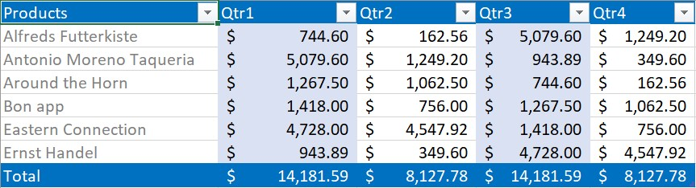

# Working with Excel Tables

## Creating a table

XlsIO supports reading and writing the table which helps to organize and analyze the related data. 

* **IListObjects** represents a collection of tables in the worksheet. 
* **IListObject** represent a table in the worksheet.

You can also create a calculated column in the table. For more details, refer [here](/file-formats/xlsio/working-with-formulas#calculated-column).

N> In XlsIO, tables are supported only for Excel 2007 and later formats (*.xlsx files).

The following code sample explains the creation of a simple table by the range of data from an existing worksheet.



using (ExcelEngine excelEngine = new ExcelEngine())
{
  IApplication application = excelEngine.Excel;
  application.DefaultVersion = ExcelVersion.Excel2013;
  IWorkbook workbook = application.Workbooks.Open("Sample.xlsx", ExcelOpenType.Automatic);
  IWorksheet worksheet = workbook.Worksheets[0];

  //Create table with the data in given range
  IListObject table = worksheet.ListObjects.Create("Table1", worksheet["A1:C8"]);

  string fileName = "Output.xlsx";
  workbook.SaveAs(fileName);
}



Using excelEngine As ExcelEngine = New ExcelEngine()
  Dim application As IApplication = excelEngine.Excel
  application.DefaultVersion = ExcelVersion.Excel2013
  Dim workbook As IWorkbook = application.Workbooks.Open("Sample.xlsx", ExcelOpenType.Automatic)
  Dim worksheet As IWorksheet = workbook.Worksheets(0)

  'Create table with the data in given range
  Dim table As IListObject = worksheet.ListObjects.Create("Table1", worksheet("A1:C8"))

  Dim fileName As String = "Output.xlsx"
  workbook.SaveAs(fileName)
End Using



using (ExcelEngine excelEngine = new ExcelEngine())
{
  IApplication application = excelEngine.Excel;
  application.DefaultVersion = ExcelVersion.Excel2013;

  //Gets assembly
  Assembly assembly = typeof(App).GetTypeInfo().Assembly;

  //Gets input Excel document from an embedded resource collection
  Stream inputStream = assembly.GetManifestResourceStream("Table.Sample.xlsx");

  IWorkbook workbook = await application.Workbooks.OpenAsync(inputStream, ExcelOpenType.Automatic);
  IWorksheet worksheet = workbook.Worksheets[0];

  //Create table with the data in given range
  IListObject table = worksheet.ListObjects.Create("Table1", worksheet["A1:C8"]);

  //Initializes FileSavePicker      
  FileSavePicker savePicker = new FileSavePicker();
  savePicker.SuggestedStartLocation = PickerLocationId.Desktop;
  savePicker.SuggestedFileName = "Output";
  savePicker.FileTypeChoices.Add("Excel Files", new List<string>() { ".xlsx" });

  //Creates a storage file from FileSavePicker            
  StorageFile storageFile = await savePicker.PickSaveFileAsync();

  //Saves changes to the specified storage file
  await workbook.SaveAsAsync(storageFile);
}



using (ExcelEngine excelEngine = new ExcelEngine())
{
  IApplication application = excelEngine.Excel;
  application.DefaultVersion = ExcelVersion.Excel2013;
  FileStream fileStream = new FileStream("Sample.xlsx", FileMode.Open, FileAccess.Read);
  IWorkbook workbook = application.Workbooks.Open(fileStream, ExcelOpenType.Automatic);
  IWorksheet worksheet = workbook.Worksheets[0];

  //Create table with the data in given range
  IListObject table = worksheet.ListObjects.Create("Table1", worksheet["A1:C8"]);

  string fileName = "Output.xlsx";

  //Saving the workbook as stream
  FileStream stream = new FileStream(fileName, FileMode.Create, FileAccess.ReadWrite);
  workbook.SaveAs(stream);
  stream.Dispose();
}



using (ExcelEngine excelEngine = new ExcelEngine())
{
  IApplication application = excelEngine.Excel;
  application.DefaultVersion = ExcelVersion.Excel2013;

  //Gets assembly
  Assembly assembly = typeof(App).GetTypeInfo().Assembly;

  //Gets input Excel document from an embedded resource collection
  Stream inputStream = assembly.GetManifestResourceStream("Table.Sample.xlsx");

  IWorkbook workbook = application.Workbooks.Open(inputStream, ExcelOpenType.Automatic);
  IWorksheet worksheet = workbook.Worksheets[0];

  //Create table with the data in given range
  IListObject table = worksheet.ListObjects.Create("Table1", worksheet["A1:C8"]);

  //Saving the workbook as stream
  MemoryStream outputStream = new MemoryStream();
  workbook.SaveAs(outputStream);

  string fileName = "Output.xlsx";

  outputStream.Position = 0;

  //Save the document as file and view the saved document

  //The operation in SaveAndView under Xamarin varies among Windows Phone, Android, and iOS platforms. Refer to the xlsio/xamarin section for respective code samples.

  if (Device.OS == TargetPlatform.WinPhone || Device.OS == TargetPlatform.Windows)
  {
  	Xamarin.Forms.DependencyService.Get<ISaveWindowsPhone>().SaveAndView(fileName, "application/msexcel", outputStream);
  }
  else
  {
  	Xamarin.Forms.DependencyService.Get<ISave>().SaveAndView(fileName, "application/msexcel", outputStream);
  }
}



A complete working example to create a table in C# is present on [this GitHub page](https://github.com/SyncfusionExamples/XlsIO-Examples/tree/master/Create%20and%20Edit%20Table/Create%20Table).

## Accessing a table

The existing tables in the worksheet can be accessed, as follows. 



using (ExcelEngine excelEngine = new ExcelEngine())
{
  IApplication application = excelEngine.Excel;
  application.DefaultVersion = ExcelVersion.Excel2013;

  IWorkbook workbook = application.Workbooks.Open("Sample.xlsx", ExcelOpenType.Automatic);
  IWorksheet worksheet = workbook.Worksheets[0];

  //Accessing first table in the sheet
  IListObject table = worksheet.ListObjects[0];

  //Modifying table name
  table.Name = "SalesTable";

  string fileName = "Output.xlsx";
  workbook.SaveAs(fileName);
}



Using excelEngine As ExcelEngine = New ExcelEngine()
  Dim application As IApplication = excelEngine.Excel
  application.DefaultVersion = ExcelVersion.Excel2013

  Dim workbook As IWorkbook = application.Workbooks.Open("Sample.xlsx", ExcelOpenType.Automatic)
  Dim worksheet As IWorksheet = workbook.Worksheets(0)

  'Accessing first table in the sheet
  Dim table As IListObject = worksheet.ListObjects(0)

  'Modifying table name
  table.Name = "SalesTable"

  Dim fileName As String = "Output.xlsx"
  workbook.SaveAs(fileName)
End Using



using (ExcelEngine excelEngine = new ExcelEngine())
{
  IApplication application = excelEngine.Excel;
  application.DefaultVersion = ExcelVersion.Excel2013;

  //Gets assembly
  Assembly assembly = typeof(App).GetTypeInfo().Assembly;

  //Gets input Excel document from an embedded resource collection
  Stream inputStream = assembly.GetManifestResourceStream("Table.Sample.xlsx");

  IWorkbook workbook = await application.Workbooks.OpenAsync(inputStream, ExcelOpenType.Automatic);
  IWorksheet worksheet = workbook.Worksheets[0];

  //Accessing first table in the sheet
  IListObject table = worksheet.ListObjects[0];

  //Modifying table name
  table.Name = "SalesTable";

  //Initializes FileSavePicker
  FileSavePicker savePicker = new FileSavePicker();
  savePicker.SuggestedStartLocation = PickerLocationId.Desktop;
  savePicker.SuggestedFileName = "Output";
  savePicker.FileTypeChoices.Add("Excel Files", new List<string>() { ".xlsx" });

  //Creates a storage file from the FileSavePicker
  StorageFile storageFile = await savePicker.PickSaveFileAsync();

  //Saves changes to the specified storage file
  await workbook.SaveAsAsync(storageFile);
}



using (ExcelEngine excelEngine = new ExcelEngine())
{
  IApplication application = excelEngine.Excel;
  application.DefaultVersion = ExcelVersion.Excel2013;
  FileStream fileStream = new FileStream("Sample.xlsx", FileMode.Open, FileAccess.Read);
  IWorkbook workbook = application.Workbooks.Open(fileStream, ExcelOpenType.Automatic);
  IWorksheet worksheet = workbook.Worksheets[0];

  //Accessing first table in the sheet
  IListObject table = worksheet.ListObjects[0];

  //Modifying table name
  table.Name = "SalesTable";

  string fileName = "Output.xlsx";

  //Saving the workbook as stream
  FileStream stream = new FileStream(fileName, FileMode.Create, FileAccess.ReadWrite);
  workbook.SaveAs(stream);
  stream.Dispose();
}



using (ExcelEngine excelEngine = new ExcelEngine())
{
  IApplication application = excelEngine.Excel;
  application.DefaultVersion = ExcelVersion.Excel2013;

  //Gets assembly
  Assembly assembly = typeof(App).GetTypeInfo().Assembly;

  //Gets input Excel document from an embedded resource collection
  Stream inputStream = assembly.GetManifestResourceStream("Table.Sample.xlsx");

  IWorkbook workbook = application.Workbooks.Open(inputStream, ExcelOpenType.Automatic);
  IWorksheet worksheet = workbook.Worksheets[0];

  //Accessing first table in the sheet
  IListObject table = worksheet.ListObjects[0];

  //Modifying table name
  table.Name = "SalesTable";

  //Saving the workbook as stream
  MemoryStream outputStream = new MemoryStream();
  workbook.SaveAs(outputStream);

  string fileName = "Output.xlsx";

  outputStream.Position = 0;

  //Save the document as file and view the saved document

  //The operation in SaveAndView under Xamarin varies among Windows Phone, Android, and iOS platforms. Refer to the xlsio/xamarin section for respective code samples.

  if (Device.OS == TargetPlatform.WinPhone || Device.OS == TargetPlatform.Windows)
  {
  	Xamarin.Forms.DependencyService.Get<ISaveWindowsPhone>().SaveAndView(fileName, "application/msexcel", outputStream);
  }
  else
  {
  	Xamarin.Forms.DependencyService.Get<ISave>().SaveAndView(fileName, "application/msexcel", outputStream);
  }
}

  

A complete working example for accessing a table in C# is present on [this GitHub page](https://github.com/SyncfusionExamples/XlsIO-Examples/tree/master/Create%20and%20Edit%20Table/Read%20Table).

## Formatting a table

You can apply built-in styles to the table using XlsIO. You can also customize the table with other table style options such as Header/total row, first/last column, and banded rows to make a table easier to read.

The following code snippet illustrates how to apply built-in table style.

  


using (ExcelEngine excelEngine = new ExcelEngine())
{
  IApplication application = excelEngine.Excel;
  application.DefaultVersion = ExcelVersion.Excel2013;
  IWorkbook workbook = application.Workbooks.Open("Sample.xlsx", ExcelOpenType.Automatic);
  IWorksheet worksheet = workbook.Worksheets[0];

  //Creating a table
  IListObject table = worksheet.ListObjects.Create("Table1", worksheet["A1:C8"]);

  //Formatting table with a built-in style
  table.BuiltInTableStyle = TableBuiltInStyles.TableStyleMedium9;

  string fileName = "Output.xlsx";
  workbook.SaveAs(fileName);
}



Using excelEngine As ExcelEngine = New ExcelEngine()
  Dim application As IApplication = excelEngine.Excel
  application.DefaultVersion = ExcelVersion.Excel2013
  Dim workbook As IWorkbook = application.Workbooks.Open("Sample.xlsx", ExcelOpenType.Automatic)
  Dim worksheet As IWorksheet = workbook.Worksheets(0)

  'Creating a table
  Dim table As IListObject = worksheet.ListObjects.Create("Table1", worksheet("A1:C8"))

  'Formatting table with a built-in style
  table.BuiltInTableStyle = TableBuiltInStyles.TableStyleMedium9

  Dim fileName As String = "Output.xlsx"
  workbook.SaveAs(fileName)
End Using



using (ExcelEngine excelEngine = new ExcelEngine())
{
  IApplication application = excelEngine.Excel;
  application.DefaultVersion = ExcelVersion.Excel2013;

  //Gets assembly
  Assembly assembly = typeof(App).GetTypeInfo().Assembly;

  //Gets input Excel document from embedded resource collection
  Stream inputStream = assembly.GetManifestResourceStream("Table.Sample.xlsx");

  IWorkbook workbook = await application.Workbooks.OpenAsync(inputStream, ExcelOpenType.Automatic);
  IWorksheet worksheet = workbook.Worksheets[0];

  //Creating a table
  IListObject table = worksheet.ListObjects.Create("Table1", worksheet["A1:C8"]);

  //Formatting table with a built-in style
  table.BuiltInTableStyle = TableBuiltInStyles.TableStyleMedium9;

  //Initializes FileSavePicker
  FileSavePicker savePicker = new FileSavePicker();
  savePicker.SuggestedStartLocation = PickerLocationId.Desktop;
  savePicker.SuggestedFileName = "Output";
  savePicker.FileTypeChoices.Add("Excel Files", new List<string>() { ".xlsx" });

  //Creates a storage file from FileSavePicker
  StorageFile storageFile = await savePicker.PickSaveFileAsync();

  //Saves changes to the specified storage file
  await workbook.SaveAsAsync(storageFile);
}



using (ExcelEngine excelEngine = new ExcelEngine())
{
  IApplication application = excelEngine.Excel;
  application.DefaultVersion = ExcelVersion.Excel2013;
  FileStream fileStream = new FileStream("Sample.xlsx", FileMode.Open, FileAccess.Read);
  IWorkbook workbook = application.Workbooks.Open(fileStream, ExcelOpenType.Automatic);
  IWorksheet worksheet = workbook.Worksheets[0];

  //Creating a table
  IListObject table = worksheet.ListObjects.Create("Table1", worksheet["A1:C8"]);

  //Formatting table with a built-in style
  table.BuiltInTableStyle = TableBuiltInStyles.TableStyleMedium9;

  string fileName = "Output.xlsx";

  //Saving the workbook as stream
  FileStream stream = new FileStream(fileName, FileMode.Create, FileAccess.ReadWrite);
  workbook.SaveAs(stream);
  stream.Dispose();
}



using (ExcelEngine excelEngine = new ExcelEngine())
{
  IApplication application = excelEngine.Excel;
  application.DefaultVersion = ExcelVersion.Excel2013;

  //Gets assembly
  Assembly assembly = typeof(App).GetTypeInfo().Assembly;

  //Gets input Excel document from embedded resource collection
  Stream inputStream = assembly.GetManifestResourceStream("Table.Sample.xlsx");

  IWorkbook workbook = application.Workbooks.Open(inputStream, ExcelOpenType.Automatic);
  IWorksheet worksheet = workbook.Worksheets[0];

  //Creating a table
  IListObject table = worksheet.ListObjects.Create("Table1", worksheet["A1:C8"]);

  //Formatting table with a built-in style
  table.BuiltInTableStyle = TableBuiltInStyles.TableStyleMedium9;

  //Saving the workbook as stream
  MemoryStream outputStream = new MemoryStream();
  workbook.SaveAs(outputStream);

  string fileName = "Output.xlsx";

  outputStream.Position = 0;

  //Save the document as file and view the saved document

  //The operation in SaveAndView under Xamarin varies among Windows Phone, Android, and iOS platforms. Refer to the xlsio/xamarin section for respective code samples.

  if (Device.OS == TargetPlatform.WinPhone || Device.OS == TargetPlatform.Windows)
  {
  	Xamarin.Forms.DependencyService.Get<ISaveWindowsPhone>().SaveAndView(fileName, "application/msexcel", outputStream);
  }
  else
  {
  	Xamarin.Forms.DependencyService.Get<ISave>().SaveAndView(fileName, "application/msexcel", outputStream);
  }
}

  

A complete working example for formatting a table in C# is present on [this GitHub page](https://github.com/SyncfusionExamples/XlsIO-Examples/tree/master/Create%20and%20Edit%20Table/Format%20Table).

### Apply Custom Table Style
You can apply custom table style to the table using XlsIO. You can create custom table style in which you can specified border, font, back ground color and format. You can also customized table in with other table style options such as Header/total row, first/last column, banded rows q to make a table easier to read.

The below code example shows how to apply custom table style in XlsIO.



using (ExcelEngine excelEngine = new ExcelEngine())
{
    IApplication application = excelEngine.Excel;
    application.DefaultVersion = ExcelVersion.Excel2016;
    IWorkbook workbook = application.Workbooks.Create(1);
    IWorksheet worksheet = workbook.Worksheets[0];

    //Create data
    worksheet[1, 1].Text = "Products";
    worksheet[1, 2].Text = "Qtr1";
    worksheet[1, 3].Text = "Qtr2";
    worksheet[1, 4].Text = "Qtr3";
    worksheet[1, 5].Text = "Qtr4";

    worksheet[2, 1].Text = "Alfreds Futterkiste";
    worksheet[2, 2].Number = 744.6;
    worksheet[2, 3].Number = 162.56;
    worksheet[2, 4].Number = 5079.6;
    worksheet[2, 5].Number = 1249.2;

    worksheet[3, 1].Text = "Antonio Moreno";
    worksheet[3, 2].Number = 5079.6;
    worksheet[3, 3].Number = 1249.2;
    worksheet[3, 4].Number = 943.89;
    worksheet[3, 5].Number = 349.6;

    worksheet[4, 1].Text = "Around the Horn";
    worksheet[4, 2].Number = 1267.5;
    worksheet[4, 3].Number = 1062.5;
    worksheet[4, 4].Number = 744.6;
    worksheet[4, 5].Number = 162.56;

    worksheet[5, 1].Text = "Bon app";
    worksheet[5, 2].Number = 1418;
    worksheet[5, 3].Number = 756;
    worksheet[5, 4].Number = 1267.5;
    worksheet[5, 5].Number = 1062.5;

    worksheet[6, 1].Text = "Eastern Connection";
    worksheet[6, 2].Number = 4728;
    worksheet[6, 3].Number = 4547.92;
    worksheet[6, 4].Number = 1418;
    worksheet[6, 5].Number = 756;

    worksheet[7, 1].Text = "Ernst Handel";
    worksheet[7, 2].Number = 943.89;
    worksheet[7, 3].Number = 349.6;
    worksheet[7, 4].Number = 4728;
    worksheet[7, 5].Number = 4547.92;

    //Create style for table number format
    IStyle style = workbook.Styles.Add("CurrencyFormat");
    style.NumberFormat = "_($* #,##0.00_);_($* (#,##0.00);_($* \" - \"??_);_(@_)";
    worksheet["B2:E8"].CellStyleName = "CurrencyFormat";

    //Create table
    IListObject table = worksheet.ListObjects.Create("Table1", worksheet["A1:E7"]);

    //Apply custom table style
    ITableStyles tableStyles = workbook.TableStyles;
    ITableStyle tableStyle = tableStyles.Add("Table Style 1");
    ITableStyleElements tableStyleElements = tableStyle.TableStyleElements;
    ITableStyleElement tableStyleElement = tableStyleElements.Add(ExcelTableStyleElementType.SecondColumnStripe);
    tableStyleElement.BackColorRGB = Color.FromArgb(217, 225, 242);

    ITableStyleElement tableStyleElement1 = tableStyleElements.Add(ExcelTableStyleElementType.FirstColumn);
    tableStyleElement1.FontColorRGB = Color.FromArgb(128, 128, 128);

    ITableStyleElement tableStyleElement2 = tableStyleElements.Add(ExcelTableStyleElementType.HeaderRow);
    tableStyleElement2.FontColor = ExcelKnownColors.White;
    tableStyleElement2.BackColorRGB = Color.FromArgb(0, 112, 192);

    ITableStyleElement tableStyleElement3 = tableStyleElements.Add(ExcelTableStyleElementType.TotalRow);
    tableStyleElement3.BackColorRGB = Color.FromArgb(0, 112, 192);
    tableStyleElement3.FontColor = ExcelKnownColors.White;

    table.TableStyleName = tableStyle.Name;

    //Total row
    table.ShowTotals = true;
    table.ShowFirstColumn = true;
    table.ShowTableStyleColumnStripes = true;
    table.ShowTableStyleRowStripes = true;
    table.Columns[0].TotalsRowLabel = "Total";
    table.Columns[1].TotalsCalculation = ExcelTotalsCalculation.Sum;
    table.Columns[2].TotalsCalculation = ExcelTotalsCalculation.Sum;
    table.Columns[3].TotalsCalculation = ExcelTotalsCalculation.Sum;
    table.Columns[4].TotalsCalculation = ExcelTotalsCalculation.Sum;

    //Save the workbook
    workbook.SaveAs("CustomTableStyle.xlsx");
}



Using excelEngine As ExcelEngine = New ExcelEngine()
    Dim application As IApplication = excelEngine.Excel
    application.DefaultVersion = ExcelVersion.Excel2016
    Dim workbook As IWorkbook = application.Workbooks.Create(1)
    Dim worksheet As IWorksheet = workbook.Worksheets(0)

    'Create data
    worksheet(1, 1).Text = "Products"
    worksheet(1, 2).Text = "Qtr1"
    worksheet(1, 3).Text = "Qtr2"
    worksheet(1, 4).Text = "Qtr3"
    worksheet(1, 5).Text = "Qtr4"

    worksheet(2, 1).Text = "Alfreds Futterkiste"
    worksheet(2, 2).Number = 744.6
    worksheet(2, 3).Number = 162.56
    worksheet(2, 4).Number = 5079.6
    worksheet(2, 5).Number = 1249.2
    
    worksheet(3, 1).Text = "Antonio Moreno"
    worksheet(3, 2).Number = 5079.6
    worksheet(3, 3).Number = 1249.2
    worksheet(3, 4).Number = 943.89
    worksheet(3, 5).Number = 349.6

    worksheet(4, 1).Text = "Around the Horn"
    worksheet(4, 2).Number = 1267.5
    worksheet(4, 3).Number = 1062.5
    worksheet(4, 4).Number = 744.6
    worksheet(4, 5).Number = 162.56

    worksheet(5, 1).Text = "Bon app"
    worksheet(5, 2).Number = 1418
    worksheet(5, 3).Number = 756
    worksheet(5, 4).Number = 1267.5
    worksheet(5, 5).Number = 1062.5

    worksheet(6, 1).Text = "Eastern Connection"
    worksheet(6, 2).Number = 4728
    worksheet(6, 3).Number = 4547.92
    worksheet(6, 4).Number = 1418
    worksheet(6, 5).Number = 756
    
    worksheet(7, 1).Text = "Ernst Handel"
    worksheet(7, 2).Number = 943.89
    worksheet(7, 3).Number = 349.6
    worksheet(7, 4).Number = 4728
    worksheet(7, 5).Number = 4547.92
	
	'Create style for table number format
    Dim style As IStyle = workbook.Styles.Add("CurrencyFormat")
    style.NumberFormat = "_($* #,##0.00_);_($* (#,##0.00);_($* "" - ""??_);_(@_)"
    worksheet("B2:E8").CellStyleName = "CurrencyFormat"
    
    'Create table 
    Dim table As IListObject = worksheet.ListObjects.Create("Table1", worksheet("A1:E7"))

    //Apply custom table style
    Dim tableStyles As ITableStyles = workbook.TableStyles
    Dim tableStyle As ITableStyle = tableStyles.Add("Table Style 1")
    Dim tableStyleElements As ITableStyleElements = tableStyle.TableStyleElements
    Dim tableStyleElement As ITableStyleElement = tableStyleElements.Add(ExcelTableStyleElementType.SecondColumnStripe)
    tableStyleElement.BackColorRGB = Color.FromArgb(217, 225, 242)
    
    Dim tableStyleElement1 As ITableStyleElement = tableStyleElements.Add(ExcelTableStyleElementType.FirstColumn)
    tableStyleElement1.FontColorRGB = Color.FromArgb(128, 128, 128)
    
    Dim tableStyleElement2 As ITableStyleElement = tableStyleElements.Add(ExcelTableStyleElementType.HeaderRow)
    tableStyleElement2.FontColor = ExcelKnownColors.White
    tableStyleElement2.BackColorRGB = Color.FromArgb(0, 112, 192)
    
    Dim tableStyleElement3 As ITableStyleElement = tableStyleElements.Add(ExcelTableStyleElementType.TotalRow)
    tableStyleElement3.BackColorRGB = Color.FromArgb(0, 112, 192)
    tableStyleElement3.FontColor = ExcelKnownColors.White
    
    table.TableStyleName = tableStyle.Name
    

    'Total row 
    table.ShowTotals = True
    table.ShowFirstColumn = True
    table.ShowTableStyleColumnStripes = True
    table.ShowTableStyleRowStripes = True
    table.Columns(0).TotalsRowLabel = "Total"
    table.Columns(1).TotalsCalculation = ExcelTotalsCalculation.Sum
    table.Columns(2).TotalsCalculation = ExcelTotalsCalculation.Sum
    table.Columns(3).TotalsCalculation = ExcelTotalsCalculation.Sum
    table.Columns(4).TotalsCalculation = ExcelTotalsCalculation.Sum

    'Save the workbook
    workbook.SaveAs("CustomTableStyle.xlsx")
End Using




using (ExcelEngine excelEngine = new ExcelEngine())
{
    IApplication application = excelEngine.Excel;
    application.DefaultVersion = ExcelVersion.Excel2016;
    IWorkbook workbook = application.Workbooks.Create(1);
    IWorksheet worksheet = workbook.Worksheets[0];

    // Create data
    worksheet[1, 1].Text = "Products";
    worksheet[1, 2].Text = "Qtr1";
    worksheet[1, 3].Text = "Qtr2";
    worksheet[1, 4].Text = "Qtr3";
    worksheet[1, 5].Text = "Qtr4";

    worksheet[2, 1].Text = "Alfreds Futterkiste";
    worksheet[2, 2].Number = 744.6;
    worksheet[2, 3].Number = 162.56;
    worksheet[2, 4].Number = 5079.6;
    worksheet[2, 5].Number = 1249.2;

    worksheet[3, 1].Text = "Antonio Moreno";
    worksheet[3, 2].Number = 5079.6;
    worksheet[3, 3].Number = 1249.2;
    worksheet[3, 4].Number = 943.89;
    worksheet[3, 5].Number = 349.6;

    worksheet[4, 1].Text = "Around the Horn";
    worksheet[4, 2].Number = 1267.5;
    worksheet[4, 3].Number = 1062.5;
    worksheet[4, 4].Number = 744.6;
    worksheet[4, 5].Number = 162.56;

    worksheet[5, 1].Text = "Bon app";
    worksheet[5, 2].Number = 1418;
    worksheet[5, 3].Number = 756;
    worksheet[5, 4].Number = 1267.5;
    worksheet[5, 5].Number = 1062.5;

    worksheet[6, 1].Text = "Eastern Connection";
    worksheet[6, 2].Number = 4728;
    worksheet[6, 3].Number = 4547.92;
    worksheet[6, 4].Number = 1418;
    worksheet[6, 5].Number = 756;

    worksheet[7, 1].Text = "Ernst Handel";
    worksheet[7, 2].Number = 943.89;
    worksheet[7, 3].Number = 349.6;
    worksheet[7, 4].Number = 4728;
    worksheet[7, 5].Number = 4547.92;

    //Create style for table number format
    IStyle style = workbook.Styles.Add("CurrencyFormat");
    style.NumberFormat = "_($* #,##0.00_);_($* (#,##0.00);_($* \" - \"??_);_(@_)";
    worksheet["B2:E8"].CellStyleName = "CurrencyFormat";

    //Create table
    IListObject table = worksheet.ListObjects.Create("Table1", worksheet["A1:E7"]);

    //Apply custom table style
    ITableStyles tableStyles = workbook.TableStyles;
    ITableStyle tableStyle = tableStyles.Add("Table Style 1");
    ITableStyleElements tableStyleElements = tableStyle.TableStyleElements;
    ITableStyleElement tableStyleElement = tableStyleElements.Add(ExcelTableStyleElementType.SecondColumnStripe);
    tableStyleElement.BackColorRGB = Color.FromArgb(217, 225, 242);

    ITableStyleElement tableStyleElement1 = tableStyleElements.Add(ExcelTableStyleElementType.FirstColumn);
    tableStyleElement1.FontColorRGB = Color.FromArgb(128, 128, 128);

    ITableStyleElement tableStyleElement2 = tableStyleElements.Add(ExcelTableStyleElementType.HeaderRow);
    tableStyleElement2.FontColor = ExcelKnownColors.White;
    tableStyleElement2.BackColorRGB = Color.FromArgb(0, 112, 192);

    ITableStyleElement tableStyleElement3 = tableStyleElements.Add(ExcelTableStyleElementType.TotalRow);
    tableStyleElement3.BackColorRGB = Color.FromArgb(0, 112, 192);
    tableStyleElement3.FontColor = ExcelKnownColors.White;

    table.TableStyleName = tableStyle.Name;

    //Total row
    table.ShowTotals = true;
    table.ShowFirstColumn = true;
    table.ShowTableStyleColumnStripes = true;
    table.ShowTableStyleRowStripes = true;
    table.Columns[0].TotalsRowLabel = "Total";
    table.Columns[1].TotalsCalculation = ExcelTotalsCalculation.Sum;
    table.Columns[2].TotalsCalculation = ExcelTotalsCalculation.Sum;
    table.Columns[3].TotalsCalculation = ExcelTotalsCalculation.Sum;
    table.Columns[4].TotalsCalculation = ExcelTotalsCalculation.Sum;

    //Initializes FileSavePicker
    FileSavePicker savePicker = new FileSavePicker();
    savePicker.SuggestedStartLocation = PickerLocationId.Desktop;
    savePicker.SuggestedFileName = "CustomTableStyle";
    savePicker.FileTypeChoices.Add("Excel Files", new List<string>() { ".xlsx" });
    
    //Creates a storage file from the FileSavePicker
    StorageFile storageFile = await savePicker.PickSaveFileAsync();
    
    //Saves changes to the specified storage file
    await workbook.SaveAsAsync(storageFile);
}



using (ExcelEngine excelEngine = new ExcelEngine())
{
    IApplication application = excelEngine.Excel;
    application.DefaultVersion = ExcelVersion.Excel2016;
    IWorkbook workbook = application.Workbooks.Create(1);
    IWorksheet worksheet = workbook.Worksheets[0];

    // Create data
    worksheet[1, 1].Text = "Products";
    worksheet[1, 2].Text = "Qtr1";
    worksheet[1, 3].Text = "Qtr2";
    worksheet[1, 4].Text = "Qtr3";
    worksheet[1, 5].Text = "Qtr4";

    worksheet[2, 1].Text = "Alfreds Futterkiste";
    worksheet[2, 2].Number = 744.6;
    worksheet[2, 3].Number = 162.56;
    worksheet[2, 4].Number = 5079.6;
    worksheet[2, 5].Number = 1249.2;

    worksheet[3, 1].Text = "Antonio Moreno";
    worksheet[3, 2].Number = 5079.6;
    worksheet[3, 3].Number = 1249.2;
    worksheet[3, 4].Number = 943.89;
    worksheet[3, 5].Number = 349.6;

    worksheet[4, 1].Text = "Around the Horn";
    worksheet[4, 2].Number = 1267.5;
    worksheet[4, 3].Number = 1062.5;
    worksheet[4, 4].Number = 744.6;
    worksheet[4, 5].Number = 162.56;

    worksheet[5, 1].Text = "Bon app";
    worksheet[5, 2].Number = 1418;
    worksheet[5, 3].Number = 756;
    worksheet[5, 4].Number = 1267.5;
    worksheet[5, 5].Number = 1062.5;

    worksheet[6, 1].Text = "Eastern Connection";
    worksheet[6, 2].Number = 4728;
    worksheet[6, 3].Number = 4547.92;
    worksheet[6, 4].Number = 1418;
    worksheet[6, 5].Number = 756;

    worksheet[7, 1].Text = "Ernst Handel";
    worksheet[7, 2].Number = 943.89;
    worksheet[7, 3].Number = 349.6;
    worksheet[7, 4].Number = 4728;
    worksheet[7, 5].Number = 4547.92;

    //Create style for table number format
    IStyle style = workbook.Styles.Add("CurrencyFormat");
    style.NumberFormat = "_($* #,##0.00_);_($* (#,##0.00);_($* \" - \"??_);_(@_)";
    worksheet["B2:E8"].CellStyleName = "CurrencyFormat";

    //Create table
    IListObject table = worksheet.ListObjects.Create("Table1", worksheet["A1:E7"]);

    //Apply custom table style
    ITableStyles tableStyles = workbook.TableStyles;
    ITableStyle tableStyle = tableStyles.Add("Table Style 1");
    ITableStyleElements tableStyleElements = tableStyle.TableStyleElements;
    ITableStyleElement tableStyleElement = tableStyleElements.Add(ExcelTableStyleElementType.SecondColumnStripe);
    tableStyleElement.BackColorRGB = Color.FromArgb(217, 225, 242);

    ITableStyleElement tableStyleElement1 = tableStyleElements.Add(ExcelTableStyleElementType.FirstColumn);
    tableStyleElement1.FontColorRGB = Color.FromArgb(128, 128, 128);

    ITableStyleElement tableStyleElement2 = tableStyleElements.Add(ExcelTableStyleElementType.HeaderRow);
    tableStyleElement2.FontColor = ExcelKnownColors.White;
    tableStyleElement2.BackColorRGB = Color.FromArgb(0, 112, 192);

    ITableStyleElement tableStyleElement3 = tableStyleElements.Add(ExcelTableStyleElementType.TotalRow);
    tableStyleElement3.BackColorRGB = Color.FromArgb(0, 112, 192);
    tableStyleElement3.FontColor = ExcelKnownColors.White;

    table.TableStyleName = tableStyle.Name;

    //Total row
    table.ShowTotals = true;
    table.ShowFirstColumn = true;
    table.ShowTableStyleColumnStripes = true;
    table.ShowTableStyleRowStripes = true;
    table.Columns[0].TotalsRowLabel = "Total";
    table.Columns[1].TotalsCalculation = ExcelTotalsCalculation.Sum;
    table.Columns[2].TotalsCalculation = ExcelTotalsCalculation.Sum;
    table.Columns[3].TotalsCalculation = ExcelTotalsCalculation.Sum;
    table.Columns[4].TotalsCalculation = ExcelTotalsCalculation.Sum;
    
	//Saving the workbook as stream
    FileStream stream = new FileStream("CustomTableStyle.xlsx", FileMode.Create, FileAccess.ReadWrite);
    workbook.SaveAs(stream);
    stream.Dispose();
}



using (ExcelEngine excelEngine = new ExcelEngine())
{
    IApplication application = excelEngine.Excel;
    application.DefaultVersion = ExcelVersion.Excel2016;
    IWorkbook workbook = application.Workbooks.Create(1);
    IWorksheet worksheet = workbook.Worksheets[0];

    // Create data
    worksheet[1, 1].Text = "Products";
    worksheet[1, 2].Text = "Qtr1";
    worksheet[1, 3].Text = "Qtr2";
    worksheet[1, 4].Text = "Qtr3";
    worksheet[1, 5].Text = "Qtr4";

    worksheet[2, 1].Text = "Alfreds Futterkiste";
    worksheet[2, 2].Number = 744.6;
    worksheet[2, 3].Number = 162.56;
    worksheet[2, 4].Number = 5079.6;
    worksheet[2, 5].Number = 1249.2;

    worksheet[3, 1].Text = "Antonio Moreno";
    worksheet[3, 2].Number = 5079.6;
    worksheet[3, 3].Number = 1249.2;
    worksheet[3, 4].Number = 943.89;
    worksheet[3, 5].Number = 349.6;

    worksheet[4, 1].Text = "Around the Horn";
    worksheet[4, 2].Number = 1267.5;
    worksheet[4, 3].Number = 1062.5;
    worksheet[4, 4].Number = 744.6;
    worksheet[4, 5].Number = 162.56;

    worksheet[5, 1].Text = "Bon app";
    worksheet[5, 2].Number = 1418;
    worksheet[5, 3].Number = 756;
    worksheet[5, 4].Number = 1267.5;
    worksheet[5, 5].Number = 1062.5;

    worksheet[6, 1].Text = "Eastern Connection";
    worksheet[6, 2].Number = 4728;
    worksheet[6, 3].Number = 4547.92;
    worksheet[6, 4].Number = 1418;
    worksheet[6, 5].Number = 756;

    worksheet[7, 1].Text = "Ernst Handel";
    worksheet[7, 2].Number = 943.89;
    worksheet[7, 3].Number = 349.6;
    worksheet[7, 4].Number = 4728;
    worksheet[7, 5].Number = 4547.92;

    //Create style for table number format
    IStyle style = workbook.Styles.Add("CurrencyFormat");
    style.NumberFormat = "_($* #,##0.00_);_($* (#,##0.00);_($* \" - \"??_);_(@_)";
    worksheet["B2:E8"].CellStyleName = "CurrencyFormat";

    //Create table
    IListObject table = worksheet.ListObjects.Create("Table1", worksheet["A1:E7"]);

    //Apply custom table style
    ITableStyles tableStyles = workbook.TableStyles;
    ITableStyle tableStyle = tableStyles.Add("Table Style 1");
    ITableStyleElements tableStyleElements = tableStyle.TableStyleElements;
    ITableStyleElement tableStyleElement = tableStyleElements.Add(ExcelTableStyleElementType.SecondColumnStripe);
    tableStyleElement.BackColorRGB = Color.FromArgb(217, 225, 242);

    ITableStyleElement tableStyleElement1 = tableStyleElements.Add(ExcelTableStyleElementType.FirstColumn);
    tableStyleElement1.FontColorRGB = Color.FromArgb(128, 128, 128);

    ITableStyleElement tableStyleElement2 = tableStyleElements.Add(ExcelTableStyleElementType.HeaderRow);
    tableStyleElement2.FontColor = ExcelKnownColors.White;
    tableStyleElement2.BackColorRGB = Color.FromArgb(0, 112, 192);

    ITableStyleElement tableStyleElement3 = tableStyleElements.Add(ExcelTableStyleElementType.TotalRow);
    tableStyleElement3.BackColorRGB = Color.FromArgb(0, 112, 192);
    tableStyleElement3.FontColor = ExcelKnownColors.White;

    table.TableStyleName = tableStyle.Name;

    //Total row
    table.ShowTotals = true;
    table.ShowFirstColumn = true;
    table.ShowTableStyleColumnStripes = true;
    table.ShowTableStyleRowStripes = true;
    table.Columns[0].TotalsRowLabel = "Total";
    table.Columns[1].TotalsCalculation = ExcelTotalsCalculation.Sum;
    table.Columns[2].TotalsCalculation = ExcelTotalsCalculation.Sum;
    table.Columns[3].TotalsCalculation = ExcelTotalsCalculation.Sum;
    table.Columns[4].TotalsCalculation = ExcelTotalsCalculation.Sum;
    	
	//Saving the workbook as stream
    MemoryStream stream = new MemoryStream();
    workbook.SaveAs(stream);
  
    stream.Position = 0;
   
    //Save the document as file and view the saved document 
    //The operation in SaveAndView under Xamarin varies between Windows Phone, Android and iOS
    platforms. Please refer xlsio/xamarin section for respective code samples.   
    if (Device.OS == TargetPlatform.WinPhone || Device.OS == TargetPlatform.Windows)
    {
	 Xamarin.Forms.DependencyService.Get<ISaveWindowsPhone>().SaveAndView("CustomTableStyle.xlsx", 
     "application/msexcel", stream);
    }
    else
    {
	 Xamarin.Forms.DependencyService.Get<ISave>().SaveAndView("CustomTableStyle.xlsx",     
    "application/msexcel", stream);
    }
}



A complete working example to apply custom table style in C# is present on [this GitHub page](https://github.com/SyncfusionExamples/XlsIO-Examples/tree/master/Create%20and%20Edit%20Table/Apply%20Custom%20Style).

The following screenshot represents generated Excel file with custom table styles in XlsIO.

## Insert or remove columns in a table

IListObject is a collection of columns, whereas a single column is represented by an instance of **IListObjectColumn**. XlsIO supports to insert or remove columns from the table using worksheet, as follows.



using (ExcelEngine excelEngine = new ExcelEngine())
{
  IApplication application = excelEngine.Excel;
  application.DefaultVersion = ExcelVersion.Excel2013;
  IWorkbook workbook = application.Workbooks.Open("Sample.xlsx", ExcelOpenType.Automatic);
  IWorksheet worksheet = workbook.Worksheets[0];

  //Creating a table
  IListObject table = worksheet.ListObjects.Create("Table1", worksheet["A1:C8"]);

  //Inserting a column in the table
  worksheet.InsertColumn(2, 2);

  // Removing a column from the table
  worksheet.DeleteColumn(2, 1);

  string fileName = "Output.xlsx";
  workbook.SaveAs(fileName);
}



Using excelEngine As ExcelEngine = New ExcelEngine()
  Dim application As IApplication = excelEngine.Excel
  application.DefaultVersion = ExcelVersion.Excel2013
  Dim workbook As IWorkbook = application.Workbooks.Open("Sample.xlsx", ExcelOpenType.Automatic)
  Dim worksheet As IWorksheet = workbook.Worksheets(0)

  'Creating table
  Dim table As IListObject = worksheet.ListObjects.Create("Table1", worksheet("A1:C8"))

  'Inserting a column in the table
  worksheet.InsertColumn(2, 2)

  'Removing a column from the table
  worksheet.DeleteColumn(2, 1)

  Dim fileName As String = "Output.xlsx"
  workbook.SaveAs(fileName)
End Using



using (ExcelEngine excelEngine = new ExcelEngine())
{
  IApplication application = excelEngine.Excel;
  application.DefaultVersion = ExcelVersion.Excel2013;

  //Gets assembly
  Assembly assembly = typeof(App).GetTypeInfo().Assembly;

  //Gets input Excel document from an embedded resource collection
  Stream inputStream = assembly.GetManifestResourceStream("Table.Sample.xlsx");

  IWorkbook workbook = await application.Workbooks.OpenAsync(inputStream, ExcelOpenType.Automatic);
  IWorksheet worksheet = workbook.Worksheets[0];

  //Creating a table
  IListObject table = worksheet.ListObjects.Create("Table1", worksheet["A1:C8"]);

  //Inserting a column in the table
  worksheet.InsertColumn(2, 2);

  //Removing a column from the table
  worksheet.DeleteColumn(2, 1);

  //Initializes FileSavePicker
  FileSavePicker savePicker = new FileSavePicker();
  savePicker.SuggestedStartLocation = PickerLocationId.Desktop;
  savePicker.SuggestedFileName = "Output";
  savePicker.FileTypeChoices.Add("Excel Files", new List<string>() { ".xlsx" });

  //Creates a storage file from the FileSavePicker
  StorageFile storageFile = await savePicker.PickSaveFileAsync();

  //Saves changes to the specified storage file
  await workbook.SaveAsAsync(storageFile);
}



using (ExcelEngine excelEngine = new ExcelEngine())
{
  IApplication application = excelEngine.Excel;
  application.DefaultVersion = ExcelVersion.Excel2013;
  FileStream fileStream = new FileStream("Sample.xlsx", FileMode.Open, FileAccess.Read);
  IWorkbook workbook = application.Workbooks.Open(fileStream, ExcelOpenType.Automatic);
  IWorksheet worksheet = workbook.Worksheets[0];

  //Creating a table
  IListObject table = worksheet.ListObjects.Create("Table1", worksheet["A1:C8"]);

  //Inserting a column in the table
  worksheet.InsertColumn(2, 2);

  //Removing a column from the table
  worksheet.DeleteColumn(2, 1);

  string fileName = "Output.xlsx";

  //Saving the workbook as stream
  FileStream stream = new FileStream(fileName, FileMode.Create, FileAccess.ReadWrite);
  workbook.SaveAs(stream);
  stream.Dispose();
}



using (ExcelEngine excelEngine = new ExcelEngine())
{
  IApplication application = excelEngine.Excel;
  application.DefaultVersion = ExcelVersion.Excel2013;

  //Gets assembly
  Assembly assembly = typeof(App).GetTypeInfo().Assembly;

  //Gets input Excel document from an embedded resource collection
  Stream inputStream = assembly.GetManifestResourceStream("Table.Sample.xlsx");

  IWorkbook workbook = application.Workbooks.Open(inputStream, ExcelOpenType.Automatic);
  IWorksheet worksheet = workbook.Worksheets[0];

  //Creating a table
  IListObject table = worksheet.ListObjects.Create("Table1", worksheet["A1:C8"]);

  //Inserting a column in the table
  worksheet.InsertColumn(2, 2);

  //Removing a column from the table
  worksheet.DeleteColumn(2, 1);

  //Saving the workbook as stream
  MemoryStream outputStream = new MemoryStream();
  workbook.SaveAs(outputStream);

  string fileName = "Output.xlsx";

  outputStream.Position = 0;

  //Save the document as file and view the saved document

  //The operation in SaveAndView under Xamarin varies among Windows Phone, Android, and iOS platforms. Refer to the xlsio/xamarin section for respective code samples.

  if (Device.OS == TargetPlatform.WinPhone || Device.OS == TargetPlatform.Windows)
  {
  	Xamarin.Forms.DependencyService.Get<ISaveWindowsPhone>().SaveAndView(fileName, "application/msexcel", outputStream);
  }
  else
  {
  	Xamarin.Forms.DependencyService.Get<ISave>().SaveAndView(fileName, "application/msexcel", outputStream);
  }
}

 

A complete working example to insert column in a table in C# is present on [this GitHub page](https://github.com/SyncfusionExamples/XlsIO-Examples/tree/master/Create%20and%20Edit%20Table/Insert%20Column). 

A complete working example to delete column in a table in C# is present on [this GitHub page](https://github.com/SyncfusionExamples/XlsIO-Examples/tree/master/Create%20and%20Edit%20Table/Remove%20Column). 

N> Inserting rows or columns in a worksheet within the table range modifies table structure.

## Adding a total row

The "Total Row" is added to a table by accessing the **Table** **Columns**. It is possible to set calculation function to be used to the total row cells by using the ExcelTotalsCalculation enumerator. To learn more about this enumerator, refer to the **ExcelTotalsCalculation** in API section. These cells are updated after they are calculated.

  


using (ExcelEngine excelEngine = new ExcelEngine())
{
  IApplication application = excelEngine.Excel;
  application.DefaultVersion = ExcelVersion.Excel2013;
  IWorkbook workbook = application.Workbooks.Open("Sample.xlsx", ExcelOpenType.Automatic);
  IWorksheet worksheet = workbook.Worksheets[0];

  //Creating a table
  IListObject table = worksheet.ListObjects.Create("Table1", worksheet["A1:C8"]);

  //Adding total row
  table.ShowTotals = true;
  table.Columns[0].TotalsRowLabel = "Total";
  table.Columns[1].TotalsCalculation = ExcelTotalsCalculation.Sum;
  table.Columns[2].TotalsCalculation = ExcelTotalsCalculation.Sum;

  string fileName = "Output.xlsx";
  workbook.SaveAs(fileName);
}



Using excelEngine As ExcelEngine = New ExcelEngine()
  Dim application As IApplication = excelEngine.Excel
  application.DefaultVersion = ExcelVersion.Excel2013
  Dim workbook As IWorkbook = application.Workbooks.Open("Sample.xlsx", ExcelOpenType.Automatic)
  Dim worksheet As IWorksheet = workbook.Worksheets(0)

  'Creating a table
  Dim table As IListObject = worksheet.ListObjects.Create("Table1", worksheet("A1:C8"))

  'Adding total row
  table.ShowTotals = True
  table.Columns(0).TotalsRowLabel = "Total"
  table.Columns(1).TotalsCalculation = ExcelTotalsCalculation.Sum
  table.Columns(2).TotalsCalculation = ExcelTotalsCalculation.Sum

  Dim fileName As String = "Output.xlsx"
  workbook.SaveAs(fileName)
End Using



using (ExcelEngine excelEngine = new ExcelEngine())
{
  IApplication application = excelEngine.Excel;
  application.DefaultVersion = ExcelVersion.Excel2013;

  //Gets assembly
  Assembly assembly = typeof(App).GetTypeInfo().Assembly;

  //Gets input Excel document from embedded resource collection
  Stream inputStream = assembly.GetManifestResourceStream("Table.Sample.xlsx");

  IWorkbook workbook = await application.Workbooks.OpenAsync(inputStream, ExcelOpenType.Automatic);
  IWorksheet worksheet = workbook.Worksheets[0];

  //Creating a table
  IListObject table = worksheet.ListObjects.Create("Table1", worksheet["A1:C8"]);

  //Adding total row
  table.ShowTotals = true;
  table.Columns[0].TotalsRowLabel = "Total";
  table.Columns[1].TotalsCalculation = ExcelTotalsCalculation.Sum;
  table.Columns[2].TotalsCalculation = ExcelTotalsCalculation.Sum;

  //Initializes FileSavePicker
  FileSavePicker savePicker = new FileSavePicker();
  savePicker.SuggestedStartLocation = PickerLocationId.Desktop;
  savePicker.SuggestedFileName = "Output";
  savePicker.FileTypeChoices.Add("Excel Files", new List<string>() { ".xlsx" });

  //Creates a storage file from FileSavePicker
  StorageFile storageFile = await savePicker.PickSaveFileAsync();

  //Saves changes to the specified storage file
  await workbook.SaveAsAsync(storageFile);
}



using (ExcelEngine excelEngine = new ExcelEngine())
{
  IApplication application = excelEngine.Excel;
  application.DefaultVersion = ExcelVersion.Excel2013;
  FileStream fileStream = new FileStream("Sample.xlsx", FileMode.Open, FileAccess.Read);
  IWorkbook workbook = application.Workbooks.Open(fileStream, ExcelOpenType.Automatic);
  IWorksheet worksheet = workbook.Worksheets[0];

  //Creating a table
  IListObject table = worksheet.ListObjects.Create("Table1", worksheet["A1:C8"]);

  //Adding Total Row
  table.ShowTotals = true;
  table.Columns[0].TotalsRowLabel = "Total";
  table.Columns[1].TotalsCalculation = ExcelTotalsCalculation.Sum;
  table.Columns[2].TotalsCalculation = ExcelTotalsCalculation.Sum;

  string fileName = "Output.xlsx";

  //Saving the workbook as stream
  FileStream stream = new FileStream(fileName, FileMode.Create, FileAccess.ReadWrite);
  workbook.SaveAs(stream);
  stream.Dispose();
}



using (ExcelEngine excelEngine = new ExcelEngine())
{
  IApplication application = excelEngine.Excel;
  application.DefaultVersion = ExcelVersion.Excel2013;

  //Gets assembly
  Assembly assembly = typeof(App).GetTypeInfo().Assembly;

  //Gets input Excel document from embedded resource collection
  Stream inputStream = assembly.GetManifestResourceStream("Table.Sample.xlsx");

  IWorkbook workbook = application.Workbooks.Open(inputStream, ExcelOpenType.Automatic);
  IWorksheet worksheet = workbook.Worksheets[0];

  //Creating a table
  IListObject table = worksheet.ListObjects.Create("Table1", worksheet["A1:C8"]);

  //Adding total row
  table.ShowTotals = true;
  table.Columns[0].TotalsRowLabel = "Total";
  table.Columns[1].TotalsCalculation = ExcelTotalsCalculation.Sum;
  table.Columns[2].TotalsCalculation = ExcelTotalsCalculation.Sum;

  //Saving the workbook as stream
  MemoryStream outputStream = new MemoryStream();
  workbook.SaveAs(outputStream);

  string fileName = "Output.xlsx";

  outputStream.Position = 0;

  //Save the document as file and view the saved document

  //The operation in SaveAndView under Xamarin varies among Windows Phone, Android, and iOS platforms. Refer to the xlsio/xamarin section for respective code samples.

  if (Device.OS == TargetPlatform.WinPhone || Device.OS == TargetPlatform.Windows)
  {
  	Xamarin.Forms.DependencyService.Get<ISaveWindowsPhone>().SaveAndView(fileName, "application/msexcel", outputStream);
  }
  else
  {
  	Xamarin.Forms.DependencyService.Get<ISave>().SaveAndView(fileName, "application/msexcel", outputStream);
  }
}



A complete working example to insert total row in C# is present on [this GitHub page](https://github.com/SyncfusionExamples/XlsIO-Examples/tree/master/Create%20and%20Edit%20Table/Add%20Total%20Row).   

## Create a table from external connection 

External connection support allows to work with most recent data right in the workbook. After the data is imported, only refresh operations are performed to retrieve the updated data.

The following code snippet explains the method of importing data through an external connection in the workbook.



using (ExcelEngine excelEngine = new ExcelEngine())
{
  IApplication application = excelEngine.Excel;
  application.DefaultVersion = ExcelVersion.Excel2013;
  IWorkbook workbook = application.Workbooks.Create(1);
  IWorksheet worksheet = workbook.Worksheets[0];

  //Database path
  string dataPath = Path.GetFullPath("c:/company/DB/TestDB.mdb");

  //Connection string for DataSource
  string ConnectionString = "OLEDB;Provider=Microsoft.JET.OLEDB.4.0;Password=\"\";User ID=Admin;Data Source=" + dataPath;

  //Adding a connection to the workbook
  IConnection Connection = workbook.Connections.Add("Connection1", "Sample connection with MsAccess", ConnectionString, "", ExcelCommandType.Sql);

  //Adding a QueryTable to sheet object
  worksheet.ListObjects.AddEx(ExcelListObjectSourceType.SrcQuery, Connection, worksheet.Range["A1"]);

  //Command text for the connection
  worksheet.ListObjects[0].QueryTable.CommandText = "Select * from tableTest";

  //The query performs asynchronous action
  worksheet.ListObjects[0].QueryTable.BackgroundQuery = true;

  //The query table is refreshed when the workbook is opened
  worksheet.ListObjects[0].QueryTable.RefreshOnFileOpen = true;

  //Represents the connection description
  Connection.Description = "Sample Connection";

  //Import data to the sheet from the database
  worksheet.ListObjects[0].Refresh();

  //Auto-fits the columns
  worksheet.UsedRange.AutofitColumns();

  string fileName = "Output.xlsx";
  workbook.SaveAs(fileName);
}



Using excelEngine As ExcelEngine = New ExcelEngine()
  Dim application As IApplication = excelEngine.Excel
  application.DefaultVersion = ExcelVersion.Excel2013
  Dim workbook As IWorkbook = application.Workbooks.Create(1)
  Dim worksheet As IWorksheet = workbook.Worksheets(0)

  'Database path
  Dim dataPath As String = Path.GetFullPath("c:/company/DB/TestDB.mdb")

  'Connection string for DataSource
  Dim ConnectionString As String = "OLEDB;Provider=Microsoft.JET.OLEDB.4.0;Password="""";User ID=Admin;Data Source=" + dataPath

  'Adding a connection to the workbook 
  Dim Connection As IConnection = workbook.Connections.Add("Connection1", "Sample   connection with MsAccess", ConnectionString, "", ExcelCommandType.Sql)

  'Adding a QueryTable to sheet object
  worksheet.ListObjects.AddEx(ExcelListObjectSourceType.SrcQuery, Connection, worksheet.Range("A1"))

  'Command text for the connection
  worksheet.ListObjects(0).QueryTable.CommandText = "Select * from tableTest"

  'The query performs asynchronous action
  worksheet.ListObjects(0).QueryTable.BackgroundQuery = True

  'The QueryTable is refreshed when the workbook is opened
  worksheet.ListObjects(0).QueryTable.RefreshOnFileOpen = True

  'Represents the connection description
  Connection.Description = "Sample Connection"

  'Import data to the sheet from the database
  worksheet.ListObjects(0).Refresh()

  'Auto-fits the columns
  worksheet.UsedRange.AutofitColumns()

  Dim fileName As String = "Output.xlsx"
  workbook.SaveAs(fileName)
End Using



//XlsIO supports creation of table from external connection in Windows Forms, WPF, ASP.NET, and ASP.NET MVC platforms.



//XlsIO supports creation of table from external connection in Windows Forms, WPF, ASP.NET, and ASP.NET MVC platforms.



//XlsIO supports creation of table from external connection in Windows Forms, WPF, ASP.NET, and ASP.NET MVC platforms.



The following table shows different data sources and its connection string formats supported in XlsIO.

<table>
<tr>
<th>Database  </th>
<th>Connection Type  </th>
<th>Sample connection string  </th></tr>
<tr>
<td rowspan ="2"> 
Microsoft Access  </td>
<td>
OLEDB  </td><td>
OLEDB;Provider=Microsoft.JET.OLEDB.4.0;Password=\"\";  User ID=Admin;Data Source=C:\\Company\\DB\\TestDB.mdb  </td></tr>
<tr>
<td>
ODBC  </td><td>
ODBC;DSN=MS Access;DBQ=C:\\Company\\DB\\Testing.mdb;  DefaultDir=C:\\Company\\DB;FIL=MS Access;MaxBufferSize=2048;PageTimeout=5;  </td></tr>
<tr>
<td rowspan="2"> 
SQL  </td>
<td>
OLEDB  </td>
<td>
OLEDB;Provider=SQLOLEDB.1;Integrated Security=SSPI;  Persist Security Info=True;Initial Catalog=Temp;  Data Source=SYNCFUSION\\SQLEXPRESS;Workstation ID=SYNCINC;  </td></tr>
<tr>
<td>
ODBC  </td>
<td>
ODBC;DSN=Test1;UID=syncfusion;Trusted_Connection=Yes;  APP=Microsoft Office   2010;WSID=SYNCINC;DATABASE=Temp  </td></tr>
<tr>
<td>
Excel  </td><td>
OLEDB  </td><td>
OLEDB;Provider=Microsoft.ACE.OLEDB.12.0;Password=\"\";  User ID=Admin;Data Source="c:\SourceTemplate.xlsx;  Jet OLEDB:Engine Type=37;  </td></tr>
<tr>
<td rowspan = "2"> 
SharePoint  </td>
<td>
OLEDB  </td>
<td>
Stars with OLEDB  </td></tr>
<tr>
<td>
ODBC  </td><td>
Stars with ODBC  </td></tr>
</table>

### Refresh external data connection in Excel table

Excel tables (i.e., ListObjects) that are connected to external data connection can be refreshed programmatically. The [Refresh()](https://help.syncfusion.com/cr/file-formats/Syncfusion.XlsIO.IListObject.html#Syncfusion_XlsIO_IListObject_Refresh) method in [IListObject](https://help.syncfusion.com/cr/file-formats/Syncfusion.XlsIO.IListObject.html) updates the data, similar to [Refresh](https://support.office.com/en-us/article/refresh-an-external-data-connection-in-excel-1524175f-777a-48fc-8fc7-c8514b984440) operation in Microsoft Excel. Here, there is not RefreshAll() option to refresh all the tables in a worksheet. To achieve that, all the tables (ListObjects) has to be accessed and refreshed individually.

The following code example shows how to access existing data connection of Excel tables in a sheet and refresh data of all the tables.



using (ExcelEngine excelEngine = new ExcelEngine())
{
  IApplication application = excelEngine.Excel;
  application.DefaultVersion = ExcelVersion.Excel2016;
  IWorkbook workbook = application.Workbooks.Open("ExistingDataSource.xlsx");
  IWorksheet worksheet = workbook.Worksheets[0];

  //Accessing a connection from the workbook
  IConnection connection = workbook.Connections[0];

  //Refresh all the data by accessing each ListObject 
  foreach(IListObject listObject in worksheet.ListObjects) 
  { 
      listObject.Refresh(); 
  }

  string fileName = "Output.xlsx";
  workbook.SaveAs(fileName);
}



Using excelEngine As ExcelEngine = New ExcelEngine()
  Dim application As IApplication = excelEngine.Excel
  application.DefaultVersion = ExcelVersion.Excel2016
  Dim workbook As IWorkbook = application.Workbooks.Open("ExistingDataSource.xlsx")
  Dim worksheet As IWorksheet = workbook.Worksheets(0)

  'Accessing a connection from the workbook
  Dim connection As IConnection = workbook.Connections(0)

  'Refresh all the data by accessing each ListObject
  For Each listObject As IListObject In worksheet.ListObjects
      listObject.Refresh()
  Next

  Dim fileName As String = "Output.xlsx"
  workbook.SaveAs(fileName)
End Using



//XlsIO supports accessing existing data connections in Windows Forms, WPF, ASP.NET, and ASP.NET MVC platforms.



//XlsIO supports accessing existing data connections in Windows Forms, WPF, ASP.NET, and ASP.NET MVC platforms.



//XlsIO supports accessing existing data connections in Windows Forms, WPF, ASP.NET, and ASP.NET MVC platforms.



## Adding parameters to query in Excel table

Excel tables can be created by importing data from SQL Server through Excel data connections. The queries used to fetch data from SQL Server can be modified at run-time with the help of its parameters. There are three types of parameters which are applied to the WHERE clause of the SQL query. Let's see the types in detail and how to implement them. 

N> Excel table must be refreshed to obtain the filtered result with parameters. Table refresh operation is not supported in UWP, ASP.NET Core and Xamarin platforms.

### Set parameter as Prompt

The following code example illustrates how to set parameter through prompt event.
 


using (ExcelEngine excelEngine = new ExcelEngine())
{
   IApplication application = excelEngine.Excel;
   IWorkbook workbook = application.Workbooks.Open("QueryTable.xlsx"); 
   IWorksheet worksheet = workbook.Worksheets[0];
   
   //Get query table from list objects.
   QueryTableImpl queryTable = worksheet.ListObjects[0].QueryTable;
   
   //Set SQL query to the query table Add parameters to the query table.
   queryTable.CommandText = "select * from Employee_Details where Emp_Age > ?;";
   
   //Add parameters to the query table.
   IParameter parameter = queryTable.Parameters.Add("parameter1", ExcelParameterDataType.SQLSmallInt);
   
   //Set parameter value through prompt.
   parameter.SetParam(ExcelParameterType.Prompt, "Prompt");
   
   //Set prompt event handler to update parameter value.
   parameter.Prompt += new PromptEventHandler(SetParameter);

   //Refresh the listobject
   worksheet.ListObjects[0].Refresh();
   
   workbook.SaveAs("PromptParameter.xlsx");
   workbook.Close();
}

private void SetParameter(object sender, PromptEventArgs args)
{
    args.Value = 20;
}



Using excelEngine As ExcelEngine = New ExcelEngine()
   Dim application As IApplication = excelEngine.Excel
   Dim workbook As IWorkbook = application.Workbooks.Open("QueryTable.xlsx")
   Dim worksheet As IWorksheet = workbook.Worksheets(0)
   
   'Get query table from list objects.
   Dim queryTable As QueryTableImpl = worksheet.ListObjects(0).QueryTable
   
   'Set SQL query to the query table Add parameters to the query table.
   queryTable.CommandText = "select * from Employee_Details where Emp_Age > ?;"
   
   'Add parameters to the query table.
   Dim parameter As IParameter = queryTable.Parameters.Add("parameter1", ExcelParameterDataType.SQLSmallInt)
   
   'Set parameter value through prompt.
   parameter.SetParam(ExcelParameterType.Prompt, "Prompt")
   
   'Set prompt event handler to update parameter value
   parameter.Prompt += New PromptEventHandler(SetParameter)
   
   'Refresh the listobject
   worksheet.ListObjects(0).Refresh()
   
   workbook.SaveAs("PromptParameter.xlsx")
   workbook.Close()
End Using

Private Sub SetParameter(ByVal sender As Object, ByVal args As PromptEventArgs)
    args.Value = 20
End Sub



using (ExcelEngine excelEngine = new ExcelEngine())
{
   IApplication application = excelEngine.Excel;
   
   //Gets assembly
   Assembly assembly = typeof(App).GetTypeInfo().Assembly;
   
   //Gets input Excel document from embedded resource collection
   Stream inputStream = assembly.GetManifestResourceStream("Sample.QueryTable.xlsx");
   
   IWorkbook workbook = await application.Workbooks.OpenAsync(inputStream, ExcelOpenType.Automatic);
   IWorksheet worksheet = workbook.Worksheets[0];
   
   //Get query table from list objects.
   QueryTableImpl queryTable = worksheet.ListObjects[0].QueryTable;
   
   //Set SQL query to the query table Add parameters to the query table.
   queryTable.CommandText = "select * from Employee_Details where Emp_Age > ?;";
   
   //Add parameters to the query table.
   IParameter parameter = queryTable.Parameters.Add("parameter1", ExcelParameterDataType.SQLSmallInt);
   
   //Set parameter value through prompt.
   parameter.SetParam(ExcelParameterType.Prompt, "Prompt");

   //Initializes FileSavePicker
   FileSavePicker savePicker = new FileSavePicker();
   savePicker.SuggestedStartLocation = PickerLocationId.Desktop;
   savePicker.SuggestedFileName = "PromptParameter";
   savePicker.FileTypeChoices.Add("Excel Files", new List<string>() { ".xlsx" });
   
   //Creates a storage file from FileSavePicker
   StorageFile storageFile = await savePicker.PickSaveFileAsync();
   
   //Saves changes to the specified storage file
   await workbook.SaveAsAsync(storageFile);
}



using (ExcelEngine excelEngine = new ExcelEngine())
{
   IApplication application = excelEngine.Excel;
   FileStream fileStream = new FileStream("QueryTable.xlsx", FileMode.Open, FileAccess.Read);
   IWorkbook workbook = application.Workbooks.Open(fileStream, ExcelOpenType.Automatic);
   IWorksheet worksheet = workbook.Worksheets[0];
   
   ///Get query table from list objects.
   QueryTableImpl queryTable = worksheet.ListObjects[0].QueryTable;
   
   //Set SQL query to the query table Add parameters to the query table.
   queryTable.CommandText = "select * from Employee_Details where Emp_Age > ?;";
   
   //Add parameters to the query table.
   IParameter parameter = queryTable.Parameters.Add("parameter1", ExcelParameterDataType.SQLSmallInt);
   
   //Set parameter value through prompt.
   parameter.SetParam(ExcelParameterType.Prompt, "Prompt");
   
   //Saving the workbook as stream
   FileStream stream = new FileStream("PromptParameter.xlsx", FileMode.Create, FileAccess.ReadWrite);
   workbook.SaveAs(stream);
   stream.Dispose();
}



using (ExcelEngine excelEngine = new ExcelEngine())
{
   IApplication application = excelEngine.Excel;
   
   //Gets assembly
   Assembly assembly = typeof(App).GetTypeInfo().Assembly;
   
   //Gets input Excel document from embedded resource collection
   Stream inputStream = assembly.GetManifestResourceStream("Sample.Sample.xlsx");
   
   IWorkbook workbook = application.Workbooks.Open(inputStream, ExcelOpenType.Automatic);
   IWorksheet worksheet = workbook.Worksheets[0];
   
   ///Get query table from list objects.
   QueryTableImpl queryTable = worksheet.ListObjects[0].QueryTable;
   
   //Set SQL query to the query table Add parameters to the query table.
   queryTable.CommandText = "select * from Employee_Details where Emp_Age > ?;";
   
   //Add parameters to the query table.
   IParameter parameter = queryTable.Parameters.Add("parameter1", ExcelParameterDataType.SQLSmallInt);
   
   //Set parameter value through prompt.
   parameter.SetParam(ExcelParameterType.Prompt, "Prompt");
   
   //Saving the workbook as stream
   MemoryStream outputStream = new MemoryStream();
   workbook.SaveAs(outputStream);
   
   outputStream.Position = 0;
   
   //Save the document as file and view the saved document
   
   //The operation in SaveAndView under Xamarin varies among Windows Phone, Android, and iOS platforms. Refer to the xlsio/xamarin section for respective code samples.
   
   if (Device.OS == TargetPlatform.WinPhone || Device.OS == TargetPlatform.Windows)
   {
   	Xamarin.Forms.DependencyService.Get<ISaveWindowsPhone>().SaveAndView("PromptParameter.xlsx", "application/msexcel", outputStream);
   }
   else
   {
   	Xamarin.Forms.DependencyService.Get<ISave>().SaveAndView("PromptParameter.xlsx", "application/msexcel", outputStream);
   }
}



### Set parameter as Constant

The following code example illustrates how to set parameter through _constant_ type.
 


using (ExcelEngine excelEngine = new ExcelEngine())
{
   IApplication application = excelEngine.Excel;
   IWorkbook workbook = application.Workbooks.Open("QueryTable.xlsx"); 
   IWorksheet worksheet = workbook.Worksheets[0];
   
   //Get query table from list objects.
   QueryTableImpl queryTable = worksheet.ListObjects[0].QueryTable;
   
   //Set SQL query to the query table Add parameters to the query table.
   queryTable.CommandText = "select * from Employee_Details where Emp_Age < ?;";
   
   //Add parameters to the query table.
   IParameter parameter = queryTable.Parameters.Add("parameter1", ExcelParameterDataType.SQLSmallInt);
   
   //Set constant to the parameter value.
   parameter.SetParam(ExcelParameterType.Constant, 30);
   
   //Refresh the listobject
   worksheet.ListObjects[0].Refresh();
   
   workbook.SaveAs("ConstantParameter.xlsx");
   workbook.Close();
}



Using excelEngine As ExcelEngine = New ExcelEngine()
   Dim application As IApplication = excelEngine.Excel
   Dim workbook As IWorkbook = application.Workbooks.Open("QueryTable.xlsx")
   Dim worksheet As IWorksheet = workbook.Worksheets(0)
   
   'Get query table from list objects.
   Dim queryTable As QueryTableImpl = worksheet.ListObjects(0).QueryTable
   
   'Set SQL query to the query table Add parameters to the query table.
   queryTable.CommandText = "select * from Employee_Details where Emp_Age < ?;"
   
   'Add parameters to the query table.
   Dim parameter As IParameter = queryTable.Parameters.Add("parameter1", ExcelParameterDataType.SQLSmallInt)
   
   'Set constant to the parameter value.
   parameter.SetParam(ExcelParameterType.Constant, 30)
   
   'Refresh the listobject
   worksheet.ListObjects(0).Refresh()
   
   workbook.SaveAs("ConstantParameter.xlsx")
   workbook.Close()
End Using



using (ExcelEngine excelEngine = new ExcelEngine())
{
   IApplication application = excelEngine.Excel;
   
   //Gets assembly
   Assembly assembly = typeof(App).GetTypeInfo().Assembly;
   
   //Gets input Excel document from embedded resource collection
   Stream inputStream = assembly.GetManifestResourceStream("Sample.QueryTable.xlsx");
   
   IWorkbook workbook = await application.Workbooks.OpenAsync(inputStream, ExcelOpenType.Automatic);
   IWorksheet worksheet = workbook.Worksheets[0];
   
   //Get query table from list objects.
   QueryTableImpl queryTable = worksheet.ListObjects[0].QueryTable;
   
   //Set SQL query to the query table Add parameters to the query table.
   queryTable.CommandText = "select * from Employee_Details where Emp_Age < ?;";
   
   //Add parameters to the query table.
   IParameter parameter = queryTable.Parameters.Add("parameter1", ExcelParameterDataType.SQLSmallInt);
   
   //Set constant to the parameter value.
   parameter.SetParam(ExcelParameterType.Constant, 30);

   //Initializes FileSavePicker
   FileSavePicker savePicker = new FileSavePicker();
   savePicker.SuggestedStartLocation = PickerLocationId.Desktop;
   savePicker.SuggestedFileName = "ConstantParameter";
   savePicker.FileTypeChoices.Add("Excel Files", new List<string>() { ".xlsx" });
   
   //Creates a storage file from FileSavePicker
   StorageFile storageFile = await savePicker.PickSaveFileAsync();
   
   //Saves changes to the specified storage file
   await workbook.SaveAsAsync(storageFile);
}



using (ExcelEngine excelEngine = new ExcelEngine())
{
   IApplication application = excelEngine.Excel;
   FileStream fileStream = new FileStream("QueryTable.xlsx", FileMode.Open, FileAccess.Read);
   IWorkbook workbook = application.Workbooks.Open(fileStream, ExcelOpenType.Automatic);
   IWorksheet worksheet = workbook.Worksheets[0];
   
   ///Get query table from list objects.
   QueryTableImpl queryTable = worksheet.ListObjects[0].QueryTable;
   
   //Set SQL query to the query table Add parameters to the query table.
   queryTable.CommandText = "select * from Employee_Details where Emp_Age < ?;";
   
   //Add parameters to the query table.
   IParameter parameter = queryTable.Parameters.Add("parameter1", ExcelParameterDataType.SQLSmallInt);
   
   //Set constant to the parameter value.
   parameter.SetParam(ExcelParameterType.Constant, 30);

   //Saving the workbook as stream
   FileStream stream = new FileStream("ConstantParameter.xlsx", FileMode.Create, FileAccess.ReadWrite);
   workbook.SaveAs(stream);
   stream.Dispose();
}



using (ExcelEngine excelEngine = new ExcelEngine())
{
   IApplication application = excelEngine.Excel;
   
   //Gets assembly
   Assembly assembly = typeof(App).GetTypeInfo().Assembly;
   
   //Gets input Excel document from embedded resource collection
   Stream inputStream = assembly.GetManifestResourceStream("Sample.Sample.xlsx");
   
   IWorkbook workbook = application.Workbooks.Open(inputStream, ExcelOpenType.Automatic);
   IWorksheet worksheet = workbook.Worksheets[0];
   
   ///Get query table from list objects.
   QueryTableImpl queryTable = worksheet.ListObjects[0].QueryTable;
   
   //Set SQL query to the query table Add parameters to the query table.
   queryTable.CommandText = "select * from Employee_Details where Emp_Age < ?;";
   
   //Add parameters to the query table.
   IParameter parameter = queryTable.Parameters.Add("parameter1", ExcelParameterDataType.SQLSmallInt);
   
   //Set constant to the parameter value.
   parameter.SetParam(ExcelParameterType.Constant, 30);

   //Saving the workbook as stream
   MemoryStream outputStream = new MemoryStream();
   workbook.SaveAs(outputStream);
   
   outputStream.Position = 0;
   
   //Save the document as file and view the saved document
   
   //The operation in SaveAndView under Xamarin varies among Windows Phone, Android, and iOS platforms. Refer to the xlsio/xamarin section for respective code samples.
   
   if (Device.OS == TargetPlatform.WinPhone || Device.OS == TargetPlatform.Windows)
   {
   	Xamarin.Forms.DependencyService.Get<ISaveWindowsPhone>().SaveAndView("ConstantParameter.xlsx", "application/msexcel", outputStream);
   }
   else
   {
   	Xamarin.Forms.DependencyService.Get<ISave>().SaveAndView("ConstantParameter.xlsx", "application/msexcel", outputStream);
   }
}



### Set parameter as Range

The following code example illustrates how to set parameter type to a specific range.
 


using (ExcelEngine excelEngine = new ExcelEngine())
{
   IApplication application = excelEngine.Excel;
   IWorkbook workbook = application.Workbooks.Open("QueryTable.xlsx"); 
   IWorksheet worksheet = workbook.Worksheets[0];
   
   //Get query table from list objects.
   QueryTableImpl queryTable = worksheet.ListObjects[0].QueryTable;
   
   //Set SQL query to the query table Add parameters to the query table.
   queryTable.CommandText = "select * from Employee_Details where Emp_Age > ?;";
   
   //Add parameters to the query table.
   IParameter parameter = queryTable.Parameters.Add("parameter1", ExcelParameterDataType.SQLSmallInt);
   
   //Set range to the parameter value.
   parameter.SetParam(ExcelParameterType.Range, worksheet.Range["H1"]);
   
   //Refresh the listobject
   worksheet.ListObjects[0].Refresh();
   
   workbook.SaveAs("RangeParameter.xlsx");
   workbook.Close();
}



Using excelEngine As ExcelEngine = New ExcelEngine()
   Dim application As IApplication = excelEngine.Excel
   Dim workbook As IWorkbook = application.Workbooks.Open("QueryTable.xlsx")
   Dim worksheet As IWorksheet = workbook.Worksheets(0)
   
   'Get query table from list objects.
   Dim queryTable As QueryTableImpl = worksheet.ListObjects(0).QueryTable
   
   'Set SQL query to the query table Add parameters to the query table.
   queryTable.CommandText = "select * from Employee_Details where Emp_Age > ?;"
   
   'Add parameters to the query table.
   Dim parameter As IParameter = queryTable.Parameters.Add("parameter1", ExcelParameterDataType.SQLSmallInt)
   
   'Set range to the parameter value.
   parameter.SetParam(ExcelParameterType.Range, worksheet.Range["H1"])
   
   'Refresh the listobject
   worksheet.ListObjects(0).Refresh()
   
   workbook.SaveAs("RangeParameter.xlsx")
   workbook.Close()
End Using



using (ExcelEngine excelEngine = new ExcelEngine())
{
   IApplication application = excelEngine.Excel;
   
   //Gets assembly
   Assembly assembly = typeof(App).GetTypeInfo().Assembly;
   
   //Gets input Excel document from embedded resource collection
   Stream inputStream = assembly.GetManifestResourceStream("Sample.QueryTable.xlsx");
   
   IWorkbook workbook = await application.Workbooks.OpenAsync(inputStream, ExcelOpenType.Automatic);
   IWorksheet worksheet = workbook.Worksheets[0];
   
   //Get query table from list objects.
   QueryTableImpl queryTable = worksheet.ListObjects[0].QueryTable;
   
   //Set SQL query to the query table Add parameters to the query table.
   queryTable.CommandText = "select * from Employee_Details where Emp_Age > ?;";
   
   //Add parameters to the query table.
   IParameter parameter = queryTable.Parameters.Add("parameter1", ExcelParameterDataType.SQLSmallInt);
   
   //Set range to the parameter value.
   parameter.SetParam(ExcelParameterType.Range, worksheet.Range["H1"]);

   //Initializes FileSavePicker
   FileSavePicker savePicker = new FileSavePicker();
   savePicker.SuggestedStartLocation = PickerLocationId.Desktop;
   savePicker.SuggestedFileName = "RangeParameter";
   savePicker.FileTypeChoices.Add("Excel Files", new List<string>() { ".xlsx" });
   
   //Creates a storage file from FileSavePicker
   StorageFile storageFile = await savePicker.PickSaveFileAsync();
   
   //Saves changes to the specified storage file
   await workbook.SaveAsAsync(storageFile);
}



using (ExcelEngine excelEngine = new ExcelEngine())
{
   IApplication application = excelEngine.Excel;
   FileStream fileStream = new FileStream("QueryTable.xlsx", FileMode.Open, FileAccess.Read);
   IWorkbook workbook = application.Workbooks.Open(fileStream, ExcelOpenType.Automatic);
   IWorksheet worksheet = workbook.Worksheets[0];
   
   ///Get query table from list objects.
   QueryTableImpl queryTable = worksheet.ListObjects[0].QueryTable;
   
   //Set SQL query to the query table Add parameters to the query table.
   queryTable.CommandText = "select * from Employee_Details where Emp_Age > ?;";
   
   //Add parameters to the query table.
   IParameter parameter = queryTable.Parameters.Add("parameter1", ExcelParameterDataType.SQLSmallInt);
   
   //Set range to the parameter value.
   parameter.SetParam(ExcelParameterType.Range, worksheet.Range["H1"]);

   //Saving the workbook as stream
   FileStream stream = new FileStream("RangeParameter.xlsx", FileMode.Create, FileAccess.ReadWrite);
   workbook.SaveAs(stream);
   stream.Dispose();
}



using (ExcelEngine excelEngine = new ExcelEngine())
{
   IApplication application = excelEngine.Excel;
   
   //Gets assembly
   Assembly assembly = typeof(App).GetTypeInfo().Assembly;
   
   //Gets input Excel document from embedded resource collection
   Stream inputStream = assembly.GetManifestResourceStream("Sample.Sample.xlsx");
   
   IWorkbook workbook = application.Workbooks.Open(inputStream, ExcelOpenType.Automatic);
   IWorksheet worksheet = workbook.Worksheets[0];
   
   ///Get query table from list objects.
   QueryTableImpl queryTable = worksheet.ListObjects[0].QueryTable;
   
   //Set SQL query to the query table Add parameters to the query table.
   queryTable.CommandText = "select * from Employee_Details where Emp_Age > ?;";
   
   //Add parameters to the query table.
   IParameter parameter = queryTable.Parameters.Add("parameter1", ExcelParameterDataType.SQLSmallInt);
   
   //Set range to the parameter value.
   parameter.SetParam(ExcelParameterType.Range, worksheet.Range["H1"]);

   //Saving the workbook as stream
   MemoryStream outputStream = new MemoryStream();
   workbook.SaveAs(outputStream);
   
   outputStream.Position = 0;
   
   //Save the document as file and view the saved document
   
   //The operation in SaveAndView under Xamarin varies among Windows Phone, Android, and iOS platforms. Refer to the xlsio/xamarin section for respective code samples.
   
   if (Device.OS == TargetPlatform.WinPhone || Device.OS == TargetPlatform.Windows)
   {
   	Xamarin.Forms.DependencyService.Get<ISaveWindowsPhone>().SaveAndView("RangeParameter.xlsx", "application/msexcel", outputStream);
   }
   else
   {
   	Xamarin.Forms.DependencyService.Get<ISave>().SaveAndView("RangeParameter.xlsx", "application/msexcel", outputStream);
   }
}


