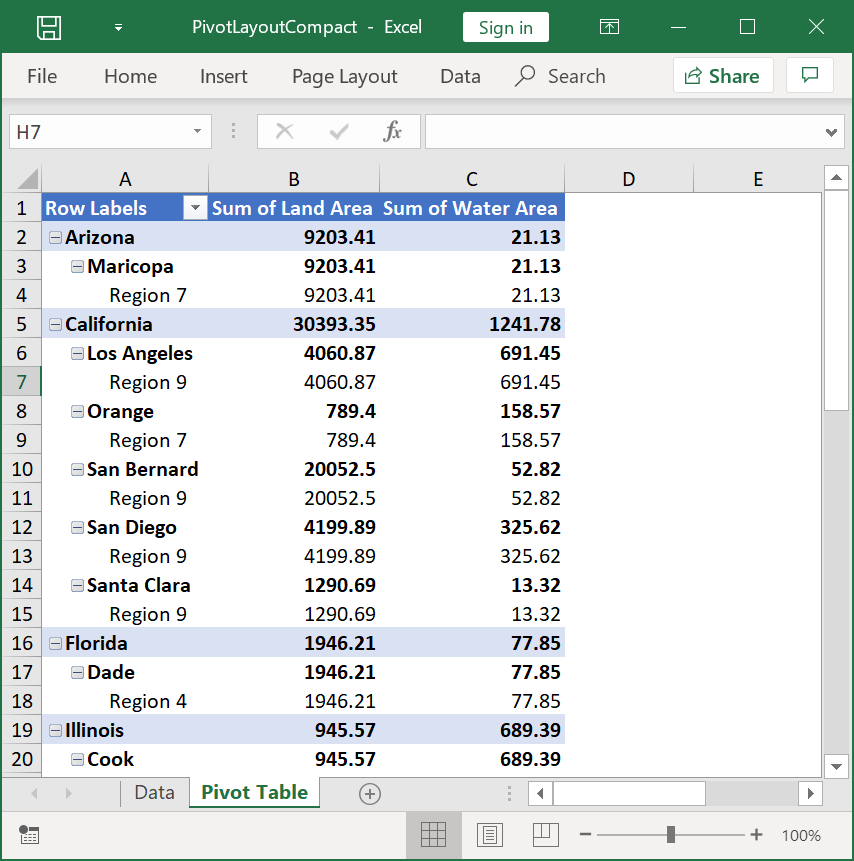
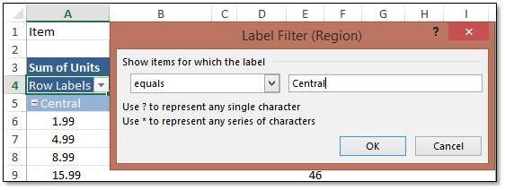

# Working with Pivot Tables

You can easily arrange and summarize complex data in a [Pivot Table](https://support.office.com/en-us/article/PivotTable-I-Get-started-with-PivotTable-reports-in-Excel-2007-bfe774d3-3e20-46f7-b6a3-f7984855d665). Creation and Manipulation of pivot table is supported in Excel 2007 and later formats, and pivot table in an existing document can be preserved for Excel 2003 format**.**

## Create a pivot table

Steps to create a simple pivot table: 

* Add pivot cache
* Add pivot table
* Add row and column fields
* Add data fields

Pivot tables do not take data directly from the source data, but take from the pivot cache that memorizes a snapshot of the data. The **IPivotCache** interface caches the data that needs to be summarized. 

The data in worksheet is added to the pivot cache as follows.



//Create Pivot cache with the given data range
IPivotCache cache = workbook.PivotCaches.Add(worksheet["A1:H50"]);



'Create Pivot cache with the given data range
Dim cache As IPivotCache = workbook.PivotCaches.Add(worksheet("A1:H50"))



//Create Pivot cache with the given data range
IPivotCache cache = workbook.PivotCaches.Add(worksheet["A1:H50"]);



//Create Pivot cache with the given data range
IPivotCache cache = workbook.PivotCaches.Add(worksheet["A1:H50"]);



//Create Pivot cache with the given data range
IPivotCache cache = workbook.PivotCaches.Add(worksheet["A1:H50"]);

  

**IPivotTable** represents a single pivot table object created from the cache. It has properties that customizes the pivot table. The following code creates a blank pivot table. 



//Create "PivotTable1" with the cache at the specified range
IPivotTable pivotTable = worksheet.PivotTables.Add("PivotTable1", worksheet["A1"], cache);



'Create "PivotTable1" with the cache at the specified range
Dim pivotTable As IPivotTable = worksheet.PivotTables.Add("PivotTable1", worksheet("A1"), cache)



//Create "PivotTable1" with the cache at the specified range
IPivotTable pivotTable = worksheet.PivotTables.Add("PivotTable1", worksheet["A1"], cache);



//Create "PivotTable1" with the cache at the specified range
IPivotTable pivotTable = worksheet.PivotTables.Add("PivotTable1", worksheet["A1"], cache);



//Create "PivotTable1" with the cache at the specified range
IPivotTable pivotTable = worksheet.PivotTables.Add("PivotTable1", worksheet["A1"], cache);

  

The pivot table should be populated with required fields. The **IPivotField** represents a single field in the pivot table, which includes row, column, and data field axes. 



//Add Pivot table fields (row and column fields)
pivotTable.Fields[2].Axis = PivotAxisTypes.Row;
pivotTable.Fields[6].Axis = PivotAxisTypes.Row;
pivotTable.Fields[3].Axis = PivotAxisTypes.Column;



'Add Pivot table fields (row and column fields)
pivotTable.Fields(2).Axis = PivotAxisTypes.Row
pivotTable.Fields(6).Axis = PivotAxisTypes.Row
pivotTable.Fields(3).Axis = PivotAxisTypes.Column



//Add Pivot table fields (row and column fields)
pivotTable.Fields[2].Axis = PivotAxisTypes.Row;
pivotTable.Fields[6].Axis = PivotAxisTypes.Row;
pivotTable.Fields[3].Axis = PivotAxisTypes.Column;



//Add Pivot table fields (row and column fields)
pivotTable.Fields[2].Axis = PivotAxisTypes.Row;
pivotTable.Fields[6].Axis = PivotAxisTypes.Row;
pivotTable.Fields[3].Axis = PivotAxisTypes.Column;



//Add Pivot table fields (row and column fields)
pivotTable.Fields[2].Axis = PivotAxisTypes.Row;
pivotTable.Fields[6].Axis = PivotAxisTypes.Row;
pivotTable.Fields[3].Axis = PivotAxisTypes.Column;

  

The **IPivotDataFields** represents a collection of data fields in the pivot table. The data field is added with the required subtotal function using the **PivotSubtotalTypes** enumeration. To learn more about different subtotal types supported in pivot tables, refer to the **PivotSubtotalTypes** in API section. The following code explains how to configure a pivot field as a data field.



//Add data field
IPivotField field = pivotTable.Fields[5];
pivotTable.DataFields.Add(field, "Sum", PivotSubtotalTypes.Sum);



'Add data field
Dim field As IPivotField = pivotTable.Fields(5)
pivotTable.DataFields.Add(field, "Sum", PivotSubtotalTypes.Sum)



//Add data field
IPivotField field = pivotTable.Fields[5];
pivotTable.DataFields.Add(field, "Sum", PivotSubtotalTypes.Sum);



//Add data field
IPivotField field = pivotTable.Fields[5];
pivotTable.DataFields.Add(field, "Sum", PivotSubtotalTypes.Sum);



//Add data field
IPivotField field = pivotTable.Fields[5];
pivotTable.DataFields.Add(field, "Sum", PivotSubtotalTypes.Sum);

  

The following code snippet illustrates how to create a pivot table with existing data in the worksheet using XlsIO.




using (ExcelEngine excelEngine = new ExcelEngine())
{
  IApplication application = excelEngine.Excel;
  application.DefaultVersion = ExcelVersion.Excel2013;
  IWorkbook workbook = application.Workbooks.Open("PivotData.xlsx");
  IWorksheet worksheet = workbook.Worksheets[0];
  IWorksheet pivotSheet = workbook.Worksheets[1];

  //Create Pivot cache with the given data range
  IPivotCache cache = workbook.PivotCaches.Add(worksheet["A1:H50"]);

  //Create "PivotTable1" with the cache at the specified range
  IPivotTable pivotTable = pivotSheet.PivotTables.Add("PivotTable1", pivotSheet["A1"], cache);

  //Add Pivot table fields (Row and Column fields)
  pivotTable.Fields[2].Axis = PivotAxisTypes.Row;
  pivotTable.Fields[6].Axis = PivotAxisTypes.Row;
  pivotTable.Fields[3].Axis = PivotAxisTypes.Column;

  //Add data field
  IPivotField field = pivotTable.Fields[2];
  pivotTable.DataFields.Add(field, "Sum", PivotSubtotalTypes.Sum);
  
  workbook.SaveAs("PivotTable.xlsx");
}



Using excelEngine As ExcelEngine = New ExcelEngine()
  Dim application As IApplication = excelEngine.Excel
  application.DefaultVersion = ExcelVersion.Excel2013

  Dim workbook As IWorkbook = application.Workbooks.Open("PivotData.xlsx")
  Dim worksheet As IWorksheet = workbook.Worksheets(0)
  Dim pivotSheet As IWorksheet = workbook.Worksheets(1)

  'Create Pivot cache with the given data range
  Dim cache As IPivotCache = workbook.PivotCaches.Add(worksheet("A1:H50"))

  'Create "PivotTable1" with the cache at the specified range
  Dim pivotTable As IPivotTable = pivotSheet.PivotTables.Add("PivotTable1", pivotSheet("A1"), cache)

  'Add Pivot table fields (Row and Column fields)
  pivotTable.Fields(2).Axis = PivotAxisTypes.Row
  pivotTable.Fields(6).Axis = PivotAxisTypes.Row
  pivotTable.Fields(3).Axis = PivotAxisTypes.Column

  'Add data field
  Dim field As IPivotField = pivotTable.Fields(2)
  pivotTable.DataFields.Add(field, "Sum", PivotSubtotalTypes.Sum)

  workbook.SaveAs("PivotTable.xlsx")
End Using



using (ExcelEngine excelEngine = new ExcelEngine())
{  	
  IApplication application = excelEngine.Excel;
  application.DefaultVersion = ExcelVersion.Excel2013;

  //Gets assembly
  Assembly assembly = typeof(App).GetTypeInfo().Assembly;

  //Gets input Excel document from embedded resource collection
  Stream inputStream = assembly.GetManifestResourceStream("PivotTable.PivotData.xlsx");

  IWorkbook workbook = await application.Workbooks.OpenAsync(inputStream);
  IWorksheet worksheet = workbook.Worksheets[0];
  IWorksheet pivotSheet = workbook.Worksheets[1];

  //Create Pivot cache with the given data range
  IPivotCache cache = workbook.PivotCaches.Add(worksheet["A1:H50"]);

  //Create "PivotTable1" with the cache at the specified range
  IPivotTable pivotTable = pivotSheet.PivotTables.Add("PivotTable1", pivotSheet["A1"], cache);

  //Add Pivot table fields (Row and Column fields)
  pivotTable.Fields[2].Axis = PivotAxisTypes.Row;
  pivotTable.Fields[6].Axis = PivotAxisTypes.Row;
  pivotTable.Fields[3].Axis = PivotAxisTypes.Column;

  //Add data field
  IPivotField field = pivotTable.Fields[2];
  pivotTable.DataFields.Add(field, "Sum", PivotSubtotalTypes.Sum);

  //Initializes FileSavePicker
  FileSavePicker savePicker = new FileSavePicker();
  savePicker.SuggestedStartLocation = PickerLocationId.Desktop;
  savePicker.SuggestedFileName = "PivotTable";
  savePicker.FileTypeChoices.Add("Excel Files", new List<string>() { ".xlsx" });

  //Creates a storage file from FileSavePicker
  StorageFile storageFile = await savePicker.PickSaveFileAsync();

  //Saves changes to the specified storage file
  await workbook.SaveAsAsync(storageFile);
}



using (ExcelEngine excelEngine = new ExcelEngine())
{
  IApplication application = excelEngine.Excel;
  FileStream fileStream = new FileStream("PivotData.xlsx", FileMode.Open, FileAccess.Read);
  IWorkbook workbook = application.Workbooks.Open(fileStream);
  IWorksheet worksheet = workbook.Worksheets[0];
  IWorksheet pivotSheet = workbook.Worksheets[1];

  //Create Pivot cache with the given data range
  IPivotCache cache = workbook.PivotCaches.Add(worksheet["A1:H50"]);

  //Create "PivotTable1" with the cache at the specified range
  IPivotTable pivotTable = pivotSheet.PivotTables.Add("PivotTable1", pivotSheet["A1"], cache);

  //Add Pivot table fields (Row and Column fields)
  pivotTable.Fields[2].Axis = PivotAxisTypes.Row;
  pivotTable.Fields[6].Axis = PivotAxisTypes.Row;
  pivotTable.Fields[3].Axis = PivotAxisTypes.Column;

  //Add data field
  IPivotField field = pivotTable.Fields[2];
  pivotTable.DataFields.Add(field, "Sum", PivotSubtotalTypes.Sum);

  string fileName = "PivotTable.xlsx";
  //Saving the workbook as stream
  FileStream stream = new FileStream(fileName, FileMode.Create, FileAccess.ReadWrite);
  workbook.SaveAs(stream);
  stream.Dispose();
}



using (ExcelEngine excelEngine = new ExcelEngine())
{
  IApplication application = excelEngine.Excel;
  application.DefaultVersion = ExcelVersion.Excel2013;

  //Gets assembly
  Assembly assembly = typeof(App).GetTypeInfo().Assembly;

  //Gets input Excel document from embedded resource collection
  Stream inputStream = assembly.GetManifestResourceStream("PivotTable.PivotData.xlsx");

  IWorkbook workbook = application.Workbooks.Open(inputStream);
  IWorksheet worksheet = workbook.Worksheets[0];
  IWorksheet pivotSheet = workbook.Worksheets[1];

  //Create Pivot cache with the given data range
  IPivotCache cache = workbook.PivotCaches.Add(worksheet["A1:H50"]);

  //Create "PivotTable1" with the cache at the specified range
  IPivotTable pivotTable = pivotSheet.PivotTables.Add("PivotTable1", pivotSheet["A1"], cache);

  //Add Pivot table fields (Row and Column fields)
  pivotTable.Fields[2].Axis = PivotAxisTypes.Row;
  pivotTable.Fields[6].Axis = PivotAxisTypes.Row;
  pivotTable.Fields[3].Axis = PivotAxisTypes.Column;

  //Add data field
  IPivotField field = pivotTable.Fields[2];

  pivotTable.DataFields.Add(field, "Sum", PivotSubtotalTypes.Sum);

  //Saving the workbook as stream
  MemoryStream outputStream = new MemoryStream();
  workbook.SaveAs(outputStream);

  string fileName = "PivotTable.xlsx";

  outputStream.Position = 0;

  //Save the document as file and view the saved document

  //The operation in SaveAndView under Xamarin varies among Windows Phone, Android, and iOS platforms. Refer to the xlsio/xamarin section for respective code samples.

  if (Device.OS == TargetPlatform.WinPhone || Device.OS == TargetPlatform.Windows)
  {
	Xamarin.Forms.DependencyService.Get<ISaveWindowsPhone>().SaveAndView(fileName, "application/msexcel", outputStream);
  }
  else
  {
	Xamarin.Forms.DependencyService.Get<ISave>().SaveAndView(fileName, "application/msexcel", outputStream);
  }
}

  

## Editing and formatting a pivot table

A pivot table can be accessed from the **IPivotTables** interface that have the collection of pivot tables in the worksheet. You can modify the pivot table format or pivot cell format using IPivotTable properties and methods.

### Pivot Table Formatting

XlsIO supports 85 built-in styles of Microsoft Excel used to create a table with rich formatting using the PivotBuiltInStyles property as follows. To learn more about various built-in styles supported, refer to the PivotBuiltInStyles enumeration in API section.

The following code snippet illustrates how to apply built-in style to pivot table



using (ExcelEngine excelEngine = new ExcelEngine())
{
  IApplication application = excelEngine.Excel;
  application.DefaultVersion = ExcelVersion.Excel2013;

  IWorkbook workbook = application.Workbooks.Open("PivotTable.xlsx");
  IWorksheet worksheet = workbook.Worksheets[1];
  IPivotTable pivotTable = worksheet.PivotTables[0];

  //Set BuiltInStyle
  pivotTable.BuiltInStyle = PivotBuiltInStyles.PivotStyleDark12;

  workbook.SaveAs("PivotTable_Style.xlsx");

  //No exception will be thrown if there are unsaved workbooks
  excelEngine.ThrowNotSavedOnDestroy = false;
}



Using excelEngine As ExcelEngine = New ExcelEngine()
  Dim application As IApplication = excelEngine.Excel
  application.DefaultVersion = ExcelVersion.Excel2013

  Dim workbook As IWorkbook = application.Workbooks.Open("PivotTable.xlsx")
  Dim sheet As IWorksheet = workbook.Worksheets(1)
  Dim pivotTable As IPivotTable = sheet.PivotTables(0)

  'Set BuiltInStyle
  pivotTable.BuiltInStyle = PivotBuiltInStyles.PivotStyleDark12

  workbook.SaveAs("PivotTable_Style.xlsx")

  'No exception will be thrown if there are unsaved workbooks
  excelEngine.ThrowNotSavedOnDestroy = False
End Using



using (ExcelEngine excelEngine = new ExcelEngine())
{
  IApplication application = excelEngine.Excel;
  application.DefaultVersion = ExcelVersion.Excel2013;

  //Gets assembly
  Assembly assembly = typeof(App).GetTypeInfo().Assembly;

  //Gets input Excel document from embedded resource collection
  Stream inputStream = assembly.GetManifestResourceStream("PivotTable.PivotTable.xlsx");

  IWorkbook workbook = await application.Workbooks.OpenAsync(inputStream);
  IWorksheet worksheet = workbook.Worksheets[1];
  IPivotTable pivotTable = worksheet.PivotTables[0];

  //Set BuiltInStyle
  pivotTable.BuiltInStyle = PivotBuiltInStyles.PivotStyleDark12;

  //Initializes FileSavePicker
  FileSavePicker savePicker = new FileSavePicker();
  savePicker.SuggestedStartLocation = PickerLocationId.Desktop;
  savePicker.SuggestedFileName = "PivotTable_Style";
  savePicker.FileTypeChoices.Add("Excel Files", new List<string>() { ".xlsx" });

  //Creates a storage file from FileSavePicker
  StorageFile storageFile = await savePicker.PickSaveFileAsync();

  //Saves changes to the specified storage file
  await workbook.SaveAsAsync(storageFile);
}



using (ExcelEngine excelEngine = new ExcelEngine())
{
  IApplication application = excelEngine.Excel;
  application.DefaultVersion = ExcelVersion.Excel2013;
  FileStream fileStream = new FileStream("PivotTable.xlsx", FileMode.Open, FileAccess.Read);

  IWorkbook workbook = application.Workbooks.Open(fileStream);
  IWorksheet worksheet = workbook.Worksheets[1];
  IPivotTable pivotTable = worksheet.PivotTables[0];

  //Set BuiltInStyle
  pivotTable.BuiltInStyle = PivotBuiltInStyles.PivotStyleDark12;

  string fileName = "PivotTable_Style.xlsx";

  //Saving the workbook as stream
  FileStream stream = new FileStream(fileName, FileMode.Create, FileAccess.ReadWrite);
  workbook.SaveAs(stream);
  stream.Dispose();
}



using (ExcelEngine excelEngine = new ExcelEngine())
{
  IApplication application = excelEngine.Excel;
  application.DefaultVersion = ExcelVersion.Excel2013;

  //Gets assembly
  Assembly assembly = typeof(App).GetTypeInfo().Assembly;

  //Gets input Excel document from embedded resource collection
  Stream inputStream = assembly.GetManifestResourceStream("PivotTable.PivotTable.xlsx");

  IWorkbook workbook = application.Workbooks.Open(inputStream);
  IWorksheet worksheet = workbook.Worksheets[1];
  IPivotTable pivotTable = worksheet.PivotTables[0];

  //Set BuiltInStyle
  pivotTable.BuiltInStyle = PivotBuiltInStyles.PivotStyleDark12;

  //Saving the workbook as stream
  MemoryStream outputStream = new MemoryStream();
  workbook.SaveAs(outputStream);

  string fileName = "PivotTable_Style.xlsx";

  outputStream.Position = 0;

  //Save the document as file and view the saved document

  //The operation in SaveAndView under Xamarin varies among Windows Phone, Android, and iOS platforms. Refer to the xlsio/xamarin section for respective code samples.

  if (Device.OS == TargetPlatform.WinPhone || Device.OS == TargetPlatform.Windows)
  {
  	Xamarin.Forms.DependencyService.Get<ISaveWindowsPhone>().SaveAndView(fileName, "application/msexcel", outputStream);
  }
  else
  {
  	Xamarin.Forms.DependencyService.Get<ISave>().SaveAndView(fileName, "application/msexcel", outputStream);
  }
}

  

### Pivot Cell Formatting

When you apply the cell formatting to pivot table cells, Microsoft Excel maintains the formatting information in pivot table and shows the cell formatting on pivot table cells from that pivot formats. XlsIO supports to apply cell formatting to pivot table range cells. You can apply all the cell formatting using IPivotTable GetCellFormat method and IPivotCellFormat interface.

The following code snippet illustrates how to apply cell formatting to pivot table cells.



using (ExcelEngine engine = new ExcelEngine())
{
  IApplication application = engine.Excel;
  IWorkbook workbook = application.Workbooks.Open("PivotTable.xlsx");
  IWorksheet worksheet = workbook.Worksheets[0];

  IPivotTable pivotTable = worksheet.PivotTables[0];
  //Get the cell format for "A1" pivot range.
  IPivotCellFormat cellFormat = pivotTable.GetCellFormat("A3:C4");
  cellFormat.BackColor = ExcelKnownColors.Green;

  workbook.SaveAs("PivotFormat.xlsx");
}



Using excelEngine As ExcelEngine = New ExcelEngine()
  Dim application As IApplication = excelEngine.Excel
  Dim workbook As IWorkbook = application.Workbooks.Open("PivotTable.xlsx")
  Dim pivotSheet As IWorksheet = workbook.Worksheets(0)

  Dim pivotTable As IPivotTable = worksheet.PivotTables(0)
  'Get the cell format for "A1" pivot range.
  Dim cellFormat As IPivotCellFormat = pivotTable.GetCellFormat("A3:C4")
  cellFormat.BackColor = ExcelKnownColors.Green

  workbook.SaveAs("PivotFormat.xlsx")
End Using



using (ExcelEngine excelEngine = new ExcelEngine())
{
  IApplication application = excelEngine.Excel;

  //Gets assembly
  Assembly assembly = typeof(App).GetTypeInfo().Assembly;

  //Gets input Excel document from embedded resource collection
  Stream inputStream = assembly.GetManifestResourceStream("PivotTable.PivotTable.xlsx");

  IWorkbook workbook = await application.Workbooks.OpenAsync(inputStream);
  IWorksheet worksheet = workbook.Worksheets[0];

  IPivotTable pivotTable = worksheet.PivotTables[0];
  //Get the cell format for "A1" pivot range.
  IPivotCellFormat cellFormat = pivotTable.GetCellFormat("A3:C4");
  cellFormat.BackColor = ExcelKnownColors.Green;

  //Initializes FileSavePicker
  FileSavePicker savePicker = new FileSavePicker();
  savePicker.SuggestedStartLocation = PickerLocationId.Desktop;
  savePicker.SuggestedFileName = "PivotFormat";
  savePicker.FileTypeChoices.Add("Excel Files", new List<string>() { ".xlsx" });

  //Creates a storage file from FileSavePicker
  StorageFile storageFile = await savePicker.PickSaveFileAsync();

  //Saves changes to the specified storage file
  await workbook.SaveAsAsync(storageFile);
}



using (ExcelEngine excelEngine = new ExcelEngine())
{
  IApplication application = excelEngine.Excel;
  FileStream fileStream = new FileStream("PivotTable.xlsx", FileMode.Open, FileAccess.Read);
  IWorkbook workbook = application.Workbooks.Open(fileStream);
  IWorksheet worksheet = workbook.Worksheets[0];

  IPivotTable pivotTable = worksheet.PivotTables[0];
  //Get the cell format for "A1" pivot range.
  IPivotCellFormat cellFormat = pivotTable.GetCellFormat("A3:C4");
  cellFormat.BackColor = ExcelKnownColors.Green;

  string fileName = "PivotFormat.xlsx";
  //Saving the workbook as stream
  FileStream stream = new FileStream(fileName, FileMode.Create, FileAccess.ReadWrite);
  workbook.SaveAs(stream);
  stream.Dispose();
}



using (ExcelEngine excelEngine = new ExcelEngine())
{
  IApplication application = excelEngine.Excel;

  //Gets assembly
  Assembly assembly = typeof(App).GetTypeInfo().Assembly;

  //Gets input Excel document from embedded resource collection
  Stream inputStream = assembly.GetManifestResourceStream("PivotTable.PivotTable.xlsx");

  IWorkbook workbook = application.Workbooks.Open(inputStream);
  IWorksheet worksheet = workbook.Worksheets[0];

  IPivotTable pivotTable = worksheet.PivotTables[0];
  //Get the cell format for "A1" pivot range.
  IPivotCellFormat cellFormat = pivotTable.GetCellFormat("A3:C4");
  cellFormat.BackColor = ExcelKnownColors.Green;

  //Saving the workbook as stream
  MemoryStream outputStream = new MemoryStream();
  workbook.SaveAs(outputStream);

  string fileName = "PivotFormat.xlsx";

  outputStream.Position = 0;

  //Save the document as file and view the saved document

  //The operation in SaveAndView under Xamarin varies among Windows Phone, Android, and iOS platforms. Refer to the xlsio/xamarin section for respective code samples.

  if (Device.OS == TargetPlatform.WinPhone || Device.OS == TargetPlatform.Windows)
  {
	Xamarin.Forms.DependencyService.Get<ISaveWindowsPhone>().SaveAndView(fileName, "application/msexcel", outputStream);
  }
  else
  {
	Xamarin.Forms.DependencyService.Get<ISave>().SaveAndView(fileName, "application/msexcel", outputStream);
  }
}



The following screenshot represents the input template of pivot table inline formatting.

The following screenshot represents the generated Excel file with pivot table inline formatting in XlsIO.

## Refresh a pivot table
When you update the pivot table data source, you should refresh the pivot table manually to load the new data source into it. Essential XlsIO supports this refreshing of pivot table data source through IsRefreshOnLoad property of PivotCacheImpl.

The following code shows how to dynamically refresh the data in a pivot table. In prior:

* Create the pivot table using Excel GUI.
* Specify the named range to be the data source of the pivot table.
* Make sure that the "Refresh on Open" option of the pivot table is selected.
* Dynamically refresh the data in the named range.



using (ExcelEngine excelEngine = new ExcelEngine())
{
  IApplication application = excelEngine.Excel;
  application.DefaultVersion = ExcelVersion.Excel2013;
  IWorkbook workbook = application.Workbooks.Open("PivotTable.xlsx");
  IWorksheet pivotSheet = workbook.Worksheets[0];

  //Change the range values that the Pivot Tables range refers to
  workbook.Names["PivotRange"].RefersToRange = pivotSheet.Range["A1:D27"];

  workbook.SaveAs("PivotTable_DynamicRange.xlsx");
}



Using excelEngine As ExcelEngine = New ExcelEngine()
  Dim application As IApplication = excelEngine.Excel
  application.DefaultVersion = ExcelVersion.Excel2013
  Dim workbook As IWorkbook = application.Workbooks.Open("PivotTable.xlsx")
  Dim pivotSheet As IWorksheet = workbook.Worksheets(0)

  'Change the range values that the Pivot Tables range refers to
  workbook.Names("PivotRange").RefersToRange = pivotSheet.Range("A1:D27")

  workbook.SaveAs("PivotTable_DynamicRange.xlsx")
End Using



using (ExcelEngine excelEngine = new ExcelEngine())
{
  IApplication application = excelEngine.Excel;
  application.DefaultVersion = ExcelVersion.Excel2013;

  //Gets assembly
  Assembly assembly = typeof(App).GetTypeInfo().Assembly;

  //Gets input Excel document from embedded resource collection
  Stream inputStream = assembly.GetManifestResourceStream("PivotTable.PivotTable.xlsx");

  IWorkbook workbook = await application.Workbooks.OpenAsync(inputStream);
  IWorksheet pivotSheet = workbook.Worksheets[0];

  //Change the range values that the Pivot Tables range refers to
  workbook.Names["PivotRange"].RefersToRange = pivotSheet.Range["A1:D27"];

  //Initializes FileSavePicker
  FileSavePicker savePicker = new FileSavePicker();
  savePicker.SuggestedStartLocation = PickerLocationId.Desktop;
  savePicker.SuggestedFileName = "PivotTable_DynamicRange";
  savePicker.FileTypeChoices.Add("Excel Files", new List<string>() { ".xlsx" });

  //Creates a storage file from FileSavePicker
  StorageFile storageFile = await savePicker.PickSaveFileAsync();

  //Saves changes to the specified storage file
  await workbook.SaveAsAsync(storageFile);
}



using (ExcelEngine excelEngine = new ExcelEngine())
{
  IApplication application = excelEngine.Excel;
  application.DefaultVersion = ExcelVersion.Excel2013;
  FileStream fileStream = new FileStream("PivotTable.xlsx", FileMode.Open, FileAccess.Read);
  IWorkbook workbook = application.Workbooks.Open(fileStream);
  IWorksheet pivotSheet = workbook.Worksheets[0];

  //Change the range values that the Pivot Tables range refers to
  workbook.Names["PivotRange"].RefersToRange = pivotSheet.Range["A1:D27"];

  string fileName = "PivotTable_DynamicRange.xlsx";
  //Saving the workbook as stream
  FileStream stream = new FileStream(fileName, FileMode.Create, FileAccess.ReadWrite);
  workbook.SaveAs(stream);
  stream.Dispose();
}



using (ExcelEngine excelEngine = new ExcelEngine())
{
  IApplication application = excelEngine.Excel;
  application.DefaultVersion = ExcelVersion.Excel2013;

  //Gets assembly
  Assembly assembly = typeof(App).GetTypeInfo().Assembly;

  //Gets input Excel document from embedded resource collection
  Stream inputStream = assembly.GetManifestResourceStream("PivotTable.PivotTable.xlsx");

  IWorkbook workbook = application.Workbooks.Open(inputStream);
  IWorksheet pivotSheet = workbook.Worksheets[0];

  //Change the range values that the Pivot Tables range refers to
  workbook.Names["PivotRange"].RefersToRange = pivotSheet.Range["A1:D27"];

  //Saving the workbook as stream
  MemoryStream outputStream = new MemoryStream();
  workbook.SaveAs(outputStream);

  string fileName = "PivotTable_DynamicRange.xlsx";

  outputStream.Position = 0;

  //Save the document as file and view the saved document

  //The operation in SaveAndView under Xamarin varies among Windows Phone, Android, and iOS platforms. Refer to the xlsio/xamarin section for respective code samples.

  if (Device.OS == TargetPlatform.WinPhone || Device.OS == TargetPlatform.Windows)
  {
	Xamarin.Forms.DependencyService.Get<ISaveWindowsPhone>().SaveAndView(fileName, "application/msexcel", outputStream);
  }
  else
  {
	Xamarin.Forms.DependencyService.Get<ISave>().SaveAndView(fileName, "application/msexcel", outputStream);
  }
}

  

The following code snippet illustrates how to refresh the pivot table after update the cell value in pivot data source.



using (ExcelEngine excelEngine = new ExcelEngine())
{
  IApplication application = excelEngine.Excel;
  application.DefaultVersion = ExcelVersion.Excel2013;
  IWorkbook workbook = application.Workbooks.Open("Sample.xlsx");
  IWorksheet worksheet = workbook.Worksheets[0];

  //Updating a new value in the pivot data
  worksheet.Range["C2"].Value = "250";

  //Accessing the pivot table 
  IPivotTable pivotTable = worksheet.PivotTables[0];
  PivotTableImpl pivotTableImpl = pivotTable as PivotTableImpl;

  //Refreshing pivot cache to update the pivot table
  pivotTableImpl.Cache.IsRefreshOnLoad = true;

  workbook.SaveAs("Output.xlsx");
}



Using excelEngine As ExcelEngine = New ExcelEngine()
  Dim application As IApplication = excelEngine.Excel
  application.DefaultVersion = ExcelVersion.Excel2013
  Dim workbook As IWorkbook = application.Workbooks.Open("Sample.xlsx")
  Dim worksheet As IWorksheet = workbook.Worksheets(0)

  'Updating a new value in the pivot data
  worksheet.Range("C2").Value = "250"

  'Accessing the pivot table
  Dim pivotTable As IPivotTable = worksheet.PivotTables(0)
  Dim pivotTableImpl As PivotTableImpl = CType(pivotTable, PivotTableImpl)

  'Refreshing pivot cache to update the pivot table
  pivotTableImpl.Cache.IsRefreshOnLoad = True

  workbook.SaveAs("Output.xlsx")
End Using



using (ExcelEngine excelEngine = new ExcelEngine())
{
  IApplication application = excelEngine.Excel;
  application.DefaultVersion = ExcelVersion.Excel2013;

  //Instantiates the file picker
  FileOpenPicker openPicker = new FileOpenPicker();
  openPicker.SuggestedStartLocation = PickerLocationId.Desktop;
  openPicker.FileTypeFilter.Add(".xlsx");
  openPicker.FileTypeFilter.Add(".xls");
  StorageFile file = await openPicker.PickSingleFileAsync();

  //Opening an existing workbook
  IWorkbook workbook = await application.Workbooks.OpenAsync(file);
  IWorksheet worksheet = workbook.Worksheets[0];

  //Updating a new value in the pivot data
  worksheet.Range["C2"].Value = "250";

  //Accessing the pivot table 
  IPivotTable pivotTable = worksheet.PivotTables[0];
  PivotTableImpl pivotTableImpl = pivotTable as PivotTableImpl;

  //Refreshing pivot cache to update the pivot table
  pivotTableImpl.Cache.IsRefreshOnLoad = true;

  //Initializes FileSavePicker
  FileSavePicker savePicker = new FileSavePicker();
  savePicker.SuggestedStartLocation = PickerLocationId.Desktop;
  savePicker.SuggestedFileName = "Output";
  savePicker.FileTypeChoices.Add("Excel Files", new List<string>() { ".xlsx" });

  //Creates a storage file from FileSavePicker
  StorageFile storageFile = await savePicker.PickSaveFileAsync();

  //Saves changes to the specified storage file
  await workbook.SaveAsAsync(storageFile);
}



using (ExcelEngine excelEngine = new ExcelEngine())
{
  IApplication application = excelEngine.Excel;
  application.DefaultVersion = ExcelVersion.Excel2013;
  FileStream fileStream = new FileStream("Sample.xlsx", FileMode.Open, FileAccess.Read);
  IWorkbook workbook = application.Workbooks.Open(fileStream);
  IWorksheet worksheet = workbook.Worksheets[0];

  //Updating a new value in the pivot data
  worksheet.Range["C2"].Value = "250";

  //Accessing the pivot table 
  IPivotTable pivotTable = worksheet.PivotTables[0];
  PivotTableImpl pivotTableImpl = pivotTable as PivotTableImpl;

  //Refreshing pivot cache to update the pivot table
  pivotTableImpl.Cache.IsRefreshOnLoad = true;

  //Saving the workbook as stream
  FileStream stream = new FileStream("Output.xlsx", FileMode.Create, FileAccess.ReadWrite);
  workbook.SaveAs(stream);
  stream.Dispose();
}



using (ExcelEngine excelEngine = new ExcelEngine())
{
  IApplication application = excelEngine.Excel;
  application.DefaultVersion = ExcelVersion.Excel2013;

  //"App" is the class of portable project
  Assembly assembly = typeof(App).GetTypeInfo().Assembly;
  Stream inputStream = assembly.GetManifestResourceStream("PivotTable.Sample.xlsx");
  IWorkbook workbook = application.Workbooks.Open(inputStream);
  IWorksheet worksheet = workbook.Worksheets[0];

  //Updating a new value in the pivot data
  worksheet.Range["C2"].Value = "250";

  //Accessing the pivot table 
  IPivotTable pivotTable = worksheet.PivotTables[0];
  PivotTableImpl pivotTableImpl = pivotTable as PivotTableImpl;

  //Refreshing pivot cache to update the pivot table
  pivotTableImpl.Cache.IsRefreshOnLoad = true;

  //Saving the workbook as stream
  MemoryStream stream = new MemoryStream();
  workbook.SaveAs(stream);

  stream.Position = 0;

  //Save the document as file and view the saved document

  //The operation in SaveAndView under Xamarin varies between Windows Phone, Android, and iOS platforms. Refer to xlsio/xamarin section for respective code samples.

  if (Device.OS == TargetPlatform.WinPhone || Device.OS == TargetPlatform.Windows)
  {
    Xamarin.Forms.DependencyService.Get<ISaveWindowsPhone>().SaveAndView("Output.xlsx", "application/msexcel", stream);
  }
  else
  {
    Xamarin.Forms.DependencyService.Get<ISave>().SaveAndView("Output.xlsx", "application/msexcel", stream);
  }
}



## Pivot table Layout

When you create pivot table in XlsIO, the pivot values are not set in the worksheet cells. Pivot table layout option set the pivot values to worksheet cells. XlsIO supports the layout option for all three pivot table types.

The following code snippet illustrates how to layout the pivot table.



using (ExcelEngine excelEngine = new ExcelEngine())
{
  IApplication application = excelEngine.Excel;
  IWorkbook workbook = application.Workbooks.Open("PivotTable.xlsx");
  IWorksheet worksheet = workbook.Worksheets[1];
  
  IPivotTable pivotTable = worksheet.PivotTables[0];
  //Layout the pivot table.
  pivotTable.Layout();

  workbook.SaveAs("PivotTable_Layout.xlsx");
}



Using excelEngine As ExcelEngine = New ExcelEngine()
  Dim application As IApplication = excelEngine.Excel
  Dim workbook As IWorkbook = application.Workbooks.Open("PivotTable.xlsx")
  Dim pivotSheet As IWorksheet = workbook.Worksheets(0)

  Dim pivotTable As IPivotTable = worksheet.PivotTables(0)
  'Layout the pivot table.
  pivotTable.Layout()

  workbook.SaveAs("PivotTable_Layout.xlsx")
End Using



using (ExcelEngine excelEngine = new ExcelEngine())
{
  IApplication application = excelEngine.Excel;

  //Gets assembly
  Assembly assembly = typeof(App).GetTypeInfo().Assembly;

  //Gets input Excel document from embedded resource collection
  Stream inputStream = assembly.GetManifestResourceStream("PivotTable.PivotTable.xlsx");

  IWorkbook workbook = await application.Workbooks.OpenAsync(inputStream);
  IWorksheet worksheet = workbook.Worksheets[0];

  IPivotTable pivotTable = worksheet.PivotTables[0];
  //Layout the pivot table.
  pivotTable.Layout();

  //Initializes FileSavePicker
  FileSavePicker savePicker = new FileSavePicker();
  savePicker.SuggestedStartLocation = PickerLocationId.Desktop;
  savePicker.SuggestedFileName = "PivotTable_Layout";
  savePicker.FileTypeChoices.Add("Excel Files", new List<string>() { ".xlsx" });

  //Creates a storage file from FileSavePicker
  StorageFile storageFile = await savePicker.PickSaveFileAsync();

  //Saves changes to the specified storage file
  await workbook.SaveAsAsync(storageFile);
}



using (ExcelEngine excelEngine = new ExcelEngine())
{
  IApplication application = excelEngine.Excel;
  FileStream fileStream = new FileStream("PivotTable.xlsx", FileMode.Open, FileAccess.Read);
  IWorkbook workbook = application.Workbooks.Open(fileStream);
  IWorksheet worksheet = workbook.Worksheets[0];

  IPivotTable pivotTable = worksheet.PivotTables[0];
  //Layout the pivot table.
  pivotTable.Layout();

  string fileName = "PivotTable_Layout.xlsx";
  //Saving the workbook as stream
  FileStream stream = new FileStream(fileName, FileMode.Create, FileAccess.ReadWrite);
  workbook.SaveAs(stream);
  stream.Dispose();
}



using (ExcelEngine excelEngine = new ExcelEngine())
{
  IApplication application = excelEngine.Excel;

  //Gets assembly
  Assembly assembly = typeof(App).GetTypeInfo().Assembly;

  //Gets input Excel document from embedded resource collection
  Stream inputStream = assembly.GetManifestResourceStream("PivotTable.PivotTable.xlsx");

  IWorkbook workbook = application.Workbooks.Open(inputStream);
  IWorksheet worksheet = workbook.Worksheets[0];

  IPivotTable pivotTable = worksheet.PivotTables[0];
  //Layout the pivot table.
  pivotTable.Layout();

  //Saving the workbook as stream
  MemoryStream outputStream = new MemoryStream();
  workbook.SaveAs(outputStream);

  string fileName = "PivotTable_Layout.xlsx";

  outputStream.Position = 0;

  //Save the document as file and view the saved document

  //The operation in SaveAndView under Xamarin varies among Windows Phone, Android, and iOS platforms. Refer to the xlsio/xamarin section for respective code samples.

  if (Device.OS == TargetPlatform.WinPhone || Device.OS == TargetPlatform.Windows)
  {
	Xamarin.Forms.DependencyService.Get<ISaveWindowsPhone>().SaveAndView(fileName, "application/msexcel", outputStream);
  }
  else
  {
	Xamarin.Forms.DependencyService.Get<ISave>().SaveAndView(fileName, "application/msexcel", outputStream);
  }
}



The following screenshots represents the generated Excel file with pivot table layout in XlsIO.

Compact layout:

Outline layout:

Tabular layout:

## Expand or collapse rows in pivot table

Essential XlsIO allows you to expand and collapse the **PivotFieldItems** or simply the pivot table rows using **IsHiddenDetails** of **PivotItemOptions**.

Refer the following complete code snippets.



using (ExcelEngine excelEngine = new ExcelEngine())
{
  IApplication application = excelEngine.Excel;
  application.DefaultVersion = ExcelVersion.Excel2013;
  IWorkbook workbook = application.Workbooks.Open("Sample.xlsx");
  IWorksheet worksheet = workbook.Worksheets[0];

  //Create pivot cache with the given data range
  IPivotCache cache = workbook.PivotCaches.Add(worksheet["A1:C13"]);

  //Create "PivotTable1" with the cache at the specified range
  IPivotTable pivotTable = worksheet.PivotTables.Add("PivotTable1", worksheet["E1"], cache);

  //Add pivot table fields (Row and Column fields)
  pivotTable.Fields[0].Axis = PivotAxisTypes.Row;
  pivotTable.Fields[1].Axis = PivotAxisTypes.Row;

  //Add data field
  IPivotField field = pivotTable.Fields[2];
  pivotTable.DataFields.Add(field, "Sum", PivotSubtotalTypes.Sum);

  //Initialize PivotItemOptions
  PivotItemOptions options = new PivotItemOptions();
  options.IsHiddenDetails = false;

  //Collapsing the first and second items of the first pivot field using PivotItemOptions
  (pivotTable.Fields[0] as PivotFieldImpl).AddItemOption(0, options);
  (pivotTable.Fields[0] as PivotFieldImpl).AddItemOption(1, options);

  workbook.SaveAs("Output.xlsx");
}



Using excelEngine As ExcelEngine = New ExcelEngine()
  Dim application As IApplication = excelEngine.Excel
  application.DefaultVersion = ExcelVersion.Excel2013
  Dim workbook As IWorkbook = application.Workbooks.Open("Sample.xlsx")
  Dim worksheet As IWorksheet = workbook.Worksheets(0)

  'Create pivot cache with the given data range
  Dim cache As IPivotCache = workbook.PivotCaches.Add(worksheet("A1:C13"))

  'Create "PivotTable1" with the cache at the specified range
  Dim pivotTable As IPivotTable = worksheet.PivotTables.Add("PivotTable1", worksheet("E1"), cache)

  'Add pivot table fields (Row and Column fields)
  pivotTable.Fields(0).Axis = PivotAxisTypes.Row
  pivotTable.Fields(1).Axis = PivotAxisTypes.Row

  'Add data field
  Dim field As IPivotField = pivotTable.Fields(2)
  pivotTable.DataFields.Add(field, "Sum", PivotSubtotalTypes.Sum)

  'Initialize PivotItemOptions
  Dim options As PivotItemOptions = New PivotItemOptions
  options.IsHiddenDetails = False

  'Collapsing the first and second items of the first pivot field using PivotItemOptions
  CType(pivotTable.Fields(0), PivotFieldImpl).AddItemOption(0, options)
  CType(pivotTable.Fields(0), PivotFieldImpl).AddItemOption(1, options)

  workbook.SaveAs("Output.xlsx")
End Using



using (ExcelEngine excelEngine = new ExcelEngine())
{
  IApplication application = excelEngine.Excel;
  application.DefaultVersion = ExcelVersion.Excel2013;

  //Instantiates the file picker
  FileOpenPicker openPicker = new FileOpenPicker();
  openPicker.SuggestedStartLocation = PickerLocationId.Desktop;
  openPicker.FileTypeFilter.Add(".xlsx");
  openPicker.FileTypeFilter.Add(".xls");
  StorageFile file = await openPicker.PickSingleFileAsync();

  //Opening the existing workbook
  IWorkbook workbook = await application.Workbooks.OpenAsync(file);
  IWorksheet worksheet = workbook.Worksheets[0];

  //Create pivot cache with the given data range
  IPivotCache cache = workbook.PivotCaches.Add(worksheet["A1:C13"]);

  //Create "PivotTable1" with the cache at the specified range
  IPivotTable pivotTable = worksheet.PivotTables.Add("PivotTable1", worksheet["E1"], cache);

  //Add pivot table fields (Row and Column fields)
  pivotTable.Fields[0].Axis = PivotAxisTypes.Row;
  pivotTable.Fields[1].Axis = PivotAxisTypes.Row;

  //Add data field
  IPivotField field = pivotTable.Fields[2];
  pivotTable.DataFields.Add(field, "Sum", PivotSubtotalTypes.Sum);

  //Initialize PivotItemOptions
  PivotItemOptions options = new PivotItemOptions();
  options.IsHiddenDetails = false;

  //Collapsing the first and second items of the first pivot field using PivotItemOptions
  (pivotTable.Fields[0] as PivotFieldImpl).AddItemOption(0, options);
  (pivotTable.Fields[0] as PivotFieldImpl).AddItemOption(1, options);

  //Initializes FileSavePicker
  FileSavePicker savePicker = new FileSavePicker();
  savePicker.SuggestedStartLocation = PickerLocationId.Desktop;
  savePicker.FileTypeChoices.Add("Excel Files", new List<string>() { ".xlsx" });
  savePicker.SuggestedFileName = "Output";

  //Creates a storage file from FileSavePicker
  StorageFile storageFile = await savePicker.PickSaveFileAsync();

  //Saves changes to the specified storage file
  await workbook.SaveAsAsync(storageFile);
}



using (ExcelEngine excelEngine = new ExcelEngine())
{
  IApplication application = excelEngine.Excel;
  application.DefaultVersion = ExcelVersion.Excel2013;
  FileStream fileStream = new FileStream("Sample.xlsx", FileMode.Open, FileAccess.Read);
  IWorkbook workbook = application.Workbooks.Open(fileStream);
  IWorksheet worksheet = workbook.Worksheets[0];

  //Create pivot cache with the given data range
  IPivotCache cache = workbook.PivotCaches.Add(worksheet["A1:C13"]);

  //Create "PivotTable1" with the cache at the specified range
  IPivotTable pivotTable = worksheet.PivotTables.Add("PivotTable1", worksheet["E1"], cache);

  //Add pivot table fields (Row and Column fields)
  pivotTable.Fields[0].Axis = PivotAxisTypes.Row;
  pivotTable.Fields[1].Axis = PivotAxisTypes.Row;

  //Add data field
  IPivotField field = pivotTable.Fields[2];
  pivotTable.DataFields.Add(field, "Sum", PivotSubtotalTypes.Sum);

  //Initialize PivotItemOptions
  PivotItemOptions options = new PivotItemOptions();
  options.IsHiddenDetails = false;

  //Collapsing the first and second items of the first pivot field using PivotItemOptions
  (pivotTable.Fields[0] as PivotFieldImpl).AddItemOption(0, options);
  (pivotTable.Fields[0] as PivotFieldImpl).AddItemOption(1, options);

  //Saving the workbook as stream
  FileStream stream = new FileStream("Output.xlsx", FileMode.Create, FileAccess.ReadWrite);
  workbook.SaveAs(stream);
  stream.Dispose();
}



using (ExcelEngine excelEngine = new ExcelEngine())
{
  IApplication application = excelEngine.Excel;
  application.DefaultVersion = ExcelVersion.Excel2013;

  //"App" is the class of portable project
  Assembly assembly = typeof(App).GetTypeInfo().Assembly;
  Stream inputStream = assembly.GetManifestResourceStream("PivotTable.Sample.xlsx");
  IWorkbook workbook = application.Workbooks.Open(inputStream);
  IWorksheet worksheet = workbook.Worksheets[0];

  //Create pivot cache with the given data range
  IPivotCache cache = workbook.PivotCaches.Add(worksheet["A1:C13"]);

  //Create "PivotTable1" with the cache at the specified range
  IPivotTable pivotTable = worksheet.PivotTables.Add("PivotTable1", worksheet["E1"], cache);

  //Add pivot table fields (Row and Column fields)
  pivotTable.Fields[0].Axis = PivotAxisTypes.Row;
  pivotTable.Fields[1].Axis = PivotAxisTypes.Row;

  //Add data field
  IPivotField field = pivotTable.Fields[2];
  pivotTable.DataFields.Add(field, "Sum", PivotSubtotalTypes.Sum);

  //Initialize PivotItemOptions
  PivotItemOptions options = new PivotItemOptions();
  options.IsHiddenDetails = false;

  //Collapsing the first and second items of the first pivot field using PivotItemOptions
  (pivotTable.Fields[0] as PivotFieldImpl).AddItemOption(0, options);
  (pivotTable.Fields[0] as PivotFieldImpl).AddItemOption(1, options);

  //Saving the workbooks as stream
  MemoryStream stream = new MemoryStream();
  workbook.SaveAs(stream);

  stream.Position = 0;

  //Save the document as file and view the saved document

  //The operation in SaveAndView under Xamarin varies between Windows Phone, Android, and iOS platforms. Refer to xlsio/xamarin section for respective code samples.

  if (Device.OS == TargetPlatform.WinPhone || Device.OS == TargetPlatform.Windows)
  {
    Xamarin.Forms.DependencyService.Get<ISaveWindowsPhone>().SaveAndView("Output.xlsx", "application/msexcel", stream);
  }
  else
  {
    Xamarin.Forms.DependencyService.Get<ISave>().SaveAndView("Output.xlsx", "application/msexcel", stream);
  }
}



## Applying pivot table filters 

The filtered data of a pivot table displays only the subset of data that meets the specified criteria. This can be achieved in XlsIO using the **IPivotFilters** interface.

### Applying page filters

The page field filter or report filter can filter the pivot table based on the page field items. The following code snippet illustrates how to apply multiple filters to the page field items.



//Set field axis to page
pivotTable.Fields[4].Axis = PivotAxisTypes.Page;

//Apply page field filter
IPivotField pageField = pivotTable.Fields[4];

//Select multiple items in page field to filter
pageField.Items[1].Visible = false;
pageField.Items[2].Visible = false;



'Set field axis to page
pivotTable.Fields(4).Axis = PivotAxisTypes.Page

'Apply page field filter
Dim pageField As IPivotField = pivotTable.Fields(4)

'Select multiple items in page field to filter
pageField.Items(1).Visible = False
pageField.Items(2).Visible = False



//Set field axis to page
pivotTable.Fields[4].Axis = PivotAxisTypes.Page;

//Apply page field filter
IPivotField pageField = pivotTable.Fields[4];

//Select multiple items in page field to filter
pageField.Items[1].Visible = false;
pageField.Items[2].Visible = false; 



//Set field axis to page
pivotTable.Fields[4].Axis = PivotAxisTypes.Page;

//Apply page field filter
IPivotField pageField = pivotTable.Fields[4];

//Select multiple items in page field to filter
pageField.Items[1].Visible = false;
pageField.Items[2].Visible = false; 



//Set field axis to page
pivotTable.Fields[4].Axis = PivotAxisTypes.Page;

//Apply page field filter
IPivotField pageField = pivotTable.Fields[4];

//Select multiple items in page field to filter
pageField.Items[1].Visible = false;
pageField.Items[2].Visible = false; 

  

### Applying row or column filters

The row and column field filters can filter the pivot table based on labels, values, and items of the fields. The following code example illustrates how to apply these filters to a pivot table.

**Label** **Filter** 



//Apply row field filter
IPivotField rowField = pivotTable.Fields[2];

//Applying Label based row field filter
rowField.PivotFilters.Add(PivotFilterType.CaptionEqual, null, "Central", null);



'Apply row field filter
Dim rowField As IPivotField = pivotTable.Fields(2)

'Applying Label based row field filter
rowField.PivotFilters.Add(PivotFilterType.CaptionEqual, Nothing, "Central", Nothing)



//Apply row field filter
IPivotField rowField = pivotTable.Fields[2];

//Applying Label based row field filter
rowField.PivotFilters.Add(PivotFilterType.CaptionEqual, null, "Central", null);



//Apply row field filter
IPivotField rowField = pivotTable.Fields[2];

//Applying Label based row field filter
rowField.PivotFilters.Add(PivotFilterType.CaptionEqual, null, "Central", null);



//Apply row field filter
IPivotField rowField = pivotTable.Fields[2];

//Applying Label based row field filter
rowField.PivotFilters.Add(PivotFilterType.CaptionEqual, null, "Central", null);

  

**Value** **Filter** 



IPivotField field = pivotTable.Fields[2];

//Apply value filter
field.PivotFilters.Add(PivotFilterType.ValueLessThan, field, "1341", null);



'Apply row field filter
Dim field As IPivotField = pivotTable.Fields(2)

'Applying value filter
field.PivotFilters.Add(PivotFilterType. ValueLessThan, field, "1341", Nothing)



IPivotField field = pivotTable.Fields[2];

//Apply value filter
field.PivotFilters.Add(PivotFilterType.ValueLessThan, field, "1341", null);



IPivotField field = pivotTable.Fields[2];

//Apply value filter
field.PivotFilters.Add(PivotFilterType.ValueLessThan, field, "1341", null);



IPivotField field = pivotTable.Fields[2];

//Apply value filter
field.PivotFilters.Add(PivotFilterType.ValueLessThan, field, "1341", null);

  

**Multiple** **filter**



using (ExcelEngine excelEngine = new ExcelEngine())
{
  IApplication application = excelEngine.Excel;
  application.DefaultVersion = ExcelVersion.Excel2013;

  IWorkbook workbook = application.Workbooks.Open("PivotData.xlsx");
  IWorksheet worksheet = workbook.Worksheets[0];
  IWorksheet pivotSheet = workbook.Worksheets[1];

  IPivotCache cache = workbook.PivotCaches.Add(worksheet["A1:H50"]);

  IPivotTable pivotTable = pivotSheet.PivotTables.Add("PivotTable1", pivotSheet["A1"], cache);
  pivotTable.Fields[4].Axis = PivotAxisTypes.Page;
  pivotTable.Fields[2].Axis = PivotAxisTypes.Row;
  pivotTable.Fields[6].Axis = PivotAxisTypes.Row;
  pivotTable.Fields[3].Axis = PivotAxisTypes.Column;

  IPivotField dataField = pivotSheet.PivotTables[0].Fields[5];
  pivotTable.DataFields.Add(dataField, "Sum of Units", PivotSubtotalTypes.Sum);

  //Apply page filter
  pivotTable.Fields[4].Axis = PivotAxisTypes.Page;

  IPivotField pageField = pivotTable.Fields[4];

  pageField.Items[1].Visible = false;
  pageField.Items[2].Visible = false;

  //Apply label filter
  IPivotField rowField = pivotTable.Fields[2];
  rowField.PivotFilters.Add(PivotFilterType.CaptionEqual, null, "East", null);

  //Apply item filter
  IPivotField colField = pivotTable.Fields[3];
  colField.Items[0].Visible = false;
  colField.Items[1].Visible = false;

  //Apply value filter
  IPivotField field = pivotTable.Fields[2];
  field.PivotFilters.Add(PivotFilterType.ValueLessThan, field, "1341", null);

  pivotTable.BuiltInStyle = PivotBuiltInStyles.PivotStyleMedium2;
  pivotSheet.Activate();

  workbook.SaveAs("PivotTable.xlsx");

  //No exception will be thrown if there are unsaved workbooks.
  excelEngine.ThrowNotSavedOnDestroy = false;
}



Using excelEngine As ExcelEngine = New ExcelEngine()
  Dim application As IApplication = excelEngine.Excel
  application.DefaultVersion = ExcelVersion.Excel2013

  Dim workbook As IWorkbook = application.Workbooks.Open("PivotData.xlsx")
  Dim worksheet As IWorksheet = workbook.Worksheets(0)
  Dim pivotSheet As IWorksheet = workbook.Worksheets(1)

  Dim cache As IPivotCache = workbook.PivotCaches.Add(worksheet("A1:H50"))

  Dim pivotTable As IPivotTable = pivotSheet.PivotTables.Add("PivotTable1", pivotSheet("A1"), cache)
  pivotTable.Fields(4).Axis = PivotAxisTypes.Page
  pivotTable.Fields(2).Axis = PivotAxisTypes.Row
  pivotTable.Fields(6).Axis = PivotAxisTypes.Row
  pivotTable.Fields(3).Axis = PivotAxisTypes.Column

  Dim dataField As IPivotField = pivotSheet.PivotTables(0).Fields(5)
  pivotTable.DataFields.Add(dataField, "Sum of Units", PivotSubtotalTypes.Sum)

  'Applying page filter
  pivotTable.Fields(4).Axis = PivotAxisTypes.Page

  Dim pageField As IPivotField = pivotTable.Fields(4)

  pageField.Items(1).Visible = False
  pageField.Items(2).Visible = False

  'Apply label filter
  Dim rowField As IPivotField = pivotTable.Fields(2)
  rowField.PivotFilters.Add(PivotFilterType.CaptionEqual, Nothing, "East", Nothing)

  'Apply item filter
  Dim colField As IPivotField = pivotTable.Fields(3)
  colField.Items(0).Visible = False
  colField.Items(1).Visible = False

  'Applying value filter
  Dim field As IPivotField = pivotTable.Fields(2)
  field.PivotFilters.Add(PivotFilterType.ValueLessThan, field, "1341", Nothing)

  pivotTable.BuiltInStyle = PivotBuiltInStyles.PivotStyleMedium2
  pivotSheet.Activate()

  workbook.SaveAs("PivotTable.xlsx")

  'No exception will be thrown if there are unsaved workbooks
  excelEngine.ThrowNotSavedOnDestroy = False
End Using



using (ExcelEngine excelEngine = new ExcelEngine())
{
  IApplication application = excelEngine.Excel;
  application.DefaultVersion = ExcelVersion.Excel2013;

  //Gets assembly
  Assembly assembly = typeof(App).GetTypeInfo().Assembly;

  //Gets input Excel document from embedded resource collection
  Stream inputStream = assembly.GetManifestResourceStream("PivotTable.PivotData.xlsx");
  
  IWorkbook workbook = await application.Workbooks.OpenAsync(inputStream);
  IWorksheet worksheet = workbook.Worksheets[0];
  IWorksheet pivotSheet = workbook.Worksheets[1];

  IPivotCache cache = workbook.PivotCaches.Add(worksheet["A1:H50"]);

  IPivotTable pivotTable = pivotSheet.PivotTables.Add("PivotTable1", pivotSheet["A1"], cache);
  pivotTable.Fields[4].Axis = PivotAxisTypes.Page;
  pivotTable.Fields[2].Axis = PivotAxisTypes.Row;
  pivotTable.Fields[6].Axis = PivotAxisTypes.Row;
  pivotTable.Fields[3].Axis = PivotAxisTypes.Column;

  IPivotField dataField = pivotSheet.PivotTables[0].Fields[5];
  pivotTable.DataFields.Add(dataField, "Sum of Units", PivotSubtotalTypes.Sum);

  //Apply page filter
  pivotTable.Fields[4].Axis = PivotAxisTypes.Page;

  IPivotField pageField = pivotTable.Fields[4];

  pageField.Items[1].Visible = false;
  pageField.Items[2].Visible = false;

  //Apply label filter
  IPivotField rowField = pivotTable.Fields[2];
  rowField.PivotFilters.Add(PivotFilterType.CaptionEqual, null, "East", null);

  //Apply item filter
  IPivotField colField = pivotTable.Fields[3];
  colField.Items[0].Visible = false;
  colField.Items[1].Visible = false;

  //Apply value filter
  IPivotField field = pivotTable.Fields[2];
  field.PivotFilters.Add(PivotFilterType.ValueLessThan, field, "1341", null);

  pivotTable.BuiltInStyle = PivotBuiltInStyles.PivotStyleMedium2;
  pivotSheet.Activate();

  //Initializes FileSavePicker
  FileSavePicker savePicker = new FileSavePicker();
  savePicker.SuggestedStartLocation = PickerLocationId.Desktop;
  savePicker.SuggestedFileName = "PivotTable";
  savePicker.FileTypeChoices.Add("Excel Files", new List<string>() { ".xlsx" });

  //Creates a storage file from FileSavePicker
  StorageFile storageFile = await savePicker.PickSaveFileAsync();

  //Saves changes to the specified storage file
  await workbook.SaveAsAsync(storageFile);
}



using (ExcelEngine excelEngine = new ExcelEngine())
{
  IApplication application = excelEngine.Excel;
  FileStream fileStream = new FileStream("PivotData.xlsx", FileMode.Open, FileAccess.Read);

  IWorkbook workbook = application.Workbooks.Open(fileStream);
  IWorksheet worksheet = workbook.Worksheets[0];
  IWorksheet pivotSheet = workbook.Worksheets[1];

  IPivotCache cache = workbook.PivotCaches.Add(worksheet["A1:H50"]);

  IPivotTable pivotTable = pivotSheet.PivotTables.Add("PivotTable1", pivotSheet["A1"], cache);
  pivotTable.Fields[4].Axis = PivotAxisTypes.Page;
  pivotTable.Fields[2].Axis = PivotAxisTypes.Row;
  pivotTable.Fields[6].Axis = PivotAxisTypes.Row;
  pivotTable.Fields[3].Axis = PivotAxisTypes.Column;

  IPivotField dataField = pivotSheet.PivotTables[0].Fields[5];
  pivotTable.DataFields.Add(dataField, "Sum of Units", PivotSubtotalTypes.Sum);

  //Apply page filter
  pivotTable.Fields[4].Axis = PivotAxisTypes.Page;

  IPivotField pageField = pivotTable.Fields[4];

  pageField.Items[1].Visible = false;
  pageField.Items[2].Visible = false;

  //Apply label filter
  IPivotField rowField = pivotTable.Fields[2];
  rowField.PivotFilters.Add(PivotFilterType.CaptionEqual, null, "East", null);

  //Apply item filter
  IPivotField colField = pivotTable.Fields[3];
  colField.Items[0].Visible = false;
  colField.Items[1].Visible = false;

  //Apply value filter
  IPivotField field = pivotTable.Fields[2];
  field.PivotFilters.Add(PivotFilterType.ValueLessThan, field, "1341", null);

  pivotTable.BuiltInStyle = PivotBuiltInStyles.PivotStyleMedium2;
  pivotSheet.Activate();

  string fileName = "PivotTable.xlsx";

  //Saving the workbook as stream
  FileStream stream = new FileStream(fileName, FileMode.Create, FileAccess.ReadWrite);
  workbook.SaveAs(stream);
  stream.Dispose();
}



using (ExcelEngine excelEngine = new ExcelEngine())
{
  IApplication application = excelEngine.Excel;
  application.DefaultVersion = ExcelVersion.Excel2013;

  //Gets assembly
  Assembly assembly = typeof(App).GetTypeInfo().Assembly;

  //Gets input Excel document from embedded resource collection
  Stream inputStream = assembly.GetManifestResourceStream("PivotTable.PivotData.xlsx");
    
  IWorkbook workbook = application.Workbooks.Open(inputStream);
  IWorksheet worksheet = workbook.Worksheets[0];
  IWorksheet pivotSheet = workbook.Worksheets[1];

  IPivotCache cache = workbook.PivotCaches.Add(worksheet["A1:H50"]);

  IPivotTable pivotTable = pivotSheet.PivotTables.Add("PivotTable1", pivotSheet["A1"], cache);
  pivotTable.Fields[4].Axis = PivotAxisTypes.Page;
  pivotTable.Fields[2].Axis = PivotAxisTypes.Row;
  pivotTable.Fields[6].Axis = PivotAxisTypes.Row;
  pivotTable.Fields[3].Axis = PivotAxisTypes.Column;

  IPivotField dataField = pivotSheet.PivotTables[0].Fields[5];
  pivotTable.DataFields.Add(dataField, "Sum of Units", PivotSubtotalTypes.Sum);

  //Apply page filter
  pivotTable.Fields[4].Axis = PivotAxisTypes.Page;

  IPivotField pageField = pivotTable.Fields[4];

  pageField.Items[1].Visible = false;
  pageField.Items[2].Visible = false;

  //Apply label filter
  IPivotField rowField = pivotTable.Fields[2];
  rowField.PivotFilters.Add(PivotFilterType.CaptionEqual, null, "East", null);

  //Apply item filter
  IPivotField colField = pivotTable.Fields[3];
  colField.Items[0].Visible = false;
  colField.Items[1].Visible = false;

  //Apply value filter
  IPivotField field = pivotTable.Fields[2];
  field.PivotFilters.Add(PivotFilterType.ValueLessThan, field, "1341", null);

  pivotTable.BuiltInStyle = PivotBuiltInStyles.PivotStyleMedium2;

  pivotSheet.Activate();

  //Saving the workbook as stream
  MemoryStream outputStream = new MemoryStream();
  workbook.SaveAs(outputStream);

  string fileName = "PivotTable.xlsx";

  outputStream.Position = 0;

  //Save the document as file and view the saved document

  //The operation in SaveAndView under Xamarin varies among Windows Phone, Android, and iOS platforms. Refer to the xlsio/xamarin section for respective code samples.

  if (Device.OS == TargetPlatform.WinPhone || Device.OS == TargetPlatform.Windows)
  {
  	Xamarin.Forms.DependencyService.Get<ISaveWindowsPhone>().SaveAndView(fileName, "application/msexcel", outputStream);
  }
  else
  {
  	Xamarin.Forms.DependencyService.Get<ISave>().SaveAndView(fileName, "application/msexcel", outputStream);
  }
}

  
  
## Applying pivot table settings  

Excel provides various options through the PivotTableOptions dialog box to customize the appearance of the pivot table.

XlsIO supports these pivot table options using the IPivotTableOptions interface to control various settings for the existing pivot table.  To learn more about various pivot table options, refer to the **IPivotTableOptions** in API section. The following code illustrates how to access the PivotTableOptions object. 



//Enable ColumnHeaderCaption
IPivotTable pivotTable = worksheet.PivotTables[0];
IPivotTableOptions options = pivotTable.Options;



'Enable ColumnHeaderCaption
Dim pivotTable As IPivotTable = worksheet.PivotTables(0)
Dim options As IPivotTableOptions = pivotTable.Options



//Enable ColumnHeaderCaption
IPivotTable pivotTable = worksheet.PivotTables[0];
IPivotTableOptions options = pivotTable.Options;



//Enable ColumnHeaderCaption
IPivotTable pivotTable = worksheet.PivotTables[0];
IPivotTableOptions options = pivotTable.Options;



//Enable ColumnHeaderCaption
IPivotTable pivotTable = worksheet.PivotTables[0];
IPivotTableOptions options = pivotTable.Options;

  

### Show or hide the field list

To show or hide the pivot table field list pane, use the ShowFieldList property.



//Enable ShowFieldList
options.ShowFieldList = false;



'Enable ShowFieldList
options.ShowFieldList = False



//Enable ShowFieldList
options.ShowFieldList = false;



//Enable ShowFieldList
options.ShowFieldList = false;



//Enable ShowFieldList
options.ShowFieldList = false;

  

### Header caption

The **RowHeaderCaption** and **ColumnHeaderCaption** properties allows to edit the respective pivot table headers. The header caption can be enabled or disabled using the **DisplayFieldCaption** property.



//Enable header captions
options.RowHeaderCaption = "Payment Dates";
options.ColumnHeaderCaption = "Payments";



'Enable header captions
options.RowHeaderCaption = "Payment Dates"
options.ColumnHeaderCaption = "Payments"



//Enable header captions
options.RowHeaderCaption = "Payment Dates";
options.ColumnHeaderCaption = "Payments"; 



//Enable header captions
options.RowHeaderCaption = "Payment Dates";
options.ColumnHeaderCaption = "Payments"; 



//Enable header captions
options.RowHeaderCaption = "Payment Dates";
options.ColumnHeaderCaption = "Payments"; 

  

### Grand total

XlsIO provides an equivalent API to perform grand totals with the properties as follows.



//Enable GrandTotals
pivotTable.ColumnGrand = false;
pivotTable.RowGrand = true;



'Enable GrandTotals
pivotTable.ColumnGrand = False
pivotTable.RowGrand = False



//Enable GrandTotals
pivotTable.ColumnGrand = false;
pivotTable.RowGrand = true;



//Enable GrandTotals
pivotTable.ColumnGrand = false;
pivotTable.RowGrand = true;



//Enable GrandTotals
pivotTable.ColumnGrand = false;
pivotTable.RowGrand = true;

  

### Show or hide collapse button

You can also show or hide the **Collapse** button that appears in the fields of the pivot table, when more than one item exists in a field. The following code example illustrates how to do this.



//Enable ShowDrillIndicators
pivotTable.ShowDrillIndicators = true;



'Enable ShowDrillIndicators
pivotTable.ShowDrillIndicators = True



//Enable ShowDrillIndicators
pivotTable.ShowDrillIndicators = true;



//Enable ShowDrillIndicators
pivotTable.ShowDrillIndicators = true;



//Enable ShowDrillIndicators
pivotTable.ShowDrillIndicators = true;

  

### Display field caption and filter option

The filter buttons and field names in the pivot table can be shown or hidden, as in the following code.

  


//Enable DisplayFieldCaption
pivotTable.DisplayFieldCaptions = true;



'Enable DisplayFieldCaption
pivotTable.DisplayFieldCaptions = True



//Enable DisplayFieldCaption
pivotTable.DisplayFieldCaptions = true;



//Enable DisplayFieldCaption
pivotTable.DisplayFieldCaptions = true;



//Enable DisplayFieldCaption
pivotTable.DisplayFieldCaptions = true;

  

### Repeating row label on each page

You can set the row label on each page while printing, and the header can be viewed on each page.



//Enable RepeatItemsOnEachPrintedPage
pivotTable.RepeatItemsOnEachPrintedPage = true;



'Enable RepeatItemsOnEachPrintedPage
pivotTable.RepeatItemsOnEachPrintedPage = True



//Enable RepeatItemsOnEachPrintedPage
pivotTable.RepeatItemsOnEachPrintedPage = true;



//Enable RepeatItemsOnEachPrintedPage
pivotTable.RepeatItemsOnEachPrintedPage = true;



//Enable RepeatItemsOnEachPrintedPage
pivotTable.RepeatItemsOnEachPrintedPage = true;

  

### Repeat Labels

You can repeat labels for row or column fields when the [pivot table layout](https://help.syncfusion.com/cr/cref_files/file-formats/Syncfusion.XlsIO.Base~Syncfusion.XlsIO.PivotTableRowLayout.html) is set to tabular or outline layout forms.

**Specific Pivot Field**

The following code illustrates how to set the repeat labels option to a specific pivot field.



//Set repeat labels option to a specific pivot field
pivotTable.Fields[0].RepeatLabels = true;



‘Set repeat labels option to a specific pivot field
pivotTable.Fields(0).RepeatLabels = True



//Set repeat labels option to a specific pivot field
pivotTable.Fields[0].RepeatLabels = true;



//Set repeat labels option to a specific pivot field
pivotTable.Fields[0].RepeatLabels = true;



//Set repeat labels option to a specific pivot field
pivotTable.Fields[0].RepeatLabels = true;



  
  
**All Pivot Fields**

The following code illustrates how to set the repeat labels option to all the pivot fields.


//Set repeat labels option to all the pivot fields
pivotTable.Options.RepeatAllLabels(true);



‘Set repeat labels option to all the pivot fields
pivotTable.Options.RepeatAllLabels(True)



//Set repeat labels option to all the pivot fields
pivotTable.Options.RepeatAllLabels(true);



//Set repeat labels option to all the pivot fields
pivotTable.Options.RepeatAllLabels(true);



//Set repeat labels option to all the pivot fields
pivotTable.Options.RepeatAllLabels(true);




## Sort by value in Pivot Table

Pivot field AutoSort allows you to sort the pivot row or column fields based on the data field values. You can perform the sorting in following direction:

* Top to Bottom
* Left to Right 

### Sort a Pivot Table Field Top to Bottom

Top to Bottom sorting can sort the pivot table column field values based on the sort type. To apply Top to Bottom sorting in pivot table, you should apply the sorting in pivot row field by AutoSort method. The following code example illustrates how to apply Top to Bottom sorting to a pivot table.



using (ExcelEngine excelEngine = new ExcelEngine())
{
  IApplication application = excelEngine.Excel;
  application.DefaultVersion = ExcelVersion.Excel2013;

  IWorkbook workbook = application.Workbooks.Open("PivotTable.xlsx");
  IWorksheet sheet = workbook.Worksheets[1];
  IPivotTable pivotTable = sheet.PivotTables[0];

  // Pivot Top to Bottom sorting.
  IPivotField rowField = pivotTable.RowFields[0];
  rowField.AutoSort(PivotFieldSortType.Ascending, 1);

  workbook.SaveAs("PivotFieldAutoSort.xlsx");
  excelEngine.ThrowNotSavedOnDestroy = false;
}



Using excelEngine As ExcelEngine = New ExcelEngine()
  Dim application As IApplication = excelEngine.Excel
  application.DefaultVersion = ExcelVersion.Excel2013

  Dim workbook As IWorkbook = application.Workbooks.Open("PivotTable.xlsx")
  Dim sheet As IWorksheet = workbook.Worksheets(1)
  Dim pivotTable As IPivotTable = sheet.PivotTables(0)

  ' Pivot Top to Bottom sorting.
  Dim rowField As IPivotField = pivotTable.RowFields(0)
  rowField.AutoSort(PivotFieldSortType.Ascending, 1)

  workbook.SaveAs("PivotTableCalculate.xlsx")
  excelEngine.ThrowNotSavedOnDestroy = False
End Using



using (ExcelEngine excelEngine = new ExcelEngine())
{
  IApplication application = excelEngine.Excel;
  application.DefaultVersion = ExcelVersion.Excel2013;

  //Gets assembly
  Assembly assembly = typeof(App).GetTypeInfo().Assembly;

  //Gets input Excel document from embedded resource collection
  Stream inputStream = assembly.GetManifestResourceStream("PivotTable.PivotTable.xlsx");

  IWorkbook workbook = await application.Workbooks.OpenAsync(inputStream);
  IWorksheet sheet = workbook.Worksheets[1];
  IPivotTable pivotTable = sheet.PivotTables[0];

  // Pivot Top to Bottom sorting.
  IPivotField rowField = pivotTable.RowFields[0];
  rowField.AutoSort(PivotFieldSortType.Ascending, 1);

  //Initializes FileSavePicker
  FileSavePicker savePicker = new FileSavePicker();
  savePicker.SuggestedStartLocation = PickerLocationId.Desktop;
  savePicker.SuggestedFileName = "PivotFieldAutoSort";
  savePicker.FileTypeChoices.Add("Excel Files", new List<string>() { ".xlsx" });

  //Creates a storage file from FileSavePicker
  StorageFile storageFile = await savePicker.PickSaveFileAsync();

  //Saves changes to the specified storage file
  await workbook.SaveAsAsync(storageFile);
}



using (ExcelEngine excelEngine = new ExcelEngine())
{
  IApplication application = excelEngine.Excel;
  application.DefaultVersion = ExcelVersion.Excel2013;

  FileStream fileStream = new FileStream("PivotTable.xlsx", FileMode.Open, FileAccess.Read);

  IWorkbook workbook = application.Workbooks.Open(fileStream);
  IWorksheet sheet = workbook.Worksheets[1];
  IPivotTable pivotTable = sheet.PivotTables[0];

  // Pivot Top to Bottom sorting.
  IPivotField rowField = pivotTable.RowFields[0];
  rowField.AutoSort(PivotFieldSortType.Ascending, 1);

  string fileName = "PivotFieldAutoSort.xlsx";

  //Saving the workbook as stream
  FileStream stream = new FileStream(fileName, FileMode.Create, FileAccess.ReadWrite);
  workbook.SaveAs(stream);
  stream.Dispose();
}



using (ExcelEngine excelEngine = new ExcelEngine())
{
  IApplication application = excelEngine.Excel;
  application.DefaultVersion = ExcelVersion.Excel2013;

  //Gets assembly
  Assembly assembly = typeof(App).GetTypeInfo().Assembly;

  //Gets input Excel document from embedded resource collection
  Stream inputStream = assembly.GetManifestResourceStream("PivotTable.PivotTable.xlsx");

  IWorkbook workbook = application.Workbooks.Open(inputStream);
  IWorksheet sheet = workbook.Worksheets[1];
  IPivotTable pivotTable = sheet.PivotTables[0];

  // Pivot Top to Bottom sorting.
  IPivotField rowField = pivotTable.RowFields[0];
  rowField.AutoSort(PivotFieldSortType.Ascending, 1);

  //Saving the workbook as stream
  MemoryStream outputStream = new MemoryStream();
  workbook.SaveAs(outputStream);

  string fileName = "PivotFieldAutoSort.xlsx";

  outputStream.Position = 0;

  //Save the document as file and view the saved document

  //The operation in SaveAndView under Xamarin varies among Windows Phone, Android, and iOS platforms. Refer to the xlsio/xamarin section for respective code samples.

  if (Device.OS == TargetPlatform.WinPhone || Device.OS == TargetPlatform.Windows)
  {
  	Xamarin.Forms.DependencyService.Get<ISaveWindowsPhone>().SaveAndView(fileName, "application/msexcel", outputStream);
  }
  else
  {
  	Xamarin.Forms.DependencyService.Get<ISave>().SaveAndView(fileName, "application/msexcel", outputStream);
  }
}

 

### Sort a Pivot Table Field Left to Right

Left to Right sorting can sort the pivot table row field values based on the sort type. To apply Left to Right sorting in pivot table, you should apply the sorting in pivot column field by AutoSort method. The following code example illustrates how to apply Left to Right sorting to a pivot table.



using (ExcelEngine excelEngine = new ExcelEngine())
{
  IApplication application = excelEngine.Excel;
  application.DefaultVersion = ExcelVersion.Excel2013;

  IWorkbook workbook = application.Workbooks.Open("PivotTable.xlsx");
  IWorksheet sheet = workbook.Worksheets[1];
  IPivotTable pivotTable = sheet.PivotTables[0];

  // Pivot table Left to Right sorting.
  IPivotField columnField = pivotTable.ColumnFields[0];
  columnField.AutoSort(PivotFieldSortType.Ascending, 1);

  workbook.SaveAs("PivotFieldAutoSort.xlsx");
  excelEngine.ThrowNotSavedOnDestroy = false;
}



Using excelEngine As ExcelEngine = New ExcelEngine()
  Dim application As IApplication = excelEngine.Excel
  application.DefaultVersion = ExcelVersion.Excel2013

  Dim workbook As IWorkbook = application.Workbooks.Open("PivotTable.xlsx")
  Dim sheet As IWorksheet = workbook.Worksheets(1)
  Dim pivotTable As IPivotTable = sheet.PivotTables(0)

  ' Pivot table Left to Right sorting.
  Dim rowField As columnField = pivotTable.ColumnFields(0)
  columnField.AutoSort(PivotFieldSortType.Ascending, 1)

  workbook.SaveAs("PivotTableCalculate.xlsx")
  excelEngine.ThrowNotSavedOnDestroy = False
End Using



using (ExcelEngine excelEngine = new ExcelEngine())
{
  IApplication application = excelEngine.Excel;
  application.DefaultVersion = ExcelVersion.Excel2013;

  //Gets assembly
  Assembly assembly = typeof(App).GetTypeInfo().Assembly;

  //Gets input Excel document from embedded resource collection
  Stream inputStream = assembly.GetManifestResourceStream("PivotTable.PivotTable.xlsx");

  IWorkbook workbook = await application.Workbooks.OpenAsync(inputStream);
  IWorksheet sheet = workbook.Worksheets[1];
  IPivotTable pivotTable = sheet.PivotTables[0];

  // Pivot table Left to Right sorting.
  IPivotField columnField = pivotTable.ColumnFields[0];
  columnField.AutoSort(PivotFieldSortType.Ascending, 1);

  //Initializes FileSavePicker
  FileSavePicker savePicker = new FileSavePicker();
  savePicker.SuggestedStartLocation = PickerLocationId.Desktop;
  savePicker.SuggestedFileName = "PivotFieldAutoSort";
  savePicker.FileTypeChoices.Add("Excel Files", new List<string>() { ".xlsx" });

  //Creates a storage file from FileSavePicker
  StorageFile storageFile = await savePicker.PickSaveFileAsync();

  //Saves changes to the specified storage file
  await workbook.SaveAsAsync(storageFile);
}



using (ExcelEngine excelEngine = new ExcelEngine())
{
  IApplication application = excelEngine.Excel;
  application.DefaultVersion = ExcelVersion.Excel2013;

  FileStream fileStream = new FileStream("PivotTable.xlsx", FileMode.Open, FileAccess.Read);

  IWorkbook workbook = application.Workbooks.Open(fileStream);
  IWorksheet sheet = workbook.Worksheets[1];
  IPivotTable pivotTable = sheet.PivotTables[0];

  // Pivot table Left to Right sorting.
  IPivotField columnField = pivotTable.ColumnFields[0];
  columnField.AutoSort(PivotFieldSortType.Ascending, 1);

  string fileName = "PivotFieldAutoSort.xlsx";

  //Saving the workbook as stream
  FileStream stream = new FileStream(fileName, FileMode.Create, FileAccess.ReadWrite);
  workbook.SaveAs(stream);
  stream.Dispose();
}



using (ExcelEngine excelEngine = new ExcelEngine())
{
  IApplication application = excelEngine.Excel;
  application.DefaultVersion = ExcelVersion.Excel2013;

  //Gets assembly
  Assembly assembly = typeof(App).GetTypeInfo().Assembly;

  //Gets input Excel document from embedded resource collection
  Stream inputStream = assembly.GetManifestResourceStream("PivotTable.PivotTable.xlsx");

  IWorkbook workbook = application.Workbooks.Open(inputStream);
  IWorksheet sheet = workbook.Worksheets[1];
  IPivotTable pivotTable = sheet.PivotTables[0];

  // Pivot table Left to Right sorting.
  IPivotField columnField = pivotTable.ColumnFields[0];
  columnField.AutoSort(PivotFieldSortType.Ascending, 1);

  //Saving the workbook as stream
  MemoryStream outputStream = new MemoryStream();
  workbook.SaveAs(outputStream);

  string fileName = "PivotFieldAutoSort.xlsx";

  outputStream.Position = 0;

  //Save the document as file and view the saved document

  //The operation in SaveAndView under Xamarin varies among Windows Phone, Android, and iOS platforms. Refer to the xlsio/xamarin section for respective code samples.

  if (Device.OS == TargetPlatform.WinPhone || Device.OS == TargetPlatform.Windows)
  {
  	Xamarin.Forms.DependencyService.Get<ISaveWindowsPhone>().SaveAndView(fileName, "application/msexcel", outputStream);
  }
  else
  {
  	Xamarin.Forms.DependencyService.Get<ISave>().SaveAndView(fileName, "application/msexcel", outputStream);
  }
}



N> PivotCacheImpl.IsRefreshOnLoad property is set as true when applying AutoSort to pivot fields.

## Other pivot table operations

### Adding calculated field in the existing pivot table

Calculated field is a special type of database field that perform calculations by using the contents of other fields in the pivot table with the given formula. The formula can contain operators and expressions as in other worksheet formulas. You can use constants and refer to the data from the PivotTable.

You can read and create the calculated fields in the existing pivot table. The following are the Excel restrictions when using the formula:

* Formula cannot contain cell references or defined names.
* Formula cannot contain Worksheet functions that require cell references. 
* Formula cannot use array functions.

The calculated field in XlsIO can be achieved using the following code sample.



using (ExcelEngine excelEngine = new ExcelEngine())
{
  IApplication application = excelEngine.Excel;
  application.DefaultVersion = ExcelVersion.Excel2013;

  IWorkbook workbook = application.Workbooks.Open("PivotTable.xlsx");
  IWorksheet sheet = workbook.Worksheets[1];
  IPivotTable pivotTable = sheet.PivotTables[0];

  //Add calculated field to the first pivot table
  IPivotField field = pivotTable.CalculatedFields.Add("Percent", "Sales/Total*100");

  workbook.SaveAs("PivotTableCalculate.xlsx");
  excelEngine.ThrowNotSavedOnDestroy = false;
}



Using excelEngine As ExcelEngine = New ExcelEngine()
  Dim application As IApplication = excelEngine.Excel
  application.DefaultVersion = ExcelVersion.Excel2013

  Dim workbook As IWorkbook = application.Workbooks.Open("PivotTable.xlsx")
  Dim sheet As IWorksheet = workbook.Worksheets(1)
  Dim pivotTable As IPivotTable = sheet.PivotTables(0)

  ' Add calculated field to the first pivot table
  Dim field As IPivotField = pivotTable.CalculatedFields.Add("Percent", "Sales/Total*100")

  workbook.SaveAs("PivotTableCalculate.xlsx")
  excelEngine.ThrowNotSavedOnDestroy = False
End Using



using (ExcelEngine excelEngine = new ExcelEngine())
{
  IApplication application = excelEngine.Excel;
  application.DefaultVersion = ExcelVersion.Excel2013;

  //Gets assembly
  Assembly assembly = typeof(App).GetTypeInfo().Assembly;

  //Gets input Excel document from embedded resource collection
  Stream inputStream = assembly.GetManifestResourceStream("PivotTable.PivotTable.xlsx");

  IWorkbook workbook = await application.Workbooks.OpenAsync(inputStream);
  IWorksheet sheet = workbook.Worksheets[1];
  IPivotTable pivotTable = sheet.PivotTables[0];

  //Add calculated field to the first pivot table
  IPivotField field = pivotTable.CalculatedFields.Add("Percent", "Sales/Total*100");

  //Initializes FileSavePicker
  FileSavePicker savePicker = new FileSavePicker();
  savePicker.SuggestedStartLocation = PickerLocationId.Desktop;
  savePicker.SuggestedFileName = "PivotTableCalculate";
  savePicker.FileTypeChoices.Add("Excel Files", new List<string>() { ".xlsx" });

  //Creates a storage file from FileSavePicker
  StorageFile storageFile = await savePicker.PickSaveFileAsync();

  //Saves changes to the specified storage file
  await workbook.SaveAsAsync(storageFile);
}



using (ExcelEngine excelEngine = new ExcelEngine())
{
  IApplication application = excelEngine.Excel;
  application.DefaultVersion = ExcelVersion.Excel2013;

  FileStream fileStream = new FileStream("PivotTable.xlsx", FileMode.Open, FileAccess.Read);

  IWorkbook workbook = application.Workbooks.Open(fileStream);
  IWorksheet sheet = workbook.Worksheets[1];
  IPivotTable pivotTable = sheet.PivotTables[0];

  //Add calculated field to the first pivot table
  IPivotField field = pivotTable.CalculatedFields.Add("Percent", "Sales/Total*100");

  string fileName = "PivotTableCalculate.xlsx";

  //Saving the workbook as stream
  FileStream stream = new FileStream(fileName, FileMode.Create, FileAccess.ReadWrite);
  workbook.SaveAs(stream);
  stream.Dispose();
}



using (ExcelEngine excelEngine = new ExcelEngine())
{
  IApplication application = excelEngine.Excel;
  application.DefaultVersion = ExcelVersion.Excel2013;

  //Gets assembly
  Assembly assembly = typeof(App).GetTypeInfo().Assembly;

  //Gets input Excel document from embedded resource collection
  Stream inputStream = assembly.GetManifestResourceStream("PivotTable.PivotTable.xlsx");

  IWorkbook workbook = application.Workbooks.Open(inputStream);
  IWorksheet sheet = workbook.Worksheets[1];
  IPivotTable pivotTable = sheet.PivotTables[0];

  //Add calculated field to the first pivot table
  IPivotField field = pivotTable.CalculatedFields.Add("Percent", "Sales/Total*100");

  //Saving the workbook as stream
  MemoryStream outputStream = new MemoryStream();
  workbook.SaveAs(outputStream);

  string fileName = "PivotTableCalculate.xlsx";

  outputStream.Position = 0;

  //Save the document as file and view the saved document

  //The operation in SaveAndView under Xamarin varies among Windows Phone, Android, and iOS platforms. Refer to the xlsio/xamarin section for respective code samples.

  if (Device.OS == TargetPlatform.WinPhone || Device.OS == TargetPlatform.Windows)
  {
  	Xamarin.Forms.DependencyService.Get<ISaveWindowsPhone>().SaveAndView(fileName, "application/msexcel", outputStream);
  }
  else
  {
  	Xamarin.Forms.DependencyService.Get<ISave>().SaveAndView(fileName, "application/msexcel", outputStream);
  }
}

  

The formula can also be set to the IPivotField property as follows.



using (ExcelEngine excelEngine = new ExcelEngine())
{
  IApplication application = excelEngine.Excel;
  application.DefaultVersion = ExcelVersion.Excel2013;

  IWorkbook workbook = application.Workbooks.Open("PivotTable.xlsx");
  IWorksheet sheet = workbook.Worksheets[0];
  IPivotTable pivotTable = sheet.PivotTables[0];

  //Add calculated field to the first pivot table
  IPivotField field = pivotTable.CalculatedFields.Add("Percent", "Sales/Total*100");

  //Set Field Formula
  field.Formula = "Sales/Total*200";

  workbook.SaveAs("PivotTable.xlsx");
  excelEngine.ThrowNotSavedOnDestroy = false;
}



Using excelEngine As ExcelEngine = New ExcelEngine()
  Dim application As IApplication = excelEngine.Excel
  application.DefaultVersion = ExcelVersion.Excel2013

  Dim workbook As IWorkbook = application.Workbooks.Open("PivotTable.xlsx")
  Dim sheet As IWorksheet = workbook.Worksheets(0)
  Dim pivotTable As IPivotTable = sheet.PivotTables(0)

  Dim field As IPivotField = pivotTable.CalculatedFields.Add("Percent", "Sales/Total*100")

  'Set Field Formula
  field.Formula = "Sales/Total*200"

  workbook.SaveAs("PivotTable.xlsx")
  excelEngine.ThrowNotSavedOnDestroy = False
End Using



using (ExcelEngine excelEngine = new ExcelEngine())
{
  IApplication application = excelEngine.Excel;
  application.DefaultVersion = ExcelVersion.Excel2013;

  //Gets assembly
  Assembly assembly = typeof(App).GetTypeInfo().Assembly;

  //Gets input Excel document from embedded resource collection
  Stream inputStream = assembly.GetManifestResourceStream("PivotTable.PivotTable.xlsx");

  IWorkbook workbook = await application.Workbooks.OpenAsync(inputStream);
  IWorksheet sheet = workbook.Worksheets[1];
  IPivotTable pivotTable = sheet.PivotTables[0];

  //Add calculated field to the first pivot table
  IPivotField field = pivotTable.CalculatedFields.Add("Percent", "Sales/Total*100");

  //Set Field Formula
  field.Formula = "Sales/Total*200";

  //Initializes FileSavePicker
  FileSavePicker savePicker = new FileSavePicker();
  savePicker.SuggestedStartLocation = PickerLocationId.Desktop;
  savePicker.SuggestedFileName = "PivotTableCalculate";
  savePicker.FileTypeChoices.Add("Excel Files", new List<string>() { ".xlsx" });

  //Creates a storage file from FileSavePicker
  StorageFile storageFile = await savePicker.PickSaveFileAsync();

  //Saves changes to the specified storage file
  await workbook.SaveAsAsync(storageFile);
}



using (ExcelEngine excelEngine = new ExcelEngine())
{
  IApplication application = excelEngine.Excel;
  application.DefaultVersion = ExcelVersion.Excel2013;

  FileStream fileStream = new FileStream("PivotTable.xlsx", FileMode.Open, FileAccess.Read);

  IWorkbook workbook = application.Workbooks.Open(fileStream);
  IWorksheet sheet = workbook.Worksheets[1];
  IPivotTable pivotTable = sheet.PivotTables[0];

  //Add calculated field to the first pivot table
  IPivotField field = pivotTable.CalculatedFields.Add("Percent", "Sales/Total*100");

  //Set Field Formula
  field.Formula = "Sales/Total*200";

  string fileName = "PivotTableCalculate.xlsx";

  //Saving the workbook as stream
  FileStream stream = new FileStream(fileName, FileMode.Create, FileAccess.ReadWrite);
  workbook.SaveAs(stream);
  stream.Dispose();
}



using (ExcelEngine excelEngine = new ExcelEngine())
{
  IApplication application = excelEngine.Excel;
  application.DefaultVersion = ExcelVersion.Excel2013;

  //Gets assembly
  Assembly assembly = typeof(App).GetTypeInfo().Assembly;

  //Gets input Excel document from embedded resource collection
  Stream inputStream = assembly.GetManifestResourceStream("PivotTable.PivotTable.xlsx");

  IWorkbook workbook = application.Workbooks.Open(inputStream);
  IWorksheet sheet = workbook.Worksheets[1];
  IPivotTable pivotTable = sheet.PivotTables[0];

  //Add calculated field to the first pivot table
  IPivotField field = pivotTable.CalculatedFields.Add("Percent", "Sales/Total*100");

  //Set Field Formula
  field.Formula = "Sales/Total*200";

  //Saving the workbook as stream
  MemoryStream outputStream = new MemoryStream();
  workbook.SaveAs(outputStream);

  string fileName = "PivotTableCalculate.xlsx";

  outputStream.Position = 0;

  //Save the document as file and view the saved document

  //The operation in SaveAndView under Xamarin varies among Windows Phone, Android, and iOS platforms. Refer to the xlsio/xamarin section for respective code samples.

  if (Device.OS == TargetPlatform.WinPhone || Device.OS == TargetPlatform.Windows)
  {
  	Xamarin.Forms.DependencyService.Get<ISaveWindowsPhone>().SaveAndView(fileName, "application/msexcel", outputStream);
  }
  else
  {
  	Xamarin.Forms.DependencyService.Get<ISave>().SaveAndView(fileName, "application/msexcel", outputStream);
  }
}

  

### Layout the pivot table like Excel

A pivot table can be created similar to the Excel layout. 

The following code example illustrates how to enable Essential XlsIO to layout the pivot table like Excel. 



using (ExcelEngine excelEngine = new ExcelEngine())
{
  IApplication application = excelEngine.Excel;
  application.DefaultVersion = ExcelVersion.Excel2013;

  IWorkbook workbook = application.Workbooks.Open("PivotData.xlsx");
  IWorksheet worksheet = workbook.Worksheets[0];
  IWorksheet pivotSheet = workbook.Worksheets[1];

  IPivotCache cache = workbook.PivotCaches.Add(worksheet["A1:H50"]);

  IPivotTable pivotTable = pivotSheet.PivotTables.Add("PivotTable1", pivotSheet["A1"], cache);
  pivotTable.Fields[4].Axis = PivotAxisTypes.Page;
  pivotTable.Fields[2].Axis = PivotAxisTypes.Row;
  pivotTable.Fields[6].Axis = PivotAxisTypes.Row;
  pivotTable.Fields[3].Axis = PivotAxisTypes.Column;

  IPivotField dataField = pivotSheet.PivotTables[0].Fields[5];
  pivotTable.DataFields.Add(dataField, "Sum of Units", PivotSubtotalTypes.Sum);

  pivotTable.BuiltInStyle = PivotBuiltInStyles.PivotStyleDark12;

  //pivot table layout
  pivotTable.Layout();

  workbook.SaveAs("PivotTable.xlsx");
  excelEngine.ThrowNotSavedOnDestroy = false;
}



Using excelEngine As ExcelEngine = New ExcelEngine()
  Dim application As IApplication = excelEngine.Excel
  application.DefaultVersion = ExcelVersion.Excel2013

  Dim workbook As IWorkbook = application.Workbooks.Open("PivotData.xlsx")
  Dim worksheet As IWorksheet = workbook.Worksheets(0)
  Dim pivotSheet As IWorksheet = workbook.Worksheets(1)

  Dim cache As IPivotCache = workbook.PivotCaches.Add(worksheet("A1:H50"))

  Dim pivotTable As IPivotTable = pivotSheet.PivotTables.Add("PivotTable1", pivotSheet("A1"), cache)
  pivotTable.Fields(4).Axis = PivotAxisTypes.Page
  pivotTable.Fields(2).Axis = PivotAxisTypes.Row
  pivotTable.Fields(6).Axis = PivotAxisTypes.Row
  pivotTable.Fields(3).Axis = PivotAxisTypes.Column

  Dim dataField As IPivotField = pivotSheet.PivotTables(0).Fields(5)
  pivotTable.DataFields.Add(dataField, "Sum of Units", PivotSubtotalTypes.Sum)

  pivotTable.BuiltInStyle = PivotBuiltInStyles.PivotStyleDark12

  'pivot table layout
  pivotTable.Layout()

  workbook.SaveAs("PivotTable.xlsx")
  excelEngine.ThrowNotSavedOnDestroy = False
End Using



//XlsIO supports pivot table layout in Windows Forms, WPF, ASP.NET, and ASP.NET MVC platforms.



//XlsIO supports pivot table layout in Windows Forms, WPF, ASP.NET, and ASP.NET MVC platforms.



//XlsIO supports pivot table layout in Windows Forms, WPF, ASP.NET, and ASP.NET MVC platforms.

  

