# Working with Template Markers

A template marker is a special marker symbol created in an Excel template that appends multiple records from a data source into a worksheet. This marker automatically maps the column name in the data source and names of the marker fields in the template Excel document and fills the data (text or image). Essential XlsIO allows you to bind the template markers to data from various sources, such as 

* DataTable
* Collection objects
* Nested collection objects
* Arrays

## Template marker Syntax

Each marker starts with a prefix character (by default it is “%” character). The marker is followed by the variable name and properties which are delimited by a character (by default it is semicolon “;”.)

<table>
<tr>
<td>
%&lt;MarkerVariable&gt;.&lt;Property&gt;   For example: %Customers.CompanyName  Where, “Customers” is marker variable name and CompanyName is the property name</td></tr>
</table>
You can change the marker prefix and delimiter characters by the **MarkerPrefix** and **ArgumentSeparator** properties of the ITemplateMarkersProcessor instance respectively. 

**Arguments**

You can specify the following arguments with the marker to customize the worksheet.

**Horizontal**-This argument specifies the horizontal direction of the data filling for variables.

Syntax: %&lt;MarkerVariable&gt;.&lt;Property&gt;;horizontal

**Vertical**-This argument specifies the vertical direction of the data filling for variables. By default, data will be filled in vertical direction

Syntax: %&lt;MarkerVariable&gt;.&lt;Property&gt;;vertical

**insert**-This argument inserts new row or column, depending on the direction argument for each new cell. Note that by default, the rows will not be inserted.

Syntax: %&lt;MarkerVariable&gt;.&lt;Property&gt;;insert

**insert****:****copystyles**-This argument copies styles from the above row or left column.

Syntax: %&lt;MarkerVariable&gt;.&lt;Property&gt;;insert:copystyles

**jump****:[****cell** **reference** **in** **R1C1** **notation****]-**This argument binds the data to the cell at the specified reference. Cell reference addresses can be relative or absolute.

Syntax: %&lt;MarkerVariable&gt;.&lt;Property&gt;;jump:R2C2

**copyrange****:[****top****-****left** **cell** **reference** **in** **R1C1****]:[****bottom****-****right** **cell** **reference** **in** **R1C1****]-**Copies the specified cells after each cell import.

Syntax: %&lt;MarkerVariable&gt;.&lt;Property&gt;;copyrange:R2C2:R4C4

**default**-This argument adds the property value once per object for the corresponding records in the column while importing nested collection objects.

Syntax: %&lt;MarkerVariable&gt;.&lt;Property&gt;default

**merge**-This argument merges the cells in the column for each object set while importing nested collection objects.

Syntax: %&lt;MarkerVariable&gt;.&lt;Property&gt;merge

**repeat**-This argument repeats the property value for the corresponding records in the column while importing nested collection objects.

Syntax: %&lt;MarkerVariable&gt;.&lt;Property&gt;repeat

**collapsegroup**-This argument groups the cells in the column for each object set and collapse the data while importing nested collection objects.

Syntax: %&lt;MarkerVariable&gt;.&lt;Property&gt;collapsegroup

**expandgroup**-This argument groups the cells in the column for each object set and expand the data while importing nested collection objects.

Syntax: %&lt;MarkerVariable&gt;.&lt;Property&gt;expandgroup

## Bind from Array

An array of data can be binded to the marker in the template document.

**Syntax**: %VariableArray

The following screenshot represents the input template which has a template marker.

Following code example illustrates how to bind the data from an array to a marker.

  

using (ExcelEngine excelEngine = new ExcelEngine())
{
  ExcelEngine excelEngine = new ExcelEngine();
  IWorkbook workbook = excelEngine.Excel.Workbooks.Open("Sample.xlsx");
  IWorksheet worksheet = workbook.Worksheets[0];

  //Create Template Marker Processor
  ITemplateMarkersProcessor marker = workbook.CreateTemplateMarkersProcessor();

  //Insert Array Horizontally
  string[] names = new string[] { "Mickey", "Donald", "Tom", "Jerry" };
  string[] descriptions = new string[] { "Mouse", "Duck", "Cat", "Mouse" };
  
  //Add collections to the marker variables where the name should match with input template
  marker.AddVariable("Names", names);
  marker.AddVariable("Descriptions", descriptions);

  //Process the markers in the template
  marker.ApplyMarkers();

  workbook.Version = ExcelVersion.Excel2013;
  workbook.SaveAs("TemplateMarker.xlsx");
}




Using excelEngine As ExcelEngine = New ExcelEngine()
  Dim workbook As IWorkbook = excelEngine.Excel.Workbooks.Open("Sample.xlsx")
  Dim sheet As IWorksheet = workbook.Worksheets(0)

  'Create Template Marker Processor
  Dim marker As ITemplateMarkersProcessor = workbook.CreateTemplateMarkersProcessor()

  'Insert Array Horizontally
  Dim names As String() = New String() {"Mickey", "Donald", "Tom", "Jerry"}
  Dim descriptions As String() = New String() {"Mouse", "Duck", "Cat", "Mouse"}

  'Add collections to the marker variables where the name should match with input template
  marker.AddVariable("Names", names)
  marker.AddVariable("Descriptions", descriptions)

  'Process the markers in the template
  marker.ApplyMarkers()

  workbook.Version = ExcelVersion.Excel2013
  workbook.SaveAs("TemplateMarker.xlsx")
End Using




using (ExcelEngine excelEngine = new ExcelEngine())
{
  //Gets assembly
  Assembly assembly = typeof(App).GetTypeInfo().Assembly;

  //Gets input Excel document from embedded resource collection
  Stream inputStream = assembly.GetManifestResourceStream("Sample.xlsx");

  IWorkbook workbook = await excelEngine.Excel.Workbooks.OpenAsync(inputStream);
  IWorksheet worksheet = workbook.Worksheets[0];

  //Create Template Marker Processor
  ITemplateMarkersProcessor marker = workbook.CreateTemplateMarkersProcessor();

  //Insert Array Horizontally
  string[] names = new string[] { "Mickey", "Donald", "Tom", "Jerry" };
  string[] descriptions = new string[] { "Mouse", "Duck", "Cat", "Mouse" };

  //Add collections to the marker variables where the name should match with input template
  marker.AddVariable("Names", names);
  marker.AddVariable("Descriptions", descriptions);

  //Process the markers in the template
  marker.ApplyMarkers();

  //Initializes FileSavePicker
  FileSavePicker savePicker = new FileSavePicker();
  savePicker.SuggestedStartLocation = PickerLocationId.Desktop;
  savePicker.SuggestedFileName = "TemplateMarker";
  savePicker.FileTypeChoices.Add("Excel Files", new List<string>() { ".xlsx" });

  //Creates a storage file from FileSavePicker
  StorageFile storageFile = await savePicker.PickSaveFileAsync();

  //Saves changes to the specified storage file
  await workbook.SaveAsAsync(storageFile);
}



using (ExcelEngine excelEngine = new ExcelEngine())
{
  IApplication application = excelEngine.Excel;

  FileStream fileStream = new FileStream("Sample.xlsx", FileMode.Open, FileAccess.Read);

  IWorkbook workbook = application.Workbooks.Open(fileStream);
  IWorksheet worksheet = workbook.Worksheets[0];

  //Create Template Marker Processor
  ITemplateMarkersProcessor marker = workbook.CreateTemplateMarkersProcessor();

  //Insert Array Horizontally
  string[] names = new string[] { "Mickey", "Donald", "Tom", "Jerry" };
  string[] descriptions = new string[] { "Mouse", "Duck", "Cat", "Mouse" };

  //Add collections to the marker variables where the name should match with input template
  marker.AddVariable("Names", names);
  marker.AddVariable("Descriptions", descriptions);

  //Process the markers in the template
  marker.ApplyMarkers();

  //Saving the workbook as stream
  workbook.Version = ExcelVersion.Excel2013;
  FileStream stream = new FileStream("TemplateMarker.xlsx", FileMode.Create, FileAccess.ReadWrite);
  workbook.SaveAs(stream);
  stream.Dispose();
}



using (ExcelEngine excelEngine = new ExcelEngine())
{
  IApplication application = excelEngine.Excel;
  
  //Gets assembly
  Assembly assembly = typeof(App).GetTypeInfo().Assembly;
           
  //Gets input Excel document from embedded resource collection
  Stream inputStream = assembly.GetManifestResourceStream("Sample.xlsx");
  
  IWorkbook workbook = application.Workbooks.Open(inputStream);
  IWorksheet worksheet = workbook.Worksheets[0];

  //Create Template Marker Processor
  ITemplateMarkersProcessor marker = workbook.CreateTemplateMarkersProcessor();

  //Insert Array Horizontally
  string[] names = new string[] { "Mickey", "Donald", "Tom", "Jerry" };
  string[] descriptions = new string[] { "Mouse", "Duck", "Cat", "Mouse" };

  //Add collections to the marker variables where the name should match with input template
  marker.AddVariable("Names", names);
  marker.AddVariable("Descriptions", descriptions);

  //Process the markers in the template
  marker.ApplyMarkers();

  //Saving the workbook as stream
  workbook.Version = ExcelVersion.Excel2013;
  MemoryStream outputStream = new MemoryStream();
  workbook.SaveAs(outputStream);

  //Save the stream as Excel document and view the saved document
  
  //The operation in SaveAndView under Xamarin varies between Windows Phone, Android and iOS platforms. Please refer xlsio/xamarin section for respective code samples.
  if (Device.OS == TargetPlatform.WinPhone || Device.OS == TargetPlatform.Windows)
    await DependencyService.Get<ISaveWindowsPhone>().SaveAndView("TemplateMarker.xlsx", "application/msexcel", outputStream);
  else
    DependencyService.Get<ISave>().SaveAndView("TemplateMarker.xlsx", "application/msexcel", outputStream);

  //Dispose the input and output stream instances
  inputStream.Dispose();
  outputStream.Dispose();
}


  

The following screenshot represents generated Excel file in which the array of data is bounded.

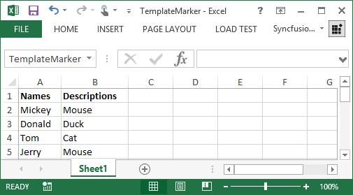

You can also add or insert template markers using XlsIO APIs as follows.

  

using (ExcelEngine excelEngine = new ExcelEngine())
{
  IWorkbook workbook = excelEngine.Excel.Workbooks.Open("Sample.xlsx");
  IWorksheet sheet = workbook.Worksheets[0];

  //Insert Simple marker
  sheet.Range["B2"].Text = "%Marker";

  //Insert marker which gets value of Author name
  sheet.Range["C2"].Text = "%Marker2.Worksheet.Workbook.Author";

  //Insert marker which gets cell address
  sheet.Range["H2"].Text = "%ArrayProperty.Cells.Address";

  //Create Template Marker Processor
  ITemplateMarkersProcessor marker = workbook.CreateTemplateMarkersProcessor();
  
  //Add collections to the marker variables where the name should match with input template
  marker.AddVariable("Marker", "First test of markers");
  marker.AddVariable("Marker2", sheet.Range["B2"]);
  marker.AddVariable("ArrayProperty", sheet.Range["B2:G2"]);

  //Process the markers in the template
  marker.ApplyMarkers();

  workbook.Version = ExcelVersion.Excel2013;
  workbook.SaveAs("TemplateMarker.xlsx");
}   




Using excelEngine As ExcelEngine = New ExcelEngine()
  Dim workbook As IWorkbook = excelEngine.Excel.Workbooks.Open("Sample.xlsx")
  IWorksheet sheet = workbook.Worksheets(0)

  'Insert Simple marker
  sheet.Range("B2").Text = "%Marker"

  'Insert marker which gets value of Author name
  sheet.Range("C2").Text = "%Marker2.Worksheet.Workbook.Author"

  'Insert marker which gets cell address
  sheet.Range("H2").Text = "%ArrayProperty.Cells.Address"

  'Create Template Marker Processor
  Dim marker As ITemplateMarkersProcessor = workbook.CreateTemplateMarkersProcessor()
  
  'Add collections to the marker variables where the name should match with input template
  marker.AddVariable("Marker", "First test of markers")
  marker.AddVariable("Marker2", sheet.Range("B2"))
  marker.AddVariable("ArrayProperty", sheet.Range("B2:G2"))

  'Process the markers in the template
  marker.ApplyMarkers()

  workbook.Version = ExcelVersion.Excel2013
  workbook.SaveAs("TemplateMarker.xlsx")
End Using




using (ExcelEngine excelEngine = new ExcelEngine())
{
  //Gets assembly
  Assembly assembly = typeof(App).GetTypeInfo().Assembly;

  //Gets input Excel document from embedded resource collection
  Stream inputStream = assembly.GetManifestResourceStream("Sample.xlsx");

  IWorkbook workbook = await excelEngine.Excel.Workbooks.OpenAsync(inputStream);
  IWorksheet sheet = workbook.Worksheets[0];

  //Insert Simple marker
  sheet.Range["B2"].Text = "%Marker";

  //Insert marker which gets value of Author name
  sheet.Range["C2"].Text = "%Marker2.Worksheet.Workbook.Author";

  //Insert marker which gets cell address
  sheet.Range["H2"].Text = "%ArrayProperty.Cells.Address";

  //Create Template Marker Processor
  ITemplateMarkersProcessor marker = workbook.CreateTemplateMarkersProcessor();
  
  //Add collections to the marker variables where the name should match with input template
  marker.AddVariable("Marker", "First test of markers");
  marker.AddVariable("Marker2", sheet.Range["B2"]);
  marker.AddVariable("ArrayProperty", sheet.Range["B2:G2"]);

  //Process the markers in the template
  marker.ApplyMarkers();

  workbook.Version = ExcelVersion.Excel2013;

  //Initializes FileSavePicker
  FileSavePicker savePicker = new FileSavePicker();
  savePicker.SuggestedStartLocation = PickerLocationId.Desktop;
  savePicker.SuggestedFileName = "TemplateMarker";
  savePicker.FileTypeChoices.Add("Excel Files", new List<string>() { ".xlsx" });

  //Creates a storage file from FileSavePicker
  StorageFile storageFile = await savePicker.PickSaveFileAsync();

  //Saves changes to the specified storage file
  await workbook.SaveAsAsync(storageFile);
}




using (ExcelEngine excelEngine = new ExcelEngine())
{
  IApplication application = excelEngine.Excel;

  FileStream fileStream = new FileStream("Sample.xlsx", FileMode.Open, FileAccess.Read);

  IWorkbook workbook = application.Workbooks.Open(fileStream);
  IWorksheet sheet = workbook.Worksheets[0];

  //Insert Simple marker
  sheet.Range["B2"].Text = "%Marker";

  //Insert marker which gets value of Author name
  sheet.Range["C2"].Text = "%Marker2.Worksheet.Workbook.Author";

  //Insert marker which gets cell address
  sheet.Range["H2"].Text = "%ArrayProperty.Cells.Address";

  //Create Template Marker Processor
  ITemplateMarkersProcessor marker = workbook.CreateTemplateMarkersProcessor();
  
  //Add collections to the marker variables where the name should match with input template
  marker.AddVariable("Marker", "First test of markers");
  marker.AddVariable("Marker2", sheet.Range["B2"]);
  marker.AddVariable("ArrayProperty", sheet.Range["B2:G2"]);

  //Process the markers in the template
  marker.ApplyMarkers();

  //Saving the workbook as stream
  workbook.Version = ExcelVersion.Excel2013;
  FileStream stream = new FileStream("TemplateMarker.xlsx", FileMode.Create, FileAccess.ReadWrite);
  workbook.SaveAs(stream);
  stream.Dispose();
}




using(ExcelEngine excelEngine = new ExcelEngine())
{
  IApplication application = excelEngine.Excel;
  
  //Gets assembly
  Assembly assembly = typeof(App).GetTypeInfo().Assembly;
             
  //Gets input Excel document from embedded resource collection
  Stream inputStream = assembly.GetManifestResourceStream("Sample.xlsx");
  
  IWorkbook workbook = application.Workbooks.Open(inputStream);
  IWorksheet sheet = workbook.Worksheets[0];

  //Insert Simple marker
  sheet.Range["B2"].Text = "%Marker";

  //Insert marker which gets value of Author name
  sheet.Range["C2"].Text = "%Marker2.Worksheet.Workbook.Author";

  //Insert marker which gets cell address
  sheet.Range["H2"].Text = "%ArrayProperty.Cells.Address";

  //Create Template Marker Processor
  ITemplateMarkersProcessor marker = workbook.CreateTemplateMarkersProcessor();
  
  //Add collections to the marker variables where the name should match with input template
  marker.AddVariable("Marker", "First test of markers");
  marker.AddVariable("Marker2", sheet.Range["B2"]);
  marker.AddVariable("ArrayProperty", sheet.Range["B2:G2"]);

  //Process the markers in the template
  marker.ApplyMarkers();

  //Saving the workbook as stream
  workbook.Version = ExcelVersion.Excel2013;
  MemoryStream outputStream = new MemoryStream();
  workbook.SaveAs(outputStream);

  //Save the stream as Excel document and view the saved document  
  
  //The operation in SaveAndView under Xamarin varies between Windows Phone, Android and iOS platforms. Please refer xlsio/xamarin section for respective code samples.
  if (Device.OS == TargetPlatform.WinPhone || Device.OS == TargetPlatform.Windows)
      await DependencyService.Get<ISaveWindowsPhone>().SaveAndView("TemplateMarker.xlsx", "application/msexcel", outputStream);
  else
      DependencyService.Get<ISave>().SaveAndView("TemplateMarker.xlsx", "application/msexcel", outputStream);

  //Dispose the input and output stream instances
  inputStream.Dispose();
  outputStream.Dispose();
}


  

## Bind from DataTable

**Syntax****:**

<table>
<tr>
<td>
%&lt;DataSource&gt;.&lt;FieldName&gt;   For example: %Products.ProductName  Where, “Products” is a data source which can be data tables, datasets, data readers and data views and ProductName is the field name or column name  </td></tr>
</table>
By default, DataTable values will be filled in the worksheet as a string format. You can detect data type and number format of DataTable values by using VariableTypeAction enumerator. To know more about the VariableTypeAction enumerator, please refer **VariableTypeAction** in API section.

 The following screenshot represents the input template which has a template marker.

The following code snippet illustrates how to detect data type and apply number format with template marker.

  

using(ExcelEngine excelEngine = new ExcelEngine())
{
  IWorkbook workbook = excelEngine.Excel.Workbooks.Open("TemplateMarker.xlsx");

  //Create Template Marker Processor
  ITemplateMarkersProcessor marker = workbook.CreateTemplateMarkersProcessor();

  DataTable reports = new DataTable();
  reports.Columns.Add("SalesPerson");
  reports.Columns.Add("FromDate", typeof(DateTime));
  reports.Columns.Add("ToDate", typeof(DateTime));
  reports.Rows.Add("Andy Bernard", new DateTime(2014, 09, 08), new DateTime(2014, 09, 11));
  reports.Rows.Add("Jim Halpert", new DateTime(2014, 09, 11), new DateTime(2014, 09, 15));
  reports.Rows.Add("Karen Fillippelli", new DateTime(2014, 09, 15), new DateTime(2014, 09, 20));
  reports.Rows.Add("Phyllis Lapin", new DateTime(2014, 09, 21), new DateTime(2014, 09, 25));
  reports.Rows.Add("Stanley Hudson", new DateTime(2014, 09, 26), new DateTime(2014, 09, 30));

  //Add collection to the marker variables where the name should match with input template
  //Detects number format in DateTable values
  marker.AddVariable("Reports", reports,VariableTypeAction.DetectNumberFormat);

  //Process the markers and detect the number format along with the data type in the template
  marker.ApplyMarkers();

  workbook.Version = ExcelVersion.Excel2013;
  workbook.SaveAs("TemplateMarkerWithFormat.xlsx");
}




using excelEngine As ExcelEngine = new ExcelEngine()
  Dim workbook As IWorkbook = excelEngine.Excel.Workbooks.Open("TemplateMarker.xlsx")

  'Create Template Marker Processor
  Dim marker As ITemplateMarkersProcessor = workbook.CreateTemplateMarkersProcessor()

  Dim reports As New DataTable()
  reports.Columns.Add("SalesPerson")
  reports.Columns.Add("FromDate", GetType(DateTime))
  reports.Columns.Add("ToDate", GetType(DateTime))
  reports.Rows.Add("Andy Bernard", New DateTime(2014, 9, 8), New DateTime(2014, 9, 11))
  reports.Rows.Add("Jim Halpert", New DateTime(2014, 9, 11), New DateTime(2014, 9, 15))
  reports.Rows.Add("Karen Fillippelli", New DateTime(2014, 9, 15), New DateTime(2014, 9, 20))
  reports.Rows.Add("Phyllis Lapin", New DateTime(2014, 9, 21), New DateTime(2014, 9, 25))
  reports.Rows.Add("Stanley Hudson", New DateTime(2014, 9, 26), New DateTime(2014, 9, 30))

  'Add collection to the marker variables where the name should match with input template
  'Detects number format in DateTable values
  marker.AddVariable("Reports", reports, VariableTypeAction.DetectNumberFormat)

  'Process the markers and detect the number format along with the data type in the template
  marker.ApplyMarkers()

  workbook.Version = ExcelVersion.Excel2013
  workbook.SaveAs("TemplateMarkerWithFormat.xlsx")
End Using




//XlsIO supports binding data from data table using template markers in Windows Forms, WPF, ASP.NET, ASP.NET MVC, and ASP.NET Core (2.0 onwards) platforms alone.



//Binding data from data table is supported only from ASP.NET Core 2.0
using (ExcelEngine excelEngine = new ExcelEngine())
{
  IApplication application = excelEngine.Excel;
  FileStream fileStream = new FileStream("TemplateMarker.xlsx", FileMode.Open, FileAccess.Read);
  IWorkbook workbook = application.Workbooks.Open(fileStream);

  //Create Template Marker Processor
  ITemplateMarkersProcessor marker = workbook.CreateTemplateMarkersProcessor();

  DataTable reports = new DataTable();
  reports.Columns.Add("SalesPerson");
  reports.Columns.Add("FromDate", typeof(DateTime));
  reports.Columns.Add("ToDate", typeof(DateTime));
  reports.Rows.Add("Andy Bernard", new DateTime(2014, 09, 08), new DateTime(2014, 09, 11));
  reports.Rows.Add("Jim Halpert", new DateTime(2014, 09, 11), new DateTime(2014, 09, 15));
  reports.Rows.Add("Karen Fillippelli", new DateTime(2014, 09, 15), new DateTime(2014, 09, 20));
  reports.Rows.Add("Phyllis Lapin", new DateTime(2014, 09, 21), new DateTime(2014, 09, 25));
  reports.Rows.Add("Stanley Hudson", new DateTime(2014, 09, 26), new DateTime(2014, 09, 30));
  
  //Add collection to the marker variables where the name should match with input template  
  //Detects number format in DateTable values
  marker.AddVariable("Reports", reports, VariableTypeAction.DetectNumberFormat);

  //Process the markers and detect the number format along with the data type in the template
  marker.ApplyMarkers();

  //Saving the workbook as stream
  workbook.Version = ExcelVersion.Excel2013;

  FileStream stream = new FileStream("TemplateMarkerWithFormat.xlsx", FileMode.Create, FileAccess.ReadWrite);
  workbook.SaveAs(stream);
  stream.Dispose();
}




//XlsIO supports binding data from data table using template markers in Windows Forms, WPF, ASP.NET, ASP.NET MVC, and ASP.NET Core (2.0 onwards) platforms alone.

  

A complete working example to bind data from data table to template marker in C# is present on [this GitHub page](https://github.com/SyncfusionExamples/XlsIO-Examples/tree/master/Import%20Data%20to%20Template/Import%20Data%20Table).

The following screenshot represents an Excel file in which the data type is detected and then number format is applied.

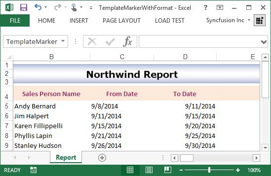

## Bind from Collection Objects with images

You can generate reports more appealingly with image support in template markers. The possible image formats are as follows:

* GIF
* JPEG
* PNG
* BMP
* TIFF

XlsIO detects the property as image when its type is System.Drawing.Image or byte []. The image can be formatted using the following arguments.

<table>
<tr>
<th>
No  </th><th>
Image arguments  </th><th>
Description  </th></tr>
<tr>
<td>
1  </td><td>
No argument Ex: %Reports.Image;  </td><td>
Image is applied with a default size (50x50 pixels) and position (Top-Left).  </td></tr>
<tr>
<td>
2  </td><td>
fittocell Ex: %Reports.Image;fittocell  </td><td>
The image is applied to cell width and height.  </td></tr>
<tr>
<td>
3  </td><td>
size:width,height  Ex:  %Reports.Image;size:60  (or)  %Reports.Image;size:60,60  (or)  %Reports.Image;size:60,auto  (or)  %Reports.Image;size:auto,60  (or)  %Reports.Image;size:auto,auto  </td><td>
Image is applied to the specified size (width, height).  Height parameter is optional. Value of width is applied when height is not specified.    You can specify either width or height value as "auto" to set ratio value of other size value.  If both width and height value is set as "auto" then the Image is applied to the original size</td></tr>
<tr>
<td>
4  </td><td>
position:position  Ex:  %Reports.Image;position:middle-center  (or)  %Reports.Image;position:right   </td><td>
Image is positioned (top-left, top-center, etc.,) within the cell.  </td></tr>
</table>
In the following example, a marker is added for merging images. Data source and property name is specified (%Reports.Image;) for image also. 

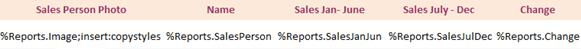

__Marker__ __added__ __for__ __merging__ __images__

N> Image can be used in array, DataTable, and collection objects.

Different positions of the image are maintained internally in the ImageVerticalPosition and ImageHorizontalPosition enumerators.  To learn more about this, refer to the **ImageVerticalPosition** and **ImageHorizontalPosition** enumerators respectively in API section.

The output of all the image insertion options with input templates are as follows.

**Default** **image** **input** **and** **output**

Input template

Generated output

**Image** **with** **FitToCell** **attribute**

Input template

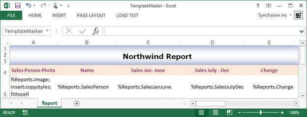

Generated output

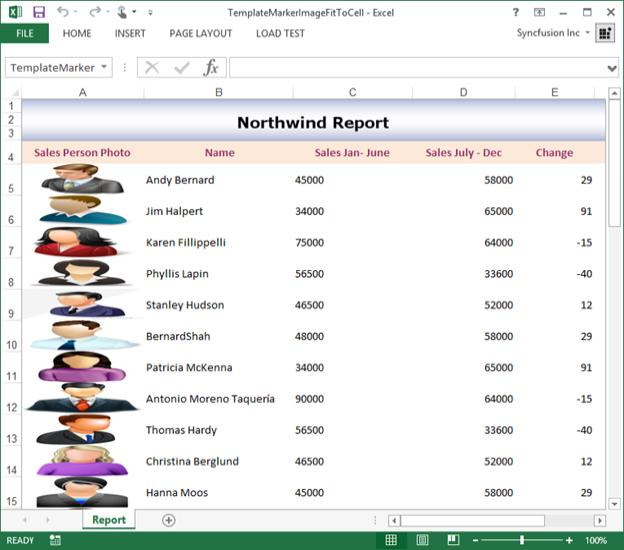

**Image** **with** **Size**

Input template

Generated output

**Image** **with** **Position**

Input template

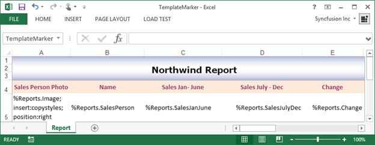

Generated output

**Image** **with** **position** **and** **size**

Input template

Generated output

You can also refer to the [Template based data filling using Template Markers](/file-formats/xlsio/getting-started#template-based-data-filling-using-template-markers) section in [Getting Started](/file-formats/xlsio/getting-started) for the sample regarding template marker with images.

## Bind from Nested Collection Objects with import data and group options

You can bind the data from Nested collection objects with import data options and group options.

The import data options are:

* Default
* Merge
* Repeat

The import data group options are:

* Collapse Group
* Expand Group

The following code snippet illustrates how to import data from nested collection objects with template marker.

  

using (ExcelEngine excelEngine = new ExcelEngine())
{
    IApplication application = excelEngine.Excel;
    IWorkbook workbook = application.Workbooks.Open("TemplateMarker.xlsx")

    //Create Template Marker Processor
    ITemplateMarkersProcessor marker = workbook.CreateTemplateMarkersProcessor();

    //Add collection to the marker variables where the name should match with input template
    marker.AddVariable("Customer", GetSalesReports());

    //Process the markers in the template
    marker.ApplyMarkers();

    workbook.SaveAs("TemplateMarkerNestedCollection.xlsx");
}



using excelEngine As ExcelEngine = new ExcelEngine()
  Dim workbook As IWorkbook = excelEngine.Excel.Workbooks.Open("TemplateMarker.xlsx")

  'Create Template Marker Processor
  Dim marker As ITemplateMarkersProcessor = workbook.CreateTemplateMarkersProcessor()
 
  'Add collection to the marker variables where the name should match with input template
   marker.AddVariable("Customer", GetSalesReports())

  'Process the markers and detect the number format along with the data type in the template
  marker.ApplyMarkers()

  workbook.SaveAs("TemplateMarkerNestedCollection.xlsx");
End Using




using (ExcelEngine excelEngine = new ExcelEngine())
{
  IApplication application = excelEngine.Excel;

  //Instantiates the File Picker
  FileOpenPicker openPicker = new FileOpenPicker();
  openPicker.SuggestedStartLocation = PickerLocationId.Desktop;
  openPicker.FileTypeFilter.Add(".xlsx");
  openPicker.FileTypeFilter.Add(".xls");
  StorageFile openFile = await openPicker.PickSingleFileAsync();

  //Opens the workbook
  IWorkbook workbook = await application.Workbooks.OpenAsync(openFile);
  
  //Create Template Marker Processor
  ITemplateMarkersProcessor marker = workbook.CreateTemplateMarkersProcessor();

  //Add collection to the marker variables where the name should match with input template
  marker.AddVariable("Customer", GetSalesReports());

  //Process the markers in the template
  marker.ApplyMarkers();

  //Initializes FileSavePicker
  FileSavePicker savePicker = new FileSavePicker();
  savePicker.SuggestedStartLocation = PickerLocationId.Desktop;
  savePicker.SuggestedFileName = "TemplateMarkerNestedCollection";
  savePicker.FileTypeChoices.Add("Excel Files", new List<string>() { ".xlsx" });

  //Creates a storage file from FileSavePicker
  StorageFile storageFile = await savePicker.PickSaveFileAsync();

  //Saves changes to the specified storage file
  await workbook.SaveAsAsync(storageFile);
}



//Binding data from data table is supported only from ASP.NET Core 2.0
using (ExcelEngine excelEngine = new ExcelEngine())
{
  IApplication application = excelEngine.Excel;
  FileStream fileStream = new FileStream("TemplateMarker.xlsx", FileMode.Open, FileAccess.Read);
  IWorkbook workbook = application.Workbooks.Open(fileStream);

  //Create Template Marker Processor
    ITemplateMarkersProcessor marker = workbook.CreateTemplateMarkersProcessor();

  //Add collection to the marker variables where the name should match with input template
  marker.AddVariable("Customer", GetSalesReports());

  //Process the markers in the template
  marker.ApplyMarkers();

  //Saving the workbook as stream

  FileStream stream = new FileStream("TemplateMarkerNestedCollection.xlsx", FileMode.Create, FileAccess.ReadWrite);
  workbook.SaveAs(stream);
  stream.Dispose();
}




using (ExcelEngine excelEngine = new ExcelEngine())
{
  IApplication application = excelEngine.Excel;
  application.DefaultVersion = ExcelVersion.Excel2013;
  Assembly assembly = typeof(App).GetTypeInfo().Assembly;
  Stream inputStream = assembly.GetManifestResourceStream("SampleBrowser.XlsIO.Samples.Template.TemplateMarker.xlsx");
  IWorkbook workbook = application.Workbooks.Open(inputStream);

  //Create Template Marker Processor
  ITemplateMarkersProcessor marker = workbook.CreateTemplateMarkersProcessor();

  //Add collection to the marker variables where the name should match with input template
  marker.AddVariable("Customer", GetSalesReports());

  //Process the markers in the template
  marker.ApplyMarkers();

  //Saving the workbook as stream
  MemoryStream stream = new MemoryStream();
  workbook.SaveAs(stream);

  stream.Position = 0;

  //Save the document as file and view the saved document

  //The operation in SaveAndView under Xamarin varies between Windows Phone, Android and iOS platforms. Please refer xlsio/xamarin section for respective code samples.

  if (Device.OS == TargetPlatform.WinPhone || Device.OS == TargetPlatform.Windows)
  {
	Xamarin.Forms.DependencyService.Get<ISaveWindowsPhone>().SaveAndView("TemplateMarkerNestedCollection.xlsx", "application/msexcel", stream);
  }
  else
  {
	Xamarin.Forms.DependencyService.Get<ISave>().SaveAndView("TemplateMarkerNestedCollection.xlsx", "application/msexcel", stream);
  }
}

  

The following code snippet provides supporting methods and classes for the previous code.

  

//Gets a list of sales reports
public static List<Customer> GetSalesReports()
{
    List<Customer> reports = new List<Customer>();

    List<Order> orders = new List<Order>();
    orders.Add(new Order(1408, 451.75));
    orders.Add(new Order(1278, 340.00));
    orders.Add(new Order(1123, 290.50));

    Customer c1 = new Customer(002107, "Andy Bernard", 45);
    c1.Orders = orders;
    Customer c2 = new Customer(011564, "Jim Halpert", 34);
    c2.Orders = orders;
    Customer c3 = new Customer(002097, "Karen Fillippelli", 35);
    c3.Orders = orders;
    Customer c4 = new Customer(001846, "Phyllis Lapin", 37);
    c4.Orders = orders;
    Customer c5 = new Customer(012167, "Stanley Hudson", 41);
    c5.Orders = orders;

    reports.Add(c1);
    reports.Add(c2);
    reports.Add(c3);
    reports.Add(c4);
    reports.Add(c5);

    return reports;
}

//Customer details
public partial class Customer
{
    public int Id { get; set; }
    public string Name { get; set; }
    public int Age { get; set; }
    public IList<Order> Orders { get; set; }
    public Customer(int id, string name, int age)
    {
        Id = id;
        Name = name;
        Age = age;
    }
}
//Order details
public partial class Order
{
    public int Order_Id { get; set; }
    public double Price { get; set; }

    public Order(int id, double price)
    {
        Order_Id = id;
        Price = price;
    }
}



'Gets a list of sales reports
Public Shared Function GetSalesReports() As List(Of Customer)
    Dim reports As List(Of Customer) = New List(Of Customer)()
    Dim orders As List(Of Order) = New List(Of Order)()
    orders.Add(New Order(1408, 451.75))
    orders.Add(New Order(1278, 340.00))
    orders.Add(New Order(1123, 290.50))
    Dim c1 As Customer = New Customer(002107, "Andy Bernard", 45)
    c1.Orders = orders
    Dim c2 As Customer = New Customer(011564, "Jim Halpert", 34)
    c2.Orders = orders
    Dim c3 As Customer = New Customer(002097, "Karen Fillippelli", 35)
    c3.Orders = orders
    Dim c4 As Customer = New Customer(001846, "Phyllis Lapin", 37)
    c4.Orders = orders
    Dim c5 As Customer = New Customer(012167, "Stanley Hudson", 41)
    c5.Orders = orders
    reports.Add(c1)
    reports.Add(c2)
    reports.Add(c3)
    reports.Add(c4)
    reports.Add(c5)
    Return reports
End Function

'Customer details
Public Class Customer
    Public Property Id As Integer
    Public Property Name As String
    Public Property Age As Integer
    Public Property Orders As IList(Of Order)

    Public Sub New(ByVal id As Integer, ByVal name As String, ByVal age As Integer)
        Id = id
        Name = name
        Age = age
    End Sub
End Class
'Order details
Public Class Order
    Public Property Order_Id As Integer
    Public Property Price As Double

    Public Sub New(ByVal id As Integer, ByVal price As Double)
        Order_Id = id
        Price = price
    End Sub
End Class



//Gets a list of sales reports
public static List<Customer> GetSalesReports()
{
    List<Customer> reports = new List<Customer>();

    List<Order> orders = new List<Order>();
    orders.Add(new Order(1408, 451.75));
    orders.Add(new Order(1278, 340.00));
    orders.Add(new Order(1123, 290.50));

    Customer c1 = new Customer(002107, "Andy Bernard", 45);
    c1.Orders = orders;
    Customer c2 = new Customer(011564, "Jim Halpert", 34);
    c2.Orders = orders;
    Customer c3 = new Customer(002097, "Karen Fillippelli", 35);
    c3.Orders = orders;
    Customer c4 = new Customer(001846, "Phyllis Lapin", 37);
    c4.Orders = orders;
    Customer c5 = new Customer(012167, "Stanley Hudson", 41);
    c5.Orders = orders;

    reports.Add(c1);
    reports.Add(c2);
    reports.Add(c3);
    reports.Add(c4);
    reports.Add(c5);

    return reports;
}

//Customer details
public partial class Customer
{
    public int Id { get; set; }
    public string Name { get; set; }
    public int Age { get; set; }
    public IList<Order> Orders { get; set; }
    public Customer(int id, string name, int age)
    {
        Id = id;
        Name = name;
        Age = age;
    }
}
//Order details
public partial class Order
{
    public int Order_Id { get; set; }
    public double Price { get; set; }

    public Order(int id, double price)
    {
        Order_Id = id;
        Price = price;
    }
}



//Gets a list of sales reports
public static List<Customer> GetSalesReports()
{
    List<Customer> reports = new List<Customer>();

    List<Order> orders = new List<Order>();
    orders.Add(new Order(1408, 451.75));
    orders.Add(new Order(1278, 340.00));
    orders.Add(new Order(1123, 290.50));

    Customer c1 = new Customer(002107, "Andy Bernard", 45);
    c1.Orders = orders;
    Customer c2 = new Customer(011564, "Jim Halpert", 34);
    c2.Orders = orders;
    Customer c3 = new Customer(002097, "Karen Fillippelli", 35);
    c3.Orders = orders;
    Customer c4 = new Customer(001846, "Phyllis Lapin", 37);
    c4.Orders = orders;
    Customer c5 = new Customer(012167, "Stanley Hudson", 41);
    c5.Orders = orders;

    reports.Add(c1);
    reports.Add(c2);
    reports.Add(c3);
    reports.Add(c4);
    reports.Add(c5);

    return reports;
}

//Customer details
public partial class Customer
{
    public int Id { get; set; }
    public string Name { get; set; }
    public int Age { get; set; }
    public IList<Order> Orders { get; set; }
    public Customer(int id, string name, int age)
    {
        Id = id;
        Name = name;
        Age = age;
    }
}
//Order details
public partial class Order
{
    public int Order_Id { get; set; }
    public double Price { get; set; }

    public Order(int id, double price)
    {
        Order_Id = id;
        Price = price;
    }
}



//Gets a list of sales reports
public static List<Customer> GetSalesReports()
{
    List<Customer> reports = new List<Customer>();

    List<Order> orders = new List<Order>();
    orders.Add(new Order(1408, 451.75));
    orders.Add(new Order(1278, 340.00));
    orders.Add(new Order(1123, 290.50));

    Customer c1 = new Customer(002107, "Andy Bernard", 45);
    c1.Orders = orders;
    Customer c2 = new Customer(011564, "Jim Halpert", 34);
    c2.Orders = orders;
    Customer c3 = new Customer(002097, "Karen Fillippelli", 35);
    c3.Orders = orders;
    Customer c4 = new Customer(001846, "Phyllis Lapin", 37);
    c4.Orders = orders;
    Customer c5 = new Customer(012167, "Stanley Hudson", 41);
    c5.Orders = orders;

    reports.Add(c1);
    reports.Add(c2);
    reports.Add(c3);
    reports.Add(c4);
    reports.Add(c5);

    return reports;
}

//Customer details
public partial class Customer
{
    public int Id { get; set; }
    public string Name { get; set; }
    public int Age { get; set; }
    public IList<Order> Orders { get; set; }
    public Customer(int id, string name, int age)
    {
        Id = id;
        Name = name;
        Age = age;
    }
}
//Order details
public partial class Order
{
    public int Order_Id { get; set; }
    public double Price { get; set; }

    public Order(int id, double price)
    {
        Order_Id = id;
        Price = price;
    }
}

 

A complete working example to bind data from nested collections to template marker in C# is present on [this GitHub page](https://github.com/SyncfusionExamples/XlsIO-Examples/tree/master/Import%20Data%20to%20Template/Import%20Nested%20Collection).

The output of all the import data and group options with input templates are as follows.

**Default** **option** **input** **and** **output**

Input template

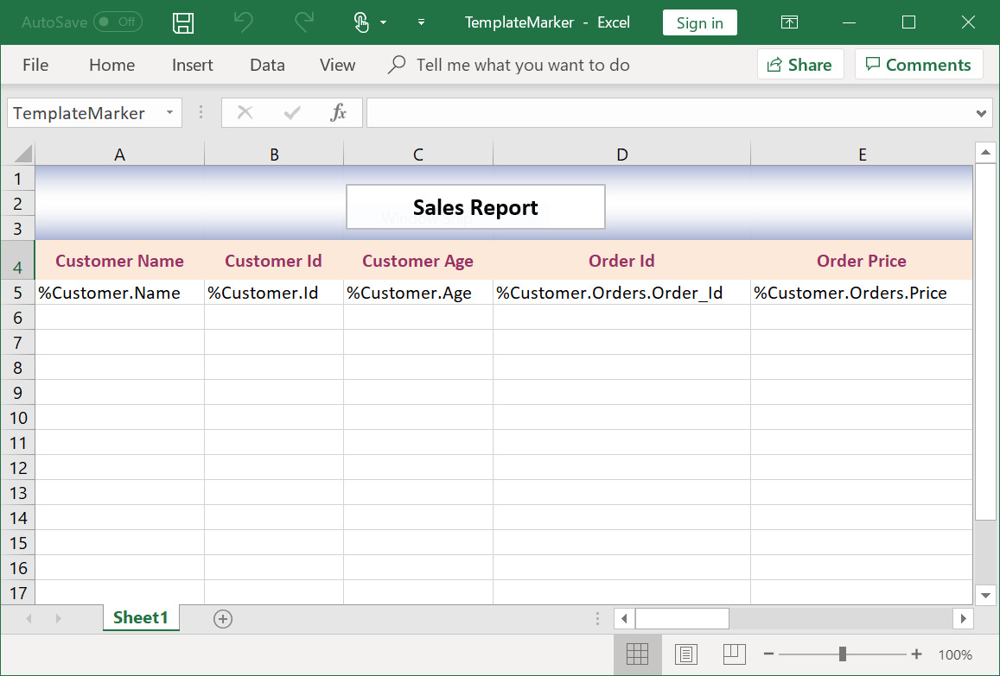

Generated output

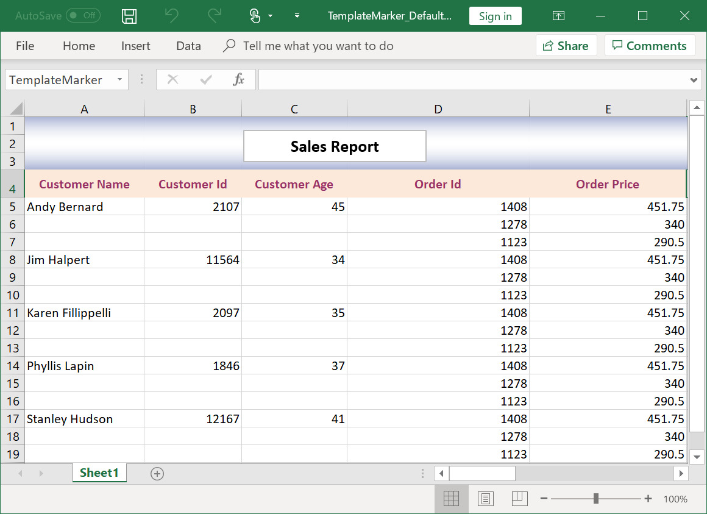

**Merge** **option** **input** **and** **output**

Input template

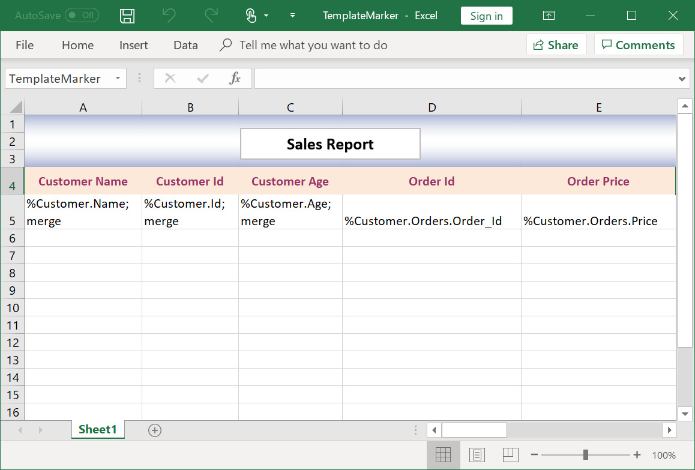

Generated output

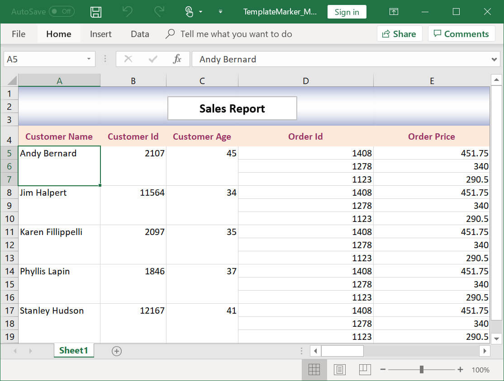

**Repeat** **option** **input** **and** **output**

Input template

Generated output

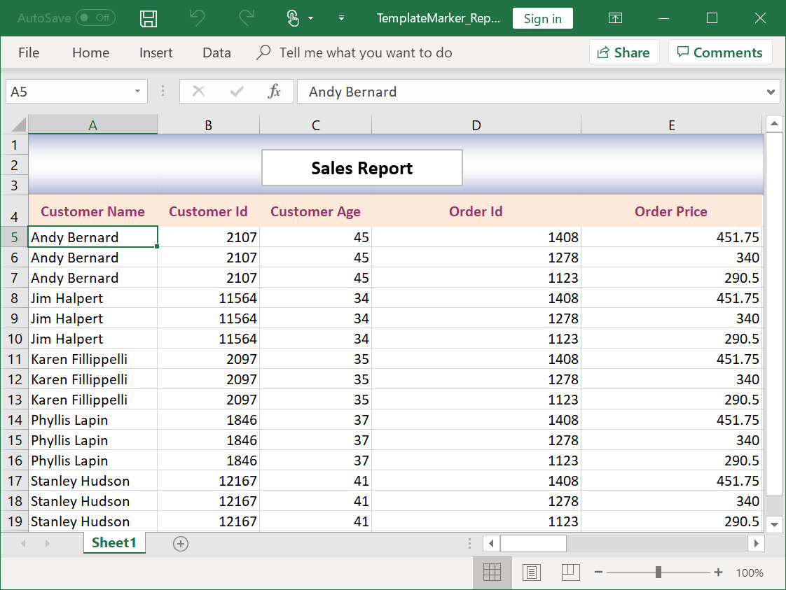

**Collapse** **group** **option** **input** **and** **output**

Input template

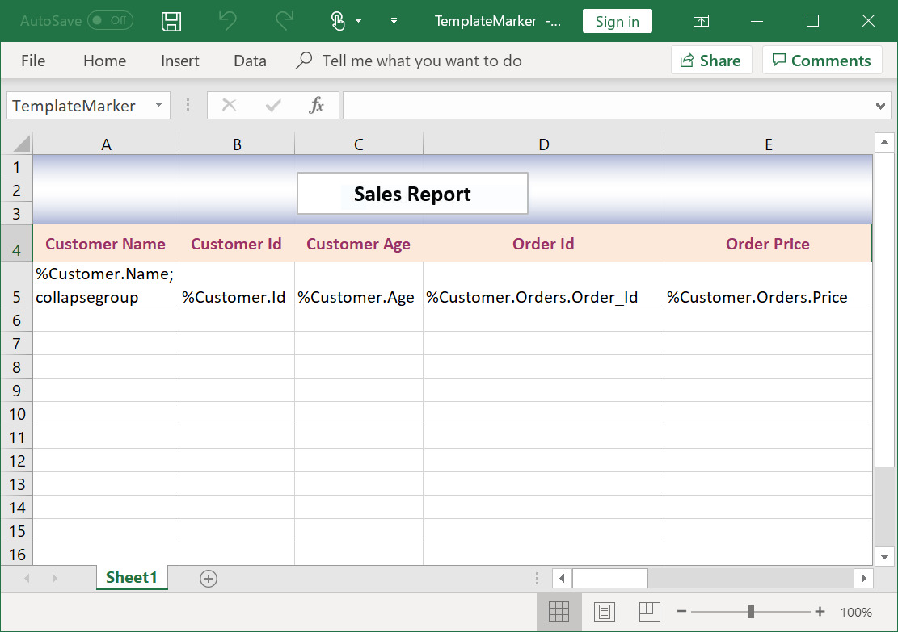

Generated output

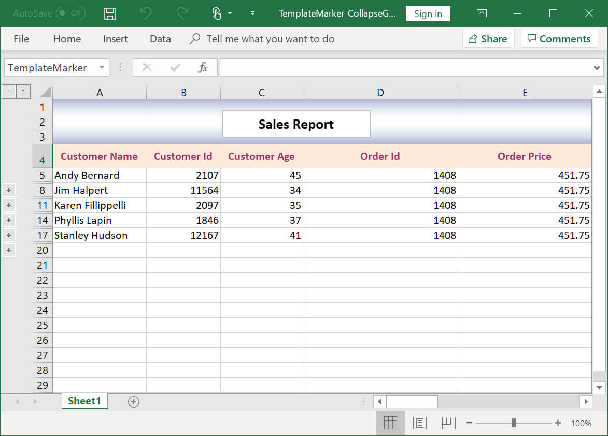

**Expand** **group** **option** **input** **and** **output**

Input template

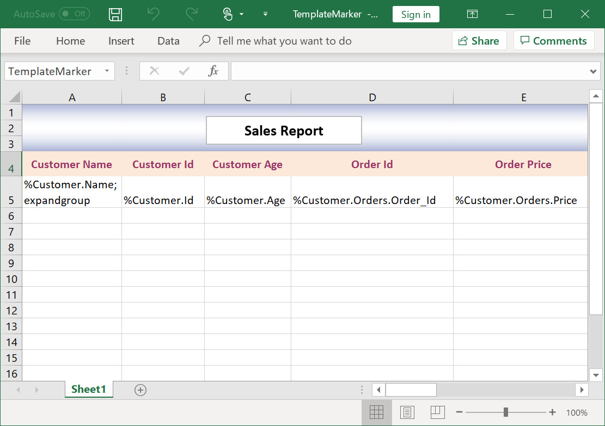

Generated output

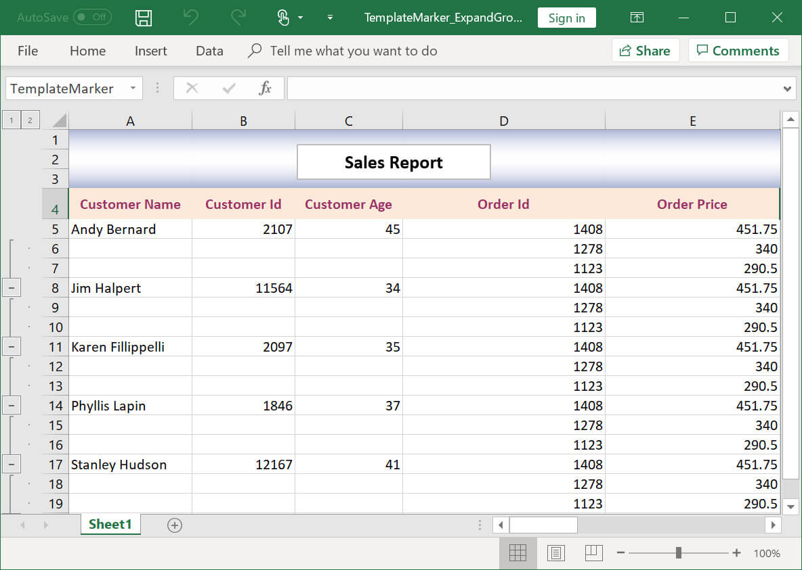

## Template marker with conditional formatting

You can create or apply conditional format to the template marker range.  

The following screenshot represents the input template, which has a template marker.

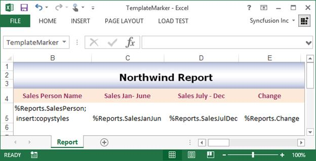

The following code sample illustrates how to create or apply conditional format to the marker.

  

using (ExcelEngine excelEngine = new ExcelEngine())
{
  #region Initialize Workbook

  IWorkbook workbook = excelEngine.Excel.Workbooks.Open("TemplateMarker.xlsx");
  IWorksheet worksheet = workbook.Worksheets[0];

  #endregion

  #region Create Template Marker

  //Create Template Marker Processor
  ITemplateMarkersProcessor marker = workbook.CreateTemplateMarkersProcessor();

  IConditionalFormats conditionalFormats = marker.CreateConditionalFormats(worksheet["C5"]);

  #region Data Bar

  //Apply markers using Formula
  IConditionalFormat condition = conditionalFormats.AddCondition();

  //Set Data bar and icon set for the same cell
  //Set the format type
  condition.FormatType = ExcelCFType.DataBar;

  IDataBar dataBar = condition.DataBar;

  //Set the constraint
  dataBar.MinPoint.Type = ConditionValueType.LowestValue;
  dataBar.MinPoint.Value = "0";
  dataBar.MaxPoint.Type = ConditionValueType.HighestValue;
  dataBar.MaxPoint.Value = "0";

  //Set color for Bar
  dataBar.BarColor = Color.FromArgb(156, 208, 243);

  //Hide the value in data bar
  dataBar.ShowValue = false;

  #endregion

  #region IconSet

  condition = conditionalFormats.AddCondition();
  condition.FormatType = ExcelCFType.IconSet;

  IIconSet iconSet = condition.IconSet;
  iconSet.IconSet = ExcelIconSetType.FourRating;
  iconSet.IconCriteria[0].Type = ConditionValueType.LowestValue;
  iconSet.IconCriteria[0].Value = "0";
  iconSet.IconCriteria[1].Type = ConditionValueType.HighestValue;
  iconSet.IconCriteria[1].Value = "0";
  iconSet.ShowIconOnly = true;

  #endregion

  conditionalFormats = marker.CreateConditionalFormats(worksheet["D5"]);

  #region Color Scale

  condition = conditionalFormats.AddCondition();
  condition.FormatType = ExcelCFType.ColorScale;

  IColorScale colorScale = condition.ColorScale;

  //Sets 3 - color scale
  colorScale.SetConditionCount(3);

  colorScale.Criteria[0].FormatColorRGB = Color.FromArgb(230, 197, 218);
  colorScale.Criteria[0].Type = ConditionValueType.LowestValue;
  colorScale.Criteria[0].Value = "0";

  colorScale.Criteria[1].FormatColorRGB = Color.FromArgb(244, 210, 178);
  colorScale.Criteria[1].Type = ConditionValueType.Percentile;
  colorScale.Criteria[1].Value = "50";

  colorScale.Criteria[2].FormatColorRGB = Color.FromArgb(245, 247, 171);
  colorScale.Criteria[2].Type = ConditionValueType.HighestValue;
  colorScale.Criteria[2].Value = "0";

  #endregion

  conditionalFormats = marker.CreateConditionalFormats(worksheet["E5"]);

  #region IconSet

  condition = conditionalFormats.AddCondition();
  condition.FormatType = ExcelCFType.IconSet;

  iconSet = condition.IconSet;
  iconSet.IconSet = ExcelIconSetType.ThreeSymbols;

  iconSet.IconCriteria[0].Type = ConditionValueType.LowestValue;
  iconSet.IconCriteria[0].Value = "0";

  iconSet.IconCriteria[1].Type = ConditionValueType.HighestValue;
  iconSet.IconCriteria[1].Value = "0";

  iconSet.ShowIconOnly = false;

  #endregion

  //Add collection to the marker variables where the name should match with input template
  marker.AddVariable("Reports", GetSalesReports());

  //Process the markers in the template
  marker.ApplyMarkers();

  #endregion

  #region Save the Workbook

  workbook.Version = ExcelVersion.Excel2013;
  workbook.SaveAs("TemplateMarkerCF.xlsx");

  #endregion
}




'Region "Initialize Workbook"

using excelEngine As ExcelEngine = new ExcelEngine()
  Dim workbook As IWorkbook = excelEngine.Excel.Workbooks.Open("TemplateMarker.xlsx")
  Dim worksheet As IWorksheet = workbook.Worksheets(0)

  'End Region

  'Region "Create Template Marker"

  'Create Template Marker Processor
  Dim marker As ITemplateMarkersProcessor = workbook.CreateTemplateMarkersProcessor()

  Dim conditionalFormats As IConditionalFormats = marker.CreateConditionalFormats(worksheet("C5"))

  'Region "Data Bar"

  'Apply markers using Formula
  Dim condition As IConditionalFormat = conditionalFormats.AddCondition()

  'Set Data bar and icon set for the same cell
  'Set the format type
  condition.FormatType = ExcelCFType.DataBar

  Dim dataBar As IDataBar = condition.DataBar

  'Set the constraint
  dataBar.MinPoint.Type = ConditionValueType.LowestValue
  dataBar.MinPoint.Value = "0"
  dataBar.MaxPoint.Type = ConditionValueType.HighestValue
  dataBar.MaxPoint.Value = "0"

  'Set color for Bar
  dataBar.BarColor = Color.FromArgb(156, 208, 243)

  'Hide the value in data bar
  dataBar.ShowValue = False

  'End Region

  'Region "IconSet"

  condition = conditionalFormats.AddCondition()
  condition.FormatType = ExcelCFType.IconSet

  Dim iconSet As IIconSet = condition.IconSet
  iconSet.IconSet = ExcelIconSetType.FourRating

  iconSet.IconCriteria(0).Type = ConditionValueType.LowestValue
  iconSet.IconCriteria(0).Value = "0"

  iconSet.IconCriteria(1).Type = ConditionValueType.HighestValue
  iconSet.IconCriteria(1).Value = "0"

  iconSet.ShowIconOnly = True

  'End Region

  conditionalFormats = marker.CreateConditionalFormats(worksheet("D5"))

  'Region "Color Scale"

  condition = conditionalFormats.AddCondition()
  condition.FormatType = ExcelCFType.ColorScale

  Dim colorScale As IColorScale = condition.ColorScale

  'Sets 3 - color scale
  colorScale.SetConditionCount(3)

  colorScale.Criteria(0).FormatColorRGB = Color.FromArgb(230, 197, 218)
  colorScale.Criteria(0).Type = ConditionValueType.LowestValue
  colorScale.Criteria(0).Value = "0"

  colorScale.Criteria(1).FormatColorRGB = Color.FromArgb(244, 210, 178)
  colorScale.Criteria(1).Type = ConditionValueType.Percentile
  colorScale.Criteria(1).Value = "50"

  colorScale.Criteria(2).FormatColorRGB = Color.FromArgb(245, 247, 171)
  colorScale.Criteria(2).Type = ConditionValueType.HighestValue
  colorScale.Criteria(2).Value = "0"

  'End Region

  conditionalFormats = marker.CreateConditionalFormats(worksheet("E5"))

  'Region "IconSet"

  condition = conditionalFormats.AddCondition()
  condition.FormatType = ExcelCFType.IconSet

  iconSet = condition.IconSet
  iconSet.IconSet = ExcelIconSetType.ThreeSymbols

  iconSet.IconCriteria(0).Type = ConditionValueType.LowestValue
  iconSet.IconCriteria(0).Value = "0"

  iconSet.IconCriteria(1).Type = ConditionValueType.HighestValue
  iconSet.IconCriteria(1).Value = "0"

  iconSet.ShowIconOnly = False

  'End Region

  'Add collection to the marker variables where the name should match with input template
  marker.AddVariable("Reports", GetSalesReports())

  'Process the markers in the template
  marker.ApplyMarkers()

  'End Region

  'Region "Save the Workbook"

  workbook.Version = ExcelVersion.Excel2013
  workbook.SaveAs("TemplateMarkerCF.xlsx")

  'End Region
End Using



using (ExcelEngine excelEngine = new ExcelEngine())
{
  //Gets assembly
  Assembly assembly = typeof(App).GetTypeInfo().Assembly;

  //Gets input Excel document from embedded resource collection
  Stream inputStream = assembly.GetManifestResourceStream("TemplateMarker.TemplateMarker.xlsx");

  IWorkbook workbook = await excelEngine.Excel.Workbooks.OpenAsync(inputStream);
  IWorksheet worksheet = workbook.Worksheets[0];

  #endregion

  #region Create Template Marker

  //Create Template Marker Processor
  ITemplateMarkersProcessor marker = workbook.CreateTemplateMarkersProcessor();

  IConditionalFormats conditionalFormats = marker.CreateConditionalFormats(worksheet["C5"]);

  #region Data Bar

  //Apply markers using Formula
  IConditionalFormat condition = conditionalFormats.AddCondition();

  //Set Data bar and icon set for the same cell
  //Set the format type
  condition.FormatType = ExcelCFType.DataBar;

  IDataBar dataBar = condition.DataBar;

  //Set the constraint
  dataBar.MinPoint.Type = ConditionValueType.LowestValue;
  dataBar.MinPoint.Value = "0";
  dataBar.MaxPoint.Type = ConditionValueType.HighestValue;
  dataBar.MaxPoint.Value = "0";

  //Set color for Bar
  dataBar.BarColor = Color.FromArgb(156, 208, 243, 255);

  //Hide the value in data bar
  dataBar.ShowValue = false;

  #endregion

  #region IconSet

  condition = conditionalFormats.AddCondition();
  condition.FormatType = ExcelCFType.IconSet;

  IIconSet iconSet = condition.IconSet;
  iconSet.IconSet = ExcelIconSetType.FourRating;
  iconSet.IconCriteria[0].Type = ConditionValueType.LowestValue;
  iconSet.IconCriteria[0].Value = "0";
  iconSet.IconCriteria[1].Type = ConditionValueType.HighestValue;
  iconSet.IconCriteria[1].Value = "0";
  iconSet.ShowIconOnly = true;

  #endregion

  conditionalFormats = marker.CreateConditionalFormats(worksheet["D5"]);

  #region Color Scale

  condition = conditionalFormats.AddCondition();
  condition.FormatType = ExcelCFType.ColorScale;

  IColorScale colorScale = condition.ColorScale;

  //Sets 3 - color scale
  colorScale.SetConditionCount(3);

  colorScale.Criteria[0].FormatColorRGB = Color.FromArgb(230, 197, 218, 255);
  colorScale.Criteria[0].Type = ConditionValueType.LowestValue;
  colorScale.Criteria[0].Value = "0";

  colorScale.Criteria[1].FormatColorRGB = Color.FromArgb(244, 210, 178, 255);
  colorScale.Criteria[1].Type = ConditionValueType.Percentile;
  colorScale.Criteria[1].Value = "50";

  colorScale.Criteria[2].FormatColorRGB = Color.FromArgb(245, 247, 171, 255);
  colorScale.Criteria[2].Type = ConditionValueType.HighestValue;
  colorScale.Criteria[2].Value = "0";

  #endregion

  conditionalFormats = marker.CreateConditionalFormats(worksheet["E5"]);

  #region IconSet

  condition = conditionalFormats.AddCondition();
  condition.FormatType = ExcelCFType.IconSet;

  iconSet = condition.IconSet;
  iconSet.IconSet = ExcelIconSetType.ThreeSymbols;

  iconSet.IconCriteria[0].Type = ConditionValueType.LowestValue;
  iconSet.IconCriteria[0].Value = "0";

  iconSet.IconCriteria[1].Type = ConditionValueType.HighestValue;
  iconSet.IconCriteria[1].Value = "0";

  iconSet.ShowIconOnly = false;

  #endregion

  //Add collection to the marker variables where the name should match with input template
  marker.AddVariable("Reports", GetSalesReports());

  //Process the markers in the template
  marker.ApplyMarkers();

  #endregion

  #region Save the Workbook

  workbook.Version = ExcelVersion.Excel2013;

  //Initializes FileSavePicker
  FileSavePicker savePicker = new FileSavePicker();
  savePicker.SuggestedStartLocation = PickerLocationId.Desktop;
  savePicker.SuggestedFileName = "TemplateMarkerCF";
  savePicker.FileTypeChoices.Add("Excel Files", new List<string>() { ".xlsx" });

  //Creates a storage file from FileSavePicker
  StorageFile storageFile = await savePicker.PickSaveFileAsync();

  //Saves changes to the specified storage file
  await workbook.SaveAsAsync(storageFile);

  #endregion
}




using (ExcelEngine excelEngine = new ExcelEngine())
{
  #region Initialize Workbook

  FileStream fileStream = new FileStream("TemplateMarker.xlsx", FileMode.Open, FileAccess.Read);

  IWorkbook workbook = excelEngine.Excel.Workbooks.Open(fileStream);
  IWorksheet worksheet = workbook.Worksheets[0];

  #endregion

  #region Create Template Marker

  //Create Template Marker Processor
  ITemplateMarkersProcessor marker = workbook.CreateTemplateMarkersProcessor();

  IConditionalFormats conditionalFormats = marker.CreateConditionalFormats(worksheet["C5"]);

  #endregion

  #region Data Bar

  //Apply markers using Formula
  IConditionalFormat condition = conditionalFormats.AddCondition();

  //Set Data bar and icon set for the same cell
  //Set the format type
  condition.FormatType = ExcelCFType.DataBar;

  IDataBar dataBar = condition.DataBar;

  //Set the constraint
  dataBar.MinPoint.Type = ConditionValueType.LowestValue;
  dataBar.MinPoint.Value = "0";
  dataBar.MaxPoint.Type = ConditionValueType.HighestValue;
  dataBar.MaxPoint.Value = "0";

  //Set color for Bar
  dataBar.BarColor = Color.FromArgb(156, 208, 243);

  //Hide the value in data bar
  dataBar.ShowValue = false;

  #endregion

  #region IconSet

  condition = conditionalFormats.AddCondition();
  condition.FormatType = ExcelCFType.IconSet;

  IIconSet iconSet = condition.IconSet;
  iconSet.IconSet = ExcelIconSetType.FourRating;

  iconSet.IconCriteria[0].Type = ConditionValueType.LowestValue;
  iconSet.IconCriteria[0].Value = "0";

  iconSet.IconCriteria[1].Type = ConditionValueType.HighestValue;
  iconSet.IconCriteria[1].Value = "0";

  iconSet.ShowIconOnly = true;

  #endregion

  conditionalFormats = marker.CreateConditionalFormats(worksheet["D5"]);

  #region Color Scale

  condition = conditionalFormats.AddCondition();
  condition.FormatType = ExcelCFType.ColorScale;

  IColorScale colorScale = condition.ColorScale;

  //Sets 3 - color scale
  colorScale.SetConditionCount(3);

  colorScale.Criteria[0].FormatColorRGB = Color.FromArgb(230, 197, 218);
  colorScale.Criteria[0].Type = ConditionValueType.LowestValue;
  colorScale.Criteria[0].Value = "0";

  colorScale.Criteria[1].FormatColorRGB = Color.FromArgb(244, 210, 178);
  colorScale.Criteria[1].Type = ConditionValueType.Percentile;
  colorScale.Criteria[1].Value = "50";

  colorScale.Criteria[2].FormatColorRGB = Color.FromArgb(245, 247, 171);
  colorScale.Criteria[2].Type = ConditionValueType.HighestValue;
  colorScale.Criteria[2].Value = "0";

  #endregion

  conditionalFormats = marker.CreateConditionalFormats(worksheet["E5"]);

  #region IconSet

  condition = conditionalFormats.AddCondition();
  condition.FormatType = ExcelCFType.IconSet;

  iconSet = condition.IconSet;
  iconSet.IconSet = ExcelIconSetType.ThreeSymbols;

  iconSet.IconCriteria[0].Type = ConditionValueType.LowestValue;
  iconSet.IconCriteria[0].Value = "0";

  iconSet.IconCriteria[1].Type = ConditionValueType.HighestValue;
  iconSet.IconCriteria[1].Value = "0";

  iconSet.ShowIconOnly = false;

  #endregion

  //Add collection to the marker variables where the name should match with input template
  marker.AddVariable("Reports", GetSalesReports());

  //Process the markers in the template
  marker.ApplyMarkers();

  //Saving the workbook as stream
  workbook.Version = ExcelVersion.Excel2013;
  FileStream stream = new FileStream("TemplateMarkerCF.xlsx", FileMode.Create, FileAccess.ReadWrite);
  workbook.SaveAs(stream);
  stream.Dispose();
}




using (ExcelEngine excelEngine = new ExcelEngine())
{
  #region Initialize Workbook

  //Gets assembly
  Assembly assembly = typeof(App).GetTypeInfo().Assembly;

  //Gets input Excel document from embedded resource collection
  Stream inputStream = assembly.GetManifestResourceStream("TemplateMarker.xlsx");

  IWorkbook workbook = excelEngine.Excel.Workbooks.Open(inputStream);
  IWorksheet worksheet = workbook.Worksheets[0];

  #endregion

  #region Create Template Marker

  //Create Template Marker Processor
  ITemplateMarkersProcessor marker = workbook.CreateTemplateMarkersProcessor();

  IConditionalFormats conditionalFormats = marker.CreateConditionalFormats(worksheet["C5"]);

  #endregion

  #region Data Bar

  //Apply markers using Formula
  IConditionalFormat condition = conditionalFormats.AddCondition();

  //Set Data bar and icon set for the same cell
  //Set the format type
  condition.FormatType = ExcelCFType.DataBar;

  IDataBar dataBar = condition.DataBar;

  //Set the constraint
  dataBar.MinPoint.Type = ConditionValueType.LowestValue;
  dataBar.MinPoint.Value = "0";
  dataBar.MaxPoint.Type = ConditionValueType.HighestValue;
  dataBar.MaxPoint.Value = "0";

  //Hide the value in data bar
  dataBar.ShowValue = false;

  #endregion

  #region IconSet

  condition = conditionalFormats.AddCondition();
  condition.FormatType = ExcelCFType.IconSet;

  IIconSet iconSet = condition.IconSet;
  iconSet.IconSet = ExcelIconSetType.FourRating;

  iconSet.IconCriteria[0].Type = ConditionValueType.LowestValue;
  iconSet.IconCriteria[0].Value = "0";

  iconSet.IconCriteria[1].Type = ConditionValueType.HighestValue;
  iconSet.IconCriteria[1].Value = "0";

  iconSet.ShowIconOnly = true;

  #endregion

  conditionalFormats = marker.CreateConditionalFormats(worksheet["D5"]);

  #region Color Scale

  condition = conditionalFormats.AddCondition();
  condition.FormatType = ExcelCFType.ColorScale;

  IColorScale colorScale = condition.ColorScale;

  //Sets 3 - color scale
  colorScale.SetConditionCount(3);

  colorScale.Criteria[0].FormatColorRGB = Syncfusion.Drawing.Color.FromArgb(230, 197, 218);
  colorScale.Criteria[0].Type = ConditionValueType.LowestValue;
  colorScale.Criteria[0].Value = "0";

  colorScale.Criteria[1].FormatColorRGB = Syncfusion.Drawing.Color.FromArgb(244, 210, 178);
  colorScale.Criteria[1].Type = ConditionValueType.Percentile;
  colorScale.Criteria[1].Value = "50";

  colorScale.Criteria[2].FormatColorRGB = Syncfusion.Drawing.Color.FromArgb(245, 247, 171);
  colorScale.Criteria[2].Type = ConditionValueType.HighestValue;
  colorScale.Criteria[2].Value = "0";

  #endregion

  conditionalFormats = marker.CreateConditionalFormats(worksheet["E5"]);

  #region IconSet

  condition = conditionalFormats.AddCondition();
  condition.FormatType = ExcelCFType.IconSet;

  iconSet = condition.IconSet;
  iconSet.IconSet = ExcelIconSetType.ThreeSymbols;

  iconSet.IconCriteria[0].Type = ConditionValueType.LowestValue;
  iconSet.IconCriteria[0].Value = "0";

  iconSet.IconCriteria[1].Type = ConditionValueType.HighestValue;
  iconSet.IconCriteria[1].Value = "0";

  iconSet.ShowIconOnly = false;

  #endregion

  //Add collection to the marker variables where the name should match with input template
  marker.AddVariable("Reports", GetSalesReports());

  //Process the markers in the template
  marker.ApplyMarkers();

  //Saving the workbook as stream
  workbook.Version = ExcelVersion.Excel2013;
  MemoryStream outputStream = new MemoryStream();
  workbook.SaveAs(outputStream);

  //Save the stream as Excel document and view the saved document
  
  //The operation in SaveAndView under Xamarin varies between Windows Phone, Android and iOS platforms. Please refer xlsio/xamarin section for respective code samples.
  if (Device.OS == TargetPlatform.WinPhone || Device.OS == TargetPlatform.Windows)
      await DependencyService.Get<ISaveWindowsPhone>().SaveAndView("TemplateMarker.xlsx", "application/msexcel", outputStream);
  else
      DependencyService.Get<ISave>().SaveAndView("TemplateMarker.xlsx", "application/msexcel", outputStream);

  //Dispose the input and output stream instances
  inputStream.Dispose();
  outputStream.Dispose();
}

  

The following code snippet provides supporting method and class for the previous code.

**GetSalesReports** **Method****:**


public IList<Sales> GetSalesReports()
{
    IList<Sales> sales = new List<Sales>();

    sales.Add(new Sales("Andy Bernard", 45000, 58000, 29));

    sales.Add(new Sales("Jim Halpert", 34000, 65000, 91));

    sales.Add(new Sales("Karen Fillippelli", 75000, 64000, -15));

    sales.Add(new Sales("Phyllis Lapin", 56500, 33600, -40));

    sales.Add(new Sales("Stanley Hudson", 46500, 52000, 12));

    return sales;
}
public class Sales
{
    public string SalesPerson { get; set; }
    public int SalesJanJun { get; set; }
    public int SalesJulDec { get; set; }
    public int Change { get; set; }

    public Sales(string name, int salesJanJun, int salesJulDec, int change)
    {
        SalesPerson = name;
        SalesJanJun = salesJanJun;
        SalesJulDec = salesJulDec;
        Change = change;
    }
}


 Public Function GetSalesReports() As IList(Of Sales)
  Dim sales As IList(Of Sales) = New List(Of Sales)()
  sales.Add(New Sales("Andy Bernard", 45000, 58000, 29))
  sales.Add(New Sales("Jim Halpert", 34000, 65000, 91))
  sales.Add(New Sales("Karen Fillippelli", 75000, 64000, -15))
  sales.Add(New Sales("Phyllis Lapin", 56500, 33600, -40))
  sales.Add(New Sales("Stanley Hudson", 46500, 52000, 12))
  Return sales
End Function
Public Class Sales
  Public Property SalesPerson As String
  Public Property SalesJanJun As Integer
  Public Property SalesJulDec As Integer
  Public Property Change As Integer

  Public Sub New(ByVal name As String, ByVal salesJanJun As Integer, ByVal salesJulDec As Integer, ByVal change As Integer)
    SalesPerson = name
    salesJanJun = salesJanJun
    salesJulDec = salesJulDec
    change = change
  End Sub
End Class



public IList<Sales> GetSalesReports()
{
    IList<Sales> sales = new List<Sales>();

    sales.Add(new Sales("Andy Bernard", 45000, 58000, 29));

    sales.Add(new Sales("Jim Halpert", 34000, 65000, 91));

    sales.Add(new Sales("Karen Fillippelli", 75000, 64000, -15));

    sales.Add(new Sales("Phyllis Lapin", 56500, 33600, -40));

    sales.Add(new Sales("Stanley Hudson", 46500, 52000, 12));

    return sales;
}
public class Sales
{
    public string SalesPerson { get; set; }
    public int SalesJanJun { get; set; }
    public int SalesJulDec { get; set; }
    public int Change { get; set; }

    public Sales(string name, int salesJanJun, int salesJulDec, int change)
    {
        SalesPerson = name;
        SalesJanJun = salesJanJun;
        SalesJulDec = salesJulDec;
        Change = change;
    }
}


public IList<Sales> GetSalesReports()
{
    IList<Sales> sales = new List<Sales>();

    sales.Add(new Sales("Andy Bernard", 45000, 58000, 29));

    sales.Add(new Sales("Jim Halpert", 34000, 65000, 91));

    sales.Add(new Sales("Karen Fillippelli", 75000, 64000, -15));

    sales.Add(new Sales("Phyllis Lapin", 56500, 33600, -40));

    sales.Add(new Sales("Stanley Hudson", 46500, 52000, 12));

    return sales;
}
public class Sales
{
    public string SalesPerson { get; set; }
    public int SalesJanJun { get; set; }
    public int SalesJulDec { get; set; }
    public int Change { get; set; }

    public Sales(string name, int salesJanJun, int salesJulDec, int change)
    {
        SalesPerson = name;
        SalesJanJun = salesJanJun;
        SalesJulDec = salesJulDec;
        Change = change;
    }
}


public IList<Sales> GetSalesReports()
{
    IList<Sales> sales = new List<Sales>();

    sales.Add(new Sales("Andy Bernard", 45000, 58000, 29));

    sales.Add(new Sales("Jim Halpert", 34000, 65000, 91));

    sales.Add(new Sales("Karen Fillippelli", 75000, 64000, -15));

    sales.Add(new Sales("Phyllis Lapin", 56500, 33600, -40));

    sales.Add(new Sales("Stanley Hudson", 46500, 52000, 12));

    return sales;
}
public class Sales
{
    public string SalesPerson { get; set; }
    public int SalesJanJun { get; set; }
    public int SalesJulDec { get; set; }
    public int Change { get; set; }

    public Sales(string name, int salesJanJun, int salesJulDec, int change)
    {
        SalesPerson = name;
        SalesJanJun = salesJanJun;
        SalesJulDec = salesJulDec;
        Change = change;
    }
}



A complete working example to import data to template marker with conditional formatting in C# is present on [this GitHub page](https://github.com/SyncfusionExamples/XlsIO-Examples/tree/master/Import%20Data%20to%20Template/Conditional%20Formatting).

The following screenshot represents generated Excel file in which the conditional format is applied.

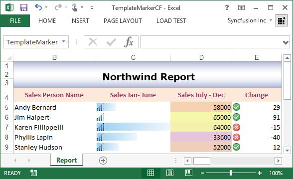

## Template marker with Hyperlink

You can add hyperlink to the template marker range.

The following screenshot represents the input template, which has a template marker.

The following code snippet illustrates how to detect data type and apply number format with template marker.

  

using (ExcelEngine excelEngine = new ExcelEngine())
{
    IApplication application = excelEngine.Excel;
    IWorkbook workbook = application.Workbooks.Open("TemplateMarker.xlsx")

    //Create Template Marker Processor
    ITemplateMarkersProcessor marker = workbook.CreateTemplateMarkersProcessor();

    //Add collection to the marker variables where the name should match with input template
    marker.AddVariable("Company", GetCompanyDetails());

    //Process the markers in the template
    marker.ApplyMarkers();

    workbook.SaveAs("TemplateMarkerHyperlink.xlsx");
}



using excelEngine As ExcelEngine = new ExcelEngine()
  Dim workbook As IWorkbook = excelEngine.Excel.Workbooks.Open("TemplateMarker.xlsx")

  'Create Template Marker Processor
  Dim marker As ITemplateMarkersProcessor = workbook.CreateTemplateMarkersProcessor()
 
  'Add collection to the marker variables where the name should match with input template
   marker.AddVariable("Company", GetCompanyDetails());

  'Process the markers and detect the number format along with the data type in the template
  marker.ApplyMarkers()

  workbook.SaveAs("TemplateMarkerHyperlink.xlsx");
End Using




using (ExcelEngine excelEngine = new ExcelEngine())
{
  IApplication application = excelEngine.Excel;

  //Instantiates the File Picker
  FileOpenPicker openPicker = new FileOpenPicker();
  openPicker.SuggestedStartLocation = PickerLocationId.Desktop;
  openPicker.FileTypeFilter.Add(".xlsx");
  openPicker.FileTypeFilter.Add(".xls");
  StorageFile openFile = await openPicker.PickSingleFileAsync();

  //Opens the workbook
  IWorkbook workbook = await application.Workbooks.OpenAsync(openFile);
  
  //Create Template Marker Processor
  ITemplateMarkersProcessor marker = workbook.CreateTemplateMarkersProcessor();

  //Add collection to the marker variables where the name should match with input template
  marker.AddVariable("Company", GetCompanyDetails());

  //Process the markers in the template
  marker.ApplyMarkers();

  //Initializes FileSavePicker
  FileSavePicker savePicker = new FileSavePicker();
  savePicker.SuggestedStartLocation = PickerLocationId.Desktop;
  savePicker.SuggestedFileName = "TemplateMarkerHyperlink";
  savePicker.FileTypeChoices.Add("Excel Files", new List<string>() { ".xlsx" });

  //Creates a storage file from FileSavePicker
  StorageFile storageFile = await savePicker.PickSaveFileAsync();

  //Saves changes to the specified storage file
  await workbook.SaveAsAsync(storageFile);
}



//Binding data from data table is supported only from ASP.NET Core 2.0
using (ExcelEngine excelEngine = new ExcelEngine())
{
  IApplication application = excelEngine.Excel;
  FileStream fileStream = new FileStream("TemplateMarker.xlsx", FileMode.Open, FileAccess.Read);
  IWorkbook workbook = application.Workbooks.Open(fileStream);

  //Create Template Marker Processor
    ITemplateMarkersProcessor marker = workbook.CreateTemplateMarkersProcessor();

  //Add collection to the marker variables where the name should match with input template
  marker.AddVariable("Company", GetCompanyDetails());

  //Process the markers in the template
  marker.ApplyMarkers();

  //Saving the workbook as stream

  FileStream stream = new FileStream("TemplateMarkerHyperlink.xlsx", FileMode.Create, FileAccess.ReadWrite);
  workbook.SaveAs(stream);
  stream.Dispose();
}




using (ExcelEngine excelEngine = new ExcelEngine())
{
  IApplication application = excelEngine.Excel;
  application.DefaultVersion = ExcelVersion.Excel2013;
  Assembly assembly = typeof(App).GetTypeInfo().Assembly;
  Stream inputStream = assembly.GetManifestResourceStream("SampleBrowser.XlsIO.Samples.Template.TemplateMarker.xlsx");
  IWorkbook workbook = application.Workbooks.Open(inputStream);

  //Create Template Marker Processor
  ITemplateMarkersProcessor marker = workbook.CreateTemplateMarkersProcessor();

  //Add collection to the marker variables where the name should match with input template
  marker.AddVariable("Company", GetCompanyDetails());

  //Process the markers in the template
  marker.ApplyMarkers();

  //Saving the workbook as stream
  MemoryStream stream = new MemoryStream();
  workbook.SaveAs(stream);

  stream.Position = 0;

  //Save the document as file and view the saved document

  //The operation in SaveAndView under Xamarin varies between Windows Phone, Android and iOS platforms. Please refer xlsio/xamarin section for respective code samples.

  if (Device.OS == TargetPlatform.WinPhone || Device.OS == TargetPlatform.Windows)
  {
	Xamarin.Forms.DependencyService.Get<ISaveWindowsPhone>().SaveAndView("TemplateMarkerHyperlink.xlsx", "application/msexcel", stream);
  }
  else
  {
	Xamarin.Forms.DependencyService.Get<ISave>().SaveAndView("TemplateMarkerHyperlink.xlsx", "application/msexcel", stream);
  }
}

  

The following code snippet provides supporting methods and classes for the previous code.

  

//Gets a list of company details
private List<Company> GetCompanyDetails()
{
    List<Company> companyList = new List<Company>();

    Company company = new Company();
    company.Name = "Syncfusion";
    Hyperlink link = new Hyperlink("https://www.syncfusion.com", "", "", "Syncfusion", ExcelHyperLinkType.Url, null);
    company.Link = link;
    companyList.Add(company);

    company = new Company();
    company.Name = "Microsoft";
    link = new Hyperlink("https://www.microsoft.com", "", "", "Microsoft", ExcelHyperLinkType.Url, null);
    company.Link = link;
    companyList.Add(company);

    company = new Company();
    company.Name = "Google";
    link = new Hyperlink("https://www.google.com", "", "", "Google", ExcelHyperLinkType.Url, null);
    company.Link = link;
    companyList.Add(company);

    return companyList;
}    
public class Hyperlink : IHyperLink
{
    public IApplication Application { get; }
    public object Parent { get;}
    public string Address { get; set; }
    public string Name { get; }
    public IRange Range { get; }
    public string ScreenTip { get; set; }
    public string SubAddress { get; set; }
    public string TextToDisplay { get; set; }
    public ExcelHyperLinkType Type { get; set; }
    public IShape Shape { get; }
    public ExcelHyperlinkAttachedType AttachedType { get; }
    public byte[] Image { get; set; }

    public Hyperlink(string address, string subAddress, string screenTip, string textToDisplay, ExcelHyperLinkType type, byte[] image)
    {
        Address = address;
        ScreenTip = screenTip;
        SubAddress = subAddress;            
        TextToDisplay = textToDisplay;
        Type = type;
        Image = image;
    }
}

public class Company
{
    public string Name { get; set; }
    public Hyperlink Link { get; set; }
}




'Gets a list of company details
Private Function GetCompanyDetails() As List(Of Company)
    Dim companyList As List(Of Company) = New List(Of Company)()
    Dim company As Company = New Company()
    company.Name = "Syncfusion"
    Dim link As Hyperlink = New Hyperlink("https://www.syncfusion.com", "", "", "Syncfusion", ExcelHyperLinkType.Url, Nothing)
    company.Link = link
    companyList.Add(company)
    company = New Company()
    company.Name = "Microsoft"
    link = New Hyperlink("https://www.microsoft.com", "", "", "Microsoft", ExcelHyperLinkType.Url, Nothing)
    company.Link = link
    companyList.Add(company)
    company = New Company()
    company.Name = "Google"
    link = New Hyperlink("https://www.google.com", "", "", "Google", ExcelHyperLinkType.Url, Nothing)
    company.Link = link
    companyList.Add(company)
    Return companyList
End Function   
Public Class Hyperlink
    Inherits IHyperLink

    Public ReadOnly Property Application As IApplication
    Public ReadOnly Property Parent As Object
    Public Property Address As String
    Public ReadOnly Property Name As String
    Public ReadOnly Property Range As IRange
    Public Property ScreenTip As String
    Public Property SubAddress As String
    Public Property TextToDisplay As String
    Public Property Type As ExcelHyperLinkType
    Public ReadOnly Property Shape As IShape
    Public ReadOnly Property AttachedType As ExcelHyperlinkAttachedType
    Public Property Image As Byte()

    Public Sub New(ByVal address As String, ByVal subAddress As String, ByVal screenTip As String, ByVal textToDisplay As String, ByVal type As ExcelHyperLinkType, ByVal image As Byte())
        Address = address
        ScreenTip = screenTip
        SubAddress = subAddress
        TextToDisplay = textToDisplay
        Type = type
        Image = image
    End Sub
End Class

Public Class Company
    Public Property Name As String
    Public Property Link As Hyperlink
End Class




//Gets a list of company details
private List<Company> GetCompanyDetails()
{
    List<Company> companyList = new List<Company>();

    Company company = new Company();
    company.Name = "Syncfusion";
    Hyperlink link = new Hyperlink("https://www.syncfusion.com", "", "", "Syncfusion", ExcelHyperLinkType.Url, null);
    company.Link = link;
    companyList.Add(company);

    company = new Company();
    company.Name = "Microsoft";
    link = new Hyperlink("https://www.microsoft.com", "", "", "Microsoft", ExcelHyperLinkType.Url, null);
    company.Link = link;
    companyList.Add(company);

    company = new Company();
    company.Name = "Google";
    link = new Hyperlink("https://www.google.com", "", "", "Google", ExcelHyperLinkType.Url, null);
    company.Link = link;
    companyList.Add(company);

    return companyList;
}    
public class Hyperlink : IHyperLink
{
    public IApplication Application { get; }
    public object Parent { get;}
    public string Address { get; set; }
    public string Name { get; }
    public IRange Range { get; }
    public string ScreenTip { get; set; }
    public string SubAddress { get; set; }
    public string TextToDisplay { get; set; }
    public ExcelHyperLinkType Type { get; set; }
    public IShape Shape { get; }
    public ExcelHyperlinkAttachedType AttachedType { get; }
    public byte[] Image { get; set; }

    public Hyperlink(string address, string subAddress, string screenTip, string textToDisplay, ExcelHyperLinkType type, byte[] image)
    {
        Address = address;
        ScreenTip = screenTip;
        SubAddress = subAddress;            
        TextToDisplay = textToDisplay;
        Type = type;
        Image = image;
    }
}

public class Company
{
    public string Name { get; set; }
    public Hyperlink Link { get; set; }
}



//Gets a list of company details
private List<Company> GetCompanyDetails()
{
    List<Company> companyList = new List<Company>();

    Company company = new Company();
    company.Name = "Syncfusion";
    Hyperlink link = new Hyperlink("https://www.syncfusion.com", "", "", "Syncfusion", ExcelHyperLinkType.Url, null);
    company.Link = link;
    companyList.Add(company);

    company = new Company();
    company.Name = "Microsoft";
    link = new Hyperlink("https://www.microsoft.com", "", "", "Microsoft", ExcelHyperLinkType.Url, null);
    company.Link = link;
    companyList.Add(company);

    company = new Company();
    company.Name = "Google";
    link = new Hyperlink("https://www.google.com", "", "", "Google", ExcelHyperLinkType.Url, null);
    company.Link = link;
    companyList.Add(company);

    return companyList;
}    
public class Hyperlink : IHyperLink
{
    public IApplication Application { get; }
    public object Parent { get;}
    public string Address { get; set; }
    public string Name { get; }
    public IRange Range { get; }
    public string ScreenTip { get; set; }
    public string SubAddress { get; set; }
    public string TextToDisplay { get; set; }
    public ExcelHyperLinkType Type { get; set; }
    public IShape Shape { get; }
    public ExcelHyperlinkAttachedType AttachedType { get; }
    public byte[] Image { get; set; }

    public Hyperlink(string address, string subAddress, string screenTip, string textToDisplay, ExcelHyperLinkType type, byte[] image)
    {
        Address = address;
        ScreenTip = screenTip;
        SubAddress = subAddress;            
        TextToDisplay = textToDisplay;
        Type = type;
        Image = image;
    }
}

public class Company
{
    public string Name { get; set; }
    public Hyperlink Link { get; set; }
}



//Gets a list of company details
private List<Company> GetCompanyDetails()
{
    List<Company> companyList = new List<Company>();

    Company company = new Company();
    company.Name = "Syncfusion";
    Hyperlink link = new Hyperlink("https://www.syncfusion.com", "", "", "Syncfusion", ExcelHyperLinkType.Url, null);
    company.Link = link;
    companyList.Add(company);

    company = new Company();
    company.Name = "Microsoft";
    link = new Hyperlink("https://www.microsoft.com", "", "", "Microsoft", ExcelHyperLinkType.Url, null);
    company.Link = link;
    companyList.Add(company);

    company = new Company();
    company.Name = "Google";
    link = new Hyperlink("https://www.google.com", "", "", "Google", ExcelHyperLinkType.Url, null);
    company.Link = link;
    companyList.Add(company);

    return companyList;
}    
public class Hyperlink : IHyperLink
{
    public IApplication Application { get; }
    public object Parent { get;}
    public string Address { get; set; }
    public string Name { get; }
    public IRange Range { get; }
    public string ScreenTip { get; set; }
    public string SubAddress { get; set; }
    public string TextToDisplay { get; set; }
    public ExcelHyperLinkType Type { get; set; }
    public IShape Shape { get; }
    public ExcelHyperlinkAttachedType AttachedType { get; }
    public byte[] Image { get; set; }

    public Hyperlink(string address, string subAddress, string screenTip, string textToDisplay, ExcelHyperLinkType type, byte[] image)
    {
        Address = address;
        ScreenTip = screenTip;
        SubAddress = subAddress;            
        TextToDisplay = textToDisplay;
        Type = type;
        Image = image;
    }
}

public class Company
{
    public string Name { get; set; }
    public Hyperlink Link { get; set; }
}

 

A complete working example to import data to template marker with hyperlink in C# is present on [this GitHub page](https://github.com/SyncfusionExamples/XlsIO-Examples/tree/master/Import%20Data%20to%20Template/Import%20with%20Hyperlinks).

The following screenshot represents generated Excel file in which the hyperlink is added.

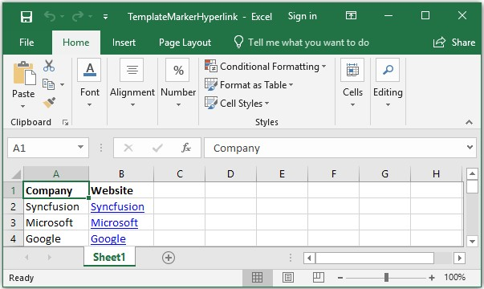

N> Explore our [.NET Excel Library](https://www.syncfusion.com/document-processing/excel-framework/net) Feature Tour page and [.Net Excel Framework demo](https://www.syncfusion.com/demos/fileformats/excel-library) that shows how to create and modify Excel files from C# with 5 lines of code on different platforms.
