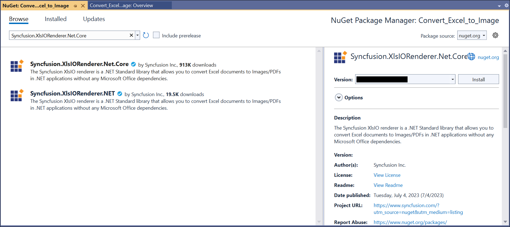
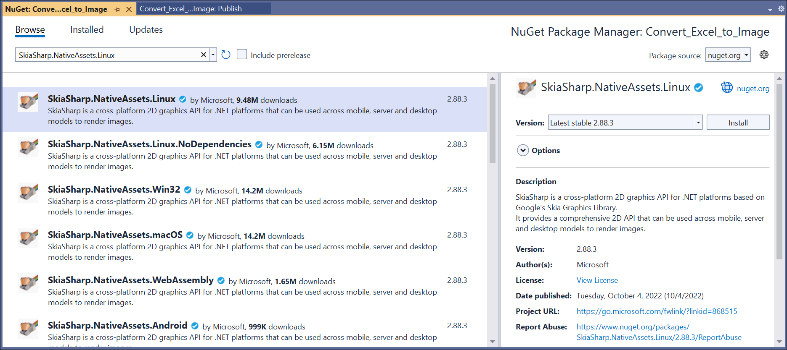
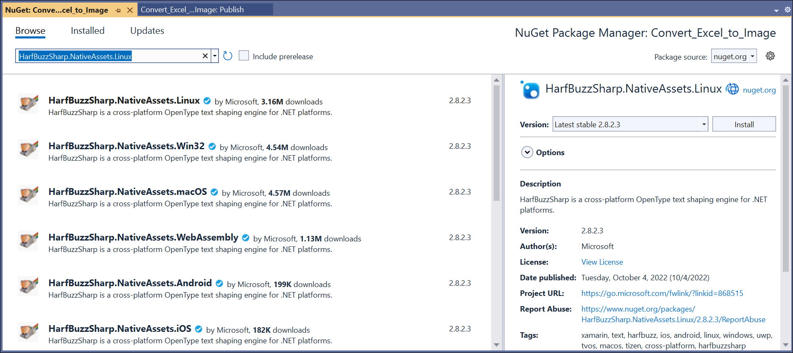
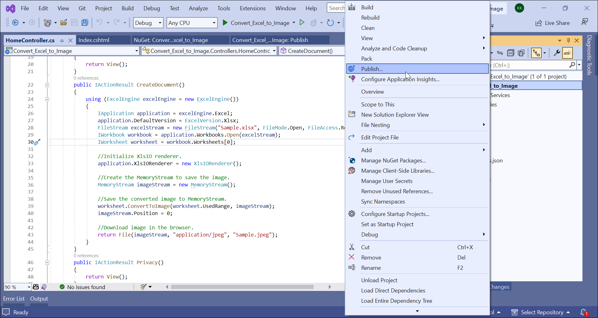
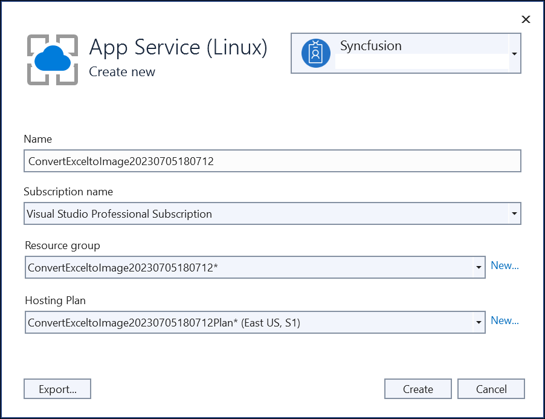
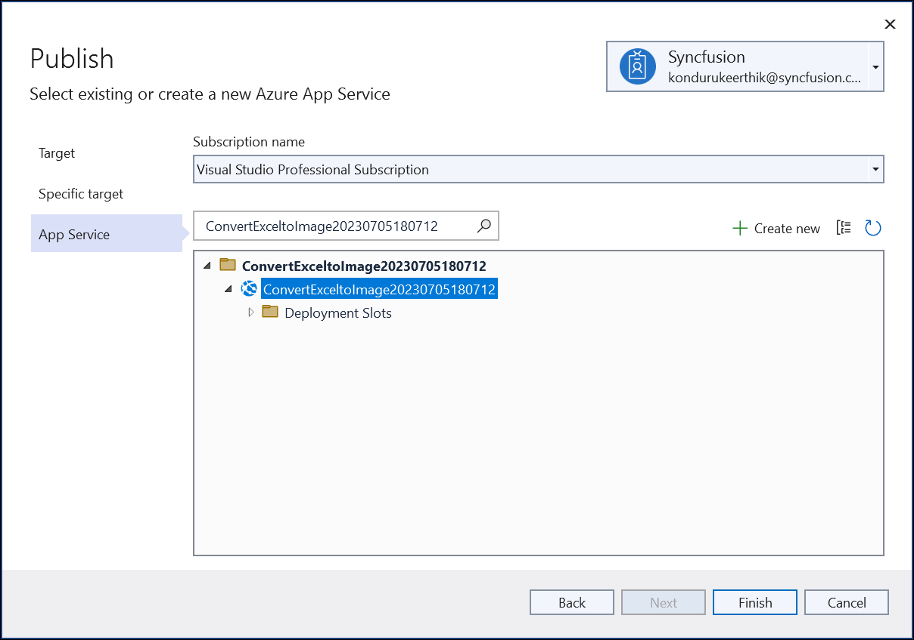
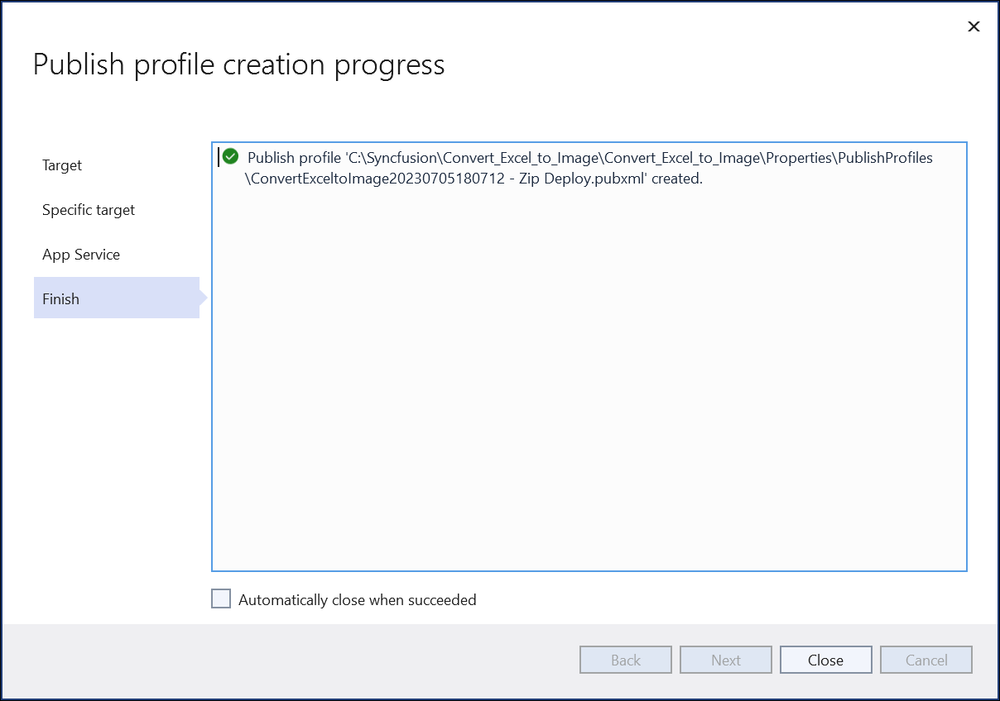
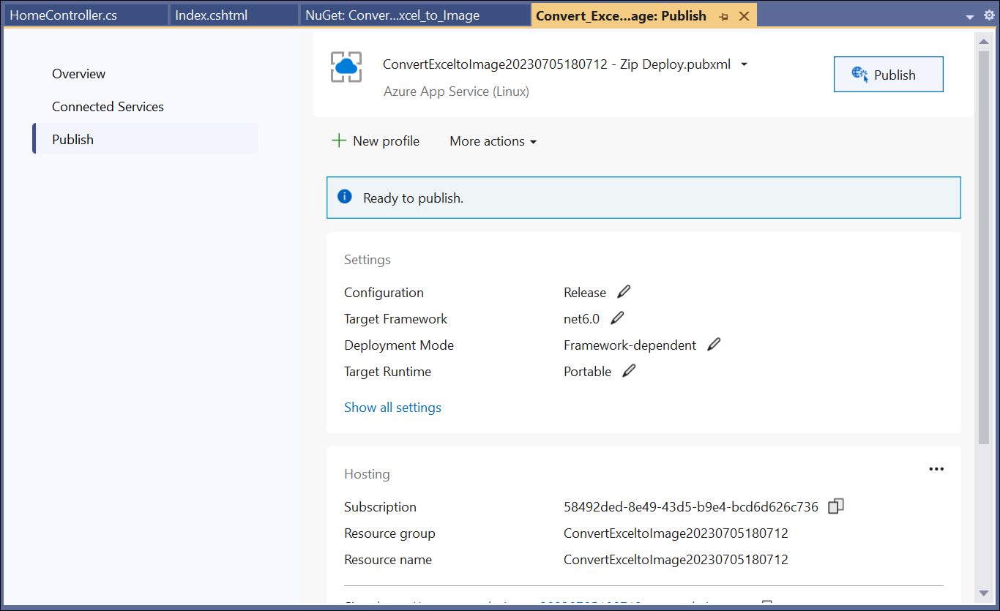
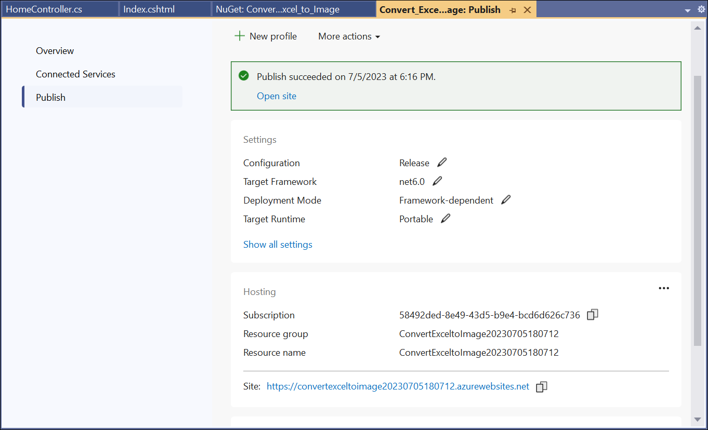
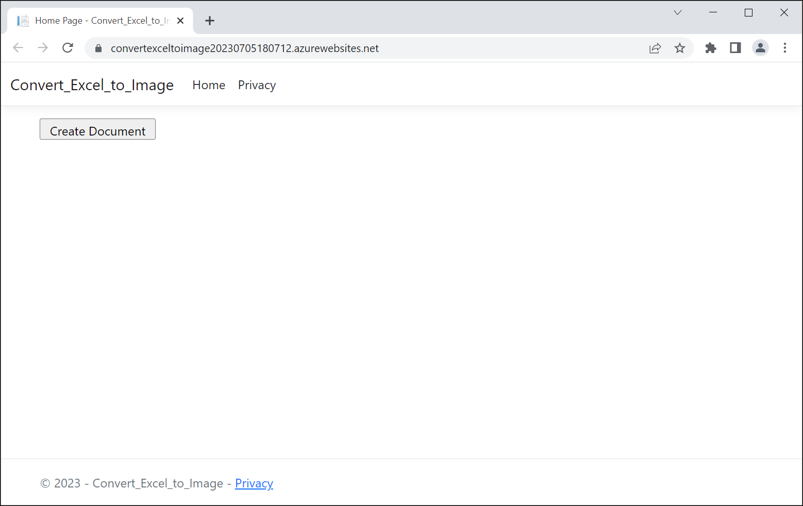

# Convert Excel document to Image in Azure App Service on Linux

Syncfusion XlsIO is a [.NET Core Excel library](https://www.syncfusion.com/document-processing/excel-framework/net) used to create, read, edit and **convert Excel documents** programmatically without **Microsoft Excel** or interop dependencies. Using this library, you can **convert an Excel document to Image in Azure App Service on Linux**.

## Steps to convert Excel document to Image in Azure App Service on Linux

Step 1: Create a new ASP.NET Core Web Application (Model-View-Controller).

Step 2: Name the project.

Step 3: Select the framework and click **Create** button.

Step 4: Install the following NuGet packages as reference to your project from [NuGet.org](https://www.nuget.org/).

* [Syncfusion.XlsIORenderer.Net.Core](https://www.nuget.org/packages/Syncfusion.XlsIORenderer.Net.Core)
* [SkiaSharp.NativeAssets.Linux](https://www.nuget.org/packages/SkiaSharp.NativeAssets.Linux/2.88.2)
* [HarfBuzzSharp.NativeAssets.Linux](https://www.nuget.org/packages/HarfBuzzSharp.NativeAssets.Linux/2.8.2.3)

Step 5: Add a new button in the **Index.cshtml** as shown below.
  

@{Html.BeginForm("CreateDocument", "Home", FormMethod.Get);
    {
        

            <input type="submit" value="Create Document" style="width:150px;height:27px" />
        

    }
    Html.EndForm();
}



Step 6: Include the following namespaces in **HomeController.cs**.


using Syncfusion.XlsIO;
using Syncfusion.XlsIORenderer;



Step 7: Include the below code snippet in **HomeController.cs** to **convert an Excel document to Image**. 


using (ExcelEngine excelEngine = new ExcelEngine())
{
  IApplication application = excelEngine.Excel;
  application.DefaultVersion = ExcelVersion.Xlsx;
  FileStream excelStream = new FileStream("Sample.xlsx", FileMode.Open, FileAccess.Read);
  IWorkbook workbook = application.Workbooks.Open(excelStream);
  IWorksheet worksheet = workbook.Worksheets[0];

  //Initialize XlsIO renderer.
  application.XlsIORenderer = new XlsIORenderer();

  //Create the MemoryStream to save the image.      
  MemoryStream imageStream = new MemoryStream();

  //Save the converted image to MemoryStream.
  worksheet.ConvertToImage(worksheet.UsedRange, imageStream);
  imageStream.Position = 0;

  //Download image in the browser.
  return File(imageStream, "application/jpeg", "Sample.jpeg");
}



## Steps to publish as Azure App Service on Linux

Step 1: Right-click the project and select **Publish** option.

Step 2: Select the publish target as **Azure**.

Step 3: Select the Specific target as **Azure App Service (Linux)**.

Step 4: To create a new app service, click **Create new** option.

Step 5: Click the **Create** button to proceed with **App Service** creation.

Step 6: Click the **Finish** button to finalize the **App Service** creation.

Step 7: Click **Close** button.

Step 8: Click the **Publish** button.

Step 9: Now, Publish has been succeeded.

Step 10: Now, the published webpage will open in the browser. 

Step 11: Click **Create Document** to convert the given Excel document to Image. You will get the output **Image** as follows.

