# Convert Excel document to Image in Google App Engine

Syncfusion XlsIO is a [.NET Core Excel library](https://www.syncfusion.com/document-processing/excel-framework/net-core/excel-library) used to create, read, edit and **convert Excel documents** programmatically without **Microsoft Excel** or interop dependencies. Using this library, you can **convert an Excel document to Image in Google App Engine**.

## Set up App Engine

Step 1: Open the **Google Cloud Console** and click the **Activate Cloud Shell** button.

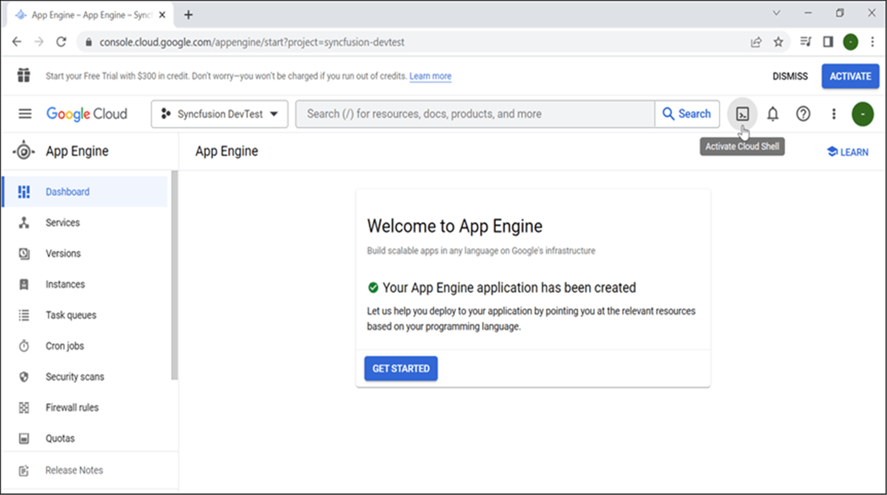

Step 2: Click the **Cloud Shell Editor** button to view the **Workspace**.

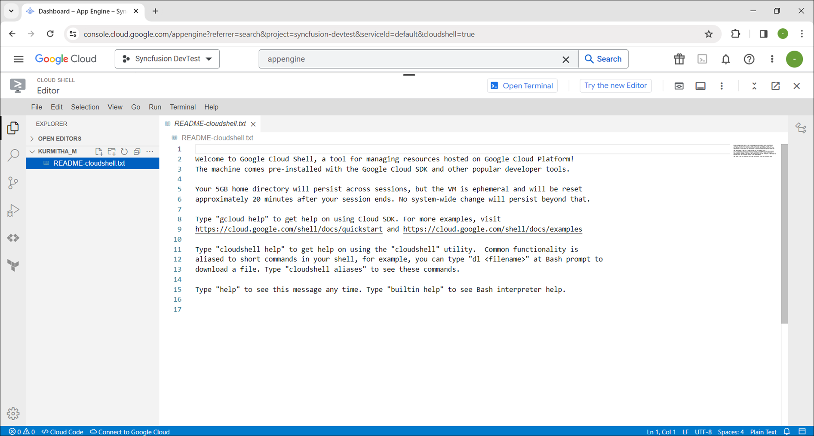

Step 3: Open **Cloud Shell Terminal**, run the following **command** to confirm authentication.




gcloud auth list




Step 4: Click the **Authorize** button.

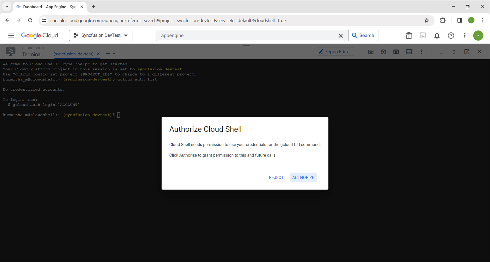

## Create an application for App Engine

Step 1: Open Visual Studio and select the ASP.NET Core Web app (Model-View-Controller) template.

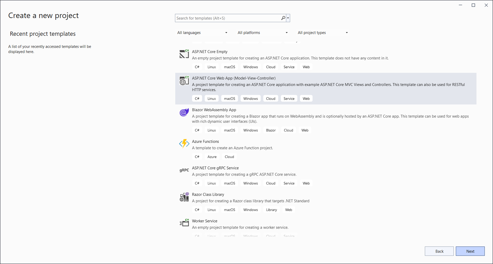

Step 2: Configure your new project according to your requirements.

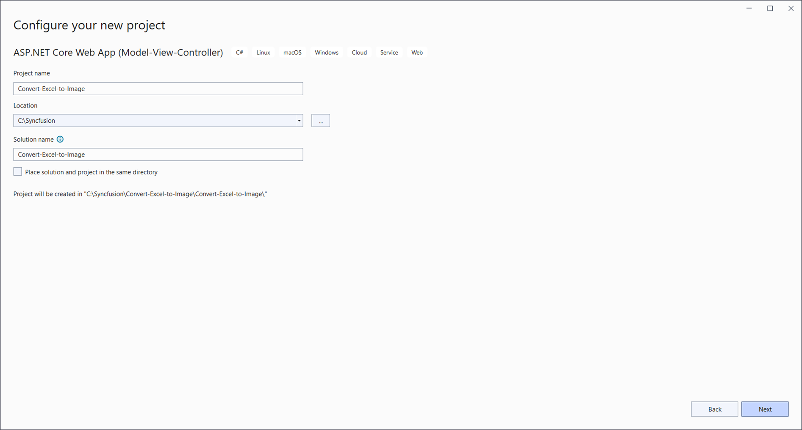

Step 3: Click the **Create** button.

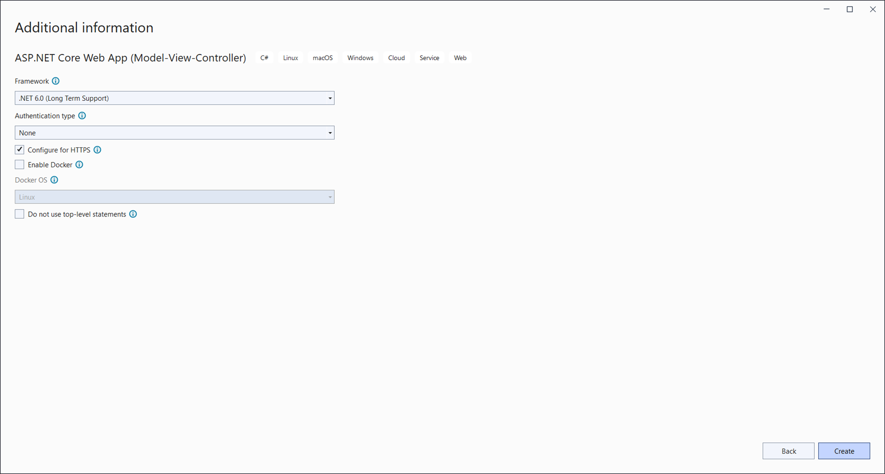

Step 4: Install the following **Nuget packages** in your application from [Nuget.org](https://www.nuget.org/).

* [Syncfusion.XLsIORenderer.Net.Core](https://www.nuget.org/packages/Syncfusion.XlsIORenderer.Net.Core) 
* [SkiaSharp.NativeAssets.Linux v2.88.6](https://www.nuget.org/packages/SkiaSharp.NativeAssets.Linux/2.88.6)
* [HarfBuzzSharp.NativeAssets.Linux v7.3.0](https://www.nuget.org/packages/HarfBuzzSharp.NativeAssets.Linux/7.3.0)

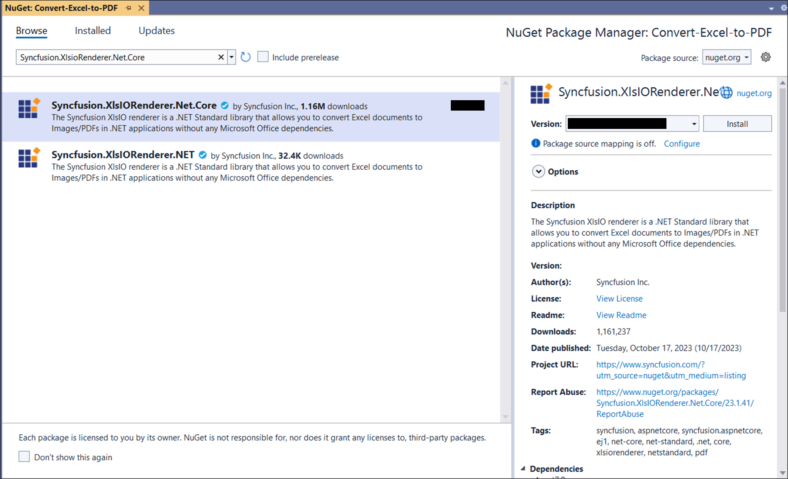
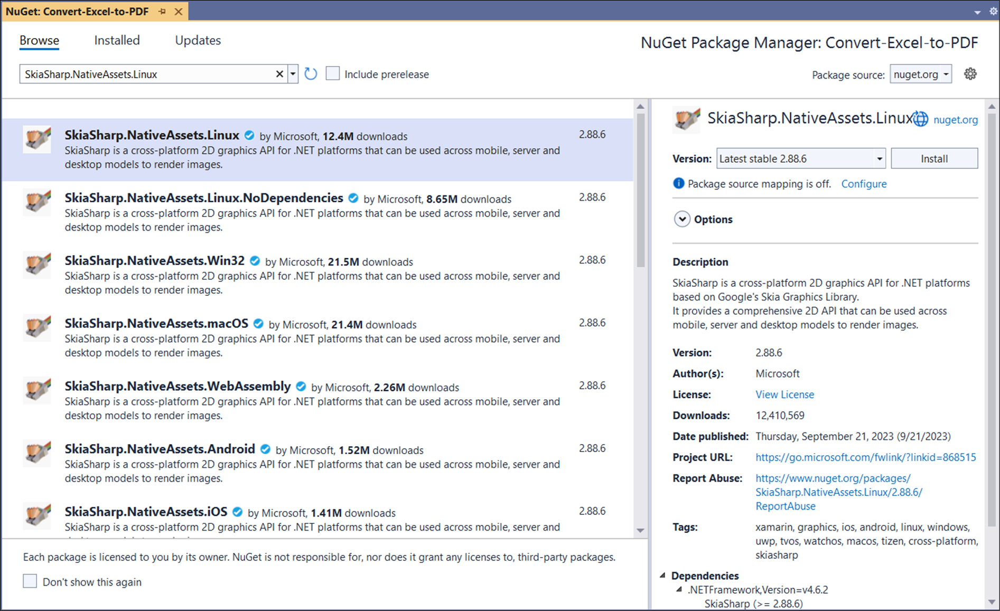
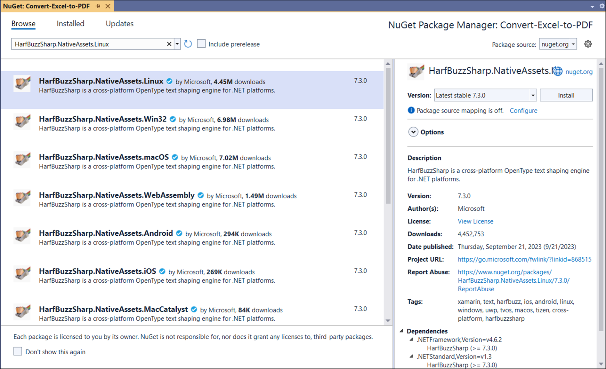

N> Starting with v16.2.0.x, if you reference Syncfusion assemblies from trial setup or from the NuGet feed, you also have to add "Syncfusion.Licensing" assembly reference and include a license key in your projects. Please refer to this [link](https://help.syncfusion.com/common/essential-studio/licensing/overview) to know about registering Syncfusion license key in your application to use our components.

Step 5: Include the following namespaces in the **HomeController.cs** file.




using Syncfusion.XlsIO;
using Syncfusion.XlsIORenderer;




Step 6: A default action method named Index will be present in HomeController.cs. Right click on Index method and select **Go To View** where you will be directed to its associated view page **Index.cshtml**.

Step 7: Add a new button in the Index.cshtml as shown below.




@{
    Html.BeginForm("ConvertExcelToImage", "Home", FormMethod.Get);
    {
        

            <input type="submit" value="Convert Excel to image" style="width:185px;height:27px" />
        

    }
    Html.EndForm();
}



Step 8: Add a new action method **ConvertExcelToImage** in HomeController.cs and include the below code snippet to **convert the Excel document to image** and download it.




using (ExcelEngine excelEngine = new ExcelEngine())
{
  IApplication application = excelEngine.Excel;
  application.DefaultVersion = ExcelVersion.Xlsx;
  FileStream excelStream = new FileStream("Sample.xlsx", FileMode.Open, FileAccess.Read);
  IWorkbook workbook = application.Workbooks.Open(excelStream);
  IWorksheet worksheet = workbook.Worksheets[0];

  //Initialize XlsIO renderer.
  application.XlsIORenderer = new XlsIORenderer();

  //Create the MemoryStream to save the image.      
  MemoryStream imageStream = new MemoryStream();

  //Save the converted image to MemoryStream.
  worksheet.ConvertToImage(worksheet.UsedRange, imageStream);
  imageStream.Position = 0;

  //Download image in the browser.
  return File(imageStream, "application/jpeg", "Sample.jpeg");
}




## Move application to App Engine

Step 1: Open the **Cloud Shell editor**.

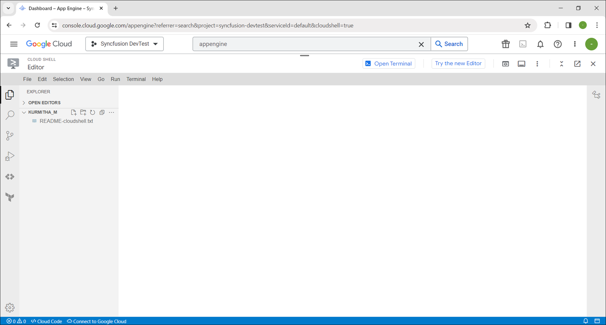

Step 2: Drag and drop the sample from your local machine to **Workspace**.

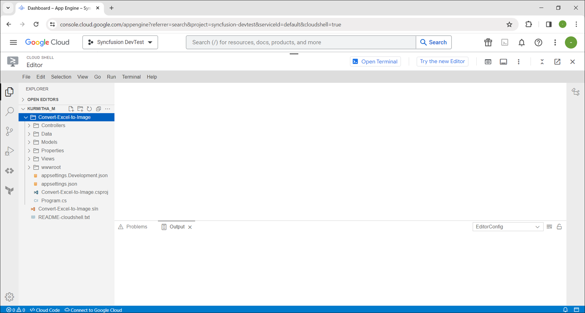

N> If you have your sample application in your local machine, drag and drop it into the Workspace. If you created the sample using the Cloud Shell terminal command, it will be available in the Workspace.

Step 3: Open the Cloud Shell Terminal and run the following **command** to view the files and directories within your **current Workspace**.




ls




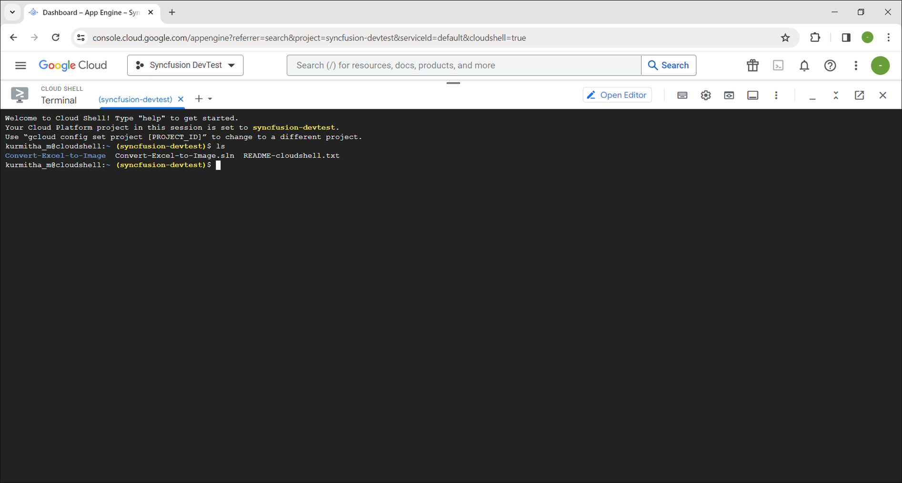

Step 4: Run the following **command** to navigate which sample you want run.




cd Convert-Excel-to-Image




Step 5: To ensure that the sample is working correctly, please run the application using the following command.




dotnet run --urls=http://localhost:8080




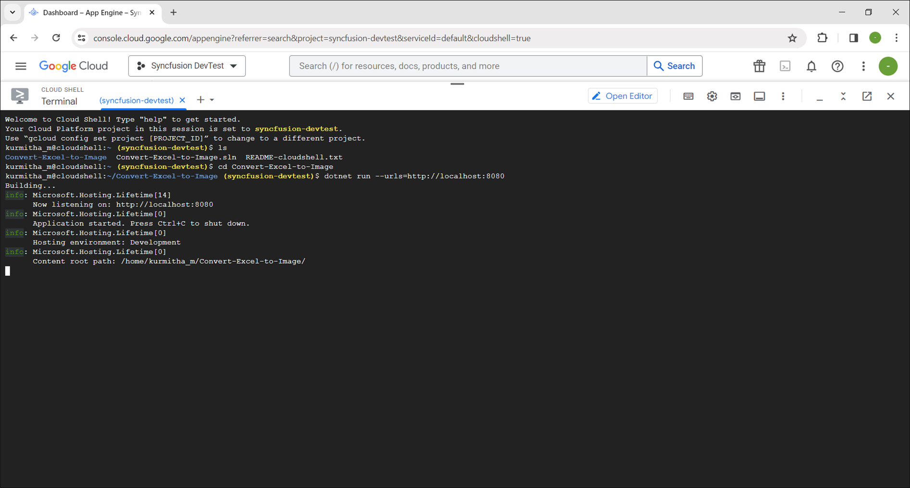

Step 6: Verify that the application is running properly by accessing the **Web View** -> **Preview on port 8080**.

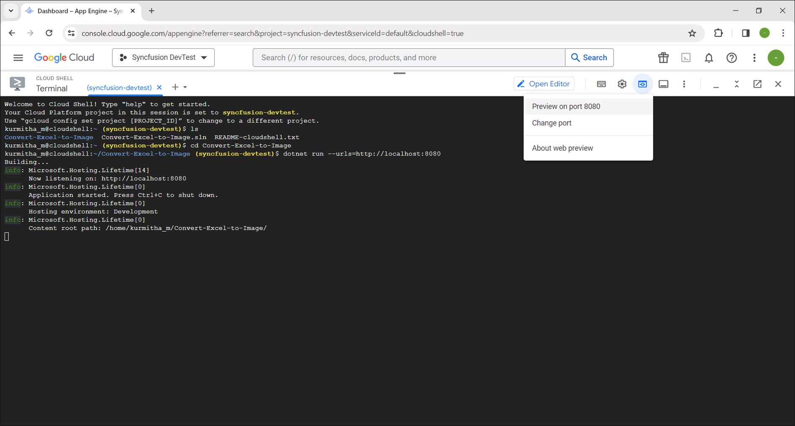

Step 7: Now you can see the sample output on the preview page.

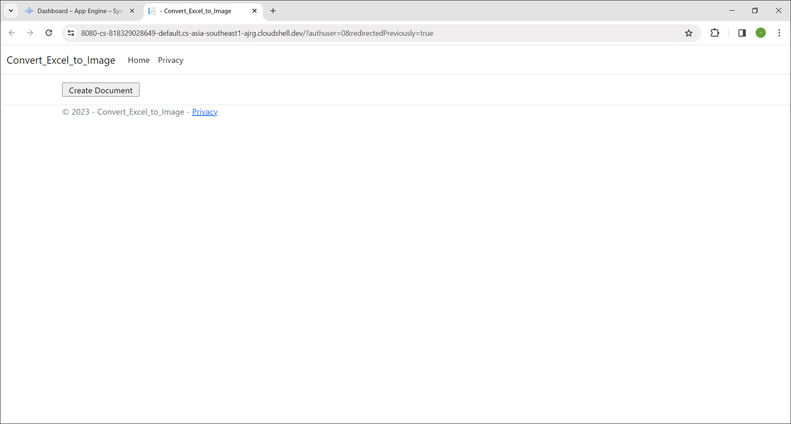

Step 8: Close the preview page and return to the terminal then press **Ctrl+C** for which will typically stop the process.

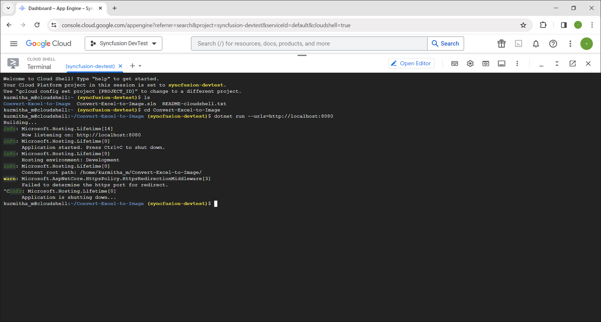

## Publish the application

Step 1: Run the following command in **Cloud Shell Terminal** to publish the application.




dotnet publish -c Release




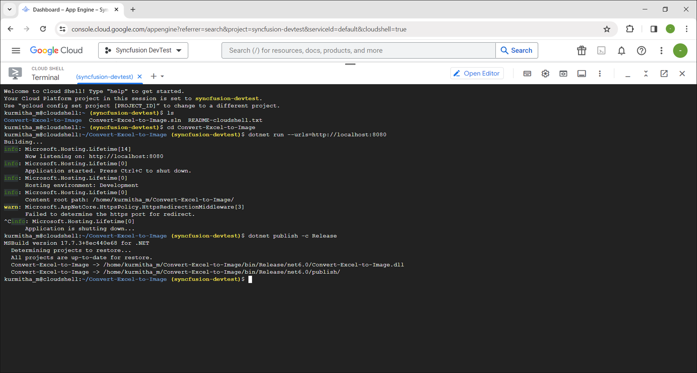

Step 2: Run the following command in **Cloud Shell Terminal** to navigate to the publish folder.



cd bin/Release/net6.0/publish/




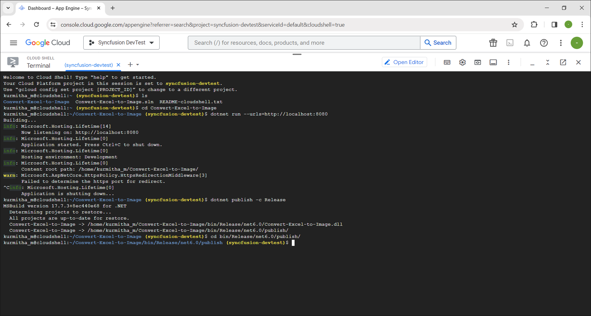

## Configure app.yaml and docker file

Step 1: Add the app.yaml file to the publish folder with the following contents.




cat <<EOT >> app.yaml
env: flex
runtime: custom   
EOT




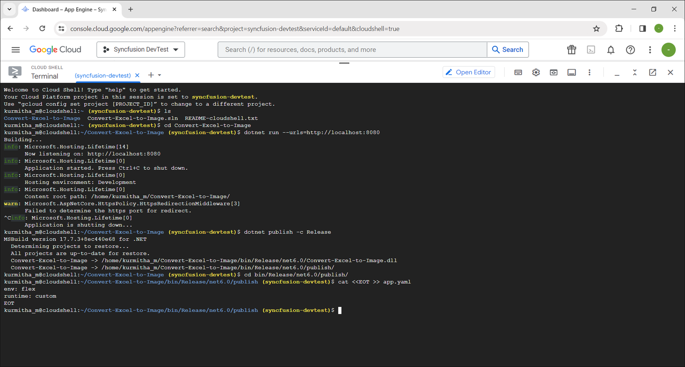

Step 2: Add the Docker file to the publish folder with the following contents.




cat <<EOT >> Dockerfile
FROM mcr.microsoft.com/dotnet/aspnet:6.0
RUN apt-get update -y && apt-get install libfontconfig -y
ADD / /app
EXPOSE 8080
ENV ASPNETCORE_URLS=http://*:8080
WORKDIR /app
ENTRYPOINT [ "dotnet", "Convert-Excel-to-Image.dll"]
EOT




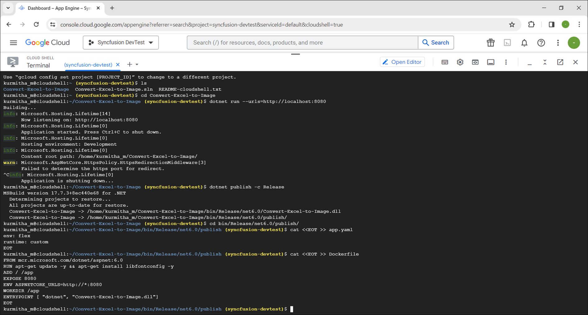

Step 3: You can ensure **Docker** and **app.yaml** files are added in **Workspace**.

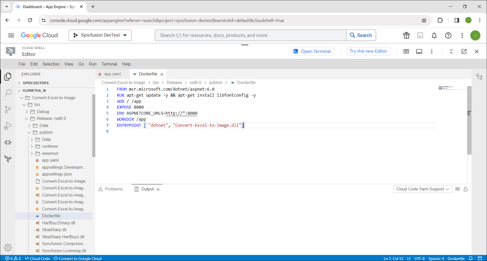

## Deploy to App Engine

Step 1: To deploy the application to the App Engine, run the following command in Cloud Shell Terminal. Afterwards, retrieve the **URL** from the Cloud Shell Terminal.




gcloud app deploy --version v0




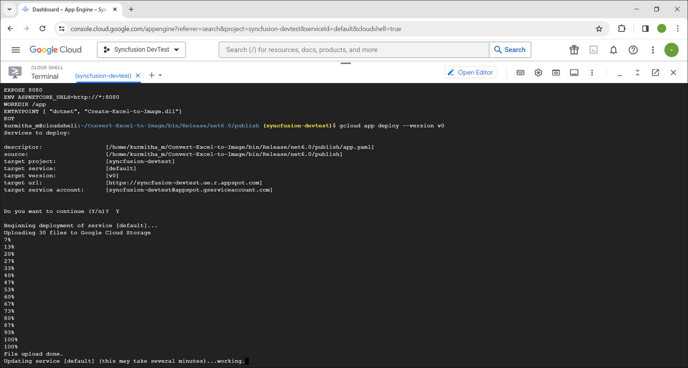

Step 2: Open the **URL** to access the application, which has been successfully deployed.

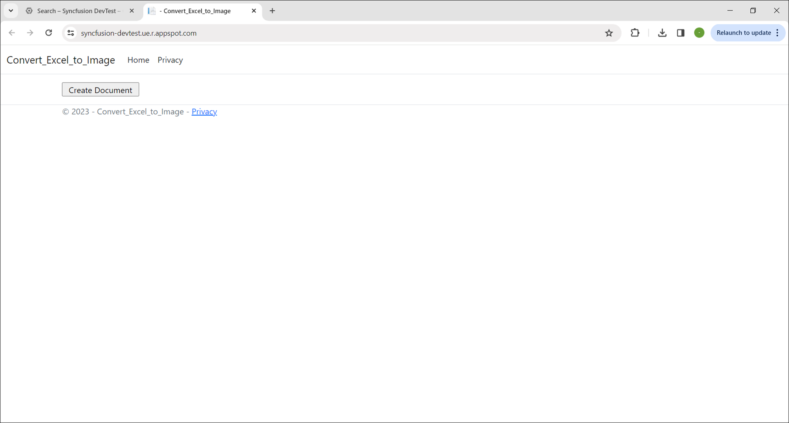

A complete working example of how to convert an Excel document to Image in GCP is present on [this GitHub page](https://github.com/SyncfusionExamples/XlsIO-Examples/tree/master/Getting%20Started/ASP.NET%20Core/Convert%20Excel%20to%20Image).

By executing the program, you will get the **image** as follows. The output will be saved in **bin** folder.

Click [here](https://www.syncfusion.com/document-processing/excel-framework/net-core) to explore the rich set of Syncfusion Excel library (XlsIO) features.

An online sample link to [convert an Excel document to Image](https://ej2.syncfusion.com/aspnetcore/Excel/WorksheetToImage#/material3) in ASP.NET Core.