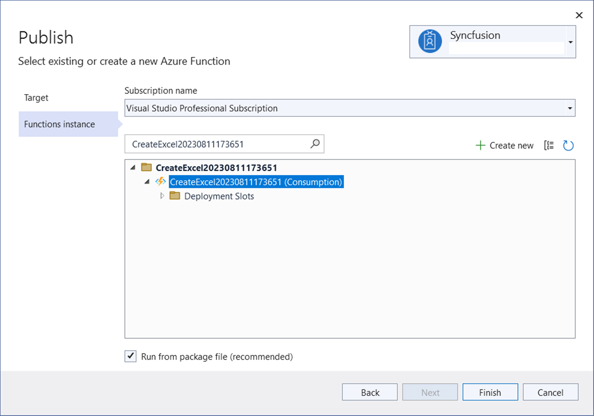
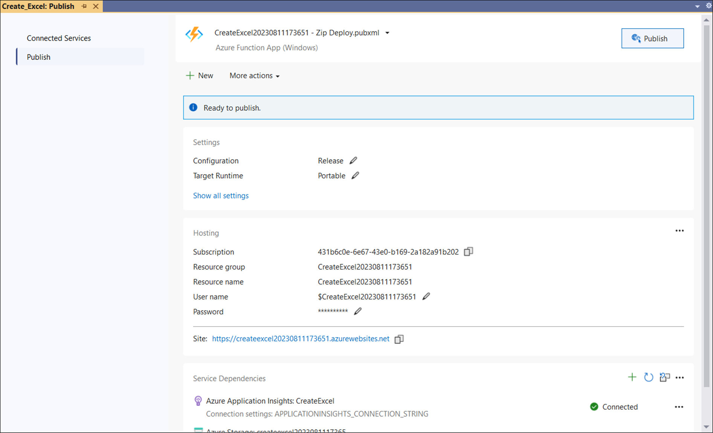
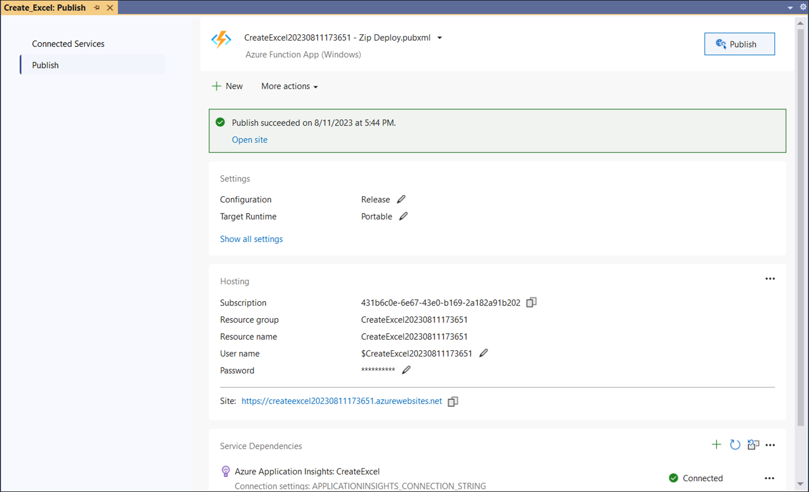

# Create, read, and edit Excel files in in Azure Functions v4

[Syncfusion Excel library for ASP.NET Core platform](https://www.syncfusion.com/document-processing/excel-framework/net-core/excel-library) can be used to create, read, edit Excel files. This also convert Excel files to PDF.

## Create a simple Excel report

Step 1: Create a new Azure Functions project.

Step 2: Name the project.

Step 3: Select functions worker as **.NET (6.0) Long Term Support**. 

Step 4: Install the [Syncfusion.XlsIO.Net.Core](https://www.nuget.org/packages/Syncfusion.XlsIO.Net.Core) NuGet package as reference to your project from [NuGet.org](https://www.nuget.org).

N> Starting with v16.2.0.x, if you reference Syncfusion assemblies from trial setup or from the NuGet feed, you also have to add "Syncfusion.Licensing" assembly reference and include a license key in your projects. Please refer to this [link](https://help.syncfusion.com/common/essential-studio/licensing/overview) to know about registering Syncfusion license key in your applications to use our components. 

Step 5: Include the following namespaces in the **Function1.cs** file.


using Syncfusion.XlsIO;
using System.IO;
using Syncfusion.Drawing;



Step 6: Add the following code snippet in **Run** method of **Function1** class to **create Excel document** in Azure Functions and return the resultant **Excel document** to client end..
  

//Create an instance of ExcelEngine
using (ExcelEngine excelEngine = new ExcelEngine())
{
  IApplication application = excelEngine.Excel;
  application.DefaultVersion = ExcelVersion.Xlsx;

  //Create a workbook
  IWorkbook workbook = application.Workbooks.Create(1);
  IWorksheet worksheet = workbook.Worksheets[0];

  //Adding a picture
  Stream imageStream = req.Content.ReadAsStreamAsync().Result;
  IPictureShape shape = worksheet.Pictures.AddPicture(1, 1, imageStream, 20, 20);

  //Disable gridlines in the worksheet
  worksheet.IsGridLinesVisible = false;

  //Enter values to the cells from A3 to A5
  worksheet.Range["A3"].Text = "46036 Michigan Ave";
  worksheet.Range["A4"].Text = "Canton, USA";
  worksheet.Range["A5"].Text = "Phone: +1 231-231-2310";

  //Make the text bold
  worksheet.Range["A3:A5"].CellStyle.Font.Bold = true;

  //Merge cells
  worksheet.Range["D1:E1"].Merge();

  //Enter text to the cell D1 and apply formatting.
  worksheet.Range["D1"].Text = "INVOICE";
  worksheet.Range["D1"].CellStyle.Font.Bold = true;
  worksheet.Range["D1"].CellStyle.Font.RGBColor = Color.FromArgb(42, 118, 189);
  worksheet.Range["D1"].CellStyle.Font.Size = 35;

  //Apply alignment in the cell D1
  worksheet.Range["D1"].CellStyle.HorizontalAlignment = ExcelHAlign.HAlignRight;
  worksheet.Range["D1"].CellStyle.VerticalAlignment = ExcelVAlign.VAlignTop;

  //Enter values to the cells from D5 to E8
  worksheet.Range["D5"].Text = "INVOICE#";
  worksheet.Range["E5"].Text = "DATE";
  worksheet.Range["D6"].Number = 1028;
  worksheet.Range["E6"].Value = "12/31/2018";
  worksheet.Range["D7"].Text = "CUSTOMER ID";
  worksheet.Range["E7"].Text = "TERMS";
  worksheet.Range["D8"].Number = 564;
  worksheet.Range["E8"].Text = "Due Upon Receipt";

  //Apply RGB backcolor to the cells from D5 to E8
  worksheet.Range["D5:E5"].CellStyle.Color = Color.FromArgb(42, 118, 189);
  worksheet.Range["D7:E7"].CellStyle.Color = Color.FromArgb(42, 118, 189);

  //Apply known colors to the text in cells D5 to E8
  worksheet.Range["D5:E5"].CellStyle.Font.Color = ExcelKnownColors.White;
  worksheet.Range["D7:E7"].CellStyle.Font.Color = ExcelKnownColors.White;

  //Make the text as bold from D5 to E8
  worksheet.Range["D5:E8"].CellStyle.Font.Bold = true;

  //Apply alignment to the cells from D5 to E8
  worksheet.Range["D5:E8"].CellStyle.HorizontalAlignment = ExcelHAlign.HAlignCenter;
  worksheet.Range["D5:E5"].CellStyle.VerticalAlignment = ExcelVAlign.VAlignCenter;
  worksheet.Range["D7:E7"].CellStyle.VerticalAlignment = ExcelVAlign.VAlignCenter;
  worksheet.Range["D6:E6"].CellStyle.VerticalAlignment = ExcelVAlign.VAlignTop;

  //Enter value and applying formatting in the cell A7
  worksheet.Range["A7"].Text = "  BILL TO";
  worksheet.Range["A7"].CellStyle.Color = Color.FromArgb(42, 118, 189);
  worksheet.Range["A7"].CellStyle.Font.Bold = true;
  worksheet.Range["A7"].CellStyle.Font.Color = ExcelKnownColors.White;

  //Apply alignment
  worksheet.Range["A7"].CellStyle.HorizontalAlignment = ExcelHAlign.HAlignLeft;
  worksheet.Range["A7"].CellStyle.VerticalAlignment = ExcelVAlign.VAlignCenter;

  //Enter values in the cells A8 to A12
  worksheet.Range["A8"].Text = "Steyn";
  worksheet.Range["A9"].Text = "Great Lakes Food Market";
  worksheet.Range["A10"].Text = "20 Whitehall Rd";
  worksheet.Range["A11"].Text = "North Muskegon,USA";
  worksheet.Range["A12"].Text = "+1 231-654-0000";

  //Create a Hyperlink for e-mail in the cell A13
  IHyperLink hyperlink = worksheet.HyperLinks.Add(worksheet.Range["A13"]);
  hyperlink.Type = ExcelHyperLinkType.Url;
  hyperlink.Address = "Steyn@greatlakes.com";
  hyperlink.ScreenTip = "Send Mail";

  //Merge column A and B from row 15 to 22
  worksheet.Range["A15:B15"].Merge();
  worksheet.Range["A16:B16"].Merge();
  worksheet.Range["A17:B17"].Merge();
  worksheet.Range["A18:B18"].Merge();
  worksheet.Range["A19:B19"].Merge();
  worksheet.Range["A20:B20"].Merge();
  worksheet.Range["A21:B21"].Merge();
  worksheet.Range["A22:B22"].Merge();

  //Enter details of products and prices
  worksheet.Range["A15"].Text = "  DESCRIPTION";
  worksheet.Range["C15"].Text = "QTY";
  worksheet.Range["D15"].Text = "UNIT PRICE";
  worksheet.Range["E15"].Text = "AMOUNT";
  worksheet.Range["A16"].Text = "Cabrales Cheese";
  worksheet.Range["A17"].Text = "Chocos";
  worksheet.Range["A18"].Text = "Pasta";
  worksheet.Range["A19"].Text = "Cereals";
  worksheet.Range["A20"].Text = "Ice Cream";
  worksheet.Range["C16"].Number = 3;
  worksheet.Range["C17"].Number = 2;
  worksheet.Range["C18"].Number = 1;
  worksheet.Range["C19"].Number = 4;
  worksheet.Range["C20"].Number = 3;
  worksheet.Range["D16"].Number = 21;
  worksheet.Range["D17"].Number = 54;
  worksheet.Range["D18"].Number = 10;
  worksheet.Range["D19"].Number = 20;
  worksheet.Range["D20"].Number = 30;
  worksheet.Range["D23"].Text = "Total";

  //Apply number format
  worksheet.Range["D16:E22"].NumberFormat = "$.00";
  worksheet.Range["E23"].NumberFormat = "$.00";

  //Apply incremental formula for column Amount by multiplying Qty and UnitPrice
  application.EnableIncrementalFormula = true;
  worksheet.Range["E16:E20"].Formula = "=C16*D16";

  //Formula for Sum the total
  worksheet.Range["E23"].Formula = "=SUM(E16:E22)";

  //Apply borders
  worksheet.Range["A16:E22"].CellStyle.Borders[ExcelBordersIndex.EdgeTop].LineStyle = ExcelLineStyle.Thin;
  worksheet.Range["A16:E22"].CellStyle.Borders[ExcelBordersIndex.EdgeBottom].LineStyle = ExcelLineStyle.Thin;
  worksheet.Range["A16:E22"].CellStyle.Borders[ExcelBordersIndex.EdgeTop].Color = ExcelKnownColors.Grey_25_percent;
  worksheet.Range["A16:E22"].CellStyle.Borders[ExcelBordersIndex.EdgeBottom].Color = ExcelKnownColors.Grey_25_percent;
  worksheet.Range["A23:E23"].CellStyle.Borders[ExcelBordersIndex.EdgeTop].LineStyle = ExcelLineStyle.Thin;
  worksheet.Range["A23:E23"].CellStyle.Borders[ExcelBordersIndex.EdgeBottom].LineStyle = ExcelLineStyle.Thin;
  worksheet.Range["A23:E23"].CellStyle.Borders[ExcelBordersIndex.EdgeTop].Color = ExcelKnownColors.Black;
  worksheet.Range["A23:E23"].CellStyle.Borders[ExcelBordersIndex.EdgeBottom].Color = ExcelKnownColors.Black;

  //Apply font setting for cells with product details
  worksheet.Range["A3:E23"].CellStyle.Font.FontName = "Arial";
  worksheet.Range["A3:E23"].CellStyle.Font.Size = 10;
  worksheet.Range["A15:E15"].CellStyle.Font.Color = ExcelKnownColors.White;
  worksheet.Range["A15:E15"].CellStyle.Font.Bold = true;
  worksheet.Range["D23:E23"].CellStyle.Font.Bold = true;

  //Apply cell color
  worksheet.Range["A15:E15"].CellStyle.Color = Color.FromArgb(42, 118, 189);

  //Apply alignment to cells with product details
  worksheet.Range["A15"].CellStyle.HorizontalAlignment = ExcelHAlign.HAlignLeft;
  worksheet.Range["C15:C22"].CellStyle.HorizontalAlignment = ExcelHAlign.HAlignCenter;
  worksheet.Range["D15:E15"].CellStyle.HorizontalAlignment = ExcelHAlign.HAlignCenter;

  //Apply row height and column width to look good
  worksheet.Range["A1"].ColumnWidth = 36;
  worksheet.Range["B1"].ColumnWidth = 11;
  worksheet.Range["C1"].ColumnWidth = 8;
  worksheet.Range["D1:E1"].ColumnWidth = 18;
  worksheet.Range["A1"].RowHeight = 47;
  worksheet.Range["A2"].RowHeight = 15;
  worksheet.Range["A3:A4"].RowHeight = 15;
  worksheet.Range["A5"].RowHeight = 18;
  worksheet.Range["A6"].RowHeight = 29;
  worksheet.Range["A7"].RowHeight = 18;
  worksheet.Range["A8"].RowHeight = 15;
  worksheet.Range["A9:A14"].RowHeight = 15;
  worksheet.Range["A15:A23"].RowHeight = 18;

  //Create the MemoryStream to save the Excel.      
  MemoryStream excelStream = new MemoryStream();

  //Save the Excel document to MemoryStream.
  workbook.SaveAs(excelStream);
  excelStream.Position = 0;

  //Create the response to return.
  HttpResponseMessage response = new HttpResponseMessage(HttpStatusCode.OK);

  //Set the Excel document saved stream as content of response.
  response.Content = new ByteArrayContent(excelStream.ToArray());

  //Set the contentDisposition as attachment.
  response.Content.Headers.ContentDisposition = new ContentDispositionHeaderValue("attachment")
  {
    FileName = "Sample.xlsx"
  };

  //Set the content type as Excel document mime type.
  response.Content.Headers.ContentType = new MediaTypeHeaderValue("application/excel");

  //Return the response with output Excel document stream.
  return response;
}



Step 7: Right-click the project and select **Publish** option.

Step 8: Select the publish target as **Azure**.

Step 9: Select the **Create new** button.

Step 10: Click the **Create** button to proceed with creation. 

Step 11: Click the **Finish** button to finalize the **Azure Function** creation. 

Step 12: Click **Close** button.

Step 13: Click the **Publish** button.

Step 14: Publish has been succeeded.

Step 15: Now, go to Azure portal and select the App Services. After running the service, click **Get function URL by copying it**. Then, paste it in the below client sample (which will request the Azure Functions, to ** create Excel document**). You will get the output Excel document as follows.

\

### Steps to post the request to Azure Functions

Step 1: Create a console application to request the Azure Functions API.

Step 2: Add the following code snippet into **Main** method to post the request to Azure Functions and get the resultant Excel document.


FileStream imageStream = new FileStream("../../../AdventureCycles-Logo.png", FileMode.Open, FileAccess.Read);
imageStream.Position = 0;

//Saves the Excel document in memory stream.
MemoryStream inputStream = new MemoryStream();
imageStream.CopyTo(inputStream);
inputStream.Position = 0;

try
{
    Console.WriteLine("Please enter your Azure Functions URL :");
    string functionURL = Console.ReadLine();

    //Create HttpWebRequest with hosted azure functions URL.                
    HttpWebRequest req = (HttpWebRequest)WebRequest.Create(functionURL);

    //Set request method as POST
    req.Method = "POST";

    //Get the request stream to save the Excel document stream
    Stream stream = req.GetRequestStream();

    //Write the Excel document stream into request stream
    stream.Write(inputStream.ToArray(), 0, inputStream.ToArray().Length);

    //Gets the responce from the Azure Functions.
    HttpWebResponse res = (HttpWebResponse)req.GetResponse();

    //Saves the Excel stream.
    FileStream excelStream = File.Create("Sample.xlsx");
    res.GetResponseStream().CopyTo(excelStream);

    //Dispose the streams
    inputStream.Dispose();
    excelStream.Dispose();
}
catch (Exception ex)
{
    throw;
}



You can download a complete working sample from [GitHub](https://github.com/SyncfusionExamples/XlsIO-Examples/tree/master/Getting%20Started/Azure%20V4%20Function/Create%20Excel). 

## Read and Edit Excel file

The below code snippet illustrates how to read and edit an Excel file in Azure Functions v4.



//Create an instance of ExcelEngine
using (ExcelEngine excelEngine = new ExcelEngine())
{
  IApplication application = excelEngine.Excel;
  application.DefaultVersion = ExcelVersion.Xlsx;

  //Gets the input Excel document as stream from request.
  Stream inputStream = req.Content.ReadAsStreamAsync().Result;

  //Load the stream into IWorkbook.
  IWorkbook workbook = application.Workbooks.Open(inputStream);

  //Get the first worksheet in the workbook into IWorksheet
  IWorksheet worksheet = workbook.Worksheets[0];

  //Assign some text in a cell
  worksheet.Range["A3"].Text = "Hello World";

  //Access a cell value from Excel
  var value = worksheet.Range["A1"].Value;

  //Create the MemoryStream to save the Excel.      
  MemoryStream excelStream = new MemoryStream();

  //Save the Excel document to MemoryStream.
  workbook.SaveAs(excelStream);
  excelStream.Position = 0;

  //Create the response to return.
  HttpResponseMessage response = new HttpResponseMessage(HttpStatusCode.OK);

  //Set the Excel document saved stream as content of response.
  response.Content = new ByteArrayContent(excelStream.ToArray());

  //Set the contentDisposition as attachment.
  response.Content.Headers.ContentDisposition = new ContentDispositionHeaderValue("attachment")
  {
    FileName = "Output.xlsx"
  };

  //Set the content type as Excel document mime type.
  response.Content.Headers.ContentType = new MediaTypeHeaderValue("application/excel");

  //Return the response with output Excel document stream.
  return response;
}



You can download a complete working sample from [GitHub](https://github.com/SyncfusionExamples/XlsIO-Examples/tree/master/Getting%20Started/Azure%20V4%20Function/Edit%20Excel). 

Click [here](https://www.syncfusion.com/document-processing/excel-framework/net-core) to explore the rich set of Syncfusion Excel library (XlsIO) features.

An online sample link to [create an Excel document](https://ej2.syncfusion.com/aspnetcore/Excel/Create#/material3) in ASP.NET Core.
