# Create, read, and edit Excel files in Google App Engine

Syncfusion XlsIO is a [.NET Core Excel library](https://www.syncfusion.com/document-processing/excel-framework/net-core/excel-library) can be used to create, read, edit Excel files. This library supports manipulating Excel documents in Google App Engine.

## Steps to create Excel document in Google App Engine

## Set up App Engine

Step 1: Open the **Google Cloud Console** and click the **Activate Cloud Shell** button.

Step 2: Click the **Cloud Shell Editor** button to view the **Workspace**.

Step 3: Open **Cloud Shell Terminal**, run the following **command** to confirm authentication.




gcloud auth list




Step 4: Click the **Authorize** button.

## Create an application for App Engine

Step 1: Open Visual Studio and select the ASP.NET Core Web app (Model-View-Controller) template.

Step 2: Configure your new project according to your requirements.

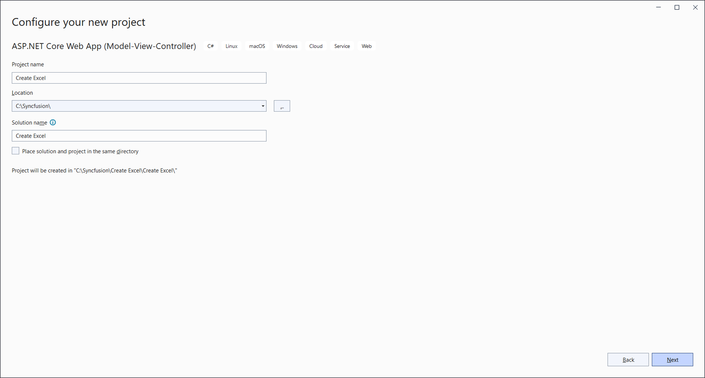

Step 3: Click the **Create** button.

Step 4: Install the [Syncfusion.XlsIO.Net.Core](https://www.nuget.org/packages/Syncfusion.XlsIO.Net.Core) NuGet package as a reference to your project from [NuGet.org](https://www.nuget.org/).

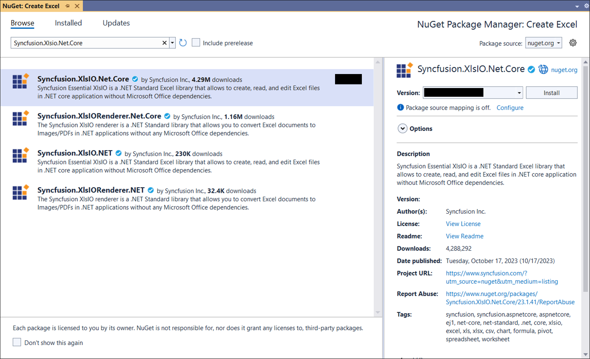

N> Starting with v16.2.0.x, if you reference Syncfusion assemblies from trial setup or from the NuGet feed, you also have to add "Syncfusion.Licensing" assembly reference and include a license key in your projects. Please refer to this [link](https://help.syncfusion.com/common/essential-studio/licensing/overview) to know about registering Syncfusion license key in your application to use our components.

Step 5: Include the following namespaces in the **HomeController.cs** file.




using Syncfusion.XlsIO;




Step 6: A default action method named Index will be present in HomeController.cs. Right click on Index method and select **Go To View** where you will be directed to its associated view page **Index.cshtml**.

Step 7: Add a new button in the Index.cshtml as shown below.




@{
    Html.BeginForm("CreateDocument", "Home", FormMethod.Get);
    {
        

            <input type="submit" value="Create Document" style="width:150px;height:27px" />
        

    }
    Html.EndForm();
}




Step 8: Add a new action method **CreateDocument** in HomeController.cs and include the below code snippet to **create Excel document** and download it.




//Create an instance of ExcelEngine
using (ExcelEngine excelEngine = new ExcelEngine())
{
  IApplication application = excelEngine.Excel;  
  application.DefaultVersion = ExcelVersion.Xlsx;
  
  //Create a workbook
  IWorkbook workbook = application.Workbooks.Create(1);
  IWorksheet worksheet = workbook.Worksheets[0];
  
  //Adding a picture
  FileStream imageStream = new FileStream("AdventureCycles-Logo.png", FileMode.Open, FileAccess.Read);
  IPictureShape shape = worksheet.Pictures.AddPicture(1, 1, imageStream, 20, 20);
  
  //Disable gridlines in the worksheet
  worksheet.IsGridLinesVisible = false;
  
  //Enter values to the cells from A3 to A5
  worksheet.Range["A3"].Text = "46036 Michigan Ave";
  worksheet.Range["A4"].Text = "Canton, USA";
  worksheet.Range["A5"].Text = "Phone: +1 231-231-2310";
  
  //Make the text bold
  worksheet.Range["A3:A5"].CellStyle.Font.Bold = true;
  
  //Merge cells
  worksheet.Range["D1:E1"].Merge();
  
  //Enter text to the cell D1 and apply formatting.
  worksheet.Range["D1"].Text = "INVOICE";
  worksheet.Range["D1"].CellStyle.Font.Bold = true;
  worksheet.Range["D1"].CellStyle.Font.RGBColor = Color.FromArgb(42, 118, 189);
  worksheet.Range["D1"].CellStyle.Font.Size = 35;
  
  //Apply alignment in the cell D1
  worksheet.Range["D1"].CellStyle.HorizontalAlignment = ExcelHAlign.HAlignRight;
  worksheet.Range["D1"].CellStyle.VerticalAlignment = ExcelVAlign.VAlignTop;
  
  //Enter values to the cells from D5 to E8
  worksheet.Range["D5"].Text = "INVOICE#";
  worksheet.Range["E5"].Text = "DATE";
  worksheet.Range["D6"].Number = 1028;
  worksheet.Range["E6"].Value = "12/31/2018";
  worksheet.Range["D7"].Text = "CUSTOMER ID";
  worksheet.Range["E7"].Text = "TERMS";
  worksheet.Range["D8"].Number = 564;
  worksheet.Range["E8"].Text = "Due Upon Receipt";
  
  //Apply RGB backcolor to the cells from D5 to E8
  worksheet.Range["D5:E5"].CellStyle.Color = Color.FromArgb(42, 118, 189);
  worksheet.Range["D7:E7"].CellStyle.Color = Color.FromArgb(42, 118, 189);
  
  //Apply known colors to the text in cells D5 to E8
  worksheet.Range["D5:E5"].CellStyle.Font.Color = ExcelKnownColors.White;
  worksheet.Range["D7:E7"].CellStyle.Font.Color = ExcelKnownColors.White;
  
  //Make the text as bold from D5 to E8
  worksheet.Range["D5:E8"].CellStyle.Font.Bold = true;
  
  //Apply alignment to the cells from D5 to E8
  worksheet.Range["D5:E8"].CellStyle.HorizontalAlignment = ExcelHAlign.HAlignCenter;
  worksheet.Range["D5:E5"].CellStyle.VerticalAlignment = ExcelVAlign.VAlignCenter;
  worksheet.Range["D7:E7"].CellStyle.VerticalAlignment = ExcelVAlign.VAlignCenter;
  worksheet.Range["D6:E6"].CellStyle.VerticalAlignment = ExcelVAlign.VAlignTop;
  
  //Enter value and applying formatting in the cell A7
  worksheet.Range["A7"].Text = "  BILL TO";
  worksheet.Range["A7"].CellStyle.Color = Color.FromArgb(42, 118, 189);
  worksheet.Range["A7"].CellStyle.Font.Bold = true;
  worksheet.Range["A7"].CellStyle.Font.Color = ExcelKnownColors.White;
  
  //Apply alignment
  worksheet.Range["A7"].CellStyle.HorizontalAlignment = ExcelHAlign.HAlignLeft;
  worksheet.Range["A7"].CellStyle.VerticalAlignment = ExcelVAlign.VAlignCenter;
  
  //Enter values in the cells A8 to A12
  worksheet.Range["A8"].Text = "Steyn";
  worksheet.Range["A9"].Text = "Great Lakes Food Market";
  worksheet.Range["A10"].Text = "20 Whitehall Rd";
  worksheet.Range["A11"].Text = "North Muskegon,USA";
  worksheet.Range["A12"].Text = "+1 231-654-0000";
  
  //Create a Hyperlink for e-mail in the cell A13
  IHyperLink hyperlink = worksheet.HyperLinks.Add(worksheet.Range["A13"]);
  hyperlink.Type = ExcelHyperLinkType.Url;
  hyperlink.Address = "Steyn@greatlakes.com";
  hyperlink.ScreenTip = "Send Mail";
  
  //Merge column A and B from row 15 to 22
  worksheet.Range["A15:B15"].Merge();
  worksheet.Range["A16:B16"].Merge();
  worksheet.Range["A17:B17"].Merge();
  worksheet.Range["A18:B18"].Merge();
  worksheet.Range["A19:B19"].Merge();
  worksheet.Range["A20:B20"].Merge();
  worksheet.Range["A21:B21"].Merge();
  worksheet.Range["A22:B22"].Merge();
  
  //Enter details of products and prices
  worksheet.Range["A15"].Text = "  DESCRIPTION";
  worksheet.Range["C15"].Text = "QTY";
  worksheet.Range["D15"].Text = "UNIT PRICE";
  worksheet.Range["E15"].Text = "AMOUNT";
  worksheet.Range["A16"].Text = "Cabrales Cheese";
  worksheet.Range["A17"].Text = "Chocos";
  worksheet.Range["A18"].Text = "Pasta";
  worksheet.Range["A19"].Text = "Cereals";
  worksheet.Range["A20"].Text = "Ice Cream";
  worksheet.Range["C16"].Number = 3;
  worksheet.Range["C17"].Number = 2;
  worksheet.Range["C18"].Number = 1;
  worksheet.Range["C19"].Number = 4;
  worksheet.Range["C20"].Number = 3;
  worksheet.Range["D16"].Number = 21;
  worksheet.Range["D17"].Number = 54;
  worksheet.Range["D18"].Number = 10;
  worksheet.Range["D19"].Number = 20;
  worksheet.Range["D20"].Number = 30;
  worksheet.Range["D23"].Text = "Total";
  
  //Apply number format
  worksheet.Range["D16:E22"].NumberFormat = "$.00";
  worksheet.Range["E23"].NumberFormat = "$.00";
  
  //Apply incremental formula for column Amount by multiplying Qty and UnitPrice
  application.EnableIncrementalFormula = true;
  worksheet.Range["E16:E20"].Formula = "=C16*D16";
  
  //Formula for Sum the total
  worksheet.Range["E23"].Formula = "=SUM(E16:E22)";
  
  //Apply borders
  worksheet.Range["A16:E22"].CellStyle.Borders[ExcelBordersIndex.EdgeTop].LineStyle = ExcelLineStyle.Thin;
  worksheet.Range["A16:E22"].CellStyle.Borders[ExcelBordersIndex.EdgeBottom].LineStyle = ExcelLineStyle.Thin;
  worksheet.Range["A16:E22"].CellStyle.Borders[ExcelBordersIndex.EdgeTop].Color = ExcelKnownColors.Grey_25_percent;
  worksheet.Range["A16:E22"].CellStyle.Borders[ExcelBordersIndex.EdgeBottom].Color = ExcelKnownColors.Grey_25_percent;
  worksheet.Range["A23:E23"].CellStyle.Borders[ExcelBordersIndex.EdgeTop].LineStyle = ExcelLineStyle.Thin;
  worksheet.Range["A23:E23"].CellStyle.Borders[ExcelBordersIndex.EdgeBottom].LineStyle = ExcelLineStyle.Thin;
  worksheet.Range["A23:E23"].CellStyle.Borders[ExcelBordersIndex.EdgeTop].Color = ExcelKnownColors.Black;
  worksheet.Range["A23:E23"].CellStyle.Borders[ExcelBordersIndex.EdgeBottom].Color = ExcelKnownColors.Black;
  
  //Apply font setting for cells with product details
  worksheet.Range["A3:E23"].CellStyle.Font.FontName = "Arial";
  worksheet.Range["A3:E23"].CellStyle.Font.Size = 10;
  worksheet.Range["A15:E15"].CellStyle.Font.Color = ExcelKnownColors.White;
  worksheet.Range["A15:E15"].CellStyle.Font.Bold = true;
  worksheet.Range["D23:E23"].CellStyle.Font.Bold = true;
  
  //Apply cell color
  worksheet.Range["A15:E15"].CellStyle.Color = Color.FromArgb(42, 118, 189);
  
  //Apply alignment to cells with product details
  worksheet.Range["A15"].CellStyle.HorizontalAlignment = ExcelHAlign.HAlignLeft;
  worksheet.Range["C15:C22"].CellStyle.HorizontalAlignment = ExcelHAlign.HAlignCenter;
  worksheet.Range["D15:E15"].CellStyle.HorizontalAlignment = ExcelHAlign.HAlignCenter;
  
  //Apply row height and column width to look good
  worksheet.Range["A1"].ColumnWidth = 36;
  worksheet.Range["B1"].ColumnWidth = 11;
  worksheet.Range["C1"].ColumnWidth = 8;
  worksheet.Range["D1:E1"].ColumnWidth = 18;
  worksheet.Range["A1"].RowHeight = 47;
  worksheet.Range["A2"].RowHeight = 15;
  worksheet.Range["A3:A4"].RowHeight = 15;
  worksheet.Range["A5"].RowHeight = 18;
  worksheet.Range["A6"].RowHeight = 29;
  worksheet.Range["A7"].RowHeight = 18;
  worksheet.Range["A8"].RowHeight = 15;
  worksheet.Range["A9:A14"].RowHeight = 15;
  worksheet.Range["A15:A23"].RowHeight = 18;  
  
  //Saving the Excel to the MemoryStream 
  MemoryStream stream = new MemoryStream();  
  workbook.SaveAs(stream);
  
  //Set the position as '0'.
  stream.Position = 0;
  
  //Download the Excel file in the browser
  FileStreamResult fileStreamResult = new FileStreamResult(stream, "application/excel");  
  fileStreamResult.FileDownloadName = "Output.xlsx";  
  return fileStreamResult;
}




## Move application to App Engine

Step 1: Open the **Cloud Shell editor**.

Step 2: Drag and drop the sample from your local machine to **Workspace**.

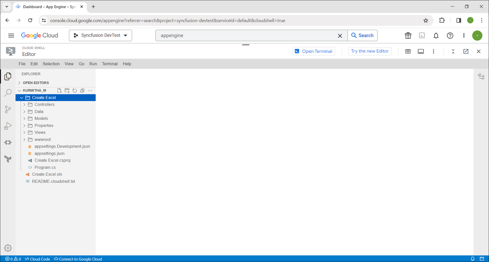

N> If you have your sample application in your local machine, drag and drop it into the Workspace. If you created the sample using the Cloud Shell terminal command, it will be available in the Workspace.

Step 3: Open the Cloud Shell Terminal and run the following **command** to view the files and directories within your **current Workspace**.




ls




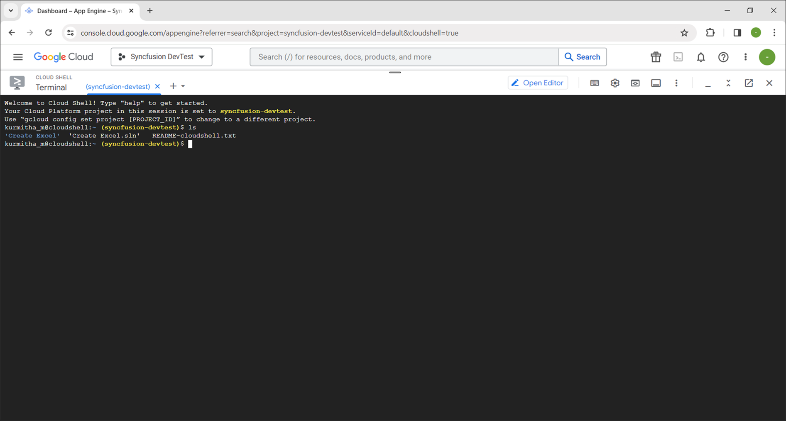

Step 4: Run the following **command** to navigate which sample you want run.




cd Create\ Excel




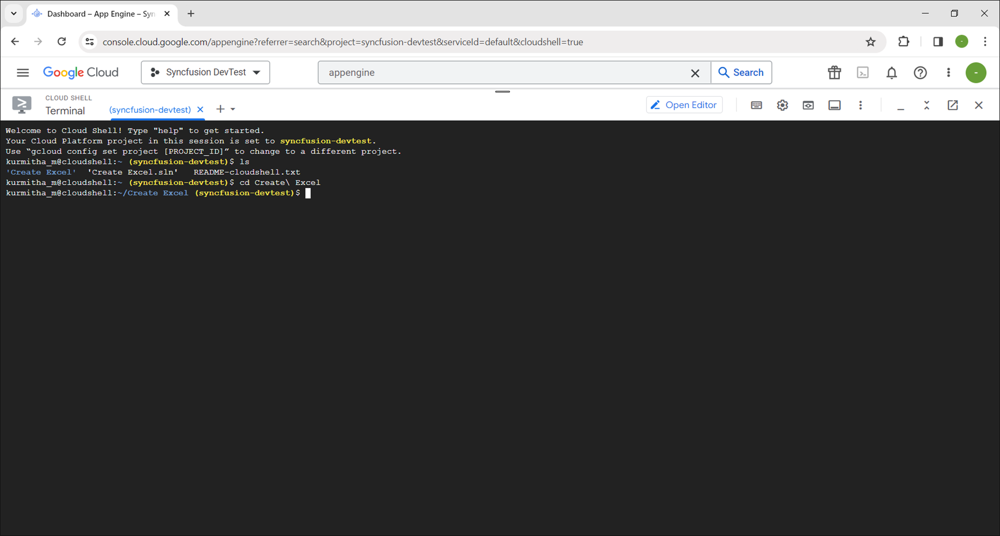

Step 5: To ensure that the sample is working correctly, please run the application using the following command.




dotnet run --urls=http://localhost:8080




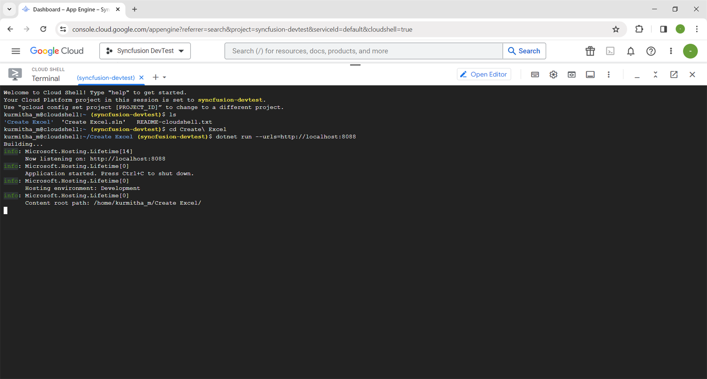

Step 6: Verify that the application is running properly by accessing the **Web View** -> **Preview on port 8080**.

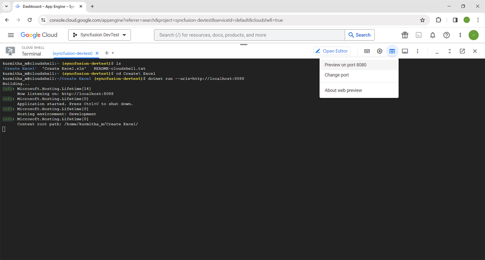

Step 7: Now you can see the sample output on the preview page.

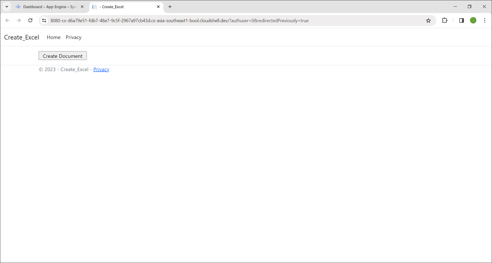

Step 8: Close the preview page and return to the terminal then press **Ctrl+C** for which will typically stop the process.

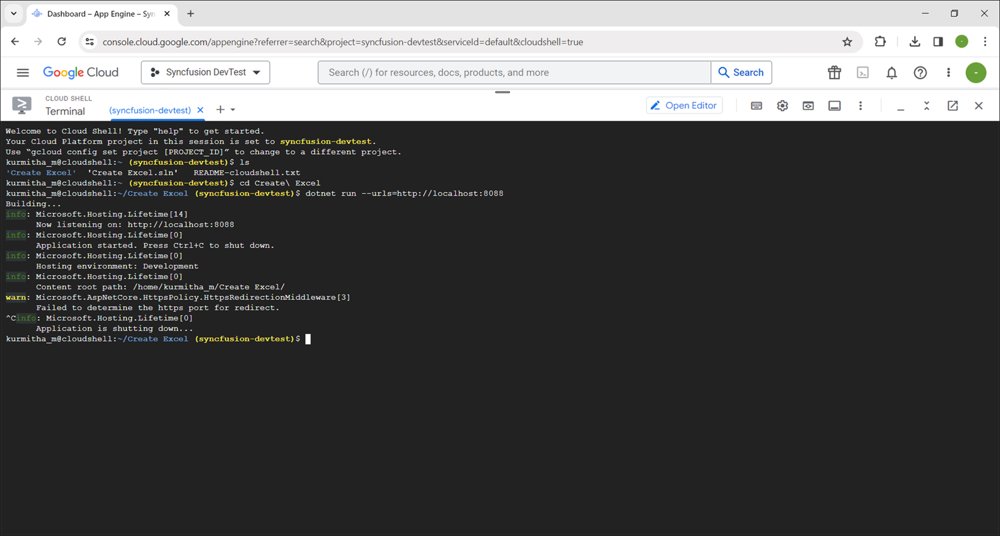

## Publish the application

Step 1: Run the following command in **Cloud Shell Terminal** to publish the application.




dotnet publish -c Release




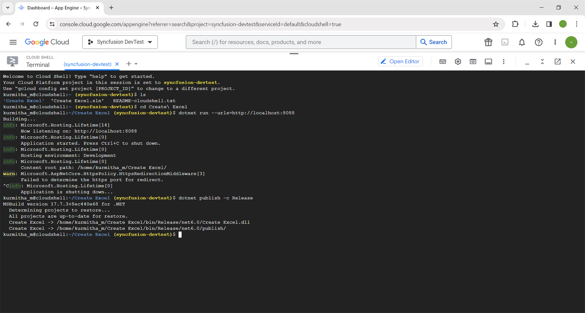

Step 2: Run the following command in **Cloud Shell Terminal** to navigate to the publish folder.



cd bin/Release/net6.0/publish/




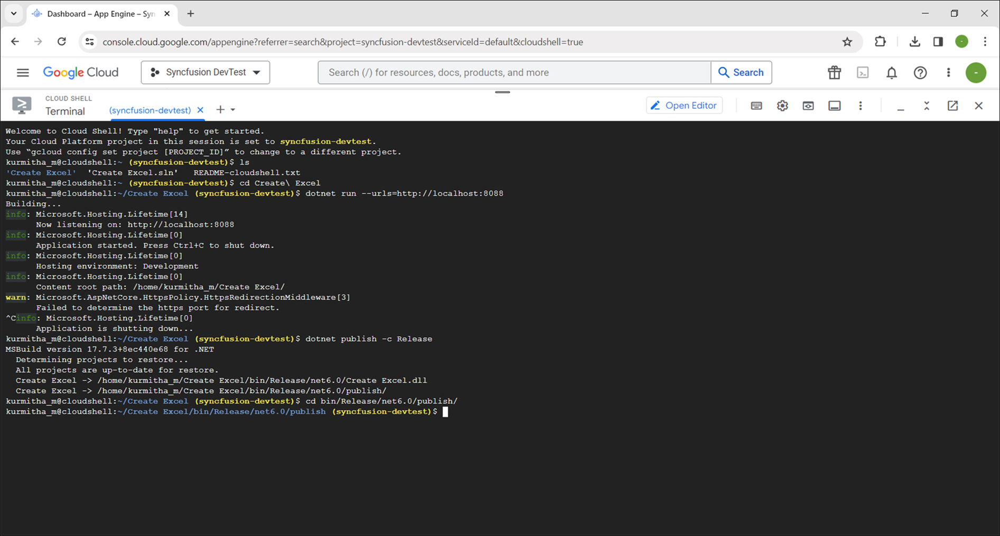

## Configure app.yaml and docker file

Step 1: Add the app.yaml file to the publish folder with the following contents.




cat <<EOT >> app.yaml
env: flex
runtime: custom   
EOT




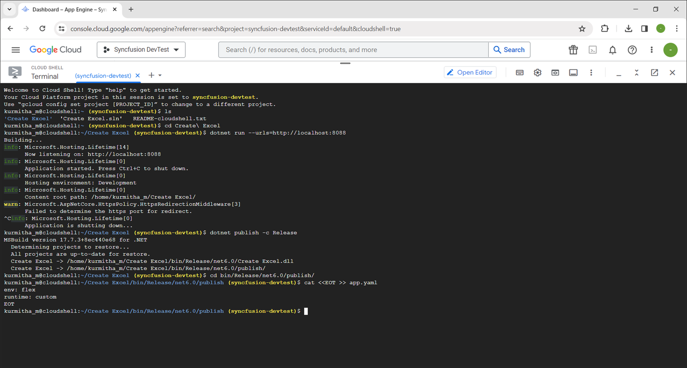

Step 2: Add the Docker file to the publish folder with the following contents.




cat <<EOT >> Dockerfile
FROM mcr.microsoft.com/dotnet/aspnet:6.0
RUN apt-get update -y && apt-get install libfontconfig -y
ADD / /app
EXPOSE 8080
ENV ASPNETCORE_URLS=http://*:8080
WORKDIR /app
ENTRYPOINT [ "dotnet", "Create Excel.dll"]
EOT




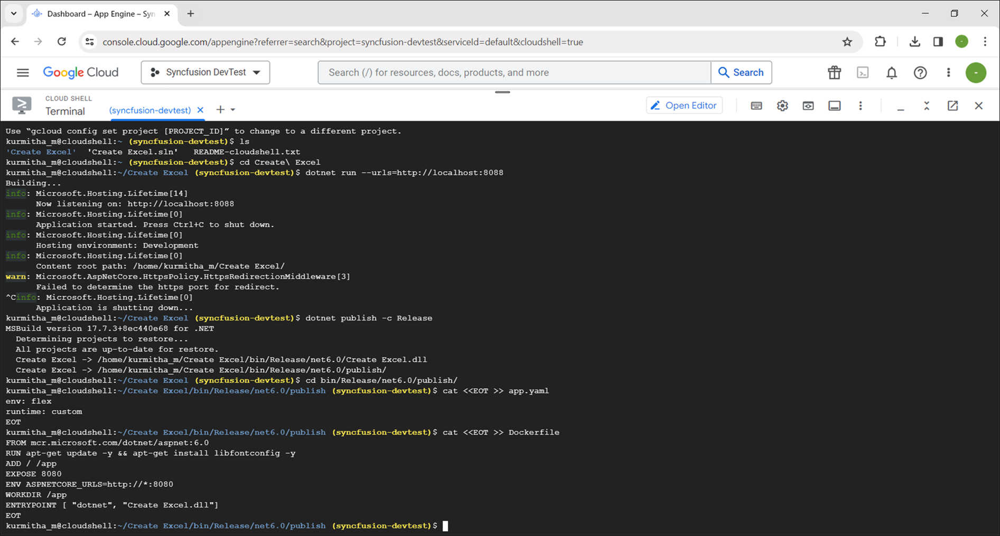

Step 3: You can ensure **Docker** and **app.yaml** files are added in **Workspace**.

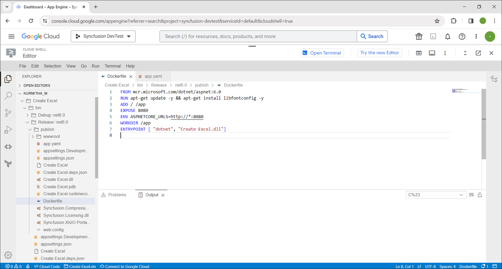

## Deploy to App Engine

Step 1: To deploy the application to the App Engine, run the following command in Cloud Shell Terminal. Afterwards, retrieve the **URL** from the Cloud Shell Terminal.




gcloud app deploy --version v0




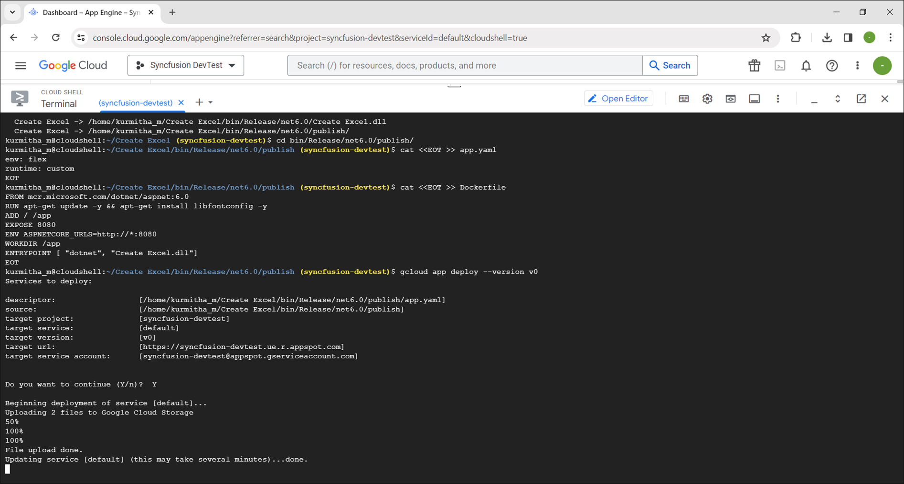

Step 2: Open the **URL** to access the application, which has been successfully deployed.

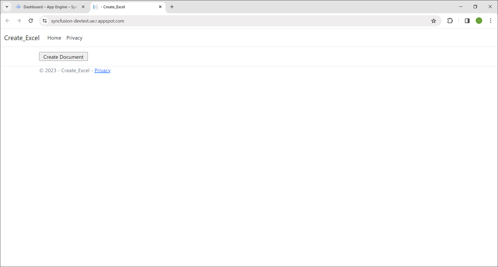

A complete working example of how to create an Excel file in GCP is present on [this GitHub page](https://github.com/SyncfusionExamples/XlsIO-Examples/tree/master/Getting%20Started/ASP.NET%20Core/Create%20Excel).

By executing the program, you will get the **Excel document** as follows. The output will be saved in **bin** folder.

## Read and Edit Excel file

The below code snippet illustrates how to read and edit an Excel file in GCP.




using (ExcelEngine excelEngine = new ExcelEngine())
{
    //Instantiate the Excel application object
    IApplication application = excelEngine.Excel;

    //Assigns default application version
    application.DefaultVersion = ExcelVersion.Xlsx;

    //A existing workbook is opened.
    FileStream inputStream = new FileStream("InputTemplate.xlsx", FileMode.Open, FileAccess.Read);
    IWorkbook workbook = application.Workbooks.Open(inputStream);

    //Access first worksheet from the workbook.
    IWorksheet worksheet = workbook.Worksheets[0];

    //Set Text in cell A3.
    worksheet.Range["A3"].Text = "Hello World";

    //Saving the Excel to the MemoryStream 
    MemoryStream stream = new MemoryStream();
    workbook.SaveAs(stream);

    //Set the position as '0'.
    stream.Position = 0;

    //Download the Excel file in the browser
    FileStreamResult fileStreamResult = new FileStreamResult(stream, "application/excel");
    fileStreamResult.FileDownloadName = "EditExcel.xlsx";
    return fileStreamResult;
}




A complete working example of how to read and edit an Excel file in GCP is present on [this GitHub page](https://github.com/SyncfusionExamples/XlsIO-Examples/tree/master/Getting%20Started/ASP.NET%20Core/Edit%20Excel).

Click [here](https://www.syncfusion.com/document-processing/excel-framework/net-core) to explore the rich set of Syncfusion Excel library (XlsIO) features.

An online sample link to [create an Excel document](https://ej2.syncfusion.com/aspnetcore/Excel/Create#/material3) in ASP.NET Core.