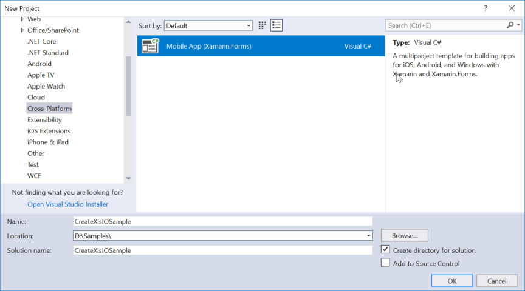
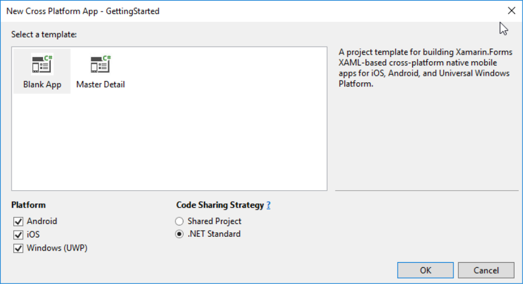
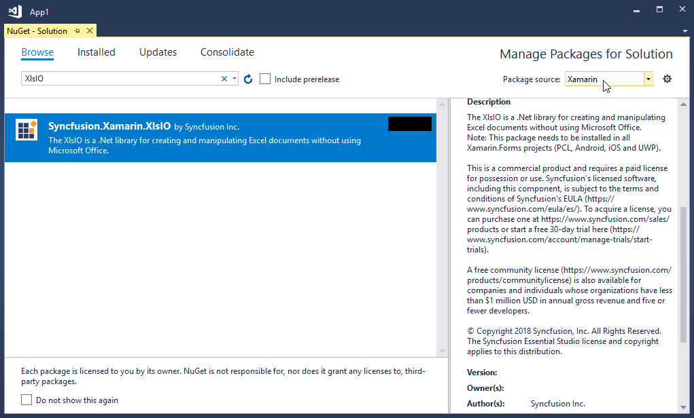

# Create, read, and edit Excel files in Xamarin

[Syncfusion Excel library for Xamarin platform](https://www.syncfusion.com/excel-framework/xamarin/excel-library) can be used to create, read, edit Excel files. This also convert Excel files to PDF.

## Create a simple Excel report

The below steps illustrates creating an simple Invoice formatted Excel document in Xamarin application.

1.Create a new C# Xamarin.Forms application project.

2.Select a project template and required platforms to deploy the application. In this application the portable assemblies to be shared across multiple platforms, the .NET Standard code sharing strategy has been selected. For more details about code sharing refer [here](https://docs.microsoft.com/en-us/xamarin/cross-platform/app-fundamentals/code-sharing).

N>If .NET Standard is not available in the code sharing strategy, the Portable Class Library (PCL) can be selected.

3.Install the [Syncfusion.Xamarin.XlsIO](https://www.nuget.org/packages/Syncfusion.Xamarin.XlsIO/) NuGet package as reference to your .NET Standard applications from [NuGet.org](https://www.nuget.org).

4.Add new Forms XAML page in portable project If there is no XAML page is defined in the App class. Otherwise proceed to the next step.

i)	To add the new XAML page, right click on the project and select Add > New Item and add a Forms XAML Page from the list. Name it as MainXamlPage.

ii)	In App class of portable project (App.cs), replace the existing constructor of App class with the code snippet given below which invokes the MainXamlPage.

  

public App()
{
    // The root page of your application
    MainPage = new MainXamlPage();

}



Public Sub New()
    'The root page of your application
    MainPage = New MainXamlPage()
End Sub

  

5.In the MainXamlPage.xaml add new button as shown below.
  

<ContentPage xmlns="http://xamarin.com/schemas/2014/forms"
             xmlns:x="http://schemas.microsoft.com/winfx/2009/xaml"
             x:Class="GettingStarted. MainXamlPage">
<StackLayout VerticalOptions="Center">

<Button Text="Generate Document" Clicked="OnButtonClicked" HorizontalOptions="Center"/>

</StackLayout> </ContentPage>

  

6.Include the following namespace in the MainXamlPage.xaml.cs file.

  

using Syncfusion.XlsIO;
using System.Reflection;
using Color = Syncfusion.Drawing.Color;



Imports Syncfusion.XlsIO
Imports System.Reflection
Imports Color = Syncfusion.Drawing.Color

   

7.Include the below code snippet in the click event of the button in MainXamlPage.xaml.cs, to create an Excel file and save it in a stream.

  

void OnButtonClicked(object sender, EventArgs args)
{
//Create an instance of ExcelEngine.
using (ExcelEngine excelEngine = new ExcelEngine())
{
	IApplication application = excelEngine.Excel;

	application.DefaultVersion = ExcelVersion.Excel2016;

	//Create a workbook with a worksheet
	IWorkbook workbook = excelEngine.Excel.Workbooks.Create(1);

	//Access first worksheet from the workbook instance.
	IWorksheet worksheet = workbook.Worksheets[0];

	Assembly executingAssembly = typeof(MainPage).GetTypeInfo().Assembly;
	Stream inputStream = executingAssembly.GetManifestResourceStream("GettingStarted.AdventureCycles-Logo.png");

	//Add a picture
	IPictureShape shape = worksheet.Pictures.AddPicture(1, 1, inputStream);

	//Disable gridlines in the worksheet
	worksheet.IsGridLinesVisible = false;

	//Enter values to the cells from A3 to A5
	worksheet.Range["A3"].Text = "46036 Michigan Ave";
	worksheet.Range["A4"].Text = "Canton, USA";
	worksheet.Range["A5"].Text = "Phone: +1 231-231-2310";

	//Make the text bold
	worksheet.Range["A3:A5"].CellStyle.Font.Bold = true;

	//Merge cells
	worksheet.Range["D1:E1"].Merge();

	//Enter text to the cell D1 and apply formatting.
	worksheet.Range["D1"].Text = "INVOICE";
	worksheet.Range["D1"].CellStyle.Font.Bold = true;
	worksheet.Range["D1"].CellStyle.Font.RGBColor = Color.FromArgb(42, 118, 189);
	worksheet.Range["D1"].CellStyle.Font.Size = 35;

	//Apply alignment in the cell D1
	worksheet.Range["D1"].CellStyle.HorizontalAlignment = ExcelHAlign.HAlignRight;
	worksheet.Range["D1"].CellStyle.VerticalAlignment = ExcelVAlign.VAlignTop;

	//Enter values to the cells from D5 to E8
	worksheet.Range["D5"].Text = "INVOICE#";
	worksheet.Range["E5"].Text = "DATE";
	worksheet.Range["D6"].Number = 1028;
	worksheet.Range["E6"].Value = "12/31/2018";
	worksheet.Range["D7"].Text = "CUSTOMER ID";
	worksheet.Range["E7"].Text = "TERMS";
	worksheet.Range["D8"].Number = 564;
	worksheet.Range["E8"].Text = "Due Upon Receipt";

	//Apply RGB backcolor to the cells from D5 to E8
	worksheet.Range["D5:E5"].CellStyle.Color = Color.FromArgb(42, 118, 189);
	worksheet.Range["D7:E7"].CellStyle.Color = Color.FromArgb(42, 118, 189);

	//Apply known colors to the text in cells D5 to E8
	worksheet.Range["D5:E5"].CellStyle.Font.Color = ExcelKnownColors.White;
	worksheet.Range["D7:E7"].CellStyle.Font.Color = ExcelKnownColors.White;

	//Make the text as bold from D5 to E8
	worksheet.Range["D5:E8"].CellStyle.Font.Bold = true;

	//Apply alignment to the cells from D5 to E8
	worksheet.Range["D5:E8"].CellStyle.HorizontalAlignment = ExcelHAlign.HAlignCenter;
	worksheet.Range["D5:E5"].CellStyle.VerticalAlignment = ExcelVAlign.VAlignCenter;
	worksheet.Range["D7:E7"].CellStyle.VerticalAlignment = ExcelVAlign.VAlignCenter;
	worksheet.Range["D6:E6"].CellStyle.VerticalAlignment = ExcelVAlign.VAlignTop;

	//Enter value and applying formatting in the cell A7
	worksheet.Range["A7"].Text = "  BILL TO";
	worksheet.Range["A7"].CellStyle.Color = Color.FromArgb(42, 118, 189);
	worksheet.Range["A7"].CellStyle.Font.Bold = true;
	worksheet.Range["A7"].CellStyle.Font.Color = ExcelKnownColors.White;

	//Apply alignment
	worksheet.Range["A7"].CellStyle.HorizontalAlignment = ExcelHAlign.HAlignLeft;
	worksheet.Range["A7"].CellStyle.VerticalAlignment = ExcelVAlign.VAlignCenter;

	//Enter values in the cells A8 to A12
	worksheet.Range["A8"].Text = "Steyn";
	worksheet.Range["A9"].Text = "Great Lakes Food Market";
	worksheet.Range["A10"].Text = "20 Whitehall Rd";
	worksheet.Range["A11"].Text = "North Muskegon,USA";
	worksheet.Range["A12"].Text = "+1 231-654-0000";

	//Create a Hyperlink for e-mail in the cell A13
	IHyperLink hyperlink = worksheet.HyperLinks.Add(worksheet.Range["A13"]);
	hyperlink.Type = ExcelHyperLinkType.Url;
	hyperlink.Address = "Steyn@greatlakes.com";
	hyperlink.ScreenTip = "Send Mail";

	//Enter details of products and prices
	worksheet.Range["A15"].Text = "  DESCRIPTION";
	worksheet.Range["C15"].Text = "QTY";
	worksheet.Range["D15"].Text = "UNIT PRICE";
	worksheet.Range["E15"].Text = "AMOUNT";
	worksheet.Range["A16"].Text = "Cabrales Cheese";
	worksheet.Range["A17"].Text = "Chocos";
	worksheet.Range["A18"].Text = "Pasta";
	worksheet.Range["A19"].Text = "Cereals";
	worksheet.Range["A20"].Text = "Ice Cream";
	worksheet.Range["C16"].Number = 3;
	worksheet.Range["C17"].Number = 2;
	worksheet.Range["C18"].Number = 1;
	worksheet.Range["C19"].Number = 4;
	worksheet.Range["C20"].Number = 3;
	worksheet.Range["D16"].Number = 21;
	worksheet.Range["D17"].Number = 54;
	worksheet.Range["D18"].Number = 10;
	worksheet.Range["D19"].Number = 20;
	worksheet.Range["D20"].Number = 30;
	worksheet.Range["D23"].Text = "Total";

	//Apply number format
	worksheet.Range["D16:E22"].NumberFormat = "$.00";
	worksheet.Range["E23"].NumberFormat = "$.00";

	//Merge column A and B from row 15 to 22
	worksheet.Range["A15:B15"].Merge();
	worksheet.Range["A16:B16"].Merge();
	worksheet.Range["A17:B17"].Merge();
	worksheet.Range["A18:B18"].Merge();
	worksheet.Range["A19:B19"].Merge();
	worksheet.Range["A20:B20"].Merge();
	worksheet.Range["A21:B21"].Merge();
	worksheet.Range["A22:B22"].Merge();

	//Apply incremental formula for column Amount by multiplying Qty and UnitPrice
	application.EnableIncrementalFormula = true;
	worksheet.Range["E16:E20"].Formula = "=C16*D16";

	//Formula for Sum the total
	worksheet.Range["E23"].Formula = "=SUM(E16:E22)";

	//Apply borders
	worksheet.Range["A16:E22"].CellStyle.Borders[ExcelBordersIndex.EdgeTop].LineStyle = ExcelLineStyle.Thin;
	worksheet.Range["A16:E22"].CellStyle.Borders[ExcelBordersIndex.EdgeBottom].LineStyle = ExcelLineStyle.Thin;
	worksheet.Range["A16:E22"].CellStyle.Borders[ExcelBordersIndex.EdgeTop].Color = ExcelKnownColors.Grey_25_percent;
	worksheet.Range["A16:E22"].CellStyle.Borders[ExcelBordersIndex.EdgeBottom].Color = ExcelKnownColors.Grey_25_percent;
	worksheet.Range["A23:E23"].CellStyle.Borders[ExcelBordersIndex.EdgeTop].LineStyle = ExcelLineStyle.Thin;
	worksheet.Range["A23:E23"].CellStyle.Borders[ExcelBordersIndex.EdgeBottom].LineStyle = ExcelLineStyle.Thin;
	worksheet.Range["A23:E23"].CellStyle.Borders[ExcelBordersIndex.EdgeTop].Color = ExcelKnownColors.Black;
	worksheet.Range["A23:E23"].CellStyle.Borders[ExcelBordersIndex.EdgeBottom].Color = ExcelKnownColors.Black;

	//Apply font setting for cells with product details
	worksheet.Range["A3:E23"].CellStyle.Font.FontName = "Arial";
	worksheet.Range["A3:E23"].CellStyle.Font.Size = 10;
	worksheet.Range["A15:E15"].CellStyle.Font.Color = ExcelKnownColors.White;
	worksheet.Range["A15:E15"].CellStyle.Font.Bold = true;
	worksheet.Range["D23:E23"].CellStyle.Font.Bold = true;

	//Apply cell color
	worksheet.Range["A15:E15"].CellStyle.Color = Color.FromArgb(42, 118, 189);

	//Apply alignment to cells with product details
	worksheet.Range["A15"].CellStyle.HorizontalAlignment = ExcelHAlign.HAlignLeft;
	worksheet.Range["C15:C22"].CellStyle.HorizontalAlignment = ExcelHAlign.HAlignCenter;
	worksheet.Range["D15:E15"].CellStyle.HorizontalAlignment = ExcelHAlign.HAlignCenter;

	//Apply row height and column width to look good
	worksheet.Range["A1"].ColumnWidth = 36;
	worksheet.Range["B1"].ColumnWidth = 11;
	worksheet.Range["C1"].ColumnWidth = 8;
	worksheet.Range["D1:E1"].ColumnWidth = 18;
	worksheet.Range["A1"].RowHeight = 47;
	worksheet.Range["A2"].RowHeight = 15;
	worksheet.Range["A3:A4"].RowHeight = 15;
	worksheet.Range["A5"].RowHeight = 18;
	worksheet.Range["A6"].RowHeight = 29;
	worksheet.Range["A7"].RowHeight = 18;
	worksheet.Range["A8"].RowHeight = 15;
	worksheet.Range["A9:A14"].RowHeight = 15;
	worksheet.Range["A15:A23"].RowHeight = 18;

	//Save the workbook to stream in xlsx format. 
	MemoryStream stream = new MemoryStream();
	workbook.SaveAs(stream);

	workbook.Close();

	//Save the stream as a file in the device and invoke it for viewing
	Xamarin.Forms.DependencyService.Get<ISave>().SaveAndView("GettingStared.xlsx", "application/msexcel", stream);
}



Private Sub OnButtonClicked(ByVal sender As Object, ByVal args As EventArgs)
'Create an instance of ExcelEngine
Using excelEngine As ExcelEngine = New ExcelEngine()

	Dim application As IApplication = excelEngine.Excel

	application.DefaultVersion = ExcelVersion.Excel2016

	'Create a workbook
	Dim workbook As IWorkbook = application.Workbooks.Create(1)
	Dim worksheet As IWorksheet = workbook.Worksheets(0)

	'Adding a picture
	Dim executingAssembly As Assembly = GetType(MainPage).GetTypeInfo().Assembly
	Dim inputStream As Stream = executingAssembly.GetManifestResourceStream("GettingStarted.AdventureCycles-Logo.png")
	Dim shape As IPictureShape = worksheet.Pictures.AddPicture(1, 1, inputStream)

	'Disable gridlines in the worksheet
	worksheet.IsGridLinesVisible = False

	'Enter values to the cells from A3 to A5
	worksheet.Range("A3").Text = "46036 Michigan Ave"
	worksheet.Range("A4").Text = "Canton, USA"
	worksheet.Range("A5").Text = "Phone: +1 231-231-2310"

	'Make the text bold
	worksheet.Range("A3:A5").CellStyle.Font.Bold = True

	'Merge cells
	worksheet.Range("D1:E1").Merge()

	'Enter text to the cell D1 and apply formatting.
	worksheet.Range("D1").Text = "INVOICE"
	worksheet.Range("D1").CellStyle.Font.Bold = True
	worksheet.Range("D1").CellStyle.Font.RGBColor = Color.FromArgb(42, 118, 189)
	worksheet.Range("D1").CellStyle.Font.Size = 35

	'Apply alignment in the cell D1
	worksheet.Range("D1").CellStyle.HorizontalAlignment = ExcelHAlign.HAlignRight
	worksheet.Range("D1").CellStyle.VerticalAlignment = ExcelVAlign.VAlignTop

	'Enter values to the cells from D5 to E8
	worksheet.Range("D5").Text = "INVOICE#"
	worksheet.Range("E5").Text = "DATE"
	worksheet.Range("D6").Number = 1028
	worksheet.Range("E6").Value = "12/31/2018"
	worksheet.Range("D7").Text = "CUSTOMER ID"
	worksheet.Range("E7").Text = "TERMS"
	worksheet.Range("D8").Number = 564
	worksheet.Range("E8").Text = "Due Upon Receipt"

	'Apply RGB back color to the cells from D5 to E8
	worksheet.Range("D5:E5").CellStyle.Color = Color.FromArgb(42, 118, 189)
	worksheet.Range("D7:E7").CellStyle.Color = Color.FromArgb(42, 118, 189)

	'Apply known colors to the text in cells D5 to E8
	worksheet.Range("D5:E5").CellStyle.Font.Color = ExcelKnownColors.White
	worksheet.Range("D7:E7").CellStyle.Font.Color = ExcelKnownColors.White

	'Make the text as bold from D5 to E8
	worksheet.Range("D5:E8").CellStyle.Font.Bold = True

	'Apply alignment to the cells from D5 to E8
	worksheet.Range("D5:E8").CellStyle.HorizontalAlignment = ExcelHAlign.HAlignCenter
	worksheet.Range("D5:E5").CellStyle.VerticalAlignment = ExcelVAlign.VAlignCenter
	worksheet.Range("D7:E7").CellStyle.VerticalAlignment = ExcelVAlign.VAlignCenter
	worksheet.Range("D6:E6").CellStyle.VerticalAlignment = ExcelVAlign.VAlignTop

	'Enter value and applying formatting in the cell A7
	worksheet.Range("A7").Text = "  BILL TO"
	worksheet.Range("A7").CellStyle.Color = Color.FromArgb(42, 118, 189)
	worksheet.Range("A7").CellStyle.Font.Bold = True
	worksheet.Range("A7").CellStyle.Font.Color = ExcelKnownColors.White

	'Apply alignment
	worksheet.Range("A7").CellStyle.HorizontalAlignment = ExcelHAlign.HAlignLeft
	worksheet.Range("A7").CellStyle.VerticalAlignment = ExcelVAlign.VAlignCenter

	'Enter values in the cells A8 to A12
	worksheet.Range("A8").Text = "Steyn"
	worksheet.Range("A9").Text = "Great Lakes Food Market"
	worksheet.Range("A10").Text = "20 Whitehall Rd"
	worksheet.Range("A11").Text = "North Muskegon,USA"
	worksheet.Range("A12").Text = "+1 231-654-0000"

	'Create a Hyperlink for e-mail in the cell A13
	Dim hyperlink As IHyperLink = worksheet.HyperLinks.Add(worksheet.Range("A13"))
	hyperlink.Type = ExcelHyperLinkType.Url
	hyperlink.Address = "Steyn@greatlakes.com"
	hyperlink.ScreenTip = "Send Mail"

	'Merge column A and B from row 15 to 22
	worksheet.Range("A15:B15").Merge()
	worksheet.Range("A16:B16").Merge()
	worksheet.Range("A17:B17").Merge()
	worksheet.Range("A18:B18").Merge()
	worksheet.Range("A19:B19").Merge()
	worksheet.Range("A20:B20").Merge()
	worksheet.Range("A21:B21").Merge()
	worksheet.Range("A22:B22").Merge()

	'Enter details of products and prices
	worksheet.Range("A15").Text = "  DESCRIPTION"
	worksheet.Range("C15").Text = "QTY"
	worksheet.Range("D15").Text = "UNIT PRICE"
	worksheet.Range("E15").Text = "AMOUNT"
	worksheet.Range("A16").Text = "Cabrales Cheese"
	worksheet.Range("A17").Text = "Chocos"
	worksheet.Range("A18").Text = "Pasta"
	worksheet.Range("A19").Text = "Cereals"
	worksheet.Range("A20").Text = "Ice Cream"
	worksheet.Range("C16").Number = 3
	worksheet.Range("C17").Number = 2
	worksheet.Range("C18").Number = 1
	worksheet.Range("C19").Number = 4
	worksheet.Range("C20").Number = 3
	worksheet.Range("D16").Number = 21
	worksheet.Range("D17").Number = 54
	worksheet.Range("D18").Number = 10
	worksheet.Range("D19").Number = 20
	worksheet.Range("D20").Number = 30
	worksheet.Range("D23").Text = "Total"

	'Apply number format
	worksheet.Range("D16:E22").NumberFormat = "$.00"
	worksheet.Range("E23").NumberFormat = "$.00"

	'Apply incremental formula for column Amount by multiplying Qty and UnitPrice
	application.EnableIncrementalFormula = True
	worksheet.Range("E16:E20").Formula = "=C16*D16"

	'Formula for Sum the total
	worksheet.Range("E23").Formula = "=SUM(E16:E22)"

	'Apply borders
	worksheet.Range("A16:E22").CellStyle.Borders(ExcelBordersIndex.EdgeTop).LineStyle = ExcelLineStyle.Thin
	worksheet.Range("A16:E22").CellStyle.Borders(ExcelBordersIndex.EdgeBottom).LineStyle = ExcelLineStyle.Thin
	worksheet.Range("A16:E22").CellStyle.Borders(ExcelBordersIndex.EdgeTop).Color = ExcelKnownColors.Grey_25_percent
	worksheet.Range("A16:E22").CellStyle.Borders(ExcelBordersIndex.EdgeBottom).Color = ExcelKnownColors.Grey_25_percent
	worksheet.Range("A23:E23").CellStyle.Borders(ExcelBordersIndex.EdgeTop).LineStyle = ExcelLineStyle.Thin
	worksheet.Range("A23:E23").CellStyle.Borders(ExcelBordersIndex.EdgeBottom).LineStyle = ExcelLineStyle.Thin
	worksheet.Range("A23:E23").CellStyle.Borders(ExcelBordersIndex.EdgeTop).Color = ExcelKnownColors.Black
	worksheet.Range("A23:E23").CellStyle.Borders(ExcelBordersIndex.EdgeBottom).Color = ExcelKnownColors.Black

	'Apply font setting for cells with product details
	worksheet.Range("A3:E23").CellStyle.Font.FontName = "Arial"
	worksheet.Range("A3:E23").CellStyle.Font.Size = 10
	worksheet.Range("A15:E15").CellStyle.Font.Color = ExcelKnownColors.White
	worksheet.Range("A15:E15").CellStyle.Font.Bold = True
	worksheet.Range("D23:E23").CellStyle.Font.Bold = True

	'Apply cell color
	worksheet.Range("A15:E15").CellStyle.Color = Color.FromArgb(42, 118, 189)

	'Apply alignment to cells with product details
	worksheet.Range("A15").CellStyle.HorizontalAlignment = ExcelHAlign.HAlignLeft
	worksheet.Range("C15:C22").CellStyle.HorizontalAlignment = ExcelHAlign.HAlignCenter
	worksheet.Range("D15:E15").CellStyle.HorizontalAlignment = ExcelHAlign.HAlignCenter

	'Apply row height and column width to look good
	worksheet.Range("A1").ColumnWidth = 36
	worksheet.Range("B1").ColumnWidth = 11
	worksheet.Range("C1").ColumnWidth = 8
	worksheet.Range("D1:E1").ColumnWidth = 18
	worksheet.Range("A1").RowHeight = 47
	worksheet.Range("A2").RowHeight = 15
	worksheet.Range("A3:A4").RowHeight = 15
	worksheet.Range("A5").RowHeight = 18
	worksheet.Range("A6").RowHeight = 29
	worksheet.Range("A7").RowHeight = 18
	worksheet.Range("A8").RowHeight = 15
	worksheet.Range("A9:A14").RowHeight = 15
	worksheet.Range("A15:A23").RowHeight = 18

	'Saving the Excel to the MemoryStream 			
	Dim stream As MemoryStream = New MemoryStream()
	workbook.SaveAs(stream)

	workbook.Close()
	
	'Save the stream as a file in the device and invoke it for viewing
	Xamarin.Forms.DependencyService.[Get](Of ISave)().SaveAndView("GettingStared.xlsx", "application/msexcel", stream)
End Using

  

8.Download the helper files from this [link](http://www.syncfusion.com/downloads/support/directtrac/general/HELPER~1-696201504.ZIP) and add them into the mentioned project. These helper files allow you to save the stream as a physical file and open the file for viewing.

<table>
<tr>
<thead><th>
Project</th>
<th>
File Name
</th>
<th>
Summary
</th>
</thead>
</tr>
<tbody>
<tr>
<td>
Portable project
</td>
<td>
ISave.cs
</td>
<td>
Represent the base interface for save operation
</td>
</tr>
<tr>
<td>
iOS Project
</td>
<td>
<ul>
<li>SaveIOS.cs</li>
<li>PreviewControllerDS.cs</li>
</ul>
</td>
<td>
<ul>
<li>Save implementation for iOS device</li>
<li>Helper class for viewing the Excel file in iOS device</li>
</ul>
</td>
</tr>
<tr>
<td>
Android project
</td>
<td>
SaveAndroid.cs
</td>
<td>
Save implementation for Android device
</td>
</tr>
<tr>
<td>
WinPhone project
</td>
<td>
SaveWinPhone.cs
</td>
<td>
Save implementation for Windows Phone device
</td>
</tr>
<tr>
<td>
UWP project
</td>
<td>
SaveWindows.cs
</td>
<td>
Save implementation for UWP device.
</td>
</tr>
<tr>
<td>
Windows(8.1) project 
</td>
<td>
SaveWindows81.cs
</td>
<td>
Save implementation for WinRT device.
</td>
</tr>
</tbody>
</table>

9.Compile and execute the application. Now this application creates a simple Excel document.

A complete working example of how to create an Excel file in Xamarin can be downloaded from [Create-Excel-file.zip](http://www.syncfusion.com/downloads/support/directtrac/general/ze/GettingStarted79812135.zip).

By executing the program, you will get the Excel file as below.

## Read and Edit Excel file

The below code illustrates how to read and edit an Excel file in Xamarin.

  

void btnCreate_Click(object sender, System.EventArgs e)
{
	ExcelEngine excelEngine = new ExcelEngine();
	IApplication application = excelEngine.Excel;
	application.DefaultVersion = ExcelVersion.Excel2013;

	string resourcePath = "SampleBrowser.Samples.XlsIO.Template.Sample.xlsx";
	//"App" is the class of Portable project.
	Assembly assembly = typeof(App).GetTypeInfo().Assembly;
	Stream fileStream = assembly.GetManifestResourceStream(resourcePath);

	//Opens the workbook 
	IWorkbook workbook = application.Workbooks.Open(fileStream);
	
	//Access first worksheet from the workbook.
	IWorksheet worksheet = workbook.Worksheets[0];

	//Set Text in cell A3.
	worksheet.Range["A3"].Text ="Hello World";

	MemoryStream stream = new MemoryStream();
	workbook.SaveAs(stream);

	workbook.Close();
	excelEngine.Dispose();

	//Save the stream into XLSX file
	Xamarin.Forms.DependencyService.Get<ISave>().SaveAndView("sample.xlsx","application/msexcel", stream);
}



  

using System.IO;
using System.Threading.Tasks;

private interface ISave
{
	//Method to save document as a file and view the saved document
	void SaveAndView(string filename, string contentType, MemoryStream stream);
}



N> SaveAndView is helper method to save the stream as a physical file and open the file in default viewer. The operation varies between Windows Phone, Android and iOS platforms as described in the code samples below.

### Windows Phone

  

using System;
using System.Collections.Generic;
using System.Linq;
using System.Text;
using System.Threading.Tasks;
using Windows.Storage;
using System.IO;
using Xamarin.Forms;

[assembly: Dependency(typeof(SaveWindowsPhone))]

class SaveWindowsPhone: ISave
{
	//Method to save document as a file in Windows Phone and view the saved document.
	public async Task SaveAndView(string filename, string contentType, MemoryStream stream)
    {
        //Save the stream to a file. 
        StorageFolder local = Windows.Storage.ApplicationData.Current.LocalFolder;
        StorageFile outFile = await local.CreateFileAsync(filename, CreationCollisionOption.ReplaceExisting);
        using (Stream outStream = await outFile.OpenStreamForWriteAsync())
        {
            outStream.Write(stream.ToArray(), 0, (int)stream.Length);
        }

        //Launch the saved file for viewing in default viewer.
        await Windows.System.Launcher.LaunchFileAsync(outFile);
    }
}



### Android

  

using System;
using System.IO;
using Android.Content;
using Java.IO;
using Xamarin.Forms;
using System.Threading.Tasks;
using Android.Support.V4.Content;
using Android;
using Android.Content.PM;
using Android.Support.V4.App;

[assembly: Dependency(typeof(SaveAndroid))]

class SaveAndroid: ISave
{
  //Method to save document as a file in Android and view the saved document
  public async Task SaveAndView(string fileName, String contentType, MemoryStream stream)
  {
    string root = null;

	if (ContextCompat.CheckSelfPermission(Forms.Context, Manifest.Permission.WriteExternalStorage) != Permission.Granted)
	{
	  ActivityCompat.RequestPermissions((Android.App.Activity)Forms.Context, new String[] { Manifest.Permission.WriteExternalStorage }, 1);
	}

	//Get the root path in android device.
	if (Android.OS.Environment.IsExternalStorageEmulated)
	{
	  root = Android.OS.Environment.ExternalStorageDirectory.ToString();
	}
	else
	  root = Environment.GetFolderPath(Environment.SpecialFolder.MyDocuments);

	//Create directory and file 
	Java.IO.File myDir = new Java.IO.File(root + "/Syncfusion");
	myDir.Mkdir();

	Java.IO.File file = new Java.IO.File(myDir, fileName);

	//Write the stream into the file
	FileOutputStream outs = new FileOutputStream(file);
	outs.Write(stream.ToArray());

	outs.Flush();
	outs.Close();

	//Invoke the created file for viewing
	if (file.Exists())
	{
	  string extension = Android.Webkit.MimeTypeMap.GetFileExtensionFromUrl(Android.Net.Uri.FromFile(file).ToString());
	  string mimeType = Android.Webkit.MimeTypeMap.Singleton.GetMimeTypeFromExtension(extension);
	  Intent intent = new Intent(Intent.ActionView);
	  intent.SetFlags(ActivityFlags.ClearTop | ActivityFlags.NewTask);
	  Android.Net.Uri path = FileProvider.GetUriForFile(Forms.Context, Android.App.Application.Context.PackageName + ".provider", file);
	  intent.SetDataAndType(path, mimeType);
	  intent.AddFlags(ActivityFlags.GrantReadUriPermission);
	  Forms.Context.StartActivity(Intent.CreateChooser(intent, "Choose App"));
	}
  }
}



### iOS

  

using System;
using System.Collections.Generic;
using System.Linq;
using System.Text;
using System.Threading.Tasks;
using System.IO;
using Xamarin.Forms;
using GettingStarted.iOS;
using UIKit;
using QuickLook;

[assembly: Dependency(typeof(SaveIOS))]

class SaveIOS: ISave
{
    //Method to save document as a file in iOS and view the saved document.
    public async Task SaveAndView(string filename, string contentType, MemoryStream stream)
    {
        //Get the root path of iOS device.
        string path = Environment.GetFolderPath(Environment.SpecialFolder.Personal);
        string filePath = Path.Combine(path, filename);

        //Create a file and write the stream into it.
        FileStream fileStream = File.Open(filePath, FileMode.Create);
        stream.Position = 0;
        stream.CopyTo(fileStream);
        
		fileStream.Flush();
        fileStream.Close();

        //Launch the saved file for viewing in default viewer.
        UIViewController currentController = UIApplication.SharedApplication.KeyWindow.RootViewController;
        while (currentController.PresentedViewController != null)
			currentController = currentController.PresentedViewController;
        UIView currentView = currentController.View;

        QLPreviewController preview = new QLPreviewController();
        QLPreviewItem item = new QLPreviewItemBundle(filename, filePath);
        preview.DataSource = new PreviewControllerDS(item);

        currentController.PresentViewController(preview, true, null);
    }
}



N> Launching a file in default viewer is different in iOS when compared to Windows Phone and Android. This requires the helper class PreviewControllerDS, as described in the code samples below.

  

using System;
using QuickLook;

public class PreviewControllerDS : QLPreviewControllerDataSource
{
	private QLPreviewItem _item;

	public PreviewControllerDS(QLPreviewItem item)
	{
		_item = item;
	}

	public override nint PreviewItemCount (QLPreviewController controller)
	{
		return (nint)1;
	}

	public override IQLPreviewItem GetPreviewItem (QLPreviewController controller, nint index)
	{
		return _item;
	}
}

using System;
using QuickLook;
using Foundation;
using System.IO;

public class QLPreviewItemFileSystem : QLPreviewItem
{
	string _fileName, _filePath;

	public QLPreviewItemFileSystem(string fileName, string filePath)
	{
		_fileName = fileName;
		_filePath = filePath;
	}

	public override string ItemTitle
	{
		get
		{
			return _fileName;
		}
	}
	public override NSUrl ItemUrl
	{
		get
		{
			return NSUrl.FromFilename(_filePath);
		}
	}
}

public class QLPreviewItemBundle : QLPreviewItem
{
	string _fileName, _filePath;
	public QLPreviewItemBundle(string fileName, string filePath)
	{
		_fileName = fileName;
		_filePath = filePath;
	}

	public override string ItemTitle
	{
		get
		{
			return _fileName;
		}
	}
	public override NSUrl ItemUrl
	{
		get
		{
			var documents = NSBundle.MainBundle.BundlePath;
			var lib = Path.Combine(documents, _filePath);
			var url = NSUrl.FromFilename(lib);
			return url;
		}
	}
}




N> Starting with v16.2.0.x, if you reference Syncfusion assemblies from trial setup or from the NuGet feed, you also have to add "Syncfusion.Licensing" assembly reference and include a license key in your projects. Please refer to this [link](https://help.syncfusion.com/common/essential-studio/licensing/license-key) to know about registering Syncfusion license key in your applications to use our components.
