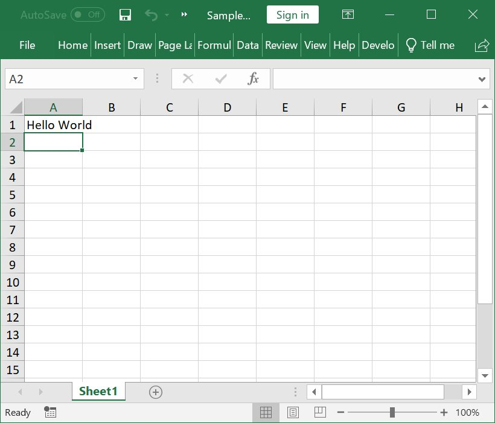
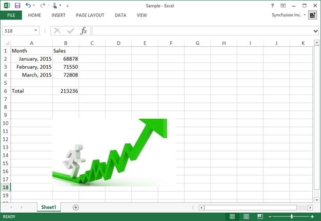
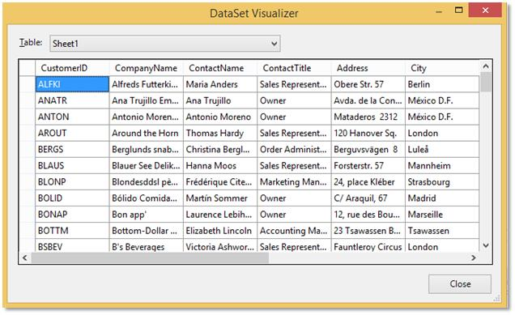
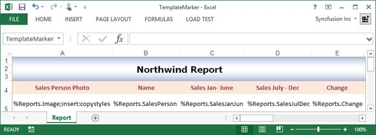
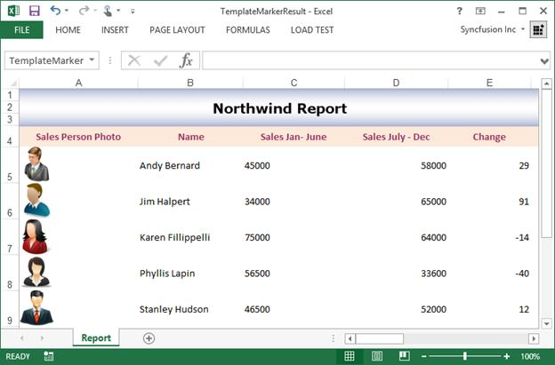

# Getting Started - Create Excel File in C# and VB.NET

This section explains how to create a simple Excel file in C# and VB.NET using XlsIO. The following assemblies must be referred in your application to create and manipulate the Excel document.

<table>
<thead>
<tr>
<th>
Assembly Name   </th><th>
Description  </th></tr>
</thead>
<tbody>
<tr>
<td>
Syncfusion.XlsIO.Base  </td><td>
This assembly contains the core features for creating, reading, and manipulating an Excel file.  </td></tr>
<tr>
<td>
Syncfusion.Compression.Base  </td><td>
This assembly is used to package the Workbook contents.  </td></tr>
</tbody>
</table>

N> Starting with v16.2.0.x, if you reference Syncfusion assemblies from trial setup or from the NuGet feed, you also have to add "Syncfusion.Licensing" assembly reference and include a license key in your projects. Please refer to this [link](https://help.syncfusion.com/common/essential-studio/licensing/license-key) to know about registering Syncfusion license key in your applications to use our components.

N> Syncfusion components are available in nuget.org

Include the following namespaces in your .cs or .vb file as shown as follows.

  

using Syncfusion.XlsIO;



Imports Syncfusion.XlsIO



using Syncfusion.XlsIO;



using Syncfusion.XlsIO;



using Syncfusion.XlsIO;

  

## Create a Hello World Excel File

The following code example explains how to create a hello world sample.

 

using Syncfusion.XlsIO;

//New instance of ExcelEngine is created equivalent to launching Microsoft Excel with no workbooks open
//Instantiate the spreadsheet creation engine
using (ExcelEngine excelEngine = new ExcelEngine())
{
  //Instantiate the Excel application object
  IApplication application = excelEngine.Excel;

  //Assigns default application version
  application.DefaultVersion = ExcelVersion.Excel2013;

  //A new workbook is created equivalent to creating a new workbook in Excel
  //Create a workbook with 1 worksheet
  IWorkbook workbook = application.Workbooks.Create(1);

  //Access first worksheet from the workbook
  IWorksheet worksheet = workbook.Worksheets[0];

  //Adding text to a cell
  worksheet.Range["A1"].Text = "Hello World";

  //Saving the workbook to disk in XLSX format
  workbook.SaveAs("Sample.xlsx");
}



Imports Syncfusion.XlsIO

'New instance of ExcelEngine is created equivalent to launching Microsoft Excel with no workbooks open
'Instantiate the spreadsheet creation engine
Using excelEngine As ExcelEngine = New ExcelEngine()
  'Instantiate the Excel application object
  Dim application As IApplication = excelEngine.Excel

  'Assigns default application version
  application.DefaultVersion = ExcelVersion.Excel2013

  'A new workbook is created equivalent to creating a new workbook in Excel
  'Create a workbook with 1 worksheet
  Dim workbook As IWorkbook = application.Workbooks.Create(1)

  'Access first worksheet from workbook
  Dim worksheet As IWorksheet = workbook.Worksheets(0)

  'Adding text to a cell
  worksheet.Range("A1").Text = "Hello World"

  'Saving the workbook to disk in XLSX format
  workbook.SaveAs("Sample.xlsx")
End Using



using Syncfusion.XlsIO;

//New instance of ExcelEngine is created equivalent to launching Microsoft Excel with no workbooks open
//Instantiate the spreadsheet creation engine
using (ExcelEngine excelEngine = new ExcelEngine())
{
  //Instantiate the Excel application object
  IApplication application = excelEngine.Excel;

  //Assigns default application version
  application.DefaultVersion = ExcelVersion.Excel2013;

  //A new workbook is created equivalent to creating a new workbook in Excel
  //Create a workbook with 1 worksheet
  IWorkbook workbook = application.Workbooks.Create(1);

  //Access first worksheet from the workbook
  IWorksheet worksheet = workbook.Worksheets[0];

  //Adding text to a cell
  worksheet.Range["A1"].Text = "Hello World";

  //Initializes FileSavePicker
  FileSavePicker savePicker = new FileSavePicker();
  savePicker.SuggestedStartLocation = PickerLocationId.Desktop;
  savePicker.SuggestedFileName = "Sample";
  savePicker.FileTypeChoices.Add("Excel Files", new List<string>() { ".xlsx" });

  //Creates a storage file from FileSavePicker
  StorageFile storageFile = await savePicker.PickSaveFileAsync();

  //Saves changes to the specified storage file
  await workbook.SaveAsAsync(storageFile);
}



using Syncfusion.XlsIO;

//New instance of ExcelEngine is created equivalent to launching Microsoft Excel with no workbooks open
//Instantiate the spreadsheet creation engine
using (ExcelEngine excelEngine = new ExcelEngine())
{
  //Instantiate the Excel application object
  IApplication application = excelEngine.Excel;

  //Assigns default application version
  application.DefaultVersion = ExcelVersion.Excel2013;

  //A new workbook is created equivalent to creating a new workbook in Excel
  //Create a workbook with 1 worksheet
  IWorkbook workbook = application.Workbooks.Create(1);

  //Access first worksheet from the workbook
  IWorksheet worksheet = workbook.Worksheets[0];

  //Adding text to a cell
  worksheet.Range["A1"].Text = "Hello World";

  //Saving the workbook as stream
  FileStream stream = new FileStream("Sample.xlsx", FileMode.Create, FileAccess.ReadWrite);
  workbook.SaveAs(stream);

  //Dispose stream
  stream.Dispose();
}



using Syncfusion.XlsIO;

//New instance of ExcelEngine is created equivalent to launching Microsoft Excel with no workbooks open
//Instantiate the spreadsheet creation engine
using (ExcelEngine excelEngine = new ExcelEngine())
{
  //Instantiate the Excel application object
  IApplication application = excelEngine.Excel;

  //Assigns default application version
  application.DefaultVersion = ExcelVersion.Excel2013;

  //A new workbook is created equivalent to creating a new workbook in Excel
  //Create a workbook with 1 worksheet
  IWorkbook workbook = application.Workbooks.Create(1);

  //Access first worksheet from the workbook
  IWorksheet worksheet = workbook.Worksheets[0];

  //Adding text to a cell
  worksheet.Range["A1"].Text = "Hello World";

  //Saving the workbook as stream
  MemoryStream stream = new MemoryStream();
  workbook.SaveAs(stream);

  stream.Position = 0;

  //Save the document as file and view the saved document

  //The operation in SaveAndView under Xamarin varies between Windows Phone, Android and iOS platforms. Please refer xlsio/xamarin section for respective code samples.

  if (Device.OS == TargetPlatform.WinPhone || Device.OS == TargetPlatform.Windows)
  {
	Xamarin.Forms.DependencyService.Get<ISaveWindowsPhone>().SaveAndView("Sample.xlsx", "application/msexcel", stream);
  }
  else
  {
	Xamarin.Forms.DependencyService.Get<ISave>().SaveAndView("Sample.xlsx", "application/msexcel", stream);
  }
}



The output screen-shot of the above code.

## Create a Simple Excel File

An instance of the [ExcelEngine](https://help.syncfusion.com/cr/file-formats/Syncfusion.XlsIO.ExcelEngine.html) gives access to create an application instance that is similar to launching Microsoft Excel application. The following code snippet shows how to initialize the application object for creating or manipulating Excel documents.

  

//New instance of ExcelEngine is created equivalent to launching Microsoft Excel with no workbooks open
//Instantiate the spreadsheet creation engine
ExcelEngine excelEngine = new ExcelEngine();

//Instantiate the Excel application object
IApplication application = excelEngine.Excel;



'New instance of ExcelEngine is created equivalent to launching Microsoft Excel with no workbooks open
'Instantiate the spreadsheet creation engine
Dim excelEngine As ExcelEngine = New ExcelEngine

'Instantiate the Excel application object
Dim application As IApplication = excelEngine.Excel



//New instance of ExcelEngine is created equivalent to launching Microsoft Excel with no workbooks open
//Instantiate the spreadsheet creation engine
ExcelEngine excelEngine = new ExcelEngine();

//Instantiate the Excel application object
IApplication application = excelEngine.Excel;



//New instance of ExcelEngine is created equivalent to launching Microsoft Excel with no workbooks open
//Instantiate the spreadsheet creation engine
ExcelEngine excelEngine = new ExcelEngine();

//Instantiate the Excel application object
IApplication application = excelEngine.Excel;



//New instance of ExcelEngine is created equivalent to launching Microsoft Excel with no workbooks open
//Instantiate the spreadsheet creation engine
ExcelEngine excelEngine = new ExcelEngine();

//Instantiate the Excel application object
IApplication application = excelEngine.Excel;

  

By default, the Excel version 97 to 2003 (*.xls) is associated with application object. XlsIO writes the excel files in the respective format depending on this excel version. You can modify the default Excel version to Excel 2013 as shown as follows.

  

//Assigns default application version
application.DefaultVersion = ExcelVersion.Excel2013;



'Assigns default application version
application.DefaultVersion = ExcelVersion.Excel2013



//Assigns default application version
application.DefaultVersion = ExcelVersion.Excel2013;



//Assigns default application version
application.DefaultVersion = ExcelVersion.Excel2013;



//Assigns default application version
application.DefaultVersion = ExcelVersion.Excel2013;

  

The workbook contains a collection of worksheets and various workbook-level properties. Each worksheet has cells, which can contain text, numbers, dates, formulas and more. The following code snippet illustrates how to create a workbook and access worksheet instance.

  

//A new workbook is created equivalent to creating a new workbook in Excel
//Create a workbook with 1 worksheet
IWorkbook workbook = application.Workbooks.Create(1);

//Access a worksheet from workbook
IWorksheet worksheet = workbook.Worksheets[0];



'A new workbook is created equivalent to creating a new workbook in Excel
'Create a workbook with 1 worksheet
Dim workbook As IWorkbook = application.Workbooks.Create(1)

'Access a worksheet from workbook
Dim worksheet As IWorksheet = workbook.Worksheets(0)



//A new workbook is created equivalent to creating a new workbook in Excel
//Create a workbook with 1 worksheet
IWorkbook workbook = application.Workbooks.Create(1);

//Access a worksheet from workbook
IWorksheet worksheet = workbook.Worksheets[0];



//A new workbook is created equivalent to creating a new workbook in Excel
//Create a workbook with 1 worksheet
IWorkbook workbook = application.Workbooks.Create(1);

//Access a worksheet from workbook
IWorksheet worksheet = workbook.Worksheets[0];



//A new workbook is created equivalent to creating a new workbook in Excel
//Create a workbook with 1 worksheet
IWorkbook workbook = application.Workbooks.Create(1);

//Access a worksheet from workbook
IWorksheet worksheet = workbook.Worksheets[0];



  

//Adding text data
worksheet.Range["A1"].Text = "Month";
worksheet.Range["B1"].Text = "Sales";
worksheet.Range["A6"].Text = "Total";

//Adding DateTime data
worksheet.Range["A2"].DateTime = new DateTime(2015, 1, 10);
worksheet.Range["A3"].DateTime = new DateTime(2015, 2, 10);
worksheet.Range["A4"].DateTime = new DateTime(2015, 3, 10);

//Applying number format for date value cells A2 to A4
worksheet.Range["A2:A4"].NumberFormat = "mmmm, yyyy";

//Auto-size the first column to fit the content
worksheet.AutofitColumn(1);

//Adding numeric data
worksheet.Range["B2"].Number = 68878;
worksheet.Range["B3"].Number = 71550;
worksheet.Range["B4"].Number = 72808;

//Adding formula
worksheet.Range["B6"].Formula = "SUM(B2:B4)";



'Adding text data
worksheet.Range("A1").Text = "Month"
worksheet.Range("B1").Text = "Sales"
worksheet.Range("A6").Text = "Total"

'Adding DateTime data
worksheet.Range("A2").DateTime = new DateTime(2015, 1, 10)
worksheet.Range("A3").DateTime = new DateTime(2015, 2, 10)
worksheet.Range("A4").DateTime = new DateTime(2015, 3, 10)

'Applying number format for date value cells A2 to A4
worksheet.Range("A2:A4").NumberFormat = "mmmm, yyyy"

'Auto-size the first column to fit the content
worksheet.AutofitColumn(1)

'Adding numeric data
worksheet.Range("B2").Number = 68878
worksheet.Range("B3").Number = 71550
worksheet.Range("B4").Number = 72808

'Adding formula
worksheet.Range("B6").Formula = "SUM(B2:B4)"



//Adding text data
worksheet.Range["A1"].Text = "Month";
worksheet.Range["B1"].Text = "Sales";
worksheet.Range["A6"].Text = "Total";

//Adding DateTime data
worksheet.Range["A2"].DateTime = new DateTime(2015, 1, 10);
worksheet.Range["A3"].DateTime = new DateTime(2015, 2, 10);
worksheet.Range["A4"].DateTime = new DateTime(2015, 3, 10);

//Applying number format for date value cells A2 to A4
worksheet.Range["A2:A4"].NumberFormat = "mmmm, yyyy";

//Auto-size the first column to fit the content
worksheet.AutofitColumn(1);

//Adding numeric data
worksheet.Range["B2"].Number = 68878;
worksheet.Range["B3"].Number = 71550;
worksheet.Range["B4"].Number = 72808;

//Adding formula
worksheet.Range["B6"].Formula = "SUM(B2:B4)";



//Adding text data
worksheet.Range["A1"].Text = "Month";
worksheet.Range["B1"].Text = "Sales";
worksheet.Range["A6"].Text = "Total";

//Adding DateTime data
worksheet.Range["A2"].DateTime = new DateTime(2015, 1, 10);
worksheet.Range["A3"].DateTime = new DateTime(2015, 2, 10);
worksheet.Range["A4"].DateTime = new DateTime(2015, 3, 10);

//Applying number format for date value cells A2 to A4
worksheet.Range["A2:A4"].NumberFormat = "mmmm, yyyy";

//Auto-size the first column to fit the content
worksheet.AutofitColumn(1);

//Adding numeric data
worksheet.Range["B2"].Number = 68878;
worksheet.Range["B3"].Number = 71550;
worksheet.Range["B4"].Number = 72808;

//Adding formula
worksheet.Range["B6"].Formula = "SUM(B2:B4)";



//Adding text data
worksheet.Range["A1"].Text = "Month";
worksheet.Range["B1"].Text = "Sales";
worksheet.Range["A6"].Text = "Total";

//Adding DateTime data
worksheet.Range["A2"].DateTime = new DateTime(2015, 1, 10);
worksheet.Range["A3"].DateTime = new DateTime(2015, 2, 10);
worksheet.Range["A4"].DateTime = new DateTime(2015, 3, 10);

//Applying number format for date value cells A2 to A4
worksheet.Range["A2:A4"].NumberFormat = "mmmm, yyyy";

//Auto-size the first column to fit the content
worksheet.AutofitColumn(1);

//Adding numeric data
worksheet.Range["B2"].Number = 68878;
worksheet.Range["B3"].Number = 71550;
worksheet.Range["B4"].Number = 72808;

//Adding formula
worksheet.Range["B6"].Formula = "SUM(B2:B4)";

  

The following code snippet shows how to add an image into the worksheet.

  

//Inserting image
worksheet.Pictures.AddPicture(10, 2, "image.jpg");



'Inserting image
worksheet.Pictures.AddPicture(10, 2, "image.jpg")



//Inserting image
//"App" is the class of Portable project
Assembly assembly = typeof(App).GetTypeInfo().Assembly;
Stream imageStream = assembly.GetManifestResourceStream("UWP.Data.image.jpg");
worksheet.Pictures.AddPicture(10, 2, imageStream);



//Inserting image
FileStream imageStream = new FileStream("image.jpg", FileMode.Open, FileAccess.Read);
worksheet.Pictures.AddPicture(10, 2, imageStream);



//Inserting image
//"App" is the class of Portable project
Assembly assembly = typeof(App).GetTypeInfo().Assembly;
Stream imageStream = assembly.GetManifestResourceStream("SampleBrowser.XlsIO.Samples.Template.image.jpg");
worksheet.Pictures.AddPicture(10, 2, imageStream);

  

Finally, save the document in file system and close/dispose the instance of IWorkbook and ExcelEngine.

  

//Saving the workbook to disk in XLSX format
workbook.SaveAs("Sample.xlsx");

//Closing the workbook
workbook.Close();

//Dispose the Excel engine
excelEngine.Dispose();



'Saving the workbook to disk in XLSX format
workbook.SaveAs("Sample.xlsx")

'Closing the workbook
workbook.Close()

'Dispose the Excel engine
excelEngine.Dispose()



//Initializes FileSavePicker
FileSavePicker savePicker = new FileSavePicker();
savePicker.SuggestedStartLocation = PickerLocationId.Desktop;
savePicker.SuggestedFileName = "Sample";
savePicker.FileTypeChoices.Add("Excel Files", new List<string>() { ".xlsx" });

//Creates a storage file from FileSavePicker
StorageFile storageFile = await savePicker.PickSaveFileAsync();

//Saves changes to the specified storage file
await workbook.SaveAsAsync(storageFile);

//Closing the workbook
workbook.Close();

//Dispose the Excel engine
excelEngine.Dispose();



//Save the workbook as stream
FileStream stream = new FileStream("Sample.xlsx", FileMode.Create, FileAccess.ReadWrite);
workbook.SaveAs(stream);

//Disposing the stream
stream.Dispose();

//Closing the workbook
workbook.Close();

//Dispose the Excel engine
excelEngine.Dispose();



//Saving the workbook as stream
MemoryStream stream = new MemoryStream();
workbook.SaveAs(stream);

//Closing the workbook
workbook.Close();

//Dispose the Excel engine
excelEngine.Dispose();

stream.Position = 0;

//Save the document as file and view the saved document

//The operation in SaveAndView under Xamarin varies between Windows Phone, Android and iOS platforms. Please refer xlsio/xamarin section for respective code samples.

if (Device.OS == TargetPlatform.WinPhone || Device.OS == TargetPlatform.Windows)
{
  Xamarin.Forms.DependencyService.Get<ISaveWindowsPhone>().SaveAndView("Sample.xlsx", "application/msexcel", stream);
}
else
{
  Xamarin.Forms.DependencyService.Get<ISave>().SaveAndView("Sample.xlsx", "application/msexcel", stream);
}

  

The complete code to create a simple Excel document.

  

using Syncfusion.XlsIO;
namespace ExcelCreation
{
  class Program
  {
	static void Main(string[] args)
	{
	  //New instance of ExcelEngine is created equivalent to launching Excel with no workbooks open
	  //Instantiate the spreadsheet creation engine
	  using (ExcelEngine excelEngine = new ExcelEngine())
	  {
		//Instantiate the Excel application object
		IApplication application = excelEngine.Excel;

		//Assigns default application version
		application.DefaultVersion = ExcelVersion.Excel2013;

		//A new workbook is created equivalent to creating a new workbook in Excel
		//Create a workbook with 1 worksheet
		IWorkbook workbook = application.Workbooks.Create(1);

		//Access a worksheet from workbook
		IWorksheet worksheet = workbook.Worksheets[0];

		//Adding text data
		worksheet.Range["A1"].Text = "Month";
		worksheet.Range["B1"].Text = "Sales";
		worksheet.Range["A6"].Text = "Total";

		//Adding DateTime data
		worksheet.Range["A2"].DateTime = new DateTime(2015, 1, 10);
		worksheet.Range["A3"].DateTime = new DateTime(2015, 2, 10);
		worksheet.Range["A4"].DateTime = new DateTime(2015, 3, 10);

		//Applying number format for date value cells A2 to A4
		worksheet.Range["A2:A4"].NumberFormat = "mmmm, yyyy";

		//Auto-size the first column to fit the content
		worksheet.AutofitColumn(1);

		//Adding numeric data
		worksheet.Range["B2"].Number = 68878;
		worksheet.Range["B3"].Number = 71550;
		worksheet.Range["B4"].Number = 72808;

		//Adding formula
		worksheet.Range["B6"].Formula = "SUM(B2:B4)";

		//Inserting image
		worksheet.Pictures.AddPicture(10, 2, "image.jpg");

		//Saving the workbook to disk in XLSX format
		workbook.SaveAs("Sample.xlsx");
	  }
	}
  }
}



Imports Syncfusion.XlsIO
Namespace ExcelCreation
  Module Program
	Sub Main(args As String())
	  'New instance of ExcelEngine is created equivalent to launching Microsoft Excel with no workbooks open
	  'Instantiate the spreadsheet creation engine
	  Using excelEngine As ExcelEngine = New ExcelEngine()
		'Instantiate the Excel application object
		Dim application As IApplication = excelEngine.Excel

		'Assigns default application version
		application.DefaultVersion = ExcelVersion.Excel2013

		'A new workbook is created equivalent to creating a new workbook in Excel
		'Create a workbook with 1 worksheet
		Dim workbook As IWorkbook = application.Workbooks.Create(1)

		'Access a worksheet from workbook
		Dim worksheet As IWorksheet = workbook.Worksheets(0)

		'Adding text data
		worksheet.Range("A1").Text = "Month"
		worksheet.Range("B1").Text = "Sales"
		worksheet.Range("A6").Text = "Total"

		'Adding DateTime data
		worksheet.Range("A2").DateTime = New DateTime(2015, 1, 10)
		worksheet.Range("A3").DateTime = New DateTime(2015, 2, 10)
		worksheet.Range("A4").DateTime = New DateTime(2015, 3, 10)

		'Applying number format for date value cells A2 to A4
		worksheet.Range("A2:A4").NumberFormat = "mmmm, yyyy"

		'Auto-size the first column to fit the content
		worksheet.AutofitColumn(1)

		'Adding numeric data
		worksheet.Range("B2").Number = 68878
		worksheet.Range("B3").Number = 71550
		worksheet.Range("B4").Number = 72808

		'Adding formula
		worksheet.Range("B6").Formula = "SUM(B2:B4)"

		'Inserting image
		worksheet.Pictures.AddPicture(10, 2, "image.jpg")

		'Saving the workbook to disk in XLSX format
		workbook.SaveAs("Sample.xlsx")
	  End Using
	End Sub
  End Module
End Namespace



using Syncfusion.XlsIO;
namespace ExcelCreation
{
  public sealed partial class MainPage : Page
  {
	public MainPage()
	{
	this.InitializeComponent();
	}
	private async void OnButtonClicked(object sender, RoutedEventArgs e)
	{
	  //New instance of ExcelEngine is created equivalent to launching Excel with no workbooks open
	  //Instantiate the spreadsheet creation engine
	  using (ExcelEngine excelEngine = new ExcelEngine())
	  {
		//Instantiate the Excel application object
		IApplication application = excelEngine.Excel;

		//Assigns default application version
		application.DefaultVersion = ExcelVersion.Excel2013;

		//A new workbook is created equivalent to creating a new workbook in Excel
		//Create a workbook with 1 worksheet
		IWorkbook workbook = application.Workbooks.Create(1);

		//Access a worksheet from workbook
		IWorksheet worksheet = workbook.Worksheets[0];

		//Adding text data
		worksheet.Range["A1"].Text = "Month";
		worksheet.Range["B1"].Text = "Sales";
		worksheet.Range["A6"].Text = "Total";

		//Adding DateTime data
		worksheet.Range["A2"].DateTime = new DateTime(2015, 1, 10);
		worksheet.Range["A3"].DateTime = new DateTime(2015, 2, 10);
		worksheet.Range["A4"].DateTime = new DateTime(2015, 3, 10);

		//Applying number format for date value cells A2 to A4
		worksheet.Range["A2:A4"].NumberFormat = "mmmm, yyyy";

		//Auto-size the first column to fit the content
		worksheet.AutofitColumn(1);

		//Adding numeric data
		worksheet.Range["B2"].Number = 68878;
		worksheet.Range["B3"].Number = 71550;
		worksheet.Range["B4"].Number = 72808;

		//Adding formula
		worksheet.Range["B6"].Formula = "SUM(B2:B4)";

		//Inserting image
		//"App" is the class of Portable project
		Assembly assembly = typeof(App).GetTypeInfo().Assembly;
		Stream imageStream = assembly.GetManifestResourceStream("UWP.Data.image.jpg");
		worksheet.Pictures.AddPicture(10, 2, imageStream);

		//Initializes FileSavePicker
		FileSavePicker savePicker = new FileSavePicker();
		savePicker.SuggestedStartLocation = PickerLocationId.Desktop;
		savePicker.SuggestedFileName = "Sample";
		savePicker.FileTypeChoices.Add("Excel Files", new List<string>() { ".xlsx" });

		//Creates a storage file from FileSavePicker
		StorageFile storageFile = await savePicker.PickSaveFileAsync();

		//Saves changes to the specified storage file
		await workbook.SaveAsAsync(storageFile);
	  }
	}
  }
}



using Syncfusion.XlsIO;
namespace ExcelCreation
{
  class Program
  {
	static void Main(string[] args)
	{
	  //New instance of ExcelEngine is created equivalent to launching Excel with no workbooks open
	  //Instantiate the spreadsheet creation engine
	  using (ExcelEngine excelEngine = new ExcelEngine())
	  {
		//Instantiate the Excel application object
		IApplication application = excelEngine.Excel;

		//Assigns default application version
		application.DefaultVersion = ExcelVersion.Excel2013;

		//A new workbook is created equivalent to creating a new workbook in Excel
		//Create a workbook with 1 worksheet
		IWorkbook workbook = application.Workbooks.Create(1);

		//Access a worksheet from workbook
		IWorksheet worksheet = workbook.Worksheets[0];

		//Adding text data
		worksheet.Range["A1"].Text = "Month";
		worksheet.Range["B1"].Text = "Sales";
		worksheet.Range["A6"].Text = "Total";

		//Adding DateTime data
		worksheet.Range["A2"].DateTime = new DateTime(2015, 1, 10);
		worksheet.Range["A3"].DateTime = new DateTime(2015, 2, 10);
		worksheet.Range["A4"].DateTime = new DateTime(2015, 3, 10);

		//Applying number format for date value cells A2 to A4
		worksheet.Range["A2:A4"].NumberFormat = "mmmm, yyyy";

		//Auto-size the first column to fit the content
		worksheet.AutofitColumn(1);

		//Adding numeric data
		worksheet.Range["B2"].Number = 68878;
		worksheet.Range["B3"].Number = 71550;
		worksheet.Range["B4"].Number = 72808;

		//Adding formula
		worksheet.Range["B6"].Formula = "SUM(B2:B4)";

		//Inserting image
		FileStream imageStream = new FileStream("image.jpg", FileMode.Open, FileAccess.Read);
		worksheet.Pictures.AddPicture(10, 2, imageStream);

		//Saving the workbook to disk in XLSX format
		FileStream stream = new FileStream("Sample.xlsx", FileMode.Create, FileAccess.ReadWrite);
		workbook.SaveAs(stream);

		//Dispose stream
		stream.Dispose();
	  }
	}
  }
}



using Syncfusion.XlsIO;
namespace ExcelCreation
{
  class Program
  {
	static void Main(string[] args)
	{
	  //New instance of ExcelEngine is created equivalent to launching Excel with no workbooks open
	  //Instantiate the spreadsheet creation engine
	  using (ExcelEngine excelEngine = new ExcelEngine())
	  {
		//Instantiate the Excel application object
		IApplication application = excelEngine.Excel;

		//Assigns default application version
		application.DefaultVersion = ExcelVersion.Excel2013;

		//A new workbook is created equivalent to creating a new workbook in Excel
		//Create a workbook with 1 worksheet
		IWorkbook workbook = application.Workbooks.Create(1);

		//Access a worksheet from workbook
		IWorksheet worksheet = workbook.Worksheets[0];

		//Adding text data
		worksheet.Range["A1"].Text = "Month";
		worksheet.Range["B1"].Text = "Sales";
		worksheet.Range["A6"].Text = "Total";

		//Adding DateTime data
		worksheet.Range["A2"].DateTime = new DateTime(2015, 1, 10);
		worksheet.Range["A3"].DateTime = new DateTime(2015, 2, 10);
		worksheet.Range["A4"].DateTime = new DateTime(2015, 3, 10);

		//Applying number format for date value cells A2 to A4
		worksheet.Range["A2:A4"].NumberFormat = "mmmm, yyyy";

		//Auto-size the first column to fit the content
		worksheet.AutofitColumn(1);

		//Adding numeric data
		worksheet.Range["B2"].Number = 68878;
		worksheet.Range["B3"].Number = 71550;
		worksheet.Range["B4"].Number = 72808;

		//Adding formula
		worksheet.Range["B6"].Formula = "SUM(B2:B4)";

		//Inserting image
		//"App" is the class of Portable project
		Assembly assembly = typeof(App).GetTypeInfo().Assembly;
		Stream imageStream = assembly.GetManifestResourceStream("SampleBrowser.XlsIO.Samples.Template.image.jpg");
		worksheet.Pictures.AddPicture(10, 2, imageStream);

		//Saving the workbook as stream
		MemoryStream stream = new MemoryStream();
		workbook.SaveAs(stream);

		stream.Position = 0;

		//Save the document as file and view the saved document

		//The operation in SaveAndView under Xamarin varies between Windows Phone, Android and iOS platforms. Please refer xlsio/xamarin section for respective code samples.

		if (Device.OS == TargetPlatform.WinPhone || Device.OS == TargetPlatform.Windows)
		{
		  Xamarin.Forms.DependencyService.Get<ISaveWindowsPhone>().SaveAndView("Sample.xlsx", "application/msexcel", stream);
		}
		else
		{
		  Xamarin.Forms.DependencyService.Get<ISave>().SaveAndView("Sample.xlsx", "application/msexcel", stream);
		}
	  }
	}
  }
}

  

The output screen-shot of the above code.

## Import Data to Excel Worksheets

[XlsIO](https://help.syncfusion.com/cr/file-formats/Syncfusion.XlsIO.html) helps to import data from various data sources into a worksheet. The following data sources can be imported using XlsIO:

* Collection Objects
* Data Table
* Data Column
* Data View
* Array

The following code snippet shows how to import data from objects.

  

using (ExcelEngine excelEngine = new ExcelEngine())
{
  IApplication application = excelEngine.Excel;
  application.DefaultVersion = ExcelVersion.Excel2013;
  IWorkbook workbook = application.Workbooks.Create(1);
  IWorksheet worksheet = workbook.Worksheets[0];

  //GetCustomerAsObjects method returns list of customers
  IList<Employee> employees = GetEmployees();

  //Import data to worksheet
  worksheet.ImportData(employees, 2, 1, false);

  //Saving the workbook
  workbook.SaveAs("Spreadsheet.xlsx");
}



Using excelEngine As ExcelEngine = New ExcelEngine()
  Dim application As IApplication = excelEngine.Excel
  application.DefaultVersion = ExcelVersion.Excel2013
  Dim workbook As IWorkbook = application.Workbooks.Create(1)
  Dim worksheet As IWorksheet = workbook.Worksheets(0)

  'GetCustomerAsObjects method returns list of customers
  Dim employees As IList(Of Employee) = GetEmployees()

  'Import data to worksheet
  worksheet.ImportData(employees, 2, 1, False)

  'Saving the workbook
  workbook.SaveAs("Spreadsheet.xlsx")
End Using



using (ExcelEngine excelEngine = new ExcelEngine())
{
  IApplication application = excelEngine.Excel;
  application.DefaultVersion = ExcelVersion.Excel2013;
  IWorkbook workbook = application.Workbooks.Create(1);
  IWorksheet worksheet = workbook.Worksheets[0];

  //GetCustomerAsObjects method returns list of customers
  IList<Employee> employees = GetEmployees();

  //Import data to worksheet
  worksheet.ImportData(employees, 2, 1, false);

  //Initializes FileSavePicker
  FileSavePicker savePicker = new FileSavePicker();
  savePicker.SuggestedStartLocation = PickerLocationId.Desktop;
  savePicker.SuggestedFileName = "Spreadsheet";
  savePicker.FileTypeChoices.Add("Excel Files", new List<string>() { ".xlsx" });

  //Creates a storage file from FileSavePicker
  StorageFile storageFile = await savePicker.PickSaveFileAsync();

  //Saves changes to the specified storage file
  await workbook.SaveAsAsync(storageFile);
}



using (ExcelEngine excelEngine = new ExcelEngine())
{
  IApplication application = excelEngine.Excel;
  application.DefaultVersion = ExcelVersion.Excel2013;
  IWorkbook workbook = application.Workbooks.Create(1);
  IWorksheet worksheet = workbook.Worksheets[0];

  //GetCustomerAsObjects method returns list of customers
  IList<Employee> employees = GetEmployees();

  //Import data to worksheet
  worksheet.ImportData(employees, 2, 1, false);

  //Saving the workbook as stream
  FileStream file = new FileStream("Spreadsheet.xlsx", FileMode.Create, FileAccess.ReadWrite);
  workbook.SaveAs(file);
  file.Dispose();
}



using (ExcelEngine excelEngine = new ExcelEngine())
{
  IApplication application = excelEngine.Excel;
  application.DefaultVersion = ExcelVersion.Excel2013;
  IWorkbook workbook = application.Workbooks.Create(1);
  IWorksheet worksheet = workbook.Worksheets[0];

  //GetCustomerAsObjects method returns list of customers
  IList<Employee> employees = GetEmployees();

  //Import data to worksheet
  worksheet.ImportData(employees, 2, 1, false);

  //Saving the workbook as stream
  MemoryStream stream = new MemoryStream();
  workbook.SaveAs(stream);

  stream.Position = 0;

  //Save the document as file and view the saved document

  //The operation in SaveAndView under Xamarin varies between Windows Phone, Android and iOS platforms. Please refer xlsio/xamarin section for respective code samples.

  if (Device.OS == TargetPlatform.WinPhone || Device.OS == TargetPlatform.Windows)
  {
	Xamarin.Forms.DependencyService.Get<ISaveWindowsPhone>().SaveAndView("Spreadsheet.xlsx", "application/msexcel", stream);
  }
  else
  {
	Xamarin.Forms.DependencyService.Get<ISave>().SaveAndView("Spreadsheet.xlsx", "application/msexcel", stream);
  }
}

  

The following code snippet provides supporting methods and classes for the previous code.

  

//Gets a list of Employee details
private static IList<Employee> GetEmployees()
{
  List<Employee> employees = new List<Employee>();
  employees.Add(new Employee("Nancy", "Davolio", "Sales Representative", "505 - 20th Ave. E. Apt. 2A,", "Seattle", "WA", "USA", "Nancy.png"));
  employees.Add(new Employee("Andrew", "Fuller", "Vice President, Sales", "908 W. Capital Way", "Tacoma", "WA", "USA", "Andrew.png"));
  employees.Add(new Employee("Janet", "Leverling", "Sales Representative", "722 Moss Bay Blvd.", "Kirkland", "WA", "USA", "Janet.png"));
  employees.Add(new Employee("Margaret", "Peacock", "Sales Representative", "4110 Old Redmond Rd.", "Redmond", "WA", "USA", "Margaret.png"));
  employees.Add(new Employee("Steven", "Buchanan", "Sales Manager", "14 Garrett Hill", "London", string.Empty, "UK", "Steven.png"));
  return employees;
}

//Employee details
public class Employee
{
  public string FirstName { get; set; }
  public string LastName { get; set; }
  public string Address { get; set; }
  public string City { get; set; }
  public string Region { get; set; }
  public string Country { get; set; }
  public string Title { get; set; }
  
  public Employee(string firstName, string lastName, string title, string address, string city, string region, string country, string photoFilePath)
  {
	FirstName = firstName;
	LastName = lastName;
	Title = title;
	Address = address;
	City = city;
	Region = region;
	Country = country;
  }
}



'Gets a list Employee details
Private Function GetEmployees() As List(Of Employee)
  Dim employees As New List(Of Employee)()
  employees.Add(New Employee("Nancy", "Davolio", "Sales Representative", "505 - 20th Ave. E. Apt. 2A,", "Seattle", "WA", "USA", "Nancy.png"))
  employees.Add(New Employee("Andrew", "Fuller", "Vice President, Sales", "908 W. Capital Way", "Tacoma", "WA", "USA", "Andrew.png"))
  employees.Add(New Employee("Janet", "Leverling", "Sales Representative", "722 Moss Bay Blvd.", "Kirkland", "WA", "USA", "Janet.png"))
  employees.Add(New Employee("Margaret", "Peacock", "Sales Representative", "4110 Old Redmond Rd.", "Redmond", "WA", "USA", "Margaret.png"))
  employees.Add(New Employee("Steven", "Buchanan", "Sales Manager", "14 Garrett Hill", "London", String.Empty, "UK", "Steven.png"))
  Return employees
End Function

'Employee details
Public Class Employee

  Public Property FirstName() As String
	Get
	  Return m_FirstName
	End Get
	Set(value As String)
	  m_FirstName = Value
	End Set
  End Property
  Private m_FirstName As String

  Public Property LastName() As String
	Get
	  Return m_LastName
	End Get
	Set(value As String)
	  m_LastName = Value
	End Set
  End Property
  Private m_LastName As String

  Public Property Address() As String
	Get
	  Return m_Address
	End Get
	Set(value As String)
	  m_Address = Value
	End Set
  End Property
  Private m_Address As String

  Public Property City() As String
	Get
	  Return m_City
	End Get
	Set(value As String)
	  m_City = Value
	End Set
  End Property
  Private m_City As String

  Public Property Region() As String
	Get
	  Return m_Region
	End Get
	Set(value As String)
	  m_Region = Value
	End Set
  End Property
  Private m_Region As String

  Public Property Country() As String
	Get
	  Return m_Country
	End Get
	Set(value As String)
	  m_Country = Value
	End Set
  End Property
  Private m_Country As String

  Public Property Title() As String
	Get
	  Return m_Title
	End Get
	Set(value As String)
	  m_Title = Value
	End Set
  End Property
  Private m_Title As String

  Public Sub New(firstName As String, lastName As String, title As String, address As String, city As String, region As String, country As String, photoFilePath As String)
	firstName = firstName
	lastName = lastName
	title = title
	address = address
	city = city
	region = region
	country = country
  End Sub
End Class



//Gets a list of Employee details
private static List<Employee> GetEmployees()
{
  List<Employee> employees = new List<Employee>();
  employees.Add(new Employee("Nancy", "Davolio", "Sales Representative", "505 - 20th Ave. E. Apt. 2A,", "Seattle", "WA", "USA", "Nancy.png"));
  employees.Add(new Employee("Andrew", "Fuller", "Vice President, Sales", "908 W. Capital Way", "Tacoma", "WA", "USA", "Andrew.png"));
  employees.Add(new Employee("Janet", "Leverling", "Sales Representative", "722 Moss Bay Blvd.", "Kirkland", "WA", "USA", "Janet.png"));
  employees.Add(new Employee("Margaret", "Peacock", "Sales Representative", "4110 Old Redmond Rd.", "Redmond", "WA", "USA", "Margaret.png"));
  employees.Add(new Employee("Steven", "Buchanan", "Sales Manager", "14 Garrett Hill", "London", string.Empty, "UK", "Steven.png"));
  return employees;
}

//Employee details
public class Employee
{
  public string FirstName { get; set; }
  public string LastName { get; set; }
  public string Address { get; set; }
  public string City { get; set; }
  public string Region { get; set; }
  public string Country { get; set; }
  public string Title { get; set; }

  public Employee(string firstName, string lastName, string title, string address, string city, string region, string country, string photoFilePath)
  {
	FirstName = firstName;
	LastName = lastName;
	Title = title;
	Address = address;
	City = city;
	Region = region;
	Country = country;
  }
}



//Gets a list of Employee details
private static List<Employee> GetEmployees()
{
  List<Employee> employees = new List<Employee>();
  employees.Add(new Employee("Nancy", "Davolio", "Sales Representative", "505 - 20th Ave. E. Apt. 2A,", "Seattle", "WA", "USA", "Nancy.png"));
  employees.Add(new Employee("Andrew", "Fuller", "Vice President, Sales", "908 W. Capital Way", "Tacoma", "WA", "USA", "Andrew.png"));
  employees.Add(new Employee("Janet", "Leverling", "Sales Representative", "722 Moss Bay Blvd.", "Kirkland", "WA", "USA", "Janet.png"));
  employees.Add(new Employee("Margaret", "Peacock", "Sales Representative", "4110 Old Redmond Rd.", "Redmond", "WA", "USA", "Margaret.png"));
  employees.Add(new Employee("Steven", "Buchanan", "Sales Manager", "14 Garrett Hill", "London", string.Empty, "UK", "Steven.png"));
  return employees;
}

//Employee details
public class Employee
{
  public string FirstName { get; set; }
  public string LastName { get; set; }
  public string Address { get; set; }
  public string City { get; set; }
  public string Region { get; set; }
  public string Country { get; set; }
  public string Title { get; set; }

  public Employee(string firstName, string lastName, string title, string address, string city, string region, string country, string photoFilePath)
  {
	FirstName = firstName;
	LastName = lastName;
	Title = title;
	Address = address;
	City = city;
	Region = region;
	Country = country;
  }
}



//Gets a list of Employee details
private static List<Employee> GetEmployees()
{
  List<Employee> employees = new List<Employee>();
  employees.Add(new Employee("Nancy", "Davolio", "Sales Representative", "505 - 20th Ave. E. Apt. 2A,", "Seattle", "WA", "USA", "Nancy.png"));
  employees.Add(new Employee("Andrew", "Fuller", "Vice President, Sales", "908 W. Capital Way", "Tacoma", "WA", "USA", "Andrew.png"));
  employees.Add(new Employee("Janet", "Leverling", "Sales Representative", "722 Moss Bay Blvd.", "Kirkland", "WA", "USA", "Janet.png"));
  employees.Add(new Employee("Margaret", "Peacock", "Sales Representative", "4110 Old Redmond Rd.", "Redmond", "WA", "USA", "Margaret.png"));
  employees.Add(new Employee("Steven", "Buchanan", "Sales Manager", "14 Garrett Hill", "London", string.Empty, "UK", "Steven.png"));
  return employees;
}

//Employee details
public class Employee
{
  public string FirstName { get; set; }
  public string LastName { get; set; }
  public string Address { get; set; }
  public string City { get; set; }
  public string Region { get; set; }
  public string Country { get; set; }
  public string Title { get; set; }

  public Employee(string firstName, string lastName, string title, string address, string city, string region, string country, string photoFilePath)
  {
	FirstName = firstName;
	LastName = lastName;
	Title = title;
	Address = address;
	City = city;
	Region = region;
	Country = country;
  }
}

  

You can refer various importing options in the “Importing Data to Worksheet” section.

## Export Data from Excel Worksheets 

The worksheet data can be exported to a data table using the **ExportDataTable****()** method. This method provides various options that allows to export data through ExcelExportDataTableOptions. 

The following code demonstrates how to export data from a worksheet to a data table with the __ColumnNames__ and __DetectColumnTypes__ options.

  

using (ExcelEngine excelEngine = new ExcelEngine())
{
  IApplication application = excelEngine.Excel;
  IWorkbook workbook = application.Workbooks.Open("WorkbookWithData.xlsx");
  IWorksheet sheet = workbook.Worksheets[0];
  application.DefaultVersion = ExcelVersion.Excel2013;

  //Export data from worksheet used range to a DataTable
  DataTable customersTable = sheet.ExportDataTable(sheet.UsedRange, ExcelExportDataTableOptions.ColumnNames | ExcelExportDataTableOptions.DetectColumnTypes);

  //Saving the workbook
  string fileName = "Output.xlsx";
  workbook.SaveAs(fileName);
}



Using excelEngine As ExcelEngine = New ExcelEngine()
  Dim application As IApplication = excelEngine.Excel
  Dim workbook As IWorkbook = application.Workbooks.Open("WorkbookWithData.xlsx")
  Dim sheet As IWorksheet = workbook.Worksheets(0)
  application.DefaultVersion = ExcelVersion.Excel2013

  'Export data from worksheet used range to a DataTable
  Dim customersTable As DataTable = sheet.ExportDataTable(sheet.UsedRange, ExcelExportDataTableOptions.ColumnNames Or ExcelExportDataTableOptions.DetectColumnTypes)

  'Saving the workbook
  Dim fileName As String = "Output.xlsx"
  workbook.SaveAs(fileName)
End Using



//XlsIO supports exporting of data from worksheet to data table from .NET Standard 2.0 along with Windows Forms, WPF, ASP.NET and ASP.NET MVC platforms alone.

//Exporting data from worksheet can be achieved using List as illustrated below.

//To know more about exporting data from worksheet to various collection objects, please refer xlsio/working-with-data section.

using (ExcelEngine excelEngine = new ExcelEngine())
{
  IApplication application = excelEngine.Excel;
  application.DefaultVersion = ExcelVersion.Excel2013;

  //Instantiates the File Picker
  FileOpenPicker openPicker = new FileOpenPicker();
  openPicker.SuggestedStartLocation = PickerLocationId.Desktop;
  openPicker.FileTypeFilter.Add(".xlsx");
  openPicker.FileTypeFilter.Add(".xls");
  StorageFile openFile = await openPicker.PickSingleFileAsync();

  //Opens the workbook
  IWorkbook workbook = await application.Workbooks.OpenAsync(openFile);
  IWorksheet worksheet = workbook.Worksheets[0];

  //Export data
  List<Sales> data = worksheet.ExportData<Sales>(1, 1, 41, 4);

  //Initializes FileSavePicker
  FileSavePicker savePicker = new FileSavePicker();
  savePicker.SuggestedStartLocation = PickerLocationId.Desktop;
  savePicker.SuggestedFileName = "CreateSpreadsheet";
  savePicker.FileTypeChoices.Add("Excel Files", new List<string>() { ".xlsx" });

  //Creates a storage file from FileSavePicker
  StorageFile storageFile = await savePicker.PickSaveFileAsync();

  //Saves changes to the specified storage file
  await workbook.SaveAsAsync(storageFile);
}

//Sales details
public class Sales
{
  private string salesPerson;
  private int salesJanJune;
  private int salesJulyDec;
  private int change;

  public string SalesPerson
  {
	get
	{
	  return salesPerson;
	}
	set
	{
	  salesPerson = value;
	}
  }

  public int SalesJanJune
  {
	get
	{
	  return salesJanJune;
	}
	set
	{
	  salesJanJune = value;
	}
  }

  public int SalesJulyDec
  {
	get
	{
	  return salesJulyDec;
	}
	set
	{
	  salesJulyDec = value;
	}
  }

  public int Change
  {
	get
	{
	  return change;
	}
	set
	{
	  change = value;
	}
  }
}



//XlsIO supports exporting of data from worksheet to data table from .NET Standard 2.0

using (ExcelEngine excelEngine = new ExcelEngine())
{
  IApplication application = excelEngine.Excel;
  application.DefaultVersion = ExcelVersion.Excel2013;
  FileStream inputStream = new FileStream("WorkbookWithData.xlsx", FileMode.Open, FileAccess.Read);
  IWorkbook workbook = application.Workbooks.Open(inputStream);
  IWorksheet worksheet = workbook.Worksheets[0];

  //Export data from worksheet used range to a DataTable
  DataTable customersTable = worksheet.ExportDataTable(worksheet.UsedRange, ExcelExportDataTableOptions.ColumnNames | ExcelExportDataTableOptions.DetectColumnTypes);

  //Saving the workbook as stream
  FileStream file = new FileStream("Output.xlsx", FileMode.Create, FileAccess.ReadWrite);
  workbook.SaveAs(file);
  file.Dispose();
}



//XlsIO supports exporting of data from worksheet to data table from .NET Standard 2.0 along with Windows Forms, WPF, ASP.NET and ASP.NET MVC platforms alone.

//Exporting data from worksheet can be achieved using List as illustrated below.

//To know more about exporting data from worksheet to various collection objects, please refer xlsio/working-with-data section.

using (ExcelEngine excelEngine = new ExcelEngine())
{
  IApplication application = excelEngine.Excel;
  application.DefaultVersion = ExcelVersion.Excel2013;
  Assembly assembly = typeof(App).GetTypeInfo().Assembly;
  Stream fileStream = assembly.GetManifestResourceStream("ExportSales.xlsx");
  IWorkbook workbook = application.Workbooks.Open(fileStream);
  IWorksheet sheet = workbook.Worksheets[0];

  List<Sales> data = sheet.ExportData<Sales>(1, 1, 41, 4);

  MemoryStream stream = new MemoryStream();
  workbook.SaveAs(stream);

  stream.Position = 0;

  //Save the document as file and view the saved document

  //The operation in SaveAndView under Xamarin varies between Windows Phone, Android and iOS platforms. Please refer xlsio/xamarin section for respective code samples.

  if (Device.OS == TargetPlatform.WinPhone || Device.OS == TargetPlatform.Windows)
  {
	Xamarin.Forms.DependencyService.Get<ISaveWindowsPhone>().SaveAndView("CreateSheet.xlsx", "application/msexcel", stream);
  }
  else
  {
	Xamarin.Forms.DependencyService.Get<ISave>().SaveAndView("CreateSheet.xlsx", "application/msexcel", stream);
  }
}

//Sales details
public class Sales
{
  private string salesPerson;
  private int salesJanJune;
  private int salesJulyDec;
  private int change;

  public string SalesPerson
  {
	get
	{
	  return salesPerson;
	}
	set
	{
	  salesPerson = value;
	}
  }

  public int SalesJanJune
  {
	get
	{
	  return salesJanJune;
	}
	set
	{
	  salesJanJune = value;
	}
  }

  public int SalesJulyDec
  {
	get
	{
	  return salesJulyDec;
	}
	set
	{
	  salesJulyDec = value;
	}
  }

  public int Change
  {
	get
	{
	  return change;
	}
	set
	{
	  change = value;
	}
  }
}

  

The following screenshot shows the DataTable of previous code.

You can refer various exporting options in the “Exporting from Worksheet to Data Table” section.

## Template based data filling using Template Markers

A template marker is a special marker symbol that allows to generate a document by filling data in an Excel template from data source. This marker automatically maps the column name in the data source and names of the marker fields in the Excel template document and fills the data (text or image).

This functionality supports the following data sources.

* Collection Objects
* DataTable
* Array

Each marker starts with a prefix "%", which is followed by a __MarkerVariable__ and its __property__. The arguments are delimited by semicolon (;). The following syntax shows the usage of marker in input template document. 

<table>
<tr>
<td>
%&lt;MarkerVariable&gt;.&lt;Property&gt;   For example: %Reports.SalesPerson  </td></tr>
</table>
Use the following syntax to maintain row formats while filling data.

<table>
<tr>
<td>
%&lt;MarkerVariable&gt;.&lt;Property&gt;;insert:copystyles  For example: %Reports.SalesPerson;insert:copystyles  </td></tr>
</table>

Find more details in [Template marker section for arguments](https://help.syncfusion.com/file-formats/xlsio/working-with-template-markers#template-marker-syntax)

For example – let’s consider that you have a template document as shown below.

[Download input template](http://www.syncfusion.com/downloads/support/directtrac/general/ze/TemplateMarker1284008036.zip)

The following code snippet shows how to use template markers with objects.

  

using (ExcelEngine excelEngine = new ExcelEngine())
{
  IApplication application = excelEngine.Excel;
  application.DefaultVersion = ExcelVersion.Excel2013;
  IWorkbook workbook = application.Workbooks.Open("TemplateMarker.xlsx");
  IWorksheet worksheet = workbook.Worksheets[0];

  //Create template marker processor for the workbook
  ITemplateMarkersProcessor marker = workbook.CreateTemplateMarkersProcessor();

  //GetSalesReports method returns list of sales persons and their reports
  IList<Report> reports = GetSalesReports();

  //Adding reports collection to marker variables
  //Where the name should match with the input template
  marker.AddVariable("Reports", reports);

  //Applying Markers
  marker.ApplyMarkers();

  //Saving the workbook
  workbook.SaveAs("TemplateMarkerResult.xlsx");
}



Using excelEngine As ExcelEngine = New ExcelEngine()
  Dim application As IApplication = excelEngine.Excel
  application.DefaultVersion = ExcelVersion.Excel2013
  Dim workbook As IWorkbook = application.Workbooks.Open("TemplateMarker.xlsx")
  Dim worksheet As IWorksheet = workbook.Worksheets(0)

  'Create template marker processor for the workbook
  Dim marker As ITemplateMarkersProcessor = workbook.CreateTemplateMarkersProcessor()

  'GetSalesReports method returns list of sales persons and their reports
  Dim reports As IList(Of Report) = GetSalesReports()

  'Adding reports collection to marker variables
  'Where the name should match with the input template
  marker.AddVariable("Reports", reports)

  'Applying Markers
  marker.ApplyMarkers()

  'Saving the workbook
  workbook.SaveAs("TemplateMarkerResult.xlsx")
End Using



using (ExcelEngine excelEngine = new ExcelEngine())
{
  IApplication application = excelEngine.Excel;
  application.DefaultVersion = ExcelVersion.Excel2013;

  //Instantiates the File Picker
  FileOpenPicker openPicker = new FileOpenPicker();
  openPicker.SuggestedStartLocation = PickerLocationId.Desktop;
  openPicker.FileTypeFilter.Add(".xlsx");
  openPicker.FileTypeFilter.Add(".xls");
  StorageFile openFile = await openPicker.PickSingleFileAsync();

  //Opens the workbook
  IWorkbook workbook = await application.Workbooks.OpenAsync(openFile);
  IWorksheet worksheet = workbook.Worksheets[0];

  //Create template marker processor for the workbook
  ITemplateMarkersProcessor marker = workbook.CreateTemplateMarkersProcessor();

  //GetSalesReports method returns list of sales persons and their reports
  IList<Report> reports = GetSalesReports();

  //Adding reports collection to marker variables
  //Where the name should match with the input template
  marker.AddVariable("Reports", reports);

  //Applying Markers
  marker.ApplyMarkers();

  //Initializes FileSavePicker
  FileSavePicker savePicker = new FileSavePicker();
  savePicker.SuggestedStartLocation = PickerLocationId.Desktop;
  savePicker.SuggestedFileName = "TemplateMarkerResult";
  savePicker.FileTypeChoices.Add("Excel Files", new List<string>() { ".xlsx" });

  //Creates a storage file from FileSavePicker
  StorageFile storageFile = await savePicker.PickSaveFileAsync();

  //Saves changes to the specified storage file
  await workbook.SaveAsAsync(storageFile);
}



using (ExcelEngine excelEngine = new ExcelEngine())
{
  IApplication application = excelEngine.Excel;
  application.DefaultVersion = ExcelVersion.Excel2013;
  FileStream inputStream = new FileStream("TemplateMarker.xlsx", FileMode.Open, FileAccess.Read);
  IWorkbook workbook = application.Workbooks.Open(inputStream);

  //Create template marker processor for the workbook
  ITemplateMarkersProcessor marker = workbook.CreateTemplateMarkersProcessor();

  //GetSalesReports method returns list of sales persons and their reports
  IList<Report> reports = GetSalesReports();

  //Adding reports collection to marker variables
  //Where the name should match with the input template
  marker.AddVariable("Reports", reports);

  //Applying Markers
  marker.ApplyMarkers();

  //Saving the workbook as stream
  FileStream file = new FileStream("TemplateMarkerResult.xlsx", FileMode.Create, FileAccess.ReadWrite);
  workbook.SaveAs(file);
  file.Dispose();
}



using (ExcelEngine excelEngine = new ExcelEngine())
{
  IApplication application = excelEngine.Excel;
  application.DefaultVersion = ExcelVersion.Excel2013;
  Assembly assembly = typeof(App).GetTypeInfo().Assembly;
  Stream inputStream = assembly.GetManifestResourceStream("SampleBrowser.XlsIO.Samples.Template.TemplateMarker.xlsx");
  IWorkbook workbook = application.Workbooks.Open(inputStream);

  //Create template marker processor for the workbook
  ITemplateMarkersProcessor marker = workbook.CreateTemplateMarkersProcessor();

  //GetSalesReports method returns list of sales persons and their reports
  IList<Report> reports = GetSalesReports();

  //Adding reports collection to marker variables
  //Where the name should match with the input template
  marker.AddVariable("Reports", reports);

  //Applying Markers
  marker.ApplyMarkers();

  //Saving the workbook as stream
  MemoryStream stream = new MemoryStream();
  workbook.SaveAs(stream);

  stream.Position = 0;

  //Save the document as file and view the saved document

  //The operation in SaveAndView under Xamarin varies between Windows Phone, Android and iOS platforms. Please refer xlsio/xamarin section for respective code samples.

  if (Device.OS == TargetPlatform.WinPhone || Device.OS == TargetPlatform.Windows)
  {
	Xamarin.Forms.DependencyService.Get<ISaveWindowsPhone>().SaveAndView("TemplateMarkerResult.xlsx", "application/msexcel", stream);
  }
  else
  {
	Xamarin.Forms.DependencyService.Get<ISave>().SaveAndView("TemplateMarkerResult.xlsx", "application/msexcel", stream);
  }
}



The following code snippet provides supporting methods and classes for the previous code.

  

//Gets a list of sales reports
private static List<Report> GetSalesReports()
{
  List<Report> reports = new List<Report>();
  reports.Add(new Report("Andy Bernard", "45000", "58000", 29 , "Andy.jpg"));
  reports.Add(new Report("Jim Halpert", "34000", "65000", 91, "Jim.png"));
  reports.Add(new Report("Karen Fillippelli", "75000", "64000", -14, "Karen.jpg"));
  reports.Add(new Report("Phyllis Lapin", "56500", "33600", -40, "Phyllis.png"));
  reports.Add(new Report("Stanley Hudson", "46500", "52000", 12, "Stanley.jpg"));
  return reports;
}

//Sales report
public class Report
{
  public string SalesPerson { get; set; }
  public string SalesJanJun { get; set; }
  public string SalesJulDec { get; set; }
  public int Change { get; set; }
  public byte[] Image { get; set; }

  public Report(string name, string janToJun, string julToDec, int change, string imagePath)
  {
	SalesPerson = name;
	SalesJanJun = janToJun;
	SalesJulDec = julToDec;
	Change = change;
	Image = File.ReadAllBytes(imagePath);
  }
}



'Gets a list of sales reports
Private Function GetSalesReports() As List(Of Report)
  Dim reports As New List(Of Report)()
  reports.Add(New Report("Andy Bernard", "45000", "58000", 29, "Andy.jpg"))
  reports.Add(New Report("Jim Halpert", "34000", "65000", 91, "Jim.png"))
  reports.Add(New Report("Karen Fillippelli", "75000", "64000", -14, "Karen.jpg"))
  reports.Add(New Report("Phyllis Lapin", "56500", "33600", -40, "Phyllis.png"))
  reports.Add(New Report("Stanley Hudson", "46500", "52000", 12, "Stanley.jpg"))
  Return reports
End Function

'Sales report
Public Class Report
	
  Public Property SalesPerson() As String
	Get
	  Return m_SalesPerson
	End Get
	Set(value As String)
	  m_SalesPerson = Value
	End Set
  End Property
  Private m_SalesPerson As String

  Public Property SalesJanJun() As String
	Get
	  Return m_SalesJanJun
	End Get
	Set(value As String)
	  m_SalesJanJun = Value
	End Set
  End Property
  Private m_SalesJanJun As String

  Public Property SalesJulDec() As String
	Get
	  Return m_SalesJulDec
	End Get
	Set(value As String)
	  m_SalesJulDec = Value
	End Set
  End Property
  Private m_SalesJulDec As String

  Public Property Change() As Integer
	Get
	  Return m_Change
	End Get
	Set(value As Integer)
	  m_Change = Value
	End Set
  End Property
  Private m_Change As Integer

  Public Property Image() As Byte()
	Get
	  Return m_Image
	End Get
	Set(value As Byte())
	  m_Image = Value
	End Set
  End Property
  Private m_Image As Byte()

  Public Sub New(name As String, janToJun As String, julToDec As String, change As Integer, imagePath As String)
	SalesPerson = name
	SalesJanJun = janToJun
	SalesJulDec = julToDec
	change = change
	Image = File.ReadAllBytes(imagePath)
  End Sub
End Class



//Gets a list of sales reports
private static List<Report> GetSalesReports()
{
  List<Report> reports = new List<Report>();
  reports.Add(new Report("Andy Bernard", "45000", "58000", 29 , "Andy.jpg"));
  reports.Add(new Report("Jim Halpert", "34000", "65000", 91, "Jim.png"));
  reports.Add(new Report("Karen Fillippelli", "75000", "64000", -14, "Karen.jpg"));
  reports.Add(new Report("Phyllis Lapin", "56500", "33600", -40, "Phyllis.png"));
  reports.Add(new Report("Stanley Hudson", "46500", "52000", 12, "Stanley.jpg"));
  return reports;
}

//Sales report
public class Report
{
  public string SalesPerson { get; set; }
  public string SalesJanJun { get; set; }
  public string SalesJulDec { get; set; }
  public int Change { get; set; }
  public byte[] Image { get; set; }

  public Report(string name, string janToJun, string julToDec, int change, string imagePath)
  {
	SalesPerson = name;
	SalesJanJun = janToJun;
	SalesJulDec = julToDec;
	Change = change;
	Image = GetImage(imagePath);			
  }

  private byte[] GetImage(string imagePath)
  {
	Assembly assembly = typeof(App).GetTypeInfo().Assembly;
	Stream imageStream = assembly.GetManifestResourceStream("UWP.Data." + imagePath);
	using (BinaryReader br = new BinaryReader(imageStream))
	{
	  return br.ReadBytes((int)imageStream.Length);
	}
  }
}



//Gets a list of sales reports
private static List<Report> GetSalesReports()
{
  List<Report> reports = new List<Report>();
  reports.Add(new Report("Andy Bernard", "45000", "58000", 29 , "Andy.jpg"));
  reports.Add(new Report("Jim Halpert", "34000", "65000", 91, "Jim.png"));
  reports.Add(new Report("Karen Fillippelli", "75000", "64000", -14, "Karen.jpg"));
  reports.Add(new Report("Phyllis Lapin", "56500", "33600", -40, "Phyllis.png"));
  reports.Add(new Report("Stanley Hudson", "46500", "52000", 12, "Stanley.jpg"));
  return reports;
}

//Sales report
public class Report
{
  public string SalesPerson { get; set; }
  public string SalesJanJun { get; set; }
  public string SalesJulDec { get; set; }
  public int Change { get; set; }
  public byte[] Image { get; set; }
  
  public Report(string name, string janToJun, string julToDec, int change, string imagePath)
  {
	SalesPerson = name;
	SalesJanJun = janToJun;
	SalesJulDec = julToDec;
	Change = change;
	Image = File.ReadAllBytes(imagePath);
  }
}



//Gets a list of sales reports
private static List<Report> GetSalesReports()
{
  List<Report> reports = new List<Report>();
  reports.Add(new Report("Andy Bernard", "45000", "58000", 29 , "Andy.jpg"));
  reports.Add(new Report("Jim Halpert", "34000", "65000", 91, "Jim.png"));
  reports.Add(new Report("Karen Fillippelli", "75000", "64000", -14, "Karen.jpg"));
  reports.Add(new Report("Phyllis Lapin", "56500", "33600", -40, "Phyllis.png"));
  reports.Add(new Report("Stanley Hudson", "46500", "52000", 12, "Stanley.jpg"));
  return reports;
}

//Sales report
public class Report
{
  public string SalesPerson { get; set; }
  public string SalesJanJun { get; set; }
  public string SalesJulDec { get; set; }
  public int Change { get; set; }
  public byte[] Image { get; set; }

  public Report(string name, string janToJun, string julToDec, int change, string imagePath)
  {
	SalesPerson = name;
	SalesJanJun = janToJun;
	SalesJulDec = julToDec;
	Change = change;
	Image = GetImage(imagePath);
  }

  private byte[] GetImage(string imagePath)
  {
	Assembly assembly = typeof(App).GetTypeInfo().Assembly;
	Stream imageStream = assembly.GetManifestResourceStream("SampleBrowser.XlsIO.Samples.Template." + imagePath);
	using (BinaryReader reader = new BinaryReader(imageStream))
	{
	  return reader.ReadBytes((int)imageStream.Length);
	}
  }
}

  

The resultant document looks as follows:

