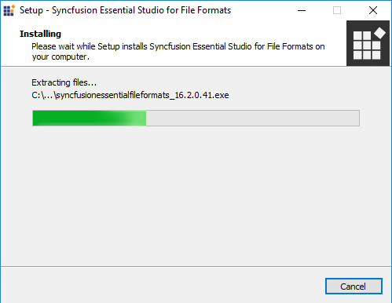
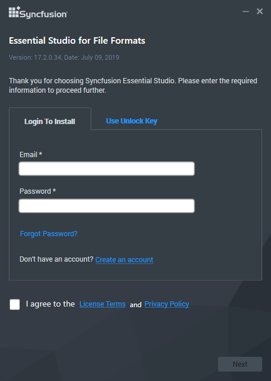
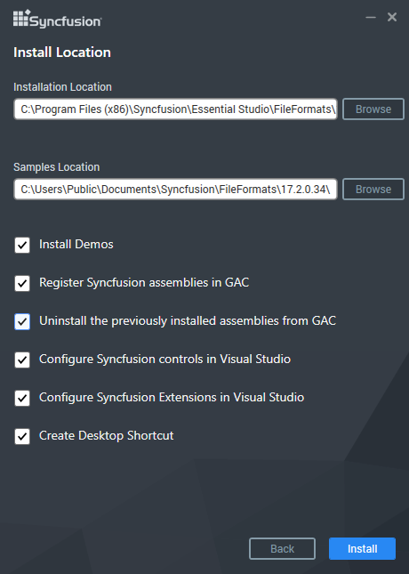
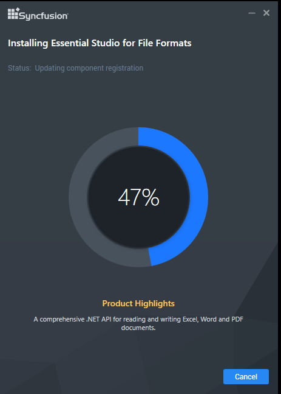
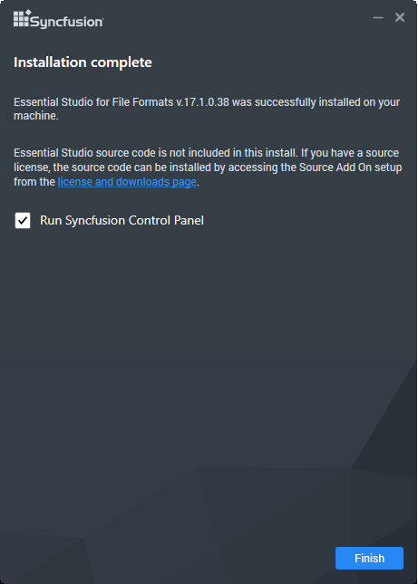

# Installation using Offline Installer

## Installing with UI   

The following procedure illustrates how to install Essential Studio File Formats platform.

1. Close all the running Visual Studio instances.

2. Double-click the Syncfusion File Formats platform installer file. The installer Wizard opens and extracts the package automatically.

   

   N> The installer wizard extracts the syncfusionessentialfileformats_(version).exe dialog, displaying the unzip operation of the package.

3. You have two options to unlock the Syncfusion installer:

   
* *Login To Install*
   
* *Use Unlock Key*
   
   
   
   **Login To Install**
   
   You should enter your Syncfusion Direct-Trac login credentials. If you don't have Syncfusion Direct-Trac login credentials, then you can click on Sign Up to a create new account. Else if you forgot your password, click on Reset Password to create new password. Here Email address and Password is validated and the Platform Selection window opens.

      

   **Use Unlock Key**
   
   You should use the Syncfusion License/Trial key. Trial key is valid for 30 days and the installer won't accept the expired trial key. Licensed customer can generate key from [here](https://www.syncfusion.com/kb/2326).

      

4. After reading the License Terms and Conditions, check the **I agree to the License Terms and Conditions** check box.

5. Click Next. Select the Installation, Samples Folder and Advanced Options screen opens. To install in the displayed default location, click Install

    

    N> From the 2018 Volume 2 release, Syncfusion has changed the install and samples location 
	   **Default Install location:** {ProgramFilesFolder}\Syncfusion\{Platform}\{version}
	   **Default Samples location:** C:\Users\Public\Documents\Syncfusion\{platform}\{version}
	   However, you can change the locations by clicking browse button.

    * Select the **Install Syncfusion Samples** check box to install Syncfusion samples, or leave the check box clear, when you do not want to install Syncfusion samples.
    * Select the **Register Syncfusion Assemblies in GAC** check box to install the latest Syncfusion assemblies in GAC, or clear this check box when you do not want to install the latest assemblies in GAC.
    * Select the **Uninstall the previously installed Syncfusion assemblies from GAC** check box to uninstall the previously installed Syncfusion assemblies from GAC, or clear this check box to maintain the previously installed assemblies.
    * Select the **Configure Syncfusion controls in Visual Studio Toolbox** check box to configure the Syncfusion controls in the Visual Studio toolbox, or clear this check box when you do not want to configure the Syncfusion controls in the Visual Studio toolbox during installation. Note that you must also select the Register Syncfusion assemblies in GAC check box when you select this check box.
    * Select the **Install Syncfusion Extensions** checkbox to configure the Syncfusion Extensions in Visual Studio or clear this check box when you do not want to configure the Syncfusion Extensions in Visual Studio.

6.  Click Install.

    

7. The Completed screen is displayed once the File Formats platform is installed.

    

8. Select the **Run Syncfusion Control Panel** check box to launch the Syncfusion Control Panel after installing.

9. Click Finish. Syncfusion File Formats platform is installed in your system and the Syncfusion Essential Studio [Syncfusion Control Panel](http://help.syncfusion.com/common/essential-studio/utilities#dashboard ) is launched automatically.

## Installing in silent mode

The Syncfusion Essential Studio Platform Installer supports installing/uninstalling through Command Line. The following sections illustrate this ability. 

### Command Line Installation

Follow the steps below to install through Command Line in Silent mode.

1. Double-click the Syncfusion Essential Studio platform installer file. The installer Wizard opens and extracts the package automatically. 
2. The syncfusionessentialfileformats_(version).exe file is extracted into the Temp folder.
3. Run %temp%. The Temp folder will open. The syncfusionessentialfileformats_(version).exe file is available in one of the folders.
4. Copy the extracted syncfusionessentialfileformats_(version).exe file in local drive.
5. Cancel the Wizard.
6. Open the Command Prompt in administrator mode and pass the following arguments.

   
   **Arguments:** “Installer file path\SyncfusionEssentialStudio(platform)_(version).exe” /Install silent /PIDKEY:“(product unlock key)” [/log “{Log file path}”] [/InstallPath:{Location to install}] [/InstallSamples:{true/false}] [/InstallAssemblies:{true/false}] [/UninstallExistAssemblies:{true/false}] [/InstallToolbox:{true/false}]

   N> [..] – Arguments inside the square brackets are optional.

   **Example:** “D:\Temp\syncfusionessentialfileformats_x.x.x.x.exe” /Install silent /PIDKEY:“product unlock key” /log “C:\Temp\EssentialStudio_Platform.log” /InstallPath:C:\Syncfusion\x.x.x.x /InstallSamples:true /InstallAssemblies:true /UninstallExistAssemblies:true /InstallToolbox:true

	
7. Essential Studio for File Formats is installed.

   N> x.x.x.x needs to be replaced with the Essential Studio version and the Product Unlock Key needs to be replaced with the Unlock Key for that version.
   

### Command Line Uninstallation

Syncfusion Essential Studio supports uninstalling through Command Line in Silent mode. The following steps illustrate this. 

1. When you do not have the extracted installer (syncfusionessentialfileformats_(version).exe) then follow the steps from 2 to 7.
2. Double-click the Syncfusion Essential Studio platform installer file. The installer Wizard opens and extracts the package automatically.
3. The syncfusionessentialfileformats_(version).exe file is extracted into the Temp folder.
4. Run %temp%. The Temp folder will open. The syncfusionessentialfileformats_(version).exe file is available in one of the folders.
5. Copy the syncfusionessentialfileformats_(version).exe file in local drive. 
6. Cancel the Wizard.
7. Open the Command Prompt in administrator mode and pass the following arguments.
   
   **Arguments:** “Copied installer file path\syncfusionessentialfileformats_(version).exe” /uninstall silent 

   **Example:** “D:\Temp\syncfusionessentialfileformats_x.x.x.x.exe" /uninstall silent

8. Essential Studio for File Formats is uninstalled.

   N> x.x.x.x needs to be replaced with the Essential Studio version installed in your machine.
   
   
