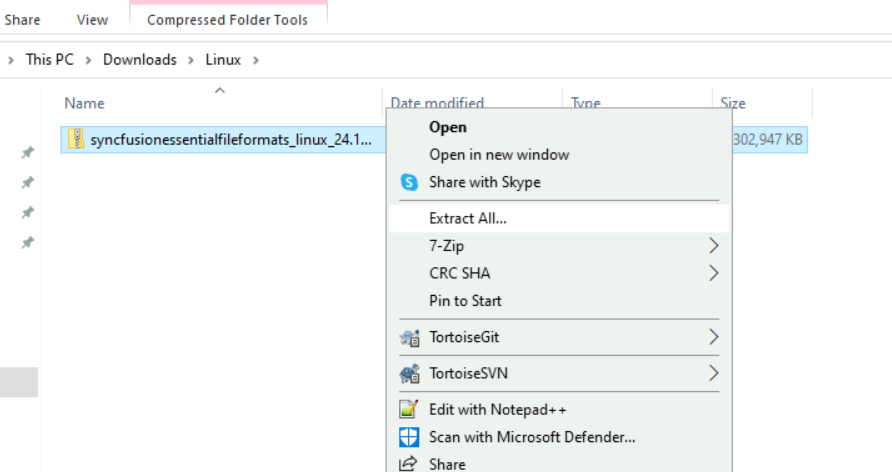
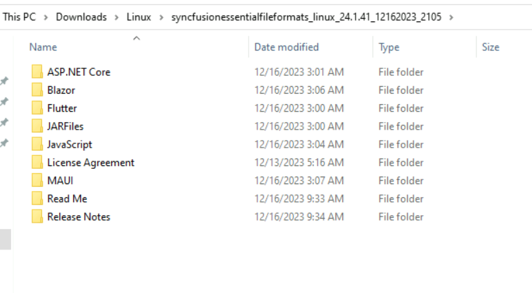

# Installing Syncfusion File-Formats Linux installer

## Step-by-Step Installation

The steps below show how to install File-Formats Linux installer.

1. Extract the Syncfusion File-Formats Linux installer(.zip) file. The files are extracted in your machine.

   
   

2. The Linux zip file contains the following folders.

      
   
   N> The Unlock key is not required to install the Linux installer.

4. You can launch the demo source and use the NuGet packages included in the Linux installer.

5. Run the following command in linux machine to deploy the ASP.NET Core samples
 
  **dotnet restore projectname -s \nuget** in order to restore.

## License key registration in samples

After the installation, the license key is required to register the demo source that is included in the Linux installer. To learn about the steps for license registration for the ASP.NET Core - EJ2 samples in the Essential Studio FileFormats linux installer, please refer to this.

* Register the license key in the [Program.cs](https://ej2.syncfusion.com/aspnetcore/documentation/licensing/how-to-register-in-an-application#for-aspnet-core-application-using-net-60) file if you created the ASP.NET Core web application with Visual Studio 2022 and .NET 6.0.
* Register the license key in Configure method of [Startup.cs](https://ej2.syncfusion.com/aspnetcore/documentation/licensing/how-to-register-in-an-application#for-aspnet-core-application-using-net-50-or-net-31)