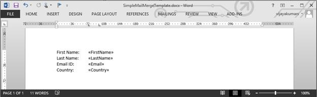
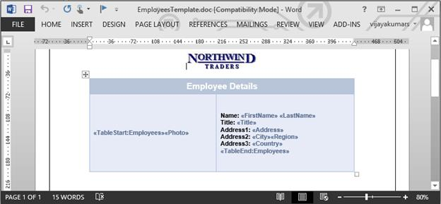
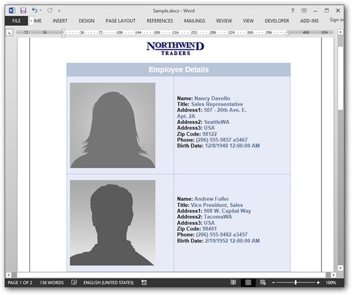

# Getting Started

## Creating a new Word document from scratch with basic elements

In this page, you can see how to create a simple Word document using Essentail DocIO’s API. For creating and manipulating a Word document, the following assemblies need to be referenced in your application.

<table>
<tr>
<th>
**Assembly**  </th><th>
**Short** **description**  </th></tr>
<tr>
<td>
Syncfusion.DocIO.Base  </td><td>
This assembly contains the core features needed for creating, reading, manipulating a Word document.  </td></tr>
<tr>
<td>
Syncfusion.Compression.Base  </td><td>
This assembly is used to package the Word document contents.  </td></tr>
<tr>
<td>
Syncfusion.OfficeChart.Base  </td><td>
This assembly contains the Office Chart Object model and core features needed for chart creation.  </td></tr>
</table>
Include the following namespaces in your .cs or .vb file

* Syncfusion.DocIO
* Syncfusion.DocIO.DLS

An entire Word document is represented by an instance of WordDocument and it is root element of DocIO’s DOM. Word document contains a collection of sections. A Word document must contain at least one section.

A section represents group of paragraphs, tables etc., that have a specific set of properties used to define the pages, number of columns, headers and footers and so on which decides how the text appears. A section should contain at least one paragraph in this body.

The following code snippet explains how to add a section into a WordDocument instance.


[C#]

//Create an instance of WordDocument Instance (Empty Word Document)

WordDocument document = new WordDocument();

//Add a new section into the Word document

IWSection section = document.AddSection();

//Specify the page margins 

section.PageSetup.Margins.All = 50f;




[VB]

'Create an instance of WordDocument Instance (Empty Word Document)

Dim document As New WordDocument()

'Add a new section into the Word document

Dim section As IWSection = document.AddSection()

'Specify the page margins

section.PageSetup.Margins.All = 50.0F



All the textual contents in a Word document is represented by Paragraphs. Within the paragraph, textual contents are grouped into one or more child elements such as TextRange, field etc. Each TextRange represents a region of text with a common set of rich text formatting.

The following code snippet explains how to add a Paragraph into a Word document


[C#]

//Add a new simple paragraph into the section

IWParagraph firstParagraph = section.AddParagraph();

//Set the paragraph's horizontal aligment as justify

firstParagraph.ParagraphFormat.HorizontalAlignment = HorizontalAlignment.Justify;

//Add a text range into the paragraph

IWTextRange firstTextRange = firstParagraph.AppendText("Lorem");

//set the font formatting of the text range

firstTextRange.CharacterFormat.Bold = true;

firstTextRange.CharacterFormat.FontName = "Calibri";

firstTextRange.CharacterFormat.FontSize = 14;

//Add another text range into the paragraph

IWTextRange secondTextRange = firstParagraph.AppendText(" ipsum dolor sit amet, consectetur adipiscing elit, sed do eiusmod tempor incididunt ut labore et dolore magna aliqua. Ut enim ad minim veniam, quis nostrud exercitation ullamco laboris nisi ut aliquip ex ea commodo consequat. ");

//set the font formatting of the text range

secondTextRange.CharacterFormat.FontName = "Calibri";

secondTextRange.CharacterFormat.FontSize = 11;




[VB]

'Add a new simple paragraph into the section

Dim firstParagraph As IWParagraph = section.AddParagraph()

'Set the paragraph's horizontal aligment as justify

firstParagraph.ParagraphFormat.HorizontalAlignment = HorizontalAlignment.Justify

'Add a text range into the paragraph

Dim firstTextRange As IWTextRange = firstParagraph.AppendText("Lorem")

'set the font formatting of the text range

firstTextRange.CharacterFormat.Bold = True

firstTextRange.CharacterFormat.FontName = "Calibri"

firstTextRange.CharacterFormat.FontSize = 14

'Add another text range into the paragraph

Dim secondTextRange As IWTextRange = firstParagraph.AppendText(" ipsum dolor sit amet, consectetur adipiscing elit, sed do eiusmod tempor incididunt ut labore et dolore magna aliqua. Ut enim ad minim veniam, quis nostrud exercitation ullamco laboris nisi ut aliquip ex ea commodo consequat. ")

'set the font formatting of the text range

secondTextRange.CharacterFormat.FontName = "Calibri"

secondTextRange.CharacterFormat.FontSize = 11



The following code snippet shows how to add an image into the Word document. 


[C#]

//Add another paragraph & aligning it as center

IWParagraph paragraph = section.AddParagraph();

paragraph.ParagraphFormat.HorizontalAlignment = HorizontalAlignment.Center;

//Add a picture into the paragraph

IWPicture picture = paragraph.AppendPicture(Image.FromFile("DummyProfilePicture.jpg"));

//Specify the size of the picture

picture.Height = 100;

picture.Width = 100;




[VB]

'Add a another paragraph & aligning it as center

Dim paragraph As IWParagraph = section.AddParagraph()

paragraph.ParagraphFormat.HorizontalAlignment = HorizontalAlignment.Center

'Add a picture into the paragraph

Dim picture As IWPicture = paragraph.AppendPicture(Image.FromFile("DummyProfilePicture.jpg"))

'Specify the size of the picture

picture.Height = 100

picture.Width = 100



Table is another important element in Word which contains a set of paragraphs arranged in rows and columns. You can create simple as well as complex table using Essential DocIO’s API. The following code snippet creates a simple table and add contents into it. Each table cell must contain at least one paragraph.


[C#]

//Add a table into the Word document

IWTable table = section.AddTable();

//Creates the specified number of rows & columns

table.ResetCells(2,2);

//Access the instance of the cell (first row, first cell)

WTableCell firstCell = table.Rows[0].Cells[0];

//Specify the width of the cell

firstCell.Width = 150;

//Adding a paragraph into the cell; a cell must have atleast 1 paragraph

paragraph = firstCell.AddParagraph();

IWTextRange textRange = paragraph.AppendText("Profile picture");

textRange.CharacterFormat.Bold = true;

//Access the instance of cell (first row, second cell)

WTableCell secondCell = table.Rows[0].Cells[1];

secondCell.Width = 330;

paragraph = secondCell.AddParagraph();

textRange = paragraph.AppendText("Description");

textRange.CharacterFormat.Bold = true;

firstCell = table.Rows[1].Cells[0];

firstCell.Width = 150;

paragraph = firstCell.AddParagraph();

IWPicture profilePicture = paragraph.AppendPicture(Image.FromFile(DummyProfile-Picture.jpg"));

profilePicture.Height = 100;

profilePicture.Width = 100;

secondCell = table.Rows[1].Cells[1];

secondCell.Width = 330;

paragraph = secondCell.AddParagraph();

textRange = paragraph.AppendText("Lorem ipsum dolor sit amet, consectetur adipiscing elit, sed do eiusmod tempor incididunt ut labore et dolore magna aliqua. Ut enim ad minim veniam, quis nostrud exercitation ullamco laboris nisi ut aliquip ex ea commodo consequat. ");




[VB]

'Add a table into the Word document

Dim table As IWTable = section.AddTable()

'Create the specified number of rows & columns

table.ResetCells(2, 2)

'Access the instance of the cell (first row, first cell)

Dim firstCell As WTableCell = table.Rows(0).Cells(0)

'Specify the width of the cell

firstCell.Width = 150

'Add a paragraph into the cell; a cell must have atleast 1 paragraph

paragraph = firstCell.AddParagraph()

Dim textRange As IWTextRange = paragraph.AppendText("Profile picture")

textRange.CharacterFormat.Bold = True

'Access the instance of cell (first row, second cell)

Dim secondCell As WTableCell = table.Rows(0).Cells(1)

secondCell.Width = 330

paragraph = secondCell.AddParagraph()

textRange = paragraph.AppendText("Description")

textRange.CharacterFormat.Bold = True

firstCell = table.Rows(1).Cells(0)

firstCell.Width = 150

paragraph = firstCell.AddParagraph()

Dim profilePicture As IWPicture = paragraph.AppendPicture(Image.FromFile("DummyProfile-Picture.jpg"))

profilePicture.Height = 100

profilePicture.Width = 100

secondCell = table.Rows(1).Cells(1)

secondCell.Width = 330

paragraph = secondCell.AddParagraph()

textRange = paragraph.AppendText("Lorem ipsum dolor sit amet, consectetur adipiscing elit, sed do eiusmod tempor incididunt ut labore et dolore magna aliqua. Ut enim ad minim veniam, quis nostrud exercitation ullamco laboris nisi ut aliquip ex ea commodo consequat. ")



Essential DocIO allow you to create simple and multi-level lists. The following code snippet explains about how to create a numbered and bulleted list.


[C#]

//Write default numbered list. 

paragraph = section.AddParagraph();

paragraph.AppendText("Level 0");

//Apply the default numbered list formats 

paragraph.ListFormat.ApplyDefNumberedStyle();

paragraph = section.AddParagraph();

paragraph.AppendText("Level 1");

//Specify the list format to continue from last list

paragraph.ListFormat.ContinueListNumbering();

//Increment the list level

paragraph.ListFormat.IncreaseIndentLevel();

paragraph = section.AddParagraph();

paragraph.AppendText("Level 0");

paragraph.ListFormat.ContinueListNumbering();

//Decrement the list level

paragraph.ListFormat.DecreaseIndentLevel();

section.AddParagraph();

//Write default bulleted list. 

paragraph = section.AddParagraph();

paragraph.AppendText("Level 0");

//Apply the default bulleted list formats

paragraph.ListFormat.ApplyDefBulletStyle();

paragraph = section.AddParagraph();

paragraph.AppendText("Level 1");

//Specify the list format to continue from last list

paragraph.ListFormat.ContinueListNumbering();

//Increment the list level

paragraph.ListFormat.IncreaseIndentLevel();

paragraph = section.AddParagraph();

paragraph.AppendText("Level 0");

//Specify the list format to continue from last list

paragraph.ListFormat.ContinueListNumbering();

//Decrement the list level

paragraph.ListFormat.DecreaseIndentLevel();

section.AddParagraph();




[VB]

'Write default numbered list. 

paragraph = section.AddParagraph()

paragraph.AppendText("Level 0")

'Apply the default numbered list formats 

paragraph.ListFormat.ApplyDefNumberedStyle()

paragraph = section.AddParagraph()

paragraph.AppendText("Level 1")

'Specify the list format to continue from last list

paragraph.ListFormat.ContinueListNumbering()

'Increment the list level

paragraph.ListFormat.IncreaseIndentLevel()

paragraph = section.AddParagraph()

paragraph.AppendText("Level 0")

paragraph.ListFormat.ContinueListNumbering()

'Decrement the list level

paragraph.ListFormat.DecreaseIndentLevel()

section.AddParagraph()

'Write default bulleted list. 

paragraph = section.AddParagraph()

paragraph.AppendText("Level 0")

'Apply the default bulleted list formats

paragraph.ListFormat.ApplyDefBulletStyle()

paragraph = section.AddParagraph()

paragraph.AppendText("Level 1")

'Specify the list format to continue from last list

paragraph.ListFormat.ContinueListNumbering()

'Increment the list level

paragraph.ListFormat.IncreaseIndentLevel()

paragraph = section.AddParagraph()

paragraph.AppendText("Level 0")

'Specify the list format to continue from last list

paragraph.ListFormat.ContinueListNumbering()

'Decrement the list level

paragraph.ListFormat.DecreaseIndentLevel()

section.AddParagraph()



Finally, save the document in file system and close its instance.


[C#]

//Save the document in the given name and format

document.Save(outputFileName, FormatType.Docx);

//Release the resources occupied by WordDocument instance

document.Close();




[VB]

'Save the document in the given name and format

document.Save(outputFileName, FormatType.Docx)

'Release the resources occupied by WordDocument instance

document.Close()



The resultant Word document will look like shown below.

## Modifying an existing Word document

Essential DocIO allows you to manipulate an existing Word document, RTF, HTML and Plain text files. You can modify the documents either by manipulating DocIO’s DOM or by using DocIO’s built-in functionalities such as Find and Repalce, replacing bookmark contents etc.

Here, you can see how an existing Word document is loaded into DocIO’s DOM, replace an existing content with another and finally save the Word document.

You can open an existing Word document either by using constructor of WordDocument class or by using Open method of WordDocument class which reads the document and populate DocIO’s DOM. The following code snippet shows how to load an existing document.


[C#]

//Load an existing Word document into DocIO instance

WordDocument document = new WordDocument("Giant Panda.docx");

//Replace the word "bear" as "panda"

document.Replace("bear", "panda", false, true);

//Save the Word document

document.Save("Result.docx");

//Close the document

document.Close();




[VB]

'Load an existing Word document into DocIO instance

Dim document As New WordDocument("Giant Panda.docx")

'Replace the word "bear" as "panda"

document.Replace("bear", "panda", False, True)

'Save the Word document

document.Save("Result.docx")

'Close the document 

document.Close()



The following code snippet explains how to search a particular text and highlight it.


[C#]

//Load an existing Word document into DocIO instance

WordDocument document = new WordDocument(@"..\..\Data\Giant Panda.docx");

//Find the occurence of the Word "panda" in the document

TextSelection[] textSelection = document.FindAll("panda", false, true);

//Iterate through each occurence and highlight it

foreach (TextSelection selection in textSelection)

{

IWTextRange textRange = selection.GetAsOneRange();

textRange.CharacterFormat.HighlightColor = Color.Yellow;

}

document.Save("Result.docx");

document.Close();




[VB]

'Load an existing Word document into DocIO instance

Dim document As New WordDocument("..\..\Data\Giant Panda.docx")

'Find the occurence of the word "panda" in the document

Dim textSelection As TextSelection() = document.FindAll("panda", False, True)

'Iterate through each occurence and highlight it

For Each selection As TextSelection In textSelection

Dim textRange As IWTextRange = selection.GetAsOneRange()

textRange.CharacterFormat.HighlightColor = Color.Yellow

Next

document.Save("Result.docx")

document.Close()



## Performing Mail merge

Essential DocIO allows to generate documents by filling data in template document from data source. Mail merge operation automatically maps the column name in the data source and names of the merge fields in the template Word document and fills the data.  

The following data sources are supported by Essential DocIO for performing mail merge.

* String Arrays
* ADO.NET objects
* Business Objects
* Dynamic objects

Also, you can perform more than one mail merge operations over the same template to generate document as per your requirement.

Follow the below steps to perform simple mail merge in a Word document.

Let’s consider that you have a template Word document with merge fields as shown below

The MailMerge class provides various overloads for Execute method to perform mail merge from various data source. The Mail merge operation will replace the matching merge fields with the respective data.

The following code snippet shows how to perform simple mail merge using string array.


[C#]

//Load the template document with required merge fields

WordDocument document = new WordDocument(@"..\..\data\SimpleMailMergeTemplate.docx");

//Initialize the string array with field names

string[] fieldNames = new string[] {"FirstName", "LastName", "Email", "Country"};

//Initialize the string array with field values

string[] fieldValues = new string[] {"John", "Smith", "johnsmith@domain.com", "USA"};

//Execute the mail merge operation which will replace the matching field names with field values respectively.

document.MailMerge.Execute(fieldNames, fieldValues);

//Save and close the WordDocument instance

document.Save("result.docx");

document.Close();




[VB]

'Load the template document with required merge fields

Dim document As New WordDocument("..\..\data\SimpleMailMergeTemplate.docx")

'Initialize the string array with field names

Dim fieldNames As String() = New String() {"FirstName", "LastName", "Email", "Country"}

'Initialize the string array with field values

Dim fieldValues As String() = New String() {"John", "Smith", "johnsmith@domain.com", "USA"}

'Execute the mail merge operation which will replace the matching field names with field values respectively.

document.MailMerge.Execute(fieldNames, fieldValues)

'Save and close the WordDocument instance

document.Save("result.docx")

document.Close()



The resultant Word document will look like the shown below

**Simple** **Mail** **merge** **with** **Group**

You can perform mail merge with group to append multiple records from data source into a single document. Group is a part of the document enclosed by two special merge fields named «TableStart:TableName» and «TableEnd:TableName» 

* «TableStart:TableName» - denotes the start of the group
* «TableEnd:TableName» - denotes the end of the group

The region between these two merge fields will get repeated for every record from the data source.

For example – let’s consider that you have a template document as shown below

Here, in this template, **Employees** is the group name and exact same name should be used while performing mail merge through code. There are two special merge fields “TableStart:Employees” and “TableEnd:Employees”, to denote the start and end of the mail merge group. 

To merge an image in the replace of a merge field, you need to add a prefix (“**Image****:”)** the merge field name. 

For example: the merge field name should be like “<<**Image****:****Photo****>>”** (<<Image:MergeFieldName>>)

The following code snippet shows how to perform mail merge with objects.


[C#]

//Load the template document

WordDocument document = new WordDocument(@"..\..\Data\EmployeesTemplate.doc");

//Get the employee details as IEnumerable collection

List<Employee> employeeList = GetEmployees();

//Create an instance of MailMergeDataTable by specifying MailMerge group name and IEnumerable collection

MailMergeDataTable dataSource = new MailMergeDataTable("Employees", employeeList);

//Perform Mail merge

document.MailMerge.ExecuteGroup(dataSource);

//Save & close the document

document.Save("Result.docx");

document.Close();




[VB]

//Load the template document

Dim document As New WordDocument("..\..\Data\EmployeesTemplate.doc")

'Get the employee details as IEnumerable collection

Dim employeeList As List(Of Employee) = GetEmployees()

'Create an instance of MailMergeDataTable by specifying MailMerge group name and IEnumerable collection

Dim dataSource As New MailMergeDataTable("Employees", employeeList)

'Perform Mail merge

document.MailMerge.ExecuteGroup(dataSource)

'Save & close the document

document.Save("Result.docx")

document.Close()



The following code snippet provides supporting methods & class for the above code


[C#]

public List<Employee> GetEmployees()

{

List<Employee> employees = new List<Employee>();

employees.Add(new Employee("Nancy", "Davolio", "Sales Representative", "505 - 20th Ave. E. Apt. 2A,", "Seattle", "WA", "USA", "Nancy.png"));

employees.Add(new Employee("Andrew", "Fuller", "Vice President, Sales", "908 W. Capital Way", "Tacoma", "WA", "USA", "Andrew.png"));

employees.Add(new Employee("Janet", "Leverling", "Sales Representative", "722 Moss Bay Blvd.", "Kirkland", "WA", "USA", "Janet.png"));

employees.Add(new Employee("Margaret", "Peacock", "Sales Representative", "4110 Old Redmond Rd.", "Redmond", "WA", "USA", "Margaret.png"));

employees.Add(new Employee("Steven", "Buchanan", "Sales Manager", "14 Garrett Hill", "London", string.Empty, "UK", "Steven.png"));

return employees;

}

public class Employee

{

public string FirstName { get; set; }

public string LastName { get; set; }

public string Address { get; set; }

public string City { get; set; }

public string Region { get; set; }

public string Country { get; set; }

public string Title { get; set; }

public Image Photo { get; set; }

public Employee(string firstName, string lastName, string title, string address, string city, string region, string country, string photoFilePath)

{

FirstName = firstName;

LastName = lastName;

Title = title;

Address = address;

City = city;

Region = region;

Country = country;

Photo = Image.FromFile(photoFilePath);

}

}




[VB]

Public Function GetEmployees() As List(Of Employee)

Dim employees As New List(Of Employee)()

employees.Add(New Employee("Nancy", "Davolio", "Sales Representative", "505 - 20th Ave. E. Apt. 2A,", "Seattle", "WA", _

"USA", "Nancy.png"))

employees.Add(New Employee("Andrew", "Fuller", "Vice President, Sales", "908 W. Capital Way", "Tacoma", "WA", _

"USA", "Andrew.png"))

employees.Add(New Employee("Janet", "Leverling", "Sales Representative", "722 Moss Bay Blvd.", "Kirkland", "WA", _

"USA", "Janet.png"))

employees.Add(New Employee("Margaret", "Peacock", "Sales Representative", "4110 Old Redmond Rd.", "Redmond", "WA", _

"USA", "Margaret.png"))

employees.Add(New Employee("Steven", "Buchanan", "Sales Manager", "14 Garrett Hill", "London", String.Empty, _

"UK", "Steven.png"))

Return employees

End Function

Public Class Employee

Public Property FirstName() As String

Get

Return m_FirstName

End Get

Set(value As String)

m_FirstName = Value

End Set

End Property

Private m_FirstName As String

Public Property LastName() As String

Get

Return m_LastName

End Get

Set(value As String)

m_LastName = Value

End Set

End Property

Private m_LastName As String

Public Property Address() As String

Get

Return m_Address

End Get

Set(value As String)

m_Address = Value

End Set

End Property

Private m_Address As String

Public Property City() As String

Get

Return m_City

End Get

Set(value As String)

m_City = Value

End Set

End Property

Private m_City As String

Public Property Region() As String

Get

Return m_Region

End Get

Set(value As String)

m_Region = Value

End Set

End Property

Private m_Region As String

Public Property Country() As String

Get

Return m_Country

End Get

Set(value As String)

m_Country = Value

End Set

End Property

Private m_Country As String

Public Property Title() As String

Get

Return m_Title

End Get

Set(value As String)

m_Title = Value

End Set

End Property

Private m_Title As String

Public Property Photo() As Image

Get

Return m_Photo

End Get

Set(value As Image)

m_Photo = Value

End Set

End Property

Private m_Photo As Image

Public Sub New(firstName__1 As String, lastName__2 As String, title__3 As String, address__4 As String, city__5 As String, region__6 As String, _

country__7 As String, photoFilePath As String)

FirstName = firstName__1

LastName = lastName__2

Title = title__3

Address = address__4

City = city__5

Region = region__6

Country = country__7

Photo = Image.FromFile(photoFilePath)

End Sub

End Class



The resultant document will look like shown below.

## Converting Word document to PDF

Essential DocIO allows you to convert a Word document into PDF document in a few lines of code. 

For converting a Word document to PDF, the following assemblies need to be referenced in your application

* Syncfusion.DocIO.Base
* Syncfusion.OfficeChart.Base
* Syncfusion.Compression.Base
* Syncfusion.Pdf.Base
* Syncfusion.DocToPdfConverter.Base
* Syncfusion.OfficeChartToImageConverter.WPF
* Syncfusion.SfChart.WPF
* Syncfusion.Shared.WPF

DocToPDFConverter class is responsible for converting a Word document into PDF. The following code snippet illustrates how to convert a Word document into PDF document.


[C#]

//Load the template document

WordDocument wordDocument = new WordDocument(inputWordDocument, FormatType.Automatic );

//Initialize chart to image converter for converting charts during Word to pdf conversion

wordDocument.ChartToImageConverter = new ChartToImageConverter();

wordDocument.ChartToImageConverter.ScalingMode = ScalingMode.Normal;

//Create an instance of DocToPDFConverter - responsible for Word to PDF conversion

DocToPDFConverter converter = new DocToPDFConverter();

//Convert Word document into PDF document

PdfDocument pdfDocument = converter.ConvertToPDF(wordDocument);

//Save the PDF file to file system

pdfDocument.Save("WortoPDF.pdf");

//close the instance of document objects

pdfDocument.Close();

wordDocument.Close();




[VB]

'Load the template document 

Dim wordDocument As New WordDocument(inputWordDocument, FormatType.Automatic)

'Initialize chart to image converter for converting charts during Word to pdf conversion

wordDocument.ChartToImageConverter = New ChartToImageConverter()

wordDocument.ChartToImageConverter.ScalingMode = ScalingMode.Normal

'Create an instance of DocToPDFConverter - responsible for Word to PDF conversion

Dim converter As New DocToPDFConverter()

'Convert Word document into PDF document

Dim pdfDocument As PdfDocument = converter.ConvertToPDF(wordDocument)

'Save the PDF file to file system

pdfDocument.Save("WortoPDF.pdf")

'close the instance of document objects

pdfDocument.Close()

wordDocument.Close()



I> Note:

I> If the ChartToImageConverter object is not initialized, then the charts in Word document will get skipped during Word to PDF conversion.

I> ChartToImageConverter is supported from .NET Framework 4.0 onwards

