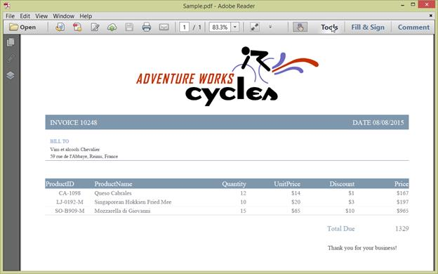

# Getting Started

## Creating a simple PDF document with basic elements

To create a simple PDF document with basic elements, the following assemblies have to be added as reference to the project.

      a. Syncfusion.Pdf.Base
      b. Syncfusion.Compression.Base

The following table shows the required namespace that needs to be added as well as their functionalities.

<table>
<tr>
<td>
**Namespace**  </td><td>
**Functionalities**  </td></tr>
<tr>
<td>
Syncfusion.Pdf  </td><td>
Required for creating a PDF from scratch, add pages, saving the PDF to disk or stream.  </td></tr>
<tr>
<td>
Syncfusion.Pdf.Graphics  </td><td>
Required for all basic graphics operations like drawing string, images, shapes etc.  </td></tr>
<tr>
<td>
Syncfusion.Pdf.Grid  </td><td>
Required for inserting a table in the PDF document.  </td></tr>
</table>
The **PdfDocument** object represents an entire PDF document that is being created. The following code example shows how to create a PDF document and add a page to it along with the page settings.


[C#]

//Creates a new PDF document
PdfDocument document = new PdfDocument();
//Adds page settings
document.PageSettings.Orientation = PdfPageOrientation.Landscape;
document.PageSettings.Margins.All = 50;
//Adds a page to the document
PdfPage page = document.Pages.Add();



[VB]

'Creates a new PDF document
Dim document As New PdfDocument()
'Adds page settings
document.PageSettings.Orientation = PdfPageOrientation.Landscape
document.PageSettings.Margins.All = 50
'Adds a page to the document
Dim page As PdfPage = document.Pages.Add()



1. Essential PDF has APIs similar to the .NET GDI plus which helps to draw elements to the PDF page just like 2D drawing in .NET. 
2. Unlike System.Drawing APIs all the units are measured in point instead of pixel. 
3. In PDF, all the elements are placed in absolute positions and has the possibility for content overlapping if misplaced. 
4. Essential PDF provides the rendered bounds for each and every elements added through PdfLayoutResult objects. This can be used to add successive elements and prevent content overlap.

The following code example explains how to add an image from disk to a PDF document, by providing the rectangle coordinates. 


[C#]

//Loads the image from disk
PdfImage img = PdfImage.FromFile("AdventureCycle.jpg");
//Draws the image to the PDF page
page.Graphics.DrawImage(img, new RectangleF(176, 0, 390, 130));




[VB]

'Loads the image from disk 
Dim img As PdfImage = PdfImage.FromFile("AdventureCycle.jpg")
'Draws the image to the PDF page
page.Graphics.DrawImage(img, New RectangleF(176, 0, 390, 130))



The following methods can be used to add text to a PDF document.

1. DrawString() method of the PdfGraphics
2. PdfTextElement class.

The PdfTextElement provides the layout result of the added text by using the location of the next element that decides to prevent content overlapping. This is not available in the DrawString method. 

The following code example adds the necessary text such as address, invoice number and date to create a basic invoice application. 


[C#]

PdfBrush solidBrush = new PdfSolidBrush(new PdfColor(126, 151, 173));
RectangleF bounds = new RectangleF(0, result.Bounds.Bottom + 90, graphics.ClientSize.Width, 30);
//Draws a rectangle to place the heading in that region.
graphics.DrawRectangle(solidBrush, bounds);
//Creates a font for adding the heading in the page
PdfFont subHeadingFont = new PdfStandardFont(PdfFontFamily.TimesRoman, 14);
//Creates a text element to add the invoice number
PdfTextElement element = new PdfTextElement("INVOICE " + id.ToString(), subHeadingFont);
element.Brush = PdfBrushes.White;

//Draws the heading on the page
result = element.Draw(page, new PointF(10, result.Bounds.Bottom + 98));
string currentDate = "DATE " + DateTime.Now.ToString("MM/dd/yyyy");
//Measures the width of the text to place it in the correct location
SizeF textSize = subHeadingFont.MeasureString(currentDate);
PointF textPosition = new PointF(graphics.ClientSize.Width - textSize.Width - 10, result.Bounds.Y);
//Draws the date by using DrawString method
graphics.DrawString(currentDate, subHeadingFont, element.Brush, textPosition);
PdfFont timesRoman = new PdfStandardFont(PdfFontFamily.TimesRoman, 10);
//Creates text elements to add the address and draw it to the page.
element = new PdfTextElement("BILL TO ", timesRoman);
element.Brush = new PdfSolidBrush(new PdfColor(126, 155, 203));
result = element.Draw(page, new PointF(10, result.Bounds.Bottom + 25));
PdfPen linePen = new PdfPen(new PdfColor(126, 151, 173), 0.70f);
PointF startPoint = new PointF(0, result.Bounds.Bottom + 3);
PointF endPoint = new PointF(graphics.ClientSize.Width, result.Bounds.Bottom + 3);
//Draws a line at the bottom of the address
graphics.DrawLine(linePen, startPoint, endPoint);




[VB]

Dim solidBrush As PdfBrush = New PdfSolidBrush(New PdfColor(126, 151, 173))
Dim bounds As New RectangleF(0, result.Bounds.Bottom + 90, graphics.ClientSize.Width, 30)
'Draws a rectangle to place the heading in that region.
graphics.DrawRectangle(solidBrush, bounds)
'Create a font for adding the heading in the page
Dim subHeadingFont As PdfFont = New PdfStandardFont(PdfFontFamily.TimesRoman, 14)
'Creates a text element to add the invoice number
Dim element As New PdfTextElement("INVOICE " + id.ToString(), subHeadingFont)
element.Brush = PdfBrushes.White

'Draws the heading on the page
result = element.Draw(page, New PointF(10, result.Bounds.Bottom + 98))
Dim currentDate As String = "DATE " + DateTime.Now.ToString("MM/dd/yyyy")
'Measures the width of the text to place it in the correct location
Dim textSize As SizeF = subHeadingFont.MeasureString(currentDate)
Dim textPosition As New PointF(graphics.ClientSize.Width - textSize.Width - 10, result.Bounds.Y)
'Draws the date by using DrawString method
graphics.DrawString(currentDate, subHeadingFont, element.Brush, textPosition)
Dim timesRoman As PdfFont = New PdfStandardFont(PdfFontFamily.TimesRoman, 10)
'Creates text elements to add the address and draw it to the page.
element = New PdfTextElement("BILL TO ", timesRoman)
element.Brush = New PdfSolidBrush(New PdfColor(126, 155, 203))
result = element.Draw(page, New PointF(10, result.Bounds.Bottom + 25))
Dim linePen As New PdfPen(New PdfColor(126, 151, 173), 0.7F)
Dim startPoint As New PointF(0, result.Bounds.Bottom + 3)
Dim endPoint As New PointF(graphics.ClientSize.Width, result.Bounds.Bottom + 3)
'Draws a line at the bottom of the address
graphics.DrawLine(linePen, startPoint, endPoint)



Essential PDF provides two types of table models. The difference between both the table models can be referred from the link <<<Link to PdfGrid vs PdfLightTable>>

Since the invoice document requires only simple cell customizations, the given code example explains how to create a simple invoice table by using PdfGrid.


[C#]

//Creates the datasource for the table
DataTable invoiceDetails = GetProductDetailsAsDataTable();
//Creates a PDF grid
PdfGrid grid = new PdfGrid();
//Adds the data source
grid.DataSource = invoiceDetails;
//Creates the grid cell styles
PdfGridCellStyle cellStyle = new PdfGridCellStyle();
cellStyle.Borders.All = PdfPens.White;
PdfGridRow header = grid.Headers[0];
//Creates the header style
PdfGridCellStyle headerStyle = new PdfGridCellStyle();
headerStyle.Borders.All = new PdfPen(new PdfColor(126, 151, 173));
headerStyle.BackgroundBrush = new PdfSolidBrush(new PdfColor(126, 151, 173));
headerStyle.TextBrush = PdfBrushes.White;
headerStyle.Font = new PdfStandardFont(PdfFontFamily.TimesRoman, 14f, PdfFontStyle.Regular);

//Adds cell customizations
for (int i = 0; i < header.Cells.Count; i++)
{
if (i == 0 || i == 1)
header.Cells[i].StringFormat = new PdfStringFormat(PdfTextAlignment.Left, PdfVerticalAlignment.Middle);
else
header.Cells[i].StringFormat = new PdfStringFormat(PdfTextAlignment.Right, PdfVerticalAlignment.Middle);
}

//Applies the header style
header.ApplyStyle(headerStyle);
cellStyle.Borders.Bottom = new PdfPen(new PdfColor(217, 217, 217), 0.70f);
cellStyle.Font = new PdfStandardFont(PdfFontFamily.TimesRoman, 12f);
cellStyle.TextBrush = new PdfSolidBrush(new PdfColor(131, 130, 136));
//Creates the layout format for grid
PdfGridLayoutFormat layoutFormat = new PdfGridLayoutFormat();
// Creates layout format settings to allow the table pagination
layoutFormat.Layout = PdfLayoutType.Paginate;
//Draws the grid to the PDF page.
PdfGridLayoutResult gridResult = grid.Draw(page, new RectangleF(new PointF(0, result.Bounds.Bottom + 40), new SizeF(g.ClientSize.Width, g.ClientSize.Height - 100)), layoutFormat);




[VB]

'Creates the datasource for the table
Dim invoiceDetails As DataTable = GetProductDetails(Integer.Parse(invoiceNumber))
'Create a PDF grid
Dim grid As New PdfGrid()
'Adds the data source
grid.DataSource = invoiceDetails
'creates the grid cell stlyes
Dim cellStyle As New PdfGridCellStyle()
cellStyle.Borders.All = PdfPens.White
Dim header As PdfGridRow = grid.Headers(0)
'Creates the header style
Dim headerStyle As New PdfGridCellStyle()
headerStyle.Borders.All = New PdfPen(New PdfColor(126, 151, 173))
headerStyle.BackgroundBrush = New PdfSolidBrush(New PdfColor(126, 151, 173))
headerStyle.TextBrush = PdfBrushes.White
headerStyle.Font = New PdfStandardFont(PdfFontFamily.TimesRoman, 14.0F, PdfFontStyle.Regular)
'Adds cell customizations
For i As Integer = 0 To header.Cells.Count - 1
If i = 0 OrElse i = 1 Then
header.Cells(i).StringFormat = New PdfStringFormat(PdfTextAlignment.Left, PdfVerticalAlignment.Middle)
Else
header.Cells(i).StringFormat = New PdfStringFormat(PdfTextAlignment.Right, PdfVerticalAlignment.Middle)
End If
Next
'Applies the header style
header.ApplyStyle(headerStyle)
cellStyle.Borders.Bottom = New PdfPen(New PdfColor(217, 217, 217), 0.7F)
cellStyle.Font = New PdfStandardFont(PdfFontFamily.TimesRoman, 12.0F)
cellStyle.TextBrush = New PdfSolidBrush(New PdfColor(131, 130, 136))
'Creates the layout format for grid
Dim layoutFormat As New PdfGridLayoutFormat()
'Layout format settings to allow the table pagination
layoutFormat.Layout = PdfLayoutType.Paginate
'Draws the grid to the PDF page.
Dim gridResult As PdfGridLayoutResult = grid.Draw(page, New RectangleF(New PointF(0, result.Bounds.Bottom + 40), New SizeF(g.ClientSize.Width, g.ClientSize.Height - 100)), layoutFormat)



The following code example shows how to save the invoice document to disk and dispose the PdfDocument object.


[C#]

//Saves and closes the document.
document.Save("Sample.pdf");
document.Close(true);




[VB]

'Saves and closes the document.
document.Save("Sample.pdf")
document.Close(True)



The following screenshot shows the invoice PDF document created by using Essential PDF.

## Filling forms

An interactive form, sometimes referred to as an AcroForm is a collection of fields for gathering information interactively from the user. A PDF document can contain any number of fields appearing in any combination of pages, all of that make a single, globally interactive form spanning the entire document.

Essential PDF allows you to create and manipulate existing form in PDF document. To work with existing form documents, the following namespaces are required.

1. Syncfusion.Pdf
2. Syncfusion.Pdf.Parsing

The following guide shows how to fill a sample PDF form as shown.

Essential PDF allows you to fill the form fields by using PdfLoadedField class. You can get the form field either by using its field name or field index.


[C#]

//Loads the PDF form.
PdfLoadedDocument loadedDocument = new PdfLoadedDocument(@"JobApplication.pdf");
//Loads the form
PdfLoadedForm form = loadedDocument.Form;
//Fills the textbox field by using index
(form.Fields[0] as PdfLoadedTextBoxField).Text = "John";
//Fills the textbox fields by using field name
(form.Fields["LastName"] as PdfLoadedTextBoxField).Text = "Doe";
(form.Fields["Address"] as PdfLoadedTextBoxField).Text = " John Doe \n 123 Main St \n Anytown, USA";
//Loads the radion button group
PdfLoadedRadioButtonItemCollection radioButtoncollection = (form.Fields["Gender"] as PdfLoadedRadioButtonListField).Items;
//Checks the 'Male' option
radioButtoncollection[0].Checked = true;
//Checks the 'business' checkbox field
(form.Fields["Business"] as PdfLoadedCheckBoxField).Checked = true;
//Checks the 'retiree' checkbox field
(form.Fields["Retiree"] as PdfLoadedCheckBoxField).Checked = true;
//Saves and closes the document
loadedDocument.Save("filledform.pdf");
loadedDocument.Close(true);




[VB]

'Loads the PDF form.
Dim loadedDocument As New PdfLoadedDocument("JobApplication.pdf")
'Load the form
Dim form As PdfLoadedForm = loadedDocument.Form
'Fills the textbox field by using index
TryCast(form.Fields(0), PdfLoadedTextBoxField).Text = "John"
'Fills the textbox fields by using field name
TryCast(form.Fields("LastName"), PdfLoadedTextBoxField).Text = "Doe"
TryCast(form.Fields("Address"), PdfLoadedTextBoxField).Text = " John Doe " & vbLf & " 123 Main St " & vbLf & " Anytown, USA"
'Load the radion button group
Dim radioButtoncollection As PdfLoadedRadioButtonItemCollection = TryCast(form.Fields("Gender"), PdfLoadedRadioButtonListField).Items
'Checks the 'Male' option
radioButtoncollection(0).Checked = True
'Checks the 'business' checkbox field
TryCast(form.Fields("Business"), PdfLoadedCheckBoxField).Checked = True
'Checks the 'retiree' checkbox field
TryCast(form.Fields("Retiree"), PdfLoadedCheckBoxField).Checked = True
'Saves and closes the document
loadedDocument.Save("filledform.pdf")
loadedDocument.Close(True)



The filled form is shown in adobe reader application as follows.

## Converting HTML contents to PDF

Essential PDF supports converting HTML contents to PDF. To add the HTML to PDF conversion functionality by using WebKit rendering engine, the following assemblies need to be added as reference to the project.

      a. Syncfusion.Compression.Base.dll
      b. Syncfusion.Pdf.Base.dll
      c. Syncfusion.HtmlConverter.Base.dll
      d. Syncfusion.WebKitHtmlConverter.Base.dll

The QtBinaries available in the WebKitHTMLConverter installed location __**($**____**Systemdrive**____**\**____**Program**__ __**Files**__ __**(**____**x86**____**)\**____**Syncfusion**____**\**____**WebKitHTMLConverter**____**\**____**xx**____**.**____**x**____**.**____**x**____**.**____**xx**____**\**____**QtBinaries**__) should be placed in the local machine where the conversion takes place. The physical path of this folder has been set to the **WebKitBinaryPath** property of the **WebkitHtmlConverter** class, as shown.


C#

// Creates a new instance of WebKitHtmlConverter class.
WebKitHtmlConverter html = new WebKitHtmlConverter();
string WebKitBinaryPath = "/QtBinaries/";
//WebKit assembly path
html.WebKitPath = WebKitBinaryPath;



For converting https sites, it requires OPENSSL libraries to be installed in the machine. You can install the OPENSSL library by downloading its setup from the following link,

X86 - [https://slproweb.com/download/Win32OpenSSL-1_0_2d.exe](https://slproweb.com/download/Win32OpenSSL-1_0_2d.exe# "")

X64 - [https://slproweb.com/download/Win64OpenSSL-1_0_2d.exe](https://slproweb.com/download/Win64OpenSSL-1_0_2d.exe# "")

WebKit conversion also requires VC++ 2010 redistributable to be installed in the machine. You can use the below mentioned download link,

X86 - [https://www.microsoft.com/en-in/download/details.aspx?id=5555](https://www.microsoft.com/en-in/download/details.aspx?id=5555# "")

X64 - [https://www.microsoft.com/en-in/download/details.aspx?id=14632](https://www.microsoft.com/en-in/download/details.aspx?id=14632# "")

To convert website URL or local html file to PDF by using WebKit rendering engine, refer to the following code example.


[C#]

//Creates a new PDF document.
PdfDocument document = new PdfDocument();
//Sets page margins.
document.PageSettings.Margins.All = 0;
PdfPage page = document.Pages.Add();
PdfUnitConvertor convertor = new PdfUnitConvertor();
float width = convertor.ConvertToPixels(document.PageSettings.Width, PdfGraphicsUnit.Point);
float height = convertor.ConvertToPixels(document.PageSettings.Height, PdfGraphicsUnit.Point);
// Creates a new instance of WebKitHtmlConverter class.
WebKitHtmlConverter html = new WebKitHtmlConverter();
string WebKitBinaryPath = "/QtBinaries/";
//WebKit assembly path
html.WebKitPath = WebKitBinaryPath;
// Converts to PDF document.
HtmlToPdfResult result = html.Convert("http://www.google.com" , (int)width, (int)height);
PdfMetafileLayoutFormat metafileFormat = new PdfMetafileLayoutFormat();
metafileFormat.Break = PdfLayoutBreakType.FitPage;
metafileFormat.Layout = PdfLayoutType.Paginate;
//Avoids splitting the text/images across the pages
metafileFormat.SplitTextLines = false;
metafileFormat.SplitImages = false;
// Draws metafile in PdfPage.
result.Render(page, metafileFormat);
// Saves and closes the document.
document.Save("Output.pdf");
document.Close(true);




[VB]

'Creates a new PDF document.
Dim document As New PdfDocument()
'Sets page margins.
document.PageSettings.Margins.All = 0
Dim page As PdfPage = document.Pages.Add()
Dim convertor As New PdfUnitConvertor()
Dim width As Single = convertor.ConvertToPixels(document.PageSettings.Width, PdfGraphicsUnit.Point)
Dim height As Single = convertor.ConvertToPixels(document.PageSettings.Height, PdfGraphicsUnit.Point)
' Creates a new instance of WebKitHtmlConverter class.
Dim html As New WebKitHtmlConverter()
Dim WebKitBinaryPath As String = "/QtBinaries/"
'WebKit assembly path
html.WebKitPath = WebKitBinaryPath
' Convert to PDF document.
Dim result As HtmlToPdfResult = html.Convert("http://www.google.com", CInt(width), CInt(height))
// Layout format for Metafile.
PdfMetafileLayoutFormat metafileFormat = new PdfMetafileLayoutFormat();
metafileFormat.Break = PdfLayoutBreakType.FitPage;
metafileFormat.Layout = PdfLayoutType.Paginate;
//Avoids splitting the text/images across the pages
metafileFormat.SplitTextLines = false;
metafileFormat.SplitImages = false;
// Draws metafile in PdfPage.
result.Render(page, metafileFormat);
' Saves and closes the document.
document.Save("Output.pdf")
document.Close(True)



To convert the HTML string to PDF, use the following code example.


[C#]

//Creates a new PDF document.
PdfDocument document = new PdfDocument();
//Sets page margins.
document.PageSettings.Margins.All = 0;
PdfPage page = document.Pages.Add();
PdfUnitConvertor convertor = new PdfUnitConvertor();
float width = convertor.ConvertToPixels(document.PageSettings.Width, PdfGraphicsUnit.Point);
float height = convertor.ConvertToPixels(document.PageSettings.Height, PdfGraphicsUnit.Point);
// Creates a new instance of WebKitHtmlConverter class.
WebKitHtmlConverter html = new WebKitHtmlConverter();
string WebKitBinaryPath = "/QtBinaries";
//WebKit assembly path
html.WebKitPath = WebKitBinaryPath;
string htmlText = @"<html><head><title></title></head><body>
Hello World!!!
</body></html>";
// Converts to PDF document.
HtmlToPdfResult result = html.Convert(htmlText,"", (int)width, (int)height);
PdfMetafileLayoutFormat metafileFormat = new PdfMetafileLayoutFormat();
metafileFormat.Break = PdfLayoutBreakType.FitPage;
metafileFormat.Layout = PdfLayoutType.Paginate;
//Avoids splitting the text/images across the pages
metafileFormat.SplitTextLines = false;
metafileFormat.SplitImages = false;
// Draws metafile in PdfPage.
result.Render(page, metafileFormat);
// Saves and closes the document.
document.Save("Sample.pdf");
document.Close(true);




[VB]

'Creates a new PDF document.
Dim document As New PdfDocument()
'Sets page margins.
document.PageSettings.Margins.All = 0
Dim page As PdfPage = document.Pages.Add()
Dim convertor As New PdfUnitConvertor()
Dim width As Single = convertor.ConvertToPixels(document.PageSettings.Width, PdfGraphicsUnit.Point)
Dim height As Single = convertor.ConvertToPixels(document.PageSettings.Height, PdfGraphicsUnit.Point)
'Creates a new instance of WebKitHtmlConverter class.
Dim html As New WebKitHtmlConverter()
Dim WebKitBinaryPath As String = "/QtBinaries"
'WebKit assembly path
html.WebKitPath = WebKitBinaryPath
Dim htmlText As String = "<html><head><title></title></head><body>
Hello World!!!
</body></html>"
'Converts to PDF document.
Dim result As HtmlToPdfResult = html.Convert(htmlText, "", CInt(width), CInt(height))
// Layout format for Metafile.
PdfMetafileLayoutFormat metafileFormat = new PdfMetafileLayoutFormat();
metafileFormat.Break = PdfLayoutBreakType.FitPage;
metafileFormat.Layout = PdfLayoutType.Paginate;
//Avoids splitting the text/images across the pages
metafileFormat.SplitTextLines = false;
metafileFormat.SplitImages = false;
// Draws metafile in PdfPage.
result.Render(page, metafileFormat);
'Saves and closes the document.
document.Save("Sample.pdf")
document.Close(True)



## Merge PDF Documents

Essential PDF supports merging multiple PDF documents from disk and stream. You can merge the multiple PDF document from disk by specifying the path of the documents in a string array.

Refer to the following code example to merge multiple documents from disk.


[C#]

//Creates the new PDF document
PdfDocument finalDoc = new PdfDocument();
// Creates a string array of source files to be merged.
string[] source = { "file1.pdf, file2.pdf" };
// Merges PDFDocument.
PdfDocument.Merge(finalDoc, source);
//Saves the final document
finalDoc.Save("Sample.pdf");
//closes the document
finalDoc.Close(true);




[VB]

'Creates the new PDF document
Dim finalDoc As New PdfDocument()
' Creates a string array of source files to be merged.
Dim source As String() = {"file1.pdf, file2.pdf"}
' Merges PDFDocument.
PdfDocument.Merge(finalDoc, source)
'Saves the final document
finalDoc.Save("Sample.pdf")
'closes the document
finalDoc.Close(True)



You can merge the PDF document streams by using the following code example.


[C#]

//Creates the detination document
PdfDocument finalDoc = new PdfDocument();
Stream stream1 = File.OpenRead("file1.pdf");
Stream stream2 = File.OpenRead("file2.pdf");
// Creates a PDF stream for merging.
Stream[] streams = { stream1, stream2 };
// Merges PDFDocument.
PdfDocumentBase.Merge(finalDoc, streams);
//Saves the document
finalDoc.Save("sample.pdf");
//closes the document
finalDoc.Close(true);




[VB]

'creates the detination document
Dim finalDoc As New PdfDocument()
Dim stream1 As Stream = File.OpenRead("file1.pdf")
Dim stream2 As Stream = File.OpenRead("file2.pdf")
' Creates a PDF stream for merging.
Dim streams As Stream() = {stream1, stream2}
' Merges PDFDocument.
PdfDocumentBase.Merge(finalDoc, streams)
'Saves the document
finalDoc.Save("sample.pdf")
'closes the document
finalDoc.Close(True)



