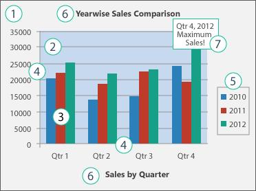

# Working with Charts

## Creating a Chart from scratch

An instance of **IOfficeChart** can be used to create or modify the charts in PowerPoint presentation. The following code example demonstrates creating a simple chart by adding data from scratch.


[C#]

//Creates a presentation instance

IPresentation presentation = Presentation.Create();

//Adds a blank slide to the presentation

ISlide slide = presentation.Slides.Add(SlideLayoutType.Blank);

//Adds chart to the slide with postion and size

IOfficeChart chart = slide.Charts.AddChart(100, 10, 700, 500);

//Specifies the chart title

chart.ChartTitle = "Sales Analysis";

//Sets chart data - Row1

chart.ChartData.SetValue(1, 2, "Jan");

chart.ChartData.SetValue(1, 3, "Feb");

chart.ChartData.SetValue(1, 4, "March");

//Sets chart data - Row2

chart.ChartData.SetValue(2, 1, "2010");

chart.ChartData.SetValue(2, 2, "60");

chart.ChartData.SetValue(2, 3, "70");

chart.ChartData.SetValue(2, 4, "80");

//Sets chart data - Row3

chart.ChartData.SetValue(3, 1, "2011");

chart.ChartData.SetValue(3, 2, "80");

chart.ChartData.SetValue(3, 3, "70");

chart.ChartData.SetValue(3, 4, "60");

//Sets chart data - Row4

chart.ChartData.SetValue(4, 1, "2012");

chart.ChartData.SetValue(4, 2, "60");

chart.ChartData.SetValue(4, 3, "70");

chart.ChartData.SetValue(4, 4, "80");

//Creates a new chart series with the name

IOfficeChartSerie serieJan = chart.Series.Add("Jan");

//Sets the data range of chart serie – start row, start column, end row, end column

serieJan.Values = chart.ChartData[2, 2, 4, 2];

//Creates a new chart series with the name

IOfficeChartSerie serieFeb = chart.Series.Add("Feb");

//Sets the data range of chart serie – start row, start column, end row, end column

serieFeb.Values = chart.ChartData[2, 3, 4, 3];

//Creates a new chart series with the name

IOfficeChartSerie serieMarch = chart.Series.Add("March");

//Sets the data range of chart series – start row, start column, end row, end column

serieMarch.Values = chart.ChartData[2, 4, 4, 4];

//Sets the data range of the category axis

chart.PrimaryCategoryAxis.CategoryLabels = chart.ChartData[2, 1, 4, 1];

//Specifies the chart type

chart.ChartType = OfficeChartType.Column_Clustered;

//Adds the third slide into the presentation

presentation.Save("sample.pptx");

//Closes the presentation

presentation.Close();




[VB.NET]

'Creates a presentation instance

Dim presentation_1 As IPresentation = Presentation.Create()

'Adds a blank slide to the presentation

Dim slide As ISlide = presentation_1.Slides.Add(SlideLayoutType.Blank)

'Adds chart to the slide with postion and size

Dim chart As IOfficeChart = slide.Charts.AddChart(100, 10, 700, 500)

'Specifies the chart title

chart.ChartTitle = "Sales Analysis"

'Sets chart data - Row1

chart.ChartData.SetValue(1, 2, "Jan")

chart.ChartData.SetValue(1, 3, "Feb")

chart.ChartData.SetValue(1, 4, "March")

'Sets chart data - Row2

chart.ChartData.SetValue(2, 1, "2010")

chart.ChartData.SetValue(2, 2, "60")

chart.ChartData.SetValue(2, 3, "70")

chart.ChartData.SetValue(2, 4, "80")

'Sets chart data - Row3

chart.ChartData.SetValue(3, 1, "2011")

chart.ChartData.SetValue(3, 2, "80")

chart.ChartData.SetValue(3, 3, "70")

chart.ChartData.SetValue(3, 4, "60")

'Sets chart data - Row4

chart.ChartData.SetValue(4, 1, "2012")

chart.ChartData.SetValue(4, 2, "60")

chart.ChartData.SetValue(4, 3, "70")

chart.ChartData.SetValue(4, 4, "80")

'Creates a new chart series with the name

Dim serieJan As IOfficeChartSerie = chart.Series.Add("Jan")

'Sets the data range of chart serie – start row, start column, end row, end column

serieJan.Values = chart.ChartData(2, 2, 4, 2)

'Creates a new chart series with the name

Dim serieFeb As IOfficeChartSerie = chart.Series.Add("Feb")

'Sets the data range of chart serie – start row, start column, end row, end column

serieFeb.Values = chart.ChartData(2, 3, 4, 3)

'Creates a new chart series with the name

Dim serieMarch As IOfficeChartSerie = chart.Series.Add("March")

'Sets the data range of chart series – start row, start column, end row, end column

serieMarch.Values = chart.ChartData(2, 4, 4, 4)

'Sets the data range of the category axis

chart.PrimaryCategoryAxis.CategoryLabels = chart.ChartData(2, 1, 4, 1)

'Specifies the chart type

chart.ChartType = OfficeChartType.Column_Clustered

'Adds the third slide into the presentation

presentation_1.Save("sample.pptx")

'Closes the presentation

presentation_1.Close()



## Creating charts from excel sheet

You can also create a chart with the data from an existing excel worksheet. The following code example demonstrates the same.


[C#]

//Creates a presentation instance

IPresentation presentation = Presentation.Create();

//Adds a blank slide to the presentation

ISlide slide = presentation.Slides.Add(SlideLayoutType.Blank);

//Gets the excel file as stream

MemoryStream excelStream = new MemoryStream(File.ReadAllBytes("Book1.xlsx"));

//Adds a chart to the slide with a data range from excel worksheet – excel workbook, worksheet number, Data range, position and size

IOfficeChart chart = slide.Charts.AddChart(excelStream, 1, "A1:D4", new RectangleF(100, 10, 700, 500));

//Saves the presentation

presentation.Save("output.pptx");

//Closes the presentation

presentation.Close();




[VB.NET]

'Creates a presentation instance

Dim presentation_1 As IPresentation = Presentation.Create()

'Adds a blank slide to the presentation

Dim slide As ISlide = presentation_1.Slides.Add(SlideLayoutType.Blank)

'Gets the excel file as stream

Dim excelStream As New MemoryStream(File.ReadAllBytes("Book1.xlsx"))

'Adds a chart to the slide with a data range from excel worksheet – excel workbook, worksheet number, Data range, position and size

Dim chart As IOfficeChart = slide.Charts.AddChart(excelStream, 1, "A1:D4", New RectangleF(100, 10, 700, 500))

'Saves the presentation

presentation_1.Save("output.pptx")

'Closes the presentation

presentation_1.Close()



## Creating Custom Charts 

Essential Presentation facilitates you to create custom charts by adding different charts series for a single chart. 

For example, you can use a Bar- clustered chart for the first data series and a scatter- line- marker chart for the second series. As a result, you can have a Bar- clustered chart, combined with a scatter- line- marker chart.

The following code example demonstrates creating custom charts.


[C#]

//Creates an instance of the IPresentation 

IPresentation presentation = Presentation.Create();

//Creates a new slide

ISlide slide = presentation.Slides.Add(SlideLayoutType.Blank);

//Adds a new chart in the slide by specifying its position & size as parameters.

IOfficeChart chart = slide.Charts.AddChart(100, 80, 500, 350);       

chart.ChartTitle = "Sales comparison";

chart.ChartTitleArea.Bold = true;

//Sets the data for chart– RowIndex, columnIndex & data

chart.ChartData.SetValue(1, 1, "Month");

chart.ChartData.SetValue(2, 1, "July");

chart.ChartData.SetValue(3, 1, "August");

chart.ChartData.SetValue(4, 1, "September");

chart.ChartData.SetValue(5, 1, "October");

chart.ChartData.SetValue(6, 1, "November");

chart.ChartData.SetValue(7, 1, "December");

chart.ChartData.SetValue(1, 2, "2013");

chart.ChartData.SetValue(2, 2, 35);

chart.ChartData.SetValue(3, 2, 47);

chart.ChartData.SetValue(4, 2, 30);

chart.ChartData.SetValue(5, 2, 29);

chart.ChartData.SetValue(6, 2, 25);

chart.ChartData.SetValue(7, 2, 30);

chart.ChartData.SetValue(1, 3, "2014");

chart.ChartData.SetValue(2, 3, 30);

chart.ChartData.SetValue(3, 3, 25);

chart.ChartData.SetValue(4, 3, 29);

chart.ChartData.SetValue(5, 3, 35);

chart.ChartData.SetValue(6, 3, 38);

chart.ChartData.SetValue(7, 3, 32);

chart.ChartData.SetValue(1, 4, "2015");

chart.ChartData.SetValue(2, 4, 35);

chart.ChartData.SetValue(3, 4, 37);

chart.ChartData.SetValue(4, 4, 30);

chart.ChartData.SetValue(5, 4, 29);

chart.ChartData.SetValue(6, 4, 25);

chart.ChartData.SetValue(7, 4, 30);

//Creates a new ChartSerie with the name

IOfficeChartSerie serie2013 = chart.Series.Add("2013");

//Sets the data range of chart serie start row, start column, end row, end column

serie2013.Values = chart.ChartData[2, 2, 7, 2];

serie2013.SerieType = OfficeChartType.Bar_Clustered;

IOfficeChartSerie serie2014 = chart.Series.Add("2014");

serie2014.Values = chart.ChartData[2, 3, 7, 3];

serie2014.SerieType = OfficeChartType.Scatter_Line_Markers;

//Saves the presentation

presentation.Save("Output_1.pptx");

//Closes the presentation

presentation.Close();




[VB.NET]

'Creates an instance of the IPresentation 

Dim presentation_1 As IPresentation = Presentation.Create()

'Creates a new slide

Dim slide As ISlide = presentation_1.Slides.Add(SlideLayoutType.Blank)

'Adds a new chart in the slide by specifying its position & size as parameters.

Dim chart As IOfficeChart = slide.Charts.AddChart(100, 80, 500, 350)

chart.ChartTitle = "Sales comparison"

chart.ChartTitleArea.Bold = True

'Sets the data for chart– RowIndex, columnIndex & data

chart.ChartData.SetValue(1, 1, "Month")

chart.ChartData.SetValue(2, 1, "July")

chart.ChartData.SetValue(3, 1, "August")

chart.ChartData.SetValue(4, 1, "September")

chart.ChartData.SetValue(5, 1, "October")

chart.ChartData.SetValue(6, 1, "November")

chart.ChartData.SetValue(7, 1, "December")

chart.ChartData.SetValue(1, 2, "2013")

chart.ChartData.SetValue(2, 2, 35)

chart.ChartData.SetValue(3, 2, 47)

chart.ChartData.SetValue(4, 2, 30)

chart.ChartData.SetValue(5, 2, 29)

chart.ChartData.SetValue(6, 2, 25)

chart.ChartData.SetValue(7, 2, 30)

chart.ChartData.SetValue(1, 3, "2014")

chart.ChartData.SetValue(2, 3, 30)

chart.ChartData.SetValue(3, 3, 25)

chart.ChartData.SetValue(4, 3, 29)

chart.ChartData.SetValue(5, 3, 35)

chart.ChartData.SetValue(6, 3, 38)

chart.ChartData.SetValue(7, 3, 32)

chart.ChartData.SetValue(1, 4, "2015")

chart.ChartData.SetValue(2, 4, 35)

chart.ChartData.SetValue(3, 4, 37)

chart.ChartData.SetValue(4, 4, 30)

chart.ChartData.SetValue(5, 4, 29)

chart.ChartData.SetValue(6, 4, 25)

chart.ChartData.SetValue(7, 4, 30)

'Creates a new ChartSerie with the name

Dim serie2013 As IOfficeChartSerie = chart.Series.Add("2013")

'Sets the data range of chart serie start row, start column, end row, end column

serie2013.Values = chart.ChartData(2, 2, 7, 2)

serie2013.SerieType = OfficeChartType.Bar_Clustered

Dim serie2014 As IOfficeChartSerie = chart.Series.Add("2014")

serie2014.Values = chart.ChartData(2, 3, 7, 3)

serie2014.SerieType = OfficeChartType.Scatter_Line_Markers

'Saves the presentation

presentation_1.Save("Output_1.pptx")

'Closes the presentation

presentation_1.Close()



The above code example creates a chart in the following screenshot.

<table>
<tr>
<td>
{{''| markdownify }}
    </td></tr>
</table>
## Refreshing the chart

Sometimes, the charts does not represent the actual data. In those cases, the charts in PowerPoint presentation should be refreshed.

The following code example demonstrates refreshing the charts in PowerPoint presentation. 


[C#]

//Opens the presentation

IPresentation presentation = Presentation.Open("Chart.pptx");

//Initializes the ChartToImageConverter class; this is mandatory

presentation.ChartToImageConverter = new ChartToImageConverter();

//Gets the first slide

ISlide slide = presentation.Slides[0];

//Gets the chart in slide

IOfficeChart chart = slide.Shapes[0] as IOfficeChart;

//Refreshes the chart

chart.Refresh();

//Saves the presentation

presentation.Save("output.pptx");

//Closes the presentation

presentation.Close();




[VB.NET]

'Opens the presentation

Dim presentation_1 As IPresentation = Presentation.Open("Chart.pptx")

'Initializes the ChartToImageConverter class; this is mandatory

presentation_1.ChartToImageConverter = New ChartToImageConverter()

'Gets the first slide

Dim slide As ISlide = presentation_1.Slides(0)

'Gets the chart in slide

Dim chart As IOfficeChart = TryCast(slide.Shapes(0), IOfficeChart)

'Refreshes the chart

chart.Refresh()

'Saves the presentation

presentation_1.Save("output.pptx")

'Closes the presentation

presentation_1.Close()



## Editing the Chart Data

You can change the data for an existing chart. The code example demonstrates modifying the chart in a slide.


[C#]

//Opens a presentation

IPresentation presentation = Presentation.Open("Sample.pptx");

//Adds a slide to the presentation

ISlide slide = presentation.Slides[0];

//Gets the chart in slide

IOfficeChart chart = slide.Shapes[0] as IOfficeChart;

//Modifies chart data - Row1

chart.ChartData.SetValue(1, 2, "Jan");

chart.ChartData.SetValue(1, 3, "Feb");

chart.ChartData.SetValue(1, 4, "March");

//Modifies chart data - Row2

chart.ChartData.SetValue(2, 1, "2010");

chart.ChartData.SetValue(2, 2, "60");

chart.ChartData.SetValue(2, 3, "70");

chart.ChartData.SetValue(2, 4, "80");

//Refreshes the chart

chart.Refresh();

//Saves the presentation

presentation.Save("output.pptx");

//Closes the presentation

presentation.Close();




[VB.NET]

'Opens a presentation

Dim presentation_1 As IPresentation = Presentation.Open("Sample.pptx")

'Adds a slide to the presentation

Dim slide As ISlide = presentation_1.Slides(0)

'Gets the chart in slide

Dim chart As IOfficeChart = TryCast(slide.Shapes(0), IOfficeChart)

'Modifies chart data - Row1

chart.ChartData.SetValue(1, 2, "Jan")

chart.ChartData.SetValue(1, 3, "Feb")

chart.ChartData.SetValue(1, 4, "March")

'Modifies chart data - Row2

chart.ChartData.SetValue(2, 1, "2010")

chart.ChartData.SetValue(2, 2, "60")

chart.ChartData.SetValue(2, 3, "70")

chart.ChartData.SetValue(2, 4, "80")

'Refreshes the chart

chart.Refresh()

'Saves the presentation

presentation_1.Save("output.pptx")

'Closes the presentation

presentation_1.Close()



## Customizing the chart

### Chart Basics

A chart is composed of various elements such as legends, axes, series, etc. Each chart element corresponds to an object. The following image illustrates the basic elements of a chart.

<table>
<tr>
<td>
{{''| markdownify }}
  </td></tr>
</table>
1. The chart area of the chart.
2. The plot area of the chart.
3. The data points of the data series that are plotted in the chart.
4. The horizontal (category) and vertical (value) axis along where the data is plotted in the chart.
5. The legend of the chart.
6. A chart and axis title that you can use in the chart.
7. A data label that you can use to identify the details of a data point in a data series.
### Modifying the Chart Appearance 

The appearance of a chart can be modified according to the convenience and usage. The following code example demonstrates modifying the chart element styles. 


[C#]

//Opens the presentation

IPresentation presentation = Presentation.Open("Sample.pptx");

//Initializes the ChartToImageConverter class; this is mandatory

presentation.ChartToImageConverter = new ChartToImageConverter();

//Gets the first slide

ISlide slide = presentation.Slides[0];

//Gets the chart in slide

IOfficeChart chart = slide.Shapes[0] as IOfficeChart;

//Modifies the chart height

chart.Height = 500;

//Modifies the chart width

Chart.Width = 700;

//Changes the title

chart.ChartTitle = "New title";

//Changes the serie name of first chart serie

chart.Series[0].Name = "Modified serie name";

//Hides the category labels

chart.CategoryLabelLevel = OfficeCategoriesLabelLevel.CategoriesLabelLevelNone;

//Shows Data Table.

chart.HasDataTable = true;

//Formats Chart Area.

IOfficeChartFrameFormat chartArea = chart.ChartArea;

//Chart Area Border Settings

//Style           

chartArea.Border.LinePattern = OfficeChartLinePattern.Solid;

//Color

chartArea.Border.LineColor = Color.Blue;

//Weight

chartArea.Border.LineWeight = OfficeChartLineWeight.Hairline;

//Chart Area Settings

//Fill Effects

chartArea.Fill.FillType = OfficeFillType.Gradient;

//Two Color

chartArea.Fill.GradientColorType = OfficeGradientColor.TwoColor;

//Sets two colors.

chartArea.Fill.BackColor = Color.FromArgb(205, 217, 234);

chartArea.Fill.ForeColor = Color.White;

//Plot Area

IOfficeChartFrameFormat chartPlotArea = chart.PlotArea;

//Plots Area Border Settings

//Style

chartPlotArea.Border.LinePattern = OfficeChartLinePattern.Solid;

//Color

chartPlotArea.Border.LineColor = Color.Blue;

//Weight

chartPlotArea.Border.LineWeight = OfficeChartLineWeight.Hairline;

//Fill Effects

chartPlotArea.Fill.FillType = OfficeFillType.Gradient;

//Two Color

chartPlotArea.Fill.GradientColorType = OfficeGradientColor.TwoColor;

//Sets two colors.

chartPlotArea.Fill.BackColor = Color.FromArgb(205, 217, 234);

chartPlotArea.Fill.ForeColor = Color.White;

//Saves the presentation

presentation.Save("Output.pptx");

//Closes the presentation

presentation.Close();




[VB.NET]

'Opens the presentation

Dim presentation_1 As IPresentation = Presentation.Open("Sample.pptx")

'Initializes the ChartToImageConverter class; this is mandatory

presentation_1.ChartToImageConverter = New ChartToImageConverter()

'Gets the first slide

Dim slide As ISlide = presentation_1.Slides(0)

'Gets the chart in slide

Dim chart__2 As IOfficeChart = TryCast(slide.Shapes(0), IOfficeChart)

'Modifies the chart height

chart__2.Height = 500

'Modifies the chart width

chart__2.Width = 700

'Changes the title

chart__2.ChartTitle = "New title"

'Changes the serie name of first chart serie

chart__2.Series(0).Name = "Modified serie name"

'Hides the category labels

chart__2.CategoryLabelLevel = OfficeCategoriesLabelLevel.CategoriesLabelLevelNone

'Shows Data Table.

chart__2.HasDataTable = True

'Formats Chart Area.

Dim chartArea As IOfficeChartFrameFormat = chart__2.ChartArea

'Chart Area Border Settings

'Style

chartArea.Border.LinePattern = OfficeChartLinePattern.Solid

'Color

chartArea.Border.LineColor = Color.Blue

'Weight

chartArea.Border.LineWeight = OfficeChartLineWeight.Hairline

'Chart Area Settings

'Fill Effects

chartArea.Fill.FillType = OfficeFillType.Gradient

'Two Color

chartArea.Fill.GradientColorType = OfficeGradientColor.TwoColor

'Sets two colors.

chartArea.Fill.BackColor = Color.FromArgb(205, 217, 234)

chartArea.Fill.ForeColor = Color.White

'Plots Area

Dim chartPlotArea As IOfficeChartFrameFormat = chart__2.PlotArea

'Plots Area Border Settings

'Style

chartPlotArea.Border.LinePattern = OfficeChartLinePattern.Solid

'Color

chartPlotArea.Border.LineColor = Color.Blue

'Weight

chartPlotArea.Border.LineWeight = OfficeChartLineWeight.Hairline

'Fill Effects

chartPlotArea.Fill.FillType = OfficeFillType.Gradient

'Two Color

chartPlotArea.Fill.GradientColorType = OfficeGradientColor.TwoColor

'Sets two colors.

chartPlotArea.Fill.BackColor = Color.FromArgb(205, 217, 234)

chartPlotArea.Fill.ForeColor = Color.White

'Saves the presentation

presentation_1.Save("Output.pptx")

'Closes the presentation

presentation_1.Close()



### Modifying the Plot and Legends of chart

The following code example demonstrates modifying the legend and plot areas of a chart.


[C#]

//Opens a presentation

IPresentation presentation = Presentation.Open("Sample.pptx");

//Gets the chart from the first slide

IOfficeChart chart = presentation.Slides[0].Charts[0] as IOfficeChart;

//Sets border settings

chart.PlotArea.Border.AutoFormat = false;

//Sets the auto line color

chart.PlotArea.Border.IsAutoLineColor = false;

//Sets the border line color

chart.PlotArea.Border.LineColor = Color.Blue;

//Sets the border line pattern

chart.PlotArea.Border.LinePattern = OfficeChartLinePattern.DashDot;

//Sets the border line weight

chart.PlotArea.Border.LineWeight = OfficeChartLineWeight.Wide;

//Sets the border transparency

chart.PlotArea.Border.Transparency = 0.6;

//Sets the plot area’s fill type

chart.PlotArea.Fill.FillType = OfficeFillType.SolidColor;

//Sets the plot area’s fill color

chart.PlotArea.Fill.ForeColor = Color.LightPink;

//Sets the plot area shodow presence

chart.PlotArea.Shadow.ShadowInnerPresets = Office2007ChartPresetsInner.InsideDiagonalTopLeft;

//Sets the legend position

chart.Legend.Position = OfficeLegendPosition.Left;

//Sets the layout inclusion

chart.Legend.IncludeInLayout = true;

//Sets the legend border format

chart.Legend.FrameFormat.Border.AutoFormat = false;

//Sets the legend border auto line color

chart.Legend.FrameFormat.Border.IsAutoLineColor = false;

//Sets the border line color

chart.Legend.FrameFormat.Border.LineColor = Color.Blue;

//Sets the border line pattern

chart.Legend.FrameFormat.Border.LinePattern = OfficeChartLinePattern.DashDot;

//Sets the legend border line weight

chart.Legend.FrameFormat.Border.LineWeight = OfficeChartLineWeight.Wide;

//Sets the text area font weight

chart.Legend.TextArea.Bold = true;

//Sets the legend text area forecolor

chart.Legend.TextArea.Color = OfficeKnownColors.Bright_green;

//Sets the legend text area font name

chart.Legend.TextArea.FontName = "Times New Roman";

//Sets the legend text area font size

chart.Legend.TextArea.Size = 20;

//Sets the legend text area' strike through

chart.Legend.TextArea.Strikethrough = true;

//Modifies the legend entry

chart.Legend.LegendEntries[0].IsDeleted = true;

//Modifies the legend layout height

chart.Legend.Layout.Height = 200;

//Modifies the legend layout height mode

chart.Legend.Layout.HeightMode = LayoutModes.factor;

//Modifies the legend layout left position

chart.Legend.Layout.Left = 100;

//Modifies the legend layout left mode

chart.Legend.Layout.LeftMode = LayoutModes.factor;

//Modifies the legend layout top position

chart.Legend.Layout.Top = 100;

//Modifies the legend layout top mode

chart.Legend.Layout.TopMode = LayoutModes.factor;

//Modifies the legend layout width

chart.Legend.Layout.Width = 300;

//Modifies the legend layout width mode

chart.Legend.Layout.WidthMode = LayoutModes.factor;

//Saves the presentation

presentation.Save("ModifiedChart.pptx");

//Closes the presentation

presentation.Close();




[VB.NET]

'Opens a presentation

Dim presentation_1 As IPresentation = Presentation.Open("Sample.pptx")

'Gets the chart from the first slide

Dim chart As IOfficeChart = TryCast(presentation_1.Slides(0).Charts(0), IOfficeChart)

'Sets border settings

chart.PlotArea.Border.AutoFormat = False

'Sets the auto line color

chart.PlotArea.Border.IsAutoLineColor = False

'Sets the border line color

chart.PlotArea.Border.LineColor = Color.Blue

'Sets the border line pattern

chart.PlotArea.Border.LinePattern = OfficeChartLinePattern.DashDot

'Sets the border line weight

chart.PlotArea.Border.LineWeight = OfficeChartLineWeight.Wide

'Sets the border transparency

chart.PlotArea.Border.Transparency = 0.6

'Sets the plot area’s fill type

chart.PlotArea.Fill.FillType = OfficeFillType.SolidColor

'Sets the plot area’s fill color

chart.PlotArea.Fill.ForeColor = Color.LightPink

'Sets the plot area shodow presence

chart.PlotArea.Shadow.ShadowInnerPresets = Office2007ChartPresetsInner.InsideDiagonalTopLeft

'Sets the legend position

chart.Legend.Position = OfficeLegendPosition.Left

'Sets the layout inclusion

chart.Legend.IncludeInLayout = True

'Sets the legend border format

chart.Legend.FrameFormat.Border.AutoFormat = False

'Sets the legend border auto line color

chart.Legend.FrameFormat.Border.IsAutoLineColor = False

'Sets the border line color

chart.Legend.FrameFormat.Border.LineColor = Color.Blue

'Sets the border line pattern

chart.Legend.FrameFormat.Border.LinePattern = OfficeChartLinePattern.DashDot

'Sets the legend border line weight

chart.Legend.FrameFormat.Border.LineWeight = OfficeChartLineWeight.Wide

'Sets the text area font weight

chart.Legend.TextArea.Bold = True

'Sets the legend text area forecolor

chart.Legend.TextArea.Color = OfficeKnownColors.Bright_green

'Sets the legend text area font name

chart.Legend.TextArea.FontName = "Times New Roman"

'Sets the legend text area font size

chart.Legend.TextArea.Size = 20

'Sets the legend text area' strike through

chart.Legend.TextArea.Strikethrough = True

'Modifies the legend entry

chart.Legend.LegendEntries(0).IsDeleted = True

'Modifies the legend layout height

chart.Legend.Layout.Height = 200

'Modifies the legend layout height mode

chart.Legend.Layout.HeightMode = LayoutModes.factor

'Modifies the legend layout left position

chart.Legend.Layout.Left = 100

'Modifies the legend layout left mode

chart.Legend.Layout.LeftMode = LayoutModes.factor

'Modifies the legend layout top position

chart.Legend.Layout.Top = 100

'Modifies the legend layout top mode

chart.Legend.Layout.TopMode = LayoutModes.factor

'Modifies the legend layout width

chart.Legend.Layout.Width = 300

'Modifies the legend layout width mode

chart.Legend.Layout.WidthMode = LayoutModes.factor

'Saves the presentation

presentation_1.Save("ModifiedChart.pptx")

'Closes the presentation

presentation_1.Close()



### Positioning Chart Elements

The following code examples illustrate how to position the different chart elements.


[C#]

IPresentation presentation = Presentation.Create();

ISlide slide = presentation.Slides.Add(SlideLayoutType.Blank);

//Adds chart to slide

IOfficeChart chart = slide.Shapes.AddChart(100, 120, 500, 300);

//Sets the data range of chart

chart.DataRange = chart.ChartData[1, 2, 4, 3];

//Sets data to the chart- RowIndex, columnIndex & data

chart.ChartData.SetValue(1, 2, "2012");

chart.ChartData.SetValue(2, 2, 330);

chart.ChartData.SetValue(3, 2, 490);

chart.ChartData.SetValue(4, 2, 700);

chart.ChartType = OfficeChartType.Area;

//Edge: Specifies that the width or Height is interpreted as right or bottom of the chart element.

//Factor: Specifies that the width or Height is interpreted as the width or height of the chart element.

chart.PlotArea.Layout.LeftMode = LayoutModes.auto;

chart.PlotArea.Layout.TopMode = LayoutModes.factor;

//Value in points should not be a negative value when LayoutMode is Edge

//It can be a negative value when the LayoutMode is Factor.

chart.ChartTitleArea.Layout.Left = 10;

chart.ChartTitleArea.Layout.Top = 100;

//Manually positions chart plot area

chart.PlotArea.Layout.LayoutTarget = LayoutTargets.outer;

chart.PlotArea.Layout.LeftMode = LayoutModes.edge;

chart.PlotArea.Layout.TopMode = LayoutModes.edge;

//Manually positions chart legend 

chart.Legend.Layout.LeftMode = LayoutModes.factor;

chart.Legend.Layout.TopMode = LayoutModes.factor;

//Saves the presentation

presentation.Save("Output.pptx");

//Closes the presentation

presentation.Close();




[VB.NET]

Dim presentation_1 As IPresentation = Presentation.Create()

Dim slide As ISlide = presentation_1.Slides.Add(SlideLayoutType.Blank)

'Adds chart to slide

Dim chart As IOfficeChart = slide.Shapes.AddChart(100, 120, 500, 300)

'Sets the data range of chart

chart.DataRange = chart.ChartData(1, 2, 4, 3)

'Sets data to the chart- RowIndex, columnIndex & data

chart.ChartData.SetValue(1, 2, "2012")

chart.ChartData.SetValue(2, 2, 330)

chart.ChartData.SetValue(3, 2, 490)

chart.ChartData.SetValue(4, 2, 700)

chart.ChartType = OfficeChartType.Area

'Edge: Specifies that the width or Height is interpreted as right or bottom of the chart element.

'Factor: Specifies that the width or Height is interpreted as the width or height of the chart element.

chart.PlotArea.Layout.LeftMode = LayoutModes.auto

chart.PlotArea.Layout.TopMode = LayoutModes.factor

'Value in points should not be a negative value when LayoutMode is Edge

'It can be a negative value when the LayoutMode is Factor.

chart.ChartTitleArea.Layout.Left = 10

chart.ChartTitleArea.Layout.Top = 100

'Manually positions chart plot area

chart.PlotArea.Layout.LayoutTarget = LayoutTargets.outer

chart.PlotArea.Layout.LeftMode = LayoutModes.edge

chart.PlotArea.Layout.TopMode = LayoutModes.edge

'Manually positions chart legend

chart.Legend.Layout.LeftMode = LayoutModes.factor

chart.Legend.Layout.TopMode = LayoutModes.factor

'Saves the presentation

presentation_1.Save("Output.pptx")

'Closes the presentation

presentation_1.Close()



## Applying 3D Formats

Essential Presentation allows you to modify side wall, back wall, and floor settings of a 3-D chart. The following code example explains how to apply these settings to a 3-D chart.


[C#]

//Opens the presentation

IPresentation presentation = Presentation.Open("Sample.pptx");

//Gets the first slide

ISlide slide = presentation.Slides[0];

//Gets the chart in slide

IOfficeChart chart = slide.Shapes[0] as IOfficeChart;

//Changes the chart type to 3D

chart.ChartType = OfficeChartType.Bar_Clustered_3D;

//Sets the rotation

chart.Rotation = 80;

//Sets the shadow angle

chart.SideWall.Shadow.Angle = 60;

//Sets the backwall border weight

chart.BackWall.Border.LineWeight = OfficeChartLineWeight.Narrow;

//Saves the presentation

presentation.Save("output.pptx");

//Closes the presentation

presentation.Close();




[VB.NET]

'Opens the presentation

Dim presentation_1 As IPresentation = Presentation.Open("Sample.pptx")

'Gets the first slide

Dim slide As ISlide = presentation_1.Slides(0)

'Gets the chart in slide

Dim chart As IOfficeChart = TryCast(slide.Shapes(0), IOfficeChart)

'Changes the chart type to 3D

chart.ChartType = OfficeChartType.Bar_Clustered_3D

'Sets the rotation

chart.Rotation = 80

'Sets the shadow angle

chart.SideWall.Shadow.Angle = 60

'Sets the backwall border weight

chart.BackWall.Border.LineWeight = OfficeChartLineWeight.Narrow

'Saves the presentation

presentation_1.Save("output.pptx")

'Closes the presentation

presentation_1.Close()



## Chart to Image conversion

The following code example demonstrates converting the charts in a presentation slide to image.


[C#]

//Opens the presentation

IPresentation presentation = Presentation.Open("Sample.pptx");

//Initializes the ChartToImageConverter class; this is mandatory

presentation.ChartToImageConverter = new ChartToImageConverter();

//Sets the scaling mode for quality

presentation.ChartToImageConverter.ScalingMode = Syncfusion.OfficeChart.ScalingMode.Best;

//Gets the first slide

ISlide slide = presentation.Slides[0];

//Gets the chart in slide

IOfficeChart chart = slide.Shapes[0] as IOfficeChart;

//Creates a stream instance to store the image

MemoryStream stream = new MemoryStream();

//Saves the image to stream

chart.SaveAsImage(stream);

//Saves the stream to a file

using (FileStream fileStream = File.Create("ChartImage.png", (int)stream.Length))

fileStream.Write(stream.ToArray(), 0, stream.ToArray().Length);

//Closes the stream

stream.Close(); 

//Saves the Presentation

presentation.Save("output.pptx");

//Closes the presentation

presentation.Close();




[VB.NET]

'Opens the presentation

Dim presentation_1 As IPresentation = Presentation.Open("Sample.pptx")

'Initializes the ChartToImageConverter class; this is mandatory

presentation_1.ChartToImageConverter = New ChartToImageConverter()

'Sets the scaling mode for quality

presentation_1.ChartToImageConverter.ScalingMode = Syncfusion.OfficeChart.ScalingMode.Best

'Gets the first slide

Dim slide As ISlide = presentation_1.Slides(0)

'Gets the chart in slide

Dim chart As IOfficeChart = TryCast(slide.Shapes(0), IOfficeChart)

'Creates a stream instance to store the image

Dim stream As New MemoryStream()

'Saves the image to stream

chart.SaveAsImage(stream)

'Saves the stream to a file

Using fileStream As FileStream = File.Create("ChartImage.png", CInt(stream.Length))

fileStream.Write(stream.ToArray(), 0, stream.ToArray().Length)

End Using

'Closes the stream

stream.Close()

'Saves the Presentation

presentation_1.Save("output.pptx")

'Closes the presentation

presentation_1.Close()



## Removing the chart from slide

The following code example demonstrates removing a chart from a slide.


[C#]

//Opens the presentation

IPresentation presentation = Presentation.Open("Sample.pptx");

//Gets the first slide

ISlide slide = presentation.Slides[0];

//Gets the chart in slide

IOfficeChart chart = slide.Shapes[0] as IOfficeChart;

//Removes the chart from slide

slide.Shapes.Remove(chart as IShape);

//Saves the Presentation

presentation.Save("output.pptx");

//Closes the presentation

presentation.Close();




[VB.NET]

'Opens the presentation

Dim presentation_1 As IPresentation = Presentation.Open("Sample.pptx")

'Gets the first slide

Dim slide As ISlide = presentation_1.Slides(0)

'Gets the chart in slide

Dim chart As IOfficeChart = TryCast(slide.Shapes(0), IOfficeChart)

'Removes the chart from slide

slide.Shapes.Remove(TryCast(chart, IShape))

'Saves the Presentation

presentation_1.Save("output.pptx")

'Closes the presentation

presentation_1.Close()



## Supported Chart Types 

The following Chart types are supported in Presentation.

* Area
* Area_3D
* Area_Stacked
* Area_Stacked_100
* Area_Stacked_100_3D
* Area_Stacked_3D
* Bar_Clustered
* Bar_Clustered_3D
* Bar_Stacked
* Bar_Stacked_100
* Bar_Stacked_100_3D
* Bar_Stacked_3D
* Bubble
* Bubble_3D
* Column_3D
* Column_Clustered
* Column_Clustered_3D
* Column_Stacked
* Column_Stacked_100
* Column_Stacked_100_3D
* Column_Stacked_3D
* Combination_Chart
* Cone_Bar_Clustered
* Cone_Bar_Stacked
* Cone_Bar_Stacked_100
* Cone_Clustered
* Cone_Clustered_3D
* Cone_Stacked
* Cone_Stacked_100
* Cylinder_Bar_Clustered
* Cylinder_Bar_Stacked
* Cylinder_Bar_Stacked_100
* Cylinder_Clustered
* Cylinder_Clustered_3D
* Cylinder_Stacked
* Cylinder_Stacked_100
* Doughnut
* Doughnut_Exploded
* Line
* Line_3D
* Line_Markers
* Line_Markers_Stacked
* Line_Markers_Stacked_100
* Line_Stacked
* Line_Stacked_100
* Pie
* Pie_3D
* Pie_Bar
* Pie_Exploded
* Pie_Exploded_3D
* PieOfPie
* Pyramid_Bar_Clustered
* Pyramid_Bar_Stacked
* Pyramid_Bar_Stacked_100
* Pyramid_Clustered
* Pyramid_Clustered_3D
* Pyramid_Stacked
* Pyramid_Stacked_100
* Radar
* Radar_Filled
* Radar_Markers
* Scatter_Line
* Scatter_Line_Markers
* Scatter_Markers
* Scatter_SmoothedLine
* Scatter_SmoothedLine_Markers
* Stock_HighLowClose
* Stock_OpenHighLowClose
* Stock_VolumeHighLowClose
* Stock_VolumeOpenHighLowClose
* Surface_3D
* Surface_Contour
* Surface_NoColor_3D
* Surface_NoColor_Contour

